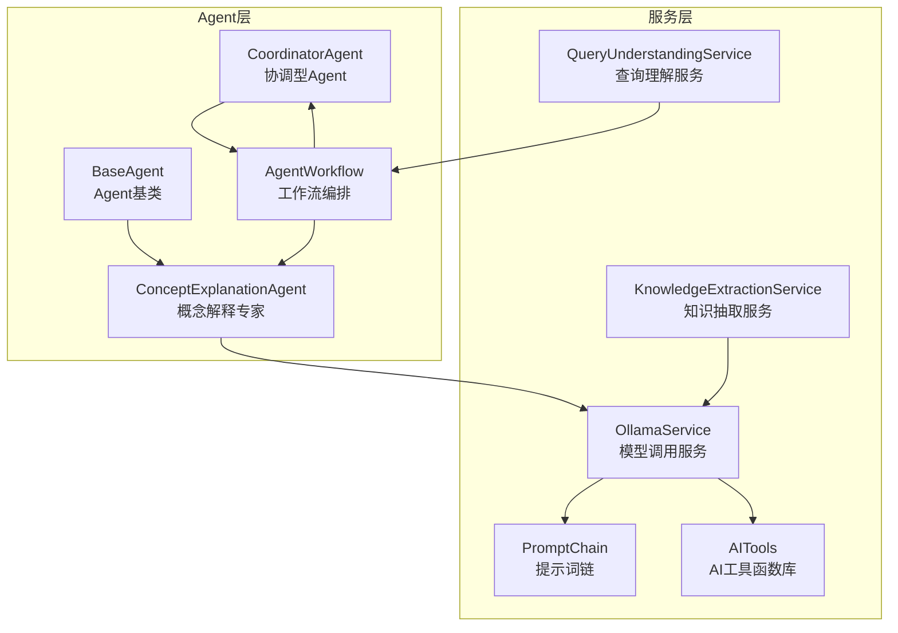
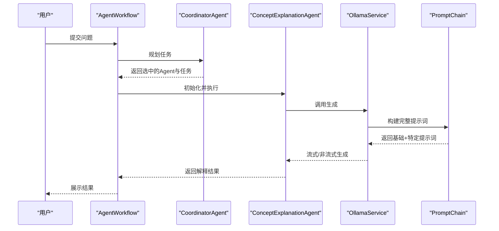
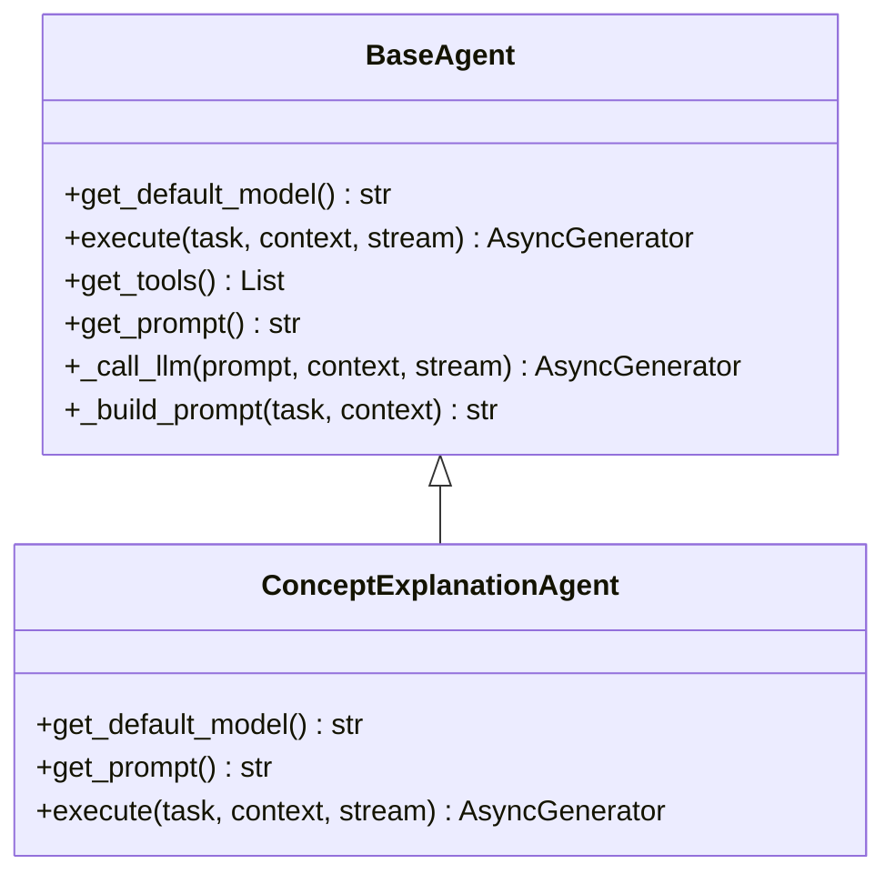
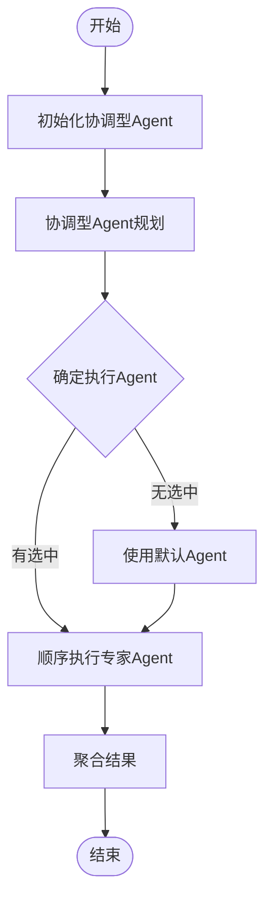
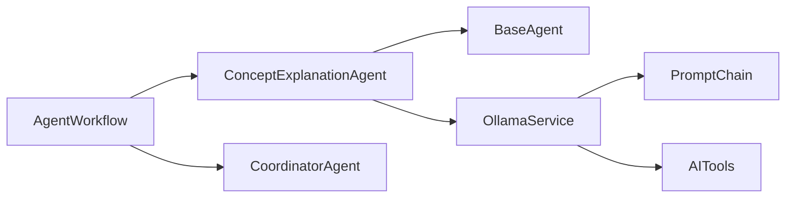

# 概念解释Agent

<cite>
**本文引用的文件**
- [concept_explanation_agent.py](file://agents/experts/concept_explanation_agent.py)
- [base_agent.py](file://agents/base/base_agent.py)
- [agent_workflow.py](file://agents/workflow/agent_workflow.py)
- [prompt_chain.py](file://services/prompt_chain.py)
- [ollama_service.py](file://services/ollama_service.py)
- [coordinator_agent.py](file://agents/coordinator/coordinator_agent.py)
- [query_understanding_service.py](file://services/query_understanding_service.py)
- [knowledge_extraction_service.py](file://services/knowledge_extraction_service.py)
- [ai_tools.py](file://services/ai_tools.py)
</cite>

## 目录
1. [简介](#简介)
2. [项目结构](#项目结构)
3. [核心组件](#核心组件)
4. [架构总览](#架构总览)
5. [详细组件分析](#详细组件分析)
6. [依赖关系分析](#依赖关系分析)
7. [性能考量](#性能考量)
8. [故障排查指南](#故障排查指南)
9. [结论](#结论)
10. [附录](#附录)

## 简介
概念解释Agent是Advanced RAG系统中的专家级Agent，专注于深入解释专业概念，特别是物理学领域的概念。它通过系统提示词设计，将抽象概念转化为易于理解的语言；通过知识结构化处理流程，实现概念分类、关系建立与层次组织；并通过与其他Agent的协作，提供高质量的概念解释与学习辅助。

## 项目结构
概念解释Agent位于agents/experts目录下，采用面向对象设计，继承自BaseAgent基类，遵循统一的Agent接口规范。其工作流由AgentWorkflow编排，配合协调型Agent（CoordinatorAgent）进行任务规划与分发。

**图表来源**
- [concept_explanation_agent.py:1-70](file://agents/experts/concept_explanation_agent.py#L1-L70)
- [base_agent.py:1-122](file://agents/base/base_agent.py#L1-L122)
- [agent_workflow.py:1-388](file://agents/workflow/agent_workflow.py#L1-L388)
- [prompt_chain.py:1-450](file://services/prompt_chain.py#L1-L450)
- [ollama_service.py:1-674](file://services/ollama_service.py#L1-L674)
- [coordinator_agent.py:1-252](file://agents/coordinator/coordinator_agent.py#L1-L252)
- [query_understanding_service.py:1-248](file://services/query_understanding_service.py#L1-L248)
- [knowledge_extraction_service.py:1-229](file://services/knowledge_extraction_service.py#L1-L229)
- [ai_tools.py:1-498](file://services/ai_tools.py#L1-L498)

**章节来源**
- [concept_explanation_agent.py:1-70](file://agents/experts/concept_explanation_agent.py#L1-L70)
- [base_agent.py:1-122](file://agents/base/base_agent.py#L1-L122)
- [agent_workflow.py:1-388](file://agents/workflow/agent_workflow.py#L1-L388)

## 核心组件
- 概念解释Agent（ConceptExplanationAgent）：负责深入解释专业概念，提供定义、物理意义、公式、应用示例与概念关系。
- Agent基类（BaseAgent）：定义Agent通用接口、提示词构建与LLM调用封装。
- 协调型Agent（CoordinatorAgent）：分析用户问题，智能选择所需专家Agent并分配任务。
- Agent工作流（AgentWorkflow）：编排多Agent协作，管理Agent生命周期与状态反馈。
- 提示词链（PromptChain）：组合基础提示词与助手特定提示词，形成完整的系统提示。
- Ollama服务（OllamaService）：封装模型调用，支持流式与非流式生成，构建完整提示词。
- 查询理解服务（QueryUnderstandingService）：将自然语言查询转换为结构化搜索条件。
- 知识抽取服务（KnowledgeExtractionService）：从文本中抽取实体-关系-实体三元组，构建知识图谱。
- AI工具函数库（AITools）：提供系统信息、知识库状态等工具函数，支持提示词中的工具调用。

**章节来源**
- [concept_explanation_agent.py:7-70](file://agents/experts/concept_explanation_agent.py#L7-L70)
- [base_agent.py:8-122](file://agents/base/base_agent.py#L8-L122)
- [coordinator_agent.py:7-252](file://agents/coordinator/coordinator_agent.py#L7-L252)
- [agent_workflow.py:47-388](file://agents/workflow/agent_workflow.py#L47-L388)
- [prompt_chain.py:6-450](file://services/prompt_chain.py#L6-L450)
- [ollama_service.py:9-674](file://services/ollama_service.py#L9-L674)
- [query_understanding_service.py:9-248](file://services/query_understanding_service.py#L9-L248)
- [knowledge_extraction_service.py:12-229](file://services/knowledge_extraction_service.py#L12-L229)
- [ai_tools.py:11-498](file://services/ai_tools.py#L11-L498)

## 架构总览
概念解释Agent的执行流程如下：用户输入问题，协调型Agent进行任务规划，工作流编排器选择并初始化概念解释Agent，概念解释Agent通过提示词链与Ollama服务生成解释内容，最终以流式或非流式方式返回结果。

**图表来源**
- [agent_workflow.py:106-336](file://agents/workflow/agent_workflow.py#L106-L336)
- [coordinator_agent.py:55-168](file://agents/coordinator/coordinator_agent.py#L55-L168)
- [concept_explanation_agent.py:25-68](file://agents/experts/concept_explanation_agent.py#L25-L68)
- [ollama_service.py:50-93](file://services/ollama_service.py#L50-L93)
- [prompt_chain.py:386-431](file://services/prompt_chain.py#L386-L431)

## 详细组件分析

### 概念解释Agent（ConceptExplanationAgent）
- 专业能力
  - 知识组织：围绕概念定义、物理意义、公式与定律、应用示例、概念关系五个维度组织内容。
  - 概念梳理：通过系统提示词明确任务边界，确保解释结构化与完整性。
  - 表达优化：结合提示词链与Ollama服务，输出符合前端渲染规范的文本与公式。
  - 复杂概念简化：通过类比与示例降低理解门槛，兼顾初学者与专业人士需求。
- 系统提示词设计
  - 角色定位：明确为“概念解释专家”，专门深入解释物理学专业概念。
  - 任务清单：定义五大任务目标，确保解释的系统性与完整性。
- 响应生成逻辑
  - 流式输出：逐块生成文本，前端可实时展示。
  - 完成信号：聚合完成后返回完整内容与置信度。
  - 错误处理：捕获异常并返回标准化错误信息。
- 质量保证机制
  - 置信度：返回固定置信度，便于上层决策。
  - 日志记录：记录执行过程与异常，便于追踪与调试。

**图表来源**
- [base_agent.py:8-122](file://agents/base/base_agent.py#L8-L122)
- [concept_explanation_agent.py:7-70](file://agents/experts/concept_explanation_agent.py#L7-L70)

**章节来源**
- [concept_explanation_agent.py:7-70](file://agents/experts/concept_explanation_agent.py#L7-L70)
- [base_agent.py:27-122](file://agents/base/base_agent.py#L27-L122)

### Agent工作流（AgentWorkflow）
- 编排策略
  - 延迟初始化：按需获取Agent配置并实例化，避免不必要的资源消耗。
  - 协调优先：先由协调型Agent规划，再顺序执行专家Agent，确保前端进度可视化。
  - 状态反馈：在流式输出中持续发送Agent状态，包括pending、running、completed、error等。
- 模型选择策略
  - 数据库配置：优先从数据库读取Agent配置，若失败则回退至默认配置。
  - 统一模型：当前实现中，专家Agent统一使用工作流传入的llm_model。
- 响应生成逻辑
  - 顺序执行：为保证前端进度展示，专家Agent按顺序执行。
  - 结果聚合：收集所有Agent结果，返回汇总信息。
- 质量保证机制
  - 有效性校验：过滤无效Agent类型，确保执行列表合法。
  - 异常捕获：对单个Agent执行失败进行隔离，不影响整体流程。

**图表来源**
- [agent_workflow.py:106-336](file://agents/workflow/agent_workflow.py#L106-L336)

**章节来源**
- [agent_workflow.py:47-388](file://agents/workflow/agent_workflow.py#L47-L388)

### 协调型Agent（CoordinatorAgent）
- 任务规划
  - 专家Agent映射：维护可用专家Agent清单与职责说明。
  - 智能选择：基于关键词与JSON解析结果选择必要Agent，避免过度调用。
  - 任务分配：为每个Agent生成具体任务描述与执行顺序。
- 响应生成逻辑
  - JSON规划：返回选中Agent列表、任务描述与选择理由。
  - 备降策略：当JSON解析失败时，使用关键词匹配进行默认选择。
- 质量保证机制
  - 有效性验证：过滤无效Agent类型，确保规划结果合法。
  - 日志记录：记录规划过程与选择依据，便于审计与优化。

**章节来源**
- [coordinator_agent.py:7-252](file://agents/coordinator/coordinator_agent.py#L7-L252)

### 提示词链（PromptChain）
- 基础提示词
  - 通用角色：定义物理课程AI助手的角色定位、回答原则、格式要求与工具使用。
  - 结构化回答：强调标题分段、要点列表、步骤编号、对比表格等格式。
  - 数学公式：要求使用KaTeX兼容的LaTeX格式，确保前端正确渲染。
- 助手特定提示词
  - 扩展细化：将助手特定提示词作为扩展追加到基础提示词，形成完整系统提示。
  - 语言要求：统一要求中文回答，确保跨语言输入的一致性。
- 质量保证机制
  - 数据库优先：优先从数据库读取自定义基础提示词，若失败则使用默认值。
  - 长度控制：记录基础、特定与总长度，便于监控与优化。

**章节来源**
- [prompt_chain.py:6-450](file://services/prompt_chain.py#L6-L450)

### Ollama服务（OllamaService）
- 提示词构建
  - 基础+特定：通过提示词链构建完整提示词，支持助手特定提示词。
  - 上下文整合：将检索知识、对话历史、文档信息与知识库状态整合进提示词。
  - 工具调用：支持在提示词中嵌入工具函数调用，动态获取实时数据。
- 生成模式
  - 流式生成：适用于长文本与复杂推理，前端可实时展示。
  - 非流式生成：适用于简短回复与快速响应。
- 质量保证机制
  - 超时控制：设置较长超时时间，适应大模型生成需求。
  - 线程安全：在异步环境中使用线程池执行同步IO，避免阻塞事件循环。
  - 错误处理：捕获HTTP与连接异常，提供清晰的错误信息。

**章节来源**
- [ollama_service.py:9-674](file://services/ollama_service.py#L9-L674)

### 查询理解服务（QueryUnderstandingService）
- 结构化提取
  - 关键字段：研究领域、用户类型、技能、学院、专业、兴趣、意图描述。
  - JSON输出：要求返回标准JSON格式，便于后续处理。
- 备降策略
  - 关键词匹配：当JSON解析失败时，使用关键词提取作为备降方案。
  - 语义识别：识别教师、学生等关键词，自动标注用户类型。
- 质量保证机制
  - 规范化：统一字段类型与格式，确保输出一致性。
  - 日志记录：记录解析失败与备降触发原因，便于优化提示模板。

**章节来源**
- [query_understanding_service.py:9-248](file://services/query_understanding_service.py#L9-L248)

### 知识抽取服务（KnowledgeExtractionService）
- 三元组抽取
  - 实体类型：Concept、Technology、Person、Organization、Location、Event、Other。
  - 关系规范：简洁明了，避免冗余与歧义。
- 图谱构建
  - Neo4j集成：将抽取的三元组存入图数据库，支持实体与关系查询。
  - 冷却机制：连接失败时进行冷却，避免频繁错误日志。
- 质量保证机制
  - JSON解析：支持标准JSON与Markdown代码块两种格式。
  - 类型修复：尝试修复常见JSON错误，提升鲁棒性。

**章节来源**
- [knowledge_extraction_service.py:12-229](file://services/knowledge_extraction_service.py#L12-L229)

### AI工具函数库（AITools）
- 工具注册
  - 模型列表：获取可用Ollama推理模型列表。
  - 知识库文档：获取知识库文档列表与统计信息。
  - 系统信息：获取当前使用的模型与知识库状态。
- 异步调用
  - 事件循环：在已有事件循环中使用异步调用，避免跨loop问题。
  - 参数过滤：仅保留工具schema中声明的参数，防止误传。
- 质量保证机制
  - 错误处理：捕获调用异常并返回错误信息。
  - 日志记录：记录工具调用过程与结果，便于审计与优化。

**章节来源**
- [ai_tools.py:11-498](file://services/ai_tools.py#L11-L498)

## 依赖关系分析
概念解释Agent的依赖关系如下：继承BaseAgent获得统一接口与提示词构建能力；通过OllamaService调用模型；通过PromptChain获取完整提示词；通过AgentWorkflow与CoordinatorAgent协同工作。

**图表来源**
- [concept_explanation_agent.py:1-70](file://agents/experts/concept_explanation_agent.py#L1-L70)
- [base_agent.py:1-122](file://agents/base/base_agent.py#L1-L122)
- [ollama_service.py:1-674](file://services/ollama_service.py#L1-L674)
- [prompt_chain.py:1-450](file://services/prompt_chain.py#L1-L450)
- [agent_workflow.py:1-388](file://agents/workflow/agent_workflow.py#L1-L388)
- [coordinator_agent.py:1-252](file://agents/coordinator/coordinator_agent.py#L1-L252)
- [ai_tools.py:1-498](file://services/ai_tools.py#L1-L498)

**章节来源**
- [concept_explanation_agent.py:1-70](file://agents/experts/concept_explanation_agent.py#L1-L70)
- [base_agent.py:1-122](file://agents/base/base_agent.py#L1-L122)
- [ollama_service.py:1-674](file://services/ollama_service.py#L1-L674)
- [prompt_chain.py:1-450](file://services/prompt_chain.py#L1-L450)
- [agent_workflow.py:1-388](file://agents/workflow/agent_workflow.py#L1-L388)
- [coordinator_agent.py:1-252](file://agents/coordinator/coordinator_agent.py#L1-L252)
- [ai_tools.py:1-498](file://services/ai_tools.py#L1-L498)

## 性能考量
- 模型选择
  - 概念解释Agent默认使用高参数规模模型，确保解释质量与复杂度处理能力。
  - AgentWorkflow支持从数据库读取配置，实现灵活的模型切换与资源调度。
- 流式生成
  - OllamaService支持流式生成，前端可实时展示，提升交互体验。
  - AgentWorkflow在流式输出中持续发送状态，便于用户感知进度。
- 超时与稳定性
  - OllamaService设置较长超时时间，适应大模型生成需求。
  - 线程池执行同步IO，避免阻塞事件循环，提升并发性能。
- 资源控制
  - 协调型Agent仅选择必要Agent，避免过度调用造成资源浪费。
  - AgentWorkflow对无效Agent类型进行过滤，确保执行列表合法。

[本节为通用性能讨论，无需特定文件来源]

## 故障排查指南
- 概念解释失败
  - 检查Ollama服务连接状态与模型可用性。
  - 查看日志中异常堆栈，确认提示词构建与生成过程。
  - 确认AgentWorkflow中是否正确初始化并执行。
- 协调型Agent规划失败
  - 检查JSON解析是否成功，必要时启用关键词匹配备降策略。
  - 验证Agent类型有效性，确保在映射表中存在。
- 提示词链构建失败
  - 确认数据库中基础提示词是否存在，若不存在则使用默认值。
  - 检查助手特定提示词格式，确保为扩展而非完整系统提示。
- Ollama服务异常
  - 检查超时设置与线程池状态，避免阻塞事件循环。
  - 确认工具函数调用格式，name属性必须为实际工具函数名称。
- 查询理解失败
  - 检查JSON解析与备降策略触发原因，优化提示模板。
  - 确认关键词匹配逻辑，提升语义识别准确性。

**章节来源**
- [concept_explanation_agent.py:62-68](file://agents/experts/concept_explanation_agent.py#L62-L68)
- [coordinator_agent.py:130-135](file://agents/coordinator/coordinator_agent.py#L130-L135)
- [prompt_chain.py:18-30](file://services/prompt_chain.py#L18-L30)
- [ollama_service.py:453-637](file://services/ollama_service.py#L453-L637)
- [query_understanding_service.py:116-134](file://services/query_understanding_service.py#L116-L134)

## 结论
概念解释Agent通过系统化的提示词设计与结构化处理流程，实现了对复杂概念的深入解释与表达优化。其与协调型Agent、工作流编排、提示词链、Ollama服务及工具函数库的协同，形成了高效、稳定、可扩展的概念解释体系。在实际应用中，建议结合查询理解服务与知识抽取服务，进一步提升概念解释的准确性与知识组织能力。

[本节为总结性内容，无需特定文件来源]

## 附录
- 使用案例
  - 学术概念解释：针对复杂物理概念提供定义、意义、公式、示例与关系。
  - 技术术语简化：将专业术语转化为通俗易懂的语言，辅以类比与实例。
  - 理论框架梳理：将理论框架拆分为子概念，建立层级关系与关联。
- 最佳实践
  - 与协调型Agent配合：通过规划阶段选择必要专家，避免过度调用。
  - 利用提示词链：在基础提示词基础上添加助手特定提示，提升针对性。
  - 结合工具函数：在提示词中嵌入工具调用，获取实时系统与知识库信息。
  - 流式输出优化：前端实时展示，提升用户体验与交互效率。

[本节为概念性内容，无需特定文件来源]