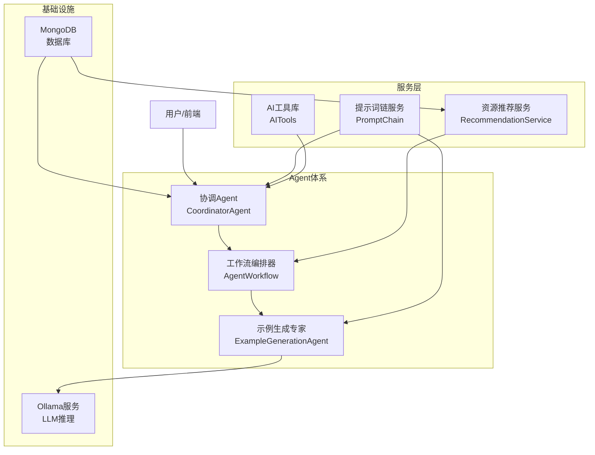
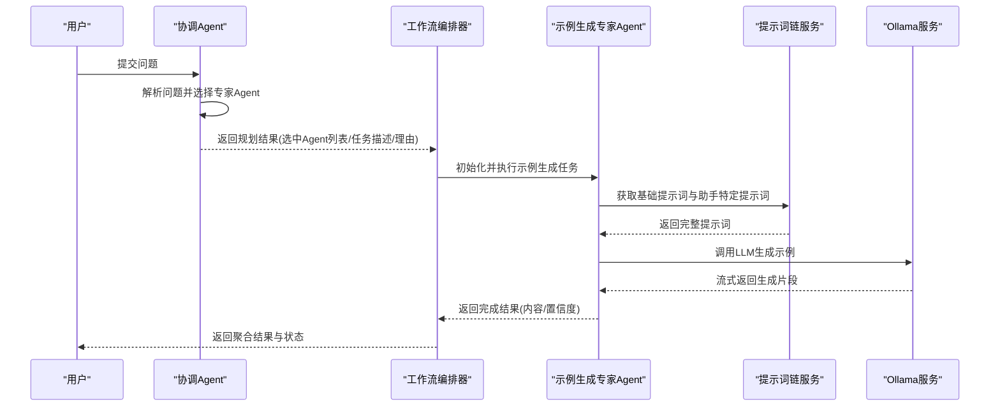
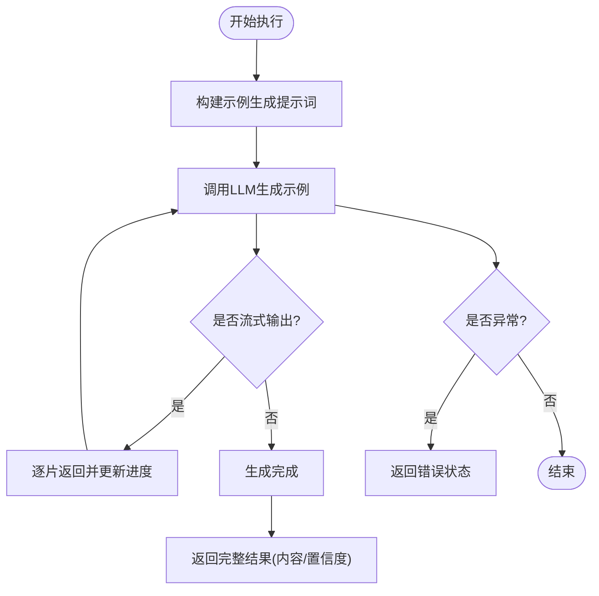
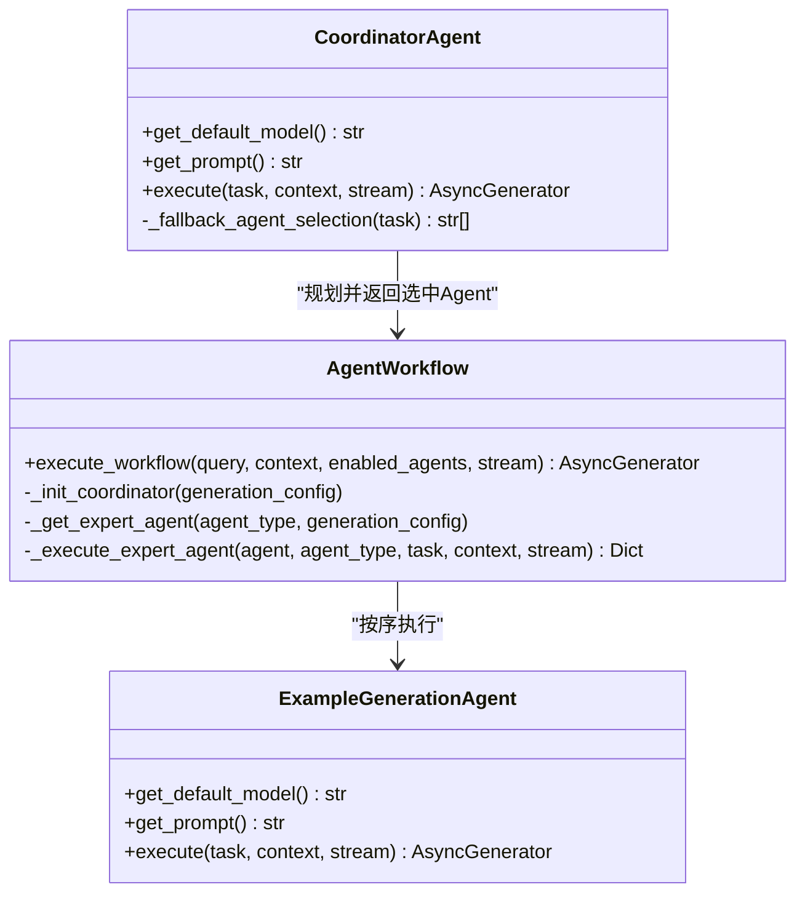
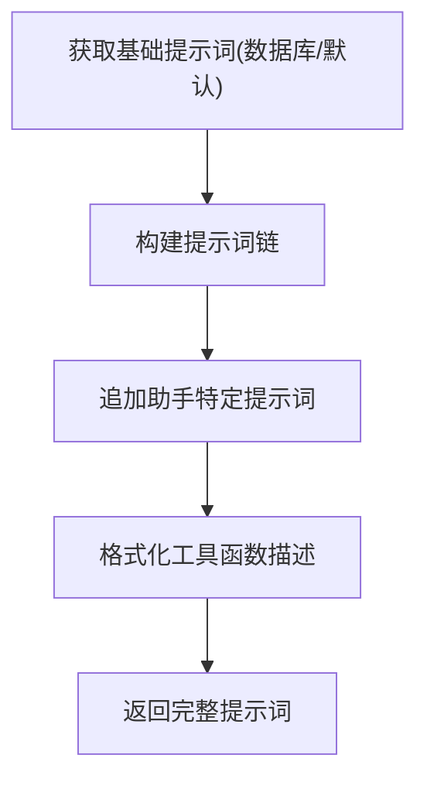
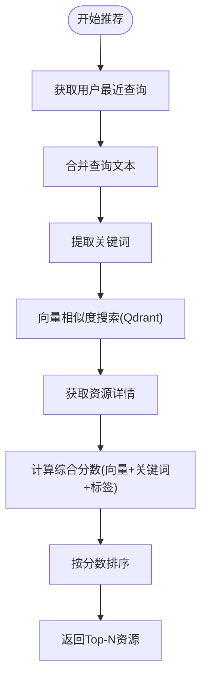
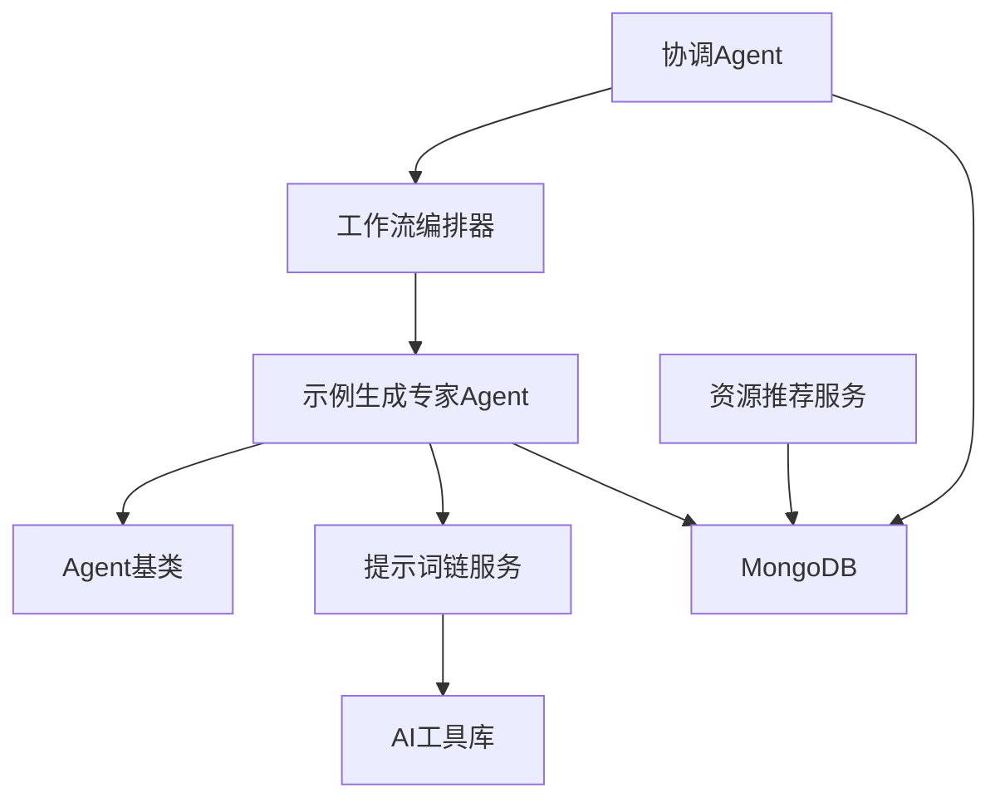

# 示例生成Agent

<cite>
**本文档引用的文件**
- [example_generation_agent.py](file://agents/experts/example_generation_agent.py)
- [base_agent.py](file://agents/base/base_agent.py)
- [agent_workflow.py](file://agents/workflow/agent_workflow.py)
- [coordinator_agent.py](file://agents/coordinator/coordinator_agent.py)
- [prompt_chain.py](file://services/prompt_chain.py)
- [recommendation_service.py](file://services/recommendation_service.py)
- [ai_tools.py](file://services/ai_tools.py)
- [mongodb.py](file://database/mongodb.py)
- [chat.py](file://routers/chat.py)
</cite>

## 目录
1. [简介](#简介)
2. [项目结构](#项目结构)
3. [核心组件](#核心组件)
4. [架构总览](#架构总览)
5. [详细组件分析](#详细组件分析)
6. [依赖关系分析](#依赖关系分析)
7. [性能考量](#性能考量)
8. [故障排查指南](#故障排查指南)
9. [结论](#结论)
10. [附录](#附录)

## 简介
本文件面向“示例生成Agent”的技术文档，聚焦其在创意生成与模板应用方面的能力，包括实例构造、场景模拟、模式识别、变体生成等特性。文档详细说明系统提示词设计、需求分析、模板匹配、内容扩展与质量控制机制，并提供编程示例、教学案例、产品演示等应用案例。同时解释模板库管理、变体生成策略与示例质量评估方法，并给出与学习系统的集成方式与个性化示例推荐机制。

## 项目结构
示例生成Agent位于专家Agent体系中，与协调Agent、工作流编排器、提示词链、推荐服务、数据库等模块协同工作，形成端到端的示例生成流水线。

图示来源
- [agent_workflow.py:47-104](file://agents/workflow/agent_workflow.py#L47-L104)
- [coordinator_agent.py:7-53](file://agents/coordinator/coordinator_agent.py#L7-L53)
- [example_generation_agent.py:7-22](file://agents/experts/example_generation_agent.py#L7-L22)
- [prompt_chain.py:6-449](file://services/prompt_chain.py#L6-L449)
- [recommendation_service.py:11-481](file://services/recommendation_service.py#L11-L481)
- [ai_tools.py:11-498](file://services/ai_tools.py#L11-L498)
- [mongodb.py:92-200](file://database/mongodb.py#L92-L200)

章节来源
- [agent_workflow.py:47-104](file://agents/workflow/agent_workflow.py#L47-L104)
- [coordinator_agent.py:7-53](file://agents/coordinator/coordinator_agent.py#L7-L53)
- [example_generation_agent.py:7-22](file://agents/experts/example_generation_agent.py#L7-L22)
- [prompt_chain.py:6-449](file://services/prompt_chain.py#L6-L449)
- [recommendation_service.py:11-481](file://services/recommendation_service.py#L11-L481)
- [ai_tools.py:11-498](file://services/ai_tools.py#L11-L498)
- [mongodb.py:92-200](file://database/mongodb.py#L92-L200)

## 核心组件
- 示例生成专家Agent：负责根据用户需求生成实际应用示例，支持简单到复杂的多层次示例输出。
- 协调Agent：分析用户问题，智能选择所需专家Agent并分配任务。
- 工作流编排器：组织多Agent协作，提供状态反馈与结果聚合。
- 提示词链服务：构建基础提示词与助手特定提示词的叠加，确保角色定位、回答原则、工具使用等基础能力。
- 资源推荐服务：基于关键词、标签与向量相似度的混合算法，提供个性化资源推荐。
- 数据库与配置：通过MongoDB存储Agent配置、系统配置、资源与对话历史等数据。

章节来源
- [example_generation_agent.py:7-68](file://agents/experts/example_generation_agent.py#L7-L68)
- [coordinator_agent.py:7-252](file://agents/coordinator/coordinator_agent.py#L7-L252)
- [agent_workflow.py:47-388](file://agents/workflow/agent_workflow.py#L47-L388)
- [prompt_chain.py:6-449](file://services/prompt_chain.py#L6-L449)
- [recommendation_service.py:11-481](file://services/recommendation_service.py#L11-L481)
- [mongodb.py:92-200](file://database/mongodb.py#L92-L200)

## 架构总览
示例生成Agent在整体架构中的位置如下：
- 用户输入经由协调Agent进行任务规划，工作流编排器按需调度示例生成专家Agent。
- 示例生成专家Agent通过提示词链服务构建系统提示词，结合上下文与任务描述生成示例。
- 输出结果通过工作流编排器聚合，支持流式状态反馈与最终结果返回。

图示来源
- [coordinator_agent.py:55-160](file://agents/coordinator/coordinator_agent.py#L55-L160)
- [agent_workflow.py:106-336](file://agents/workflow/agent_workflow.py#L106-L336)
- [example_generation_agent.py:24-66](file://agents/experts/example_generation_agent.py#L24-L66)
- [prompt_chain.py:386-431](file://services/prompt_chain.py#L386-L431)

章节来源
- [coordinator_agent.py:55-160](file://agents/coordinator/coordinator_agent.py#L55-L160)
- [agent_workflow.py:106-336](file://agents/workflow/agent_workflow.py#L106-L336)
- [example_generation_agent.py:24-66](file://agents/experts/example_generation_agent.py#L24-L66)
- [prompt_chain.py:386-431](file://services/prompt_chain.py#L386-L431)

## 详细组件分析

### 示例生成专家Agent
- 角色定位：专门生成实际应用示例，涵盖简单到复杂场景，提供数值计算与物理意义说明。
- 系统提示词设计：强调“实际应用示例”“数值计算”“物理意义”“多类型示例”，确保输出贴近真实场景。
- 执行流程：
  - 构建示例生成提示词，明确要求输出简单、中等、复杂示例及完整解题过程。
  - 调用LLM生成，支持流式输出，逐步返回片段并更新进度。
  - 返回完成结果，包含内容、Agent类型与置信度。
  - 错误处理：捕获异常并返回错误状态。

图示来源
- [example_generation_agent.py:24-66](file://agents/experts/example_generation_agent.py#L24-L66)

章节来源
- [example_generation_agent.py:7-68](file://agents/experts/example_generation_agent.py#L7-L68)

### 协调Agent与工作流编排器
- 协调Agent职责：分析问题复杂度与需求，智能选择必要专家Agent，分配具体任务并说明理由。
- 工作流编排器职责：按选中Agent顺序执行，提供状态反馈（pending/running/completed/error）、进度与完成聚合。
- Agent类型映射：示例生成专家Agent在映射表中注册，支持动态加载与配置缓存。

图示来源
- [coordinator_agent.py:7-252](file://agents/coordinator/coordinator_agent.py#L7-L252)
- [agent_workflow.py:47-388](file://agents/workflow/agent_workflow.py#L47-L388)
- [example_generation_agent.py:7-68](file://agents/experts/example_generation_agent.py#L7-L68)

章节来源
- [coordinator_agent.py:7-252](file://agents/coordinator/coordinator_agent.py#L7-L252)
- [agent_workflow.py:47-388](file://agents/workflow/agent_workflow.py#L47-L388)
- [example_generation_agent.py:7-68](file://agents/experts/example_generation_agent.py#L7-L68)

### 提示词链服务
- 基础提示词：定义通用物理课程AI助手的角色、职责、回答原则、格式要求、工具函数使用等。
- 助手特定提示词：作为扩展与细化，追加在基础提示词之后，实现“通用能力 + 特定课程方向”的叠加。
- 工具函数描述：动态注入AI工具函数Schema，确保Agent可调用系统信息、知识库状态等实时数据。

图示来源
- [prompt_chain.py:9-431](file://services/prompt_chain.py#L9-L431)
- [ai_tools.py:113-121](file://services/ai_tools.py#L113-L121)

章节来源
- [prompt_chain.py:9-431](file://services/prompt_chain.py#L9-L431)
- [ai_tools.py:113-121](file://services/ai_tools.py#L113-L121)

### 资源推荐服务
- 混合算法：关键词匹配（jieba提取）、标签匹配、向量相似度（Qdrant），综合打分并排序。
- 个性化推荐：基于用户最近查询历史，提取关键词并结合向量搜索与关键词匹配，返回Top-N资源。
- 相似资源推荐：根据资源标题、描述、标签与向量相似度，推荐与之相关的其他资源。

图示来源
- [recommendation_service.py:209-357](file://services/recommendation_service.py#L209-L357)

章节来源
- [recommendation_service.py:11-481](file://services/recommendation_service.py#L11-L481)

### 数据库与配置
- MongoDB连接：支持URI与环境变量两种方式，配置连接池参数以提升高并发性能。
- Agent配置：通过集合存储Agent类型与推理/嵌入模型配置，工作流编排器按需加载。
- 系统配置：基础提示词可存储于系统配置集合，支持动态更新与回退默认值。

章节来源
- [mongodb.py:92-200](file://database/mongodb.py#L92-L200)
- [agent_workflow.py:18-44](file://agents/workflow/agent_workflow.py#L18-L44)
- [prompt_chain.py:10-31](file://services/prompt_chain.py#L10-L31)

## 依赖关系分析
- 示例生成专家Agent依赖Agent基类，继承通用接口与LLM调用能力。
- 协调Agent与工作流编排器共同决定示例生成专家Agent的执行时机与上下文。
- 提示词链服务为协调Agent与示例生成专家Agent提供统一的系统提示词。
- 资源推荐服务与数据库交互，为个性化推荐提供支撑。
- AI工具库为提示词链服务提供工具函数Schema，增强Agent的系统信息获取能力。

图示来源
- [example_generation_agent.py:3-4](file://agents/experts/example_generation_agent.py#L3-L4)
- [base_agent.py:8-25](file://agents/base/base_agent.py#L8-L25)
- [coordinator_agent.py:3-4](file://agents/coordinator/coordinator_agent.py#L3-L4)
- [agent_workflow.py:7-16](file://agents/workflow/agent_workflow.py#L7-L16)
- [prompt_chain.py:36-38](file://services/prompt_chain.py#L36-L38)
- [ai_tools.py:11-18](file://services/ai_tools.py#L11-L18)
- [recommendation_service.py:3-6](file://services/recommendation_service.py#L3-L6)
- [mongodb.py:92-98](file://database/mongodb.py#L92-L98)

章节来源
- [example_generation_agent.py:3-4](file://agents/experts/example_generation_agent.py#L3-L4)
- [base_agent.py:8-25](file://agents/base/base_agent.py#L8-L25)
- [coordinator_agent.py:3-4](file://agents/coordinator/coordinator_agent.py#L3-L4)
- [agent_workflow.py:7-16](file://agents/workflow/agent_workflow.py#L7-L16)
- [prompt_chain.py:36-38](file://services/prompt_chain.py#L36-L38)
- [ai_tools.py:11-18](file://services/ai_tools.py#L11-L18)
- [recommendation_service.py:3-6](file://services/recommendation_service.py#L3-L6)
- [mongodb.py:92-98](file://database/mongodb.py#L92-L98)

## 性能考量
- 流式输出：示例生成专家Agent支持流式输出，前端可实时显示进度与中间结果，提升用户体验。
- 缓存与延迟初始化：工作流编排器对Agent配置与实例进行缓存，减少重复初始化开销。
- 数据库连接池：MongoDB连接池参数优化，提升高并发下的稳定性与吞吐量。
- 向量搜索阈值：资源推荐服务使用Qdrant进行向量搜索，设置合理阈值以平衡召回与性能。

## 故障排查指南
- 示例生成失败：检查LLM服务可用性与网络连接，查看Agent日志中的异常堆栈。
- 协调Agent规划失败：确认提示词格式与JSON解析逻辑，必要时启用后备Agent选择逻辑。
- 提示词链构建异常：检查基础提示词与助手特定提示词的拼接逻辑，确保中文回答要求正确追加。
- 资源推荐无结果：确认Qdrant服务健康状态与向量集合存在，检查关键词提取与标签匹配逻辑。
- 数据库连接失败：核对MONGODB_URI/MONGODB_HOST等环境变量，确认连接池参数与认证信息。

章节来源
- [example_generation_agent.py:60-66](file://agents/experts/example_generation_agent.py#L60-L66)
- [coordinator_agent.py:130-135](file://agents/coordinator/coordinator_agent.py#L130-L135)
- [prompt_chain.py:412-414](file://services/prompt_chain.py#L412-L414)
- [recommendation_service.py:173-177](file://services/recommendation_service.py#L173-L177)
- [mongodb.py:168-184](file://database/mongodb.py#L168-L184)

## 结论
示例生成Agent通过系统化的提示词设计、智能的协调与编排、以及个性化的资源推荐，实现了从需求分析到示例生成的闭环。其支持多层级示例输出、流式状态反馈与质量控制，能够满足编程示例、教学案例、产品演示等多种应用场景的需求。配合学习系统的个性化推荐机制，可进一步提升示例的针对性与学习效果。

## 附录

### 应用案例
- 编程示例：根据问题生成对应语言的示例代码与注释，说明算法思路与边界条件。
- 教学案例：提供课堂讲解所需的实例，包含物理意义、公式推导与数值计算步骤。
- 产品演示：生成产品使用场景的示例，帮助用户理解功能与最佳实践。

### 模板库管理与变体生成策略
- 模板库：可将常见示例模板存储于数据库，按主题分类与版本管理。
- 变体生成：基于模板与参数化替换，生成不同难度与场景的变体；结合关键词与标签进行匹配与排序。
- 质量控制：引入置信度评分与人工审核流程，确保示例的准确性与可读性。

### 示例质量评估方法
- 自动评估：采用“LLM-as-a-Judge”方式，对比生成示例与标准答案，给出0-1评分。
- 人工评估：针对复杂示例进行专家评审，记录评分与改进建议。
- 用户反馈：收集用户对示例的满意度与改进建议，持续优化模板与生成策略。

### 与学习系统的集成与个性化推荐
- 用户画像：基于查询历史与学习行为，提取研究领域、技能、兴趣等特征。
- 个性化推荐：结合用户画像与资源相似度，提供定制化的学习资源与示例。
- 会话集成：在聊天路由中接入示例生成与资源推荐，实现端到端的智能问答体验。

章节来源
- [recommendation_service.py:24-61](file://services/recommendation_service.py#L24-L61)
- [chat.py:765-797](file://routers/chat.py#L765-L797)