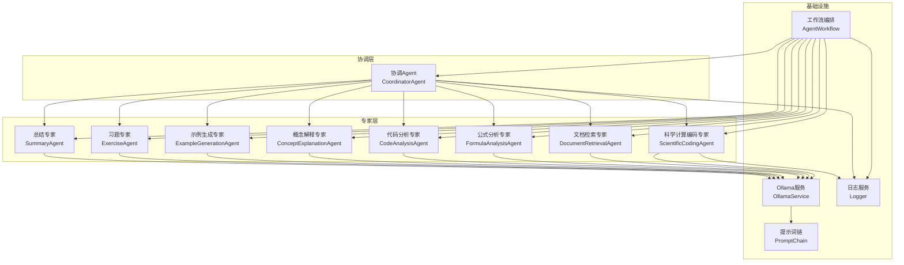
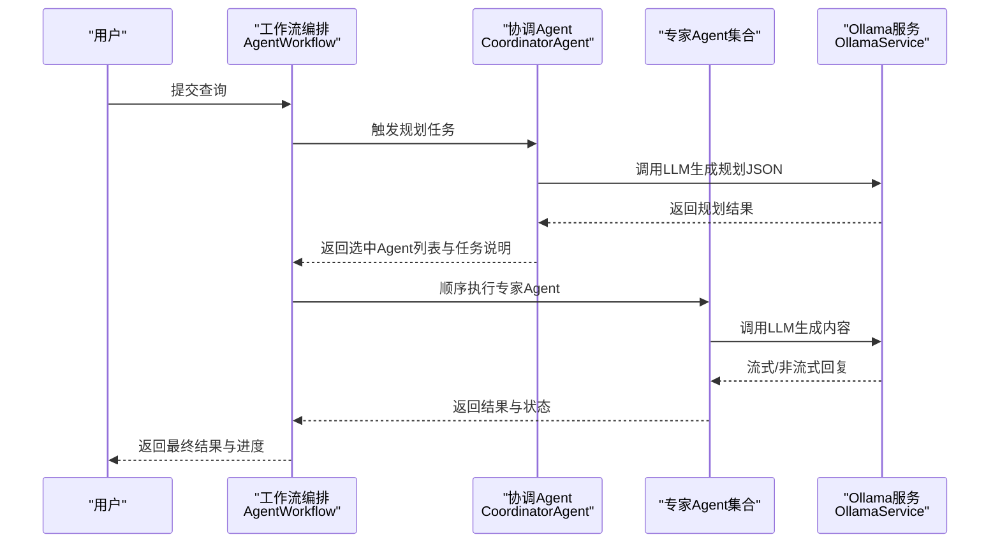
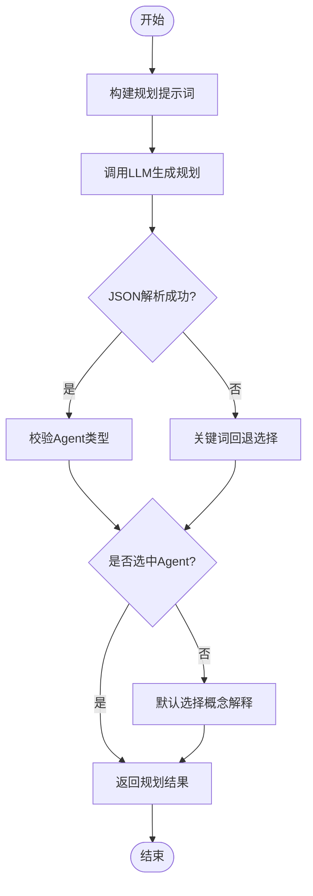
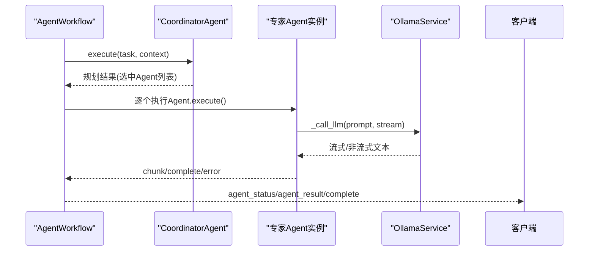
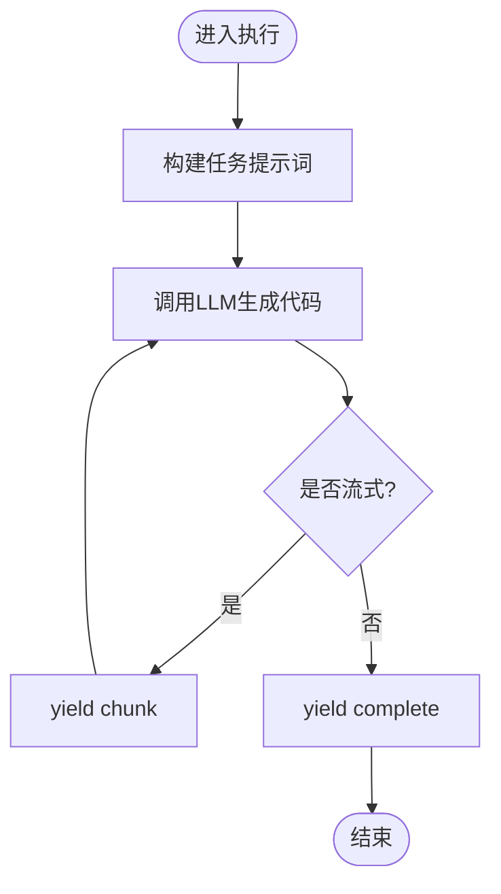
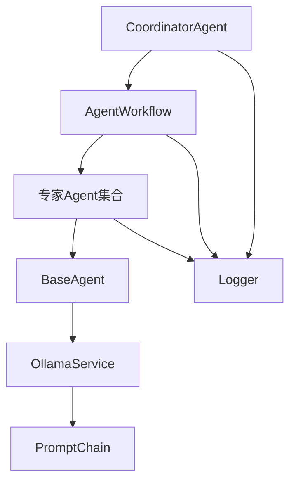

# 科学编程Agent

<cite>
**本文档引用的文件**
- [scientific_coding_agent.py](file://agents/experts/scientific_coding_agent.py)
- [base_agent.py](file://agents/base/base_agent.py)
- [coordinator_agent.py](file://agents/coordinator/coordinator_agent.py)
- [agent_workflow.py](file://agents/workflow/agent_workflow.py)
- [ollama_service.py](file://services/ollama_service.py)
- [prompt_chain.py](file://services/prompt_chain.py)
- [logger.py](file://utils/logger.py)
- [formula_analysis_agent.py](file://agents/experts/formula_analysis_agent.py)
- [code_analysis_agent.py](file://agents/experts/code_analysis_agent.py)
- [concept_explanation_agent.py](file://agents/experts/concept_explanation_agent.py)
- [example_generation_agent.py](file://agents/experts/example_generation_agent.py)
- [exercise_agent.py](file://agents/experts/exercise_agent.py)
- [summary_agent.py](file://agents/experts/summary_agent.py)
- [document_retrieval_agent.py](file://agents/experts/document_retrieval_agent.py)
</cite>

## 目录
1. [引言](#引言)
2. [项目结构](#项目结构)
3. [核心组件](#核心组件)
4. [架构概览](#架构概览)
5. [详细组件分析](#详细组件分析)
6. [依赖分析](#依赖分析)
7. [性能考虑](#性能考虑)
8. [故障排除指南](#故障排除指南)
9. [结论](#结论)
10. [附录](#附录)

## 引言
本文件面向科学编程Agent的开发者与使用者，系统性梳理其算法实现与验证能力，涵盖数值计算、科学算法、仿真模拟、结果验证等关键领域。文档重点阐释：
- 系统提示词设计策略与执行机制
- 复杂科学计算任务的理解与分解流程
- 算法选择、代码生成、性能优化与结果验证的闭环机制
- 与科学计算库的集成方式与高性能计算支持
- 实际应用示例与最佳实践

## 项目结构
科学编程Agent采用多Agent协作架构，围绕协调Agent（CoordinatorAgent）组织专家Agent（Expert Agents）完成端到端任务。整体结构如下：

**图表来源**
- [coordinator_agent.py:1-252](file://agents/coordinator/coordinator_agent.py#L1-L252)
- [agent_workflow.py:1-388](file://agents/workflow/agent_workflow.py#L1-L388)
- [scientific_coding_agent.py:1-82](file://agents/experts/scientific_coding_agent.py#L1-L82)
- [ollama_service.py:1-674](file://services/ollama_service.py#L1-L674)
- [prompt_chain.py:1-450](file://services/prompt_chain.py#L1-L450)
- [logger.py:1-88](file://utils/logger.py#L1-L88)

**章节来源**
- [coordinator_agent.py:1-252](file://agents/coordinator/coordinator_agent.py#L1-L252)
- [agent_workflow.py:1-388](file://agents/workflow/agent_workflow.py#L1-L388)

## 核心组件
- 协调Agent（CoordinatorAgent）：负责任务理解、专家选择与任务分派，支持回退机制与JSON规划结果解析。
- 工作流编排（AgentWorkflow）：统一调度专家Agent，维护Agent实例缓存与配置加载，提供流式状态反馈。
- 科学计算编码专家（ScientificCodingAgent）：面向MATLAB/Python科学计算，生成符合学术规范的代码与注释。
- 基类Agent（BaseAgent）：抽象统一接口，封装LLM调用与提示词构建。
- Ollama服务（OllamaService）：封装Ollama API，支持流式/非流式生成、工具函数调用与提示词链集成。
- 提示词链（PromptChain）：基础提示词与助手特定提示词的叠加，确保回答一致性与专业性。

**章节来源**
- [base_agent.py:1-122](file://agents/base/base_agent.py#L1-L122)
- [scientific_coding_agent.py:1-82](file://agents/experts/scientific_coding_agent.py#L1-L82)
- [coordinator_agent.py:1-252](file://agents/coordinator/coordinator_agent.py#L1-L252)
- [agent_workflow.py:1-388](file://agents/workflow/agent_workflow.py#L1-L388)
- [ollama_service.py:1-674](file://services/ollama_service.py#L1-L674)
- [prompt_chain.py:1-450](file://services/prompt_chain.py#L1-L450)

## 架构概览
科学编程Agent的执行流程分为“规划-执行-汇总”三层：
1. 协调层：解析用户问题，选择必要专家Agent并分配任务。
2. 执行层：专家Agent按序执行，支持流式输出与状态上报。
3. 汇总层：可选的总结专家对多Agent结果进行归纳。

**图表来源**
- [agent_workflow.py:106-336](file://agents/workflow/agent_workflow.py#L106-L336)
- [coordinator_agent.py:55-168](file://agents/coordinator/coordinator_agent.py#L55-L168)
- [ollama_service.py:50-93](file://services/ollama_service.py#L50-L93)

## 详细组件分析

### 协调Agent（CoordinatorAgent）
- 职责：分析问题复杂度，智能选择所需专家Agent，说明选择理由；支持回退关键词匹配与JSON解析失败兜底。
- 关键机制：
  - 规划提示词模板化，限定返回JSON格式。
  - 正则提取与JSON解析双重保障，失败时回退关键词匹配。
  - 有效Agent类型校验与默认选择策略。
- 输出：规划结果（含选中Agent、任务说明、选择理由）与状态事件。

**图表来源**
- [coordinator_agent.py:72-168](file://agents/coordinator/coordinator_agent.py#L72-L168)

**章节来源**
- [coordinator_agent.py:1-252](file://agents/coordinator/coordinator_agent.py#L1-L252)

### 工作流编排（AgentWorkflow）
- 职责：统一管理专家Agent生命周期，加载模型配置，顺序执行并流式反馈状态。
- 关键机制：
  - 延迟初始化与配置缓存，支持从数据库动态加载Agent配置。
  - 顺序执行策略保证前端进度可见性。
  - 统一的状态事件（planning、agent_status、agent_result、complete）。
- 输出：规划事件、各Agent状态事件、结果事件与汇总事件。

**图表来源**
- [agent_workflow.py:106-336](file://agents/workflow/agent_workflow.py#L106-L336)
- [base_agent.py:75-121](file://agents/base/base_agent.py#L75-L121)
- [ollama_service.py:50-93](file://services/ollama_service.py#L50-L93)

**章节来源**
- [agent_workflow.py:1-388](file://agents/workflow/agent_workflow.py#L1-L388)

### 科学计算编码专家（ScientificCodingAgent）
- 职责：面向MATLAB/Python科学计算，生成符合学术规范的代码、注释、示例与说明。
- 关键机制：
  - 系统提示词明确专长与代码要求。
  - 任务提示词模板化，包含完整代码、注释、使用说明、示例数据与文档。
  - 支持流式输出与错误处理。
- 输出：chunk（流式文本块）、complete（完整结果，含置信度）。

**图表来源**
- [scientific_coding_agent.py:31-82](file://agents/experts/scientific_coding_agent.py#L31-L82)

**章节来源**
- [scientific_coding_agent.py:1-82](file://agents/experts/scientific_coding_agent.py#L1-L82)

### 基类Agent（BaseAgent）
- 职责：定义统一接口，封装LLM调用与提示词构建。
- 关键机制：
  - 抽象方法get_default_model与execute。
  - _call_llm封装OllamaService.generate。
  - _build_prompt拼接系统提示词与上下文。
- 作用：为所有专家Agent提供一致的执行框架。

**章节来源**
- [base_agent.py:1-122](file://agents/base/base_agent.py#L1-L122)

### Ollama服务（OllamaService）
- 职责：封装Ollama API，支持流式/非流式生成、工具函数调用、提示词链集成。
- 关键机制：
  - 提示词构建：系统提示词、知识库状态、文档信息、上下文、对话历史、引用内容。
  - 工具函数调用：XML格式解析与异步调用，自动注入assistant_id。
  - 流式生成：线程池+队列实现异步消费，超时与空闲检测。
- 输出：流式文本块或一次性完整回复。

**章节来源**
- [ollama_service.py:1-674](file://services/ollama_service.py#L1-L674)

### 提示词链（PromptChain）
- 职责：基础提示词与助手特定提示词叠加，确保回答一致性与专业性。
- 关键机制：
  - 基础提示词优先从数据库读取，否则使用默认值。
  - 助手特定提示词作为扩展追加，或直接作为完整系统提示词。
  - 工具函数描述动态注入，统一格式要求。
- 输出：组合后的完整提示词。

**章节来源**
- [prompt_chain.py:1-450](file://services/prompt_chain.py#L1-L450)

### 其他专家Agent（简述）
- 公式分析专家（FormulaAnalysisAgent）：识别并解释数学/物理公式。
- 代码分析专家（CodeAnalysisAgent）：分析代码功能、逻辑与改进建议。
- 概念解释专家（ConceptExplanationAgent）：深入解释专业概念。
- 示例生成专家（ExampleGenerationAgent）：生成实际应用示例。
- 习题专家（ExerciseAgent）：出题与解题，提供详细步骤。
- 总结专家（SummaryAgent）：归纳多Agent结果。
- 文档检索专家（DocumentRetrievalAgent）：RAG检索与总结。

**章节来源**
- [formula_analysis_agent.py:1-107](file://agents/experts/formula_analysis_agent.py#L1-L107)
- [code_analysis_agent.py:1-79](file://agents/experts/code_analysis_agent.py#L1-L79)
- [concept_explanation_agent.py:1-70](file://agents/experts/concept_explanation_agent.py#L1-L70)
- [example_generation_agent.py:1-68](file://agents/experts/example_generation_agent.py#L1-L68)
- [exercise_agent.py:1-102](file://agents/experts/exercise_agent.py#L1-L102)
- [summary_agent.py:1-87](file://agents/experts/summary_agent.py#L1-L87)
- [document_retrieval_agent.py:1-79](file://agents/experts/document_retrieval_agent.py#L1-L79)

## 依赖分析
- 组件耦合：
  - CoordinatorAgent与AgentWorkflow强耦合，前者负责规划，后者负责执行。
  - 所有专家Agent依赖BaseAgent统一接口与OllamaService。
  - OllamaService依赖PromptChain构建提示词。
- 外部依赖：
  - Ollama服务（本地/远程部署）。
  - 数据库（Agent配置、系统提示词、课程助手配置）。
- 潜在风险：
  - JSON解析失败导致的回退路径。
  - 流式生成超时与空闲检测。
  - 工具函数名称校验与参数类型转换。

**图表来源**
- [coordinator_agent.py:1-252](file://agents/coordinator/coordinator_agent.py#L1-L252)
- [agent_workflow.py:1-388](file://agents/workflow/agent_workflow.py#L1-L388)
- [base_agent.py:1-122](file://agents/base/base_agent.py#L1-L122)
- [ollama_service.py:1-674](file://services/ollama_service.py#L1-L674)
- [prompt_chain.py:1-450](file://services/prompt_chain.py#L1-L450)
- [logger.py:1-88](file://utils/logger.py#L1-L88)

**章节来源**
- [agent_workflow.py:1-388](file://agents/workflow/agent_workflow.py#L1-L388)
- [ollama_service.py:1-674](file://services/ollama_service.py#L1-L674)

## 性能考虑
- 流式生成与异步消费：OllamaService采用线程池+队列实现，降低主线程阻塞，提升响应速度。
- 超时与空闲检测：最大总时长与空闲时长限制，避免长时间等待。
- 日志异步写入：使用队列监听器后台写入，减少I/O阻塞。
- Agent实例缓存：AgentWorkflow缓存专家Agent实例与配置，减少重复初始化成本。
- 顺序执行策略：虽然牺牲并行度，但保证前端进度可见性与状态一致性。

**章节来源**
- [ollama_service.py:453-670](file://services/ollama_service.py#L453-L670)
- [logger.py:15-88](file://utils/logger.py#L15-L88)
- [agent_workflow.py:62-104](file://agents/workflow/agent_workflow.py#L62-L104)

## 故障排除指南
- 协调Agent规划失败：
  - 现象：JSON解析失败或未选中Agent。
  - 处理：启用关键词回退选择，记录警告日志。
- Ollama流式生成超时：
  - 现象：等待超时或空闲超时。
  - 处理：检查Ollama服务状态、网络连接与模型加载情况。
- 工具函数调用失败：
  - 现象：未知工具函数名称或参数类型转换异常。
  - 处理：核对工具函数名称与参数格式，确保assistant_id正确注入。
- 日志性能问题：
  - 现象：磁盘写入压力大。
  - 处理：调整日志级别与文件滚动策略，生产环境仅记录警告及以上级别。

**章节来源**
- [coordinator_agent.py:130-146](file://agents/coordinator/coordinator_agent.py#L130-L146)
- [ollama_service.py:520-631](file://services/ollama_service.py#L520-L631)
- [prompt_chain.py:345-451](file://services/prompt_chain.py#L345-L451)
- [logger.py:77-82](file://utils/logger.py#L77-L82)

## 结论
科学编程Agent通过“协调-执行-汇总”的多Agent协作模式，实现了对复杂科学计算任务的高效处理。其优势在于：
- 明确的系统提示词设计与提示词链机制，确保回答的专业性与一致性。
- 专家Agent分工明确，覆盖从问题理解、公式分析、代码生成到结果总结的全链路。
- Ollama服务与异步流式生成提供良好的性能与用户体验。
- 完善的错误处理与回退机制，提升系统鲁棒性。

建议在实际应用中：
- 根据任务复杂度动态选择专家Agent，避免过度并行导致的资源竞争。
- 结合RAG检索与工具函数调用，增强信息准确性与时效性。
- 优化日志级别与缓冲策略，平衡可观测性与性能。

## 附录

### 算法复杂度与数值精度控制
- 算法复杂度：
  - 协调Agent规划：取决于关键词匹配与JSON解析，近似线性于输入长度。
  - 专家Agent执行：受提示词长度与模型生成长度影响，通常为线性或接近线性。
  - 流式生成：O(n)文本块处理，队列与线程池引入常数级开销。
- 数值精度控制：
  - 建议在科学计算代码中显式设置数值类型与舍入策略。
  - 对迭代收敛设置最大迭代次数与误差阈值，避免无限循环。
  - 使用高精度库（如Python的decimal或mpmath）处理关键计算。

### 高性能计算支持机制
- 并行与异步：
  - 流式生成与异步日志写入降低等待时间。
  - Agent实例缓存减少重复初始化。
- 资源隔离：
  - 通过配置分离不同Agent的推理模型，避免资源争用。
- 监控与告警：
  - 基于状态事件与日志级别建立监控指标，及时发现性能瓶颈。