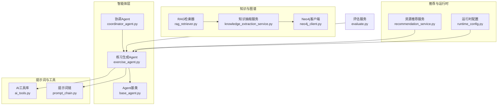
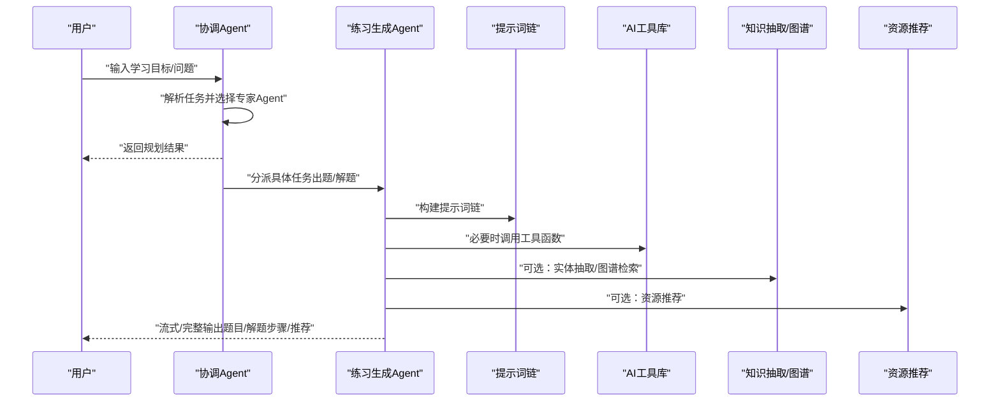
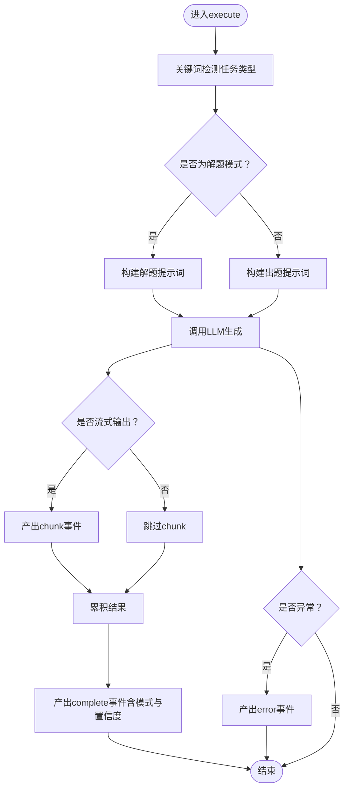
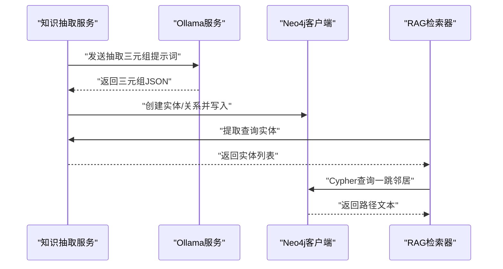
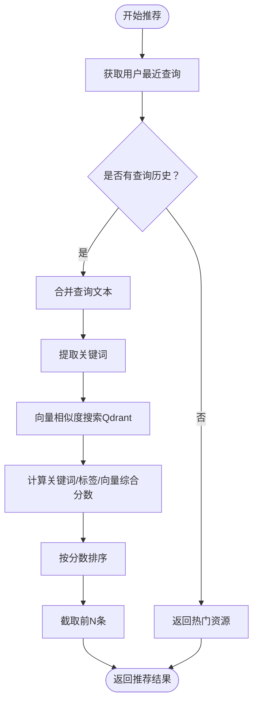
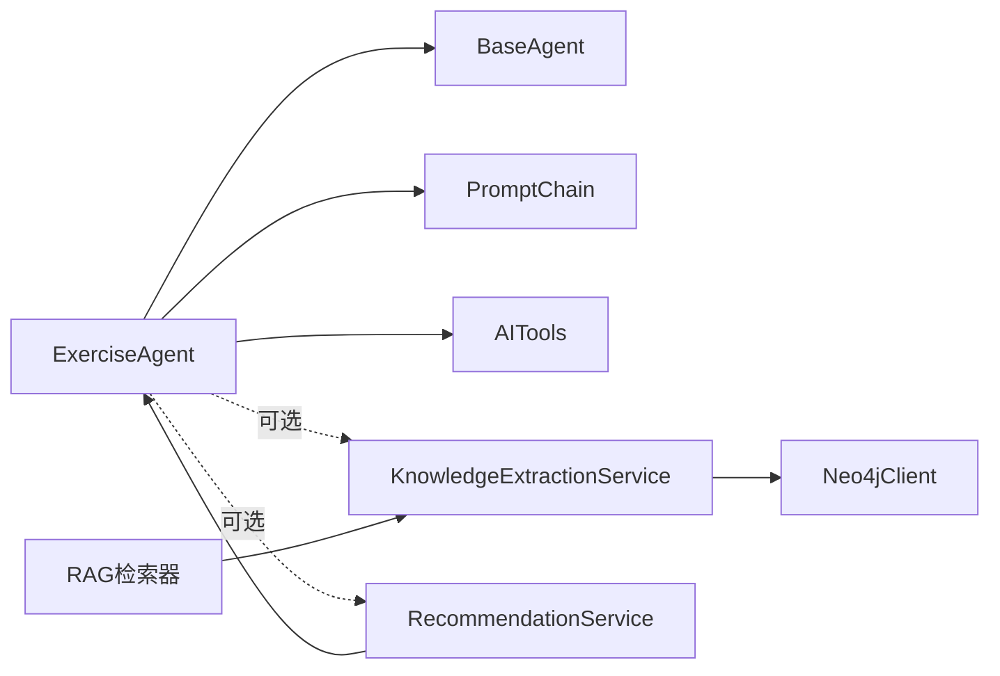

# 练习生成Agent

<cite>
**本文档引用的文件**
- [exercise_agent.py](file://agents/experts/exercise_agent.py)
- [base_agent.py](file://agents/base/base_agent.py)
- [coordinator_agent.py](file://agents/coordinator/coordinator_agent.py)
- [prompt_chain.py](file://services/prompt_chain.py)
- [recommendation_service.py](file://services/recommendation_service.py)
- [knowledge_extraction_service.py](file://services/knowledge_extraction_service.py)
- [neo4j_client.py](file://database/neo4j_client.py)
- [rag_retriever.py](file://retrieval/rag_retriever.py)
- [ai_tools.py](file://services/ai_tools.py)
- [runtime_config.py](file://services/runtime_config.py)
- [evaluate.py](file://eval/evaluate.py)
</cite>

## 目录
1. [引言](#引言)
2. [项目结构](#项目结构)
3. [核心组件](#核心组件)
4. [架构总览](#架构总览)
5. [详细组件分析](#详细组件分析)
6. [依赖分析](#依赖分析)
7. [性能考量](#性能考量)
8. [故障排查指南](#故障排查指南)
9. [结论](#结论)
10. [附录](#附录)

## 引言
本文件面向“练习生成Agent”的技术实现与工程化落地，围绕其在物理学习场景下的题目生成与解题能力展开，系统阐述如下主题：
- 学习路径设计与题目生成：如何基于知识点生成多样化练习题，覆盖选择题、填空题、计算题与应用题；如何区分“解题”与“出题”两种模式。
- 系统提示词设计：如何通过提示词链（Prompt Chain）与专家Agent提示词协同，确保输出结构化、可评估、可推荐。
- 学习路径构建流程：从知识抽取与图谱构建，到能力评估、题目筛选与序列优化的闭环机制。
- 个性化推荐与集成：如何结合用户画像、查询历史与资源推荐，实现自适应学习与技能训练。
- 难度控制策略、题目多样性保证与学习效果评估方法。

## 项目结构
练习生成Agent位于专家Agent子系统中，与协调Agent、提示词链服务、知识抽取与图谱服务、推荐服务等共同构成智能体工作流。下图给出与练习生成相关的关键模块关系：

图表来源
- [exercise_agent.py](file://agents/experts/exercise_agent.py)
- [base_agent.py](file://agents/base/base_agent.py)
- [coordinator_agent.py](file://agents/coordinator/coordinator_agent.py)
- [prompt_chain.py](file://services/prompt_chain.py)
- [ai_tools.py](file://services/ai_tools.py)
- [knowledge_extraction_service.py](file://services/knowledge_extraction_service.py)
- [neo4j_client.py](file://database/neo4j_client.py)
- [rag_retriever.py](file://retrieval/rag_retriever.py)
- [recommendation_service.py](file://services/recommendation_service.py)
- [runtime_config.py](file://services/runtime_config.py)
- [evaluate.py](file://eval/evaluate.py)

章节来源
- [exercise_agent.py](file://agents/experts/exercise_agent.py)
- [base_agent.py](file://agents/base/base_agent.py)
- [coordinator_agent.py](file://agents/coordinator/coordinator_agent.py)
- [prompt_chain.py](file://services/prompt_chain.py)
- [recommendation_service.py](file://services/recommendation_service.py)
- [knowledge_extraction_service.py](file://services/knowledge_extraction_service.py)
- [neo4j_client.py](file://database/neo4j_client.py)
- [rag_retriever.py](file://retrieval/rag_retriever.py)
- [ai_tools.py](file://services/ai_tools.py)
- [runtime_config.py](file://services/runtime_config.py)
- [evaluate.py](file://eval/evaluate.py)

## 核心组件
- 练习生成Agent（ExerciseAgent）
  - 职责：根据知识点生成练习题或解答用户提交的物理题目；提供结构化解题步骤与多种解法。
  - 模式识别：通过关键词判断任务是“解题”还是“出题”，分别构造不同的提示词。
  - 输出：支持流式输出与完整结果，包含类型、内容、模式与置信度等元数据。
- Agent基类（BaseAgent）
  - 职责：统一Agent生命周期、默认模型选择、提示词构建与LLM调用封装。
  - 能力：提供系统提示词获取、上下文拼接、流式生成等通用能力。
- 协调Agent（CoordinatorAgent）
  - 职责：分析用户问题，规划所需专家Agent清单与任务分配，返回JSON规划结果。
  - 选择策略：基于关键词与后备逻辑，确保最少必要Agent参与。
- 提示词链（PromptChain）
  - 职责：构建基础提示词与助手特定提示词的叠加链，确保角色定位、回答原则、工具使用与资源推荐等规范一致。
- 知识抽取与图谱（KnowledgeExtractionService + Neo4jClient）
  - 职责：从文本抽取三元组并写入Neo4j，支持基于实体的图谱检索。
- 资源推荐（RecommendationService）
  - 职责：基于用户近期查询、关键词匹配、向量相似度与标签匹配，生成资源推荐列表。
- 运行时配置（RuntimeConfig）
  - 职责：提供模块开关与参数的持久化配置，支持低/高/自定义模式，保障知识图谱构建等模块可控启用。
- 评估（Evaluate）
  - 职责：基于LLM-as-a-Judge对生成答案进行评分，支持归一化处理。

章节来源
- [exercise_agent.py](file://agents/experts/exercise_agent.py)
- [base_agent.py](file://agents/base/base_agent.py)
- [coordinator_agent.py](file://agents/coordinator/coordinator_agent.py)
- [prompt_chain.py](file://services/prompt_chain.py)
- [knowledge_extraction_service.py](file://services/knowledge_extraction_service.py)
- [neo4j_client.py](file://database/neo4j_client.py)
- [recommendation_service.py](file://services/recommendation_service.py)
- [runtime_config.py](file://services/runtime_config.py)
- [evaluate.py](file://eval/evaluate.py)

## 架构总览
练习生成Agent在系统中的位置与交互如下：

图表来源
- [coordinator_agent.py](file://agents/coordinator/coordinator_agent.py)
- [exercise_agent.py](file://agents/experts/exercise_agent.py)
- [prompt_chain.py](file://services/prompt_chain.py)
- [ai_tools.py](file://services/ai_tools.py)
- [knowledge_extraction_service.py](file://services/knowledge_extraction_service.py)
- [recommendation_service.py](file://services/recommendation_service.py)

## 详细组件分析

### 练习生成Agent（ExerciseAgent）
- 模式识别与提示词设计
  - 解题模式：强调“题目分析—解题思路—详细步骤—答案验证—总结”的五步法。
  - 出题模式：要求生成选择题、填空题、计算题与应用题，每题包含内容、难度、答案与解题思路。
- 执行流程
  - 判断任务类型（关键词检测）。
  - 构造对应提示词并调用LLM生成。
  - 流式输出“chunk”与最终“complete”两类事件，携带agent类型、模式与置信度。
- 错误处理
  - 捕获异常并返回“error”事件，便于上层统一处理。

图表来源
- [exercise_agent.py](file://agents/experts/exercise_agent.py)

章节来源
- [exercise_agent.py](file://agents/experts/exercise_agent.py)

### Agent基类（BaseAgent）
- 统一能力
  - 默认模型选择、提示词构建、上下文拼接、LLM流式生成。
  - 提供工具接口占位，便于扩展。
- 设计要点
  - 将“提示词构建”与“LLM调用”解耦，利于在不同Agent中复用。

章节来源
- [base_agent.py](file://agents/base/base_agent.py)

### 协调Agent（CoordinatorAgent）
- 任务规划
  - 依据用户问题提取关键词，选择必要专家Agent（如document_retrieval、formula_analysis、exercise、summary等）。
  - 返回JSON格式的“选中Agent列表+任务说明+理由”，若解析失败则回退到关键词规则。
- 与工作流集成
  - 仅负责规划，不执行具体任务，后续由工作流编排器驱动专家Agent执行。

章节来源
- [coordinator_agent.py](file://agents/coordinator/coordinator_agent.py)

### 提示词链（PromptChain）
- 基础提示词优先从数据库读取，若不存在则使用默认模板，确保角色定位、回答原则、工具使用与资源推荐的一致性。
- 助手特定提示词作为扩展追加，形成“基础能力 + 课程方向”的叠加链，便于课程定制。

章节来源
- [prompt_chain.py](file://services/prompt_chain.py)

### 知识抽取与图谱（KnowledgeExtractionService + Neo4jClient）
- 知识抽取
  - 使用Ollama抽取“实体-关系-实体”三元组，支持JSON格式解析与容错。
- 图谱构建
  - 将三元组写入Neo4j，实体与关系规范化处理，支持并发与冷却机制。
- 图谱检索
  - RAG检索器可调用实体抽取服务，基于Neo4j查询一跳邻居，形成图谱路径文本。

图表来源
- [knowledge_extraction_service.py](file://services/knowledge_extraction_service.py)
- [neo4j_client.py](file://database/neo4j_client.py)
- [rag_retriever.py](file://retrieval/rag_retriever.py)

章节来源
- [knowledge_extraction_service.py](file://services/knowledge_extraction_service.py)
- [neo4j_client.py](file://database/neo4j_client.py)
- [rag_retriever.py](file://retrieval/rag_retriever.py)

### 资源推荐（RecommendationService）
- 推荐策略
  - 混合算法：关键词匹配（jieba）、向量相似度（Qdrant）、标签匹配，综合打分并排序。
  - 若无向量搜索结果，回退到关键词匹配所有资源。
- 输出
  - 返回资源ID、标题、描述、文件类型、大小与综合分数，便于前端展示与下载。

图表来源
- [recommendation_service.py](file://services/recommendation_service.py)

章节来源
- [recommendation_service.py](file://services/recommendation_service.py)

### 运行时配置（RuntimeConfig）
- 模式与模块
  - low/high/custom三种模式，模块开关（如kg_extract_enabled、kg_retrieve_enabled等）与参数（并发、超时、批大小等）可持久化与缓存。
- 与知识图谱构建的集成
  - 文档入库流程中读取运行时配置，按需启用/禁用知识图谱构建与检索，避免不必要的开销。

章节来源
- [runtime_config.py](file://services/runtime_config.py)

### 评估（Evaluate）
- 评估流程
  - 基于LLM-as-a-Judge对比生成回答与标准答案，返回0~1评分，并进行归一化处理。
- 与练习生成的结合
  - 可用于评估生成题目的质量、解题步骤的完整性与正确性，支撑持续优化。

章节来源
- [evaluate.py](file://eval/evaluate.py)

## 依赖分析
- 组件耦合
  - ExerciseAgent依赖BaseAgent的提示词构建与LLM调用能力；通过提示词链确保风格与规范一致。
  - 协调Agent负责任务分发，ExerciseAgent仅关注自身职责，降低耦合。
  - 知识抽取与图谱服务为可选增强，RAG检索器可调用其实体抽取能力，提升检索质量。
  - 资源推荐服务与ExerciseAgent解耦，可通过事件或API触发，实现“题目+资源”一体化输出。
- 外部依赖
  - Ollama服务（推理与嵌入）、Neo4j（知识图谱）、Qdrant（向量检索）、MongoDB（配置与资源存储）。

图表来源
- [exercise_agent.py](file://agents/experts/exercise_agent.py)
- [base_agent.py](file://agents/base/base_agent.py)
- [prompt_chain.py](file://services/prompt_chain.py)
- [ai_tools.py](file://services/ai_tools.py)
- [knowledge_extraction_service.py](file://services/knowledge_extraction_service.py)
- [neo4j_client.py](file://database/neo4j_client.py)
- [recommendation_service.py](file://services/recommendation_service.py)
- [rag_retriever.py](file://retrieval/rag_retriever.py)

章节来源
- [exercise_agent.py](file://agents/experts/exercise_agent.py)
- [base_agent.py](file://agents/base/base_agent.py)
- [prompt_chain.py](file://services/prompt_chain.py)
- [ai_tools.py](file://services/ai_tools.py)
- [knowledge_extraction_service.py](file://services/knowledge_extraction_service.py)
- [neo4j_client.py](file://database/neo4j_client.py)
- [recommendation_service.py](file://services/recommendation_service.py)
- [rag_retriever.py](file://retrieval/rag_retriever.py)

## 性能考量
- 并发与限流
  - 知识抽取与图谱构建支持并发控制与超时设置，避免大规模文本处理时的阻塞。
  - 向量检索与关键词匹配采用多路融合策略，减少无效计算。
- 缓存与降级
  - 运行时配置采用内存缓存与TTL，降低频繁读取数据库的开销。
  - Qdrant健康检查与失败降级，保证推荐服务稳定性。
- 流式输出
  - 练习生成Agent支持流式输出，改善用户体验，降低首屏等待时间。

## 故障排查指南
- 练习生成Agent
  - 症状：执行失败或无输出。
  - 排查：检查提示词构建、LLM服务连通性、关键词识别逻辑与异常捕获。
- 知识抽取与图谱
  - 症状：三元组解析失败或Neo4j写入异常。
  - 排查：确认Ollama返回格式、JSON解析容错、Neo4j连接状态与冷却机制。
- 资源推荐
  - 症状：推荐结果为空或分数异常。
  - 排查：检查关键词提取、向量搜索阈值、标签匹配权重与综合打分逻辑。
- 协调Agent
  - 症状：规划结果非JSON或Agent选择不当。
  - 排查：检查提示词格式、JSON提取正则与关键词回退逻辑。

章节来源
- [exercise_agent.py](file://agents/experts/exercise_agent.py)
- [knowledge_extraction_service.py](file://services/knowledge_extraction_service.py)
- [recommendation_service.py](file://services/recommendation_service.py)
- [coordinator_agent.py](file://agents/coordinator/coordinator_agent.py)

## 结论
练习生成Agent通过明确的模式识别、结构化的提示词设计与可插拔的外部能力（知识图谱、资源推荐、工具函数），实现了从“知识点—练习题—解题步骤—资源推荐”的闭环。配合协调Agent的任务规划与运行时配置的模块化控制，系统在保证可扩展性的同时，兼顾性能与稳定性，适用于自适应学习、技能训练与知识巩固等多种教育场景。

## 附录
- 实际应用示例（概念性说明）
  - 自适应学习：根据用户最近查询与资源推荐，生成适配当前水平的练习题，逐步提升难度。
  - 技能训练：结合图谱检索与实体关联，生成跨知识点的综合应用题，强化知识迁移。
  - 知识巩固：在练习后推荐相关资源，形成“做题—看资料—再练习”的循环。
- 集成建议
  - 与教育系统对接：通过统一的提示词链与工具函数，确保回答风格与系统规范一致；在课程页面挂载“生成练习”按钮，触发协调Agent与练习生成Agent。
  - 个性化支持：结合用户画像与运行时配置，动态调整Agent选择与推荐策略，实现“因材施教”。