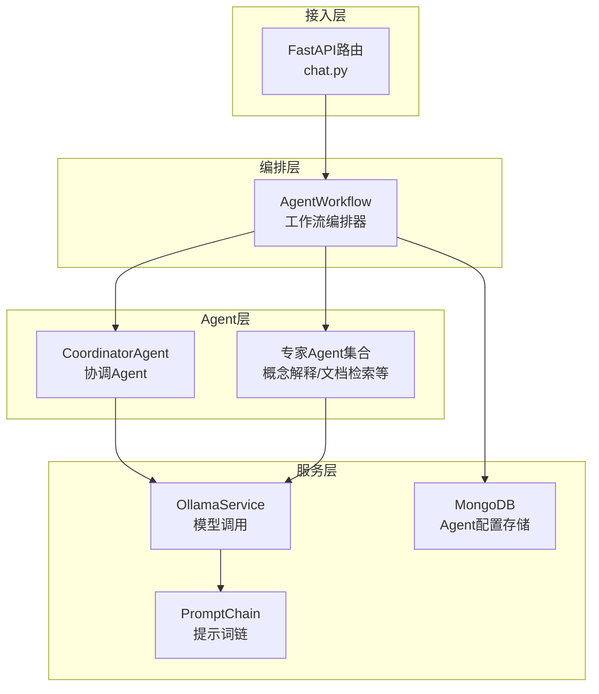
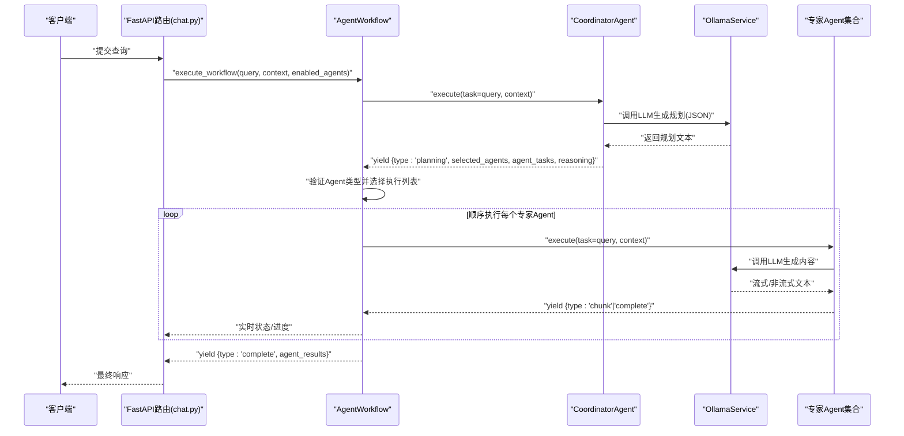
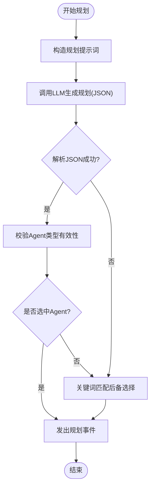
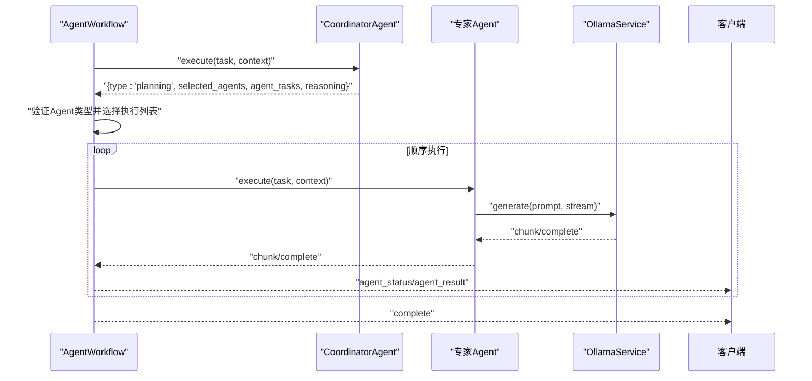
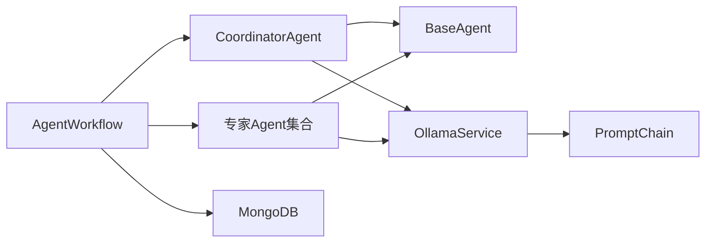

# 协调Agent

<cite>
**本文引用的文件**
- [coordinator_agent.py](file://agents/coordinator/coordinator_agent.py)
- [base_agent.py](file://agents/base/base_agent.py)
- [agent_workflow.py](file://agents/workflow/agent_workflow.py)
- [agent_config.py](file://models/agent_config.py)
- [ollama_service.py](file://services/ollama_service.py)
- [mongodb.py](file://database/mongodb.py)
- [prompt_chain.py](file://services/prompt_chain.py)
- [document_retrieval_agent.py](file://agents/experts/document_retrieval_agent.py)
- [concept_explanation_agent.py](file://agents/experts/concept_explanation_agent.py)
- [chat.py](file://routers/chat.py)
</cite>

## 目录
1. [简介](#简介)
2. [项目结构](#项目结构)
3. [核心组件](#核心组件)
4. [架构总览](#架构总览)
5. [详细组件分析](#详细组件分析)
6. [依赖分析](#依赖分析)
7. [性能考量](#性能考量)
8. [故障排查指南](#故障排查指南)
9. [结论](#结论)
10. [附录](#附录)

## 简介
本文件面向开发者与技术读者，系统性阐述协调Agent在多Agent系统中的核心作用与工作机制。协调Agent负责接收用户请求、分析任务需求、选择合适的专家Agent、编排多Agent协作流程、管理任务执行进度与状态同步，并在异常情况下进行降级与恢复。文档还涵盖决策算法、优先级排序、资源分配与负载均衡等高级特性，并提供实际使用示例与配置选项，帮助读者快速构建复杂的多Agent应用场景。

## 项目结构
协调Agent位于 agents/coordinator 目录，配合 agents/base 提供的通用基类、agents/workflow 提供的工作流编排器、以及 services/ollama_service 提供的模型调用能力共同构成端到端的多Agent系统。

图表来源
- [coordinator_agent.py:1-252](file://agents/coordinator/coordinator_agent.py#L1-L252)
- [agent_workflow.py:1-388](file://agents/workflow/agent_workflow.py#L1-L388)
- [ollama_service.py:1-674](file://services/ollama_service.py#L1-L674)
- [mongodb.py:1-205](file://database/mongodb.py#L1-L205)
- [prompt_chain.py:1-450](file://services/prompt_chain.py#L1-L450)
- [chat.py:795-827](file://routers/chat.py#L795-L827)

章节来源
- [coordinator_agent.py:1-252](file://agents/coordinator/coordinator_agent.py#L1-L252)
- [agent_workflow.py:1-388](file://agents/workflow/agent_workflow.py#L1-L388)
- [ollama_service.py:1-674](file://services/ollama_service.py#L1-L674)
- [mongodb.py:1-205](file://database/mongodb.py#L1-L205)
- [prompt_chain.py:1-450](file://services/prompt_chain.py#L1-L450)
- [chat.py:795-827](file://routers/chat.py#L795-L827)

## 核心组件
- 协调Agent（CoordinatorAgent）：负责任务规划与专家Agent选择，输出规划结果与理由。
- 专家Agent集合：包含概念解释、文档检索、公式分析、代码分析、示例生成、习题、科学计算、总结等Agent。
- 工作流编排器（AgentWorkflow）：统一调度协调Agent与专家Agent，管理状态同步、进度反馈与异常处理。
- 模型服务（OllamaService）：封装LLM调用，支持流式与非流式生成，内置超时与线程池适配。
- 配置与提示词（AgentConfig、PromptChain）：支持从数据库读取Agent配置与提示词链拼接。
- 数据存储（MongoDB）：提供Agent配置、助手系统提示词等持久化能力。

章节来源
- [coordinator_agent.py:7-252](file://agents/coordinator/coordinator_agent.py#L7-L252)
- [agent_workflow.py:47-388](file://agents/workflow/agent_workflow.py#L47-L388)
- [ollama_service.py:9-674](file://services/ollama_service.py#L9-L674)
- [agent_config.py:1-24](file://models/agent_config.py#L1-L24)
- [prompt_chain.py:6-450](file://services/prompt_chain.py#L6-L450)
- [mongodb.py:92-205](file://database/mongodb.py#L92-L205)

## 架构总览
协调Agent在工作流中承担“任务规划者”的角色，其执行流程如下：
1. 接收用户查询与上下文，构造规划提示词。
2. 调用LLM生成规划结果（JSON格式），包含选中的专家Agent列表、任务分配与选择理由。
3. 解析规划结果，进行有效性校验与后备选择。
4. 工作流编排器根据规划结果选择专家Agent并顺序执行，实时回传状态与进度。
5. 收集专家Agent结果，汇总为最终响应。

图表来源
- [agent_workflow.py:106-336](file://agents/workflow/agent_workflow.py#L106-L336)
- [coordinator_agent.py:55-168](file://agents/coordinator/coordinator_agent.py#L55-L168)
- [ollama_service.py:50-93](file://services/ollama_service.py#L50-L93)
- [chat.py:809-827](file://routers/chat.py#L809-L827)

## 详细组件分析

### 协调Agent（CoordinatorAgent）
- 职责与输入输出
  - 输入：用户问题、上下文、是否流式。
  - 输出：规划阶段事件（包含选中的Agent列表、任务分配、选择理由），并在异常时返回错误事件。
- 任务分解策略
  - 通过LLM生成JSON规划，包含“selected_agents”、“agent_tasks”、“reasoning”三要素。
  - 若JSON解析失败，采用关键词匹配的后备选择逻辑，按问题关键词匹配专家Agent类型。
- 专家Agent选择与任务分配
  - 可用专家Agent类型：文档检索、公式分析、代码分析、概念解释、示例生成、习题、科学计算、总结。
  - 任务分配遵循“必要性原则”，避免选择所有Agent；复杂问题可选择3-5个Agent，并在必要时添加总结Agent。
- 状态与异常处理
  - 规划阶段通过事件流返回，便于前端实时展示。
  - 解析失败或未选中Agent时，使用后备选择逻辑保证系统可用性。
  - 异常捕获并返回错误事件，避免中断整体流程。

图表来源
- [coordinator_agent.py:102-168](file://agents/coordinator/coordinator_agent.py#L102-L168)
- [coordinator_agent.py:170-213](file://agents/coordinator/coordinator_agent.py#L170-L213)

章节来源
- [coordinator_agent.py:7-252](file://agents/coordinator/coordinator_agent.py#L7-L252)

### 工作流编排器（AgentWorkflow）
- 初始化与配置加载
  - 异步加载协调Agent与专家Agent的模型配置，优先从数据库读取，失败时使用默认配置。
  - 支持按需延迟初始化专家Agent实例，实现资源按需分配。
- 任务执行流程
  - 协调Agent规划阶段完成后，编排器根据规划结果或手动指定的Agent列表确定执行序列。
  - 顺序执行专家Agent，实时回传状态（pending/running/completed/error）与进度。
  - 收集每个Agent的完成结果（内容、来源、置信度），汇总为最终响应。
- 状态同步与前端交互
  - 在规划阶段即发送所有Agent的初始状态（包括未被选中的Agent），便于前端渲染。
  - 专家Agent执行期间持续发送状态事件，前端可据此更新UI与进度条。

图表来源
- [agent_workflow.py:106-336](file://agents/workflow/agent_workflow.py#L106-L336)

章节来源
- [agent_workflow.py:47-388](file://agents/workflow/agent_workflow.py#L47-L388)

### 专家Agent（示例：概念解释、文档检索）
- 概念解释专家（ConceptExplanationAgent）
  - 任务：深入解释专业概念，提供定义、物理意义、公式、示例与关联。
  - 执行：构造提示词，调用LLM生成内容，流式返回chunk，最终complete。
- 文档检索专家（DocumentRetrievalAgent）
  - 任务：从知识库检索相关文档，总结关键信息并标注来源。
  - 执行：调用RAG服务检索上下文，再调用LLM总结，返回内容、来源与推荐资源。

章节来源
- [concept_explanation_agent.py:1-70](file://agents/experts/concept_explanation_agent.py#L1-L70)
- [document_retrieval_agent.py:1-79](file://agents/experts/document_retrieval_agent.py#L1-L79)

### 模型服务与提示词链
- OllamaService
  - 支持流式与非流式生成，内置超时控制与线程池适配，保障大模型生成的稳定性。
  - 提供提示词构建能力，整合系统提示词、知识库状态、对话历史与工具函数调用结果。
- PromptChain
  - 支持基础提示词与助手特定提示词的叠加，形成可定制的提示词链。
  - 从数据库读取系统配置，若不存在则使用默认基础提示词。

章节来源
- [ollama_service.py:50-274](file://services/ollama_service.py#L50-L274)
- [prompt_chain.py:6-450](file://services/prompt_chain.py#L6-L450)

### 数据配置与持久化
- Agent配置模型（AgentConfig）
  - 定义单个Agent的推理模型与向量化模型名称，支持更新与列表响应。
- MongoDB
  - 提供Agent配置、课程助手系统提示词等集合的读写能力，工作流通过异步查询加载配置。

章节来源
- [agent_config.py:1-24](file://models/agent_config.py#L1-L24)
- [mongodb.py:92-205](file://database/mongodb.py#L92-L205)

## 依赖分析
- 协调Agent依赖BaseAgent与OllamaService，负责规划与LLM调用。
- 工作流编排器依赖协调Agent与专家Agent，负责任务调度与状态同步。
- 专家Agent依赖BaseAgent与OllamaService，部分专家Agent依赖RAG服务。
- 配置与提示词链通过MongoDB提供持久化支持。

图表来源
- [coordinator_agent.py:3-5](file://agents/coordinator/coordinator_agent.py#L3-L5)
- [base_agent.py:1-122](file://agents/base/base_agent.py#L1-L122)
- [agent_workflow.py:7-15](file://agents/workflow/agent_workflow.py#L7-L15)
- [ollama_service.py:1-6](file://services/ollama_service.py#L1-L6)
- [prompt_chain.py:1-4](file://services/prompt_chain.py#L1-L4)
- [mongodb.py:1-11](file://database/mongodb.py#L1-L11)

章节来源
- [coordinator_agent.py:1-252](file://agents/coordinator/coordinator_agent.py#L1-L252)
- [agent_workflow.py:1-388](file://agents/workflow/agent_workflow.py#L1-L388)
- [base_agent.py:1-122](file://agents/base/base_agent.py#L1-L122)
- [ollama_service.py:1-674](file://services/ollama_service.py#L1-L674)
- [prompt_chain.py:1-450](file://services/prompt_chain.py#L1-L450)
- [mongodb.py:1-205](file://database/mongodb.py#L1-L205)

## 性能考量
- 流式输出与状态同步
  - 协调Agent与专家Agent均支持流式输出，工作流编排器实时回传状态，前端可即时渲染进度。
- 超时与稳定性
  - OllamaService为大模型生成设置了较长超时时间，避免因模型响应慢导致的中断。
- 按需初始化与资源分配
  - 工作流编排器延迟初始化专家Agent实例，减少内存与计算资源占用。
- 并发与连接池
  - MongoDB连接池参数可调，支持高并发场景下的稳定连接。

章节来源
- [agent_workflow.py:218-296](file://agents/workflow/agent_workflow.py#L218-L296)
- [ollama_service.py:32-34](file://services/ollama_service.py#L32-L34)
- [mongodb.py:122-136](file://database/mongodb.py#L122-L136)

## 故障排查指南
- 协调Agent规划失败
  - 现象：返回错误事件或未选中Agent。
  - 排查：检查LLM可用性、提示词格式、JSON解析逻辑；确认后备选择逻辑是否生效。
- 专家Agent执行异常
  - 现象：状态为error，返回错误详情。
  - 排查：查看专家Agent内部异常日志，确认上下文与任务参数是否正确。
- 配置加载失败
  - 现象：Agent未使用预期模型或配置缺失。
  - 排查：确认MongoDB连接与集合存在，检查Agent配置文档键值。
- 前端状态不一致
  - 现象：Agent状态与UI显示不符。
  - 排查：确认工作流编排器是否正确发送初始状态与状态变更事件。

章节来源
- [coordinator_agent.py:162-168](file://agents/coordinator/coordinator_agent.py#L162-L168)
- [agent_workflow.py:306-321](file://agents/workflow/agent_workflow.py#L306-L321)
- [mongodb.py:154-184](file://database/mongodb.py#L154-L184)

## 结论
协调Agent通过明确的任务规划与专家Agent选择机制，为多Agent系统提供了清晰的控制中枢。配合工作流编排器的状态同步与异常处理能力，系统能够在复杂任务场景下保持高可用与良好的用户体验。通过配置与提示词链的灵活扩展，开发者可以快速适配不同业务领域与教学场景，构建强大的智能协作体系。

## 附录

### 使用示例与配置选项
- 路由接入
  - 通过FastAPI路由触发工作流执行，支持流式响应与断开检测。
- 配置项
  - generation_config：包含llm_model等生成配置，可影响协调Agent与专家Agent的模型选择。
  - enabled_agents：手动指定启用的专家Agent列表，覆盖协调Agent的选择结果。
- 提示词与模型
  - 基础提示词与助手特定提示词通过PromptChain拼接，支持从数据库读取或使用默认值。
  - Agent配置通过MongoDB的agent_configs集合管理，支持按Agent类型查询与更新。

章节来源
- [chat.py:809-827](file://routers/chat.py#L809-L827)
- [agent_workflow.py:18-44](file://agents/workflow/agent_workflow.py#L18-L44)
- [prompt_chain.py:18-30](file://services/prompt_chain.py#L18-L30)
- [agent_config.py:6-23](file://models/agent_config.py#L6-L23)
- [mongodb.py:28-44](file://database/mongodb.py#L28-L44)