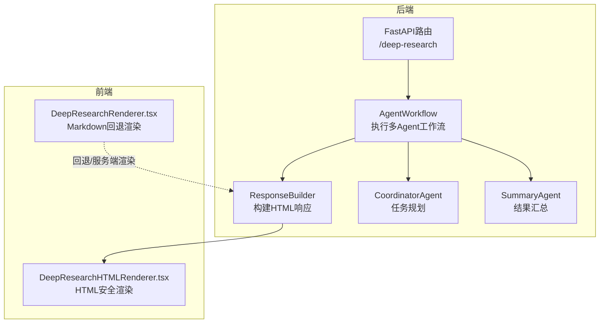
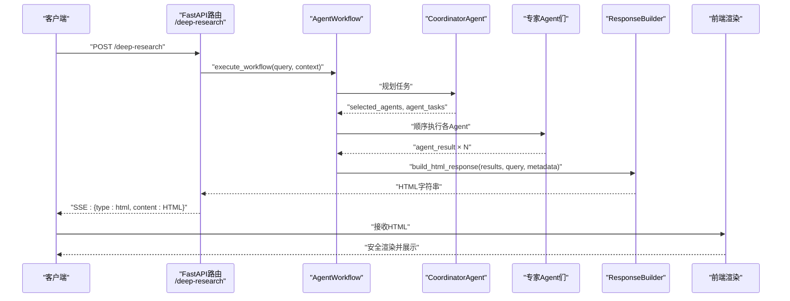
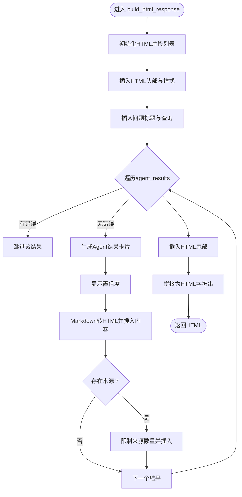
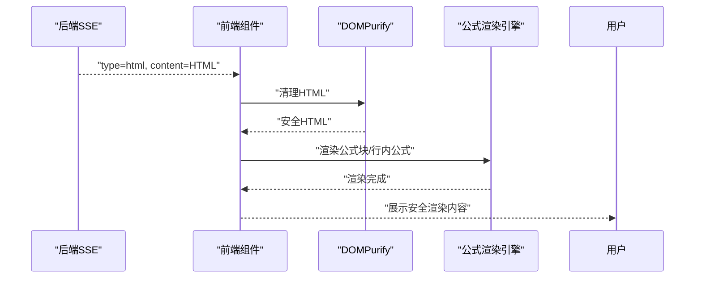
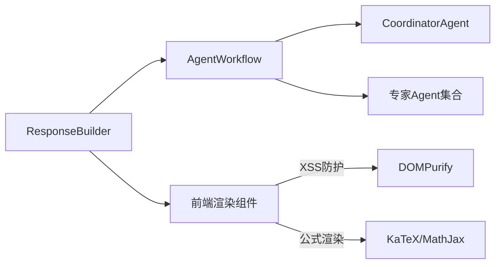

# 响应构建器

<cite>
**本文引用的文件**
- [response_builder.py](file://agents/builder/response_builder.py)
- [agent_workflow.py](file://agents/workflow/agent_workflow.py)
- [coordinator_agent.py](file://agents/coordinator/coordinator_agent.py)
- [summary_agent.py](file://agents/experts/summary_agent.py)
- [chat.py](file://routers/chat.py)
- [DeepResearchHTMLRenderer.tsx](file://web/components/chat/DeepResearchHTMLRenderer.tsx)
- [DeepResearchRenderer.tsx](file://web/components/chat/DeepResearchRenderer.tsx)
- [base_agent.py](file://agents/base/base_agent.py)
</cite>

## 目录
1. [简介](#简介)
2. [项目结构](#项目结构)
3. [核心组件](#核心组件)
4. [架构总览](#架构总览)
5. [详细组件分析](#详细组件分析)
6. [依赖分析](#依赖分析)
7. [性能考虑](#性能考虑)
8. [故障排查指南](#故障排查指南)
9. [结论](#结论)
10. [附录](#附录)

## 简介
本文件围绕“响应构建器（ResponseBuilder）”展开，系统性阐述其在Agent系统中的角色与实现原理。响应构建器负责将多Agent协作产生的异构结果，统一格式化为HTML响应，并通过前端安全渲染组件展示。文档覆盖响应格式标准化、内容整合策略、多Agent结果融合、输出优化等核心功能，并深入分析数据收集、格式转换、内容过滤、质量评估、最终输出等阶段，以及如何处理来自不同Agent的异构响应（数据类型转换、语义对齐、冲突解决、一致性保证）。同时提供配置选项与定制化方法，帮助开发者按需调整输出格式与质量标准。

## 项目结构
响应构建器位于后端Python代码中，与Agent工作流、前端渲染组件协同工作，形成“后端生成HTML → 前端安全渲染”的完整链路。

图示来源
- [agent_workflow.py:106-337](file://agents/workflow/agent_workflow.py#L106-L337)
- [response_builder.py:10-78](file://agents/builder/response_builder.py#L10-L78)
- [coordinator_agent.py:55-168](file://agents/coordinator/coordinator_agent.py#L55-L168)
- [summary_agent.py:24-72](file://agents/experts/summary_agent.py#L24-L72)
- [chat.py:762-921](file://routers/chat.py#L762-L921)
- [DeepResearchHTMLRenderer.tsx:17-235](file://web/components/chat/DeepResearchHTMLRenderer.tsx#L17-L235)
- [DeepResearchRenderer.tsx:114-177](file://web/components/chat/DeepResearchRenderer.tsx#L114-L177)

章节来源
- [agent_workflow.py:47-105](file://agents/workflow/agent_workflow.py#L47-L105)
- [response_builder.py:7-272](file://agents/builder/response_builder.py#L7-L272)
- [chat.py:762-921](file://routers/chat.py#L762-L921)

## 核心组件
- 响应构建器（ResponseBuilder）
  - 职责：接收多Agent结果，标准化为HTML，包含标题、置信度、内容与来源等模块化卡片。
  - 关键方法：构建HTML响应、Markdown转HTML、卡片标题映射、HTML头尾模板。
- Agent工作流（AgentWorkflow）
  - 职责：编排协调Agent与专家Agent，顺序执行并聚合结果，向响应构建器提供统一输入。
- 协调Agent（CoordinatorAgent）
  - 职责：分析问题、选择必要Agent、生成任务规划，供工作流执行。
- 汇总Agent（SummaryAgent）
  - 职责：对其他Agent结果进行归纳总结，作为最终输出的一部分。
- 前端渲染组件
  - DeepResearchHTMLRenderer：对HTML进行DOMPurify清理与公式渲染、表格响应式处理等。
  - DeepResearchRenderer：对HTML进行检测并转换为Markdown，便于服务端渲染或回退场景。

章节来源
- [response_builder.py:7-272](file://agents/builder/response_builder.py#L7-L272)
- [agent_workflow.py:47-337](file://agents/workflow/agent_workflow.py#L47-L337)
- [coordinator_agent.py:7-252](file://agents/coordinator/coordinator_agent.py#L7-L252)
- [summary_agent.py:7-87](file://agents/experts/summary_agent.py#L7-L87)
- [DeepResearchHTMLRenderer.tsx:17-235](file://web/components/chat/DeepResearchHTMLRenderer.tsx#L17-L235)
- [DeepResearchRenderer.tsx:114-177](file://web/components/chat/DeepResearchRenderer.tsx#L114-L177)

## 架构总览
响应构建器在“深度研究模式”中承担最终输出职责：工作流完成后，将各Agent结果交由响应构建器统一格式化为HTML，再由前端安全渲染组件展示。

图示来源
- [chat.py:762-921](file://routers/chat.py#L762-L921)
- [agent_workflow.py:106-337](file://agents/workflow/agent_workflow.py#L106-L337)
- [response_builder.py:10-78](file://agents/builder/response_builder.py#L10-L78)
- [DeepResearchHTMLRenderer.tsx:17-235](file://web/components/chat/DeepResearchHTMLRenderer.tsx#L17-L235)

## 详细组件分析

### 响应构建器（ResponseBuilder）
- 数据收集与预处理
  - 输入：agent_results（包含agent_type、content、sources、confidence）、query、metadata。
  - 过滤：跳过带错误标记的结果，确保只渲染有效内容。
- 格式转换与标准化
  - HTML头部与样式：内置CSS，适配深色/浅色主题与响应式布局。
  - 标题与问题区：显示“深度研究结果”标题与用户问题。
  - Agent结果卡片：逐条渲染，包含Agent类型标题、置信度、内容区域、来源列表。
  - Markdown转HTML：简化实现，支持标题、代码块、行内代码、公式、列表、段落等。
- 输出优化
  - 来源限制：最多展示前若干条来源，避免冗长。
  - 置信度展示：以百分比形式显示，辅助用户判断质量。
  - 结构化样式：卡片、标题、列表、公式块均有独立样式，提升可读性。

图示来源
- [response_builder.py:10-78](file://agents/builder/response_builder.py#L10-L78)
- [response_builder.py:94-139](file://agents/builder/response_builder.py#L94-L139)

章节来源
- [response_builder.py:7-272](file://agents/builder/response_builder.py#L7-L272)

### 多Agent结果融合与内容整合
- 融合策略
  - 顺序聚合：工作流按选定Agent顺序执行并收集结果，响应构建器按顺序渲染。
  - 统一字段：要求每个Agent结果包含agent_type、content、sources、confidence，便于标准化展示。
  - 汇总补充：可选地由SummaryAgent提供归纳总结，作为最终输出的一部分。
- 异构响应处理
  - 数据类型转换：统一为字符串内容与结构化来源列表。
  - 语义对齐：通过卡片标题映射与置信度标注，帮助用户理解各Agent职责与可信度。
  - 冲突解决：若多个Agent给出不同结论，由置信度与来源引导用户自行判断；可在上层增加“质量评估”阶段进一步筛选。
  - 一致性保证：通过统一的HTML模板与样式，确保跨Agent展示风格一致。

章节来源
- [agent_workflow.py:213-329](file://agents/workflow/agent_workflow.py#L213-L329)
- [summary_agent.py:24-72](file://agents/experts/summary_agent.py#L24-L72)
- [response_builder.py:80-92](file://agents/builder/response_builder.py#L80-L92)

### 前端安全渲染与回退机制
- 安全渲染（DeepResearchHTMLRenderer）
  - DOMPurify清理：白名单标签与属性，防止XSS。
  - 公式渲染：支持KaTeX与MathJax，自动识别公式块与行内公式。
  - 响应式表格与图片：自动包裹溢出容器、懒加载与尺寸适配。
- 回退渲染（DeepResearchRenderer）
  - HTML检测：通过标签特征判断是否为HTML，若是则转换为Markdown。
  - 服务端友好：在服务端渲染场景下，优先采用Markdown以降低复杂度。

图示来源
- [chat.py:857-876](file://routers/chat.py#L857-L876)
- [DeepResearchHTMLRenderer.tsx:27-188](file://web/components/chat/DeepResearchHTMLRenderer.tsx#L27-L188)

章节来源
- [DeepResearchHTMLRenderer.tsx:17-235](file://web/components/chat/DeepResearchHTMLRenderer.tsx#L17-L235)
- [DeepResearchRenderer.tsx:29-112](file://web/components/chat/DeepResearchRenderer.tsx#L29-L112)

### API工作流与响应构建集成
- 深度研究模式路由
  - 接收请求参数：query、assistant_id、conversation_id、enabled_agents、generation_config。
  - 执行流程：工作流执行 → 逐步推送规划与中间结果 → 完成后由响应构建器生成HTML → SSE返回。
- 中间状态与进度
  - 工作流在执行过程中持续推送Agent状态与单个Agent结果，前端可实时展示进度。
  - 响应构建器仅在全部Agent完成后才生成最终HTML。

章节来源
- [chat.py:762-921](file://routers/chat.py#L762-L921)
- [agent_workflow.py:130-337](file://agents/workflow/agent_workflow.py#L130-L337)

## 依赖分析
- 组件耦合
  - ResponseBuilder与AgentWorkflow：后者提供标准化的agent_results输入，前者专注于格式化。
  - 前端组件与后端：后端负责生成安全HTML，前端负责渲染与交互。
- 外部依赖
  - 前端公式渲染依赖：KaTeX/MathJax（在浏览器端动态加载）。
  - DOMPurify：在客户端按需动态导入，确保安全性。
- 潜在循环依赖
  - 代码层面未见循环导入；工作流与构建器通过SSE事件解耦。

图示来源
- [response_builder.py:7-272](file://agents/builder/response_builder.py#L7-L272)
- [agent_workflow.py:47-105](file://agents/workflow/agent_workflow.py#L47-L105)
- [DeepResearchHTMLRenderer.tsx:5-11](file://web/components/chat/DeepResearchHTMLRenderer.tsx#L5-L11)

章节来源
- [response_builder.py:7-272](file://agents/builder/response_builder.py#L7-L272)
- [agent_workflow.py:47-105](file://agents/workflow/agent_workflow.py#L47-L105)
- [DeepResearchHTMLRenderer.tsx:5-11](file://web/components/chat/DeepResearchHTMLRenderer.tsx#L5-L11)

## 性能考虑
- 流式输出
  - 后端通过SSE逐步推送规划、中间结果与最终HTML，前端可即时展示，减少等待时间。
- 前端渲染优化
  - DOMPurify按需加载，避免不必要的包体积。
  - 公式渲染与代码高亮在内容就绪后批量执行，避免阻塞主线程。
- HTML生成成本
  - 响应构建器的Markdown转HTML为简化实现，适合快速渲染；若对性能敏感，可替换为专业库并引入缓存策略。
- 并发与顺序
  - 工作流当前顺序执行专家Agent，便于前端进度展示；若追求吞吐，可评估并行化（需注意前端状态与来源一致性）。

## 故障排查指南
- HTML未正确渲染
  - 检查后端SSE是否返回type=html与content字段。
  - 确认前端组件已启用DOMPurify与公式渲染。
- XSS或脚本注入风险
  - 确保DOMPurify白名单配置未被修改；检查ALLOWED_TAGS与ALLOWED_ATTR。
- 公式不显示
  - 确认KaTeX/MathJax资源加载成功；捕获异常并降级显示原文。
- 前端回退为Markdown
  - 若HTML检测失败，前端将回退为Markdown渲染；可通过服务端优化HTML生成或前端增强检测逻辑。
- Agent结果缺失
  - 检查工作流是否正确收集agent_results；确认每个Agent返回的字段（agent_type/content/sources/confidence）齐全。

章节来源
- [chat.py:857-876](file://routers/chat.py#L857-L876)
- [DeepResearchHTMLRenderer.tsx:181-188](file://web/components/chat/DeepResearchHTMLRenderer.tsx#L181-L188)

## 结论
响应构建器在Agent系统中扮演“统一输出格式”的关键角色，通过标准化HTML模板与样式，将多Agent异构结果整合为一致、可读、可交互的深度研究报告。配合工作流的有序执行与前端的安全渲染，实现了从多Agent协作到最终用户呈现的完整闭环。未来可在公式渲染性能、Markdown转HTML的专业化、并行执行与质量评估等方面进一步优化。

## 附录

### 响应构建器配置与定制化
- 输出格式定制
  - HTML头部与样式：可在内部样式模板中调整颜色、字体、间距等。
  - 卡片结构：可扩展标题映射、来源展示数量、置信度显示方式。
- 内容处理定制
  - Markdown转HTML：可替换为专业库（如markdown-it），并引入缓存与增量处理。
  - 公式渲染：可统一为KaTeX或MathJax，或在后端预渲染为图片。
- 质量评估与筛选
  - 可在工作流阶段增加置信度阈值过滤或评分机制，仅保留高质量结果。
- 集成与扩展
  - 与Agent基类（BaseAgent）保持一致的输出字段约定，便于新增Agent接入。
  - 与前端渲染组件保持协议一致（HTML/SSE），便于替换渲染策略。

章节来源
- [response_builder.py:141-270](file://agents/builder/response_builder.py#L141-L270)
- [base_agent.py:27-55](file://agents/base/base_agent.py#L27-L55)