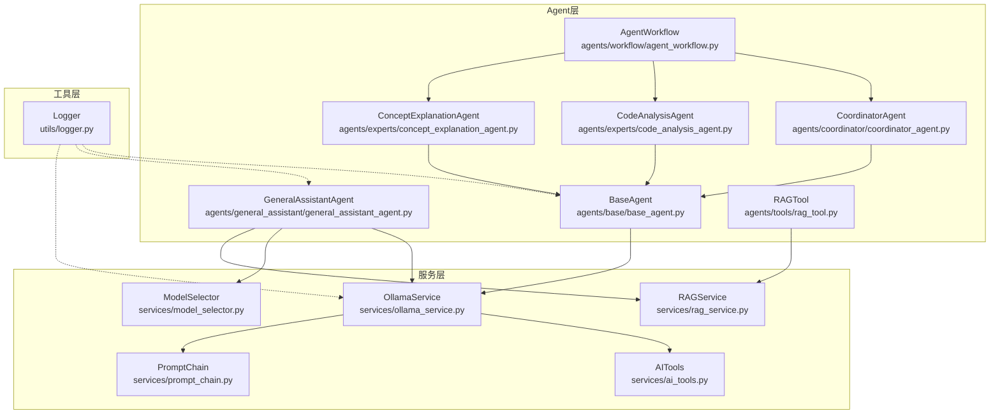
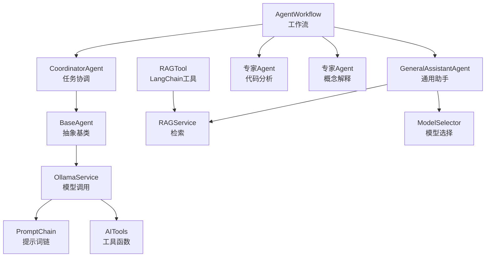
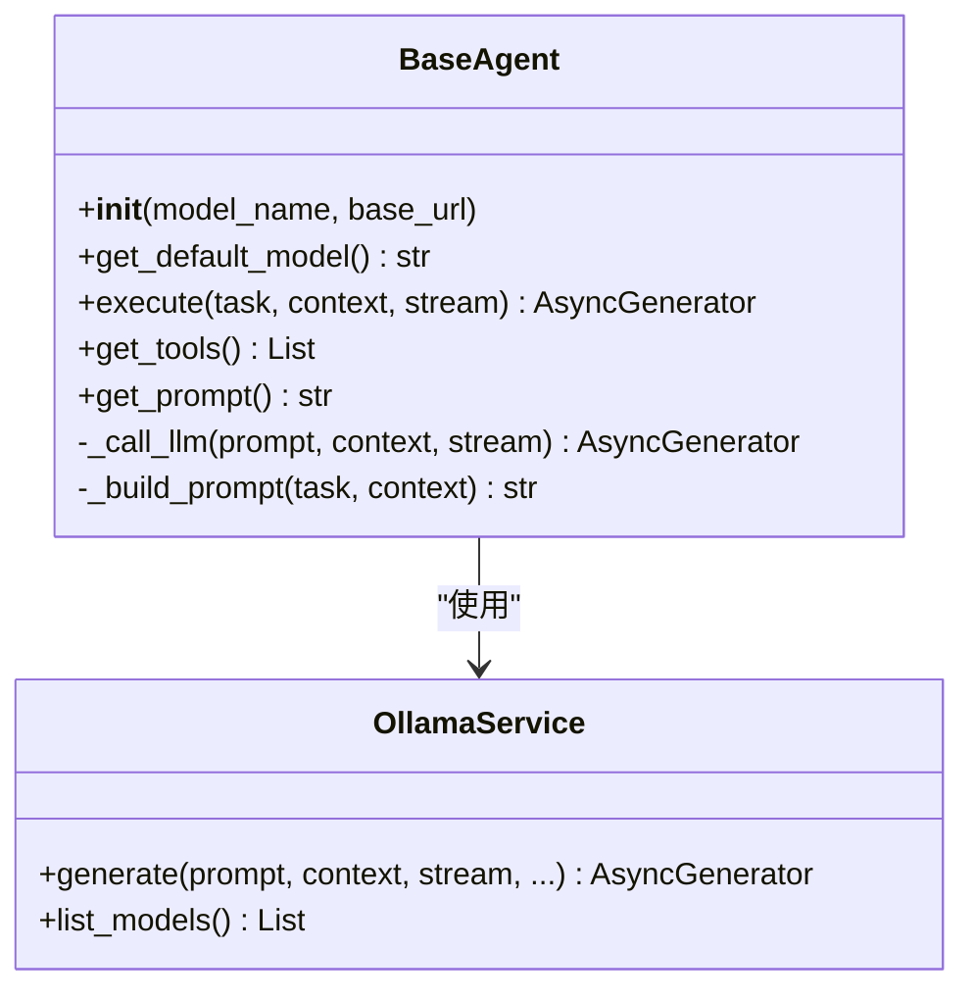
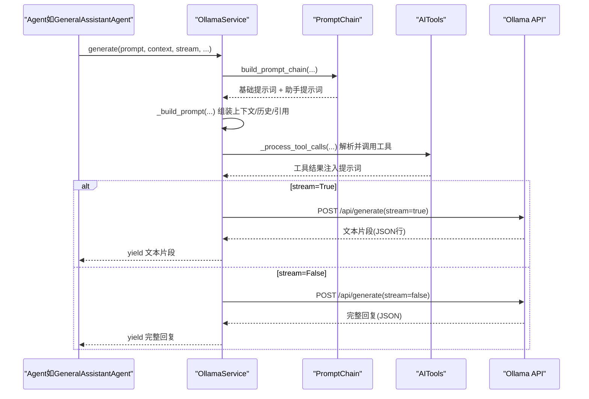
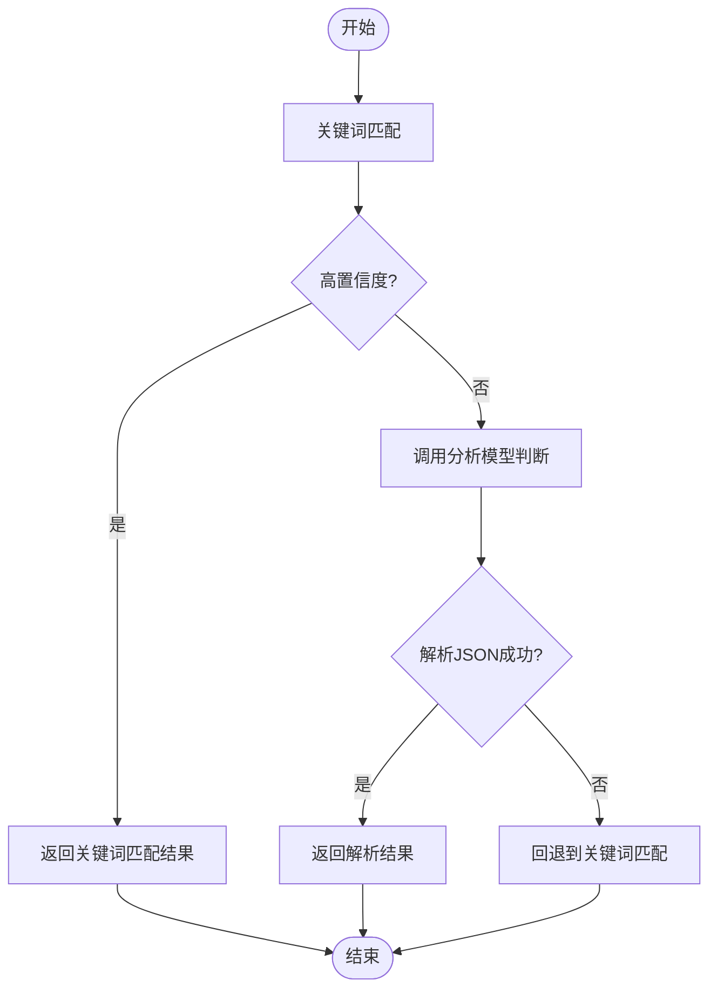
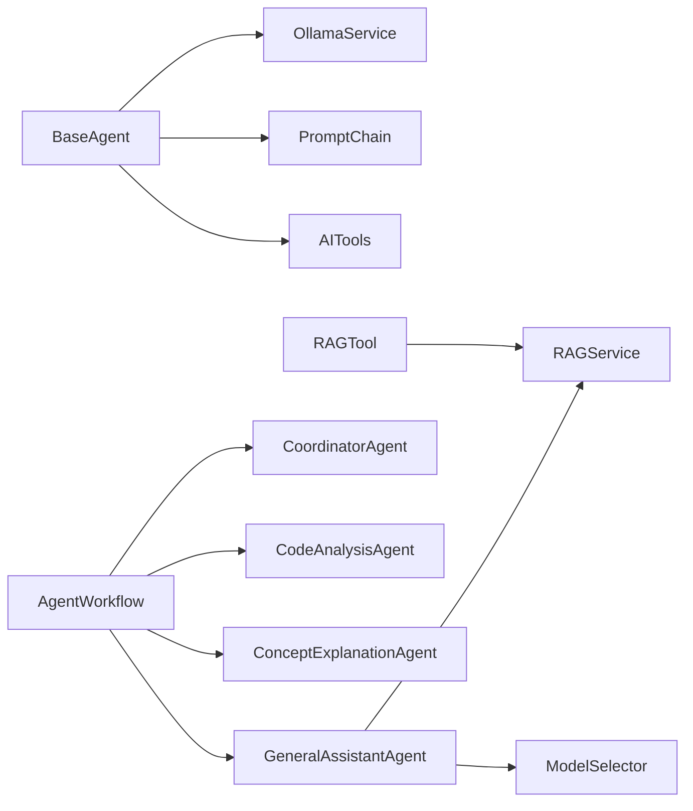

# 基础Agent架构

<cite>
**本文引用的文件**
- [agents/base/base_agent.py](file://agents/base/base_agent.py)
- [services/ollama_service.py](file://services/ollama_service.py)
- [services/model_selector.py](file://services/model_selector.py)
- [services/ai_tools.py](file://services/ai_tools.py)
- [services/prompt_chain.py](file://services/prompt_chain.py)
- [services/rag_service.py](file://services/rag_service.py)
- [agents/general_assistant/general_assistant_agent.py](file://agents/general_assistant/general_assistant_agent.py)
- [agents/experts/code_analysis_agent.py](file://agents/experts/code_analysis_agent.py)
- [agents/experts/concept_explanation_agent.py](file://agents/experts/concept_explanation_agent.py)
- [agents/coordinator/coordinator_agent.py](file://agents/coordinator/coordinator_agent.py)
- [agents/workflow/agent_workflow.py](file://agents/workflow/agent_workflow.py)
- [agents/tools/rag_tool.py](file://agents/tools/rag_tool.py)
- [utils/logger.py](file://utils/logger.py)
</cite>

## 目录
1. [引言](#引言)
2. [项目结构](#项目结构)
3. [核心组件](#核心组件)
4. [架构总览](#架构总览)
5. [详细组件分析](#详细组件分析)
6. [依赖分析](#依赖分析)
7. [性能考量](#性能考量)
8. [故障排查指南](#故障排查指南)
9. [结论](#结论)
10. [附录](#附录)

## 引言
本技术文档围绕基础Agent架构展开，系统阐释BaseAgent抽象基类的设计理念、核心接口定义与扩展方式，涵盖模型初始化机制、LLM调用封装、提示词构建系统、execute方法的异步执行与流式输出、上下文管理、以及与OllamaService的集成与模型选择策略。文档还提供如何继承BaseAgent创建自定义Agent的最佳实践，包括参数配置、错误处理与日志记录，并给出与OllamaService交互的详细流程图与时序图。

## 项目结构
该项目采用“按功能域分层”的组织方式，Agent层负责业务语义与任务编排，Service层负责底层能力（如RAG、模型调用、工具函数等），Utils层提供通用工具（如日志、令牌估算等）。与Agent架构直接相关的核心文件如下：
- 基类与专家Agent：agents/base/base_agent.py、agents/experts/*.py、agents/general_assistant/general_assistant_agent.py、agents/coordinator/coordinator_agent.py
- 服务层：services/ollama_service.py、services/model_selector.py、services/ai_tools.py、services/prompt_chain.py、services/rag_service.py
- 工作流与工具：agents/workflow/agent_workflow.py、agents/tools/rag_tool.py
- 日志：utils/logger.py

图表来源
- [agents/base/base_agent.py:1-122](file://agents/base/base_agent.py#L1-L122)
- [services/ollama_service.py:1-674](file://services/ollama_service.py#L1-L674)
- [services/model_selector.py:1-206](file://services/model_selector.py#L1-L206)
- [services/ai_tools.py:1-498](file://services/ai_tools.py#L1-L498)
- [services/prompt_chain.py:1-450](file://services/prompt_chain.py#L1-L450)
- [services/rag_service.py:1-323](file://services/rag_service.py#L1-L323)
- [agents/general_assistant/general_assistant_agent.py:1-167](file://agents/general_assistant/general_assistant_agent.py#L1-L167)
- [agents/experts/code_analysis_agent.py:1-79](file://agents/experts/code_analysis_agent.py#L1-L79)
- [agents/experts/concept_explanation_agent.py:1-70](file://agents/experts/concept_explanation_agent.py#L1-L70)
- [agents/coordinator/coordinator_agent.py:1-252](file://agents/coordinator/coordinator_agent.py#L1-L252)
- [agents/workflow/agent_workflow.py:1-388](file://agents/workflow/agent_workflow.py#L1-L388)
- [agents/tools/rag_tool.py:1-58](file://agents/tools/rag_tool.py#L1-L58)
- [utils/logger.py:1-88](file://utils/logger.py#L1-L88)

章节来源
- [agents/base/base_agent.py:1-122](file://agents/base/base_agent.py#L1-L122)
- [services/ollama_service.py:1-674](file://services/ollama_service.py#L1-L674)
- [services/model_selector.py:1-206](file://services/model_selector.py#L1-L206)
- [services/ai_tools.py:1-498](file://services/ai_tools.py#L1-L498)
- [services/prompt_chain.py:1-450](file://services/prompt_chain.py#L1-L450)
- [services/rag_service.py:1-323](file://services/rag_service.py#L1-L323)
- [agents/general_assistant/general_assistant_agent.py:1-167](file://agents/general_assistant/general_assistant_agent.py#L1-L167)
- [agents/experts/code_analysis_agent.py:1-79](file://agents/experts/code_analysis_agent.py#L1-L79)
- [agents/experts/concept_explanation_agent.py:1-70](file://agents/experts/concept_explanation_agent.py#L1-L70)
- [agents/coordinator/coordinator_agent.py:1-252](file://agents/coordinator/coordinator_agent.py#L1-L252)
- [agents/workflow/agent_workflow.py:1-388](file://agents/workflow/agent_workflow.py#L1-L388)
- [agents/tools/rag_tool.py:1-58](file://agents/tools/rag_tool.py#L1-L58)
- [utils/logger.py:1-88](file://utils/logger.py#L1-L88)

## 核心组件
- BaseAgent：定义Agent通用接口与基础设施，包括模型初始化、LLM调用封装、提示词构建、工具与提示词扩展点等。
- OllamaService：封装Ollama模型调用，支持流式与非流式生成，内置提示词链构建、工具函数调用处理、对话历史与知识库状态注入。
- ModelSelector：根据问题类型智能选择模型（公式/知识），支持关键词快速匹配与模型判断。
- AITools：提供AI可调用的工具函数（如获取模型列表、知识库文档、系统信息、统计信息等），支持同步与异步调用。
- PromptChain：管理基础提示词与助手特定提示词的叠加，形成可扩展的提示词链。
- RAGService：封装RAG检索流程（向量检索、关键词检索、图谱检索、重排等），并提供上下文与来源信息。
- 专家Agent与协调Agent：具体业务Agent（如代码分析、概念解释、通用助手）与任务协调Agent。
- AgentWorkflow：多Agent工作流编排，负责任务规划、并行/串行执行与状态上报。
- RAGTool：LangChain工具，封装RAG检索调用，支持同步与异步执行。

章节来源
- [agents/base/base_agent.py:8-122](file://agents/base/base_agent.py#L8-L122)
- [services/ollama_service.py:9-674](file://services/ollama_service.py#L9-L674)
- [services/model_selector.py:10-206](file://services/model_selector.py#L10-L206)
- [services/ai_tools.py:11-498](file://services/ai_tools.py#L11-L498)
- [services/prompt_chain.py:6-450](file://services/prompt_chain.py#L6-L450)
- [services/rag_service.py:8-323](file://services/rag_service.py#L8-L323)
- [agents/general_assistant/general_assistant_agent.py:9-167](file://agents/general_assistant/general_assistant_agent.py#L9-L167)
- [agents/experts/code_analysis_agent.py:7-79](file://agents/experts/code_analysis_agent.py#L7-L79)
- [agents/experts/concept_explanation_agent.py:7-70](file://agents/experts/concept_explanation_agent.py#L7-L70)
- [agents/coordinator/coordinator_agent.py:7-252](file://agents/coordinator/coordinator_agent.py#L7-L252)
- [agents/workflow/agent_workflow.py:47-388](file://agents/workflow/agent_workflow.py#L47-L388)
- [agents/tools/rag_tool.py:12-58](file://agents/tools/rag_tool.py#L12-L58)

## 架构总览
下图展示了Agent层与服务层的交互关系，以及提示词链、工具函数与RAG检索在生成流程中的位置。

图表来源
- [agents/base/base_agent.py:8-122](file://agents/base/base_agent.py#L8-L122)
- [services/ollama_service.py:9-674](file://services/ollama_service.py#L9-L674)
- [services/model_selector.py:10-206](file://services/model_selector.py#L10-L206)
- [services/ai_tools.py:11-498](file://services/ai_tools.py#L11-L498)
- [services/prompt_chain.py:6-450](file://services/prompt_chain.py#L6-L450)
- [services/rag_service.py:8-323](file://services/rag_service.py#L8-L323)
- [agents/general_assistant/general_assistant_agent.py:9-167](file://agents/general_assistant/general_assistant_agent.py#L9-L167)
- [agents/coordinator/coordinator_agent.py:7-252](file://agents/coordinator/coordinator_agent.py#L7-L252)
- [agents/workflow/agent_workflow.py:47-388](file://agents/workflow/agent_workflow.py#L47-L388)
- [agents/tools/rag_tool.py:12-58](file://agents/tools/rag_tool.py#L12-L58)

## 详细组件分析

### BaseAgent抽象基类
BaseAgent定义了Agent的统一接口与基础设施：
- 模型初始化：构造函数接收model_name与base_url，若未提供则调用get_default_model()获取默认模型，并初始化OllamaService。
- 抽象方法：
  - get_default_model：返回默认模型名称，子类需覆盖。
  - execute：异步执行任务，返回流式结果生成器。
- 可选扩展点：
  - get_tools：返回工具列表（默认空）。
  - get_prompt：返回系统提示词（默认空）。
- 内部封装：
  - _call_llm：委托OllamaService.generate，支持流式与非流式。
  - _build_prompt：将系统提示词与上下文拼接为完整提示词。

图表来源
- [agents/base/base_agent.py:8-122](file://agents/base/base_agent.py#L8-L122)
- [services/ollama_service.py:50-93](file://services/ollama_service.py#L50-L93)

章节来源
- [agents/base/base_agent.py:8-122](file://agents/base/base_agent.py#L8-L122)

### OllamaService：提示词构建与流式生成
OllamaService是LLM调用的核心封装，提供以下关键能力：
- 模型与地址管理：支持从环境变量读取base_url与model_name，并做localhost替换为127.0.0.1以避免DNS解析问题。
- 提示词构建（_build_prompt）：整合基础提示词（通过PromptChain）、助手特定提示词、知识库状态、文档信息、检索上下文、对话历史、引用内容等，形成最终提示词；并在必要时处理工具函数调用（_process_tool_calls）。
- 工具函数调用：支持XML格式的工具调用标记，解析参数并异步调用AITools，将结果注入提示词后继续生成。
- 流式生成（_generate_stream）：通过线程池发起同步HTTP请求，使用队列在异步环境中传递数据，支持超时与空闲检测，逐行解析JSON并yield文本片段。
- 非流式生成（_generate_once）：在事件循环中通过run_in_executor执行同步POST请求，返回完整回复。
- 模型列表获取（list_models）：通过HTTP接口获取可用模型列表。

图表来源
- [services/ollama_service.py:50-274](file://services/ollama_service.py#L50-L274)
- [services/prompt_chain.py:386-431](file://services/prompt_chain.py#L386-L431)
- [services/ai_tools.py:155-196](file://services/ai_tools.py#L155-L196)

章节来源
- [services/ollama_service.py:9-674](file://services/ollama_service.py#L9-L674)
- [services/prompt_chain.py:6-450](file://services/prompt_chain.py#L6-L450)
- [services/ai_tools.py:11-498](file://services/ai_tools.py#L11-L498)

### ModelSelector：智能模型选择
ModelSelector根据问题类型选择模型（公式/知识），支持：
- 快速关键词匹配：对公式/知识相关关键词进行高置信度判断。
- 模型判断：使用轻量模型进行JSON格式判断，返回模型名称与理由。
- 回退策略：当模型判断失败或解析异常时，回退到关键词匹配。

图表来源
- [services/model_selector.py:51-132](file://services/model_selector.py#L51-L132)

章节来源
- [services/model_selector.py:10-206](file://services/model_selector.py#L10-L206)

### AITools：AI可调用工具函数
AITools提供一组AI可调用的工具函数，支持：
- 注册工具：通过register_tool注册工具函数及其Schema。
- 同步与异步调用：call_tool与async_call_tool，异步版本避免在已有事件循环中使用asyncio.run导致的跨loop问题。
- 工具类型：获取可用模型列表、知识库文档列表、系统信息、知识库统计等。
- 参数过滤：仅保留Schema中声明的参数，过滤无效或占位参数。

章节来源
- [services/ai_tools.py:11-498](file://services/ai_tools.py#L11-L498)

### PromptChain：提示词链管理
PromptChain负责：
- 基础提示词获取：优先从数据库读取，否则使用默认值。
- 助手特定提示词叠加：将助手特定提示词作为扩展追加到基础提示词。
- 工具函数描述格式化：生成工具函数列表的描述文本，供提示词注入。

章节来源
- [services/prompt_chain.py:6-450](file://services/prompt_chain.py#L6-L450)

### RAGService：RAG检索与上下文构建
RAGService封装检索流程：
- 动态检索参数：根据问题特征（对比/列举/条款等）动态调整prefetch_k与final_k。
- 并行检索：对多个知识空间集合并行检索，合并结果。
- 邻居扩展：对命中文本块进行前后窗口补齐，提升上下文完整性。
- 上下文拼接与截断：估算tokens并按预算截断，避免上下文过长。
- 来源去重与排序：按分数去重并排序，保证高质量来源优先。

章节来源
- [services/rag_service.py:8-323](file://services/rag_service.py#L8-L323)

### 专家Agent与通用助手Agent
- CodeAnalysisAgent：面向代码分析任务，校验输入是否包含代码，调用_base_llm生成分析结果，支持流式输出与错误处理。
- ConceptExplanationAgent：面向概念解释任务，构建解释性提示词，调用_base_llm生成内容。
- GeneralAssistantAgent：通用助手，集成RAG检索、模型选择、OllamaService生成、流式输出与错误处理，支持动态切换模型。

章节来源
- [agents/experts/code_analysis_agent.py:7-79](file://agents/experts/code_analysis_agent.py#L7-L79)
- [agents/experts/concept_explanation_agent.py:7-70](file://agents/experts/concept_explanation_agent.py#L7-L70)
- [agents/general_assistant/general_assistant_agent.py:9-167](file://agents/general_assistant/general_assistant_agent.py#L9-L167)

### 协调Agent与工作流
- CoordinatorAgent：分析用户问题，规划需要的专家Agent列表与任务分配，返回JSON格式规划结果。
- AgentWorkflow：多Agent工作流编排，负责初始化协调Agent与专家Agent、任务调度、状态上报与结果聚合。

章节来源
- [agents/coordinator/coordinator_agent.py:7-252](file://agents/coordinator/coordinator_agent.py#L7-L252)
- [agents/workflow/agent_workflow.py:47-388](file://agents/workflow/agent_workflow.py#L47-L388)

### LangChain工具：RAGTool
RAGTool封装RAG检索调用，支持同步与异步执行，内部通过事件循环处理异步调用，避免在异步环境中直接运行run_until_complete导致的错误。

章节来源
- [agents/tools/rag_tool.py:12-58](file://agents/tools/rag_tool.py#L12-L58)

## 依赖分析
- BaseAgent依赖OllamaService进行LLM调用，依赖PromptChain与AITools进行提示词构建与工具函数调用。
- GeneralAssistantAgent依赖RAGService进行上下文检索，依赖ModelSelector进行模型选择。
- AgentWorkflow依赖CoordinatorAgent与多个专家Agent，负责任务规划与执行编排。
- RAGTool依赖RAGService进行检索调用。

图表来源
- [agents/base/base_agent.py:8-122](file://agents/base/base_agent.py#L8-L122)
- [services/ollama_service.py:9-674](file://services/ollama_service.py#L9-L674)
- [services/prompt_chain.py:6-450](file://services/prompt_chain.py#L6-L450)
- [services/ai_tools.py:11-498](file://services/ai_tools.py#L11-L498)
- [agents/general_assistant/general_assistant_agent.py:9-167](file://agents/general_assistant/general_assistant_agent.py#L9-L167)
- [services/rag_service.py:8-323](file://services/rag_service.py#L8-L323)
- [services/model_selector.py:10-206](file://services/model_selector.py#L10-L206)
- [agents/workflow/agent_workflow.py:47-388](file://agents/workflow/agent_workflow.py#L47-L388)
- [agents/coordinator/coordinator_agent.py:7-252](file://agents/coordinator/coordinator_agent.py#L7-L252)
- [agents/experts/code_analysis_agent.py:7-79](file://agents/experts/code_analysis_agent.py#L7-L79)
- [agents/experts/concept_explanation_agent.py:7-70](file://agents/experts/concept_explanation_agent.py#L7-L70)
- [agents/tools/rag_tool.py:12-58](file://agents/tools/rag_tool.py#L12-L58)

章节来源
- [agents/base/base_agent.py:8-122](file://agents/base/base_agent.py#L8-L122)
- [services/ollama_service.py:9-674](file://services/ollama_service.py#L9-L674)
- [services/model_selector.py:10-206](file://services/model_selector.py#L10-L206)
- [services/ai_tools.py:11-498](file://services/ai_tools.py#L11-L498)
- [services/prompt_chain.py:6-450](file://services/prompt_chain.py#L6-L450)
- [services/rag_service.py:8-323](file://services/rag_service.py#L8-L323)
- [agents/general_assistant/general_assistant_agent.py:9-167](file://agents/general_assistant/general_assistant_agent.py#L9-L167)
- [agents/coordinator/coordinator_agent.py:7-252](file://agents/coordinator/coordinator_agent.py#L7-L252)
- [agents/workflow/agent_workflow.py:47-388](file://agents/workflow/agent_workflow.py#L47-L388)
- [agents/experts/code_analysis_agent.py:7-79](file://agents/experts/code_analysis_agent.py#L7-L79)
- [agents/experts/concept_explanation_agent.py:7-70](file://agents/experts/concept_explanation_agent.py#L7-L70)
- [agents/tools/rag_tool.py:12-58](file://agents/tools/rag_tool.py#L12-L58)

## 性能考量
- 流式输出：OllamaService通过线程池与队列实现异步流式生成，降低主线程阻塞风险，提高响应速度。
- 超时与空闲检测：流式生成设置最大总时长与空闲超时，避免长时间等待与资源泄露。
- 提示词长度控制：PromptChain与RAGService对上下文进行估算与截断，避免超过模型上下文限制。
- 并行检索：RAGService对多个知识空间集合并行检索，提升检索效率。
- 模型选择：ModelSelector使用轻量模型与关键词匹配快速决策，减少不必要的大模型调用。

[本节为通用性能讨论，无需章节来源]

## 故障排查指南
- 日志配置：使用异步文件处理器，避免阻塞主线程；生产环境可降低日志级别，减少IO压力。
- Ollama连接问题：检查base_url与模型名称，确认localhost替换为127.0.0.1；关注超时与空闲超时日志。
- 工具函数调用失败：检查工具函数名称与参数Schema，确保参数类型转换正确；异步环境下使用async_call_tool。
- RAG检索失败：开启回退策略，使用空上下文继续生成；检查知识空间集合名称与权限。
- Agent执行异常：捕获异常并返回错误状态，前端可根据状态进行重试或提示。

章节来源
- [utils/logger.py:15-88](file://utils/logger.py#L15-L88)
- [services/ollama_service.py:453-638](file://services/ollama_service.py#L453-L638)
- [services/ai_tools.py:155-196](file://services/ai_tools.py#L155-L196)
- [services/rag_service.py:268-317](file://services/rag_service.py#L268-L317)
- [agents/general_assistant/general_assistant_agent.py:158-166](file://agents/general_assistant/general_assistant_agent.py#L158-L166)

## 结论
BaseAgent抽象基类为Agent体系提供了统一的接口与基础设施，结合OllamaService的提示词构建与流式生成能力、AITools的工具函数机制、PromptChain的提示词链管理、RAGService的检索与上下文构建，以及ModelSelector的智能模型选择，形成了可扩展、可维护、高性能的Agent架构。通过继承BaseAgent并实现抽象方法，开发者可以快速创建定制化Agent，并在工作流中进行编排与调度。

[本节为总结性内容，无需章节来源]

## 附录

### 如何继承BaseAgent创建自定义Agent
- 步骤
  - 继承BaseAgent并实现get_default_model与get_prompt。
  - 在execute中构建任务提示词，调用self._call_llm(prompt, context, stream)进行生成。
  - 使用self.get_tools()返回工具列表（如需）。
  - 在context中传入上下文信息（如对话历史、知识库状态等）。
  - 错误处理：捕获异常并返回错误状态，便于前端展示与重试。
  - 日志记录：使用logger记录关键事件与异常，便于排查。
- 示例参考
  - 代码分析Agent：[agents/experts/code_analysis_agent.py:25-79](file://agents/experts/code_analysis_agent.py#L25-L79)
  - 概念解释Agent：[agents/experts/concept_explanation_agent.py:25-70](file://agents/experts/concept_explanation_agent.py#L25-L70)
  - 通用助手Agent：[agents/general_assistant/general_assistant_agent.py:49-167](file://agents/general_assistant/general_assistant_agent.py#L49-L167)

章节来源
- [agents/base/base_agent.py:27-74](file://agents/base/base_agent.py#L27-L74)
- [agents/experts/code_analysis_agent.py:25-79](file://agents/experts/code_analysis_agent.py#L25-L79)
- [agents/experts/concept_explanation_agent.py:25-70](file://agents/experts/concept_explanation_agent.py#L25-L70)
- [agents/general_assistant/general_assistant_agent.py:49-167](file://agents/general_assistant/general_assistant_agent.py#L49-L167)

### 与OllamaService的集成与模型选择策略
- 集成方式
  - BaseAgent通过构造函数初始化OllamaService，或在执行时动态切换模型。
  - OllamaService内部通过PromptChain与AITools构建提示词，处理工具函数调用，支持流式与非流式生成。
- 模型选择策略
  - ModelSelector优先使用关键词匹配，其次使用轻量模型判断，最后回退到关键词匹配。
  - GeneralAssistantAgent在未固定模型时调用ModelSelector进行选择，并在模型变更时重新初始化OllamaService。

章节来源
- [agents/base/base_agent.py:11-25](file://agents/base/base_agent.py#L11-L25)
- [services/ollama_service.py:9-674](file://services/ollama_service.py#L9-L674)
- [services/model_selector.py:51-132](file://services/model_selector.py#L51-L132)
- [agents/general_assistant/general_assistant_agent.py:80-96](file://agents/general_assistant/general_assistant_agent.py#L80-L96)