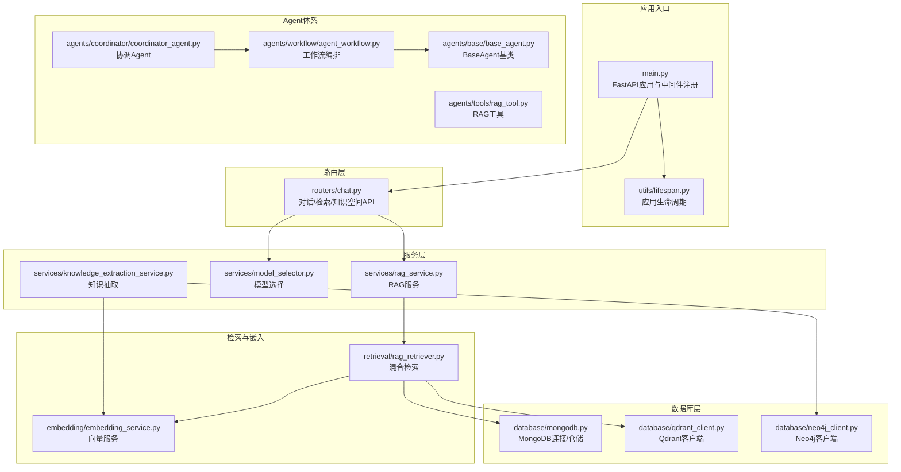
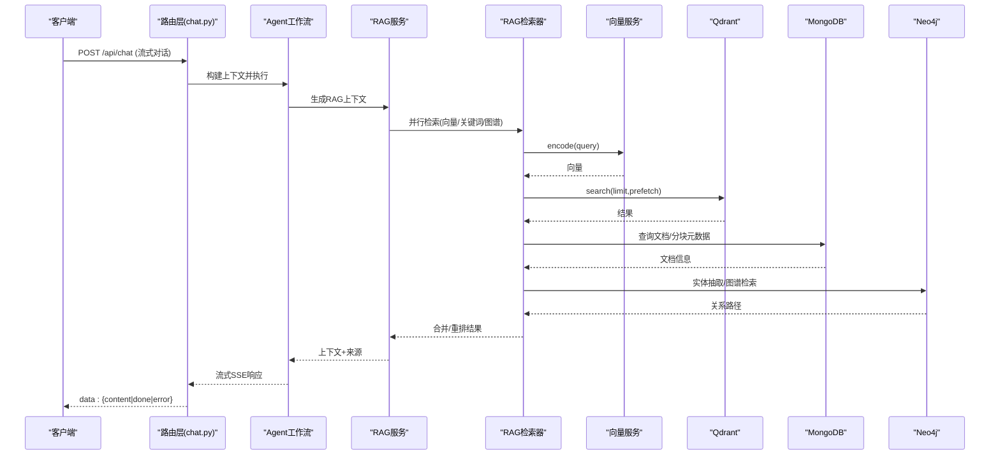
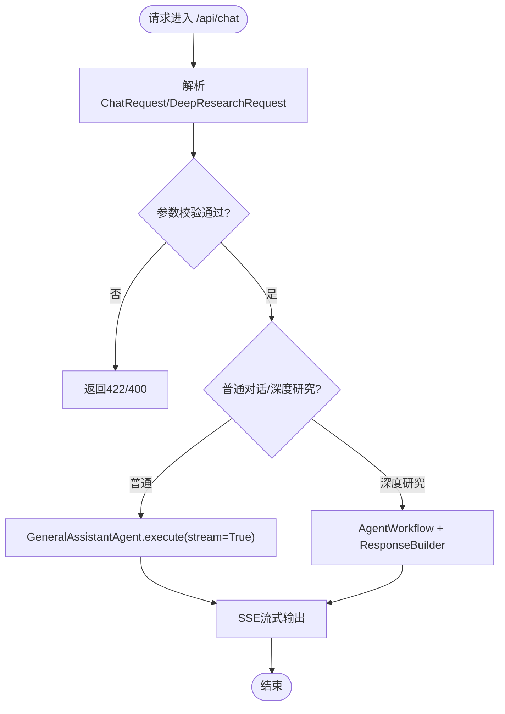
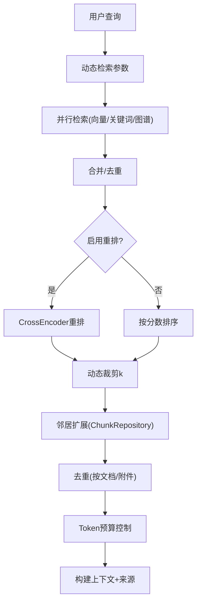
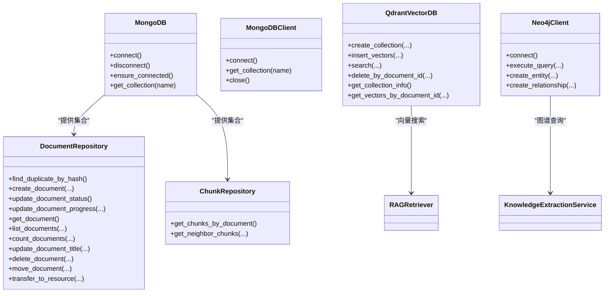
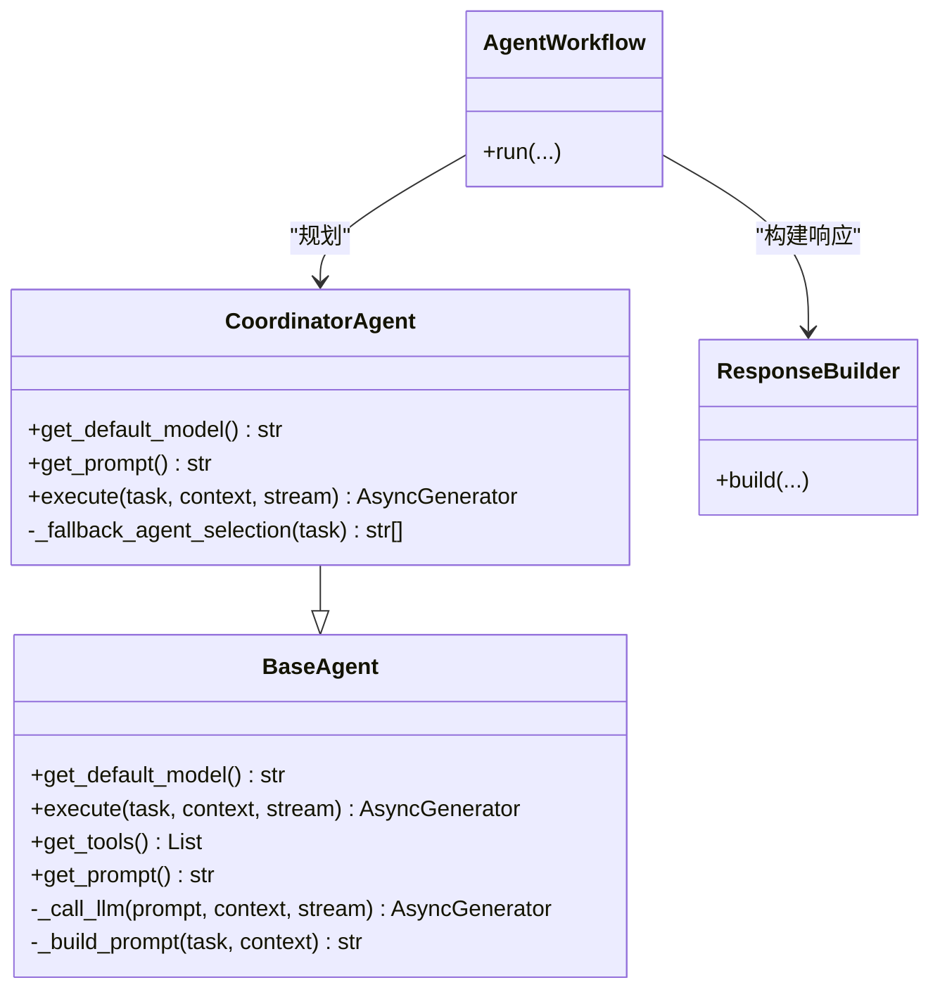
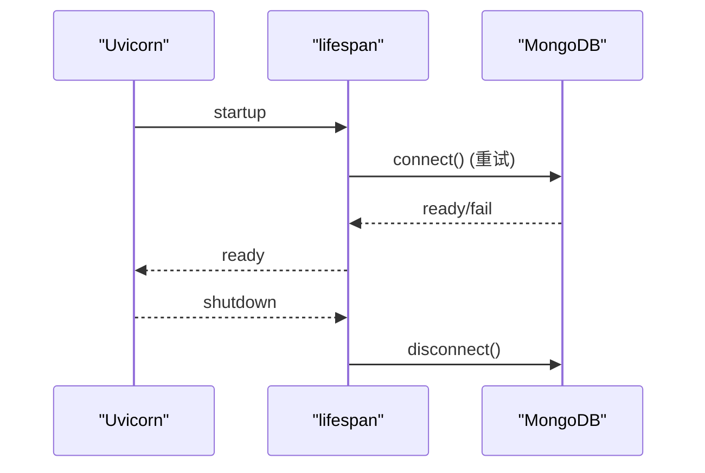
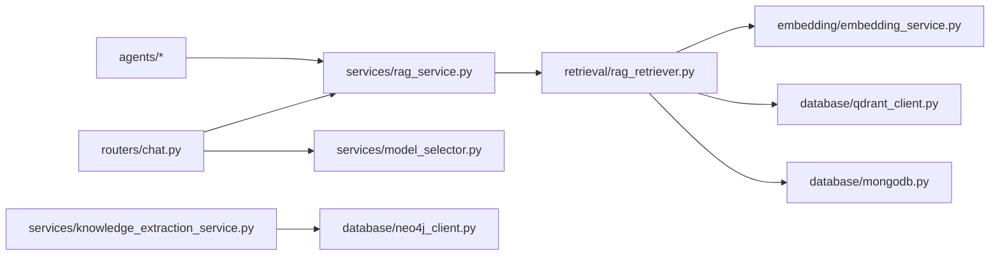

# 后端开发指南

<cite>
**本文引用的文件**
- [main.py](file://main.py)
- [routers/__init__.py](file://routers/__init__.py)
- [routers/chat.py](file://routers/chat.py)
- [agents/base/base_agent.py](file://agents/base/base_agent.py)
- [agents/coordinator/coordinator_agent.py](file://agents/coordinator/coordinator_agent.py)
- [agents/workflow/agent_workflow.py](file://agents/workflow/agent_workflow.py)
- [agents/tools/rag_tool.py](file://agents/tools/rag_tool.py)
- [services/rag_service.py](file://services/rag_service.py)
- [services/model_selector.py](file://services/model_selector.py)
- [services/knowledge_extraction_service.py](file://services/knowledge_extraction_service.py)
- [retrieval/rag_retriever.py](file://retrieval/rag_retriever.py)
- [database/mongodb.py](file://database/mongodb.py)
- [database/qdrant_client.py](file://database/qdrant_client.py)
- [database/neo4j_client.py](file://database/neo4j_client.py)
- [embedding/embedding_service.py](file://embedding/embedding_service.py)
- [middleware/logging_middleware.py](file://middleware/logging_middleware.py)
- [utils/lifespan.py](file://utils/lifespan.py)
</cite>

## 目录
1. [简介](#简介)
2. [项目结构](#项目结构)
3. [核心组件](#核心组件)
4. [架构总览](#架构总览)
5. [详细组件分析](#详细组件分析)
6. [依赖分析](#依赖分析)
7. [性能考量](#性能考量)
8. [故障排查指南](#故障排查指南)
9. [结论](#结论)
10. [附录](#附录)

## 简介
本指南面向Advanced RAG后端开发者，系统梳理FastAPI应用的整体架构与模块组织，明确路由层、服务层、数据库层与工具层的职责边界；深入解析Agent系统（基类设计、专家Agent实现模式、协调Agent机制与工作流编排）；详解服务层核心能力（RAG服务、检索优化、知识抽取、模型选择等）；阐述数据库设计与连接管理（MongoDB、Qdrant、Neo4j）；并提供中间件配置与异常处理的最佳实践、配置项与性能优化建议。

## 项目结构
后端采用分层清晰的模块化组织：
- 路由层（routers）：暴露REST API，负责HTTP请求接入、参数校验与响应封装
- 服务层（services）：封装业务逻辑，协调检索、推理与外部服务
- 数据库层（database）：统一抽象MongoDB、Qdrant、Neo4j的连接与操作
- 工具层（utils）：日志、生命周期管理、监控、GPU检测等通用能力
- Agent体系（agents）：基类、专家Agent、协调Agent与工作流编排
- 检索与嵌入（retrieval、embedding）：混合检索、向量检索、CrossEncoder重排、实体抽取与图谱构建

图表来源
- [main.py:1-171](file://main.py#L1-L171)
- [routers/chat.py:1-800](file://routers/chat.py#L1-L800)
- [services/rag_service.py:1-323](file://services/rag_service.py#L1-L323)
- [retrieval/rag_retriever.py:1-393](file://retrieval/rag_retriever.py#L1-L393)
- [embedding/embedding_service.py:1-333](file://embedding/embedding_service.py#L1-L333)
- [database/mongodb.py:1-800](file://database/mongodb.py#L1-L800)
- [database/qdrant_client.py:1-544](file://database/qdrant_client.py#L1-L544)
- [database/neo4j_client.py:1-104](file://database/neo4j_client.py#L1-L104)
- [agents/base/base_agent.py:1-122](file://agents/base/base_agent.py#L1-L122)
- [agents/coordinator/coordinator_agent.py:1-252](file://agents/coordinator/coordinator_agent.py#L1-L252)
- [agents/workflow/agent_workflow.py](file://agents/workflow/agent_workflow.py)
- [agents/tools/rag_tool.py](file://agents/tools/rag_tool.py)

章节来源
- [main.py:1-171](file://main.py#L1-L171)
- [routers/__init__.py:1-3](file://routers/__init__.py#L1-L3)

## 核心组件
- 应用入口与中间件
  - FastAPI实例、CORS、静态文件挂载、全局异常处理、Uvicorn启动参数与worker数量
  - 请求日志中间件与性能监控
- 路由层
  - 对话管理、消息流式输出、深度研究模式、模型列表查询
- 服务层
  - RAG服务：检索上下文、动态参数、邻居扩展、去重与拼接
  - 模型选择：关键词匹配与LLM判断，公式/知识模型分流
  - 知识抽取：三元组抽取、实体提取、Neo4j图谱构建
- 检索与嵌入
  - 混合检索：向量、关键词、图谱并行，合并与重排
  - 向量服务：Ollama嵌入、维度探测、批处理与重试
- 数据库层
  - MongoDB：异步/同步客户端、连接池、仓储封装、文档/分块操作
  - Qdrant：gRPC连接、集合管理、插入/搜索/删除、自动重建
  - Neo4j：连接、查询、实体/关系创建
- Agent体系
  - BaseAgent：统一模型与提示词、工具接口、提示词构建
  - 协调Agent：任务规划、专家选择、回退策略
  - 工作流编排：串联专家Agent与响应构建

章节来源
- [main.py:55-127](file://main.py#L55-L127)
- [middleware/logging_middleware.py:1-52](file://middleware/logging_middleware.py#L1-L52)
- [routers/chat.py:623-800](file://routers/chat.py#L623-L800)
- [services/rag_service.py:8-323](file://services/rag_service.py#L8-L323)
- [services/model_selector.py:10-206](file://services/model_selector.py#L10-L206)
- [services/knowledge_extraction_service.py:12-229](file://services/knowledge_extraction_service.py#L12-L229)
- [retrieval/rag_retriever.py:17-393](file://retrieval/rag_retriever.py#L17-L393)
- [embedding/embedding_service.py:8-333](file://embedding/embedding_service.py#L8-L333)
- [database/mongodb.py:92-204](file://database/mongodb.py#L92-L204)
- [database/qdrant_client.py:18-544](file://database/qdrant_client.py#L18-L544)
- [database/neo4j_client.py:6-104](file://database/neo4j_client.py#L6-L104)
- [agents/base/base_agent.py:8-122](file://agents/base/base_agent.py#L8-L122)
- [agents/coordinator/coordinator_agent.py:7-252](file://agents/coordinator/coordinator_agent.py#L7-L252)

## 架构总览
后端采用“路由层-服务层-检索层-数据库层”的分层架构，配合Agent工作流实现“深度研究”场景。整体流程如下：

图表来源
- [routers/chat.py:623-760](file://routers/chat.py#L623-L760)
- [services/rag_service.py:34-126](file://services/rag_service.py#L34-L126)
- [retrieval/rag_retriever.py:89-137](file://retrieval/rag_retriever.py#L89-L137)
- [embedding/embedding_service.py:175-318](file://embedding/embedding_service.py#L175-L318)
- [database/qdrant_client.py:336-413](file://database/qdrant_client.py#L336-L413)
- [database/mongodb.py:793-800](file://database/mongodb.py#L793-L800)
- [services/knowledge_extraction_service.py:147-228](file://services/knowledge_extraction_service.py#L147-L228)

## 详细组件分析

### 路由层：HTTP接入与参数校验
- 负责对话创建、消息管理、流式响应、深度研究模式
- 使用Pydantic模型进行请求参数校验
- 通过Depends(require_mongodb)确保数据库可用
- 流式输出采用SSE，支持客户端断开检测

图表来源
- [routers/chat.py:623-800](file://routers/chat.py#L623-L800)

章节来源
- [routers/chat.py:19-83](file://routers/chat.py#L19-L83)
- [routers/chat.py:97-150](file://routers/chat.py#L97-L150)
- [routers/chat.py:623-760](file://routers/chat.py#L623-L760)

### 服务层：RAG服务与检索优化
- RAG服务
  - 动态检索参数：根据查询长度、关键词启发式调整prefetch_k/final_k
  - 并行检索：知识空间集合并行、向量检索、邻居扩展、去重与拼接
  - 上下文控制：token预算估算与截断
  - 回退策略：检索失败时可选择不使用上下文继续
- 检索器
  - 并行策略：向量、关键词、图谱检索
  - 合并与重排：合并去重、CrossEncoder重排、动态裁剪k
  - 运行时开关：重排与图谱检索可按运行时配置关闭
- 知识抽取
  - 三元组抽取、实体提取、Neo4j图谱构建（可冷却降级）
- 模型选择
  - 快速关键词匹配与LLM判断，分流公式/知识模型

图表来源
- [services/rag_service.py:11-33](file://services/rag_service.py#L11-L33)
- [services/rag_service.py:34-126](file://services/rag_service.py#L34-L126)
- [retrieval/rag_retriever.py:115-137](file://retrieval/rag_retriever.py#L115-L137)
- [retrieval/rag_retriever.py:328-363](file://retrieval/rag_retriever.py#L328-L363)
- [retrieval/rag_retriever.py:139-167](file://retrieval/rag_retriever.py#L139-L167)

章节来源
- [services/rag_service.py:8-323](file://services/rag_service.py#L8-L323)
- [retrieval/rag_retriever.py:17-393](file://retrieval/rag_retriever.py#L17-L393)
- [services/knowledge_extraction_service.py:12-229](file://services/knowledge_extraction_service.py#L12-L229)
- [services/model_selector.py:10-206](file://services/model_selector.py#L10-L206)

### 数据库层：连接管理与仓储封装
- MongoDB
  - 异步/同步双客户端，连接池参数可配置，启动时连接与健康检查
  - 仓储封装：DocumentRepository、ChunkRepository
- Qdrant
  - gRPC优先连接，自动重建集合，插入重试与维度自适配
  - 搜索、删除、滚动查询、集合信息
- Neo4j
  - 连接与查询，实体/关系创建，容器内URI适配

图表来源
- [database/mongodb.py:92-204](file://database/mongodb.py#L92-L204)
- [database/mongodb.py:338-800](file://database/mongodb.py#L338-L800)
- [database/qdrant_client.py:18-544](file://database/qdrant_client.py#L18-L544)
- [database/neo4j_client.py:6-104](file://database/neo4j_client.py#L6-L104)

章节来源
- [database/mongodb.py:1-800](file://database/mongodb.py#L1-L800)
- [database/qdrant_client.py:1-544](file://database/qdrant_client.py#L1-L544)
- [database/neo4j_client.py:1-104](file://database/neo4j_client.py#L1-L104)

### Agent体系：基类、专家与协调
- BaseAgent
  - 统一模型初始化、提示词构建、工具接口、LLM调用
- 协调Agent
  - 任务规划、专家选择、回退策略（关键词匹配）
- 工作流编排
  - 串联专家Agent与响应构建，支持深度研究模式

图表来源
- [agents/base/base_agent.py:8-122](file://agents/base/base_agent.py#L8-L122)
- [agents/coordinator/coordinator_agent.py:7-252](file://agents/coordinator/coordinator_agent.py#L7-L252)
- [agents/workflow/agent_workflow.py](file://agents/workflow/agent_workflow.py)
- [agents/tools/rag_tool.py](file://agents/tools/rag_tool.py)

章节来源
- [agents/base/base_agent.py:1-122](file://agents/base/base_agent.py#L1-L122)
- [agents/coordinator/coordinator_agent.py:1-252](file://agents/coordinator/coordinator_agent.py#L1-L252)

### 中间件与异常处理
- 日志中间件
  - 记录请求/响应、慢请求与错误，性能监控埋点
- 全局异常处理
  - 统一JSON响应与日志记录，跨域头透传
- 应用生命周期
  - 启动时MongoDB连接重试、默认助手/知识空间初始化、关闭清理

图表来源
- [utils/lifespan.py:28-93](file://utils/lifespan.py#L28-L93)
- [middleware/logging_middleware.py:8-52](file://middleware/logging_middleware.py#L8-L52)
- [main.py:110-127](file://main.py#L110-L127)

章节来源
- [middleware/logging_middleware.py:1-52](file://middleware/logging_middleware.py#L1-L52)
- [main.py:110-127](file://main.py#L110-L127)
- [utils/lifespan.py:1-93](file://utils/lifespan.py#L1-L93)

## 依赖分析
- 路由层依赖服务层与数据库层，通过Depends注入保证数据库可用
- 服务层依赖检索器、嵌入服务与数据库客户端
- 检索器依赖嵌入服务、Qdrant与MongoDB、可选Neo4j
- Agent体系依赖Ollama服务与工具链

图表来源
- [routers/chat.py:623-760](file://routers/chat.py#L623-L760)
- [services/rag_service.py:34-126](file://services/rag_service.py#L34-L126)
- [retrieval/rag_retriever.py:89-137](file://retrieval/rag_retriever.py#L89-L137)
- [embedding/embedding_service.py:175-318](file://embedding/embedding_service.py#L175-L318)
- [database/mongodb.py:92-204](file://database/mongodb.py#L92-L204)
- [database/qdrant_client.py:336-413](file://database/qdrant_client.py#L336-L413)
- [database/neo4j_client.py:40-104](file://database/neo4j_client.py#L40-L104)

章节来源
- [routers/chat.py:1-800](file://routers/chat.py#L1-L800)
- [services/rag_service.py:1-323](file://services/rag_service.py#L1-L323)
- [retrieval/rag_retriever.py:1-393](file://retrieval/rag_retriever.py#L1-L393)

## 性能考量
- 连接池与并发
  - MongoDB连接池参数可调（maxPoolSize/minPoolSize/maxIdleTimeMS等）
  - Qdrant优先gRPC连接，降低httpx依赖带来的502风险
  - Uvicorn生产环境多worker，开发环境单worker
- 检索优化
  - 动态k与重排结合，避免过度召回
  - 邻居扩展窗口与token预算控制，平衡召回与上下文长度
- I/O与阻塞
  - Neo4j与Ollama等外部服务使用线程池或异步to_thread，避免事件循环阻塞
- 日志与监控
  - 中间件记录慢请求与错误，便于定位性能瓶颈

## 故障排查指南
- MongoDB连接失败
  - 检查MONGODB_URI/MONGODB_HOST/PORT/认证参数
  - 启动时连接失败不会阻止服务启动，依赖接口会返回503
- Qdrant连接失败
  - 优先gRPC，自动重建集合；维度不匹配时自动重建
  - 临时性错误（502/503/504/timeout）自动重试
- Neo4j连接失败
  - 容器内URI适配host.docker.internal；连接失败冷却降级
- Agent执行异常
  - 协调Agent回退策略：关键词匹配专家选择
  - 深度研究模式下工作流捕获错误并返回

章节来源
- [database/mongodb.py:191-223](file://database/mongodb.py#L191-L223)
- [database/qdrant_client.py:336-413](file://database/qdrant_client.py#L336-L413)
- [database/neo4j_client.py:16-33](file://database/neo4j_client.py#L16-L33)
- [agents/coordinator/coordinator_agent.py:170-213](file://agents/coordinator/coordinator_agent.py#L170-L213)

## 结论
本后端以FastAPI为核心，通过清晰的分层与模块化设计，实现了从HTTP接入到Agent深度研究的完整闭环。服务层的RAG与检索优化、数据库层的多引擎集成、以及Agent体系的可扩展编排，共同构成了高性能、可维护的Advanced RAG系统。建议在生产环境中合理配置连接池与并发参数，持续监控慢请求与错误，结合运行时开关灵活启用高耗模块。

## 附录
- 关键配置项（示例）
  - 环境变量：ENVIRONMENT、NODE_ENV、PORT、HOST、UVICORN_WORKERS
  - MongoDB：MONGODB_URI/MONGODB_HOST/MONGODB_PORT/MONGODB_USERNAME/MONGODB_PASSWORD/MONGODB_DB_NAME、连接池参数
  - Qdrant：QDRANT_URL/QDRANT_API_KEY/QDRANT_TIMEOUT/QDRANT_GRPC_PORT
  - Neo4j：NEO4J_URI/NEO4J_USER/NEO4J_PASSWORD
  - Ollama：OLLAMA_BASE_URL/OLLAMA_EMBEDDING_MODEL/OLLAMA_EMBEDDING_MAX_CHARS
  - 检索与重排：ENABLE_RERANKER/RERANKER_MODEL/RERANKER_DEVICE/DYNK_MIN/DYNK_MAX/DYNK_GAP_HIGH/DYNK_GAP_LOW
  - 运行时模块开关：runtime_config.modules.rerank_enabled/kg_retrieve_enabled
- 性能优化建议
  - 启用gRPC连接与连接池复用
  - 合理设置prefetch_k/final_k与重排阈值
  - 控制上下文token预算，避免超长prompt
  - 使用线程池隔离阻塞IO，避免事件循环卡顿