# 工具服务

<cite>
**本文引用的文件**
- [utils/logger.py](file://utils/logger.py)
- [utils/token_utils.py](file://utils/token_utils.py)
- [utils/gpu_check.py](file://utils/gpu_check.py)
- [utils/timezone.py](file://utils/timezone.py)
- [utils/video_thumbnail.py](file://utils/video_thumbnail.py)
- [utils/monitoring.py](file://utils/monitoring.py)
- [utils/code_analyzer.py](file://utils/code_analyzer.py)
- [utils/formula_analyzer.py](file://utils/formula_analyzer.py)
- [utils/formula_extractor.py](file://utils/formula_extractor.py)
- [utils/table_extractor.py](file://utils/table_extractor.py)
- [eval/retrieval_eval.py](file://eval/retrieval_eval.py)
- [eval/evaluate.py](file://eval/evaluate.py)
- [eval/dataset.json](file://eval/dataset.json)
- [eval/retrieval_dataset.example.json](file://eval/retrieval_dataset.example.json)
- [utils/lifespan.py](file://utils/lifespan.py)
</cite>

## 目录
1. [简介](#简介)
2. [项目结构](#项目结构)
3. [核心组件](#核心组件)
4. [架构总览](#架构总览)
5. [详细组件分析](#详细组件分析)
6. [依赖分析](#依赖分析)
7. [性能考虑](#性能考虑)
8. [故障排查指南](#故障排查指南)
9. [结论](#结论)
10. [附录](#附录)

## 简介
本文件面向 Advanced RAG 工具服务，系统化梳理并说明以下能力与实现：
- 日志记录服务：异步日志写入、多处理器、环境分级与过滤
- 令牌管理：近似估算与截断策略，避免强依赖特定分词器
- GPU 检测：跨平台 CUDA 设备可用性检查，兼容多种探测方式
- 时间处理：统一北京时间时区工具
- 视频缩略图生成：基于 ffmpeg 的封面提取与校验
- 评估工具：检索评估、模型评估（LLM-as-a-Judge）、基准测试
- 监控服务：请求耗时统计、慢请求告警、系统资源指标采集
- 工具函数：代码分析（语法/语义）、公式提取与分析、表格提取与结构化
- 扩展开发指南：新增工具函数、参数配置、异常处理
- 性能优化与最佳实践

## 项目结构
工具服务主要分布在 utils 与 eval 目录，配合服务层与路由层使用。核心文件分布如下：
- 日志与监控：utils/logger.py、utils/monitoring.py
- 令牌与时间：utils/token_utils.py、utils/timezone.py
- 硬件检测：utils/gpu_check.py
- 媒体处理：utils/video_thumbnail.py
- 代码/公式/表格：utils/code_analyzer.py、utils/formula_analyzer.py、utils/formula_extractor.py、utils/table_extractor.py
- 评估：eval/retrieval_eval.py、eval/evaluate.py、eval/dataset.json、eval/retrieval_dataset.example.json
- 生命周期：utils/lifespan.py

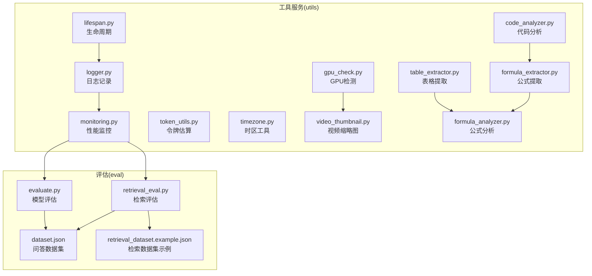

图表来源
- [utils/logger.py:1-88](file://utils/logger.py#L1-L88)
- [utils/monitoring.py:1-185](file://utils/monitoring.py#L1-L185)
- [utils/token_utils.py:1-72](file://utils/token_utils.py#L1-L72)
- [utils/timezone.py:1-53](file://utils/timezone.py#L1-L53)
- [utils/gpu_check.py:1-66](file://utils/gpu_check.py#L1-L66)
- [utils/video_thumbnail.py:1-123](file://utils/video_thumbnail.py#L1-L123)
- [utils/code_analyzer.py:1-350](file://utils/code_analyzer.py#L1-L350)
- [utils/formula_extractor.py:1-149](file://utils/formula_extractor.py#L1-L149)
- [utils/formula_analyzer.py:1-233](file://utils/formula_analyzer.py#L1-L233)
- [utils/table_extractor.py:1-290](file://utils/table_extractor.py#L1-L290)
- [eval/retrieval_eval.py:1-102](file://eval/retrieval_eval.py#L1-L102)
- [eval/evaluate.py:1-127](file://eval/evaluate.py#L1-L127)
- [eval/dataset.json:1-16](file://eval/dataset.json#L1-L16)
- [eval/retrieval_dataset.example.json:1-20](file://eval/retrieval_dataset.example.json#L1-L20)
- [utils/lifespan.py:1-93](file://utils/lifespan.py#L1-L93)

章节来源
- [utils/logger.py:1-88](file://utils/logger.py#L1-L88)
- [utils/monitoring.py:1-185](file://utils/monitoring.py#L1-L185)
- [utils/token_utils.py:1-72](file://utils/token_utils.py#L1-L72)
- [utils/timezone.py:1-53](file://utils/timezone.py#L1-L53)
- [utils/gpu_check.py:1-66](file://utils/gpu_check.py#L1-L66)
- [utils/video_thumbnail.py:1-123](file://utils/video_thumbnail.py#L1-L123)
- [utils/code_analyzer.py:1-350](file://utils/code_analyzer.py#L1-L350)
- [utils/formula_extractor.py:1-149](file://utils/formula_extractor.py#L1-L149)
- [utils/formula_analyzer.py:1-233](file://utils/formula_analyzer.py#L1-L233)
- [utils/table_extractor.py:1-290](file://utils/table_extractor.py#L1-L290)
- [eval/retrieval_eval.py:1-102](file://eval/retrieval_eval.py#L1-L102)
- [eval/evaluate.py:1-127](file://eval/evaluate.py#L1-L127)
- [eval/dataset.json:1-16](file://eval/dataset.json#L1-L16)
- [eval/retrieval_dataset.example.json:1-20](file://eval/retrieval_dataset.example.json#L1-L20)
- [utils/lifespan.py:1-93](file://utils/lifespan.py#L1-L93)

## 核心组件
- 日志记录服务：支持异步写入、多处理器、环境分级、第三方库日志抑制
- 令牌管理：估算与截断，兼顾中英文字符与 Unicode 混排
- GPU 检测：PyTorch、pynvml、nvidia-smi 三路探测
- 时间处理：北京时间时区、ISO 转换、统一时间表示
- 视频缩略图：ffmpeg 提取首帧、尺寸缩放、质量参数、存在性校验与异常处理
- 评估工具：检索评估（Recall/Precision@K）、模型评估（LLM-as-a-Judge）
- 监控服务：请求耗时统计、慢请求告警、CPU/内存/磁盘/进程指标
- 工具函数：代码分析（函数/类/导入/关键字/复杂度）、公式提取与分析（变量/关系/结构）、表格提取与结构化

章节来源
- [utils/logger.py:15-82](file://utils/logger.py#L15-L82)
- [utils/token_utils.py:16-71](file://utils/token_utils.py#L16-L71)
- [utils/gpu_check.py:10-66](file://utils/gpu_check.py#L10-L66)
- [utils/timezone.py:9-52](file://utils/timezone.py#L9-L52)
- [utils/video_thumbnail.py:12-107](file://utils/video_thumbnail.py#L12-L107)
- [eval/retrieval_eval.py:35-74](file://eval/retrieval_eval.py#L35-L74)
- [eval/evaluate.py:19-90](file://eval/evaluate.py#L19-L90)
- [utils/monitoring.py:13-184](file://utils/monitoring.py#L13-L184)
- [utils/code_analyzer.py:7-350](file://utils/code_analyzer.py#L7-L350)
- [utils/formula_extractor.py:28-148](file://utils/formula_extractor.py#L28-L148)
- [utils/formula_analyzer.py:32-232](file://utils/formula_analyzer.py#L32-L232)
- [utils/table_extractor.py:10-289](file://utils/table_extractor.py#L10-L289)

## 架构总览
工具服务围绕“输入处理—分析/提取—输出”的流水线组织，日志与监控贯穿始终，评估模块独立运行或集成到服务流程。

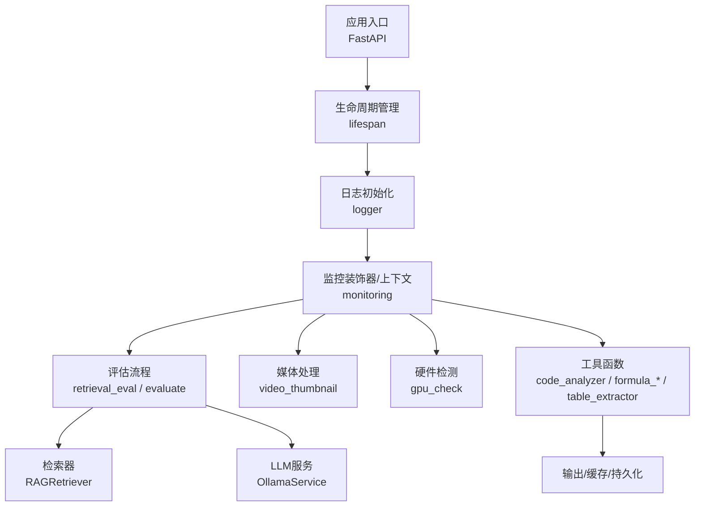

图表来源
- [utils/lifespan.py:28-93](file://utils/lifespan.py#L28-L93)
- [utils/logger.py:15-82](file://utils/logger.py#L15-L82)
- [utils/monitoring.py:118-184](file://utils/monitoring.py#L118-L184)
- [eval/retrieval_eval.py:35-74](file://eval/retrieval_eval.py#L35-L74)
- [eval/evaluate.py:19-90](file://eval/evaluate.py#L19-L90)
- [utils/video_thumbnail.py:12-107](file://utils/video_thumbnail.py#L12-L107)
- [utils/gpu_check.py:10-66](file://utils/gpu_check.py#L10-L66)
- [utils/code_analyzer.py:7-350](file://utils/code_analyzer.py#L7-L350)
- [utils/formula_extractor.py:28-148](file://utils/formula_extractor.py#L28-L148)
- [utils/formula_analyzer.py:32-232](file://utils/formula_analyzer.py#L32-L232)
- [utils/table_extractor.py:10-289](file://utils/table_extractor.py#L10-L289)

## 详细组件分析

### 日志记录服务
- 异步写入：使用队列与队列监听器，避免阻塞主线程
- 多处理器：控制台同步输出与异步文件输出
- 环境分级：生产环境仅记录 WARNING 及以上级别
- 第三方库过滤：降低噪声日志

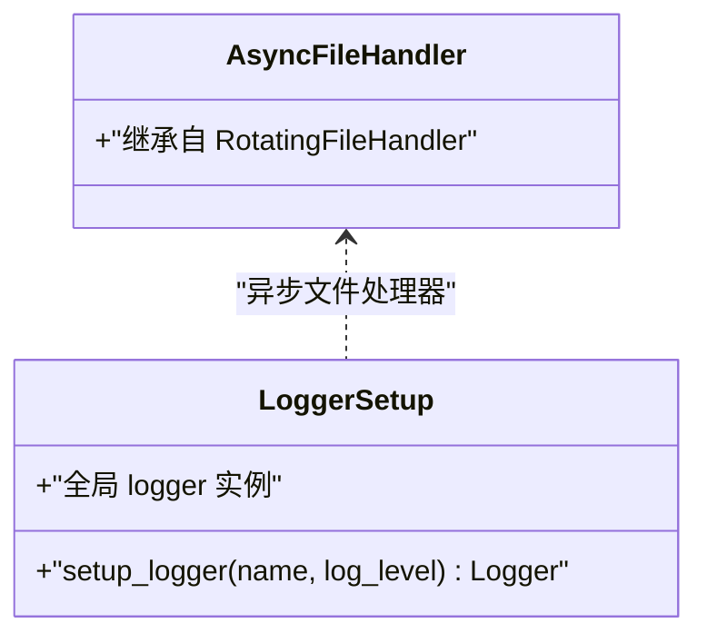

图表来源
- [utils/logger.py:10-86](file://utils/logger.py#L10-L86)

章节来源
- [utils/logger.py:15-82](file://utils/logger.py#L15-L82)

### 令牌管理
- 估算策略：按字符类别加权估算，兼顾中英文与 Unicode
- 截断算法：二分查找，避免 O(n^2) 复杂度
- 预算数据结构：chunk_tokens、overlap_tokens、max_chunk_tokens

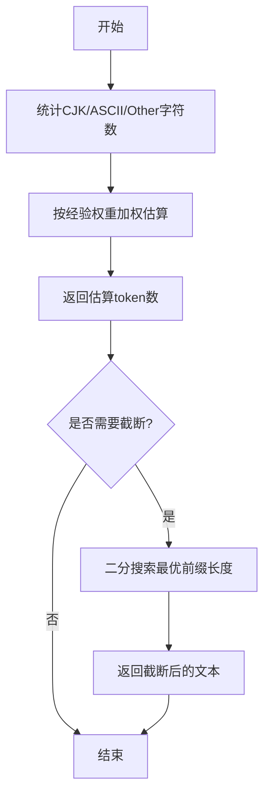

图表来源
- [utils/token_utils.py:16-71](file://utils/token_utils.py#L16-L71)

章节来源
- [utils/token_utils.py:7-71](file://utils/token_utils.py#L7-L71)

### GPU 检测
- 三路探测：PyTorch → pynvml → nvidia-smi
- 超时与异常处理：避免阻塞与崩溃
- 返回设备数量与首设备名称

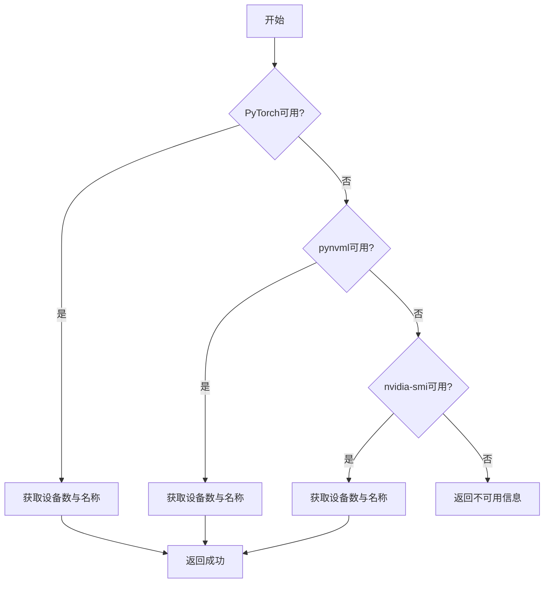

图表来源
- [utils/gpu_check.py:10-66](file://utils/gpu_check.py#L10-L66)

章节来源
- [utils/gpu_check.py:10-66](file://utils/gpu_check.py#L10-L66)

### 时间处理
- 北京时间时区：UTC+8
- 工具函数：当前时间、任意时间转北京时间、ISO 字符串转北京时间

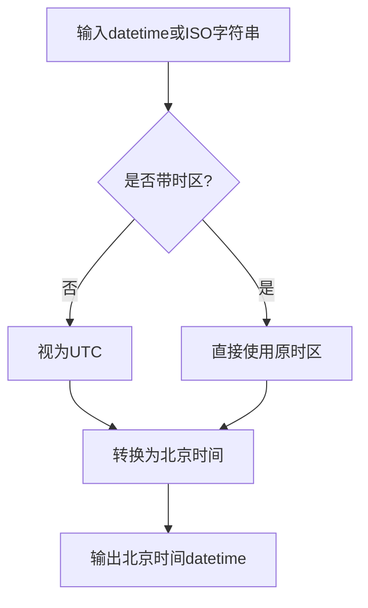

图表来源
- [utils/timezone.py:9-52](file://utils/timezone.py#L9-L52)

章节来源
- [utils/timezone.py:5-52](file://utils/timezone.py#L5-L52)

### 视频缩略图生成
- ffmpeg 提取首帧，支持指定时间戳与尺寸
- 存在性校验与空文件清理
- 超时与异常处理

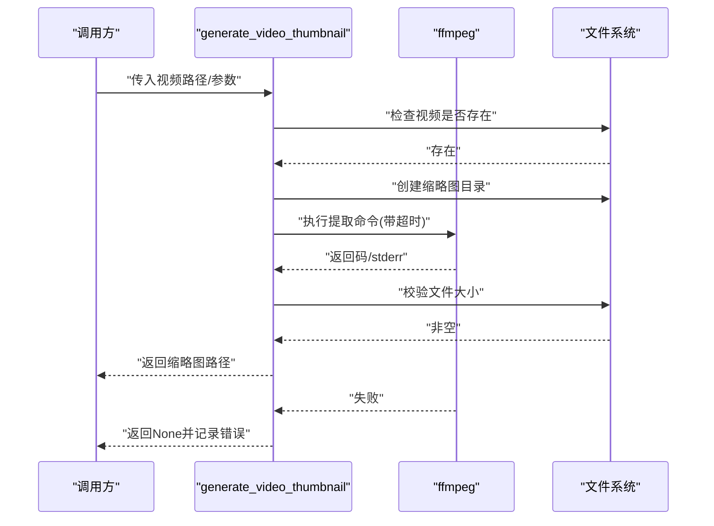

图表来源
- [utils/video_thumbnail.py:12-107](file://utils/video_thumbnail.py#L12-L107)

章节来源
- [utils/video_thumbnail.py:12-123](file://utils/video_thumbnail.py#L12-L123)

### 评估工具

#### 检索评估（Relevance@K）
- 数据集格式：包含 query 与 gold(document_id, chunk_indices)
- 指标：Recall@K、Precision@K
- 流程：加载数据集 → 检索 → 计算命中标志 → 汇总指标

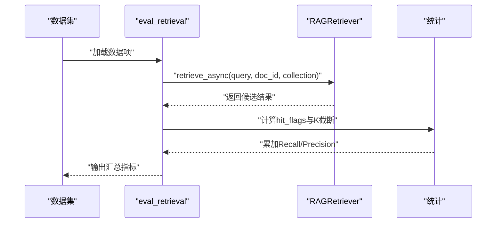

图表来源
- [eval/retrieval_eval.py:35-74](file://eval/retrieval_eval.py#L35-L74)

章节来源
- [eval/retrieval_eval.py:10-74](file://eval/retrieval_eval.py#L10-L74)
- [eval/retrieval_dataset.example.json:1-20](file://eval/retrieval_dataset.example.json#L1-L20)

#### 模型评估（LLM-as-a-Judge）
- 流程：检索上下文 → 生成回答 → LLM 评分 → 归一化
- 数据集：问答对 JSON

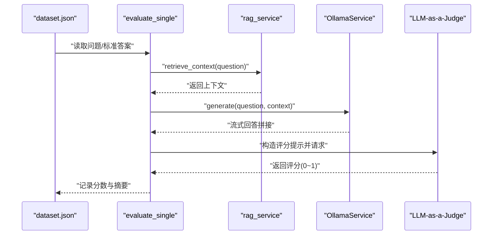

图表来源
- [eval/evaluate.py:19-90](file://eval/evaluate.py#L19-L90)
- [eval/dataset.json:1-16](file://eval/dataset.json#L1-16)

章节来源
- [eval/evaluate.py:19-127](file://eval/evaluate.py#L19-L127)
- [eval/dataset.json:1-16](file://eval/dataset.json#L1-L16)

### 监控服务
- 性能监控器：记录请求次数、错误次数、耗时序列，计算均值/分位数
- 系统指标：CPU/内存/磁盘/进程指标
- 装饰器与上下文：自动记录耗时与状态码，慢请求告警

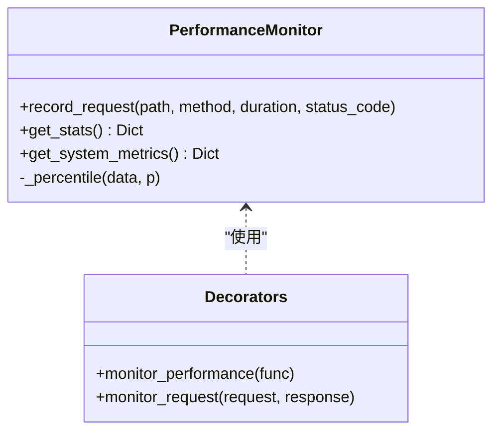

图表来源
- [utils/monitoring.py:13-184](file://utils/monitoring.py#L13-L184)

章节来源
- [utils/monitoring.py:13-185](file://utils/monitoring.py#L13-L185)

### 工具函数

#### 代码分析（CodeAnalyzer）
- 语言检测：基于特征字符串
- 函数/类/导入提取：正则匹配
- 语义信息：变量、关键字、复杂度估算

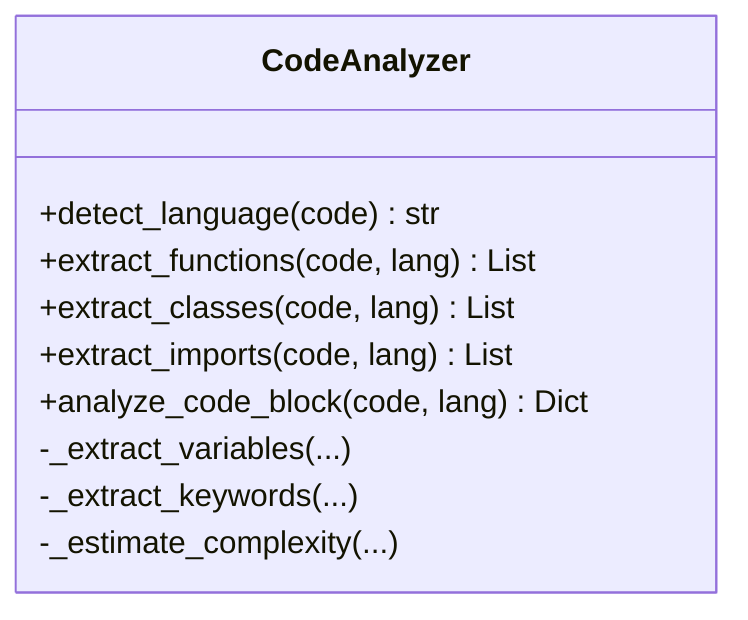

图表来源
- [utils/code_analyzer.py:7-350](file://utils/code_analyzer.py#L7-L350)

章节来源
- [utils/code_analyzer.py:18-350](file://utils/code_analyzer.py#L18-L350)

#### 公式提取与分析（FormulaExtractor / FormulaAnalyzer）
- 提取：支持块级与行内公式，避免重叠匹配
- 规范化：常见符号映射为 LaTeX
- 分析：变量、关系、函数、结构复杂度

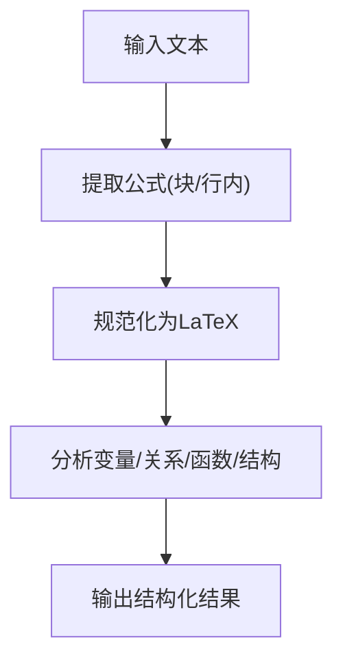

图表来源
- [utils/formula_extractor.py:28-148](file://utils/formula_extractor.py#L28-L148)
- [utils/formula_analyzer.py:32-232](file://utils/formula_analyzer.py#L32-L232)

章节来源
- [utils/formula_extractor.py:28-149](file://utils/formula_extractor.py#L28-L149)
- [utils/formula_analyzer.py:32-233](file://utils/formula_analyzer.py#L32-L233)

#### 表格提取（TableExtractor）
- 支持 Markdown 表格与管道分隔表格
- 结构化输出：原始文本、二维数组、HTML、Markdown
- 语义结构：行列数、表头、数据类型推测

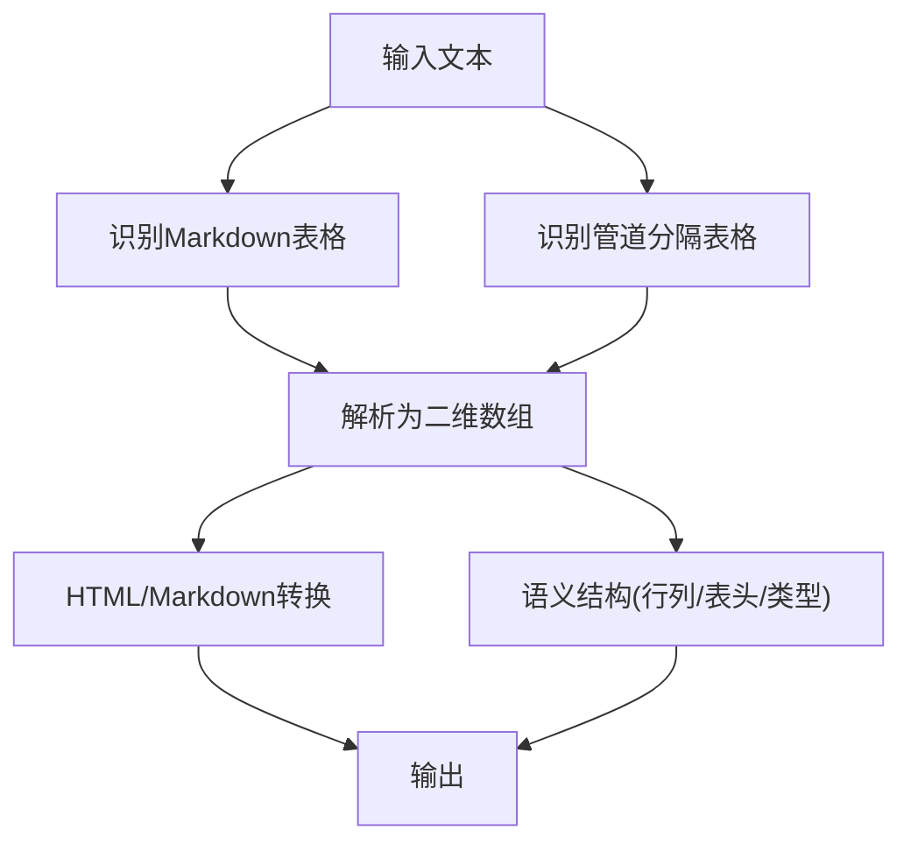

图表来源
- [utils/table_extractor.py:10-289](file://utils/table_extractor.py#L10-L289)

章节来源
- [utils/table_extractor.py:10-290](file://utils/table_extractor.py#L10-L290)

### 应用生命周期（FastAPI）
- 启动：带重试的 MongoDB 连接，初始化默认助手与知识空间
- 关闭：安全断开数据库连接
- 状态：向 app.state 注入连接状态

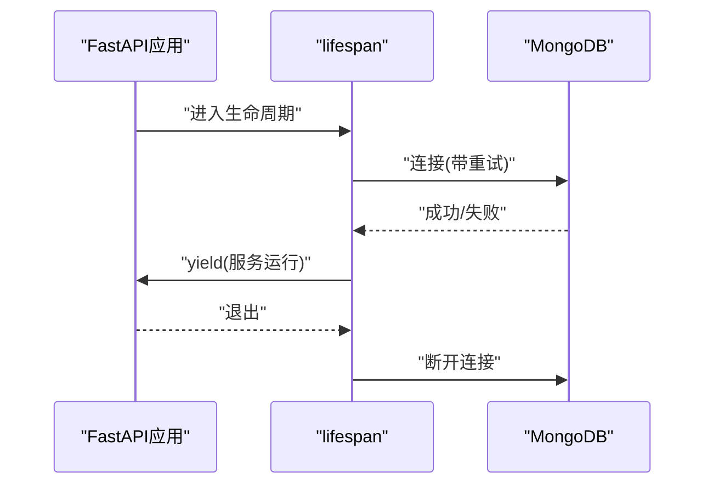

图表来源
- [utils/lifespan.py:28-93](file://utils/lifespan.py#L28-L93)

章节来源
- [utils/lifespan.py:28-93](file://utils/lifespan.py#L28-L93)

## 依赖分析
- 组件内聚：工具函数各自职责清晰，低耦合
- 外部依赖：psutil（系统指标）、subprocess（ffmpeg/nvidia-smi）、logging（日志）
- 运行时依赖：FastAPI 生命周期、RAGRetriever、OllamaService

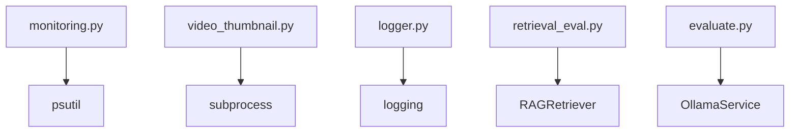

图表来源
- [utils/monitoring.py:8-111](file://utils/monitoring.py#L8-L111)
- [utils/video_thumbnail.py:5-107](file://utils/video_thumbnail.py#L5-L107)
- [utils/logger.py:2-82](file://utils/logger.py#L2-L82)
- [eval/retrieval_eval.py:6-43](file://eval/retrieval_eval.py#L6-L43)
- [eval/evaluate.py:10-17](file://eval/evaluate.py#L10-L17)

章节来源
- [utils/monitoring.py:1-185](file://utils/monitoring.py#L1-L185)
- [utils/video_thumbnail.py:1-123](file://utils/video_thumbnail.py#L1-L123)
- [utils/logger.py:1-88](file://utils/logger.py#L1-L88)
- [eval/retrieval_eval.py:1-102](file://eval/retrieval_eval.py#L1-L102)
- [eval/evaluate.py:1-127](file://eval/evaluate.py#L1-L127)

## 性能考虑
- 日志：异步队列写入，生产环境降噪，避免 I/O 阻塞
- 令牌：估算与截断采用近似策略，避免强依赖外部分词器
- GPU 检测：多路回退，超时保护，减少启动时阻塞
- 视频缩略图：ffmpeg 命令参数优化，超时与空文件校验
- 监控：滑动窗口记录最近 1000 次请求，分位数计算，慢请求告警
- 评估：批量处理与环境变量配置，避免硬编码

## 故障排查指南
- 日志：检查 logs 目录权限与磁盘空间；生产环境仅 WARNING+；控制台输出辅助调试
- 令牌：文本为空或负阈值会直接返回边界值；估算偏差可通过样本校准
- GPU：PyTorch/pynvml/nvidia-smi 任一可用即判定；无依赖时回退到 nvidia-smi
- 时间：未带时区的 datetime 默认按 UTC 处理；ISO 字符串末尾 Z 等价 +00:00
- 视频：ffmpeg 未安装或超时会返回 None；检查 PATH 与权限；缩略图为空自动删除
- 评估：检索/生成异常会记录并返回默认值；LLM 评分解析失败归零
- 监控：系统指标获取异常会记录警告；慢请求会打印告警日志
- 生命周期：MongoDB 连接失败不阻塞服务启动，可在状态中感知

章节来源
- [utils/logger.py:15-82](file://utils/logger.py#L15-L82)
- [utils/token_utils.py:48-71](file://utils/token_utils.py#L48-L71)
- [utils/gpu_check.py:10-66](file://utils/gpu_check.py#L10-L66)
- [utils/timezone.py:9-52](file://utils/timezone.py#L9-L52)
- [utils/video_thumbnail.py:32-107](file://utils/video_thumbnail.py#L32-L107)
- [eval/retrieval_eval.py:35-74](file://eval/retrieval_eval.py#L35-L74)
- [eval/evaluate.py:19-90](file://eval/evaluate.py#L19-L90)
- [utils/monitoring.py:78-184](file://utils/monitoring.py#L78-L184)
- [utils/lifespan.py:8-25](file://utils/lifespan.py#L8-L25)

## 结论
本工具服务以“可扩展、可观测、易维护”为目标，覆盖日志、监控、令牌、时间、GPU、媒体、评估与各类文本分析工具。通过异步日志、多路 GPU 探测、ffmpeg 封面生成、LLM 评估与系统指标采集，形成完整的工程化支撑能力。建议在生产中结合环境变量与日志策略，持续优化评估与监控阈值，并在新增工具时遵循现有模式（输入/输出/异常/日志）。

## 附录

### 扩展开发指南
- 新增工具函数
  - 定义清晰的输入/输出与异常处理
  - 使用统一日志记录
  - 如涉及外部命令，设置超时与错误码判断
- 配置工具参数
  - 优先使用环境变量，其次提供默认值
  - 对于评估工具，支持批量运行与结果落盘
- 处理异常情况
  - 明确失败分支与默认返回
  - 记录关键上下文，避免泄露敏感信息
- 性能优化建议
  - 优先使用近似估算与缓存
  - 异步 I/O 与限流
  - 监控慢请求与系统资源瓶颈