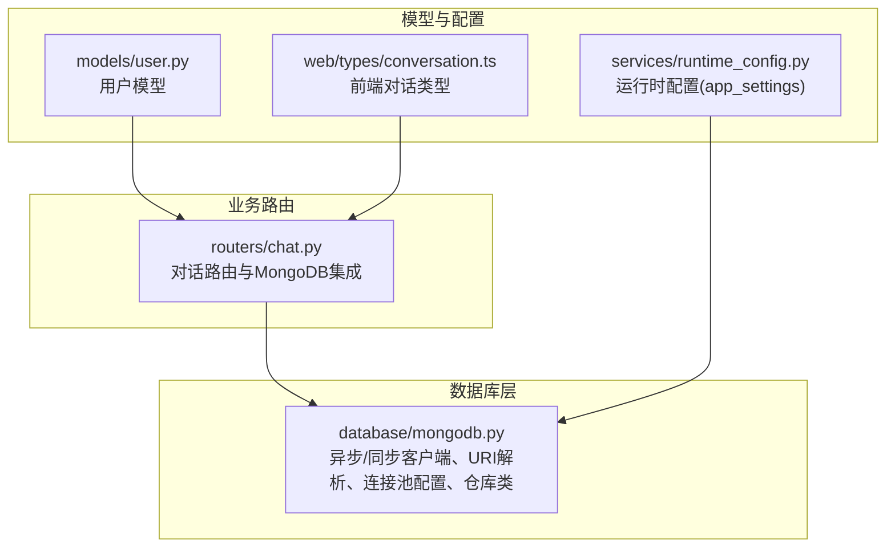
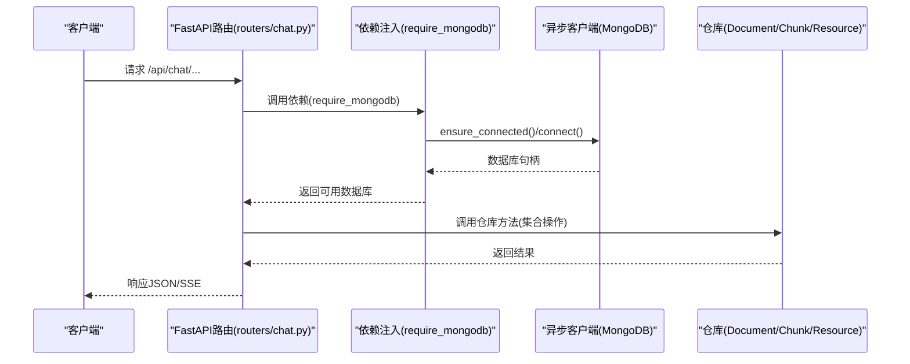
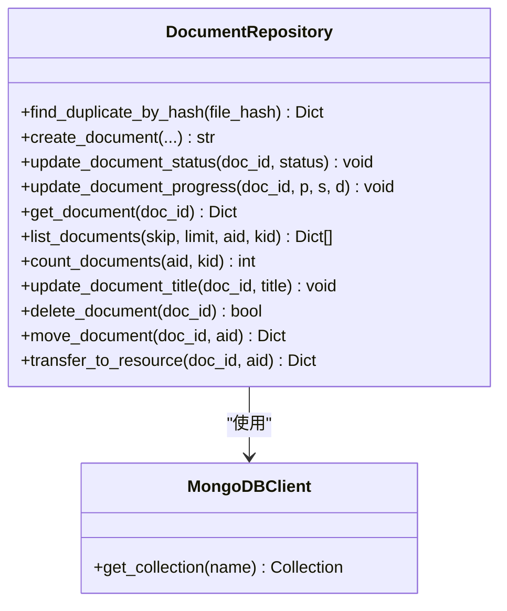
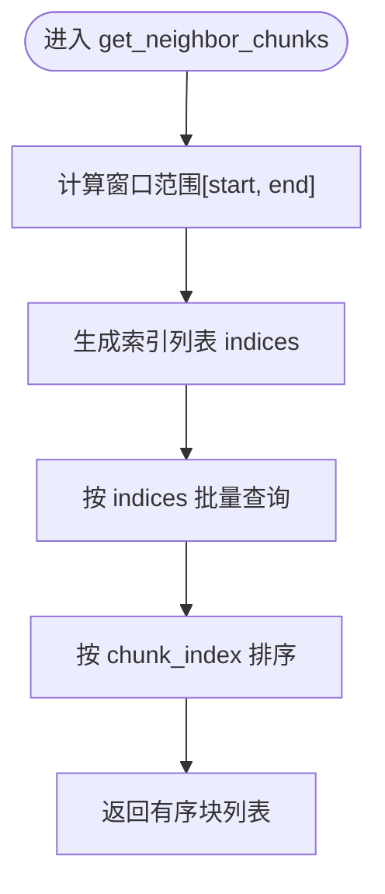
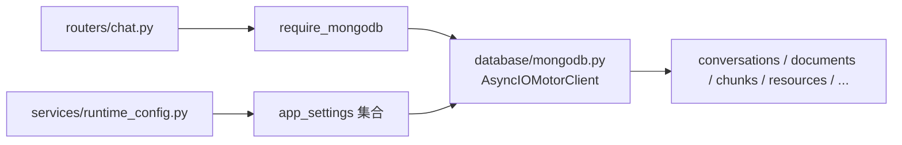

# MongoDB文档存储

<cite>
**本文引用的文件**
- [database/mongodb.py](file://database/mongodb.py)
- [models/user.py](file://models/user.py)
- [routers/chat.py](file://routers/chat.py)
- [services/runtime_config.py](file://services/runtime_config.py)
- [web/types/conversation.ts](file://web/types/conversation.ts)
</cite>

## 目录
1. [简介](#简介)
2. [项目结构](#项目结构)
3. [核心组件](#核心组件)
4. [架构总览](#架构总览)
5. [详细组件分析](#详细组件分析)
6. [依赖关系分析](#依赖关系分析)
7. [性能考量](#性能考量)
8. [故障排查指南](#故障排查指南)
9. [结论](#结论)
10. [附录](#附录)

## 简介
本文件面向MongoDB文档存储系统的技术文档，聚焦于异步客户端设计、连接池配置、URI解析与认证机制，以及DocumentRepository、ChunkRepository等数据访问模式。同时涵盖模型设计（用户、文档、对话等）、连接配置指南、性能优化建议与最佳实践，并提供基于仓库代码的可视化架构图与流程图，帮助读者快速理解与落地。

## 项目结构
本项目采用模块化组织，MongoDB相关逻辑集中在database子模块，业务路由在routers中，模型定义在models中，运行时配置在services中，前端类型定义在web/types中。

图表来源
- [database/mongodb.py](file://database/mongodb.py)
- [routers/chat.py](file://routers/chat.py)
- [services/runtime_config.py](file://services/runtime_config.py)
- [models/user.py](file://models/user.py)
- [web/types/conversation.ts](file://web/types/conversation.ts)

章节来源
- [database/mongodb.py](file://database/mongodb.py)
- [routers/chat.py](file://routers/chat.py)
- [services/runtime_config.py](file://services/runtime_config.py)
- [models/user.py](file://models/user.py)
- [web/types/conversation.ts](file://web/types/conversation.ts)

## 核心组件
- 异步MongoDB客户端：基于motor.motor_asyncio.AsyncIOMotorClient，负责连接建立、Ping校验、集合获取与依赖注入。
- 同步MongoDB客户端：基于pymongo.MongoClient，用于文档入库等同步场景。
- URI解析工具：解析MONGODB_URI，分离连接字符串与数据库名，支持合并连接池参数。
- 仓库类：
  - DocumentRepository：文档元数据CRUD、状态/进度更新、列表与计数、移动与转换为资源。
  - ChunkRepository：文档分块CRUD、邻居块查询、按索引批量获取。
  - ResourceRepository/ResourceLikeRepository/ResourceFavoriteRepository：资源、点赞、收藏管理。
- 应用设置仓库：app_settings集合的运行时配置读写与缓存。

章节来源
- [database/mongodb.py](file://database/mongodb.py)
- [services/runtime_config.py](file://services/runtime_config.py)

## 架构总览
下图展示了异步FastAPI路由如何通过依赖注入使用MongoDB客户端，以及仓库类如何封装集合操作。

图表来源
- [routers/chat.py](file://routers/chat.py)
- [database/mongodb.py](file://database/mongodb.py)

## 详细组件分析

### 异步MongoDB客户端与URI解析
- 支持两种连接方式：
  - 使用MONGODB_URI环境变量，内部解析URI并分离数据库名，再合并连接池参数。
  - 使用MONGODB_HOST/MONGODB_PORT/MONGODB_USERNAME/MONGODB_PASSWORD/MONGODB_AUTH_SOURCE/MONGODB_DB_NAME等环境变量组合连接字符串。
- 连接池参数（来自环境变量）：
  - maxPoolSize/minPoolSize/maxIdleTimeMS/serverSelectionTimeoutMS/connectTimeoutMS/socketTimeoutMS
- 连接建立后执行ping命令校验，确保可用性。
- 提供get_collection接口与依赖注入require_mongodb，供FastAPI路由使用。

章节来源
- [database/mongodb.py](file://database/mongodb.py)

### 同步MongoDB客户端（文档入库）
- 用于文档处理与入库的同步客户端，同样支持MONGODB_URI或分环境变量组合。
- 连接建立后执行ping命令与集合存在性检查（降级处理）。
- 提供get_collection与close方法。

章节来源
- [database/mongodb.py](file://database/mongodb.py)

### URI解析与连接池参数合并
- parse_mongodb_uri：解析URI，提取数据库名；若无数据库名则使用MONGODB_DB_NAME或默认值。
- 连接池参数合并：若原URI已带查询参数，则追加；否则直接附加查询参数。
- 参数键名与含义：
  - maxPoolSize：最大连接池大小
  - minPoolSize：最小连接池大小
  - maxIdleTimeMS：连接最大空闲时间
  - serverSelectionTimeoutMS：服务器选择超时
  - connectTimeoutMS：连接超时
  - socketTimeoutMS：Socket超时

章节来源
- [database/mongodb.py](file://database/mongodb.py)

### DocumentRepository：文档元数据仓库
- 集合：documents
- 主要能力：
  - 去重检查：find_duplicate_by_hash(file_hash)
  - 创建：create_document(title, file_type, file_path, file_size, file_hash, metadata, assistant_id, knowledge_space_id)
  - 状态更新：update_document_status(doc_id, status)
  - 进度更新：update_document_progress(doc_id, progress_percentage, current_stage, stage_details)
  - 查询：get_document(doc_id)、list_documents(skip, limit, assistant_id, knowledge_space_id)、count_documents(...)
  - 标题更新：update_document_title(doc_id, title)
  - 删除：delete_document(doc_id)
  - 移动：move_document(doc_id, new_assistant_id)
  - 转换为资源：transfer_to_resource(doc_id, assistant_id)
- 关键点：
  - ObjectId转换：对字符串ID统一转为bson.ObjectId
  - 时间戳：使用beijing_now()统一时区
  - 兼容字段：assistant_id与knowledge_space_id并存，优先使用后者

图表来源
- [database/mongodb.py](file://database/mongodb.py)

章节来源
- [database/mongodb.py](file://database/mongodb.py)

### ChunkRepository：文档分块仓库
- 集合：chunks
- 主要能力：
  - 创建：create_chunk(document_id, chunk_index, text, metadata)
  - 查询：get_chunks_by_document(document_id)、get_chunk_by_id(chunk_id)、get_chunks_by_indices(document_id, indices)
  - 邻居块：get_neighbor_chunks(document_id, chunk_index, window)
  - 清理：delete_chunks_by_document(document_id)

图表来源
- [database/mongodb.py](file://database/mongodb.py)

章节来源
- [database/mongodb.py](file://database/mongodb.py)

### ResourceRepository/ResourceLikeRepository/ResourceFavoriteRepository：资源与互动
- ResourceRepository：资源集合resources，支持创建、查询、计数、更新、删除、版本迁移（schema_version）。
- ResourceLikeRepository：点赞集合resource_likes，支持点赞/取消、计数、查询用户点赞列表。
- ResourceFavoriteRepository：收藏集合resource_favorites，支持收藏/取消、计数、查询用户收藏列表。

章节来源
- [database/mongodb.py](file://database/mongodb.py)

### 应用设置与运行时配置
- 集合：app_settings
- 读写：get_runtime_config()/get_runtime_config_sync()/upsert_runtime_config()
- 缓存：线程安全的内存缓存，TTL可配置
- 预设模式：low/high/custom，模块开关与参数可合并覆盖

章节来源
- [services/runtime_config.py](file://services/runtime_config.py)
- [database/mongodb.py](file://database/mongodb.py)

### 对话路由与MongoDB集成
- 路由：/api/chat/conversations、/api/chat/conversations/{id}、/api/chat/conversations/{id}/messages、/api/chat/deep-research 等
- 依赖注入：require_mongodb确保数据库可用
- 集合：conversations
- 特性：匿名模式下的对话创建、列表、详情、消息增删改、标题自动生成、流式响应（SSE）

章节来源
- [routers/chat.py](file://routers/chat.py)
- [database/mongodb.py](file://database/mongodb.py)
- [web/types/conversation.ts](file://web/types/conversation.ts)

## 依赖关系分析
- 路由依赖数据库客户端：routers/chat.py通过require_mongodb依赖database/mongodb.py提供的异步客户端。
- 仓库依赖客户端：各仓库类依赖MongoDBClient或mongodb.get_collection获取集合。
- 配置依赖：运行时配置读写依赖app_settings集合。

图表来源
- [routers/chat.py](file://routers/chat.py)
- [database/mongodb.py](file://database/mongodb.py)
- [services/runtime_config.py](file://services/runtime_config.py)

章节来源
- [routers/chat.py](file://routers/chat.py)
- [database/mongodb.py](file://database/mongodb.py)
- [services/runtime_config.py](file://services/runtime_config.py)

## 性能考量
- 连接池参数
  - maxPoolSize：建议100-200，结合worker数量与QPS评估
  - minPoolSize：保持一定空闲连接，降低冷启动延迟
  - maxIdleTimeMS：30秒，避免长时间占用
  - serverSelectionTimeoutMS/connectTimeoutMS/socketTimeoutMS：分别控制服务器选择、连接与Socket超时
- 查询优化
  - 对高频过滤字段（如assistant_id/knowledge_space_id、status、is_public、file_hash）建立索引
  - 分页使用skip/limit时，尽量配合排序字段建立复合索引
- 批量操作
  - 批量插入/更新使用批量接口，减少往返次数
  - 对邻居块查询使用$in与排序，避免多次单条查询
- 缓存
  - 运行时配置使用TTL缓存，降低频繁读取压力
- 日志与可观测性
  - 仓库方法内对异常进行日志记录，便于定位慢查询与错误

章节来源
- [database/mongodb.py](file://database/mongodb.py)
- [services/runtime_config.py](file://services/runtime_config.py)

## 故障排查指南
- 连接失败
  - 检查MONGODB_URI或MONGODB_HOST/PORT等环境变量是否正确
  - 若使用认证，确认用户名/密码与authSource配置
  - Docker环境下使用host.docker.internal或127.0.0.1
  - 查看连接池参数合并是否正确（URI中已有?时会追加）
- 首次连接失败
  - require_mongodb在启动失败后可在首次请求时重试一次
- 查询异常
  - 检查过滤条件与排序字段是否匹配索引
  - 对ObjectId转换进行容错（字符串ID转ObjectId）
- 资源迁移
  - ResourceRepository支持schema_version迁移，若出现字段缺失可触发迁移逻辑

章节来源
- [database/mongodb.py](file://database/mongodb.py)
- [routers/chat.py](file://routers/chat.py)

## 结论
本MongoDB文档存储系统以异步客户端为核心，结合仓库模式实现了文档、分块、资源与对话等核心数据的高效管理。通过完善的连接池配置、URI解析与认证机制、以及运行时配置缓存，系统在高并发与复杂业务场景下具备良好的稳定性与可维护性。建议在生产环境中按业务规模调整连接池参数，并针对高频查询建立索引以提升性能。

## 附录

### 环境变量与连接配置
- MONGODB_URI：完整MongoDB连接字符串（推荐）
- MONGODB_HOST/MONGODB_PORT/MONGODB_USERNAME/MONGODB_PASSWORD/MONGODB_AUTH_SOURCE/MONGODB_DB_NAME：分环境变量组合
- MONGODB_MAX_POOL_SIZE/MONGODB_MIN_POOL_SIZE/MONGODB_MAX_IDLE_TIME_MS/MONGODB_SERVER_SELECTION_TIMEOUT_MS/MONGODB_CONNECT_TIMEOUT_MS/MONGODB_SOCKET_TIMEOUT_MS：连接池参数

章节来源
- [database/mongodb.py](file://database/mongodb.py)

### 数据模型与字段说明
- 用户模型（User/用户模型）
  - 字段：id、username、email、full_name、user_type、student_id、class_name、grade、is_online、last_seen、created_at、is_active、role、max_assistants、max_documents、assistant_ids、viewable_assistant_ids、avatar_url、细粒度权限字段、资料扩展字段等
  - 约束：邮箱格式验证、枚举类型限制、可选字段与默认值
- 文档模型（documents集合）
  - 关键字段：title、file_type、file_path、file_size、file_hash、metadata、assistant_id、knowledge_space_id、status、progress_percentage、current_stage、stage_details、created_at、updated_at
  - 约束：file_hash用于去重；knowledge_space_id优先于assistant_id
- 对话模型（conversations集合）
  - 关键字段：_id、user_id、title、messages（含message_id、role、content、timestamp、sources、recommended_resources）、assistant_id、created_at、updated_at
  - 约束：匿名模式下user_id为空；messages为数组，支持流式生成与标题自动生成

章节来源
- [models/user.py](file://models/user.py)
- [database/mongodb.py](file://database/mongodb.py)
- [routers/chat.py](file://routers/chat.py)
- [web/types/conversation.ts](file://web/types/conversation.ts)

### 索引策略建议
- documents
  - file_hash：唯一索引（去重）
  - knowledge_space_id/status：复合索引（分页与筛选）
  - created_at：索引（倒序列表）
- chunks
  - document_id+chunk_index：复合索引（邻居块与排序）
- resources
  - assistant_id/status/is_public：复合索引（资源列表）
  - schema_version：索引（迁移扫描）
- conversations
  - updated_at：索引（列表排序）
  - messages.message_id：索引（消息编辑/删除）
- app_settings
  - _id：主键索引（单文档）

章节来源
- [database/mongodb.py](file://database/mongodb.py)

### 最佳实践
- 使用依赖注入require_mongodb确保数据库可用
- 对外暴露的ID统一使用字符串，内部转换为ObjectId
- 批量查询使用$in与排序，避免多次单条查询
- 对热点配置使用TTL缓存，降低读取压力
- 对外接口返回前统一处理_id与时间字段格式

章节来源
- [database/mongodb.py](file://database/mongodb.py)
- [services/runtime_config.py](file://services/runtime_config.py)