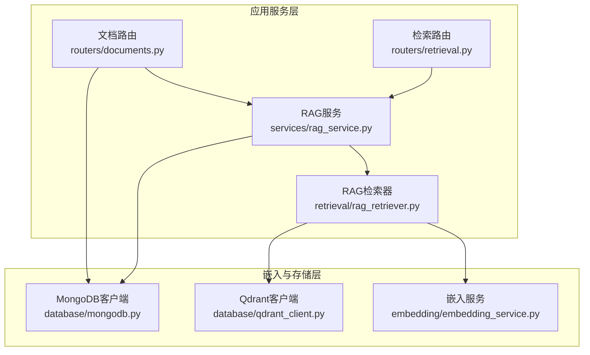
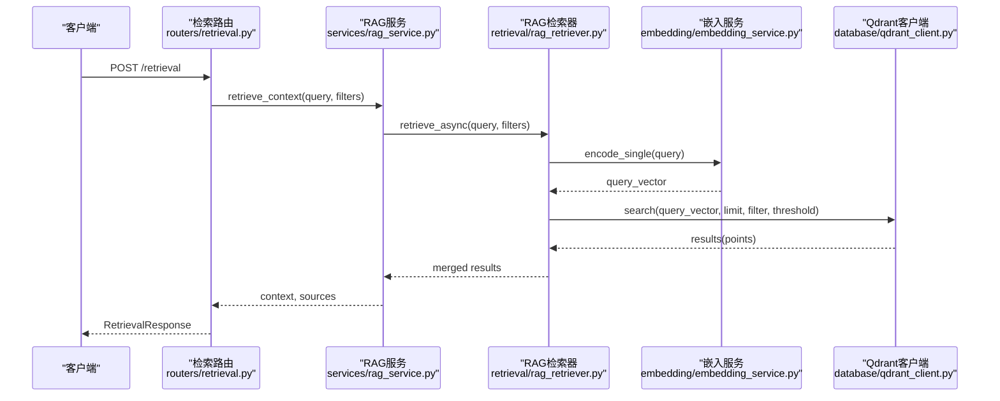
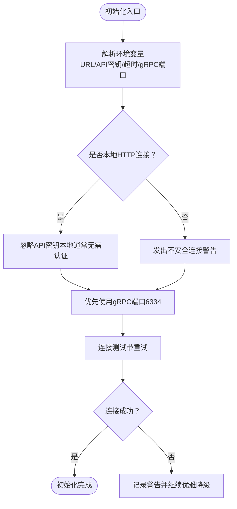
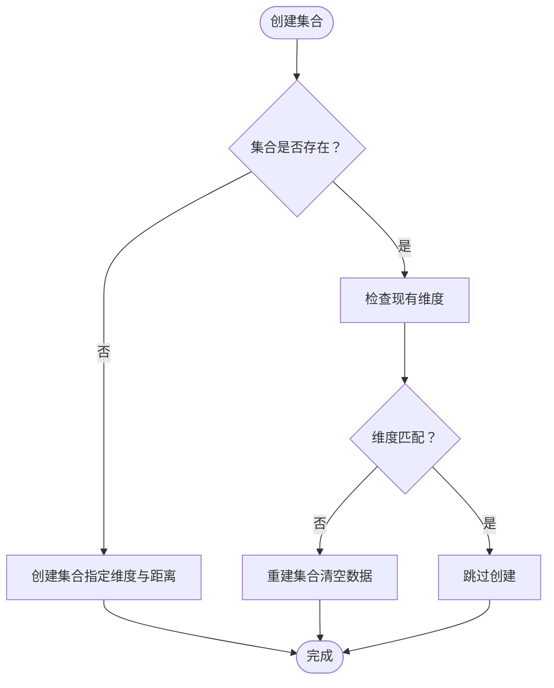
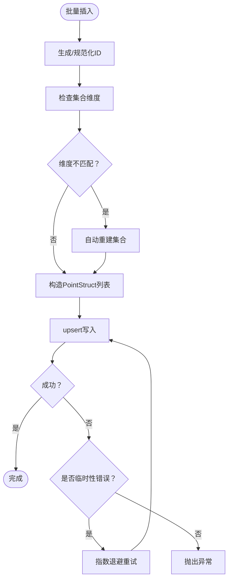
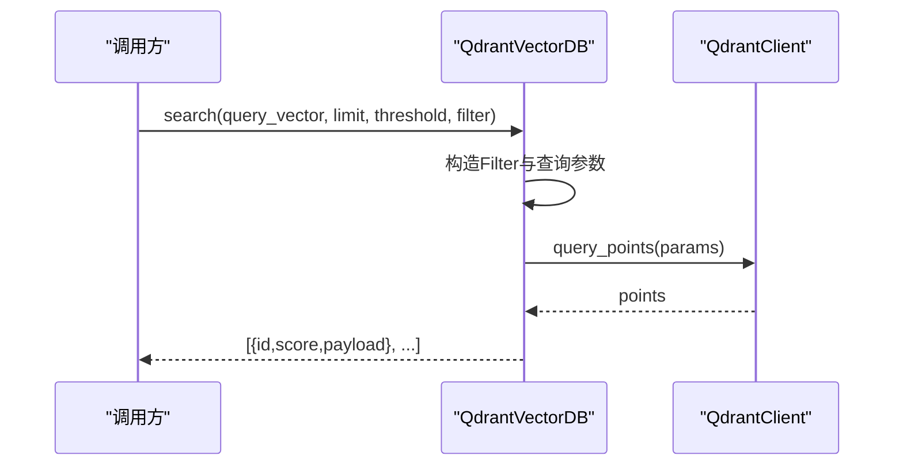
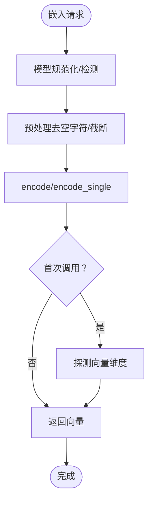
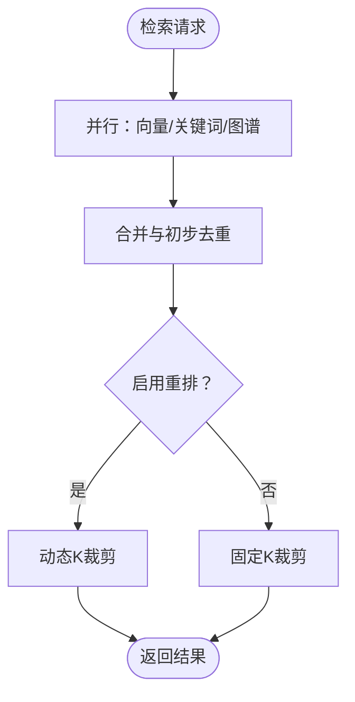
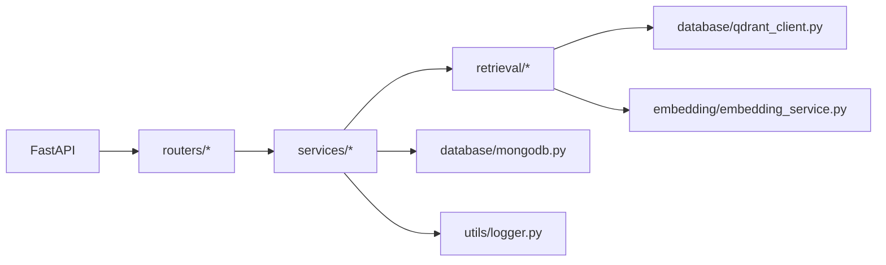

# 向量数据库Qdrant

<cite>
**本文引用的文件**
- [database/qdrant_client.py](file://database/qdrant_client.py)
- [embedding/embedding_service.py](file://embedding/embedding_service.py)
- [retrieval/rag_retriever.py](file://retrieval/rag_retriever.py)
- [services/rag_service.py](file://services/rag_service.py)
- [routers/documents.py](file://routers/documents.py)
- [routers/retrieval.py](file://routers/retrieval.py)
- [database/mongodb.py](file://database/mongodb.py)
- [utils/logger.py](file://utils/logger.py)
- [requirements.txt](file://requirements.txt)
</cite>

## 目录
1. [简介](#简介)
2. [项目结构](#项目结构)
3. [核心组件](#核心组件)
4. [架构总览](#架构总览)
5. [详细组件分析](#详细组件分析)
6. [依赖关系分析](#依赖关系分析)
7. [性能考虑](#性能考虑)
8. [故障排除指南](#故障排除指南)
9. [结论](#结论)
10. [附录](#附录)

## 简介
本文件面向Qdrant向量数据库在本项目中的集成与使用，系统性说明以下主题：
- Qdrant客户端初始化与配置：包括URL与API密钥处理、gRPC优先策略、连接超时与重试、健康检查等
- 向量维度与距离度量：集合创建时的向量维度校验与重建策略
- 批量插入优化：ID生成、维度一致性检查、指数退避重试、自动集合重建
- 向量存储与检索：集合信息获取、按文档ID删除与滚动查询、过滤查询
- 嵌入向量管理：文本预处理、向量生成、批量向量化、模型名称规范化与检测
- 相似度搜索：KNN搜索、分数阈值、结果排序与动态裁剪
- 性能优化：连接池与超时、gRPC连接复用、重排与动态K调参
- API使用示例与故障排除

## 项目结构
本项目采用“服务层-检索层-数据库层”分层设计，Qdrant作为向量存储后端，与MongoDB、Ollama嵌入服务协同工作。

**图表来源**
- [services/rag_service.py:100-137](file://services/rag_service.py#L100-L137)
- [retrieval/rag_retriever.py:89-137](file://retrieval/rag_retriever.py#L89-L137)
- [routers/documents.py:1-200](file://routers/documents.py#L1-L200)
- [routers/retrieval.py:97-148](file://routers/retrieval.py#L97-L148)
- [embedding/embedding_service.py:1-333](file://embedding/embedding_service.py#L1-L333)
- [database/qdrant_client.py:18-123](file://database/qdrant_client.py#L18-L123)
- [database/mongodb.py:92-204](file://database/mongodb.py#L92-L204)

**章节来源**
- [services/rag_service.py:100-137](file://services/rag_service.py#L100-L137)
- [retrieval/rag_retriever.py:89-137](file://retrieval/rag_retriever.py#L89-L137)
- [routers/documents.py:1-200](file://routers/documents.py#L1-L200)
- [routers/retrieval.py:97-148](file://routers/retrieval.py#L97-L148)
- [embedding/embedding_service.py:1-333](file://embedding/embedding_service.py#L1-L333)
- [database/qdrant_client.py:18-123](file://database/qdrant_client.py#L18-L123)
- [database/mongodb.py:92-204](file://database/mongodb.py#L92-L204)

## 核心组件
- QdrantVectorDB：封装Qdrant客户端，负责集合创建、健康检查、批量插入、相似度搜索、过滤删除、滚动查询等
- EmbeddingService：封装Ollama嵌入服务，负责模型名称规范化与检测、单文本/批量向量化、维度探测
- RAGRetriever：混合检索器，整合向量检索、关键词检索、图谱检索与重排，支持动态K裁剪
- RAGService：高层RAG服务，协调检索与上下文拼接、邻居扩展、去重与来源聚合
- 文档路由与检索路由：对外暴露REST接口，驱动RAG流程

**章节来源**
- [database/qdrant_client.py:18-543](file://database/qdrant_client.py#L18-L543)
- [embedding/embedding_service.py:8-333](file://embedding/embedding_service.py#L8-L333)
- [retrieval/rag_retriever.py:17-393](file://retrieval/rag_retriever.py#L17-L393)
- [services/rag_service.py:8-323](file://services/rag_service.py#L8-L323)
- [routers/documents.py:1-200](file://routers/documents.py#L1-L200)
- [routers/retrieval.py:1-150](file://routers/retrieval.py#L1-L150)

## 架构总览
下图展示从API到向量检索的关键调用链路与数据流。

**图表来源**
- [routers/retrieval.py:97-148](file://routers/retrieval.py#L97-L148)
- [services/rag_service.py:100-137](file://services/rag_service.py#L100-L137)
- [retrieval/rag_retriever.py:89-204](file://retrieval/rag_retriever.py#L89-L204)
- [embedding/embedding_service.py:292-318](file://embedding/embedding_service.py#L292-L318)
- [database/qdrant_client.py:336-413](file://database/qdrant_client.py#L336-L413)

## 详细组件分析

### QdrantVectorDB：客户端初始化与配置
- URL与API密钥处理：自动识别本地HTTP与远程HTTP场景，本地HTTP自动忽略API密钥以避免不安全连接警告；远程HTTP使用API密钥时发出安全警告
- gRPC优先策略：统一使用gRPC（端口6334）替代HTTP，避免Windows上httpx访问localhost的502问题，提升连接复用与性能
- 连接池与超时：支持通过环境变量配置超时与gRPC端口；连接测试带重试，失败时自动切换localhost到127.0.0.1
- 健康检查：通过获取集合列表验证服务可用性

**图表来源**
- [database/qdrant_client.py:21-123](file://database/qdrant_client.py#L21-L123)

**章节来源**
- [database/qdrant_client.py:21-123](file://database/qdrant_client.py#L21-L123)

### 集合创建与维度校验
- create_collection：若集合已存在且维度不匹配，自动重建集合；若无法识别维度，仍尝试创建
- 默认距离度量：余弦距离（COSINE）

**图表来源**
- [database/qdrant_client.py:140-208](file://database/qdrant_client.py#L140-L208)

**章节来源**
- [database/qdrant_client.py:140-208](file://database/qdrant_client.py#L140-L208)

### 批量插入优化
- ID生成：默认生成UUID；若提供ID则确保为UUID格式，无效则回退生成
- 维度一致性：插入前检查集合维度，不一致时自动重建
- 重试机制：指数退避重试，支持502/503/504/超时/连接错误等临时性错误；向量维度错误时自动重建集合后重试
- upsert：使用PointStruct批量写入，with_payload开启，with_vectors关闭以节省网络与存储

**图表来源**
- [database/qdrant_client.py:210-334](file://database/qdrant_client.py#L210-L334)

**章节来源**
- [database/qdrant_client.py:210-334](file://database/qdrant_client.py#L210-L334)

### 相似度搜索与过滤
- search：支持limit、score_threshold、过滤条件（按document_id等）、with_payload开启
- 自动集合创建：当集合不存在时，按查询向量维度自动创建
- 结果格式：统一返回{id, score, payload}

**图表来源**
- [database/qdrant_client.py:336-413](file://database/qdrant_client.py#L336-L413)

**章节来源**
- [database/qdrant_client.py:336-413](file://database/qdrant_client.py#L336-L413)

### 元数据管理与滚动查询
- 删除：按document_id删除全部相关向量；按ID列表删除
- 获取集合信息：points_count统计
- 按文档ID滚动查询：支持with_payload与with_vectors，便于导出或二次处理

**章节来源**
- [database/qdrant_client.py:415-525](file://database/qdrant_client.py#L415-L525)

### 嵌入向量管理流程
- 模型检测与规范化：优先使用环境变量指定模型，否则自动扫描可用模型；支持“模型名:标签”与“模型名:latest”的规范化
- 文本预处理：剔除空字符、按环境变量截断过长文本
- 向量生成：encode_single/encode，支持单文本与批量；维度在首次调用时探测
- 批量向量化：文档路由中按批处理（默认50），避免内存峰值

**图表来源**
- [embedding/embedding_service.py:175-318](file://embedding/embedding_service.py#L175-L318)

**章节来源**
- [embedding/embedding_service.py:175-318](file://embedding/embedding_service.py#L175-L318)
- [routers/documents.py:519-539](file://routers/documents.py#L519-L539)

### 混合检索与重排
- 检索策略：向量检索、关键词检索、图谱检索三路并行
- 结果合并：向量基础分，关键词检索提升，图谱检索追加
- 重排：可选CrossEncoder重排，动态K裁剪（基于分数分布）
- 动态参数：根据查询特征调整prefetch_k与final_k

**图表来源**
- [retrieval/rag_retriever.py:115-137](file://retrieval/rag_retriever.py#L115-L137)
- [services/rag_service.py:11-32](file://services/rag_service.py#L11-L32)

**章节来源**
- [retrieval/rag_retriever.py:115-137](file://retrieval/rag_retriever.py#L115-L137)
- [services/rag_service.py:11-32](file://services/rag_service.py#L11-L32)

## 依赖关系分析
- 第三方依赖：FastAPI、qdrant-client、sentence-transformers、pymongo、motor、requests、httpx等
- 内部模块耦合：RAG服务依赖检索器；检索器依赖嵌入服务与Qdrant；文档路由与检索路由依赖RAG服务；MongoDB用于元数据与文档管理

**图表来源**
- [requirements.txt:4-42](file://requirements.txt#L4-L42)
- [routers/retrieval.py:1-150](file://routers/retrieval.py#L1-L150)
- [services/rag_service.py:100-137](file://services/rag_service.py#L100-L137)
- [retrieval/rag_retriever.py:89-137](file://retrieval/rag_retriever.py#L89-L137)
- [database/qdrant_client.py:18-123](file://database/qdrant_client.py#L18-L123)
- [embedding/embedding_service.py:8-44](file://embedding/embedding_service.py#L8-L44)
- [database/mongodb.py:92-204](file://database/mongodb.py#L92-L204)
- [utils/logger.py:15-87](file://utils/logger.py#L15-L87)

**章节来源**
- [requirements.txt:4-42](file://requirements.txt#L4-L42)
- [routers/retrieval.py:1-150](file://routers/retrieval.py#L1-L150)
- [services/rag_service.py:100-137](file://services/rag_service.py#L100-L137)
- [retrieval/rag_retriever.py:89-137](file://retrieval/rag_retriever.py#L89-L137)
- [database/qdrant_client.py:18-123](file://database/qdrant_client.py#L18-L123)
- [embedding/embedding_service.py:8-44](file://embedding/embedding_service.py#L8-L44)
- [database/mongodb.py:92-204](file://database/mongodb.py#L92-L204)
- [utils/logger.py:15-87](file://utils/logger.py#L15-L87)

## 性能考虑
- 连接与协议
  - 优先使用gRPC（端口6334）替代HTTP，避免httpx在Windows上的502问题，支持连接复用
  - 超时与重试：通过环境变量配置超时；插入与连接测试均具备指数退避重试
- 批处理与内存
  - 文档向量化按批处理（默认50），避免一次性加载过多文本
  - 重排阶段对候选文本进行token预算控制，防止超长chunk导致延迟或崩溃
- 检索参数
  - 动态K调参：根据重排分数分布自动调整final_k，兼顾召回与精度
  - score_threshold过滤：降低无效结果传输与处理成本
- 日志与可观测性
  - 异步文件处理器，避免阻塞主线程；生产环境可降低文件日志级别

**章节来源**
- [database/qdrant_client.py:61-123](file://database/qdrant_client.py#L61-L123)
- [routers/documents.py:519-539](file://routers/documents.py#L519-L539)
- [services/rag_service.py:11-32](file://services/rag_service.py#L11-L32)
- [utils/logger.py:15-87](file://utils/logger.py#L15-L87)

## 故障排除指南
- 连接问题
  - 本地HTTP连接出现502或连接错误：自动切换localhost到127.0.0.1并重试
  - gRPC端口不匹配：确保Qdrant服务端口与客户端配置一致（默认6334）
- 安全警告
  - HTTP连接使用API密钥：本地开发环境自动忽略API密钥；生产环境建议使用HTTPS或移除API密钥
- 集合维度不匹配
  - 插入时报维度错误：自动重建集合（数据清空）后重试
  - 搜索时集合不存在：按查询向量维度自动创建
- 嵌入服务异常
  - 模型未找到：检查环境变量OLLAMA_EMBEDDING_MODEL；服务会尝试自动检测可用模型
  - 文本过长：按OLLAMA_EMBEDDING_MAX_CHARS截断，避免上下文超限
- 日志定位
  - 使用异步日志处理器，关注文件与控制台输出；生产环境可提高日志级别

**章节来源**
- [database/qdrant_client.py:98-123](file://database/qdrant_client.py#L98-L123)
- [database/qdrant_client.py:300-334](file://database/qdrant_client.py#L300-L334)
- [database/qdrant_client.py:396-413](file://database/qdrant_client.py#L396-L413)
- [embedding/embedding_service.py:175-290](file://embedding/embedding_service.py#L175-L290)
- [utils/logger.py:15-87](file://utils/logger.py#L15-L87)

## 结论
本项目通过Qdrant提供高性能向量检索能力，结合MongoDB元数据管理与Ollama嵌入服务，形成完整的RAG流水线。Qdrant客户端在初始化、集合管理、批量插入与搜索方面均具备完善的错误处理与性能优化策略；检索器支持多策略融合与动态参数调优，满足不同业务场景下的召回与精度需求。

## 附录

### API使用示例（路径指引）
- 检索接口
  - 请求：POST /retrieval
  - 参数：query、document_id、top_k、assistant_id、knowledge_space_ids、conversation_id
  - 响应：context、sources、retrieval_count、recommended_resources
  - 参考路径：[routers/retrieval.py:97-148](file://routers/retrieval.py#L97-L148)

- 文档向量化与存储（批量）
  - 步骤：解析文档 → 分块 → 向量化（按批） → 存储到MongoDB与Qdrant
  - 参考路径：[routers/documents.py:509-753](file://routers/documents.py#L509-L753)

- 嵌入服务调用
  - 单文本向量化：encode_single
  - 批量向量化：encode
  - 参考路径：[embedding/embedding_service.py:292-318](file://embedding/embedding_service.py#L292-L318)

- Qdrant客户端常用方法
  - 创建集合：create_collection
  - 批量插入：insert_vectors
  - 相似度搜索：search
  - 删除与滚动查询：delete_by_document_id、get_vectors_by_document_id
  - 参考路径：[database/qdrant_client.py:140-525](file://database/qdrant_client.py#L140-L525)