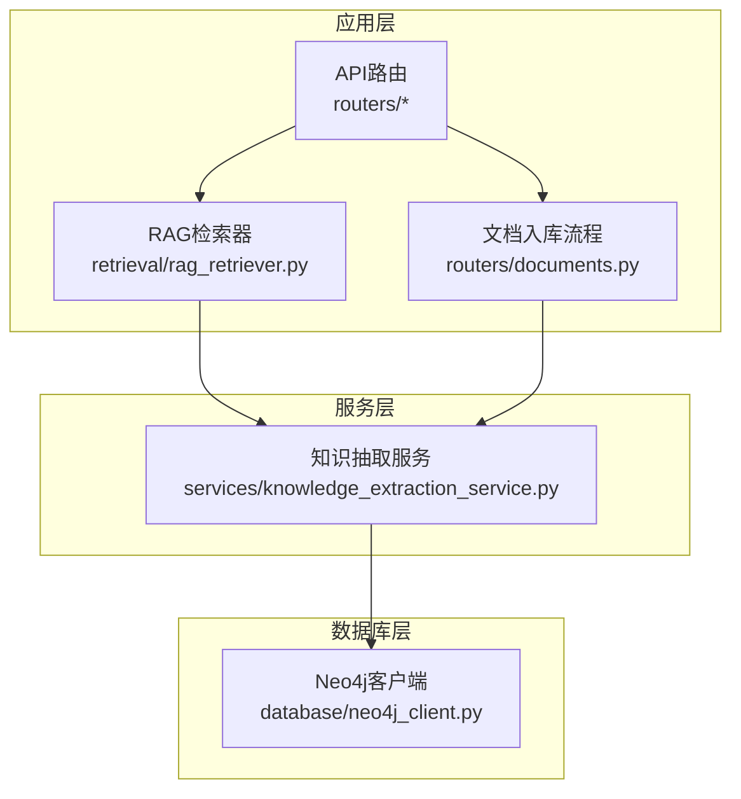
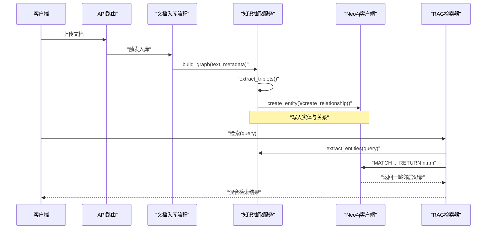
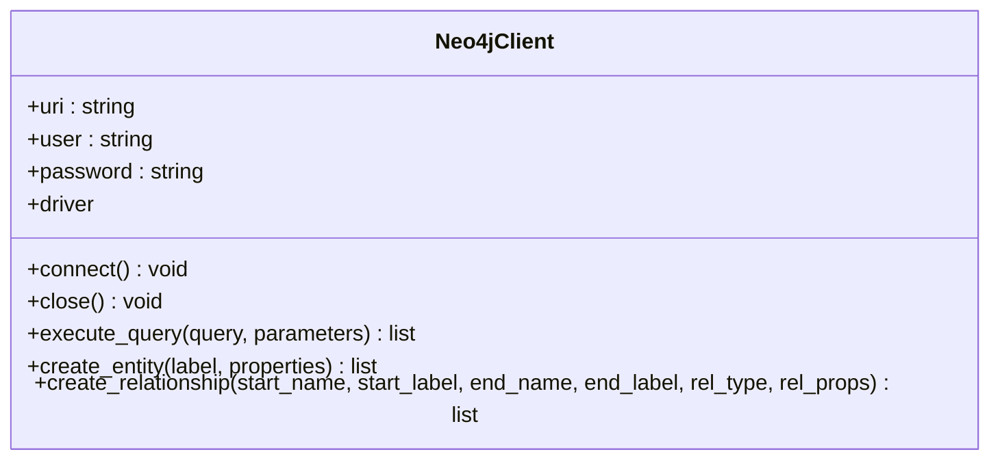
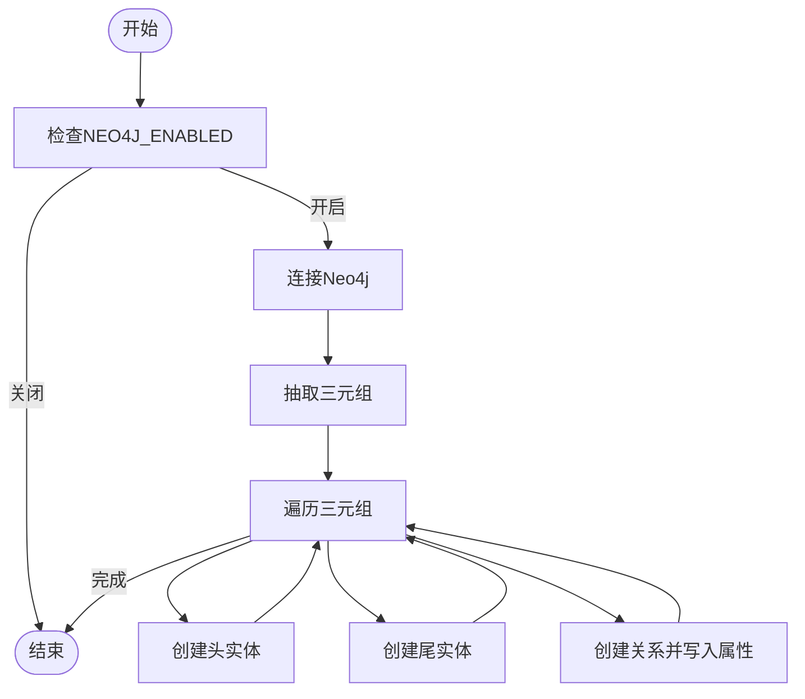
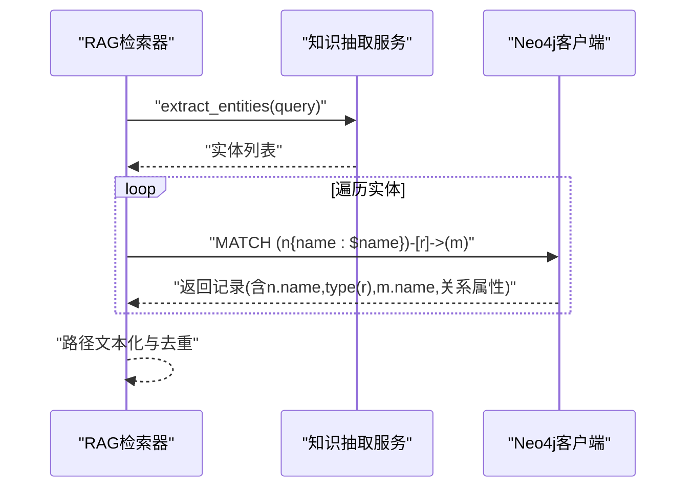

# 图数据库Neo4j

<cite>
**本文引用的文件**
- [database/neo4j_client.py](file://database/neo4j_client.py)
- [services/knowledge_extraction_service.py](file://services/knowledge_extraction_service.py)
- [retrieval/rag_retriever.py](file://retrieval/rag_retriever.py)
- [routers/documents.py](file://routers/documents.py)
- [README.md](file://README.md)
- [docker-compose.yml](file://docker-compose.yml)
- [tests/test_high_level_rag.py](file://tests/test_high_level_rag.py)
</cite>

## 目录
1. [简介](#简介)
2. [项目结构](#项目结构)
3. [核心组件](#核心组件)
4. [架构总览](#架构总览)
5. [详细组件分析](#详细组件分析)
6. [依赖分析](#依赖分析)
7. [性能考虑](#性能考虑)
8. [故障排查指南](#故障排查指南)
9. [结论](#结论)
10. [附录](#附录)

## 简介
本文件面向Neo4j图数据库在本项目中的使用，围绕连接配置与认证、事务与会话、错误与重试、图数据模型设计、Cypher查询实践、图算法应用场景、数据导入导出策略以及性能优化建议展开。文档以代码为依据，结合实际文件路径与行号，帮助读者快速理解并安全高效地使用Neo4j作为知识图谱存储与检索增强的基础设施。

## 项目结构
本项目采用多模块分层架构，Neo4j相关能力主要分布在数据库层、服务层与检索层：
- 数据库层：提供Neo4j客户端封装，负责连接、会话、基础查询与实体/关系创建。
- 服务层：知识抽取服务负责从文本中抽取三元组，并将实体与关系写入Neo4j。
- 检索层：RAG检索器在异步检索流程中集成图谱检索，基于查询实体进行一跳邻居查询。
- 路由层：文档入库流程中触发知识抽取与Neo4j写入。
- 配置与部署：README与docker-compose提供环境变量与容器化部署说明。



图表来源
- [database/neo4j_client.py:1-104](file://database/neo4j_client.py#L1-L104)
- [services/knowledge_extraction_service.py:1-229](file://services/knowledge_extraction_service.py#L1-L229)
- [retrieval/rag_retriever.py:1-393](file://retrieval/rag_retriever.py#L1-L393)
- [routers/documents.py:422-446](file://routers/documents.py#L422-L446)

章节来源
- [README.md:1-290](file://README.md#L1-L290)

## 核心组件
- Neo4j客户端：封装连接、会话、查询执行、实体与关系创建等。
- 知识抽取服务：从文本抽取三元组，规范化关系类型，写入Neo4j。
- RAG检索器：异步检索流程中集成图谱检索，基于查询实体进行一跳邻居查询。
- 文档入库路由：在文档入库过程中并发触发知识抽取与Neo4j写入。

章节来源
- [database/neo4j_client.py:1-104](file://database/neo4j_client.py#L1-L104)
- [services/knowledge_extraction_service.py:1-229](file://services/knowledge_extraction_service.py#L1-L229)
- [retrieval/rag_retriever.py:1-393](file://retrieval/rag_retriever.py#L1-L393)
- [routers/documents.py:422-446](file://routers/documents.py#L422-L446)

## 架构总览
Neo4j在本项目中的位置与交互如下：
- 文档入库：路由层触发知识抽取服务，服务层将三元组写入Neo4j。
- 查询检索：RAG检索器提取查询实体，对实体执行Cypher查询，返回一跳邻居路径供后续拼接与重排。



图表来源
- [services/knowledge_extraction_service.py:147-213](file://services/knowledge_extraction_service.py#L147-L213)
- [database/neo4j_client.py:64-101](file://database/neo4j_client.py#L64-L101)
- [retrieval/rag_retriever.py:243-296](file://retrieval/rag_retriever.py#L243-L296)

## 详细组件分析

### Neo4j客户端（连接、认证、会话）
- 连接配置
  - 通过环境变量读取URI、用户名、密码，支持容器内localhost到host.docker.internal的自动替换。
  - 连接成功后进行连通性校验，失败则记录错误并保持driver为空。
- 会话与查询
  - execute_query在driver不存在时自动connect，使用session.run执行Cypher并返回记录的属性字典列表。
  - 发生异常时记录错误并返回None，便于上层统一处理。
- 实体与关系创建
  - create_entity使用MERGE确保唯一性并设置属性，返回创建的节点。
  - create_relationship使用MATCH与MERGE建立关系，支持关系属性回填（如source_doc/source_chunk）。



图表来源
- [database/neo4j_client.py:6-104](file://database/neo4j_client.py#L6-L104)

章节来源
- [database/neo4j_client.py:11-38](file://database/neo4j_client.py#L11-L38)
- [database/neo4j_client.py:40-62](file://database/neo4j_client.py#L40-L62)
- [database/neo4j_client.py:64-101](file://database/neo4j_client.py#L64-L101)

### 知识抽取与图谱构建（服务层）
- 知识抽取
  - 使用Ollama服务生成三元组，支持从响应中提取JSON，必要时进行修复与容错。
  - 提取查询实体用于图谱检索。
- 图谱构建
  - 三元组规范化关系类型（大写、下划线、去除非法字符）。
  - 通过Neo4j客户端异步线程池方式写入实体与关系，避免阻塞事件循环。
  - 写入关系属性包含文档ID与块ID，便于溯源与增量更新。



图表来源
- [services/knowledge_extraction_service.py:147-213](file://services/knowledge_extraction_service.py#L147-L213)
- [services/knowledge_extraction_service.py:214-227](file://services/knowledge_extraction_service.py#L214-L227)

章节来源
- [services/knowledge_extraction_service.py:155-171](file://services/knowledge_extraction_service.py#L155-L171)
- [services/knowledge_extraction_service.py:180-213](file://services/knowledge_extraction_service.py#L180-L213)
- [services/knowledge_extraction_service.py:214-227](file://services/knowledge_extraction_service.py#L214-L227)

### RAG检索中的图谱检索
- 实体提取：从查询中抽取关键实体，用于后续Cypher匹配。
- 图谱检索：对每个实体执行一跳邻居查询，返回头实体、关系类型、尾实体及关系属性（如文档ID、块ID），用于后续拼接与重排。
- 结果合并：与向量与关键词检索结果合并，按需重排并动态裁剪k。



图表来源
- [retrieval/rag_retriever.py:243-296](file://retrieval/rag_retriever.py#L243-L296)
- [services/knowledge_extraction_service.py:107-145](file://services/knowledge_extraction_service.py#L107-L145)

章节来源
- [retrieval/rag_retriever.py:113-137](file://retrieval/rag_retriever.py#L113-L137)
- [retrieval/rag_retriever.py:243-296](file://retrieval/rag_retriever.py#L243-L296)

### 文档入库流程与并发控制
- 文档入库路由中，根据运行时配置决定是否启用知识图谱构建模块。
- 通过信号量限制并发，避免大量写入导致Neo4j压力过大。
- 支持超时与最大处理块数限制，保障整体吞吐与稳定性。

章节来源
- [routers/documents.py:422-446](file://routers/documents.py#L422-L446)
- [routers/documents.py:434-441](file://routers/documents.py#L434-L441)

## 依赖分析
- Neo4j客户端依赖neo4j驱动，负责Bolt连接与会话管理。
- 知识抽取服务依赖Ollama服务与Neo4j客户端，负责LLM抽取与图写入。
- RAG检索器依赖知识抽取服务与Neo4j客户端，负责检索与结果融合。
- 文档入库路由依赖知识抽取服务与Neo4j客户端，负责批量写入与并发控制。

```mermaid
graph LR
N4J["Neo4j客户端<br/>database/neo4j_client.py"] <- --> KES["知识抽取服务<br/>services/knowledge_extraction_service.py"]
KES <- --> RAG["RAG检索器<br/>retrieval/rag_retriever.py"]
Docs["文档入库路由<br/>routers/documents.py"] --> KES
Docs --> N4J
RAG --> N4J
```

图表来源
- [database/neo4j_client.py:1-104](file://database/neo4j_client.py#L1-L104)
- [services/knowledge_extraction_service.py:1-229](file://services/knowledge_extraction_service.py#L1-L229)
- [retrieval/rag_retriever.py:1-393](file://retrieval/rag_retriever.py#L1-L393)
- [routers/documents.py:422-446](file://routers/documents.py#L422-L446)

章节来源
- [database/neo4j_client.py:1-104](file://database/neo4j_client.py#L1-L104)
- [services/knowledge_extraction_service.py:1-229](file://services/knowledge_extraction_service.py#L1-L229)
- [retrieval/rag_retriever.py:1-393](file://retrieval/rag_retriever.py#L1-L393)
- [routers/documents.py:422-446](file://routers/documents.py#L422-L446)

## 性能考虑
- 连接与会话
  - 使用会话执行查询，避免重复创建连接；连接失败时记录并短时冷却，避免频繁重试刷屏。
- 并发与限流
  - 文档入库时通过信号量限制并发，结合超时与最大块数控制，平衡吞吐与稳定性。
- 查询与索引
  - 建议在常用查询字段（如节点name）上建立索引或唯一约束，减少匹配成本。
  - 对关系类型与属性（如source_doc/source_chunk）建立索引，提升图谱检索效率。
- 重排与动态裁剪
  - RAG检索器支持重排与动态k裁剪，可根据分数分布自适应调整召回与精度。
- 容器化与插件
  - docker-compose启用APOC插件，便于图算法与数据导入导出扩展。

章节来源
- [services/knowledge_extraction_service.py:160-171](file://services/knowledge_extraction_service.py#L160-L171)
- [routers/documents.py:434-441](file://routers/documents.py#L434-L441)
- [docker-compose.yml:43-56](file://docker-compose.yml#L43-L56)

## 故障排查指南
- 连接失败
  - 检查NEO4J_URI、NEO4J_USER、NEO4J_PASSWORD环境变量是否正确。
  - 若在容器内运行，确认URI是否被自动替换为host.docker.internal。
  - 查看日志中连接失败与driver为空的提示。
- 查询失败
  - 检查Cypher语法与参数绑定，关注execute_query返回None的情况。
  - 对于图谱检索，确认实体提取是否成功，以及一跳查询是否返回记录。
- 写入失败
  - 确认三元组抽取是否成功，关系类型是否规范化。
  - 检查Neo4j客户端连接状态与冷却时间，避免短时间内多次重试。
- 集成测试
  - 设置RUN_INTEGRATION_TESTS=1运行测试，验证Neo4j连接与图谱构建流程。

章节来源
- [database/neo4j_client.py:16-32](file://database/neo4j_client.py#L16-L32)
- [database/neo4j_client.py:56-62](file://database/neo4j_client.py#L56-L62)
- [services/knowledge_extraction_service.py:160-171](file://services/knowledge_extraction_service.py#L160-L171)
- [tests/test_high_level_rag.py:64-90](file://tests/test_high_level_rag.py#L64-L90)

## 结论
本项目将Neo4j作为知识图谱的核心存储，通过简洁的客户端封装与完善的异步写入流程，实现了从文本到图谱的自动化构建，并在RAG检索中提供图谱关联能力。建议在生产环境中配合索引、并发控制与动态裁剪策略，持续优化查询性能与稳定性。

## 附录

### 图数据模型设计要点
- 节点类型（标签）
  - 基于实体类型（如概念、技术、人物、组织、地点、事件等）建立标签体系，便于分类检索与可视化。
- 关系类型
  - 基于抽取的关系进行规范化（大写、下划线、去除非法字符），确保一致性与可查询性。
- 属性映射
  - 节点属性：name等标识字段；关系属性：source_doc、source_chunk等用于溯源与增量更新。
- 唯一性与索引
  - 建议在name上建立唯一约束或索引，关系属性建立索引以加速查询。

章节来源
- [services/knowledge_extraction_service.py:180-213](file://services/knowledge_extraction_service.py#L180-L213)
- [services/knowledge_extraction_service.py:214-227](file://services/knowledge_extraction_service.py#L214-L227)
- [database/neo4j_client.py:64-101](file://database/neo4j_client.py#L64-L101)

### Cypher查询实践
- 节点创建与更新
  - 使用MERGE确保唯一性并设置属性，适合实体去重与增量更新。
- 关系建立
  - 使用MATCH与MERGE建立方向性关系，支持属性回填（如source_doc/source_chunk）。
- 图谱检索
  - 对查询实体执行一跳邻居查询，返回头实体、关系类型、尾实体及关系属性，便于路径文本化与溯源。

章节来源
- [database/neo4j_client.py:64-101](file://database/neo4j_client.py#L64-L101)
- [retrieval/rag_retriever.py:243-296](file://retrieval/rag_retriever.py#L243-L296)

### 图算法应用场景
- 路径查找
  - 基于一跳邻居查询扩展为多跳路径，结合关系权重与属性筛选。
- 社区发现
  - 利用APOC或Neo4j内置算法对节点进行聚类，识别知识领域的子图。
- 中心性分析
  - 计算节点中心性指标，识别关键概念与权威实体，辅助检索排序。

章节来源
- [docker-compose.yml:43-56](file://docker-compose.yml#L43-L56)

### 数据导入导出策略
- 导入
  - 使用APOC过程批量导入CSV/JSON，或通过服务层异步写入。
- 导出
  - 通过Cypher导出路径与关系，结合source_doc/source_chunk进行增量导出。
- 增量更新
  - 基于source_doc与source_chunk属性，定位受影响的节点与关系，进行局部更新。

章节来源
- [services/knowledge_extraction_service.py:196-210](file://services/knowledge_extraction_service.py#L196-L210)
- [docker-compose.yml:43-56](file://docker-compose.yml#L43-L56)

### 环境变量与部署
- 环境变量
  - NEO4J_URI、NEO4J_USER、NEO4J_PASSWORD用于连接配置；NEO4J_ENABLED用于开关图谱构建。
- 容器化
  - docker-compose提供Neo4j服务，启用APOC插件，挂载数据与日志卷。

章节来源
- [README.md:144-147](file://README.md#L144-L147)
- [docker-compose.yml:43-56](file://docker-compose.yml#L43-L56)