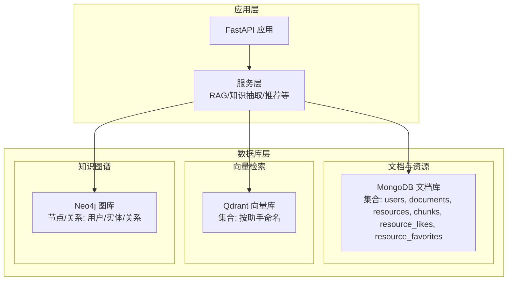
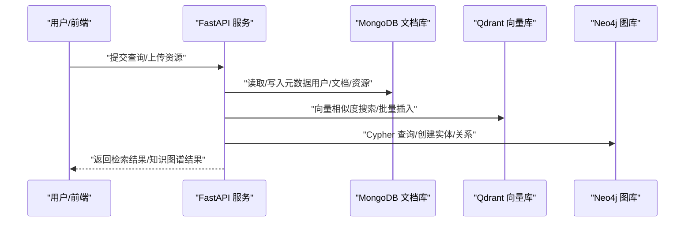
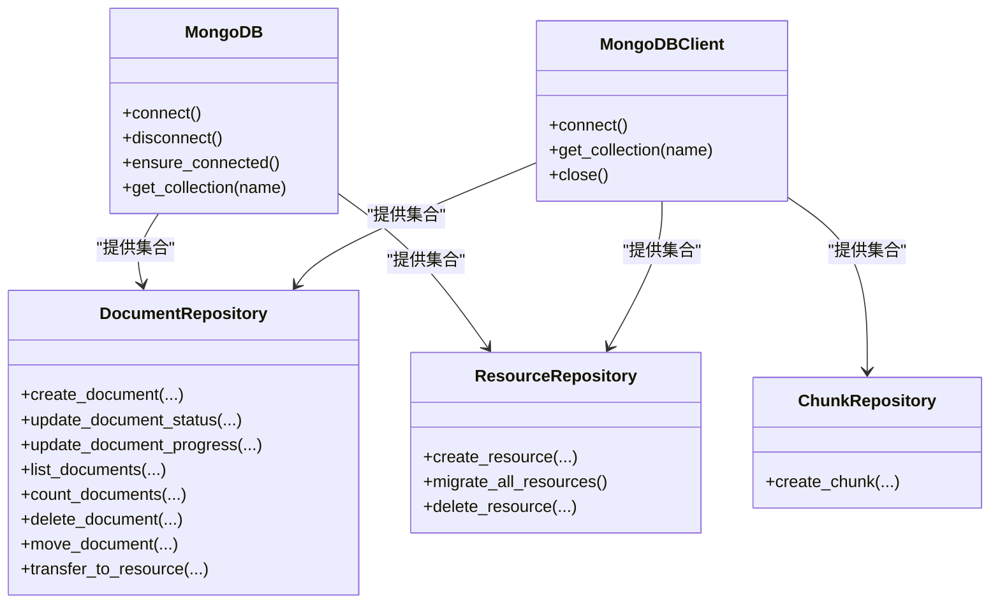
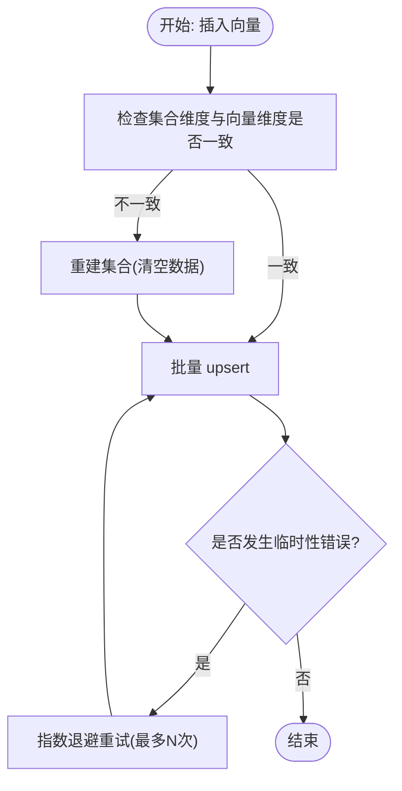
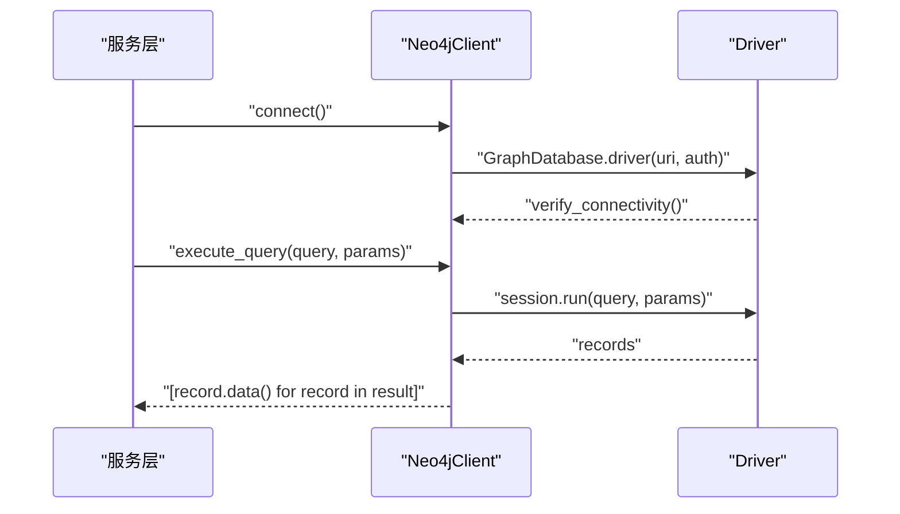
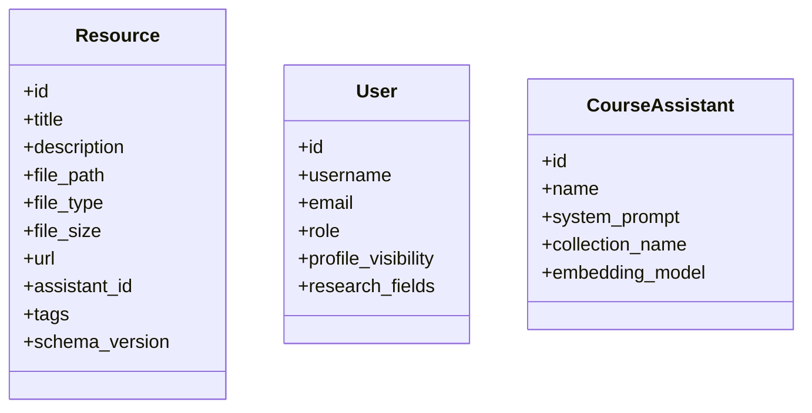
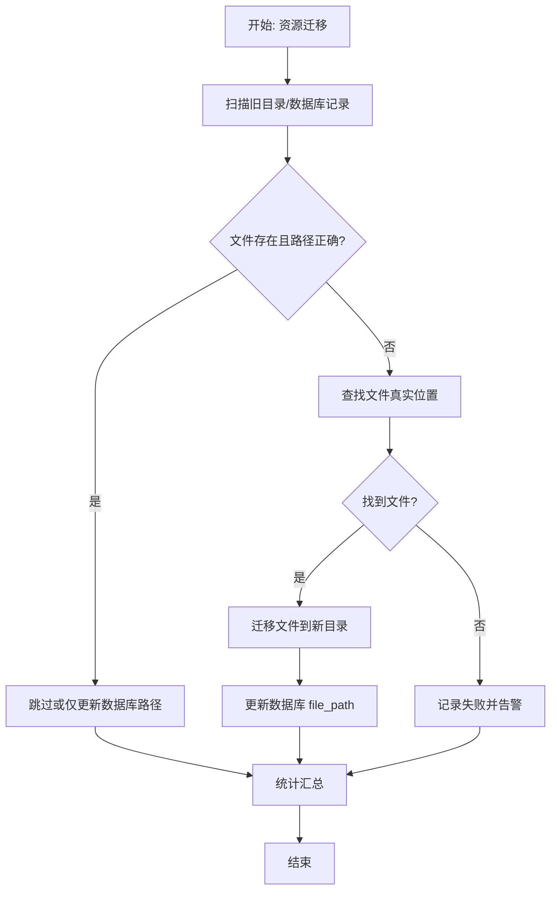
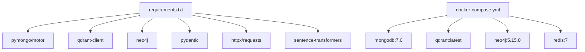

# 数据库集成

<cite>
**本文引用的文件**
- [database/mongodb.py](file://database/mongodb.py)
- [database/qdrant_client.py](file://database/qdrant_client.py)
- [database/neo4j_client.py](file://database/neo4j_client.py)
- [models/resource.py](file://models/resource.py)
- [models/user.py](file://models/user.py)
- [models/course_assistant.py](file://models/course_assistant.py)
- [utils/migrate_resources.py](file://utils/migrate_resources.py)
- [utils/monitoring.py](file://utils/monitoring.py)
- [scripts/README_MIGRATIONS.md](file://scripts/README_MIGRATIONS.md)
- [docker-compose.yml](file://docker-compose.yml)
- [requirements.txt](file://requirements.txt)
</cite>

## 目录
1. [简介](#简介)
2. [项目结构](#项目结构)
3. [核心组件](#核心组件)
4. [架构总览](#架构总览)
5. [详细组件分析](#详细组件分析)
6. [依赖分析](#依赖分析)
7. [性能考虑](#性能考虑)
8. [故障排查指南](#故障排查指南)
9. [结论](#结论)
10. [附录](#附录)

## 简介
本文件面向 Advanced RAG 数据库集成子系统，系统采用“多数据库协同”的架构设计，结合 MongoDB 文档存储、Qdrant 向量数据库与 Neo4j 图数据库，分别承担结构化元数据、向量检索与知识图谱的关系建模与查询。本文从架构设计、组件实现、数据模型、迁移与运维等方面进行深入解析，并提供性能优化、备份恢复与监控配置建议。

## 项目结构
数据库相关的核心模块与文件分布如下：
- 数据库客户端封装：database/mongodb.py、database/qdrant_client.py、database/neo4j_client.py
- 数据模型：models/resource.py、models/user.py、models/course_assistant.py
- 运维与迁移：utils/migrate_resources.py、scripts/README_MIGRATIONS.md
- 性能监控：utils/monitoring.py
- 容器编排：docker-compose.yml
- 依赖声明：requirements.txt

图表来源
- [database/mongodb.py](file://database/mongodb.py)
- [database/qdrant_client.py](file://database/qdrant_client.py)
- [database/neo4j_client.py](file://database/neo4j_client.py)
- [docker-compose.yml](file://docker-compose.yml)

章节来源
- [database/mongodb.py](file://database/mongodb.py)
- [database/qdrant_client.py](file://database/qdrant_client.py)
- [database/neo4j_client.py](file://database/neo4j_client.py)
- [docker-compose.yml](file://docker-compose.yml)

## 核心组件
- MongoDB 文档存储：提供用户、文档、资源、分块、点赞与收藏等集合的读写与管理，支持异步与同步客户端，具备连接池、URI 解析与重试机制。
- Qdrant 向量数据库：提供集合创建、向量批量插入、相似度搜索、按文档ID删除与滚动查询等能力，内置 gRPC 优先策略与重试机制。
- Neo4j 图数据库：提供连接、Cypher 查询、实体与关系创建等基础能力，适配容器环境的 URI 替换。
- 数据模型：Resource、User、CourseAssistant 等 Pydantic 模型，支撑前端与后端的数据契约与校验。
- 迁移与运维：资源迁移脚本与迁移说明文档，性能监控工具，容器化部署编排。

章节来源
- [database/mongodb.py](file://database/mongodb.py)
- [database/qdrant_client.py](file://database/qdrant_client.py)
- [database/neo4j_client.py](file://database/neo4j_client.py)
- [models/resource.py](file://models/resource.py)
- [models/user.py](file://models/user.py)
- [models/course_assistant.py](file://models/course_assistant.py)
- [utils/migrate_resources.py](file://utils/migrate_resources.py)
- [scripts/README_MIGRATIONS.md](file://scripts/README_MIGRATIONS.md)
- [utils/monitoring.py](file://utils/monitoring.py)
- [docker-compose.yml](file://docker-compose.yml)

## 架构总览
系统通过服务层协调三类数据库：
- 文档与资源：MongoDB 承担结构化元数据与生命周期管理（上传、处理、状态、进度、转换为资源等）。
- 向量检索：Qdrant 存储嵌入向量与元数据，支持基于集合的多助手隔离与相似度检索。
- 知识图谱：Neo4j 用于实体与关系建模，支持 Cypher 查询与图算法应用（如 APOC 插件启用）。

图表来源
- [database/mongodb.py](file://database/mongodb.py)
- [database/qdrant_client.py](file://database/qdrant_client.py)
- [database/neo4j_client.py](file://database/neo4j_client.py)

## 详细组件分析

### MongoDB 设计与实现
- 连接与配置
  - 支持 MONGODB_URI 或分离的主机/端口/认证变量组合，自动解析并注入连接池参数（最大/最小连接池、空闲超时、服务器选择/连接/套接字超时）。
  - 提供异步客户端与同步客户端两类封装，满足不同场景（API 请求与批处理）。
- 集合与仓库
  - DocumentRepository：文档元数据的创建、状态更新、进度更新、查询、计数、删除、移动与转换为资源。
  - ResourceRepository：资源的创建、更新、迁移（schema_version）、删除与点赞/收藏关联。
  - ChunkRepository：分块数据的管理（文件分块后向量化与持久化）。
- 事务与一致性
  - 项目中未见显式事务使用，文档与资源操作通过原子更新与幂等写入保障一致性；如需跨集合强一致，可在上层业务逻辑中引入补偿或幂等键控制。
- 索引与聚合
  - 项目提供迁移脚本用于创建 MongoDB 与 Neo4j 索引，提升查询性能；MongoDB 集合包含 users、documents、resources、chunks、resource_likes、resource_favorites 等。
  - 聚合与查询示例：按知识空间/助手过滤、分页排序、统计计数等。

图表来源
- [database/mongodb.py](file://database/mongodb.py)

章节来源
- [database/mongodb.py](file://database/mongodb.py)

### Qdrant 向量存储配置与使用
- 连接与健康检查
  - 优先使用 gRPC（端口 6334）以规避 HTTP/httpx 在 Windows 上的 502 问题，支持连接复用与超时配置。
  - 健康检查通过获取集合列表验证服务可用性，失败时支持重试与回退策略。
- 集合管理
  - create_collection：按向量维度与距离度量（默认余弦）创建集合；若维度不匹配则重建。
- 向量操作
  - insert_vectors：批量插入，支持 ID 规范化（UUID）、维度校验与自动重建、指数退避重试。
  - search：相似度搜索，支持过滤条件、分数阈值、按 document_id 精确过滤。
  - delete_by_document_id/delete_by_ids：按文档或 ID 删除。
  - get_collection_info/get_vectors_by_document_id：集合信息与滚动查询。
- 使用场景
  - 与 CourseAssistant 的 collection_name 对应，实现多助手隔离的向量检索。

图表来源
- [database/qdrant_client.py](file://database/qdrant_client.py)

章节来源
- [database/qdrant_client.py](file://database/qdrant_client.py)
- [models/course_assistant.py](file://models/course_assistant.py)

### Neo4j 图数据库应用
- 连接与容器适配
  - 支持容器内 localhost 替换为 host.docker.internal，验证连接并提供会话执行 Cypher。
- 基础能力
  - execute_query：执行任意 Cypher 并返回记录列表。
  - create_entity：基于 MERGE 创建/更新实体节点。
  - create_relationship：基于 MERGE 创建/更新关系。
- 应用场景
  - 用户画像、实体关系抽取、知识图谱构建与查询（如 APOC 插件启用）。

图表来源
- [database/neo4j_client.py](file://database/neo4j_client.py)

章节来源
- [database/neo4j_client.py](file://database/neo4j_client.py)
- [docker-compose.yml](file://docker-compose.yml)

### 数据模型与使用场景
- Resource：资源模型，包含标题、描述、文件/链接、封面、标签、公开状态、模型版本等字段，支持创建/更新/校验。
- User：用户模型，包含身份、角色、权限、资料扩展、可见性等字段，支持邮箱格式校验与字段优先级配置。
- CourseAssistant：课程助手模型，包含系统提示词、集合名称、默认助手标识、推理/向量化模型等，集合名称与 Qdrant 集合一一对应。

图表来源
- [models/resource.py](file://models/resource.py)
- [models/user.py](file://models/user.py)
- [models/course_assistant.py](file://models/course_assistant.py)

章节来源
- [models/resource.py](file://models/resource.py)
- [models/user.py](file://models/user.py)
- [models/course_assistant.py](file://models/course_assistant.py)

### 数据迁移工具与流程
- 资源迁移脚本
  - migrate_resources.py：扫描旧资源目录与数据库记录，迁移文件至统一目录并更新路径；支持规范化路径、跳过已存在文件、失败回退。
- 迁移脚本说明
  - README_MIGRATIONS.md：提供迁移命令、状态查看、强制重跑、Docker 环境运行、索引创建与故障排查指引。
- 版本升级与兼容
  - ResourceRepository.migrate_all_resources：按 schema_version 批量迁移资源，保证向前兼容。

图表来源
- [utils/migrate_resources.py](file://utils/migrate_resources.py)
- [scripts/README_MIGRATIONS.md](file://scripts/README_MIGRATIONS.md)

章节来源
- [utils/migrate_resources.py](file://utils/migrate_resources.py)
- [scripts/README_MIGRATIONS.md](file://scripts/README_MIGRATIONS.md)

## 依赖分析
- 客户端依赖
  - MongoDB：pymongo、motor
  - Qdrant：qdrant-client
  - Neo4j：neo4j
  - 其他：pydantic、httpx、requests、sentence-transformers 等
- 容器化依赖
  - docker-compose 定义了 mongodb、qdrant、neo4j、redis 等服务及其卷与健康检查。

图表来源
- [requirements.txt](file://requirements.txt)
- [docker-compose.yml](file://docker-compose.yml)

章节来源
- [requirements.txt](file://requirements.txt)
- [docker-compose.yml](file://docker-compose.yml)

## 性能考虑
- MongoDB
  - 连接池参数：maxPoolSize、minPoolSize、maxIdleTimeMS、serverSelectionTimeoutMS、connectTimeoutMS、socketTimeoutMS，建议根据并发与延迟需求调优。
  - 查询优化：按知识空间/助手过滤、分页排序、索引创建（迁移脚本提供索引创建）。
- Qdrant
  - 优先 gRPC（6334）连接，避免 HTTP/httpx 问题；批量插入时按批次与重试策略降低抖动；相似度搜索使用过滤条件与分数阈值控制召回。
  - 集合维度与距离度量需与嵌入模型一致，避免维度不匹配导致重建。
- Neo4j
  - 启用 APOC 插件以支持图算法；合理使用索引与约束；Cypher 查询注意参数化与计划缓存。
- 监控
  - 性能监控器记录请求耗时、错误率与系统指标（CPU/内存/磁盘），慢请求告警便于定位瓶颈。

章节来源
- [database/mongodb.py](file://database/mongodb.py)
- [database/qdrant_client.py](file://database/qdrant_client.py)
- [database/neo4j_client.py](file://database/neo4j_client.py)
- [utils/monitoring.py](file://utils/monitoring.py)

## 故障排查指南
- MongoDB
  - 连接失败：检查 MONGODB_URI/MONGODB_HOST/MONGODB_PORT/MONGODB_AUTH_SOURCE 等环境变量；确认容器网络与端口映射；首次连接 ping 校验。
  - 集合不存在：确认迁移脚本已执行；检查集合名称与权限。
- Qdrant
  - gRPC/HTTP 502：切换为 gRPC（6334）；容器内 localhost 替换为 host.docker.internal；检查超时与重试配置。
  - 维度不匹配：insert_vectors 时自动重建集合；或手动 recreate_collection。
- Neo4j
  - 连接失败：确认 NEO4J_URI/USER/PASSWORD；容器网络；APOC 插件可用性。
- 迁移与运维
  - 迁移失败：查看 migration_history 记录；核对索引名称与字段；在测试环境先行验证。
  - 资源迁移：核对 RESOURCE_DIR 与旧目录映射；检查文件完整性与权限。

章节来源
- [database/mongodb.py](file://database/mongodb.py)
- [database/qdrant_client.py](file://database/qdrant_client.py)
- [database/neo4j_client.py](file://database/neo4j_client.py)
- [scripts/README_MIGRATIONS.md](file://scripts/README_MIGRATIONS.md)
- [utils/migrate_resources.py](file://utils/migrate_resources.py)

## 结论
本项目通过 MongoDB、Qdrant、Neo4j 的协同，实现了从结构化元数据、向量检索到知识图谱的全链路数据库集成。MongoDB 负责文档与资源的生命周期管理，Qdrant 提供高性能向量检索，Neo4j 支撑复杂关系建模。配合完善的迁移脚本、监控与容器化编排，系统具备良好的可维护性与扩展性。

## 附录
- 环境变量与端口
  - MongoDB：MONGODB_URI/MONGODB_HOST/MONGODB_PORT/MONGODB_AUTH_SOURCE
  - Qdrant：QDRANT_URL/QDRANT_API_KEY/QDRANT_TIMEOUT/QDRANT_GRPC_PORT
  - Neo4j：NEO4J_URI/NEO4J_USER/NEO4J_PASSWORD
  - 资源目录：RESOURCE_DIR
- 常用命令
  - 运行迁移：参考 scripts/README_MIGRATIONS.md
  - 启动服务：docker-compose up -d