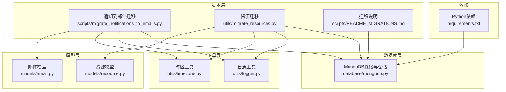
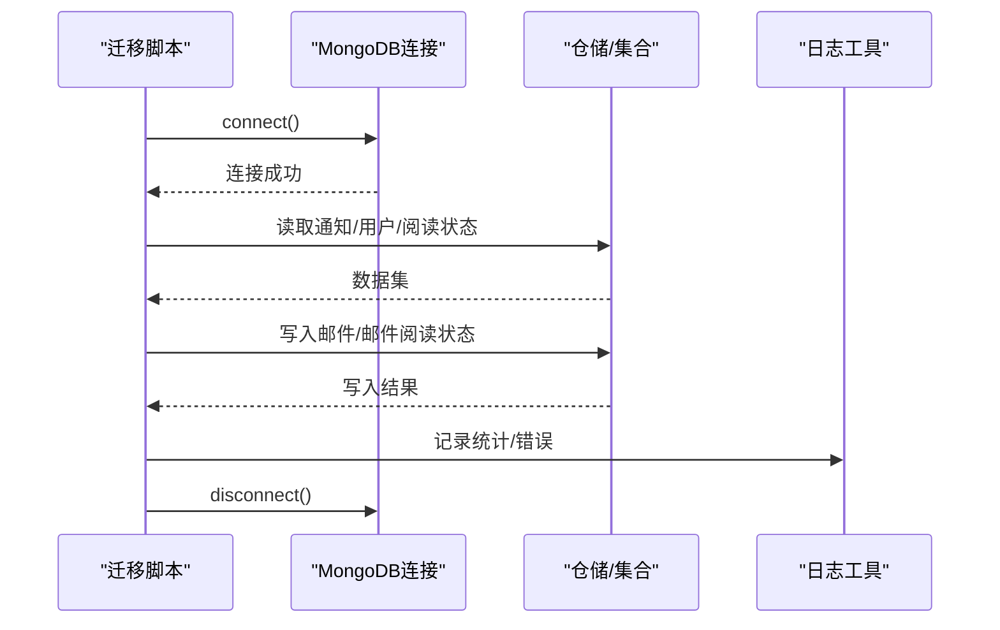
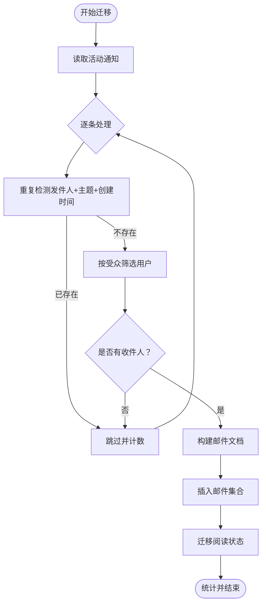
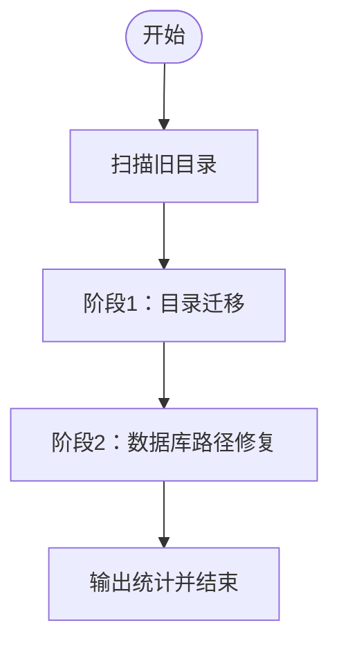
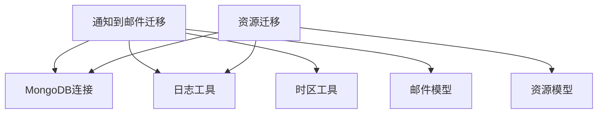

# 数据迁移工具

<cite>
**本文引用的文件**
- [migrate_notifications_to_emails.py](file://scripts/migrate_notifications_to_emails.py)
- [migrate_resources.py](file://utils/migrate_resources.py)
- [README_MIGRATIONS.md](file://scripts/README_MIGRATIONS.md)
- [mongodb.py](file://database/mongodb.py)
- [logger.py](file://utils/logger.py)
- [timezone.py](file://utils/timezone.py)
- [email.py](file://models/email.py)
- [resource.py](file://models/resource.py)
- [requirements.txt](file://requirements.txt)
</cite>

## 目录
1. [简介](#简介)
2. [项目结构](#项目结构)
3. [核心组件](#核心组件)
4. [架构总览](#架构总览)
5. [详细组件分析](#详细组件分析)
6. [依赖分析](#依赖分析)
7. [性能考量](#性能考量)
8. [迁移前准备](#迁移前准备)
9. [迁移后验证](#迁移后验证)
10. [常见问题与故障排除](#常见问题与故障排除)
11. [结论](#结论)

## 简介
本文件面向“数据迁移工具”的使用者与维护者，系统化阐述两类迁移能力：
- 通知到邮件的迁移：将历史通知数据转换为邮件并同步阅读状态，覆盖数据格式转换、字段映射、批量处理、重复检测与状态同步。
- 资源文件与路径迁移：将旧版本服务器上的资源文件统一迁移到新挂载点，并更新数据库中的文件路径，支持从旧目录批量迁移与基于数据库记录的路径修复。

同时给出迁移策略设计原则（数据完整性、回滚机制、错误处理）、性能优化建议（批量大小、内存管理、并发）、迁移前后验证方法以及常见问题排查指引。

## 项目结构
围绕迁移主题的关键文件分布如下：
- scripts：迁移脚本与说明
  - migrate_notifications_to_emails.py：通知到邮件迁移
  - README_MIGRATIONS.md：通用模型迁移脚本说明
- utils：通用工具
  - migrate_resources.py：资源迁移
  - logger.py：异步日志
  - timezone.py：时区工具
- database：数据库连接与仓储
  - mongodb.py：MongoDB连接、仓储与文档/资源处理
- models：邮件与资源数据模型
  - email.py：邮件相关模型
  - resource.py：资源相关模型
- requirements.txt：运行依赖

图表来源
- [migrate_notifications_to_emails.py:1-170](file://scripts/migrate_notifications_to_emails.py#L1-L170)
- [migrate_resources.py:1-337](file://utils/migrate_resources.py#L1-L337)
- [mongodb.py:1-205](file://database/mongodb.py#L1-L205)
- [logger.py:1-88](file://utils/logger.py#L1-L88)
- [timezone.py:1-53](file://utils/timezone.py#L1-L53)
- [email.py:1-104](file://models/email.py#L1-L104)
- [resource.py:1-90](file://models/resource.py#L1-L90)
- [requirements.txt:1-42](file://requirements.txt#L1-L42)

章节来源
- [migrate_notifications_to_emails.py:1-170](file://scripts/migrate_notifications_to_emails.py#L1-L170)
- [migrate_resources.py:1-337](file://utils/migrate_resources.py#L1-L337)
- [mongodb.py:1-205](file://database/mongodb.py#L1-L205)
- [logger.py:1-88](file://utils/logger.py#L1-L88)
- [timezone.py:1-53](file://utils/timezone.py#L1-L53)
- [email.py:1-104](file://models/email.py#L1-L104)
- [resource.py:1-90](file://models/resource.py#L1-L90)
- [requirements.txt:1-42](file://requirements.txt#L1-L42)

## 核心组件
- 通知到邮件迁移脚本
  - 功能：遍历通知集合，按受众筛选用户，生成邮件记录，迁移阅读状态，去重与错误处理。
  - 关键流程：连接数据库 → 读取通知 → 重复检测 → 生成邮件 → 迁移阅读状态 → 记录统计。
- 资源迁移工具
  - 功能：扫描旧目录与数据库记录，复制文件到新目录，校验文件完整性，更新数据库路径。
  - 关键流程：发现旧目录 → 扫描文件 → 规范化路径 → 复制文件 → 更新数据库 → 统计结果。
- 数据库与仓储
  - MongoDB连接：支持环境变量配置、连接池参数、异步/同步客户端。
  - 仓储：提供集合访问、文档/资源增删改查、版本迁移辅助。
- 日志与时区
  - 异步日志：队列+监听器，避免阻塞主线程。
  - 时区：统一北京时间，确保时间字段一致性。

章节来源
- [migrate_notifications_to_emails.py:17-146](file://scripts/migrate_notifications_to_emails.py#L17-L146)
- [migrate_resources.py:132-261](file://utils/migrate_resources.py#L132-L261)
- [mongodb.py:92-204](file://database/mongodb.py#L92-L204)
- [logger.py:15-87](file://utils/logger.py#L15-L87)
- [timezone.py:9-37](file://utils/timezone.py#L9-L37)

## 架构总览
迁移工具整体采用“脚本驱动 + 数据库仓储 + 工具库”的分层架构，保证可维护性与可扩展性。

图表来源
- [migrate_notifications_to_emails.py:148-165](file://scripts/migrate_notifications_to_emails.py#L148-L165)
- [mongodb.py:99-195](file://database/mongodb.py#L99-L195)
- [logger.py:15-87](file://utils/logger.py#L15-L87)

## 详细组件分析

### 通知到邮件迁移组件
- 数据来源与目标
  - 输入：notifications、notification_read_status
  - 输出：emails、email_read_status
- 字段映射与转换
  - 发件人：created_by → from_user_id；created_by_username → from_username
  - 主题/内容：title → subject；content → content；markdown_content → markdown_content
  - 收件人：根据 target_audience 过滤 users，生成 to_user_ids；to_user_type 保留受众类型
  - 状态：priority、status（sent）、is_relationship_required（通知不需要关系）
  - 时间：created_at/sent_at/updated_at 均来自通知时间
- 重复检测
  - 以发件人、主题、创建时间三元组在 emails 集合中查找，避免重复迁移
- 阅读状态迁移
  - 若存在通知阅读状态，则将每条阅读记录转为邮件阅读状态（已读）
  - 若无阅读记录，则为所有收件人创建未读状态（is_read=False）
- 并发与批量
  - 通知读取采用异步游标遍历；阅读状态迁移使用批量插入
- 错误处理
  - 单条通知失败不影响整体流程，记录错误并跳过，最终输出统计

图表来源
- [migrate_notifications_to_emails.py:37-141](file://scripts/migrate_notifications_to_emails.py#L37-L141)

章节来源
- [migrate_notifications_to_emails.py:17-146](file://scripts/migrate_notifications_to_emails.py#L17-L146)
- [email.py:15-68](file://models/email.py#L15-L68)

### 资源迁移组件
- 目录扫描与路径规范化
  - 预定义多处旧目录位置，自动探测并列出存在文件的目录
  - 对相对路径进行绝对化处理，兼容不同容器/部署形态
- 文件迁移与校验
  - 使用复制+大小对比的方式校验迁移一致性
  - 若目标已存在则跳过，避免重复写入
- 数据库路径更新
  - 对于已在新目录的文件仅更新数据库路径
  - 对于迁移成功的文件更新 file_path 并记录 updated_at
- 两阶段流程
  - 第一阶段：从旧目录批量复制文件到新目录
  - 第二阶段：基于数据库记录修正路径并补全缺失文件

图表来源
- [migrate_resources.py:320-332](file://utils/migrate_resources.py#L320-L332)

章节来源
- [migrate_resources.py:29-83](file://utils/migrate_resources.py#L29-L83)
- [migrate_resources.py:132-261](file://utils/migrate_resources.py#L132-L261)
- [migrate_resources.py:264-307](file://utils/migrate_resources.py#L264-L307)
- [resource.py:8-27](file://models/resource.py#L8-L27)

### 数据库与仓储
- MongoDB连接
  - 支持 MONGODB_URI 或分离的 HOST/PORT/USERNAME/PASSWORD/DB_NAME
  - 连接池参数可配置，包含最大/最小连接数、空闲超时、选择/连接/套接字超时
  - 提供异步/同步客户端，分别用于迁移脚本与文档处理
- 仓储能力
  - 集合访问、文档/资源增删改查、版本迁移辅助
  - 文档仓库提供去重检查、状态/进度更新、分块管理等

章节来源
- [mongodb.py:92-204](file://database/mongodb.py#L92-L204)
- [mongodb.py:232-336](file://database/mongodb.py#L232-L336)
- [mongodb.py:338-562](file://database/mongodb.py#L338-L562)
- [mongodb.py:860-1040](file://database/mongodb.py#L860-L1040)

### 日志与时间工具
- 异步日志
  - 使用队列+监听器实现后台异步写入，避免阻塞主线程
  - 控制台与文件处理器并存，生产环境可降低文件日志级别
- 时区
  - 统一北京时间，提供当前时间获取与时间转换工具

章节来源
- [logger.py:15-87](file://utils/logger.py#L15-L87)
- [timezone.py:9-37](file://utils/timezone.py#L9-L37)

## 依赖分析
- 运行依赖
  - Python Web框架、数据库驱动、HTTP请求、文档解析、文本处理、向量模型、测试框架等
- 迁移脚本依赖
  - MongoDB连接与集合访问
  - 日志与时间工具
  - Pydantic模型（邮件/资源）

图表来源
- [migrate_notifications_to_emails.py:11-14](file://scripts/migrate_notifications_to_emails.py#L11-L14)
- [migrate_resources.py:5-12](file://utils/migrate_resources.py#L5-L12)
- [requirements.txt:4-42](file://requirements.txt#L4-L42)

章节来源
- [requirements.txt:1-42](file://requirements.txt#L1-L42)
- [migrate_notifications_to_emails.py:11-14](file://scripts/migrate_notifications_to_emails.py#L11-L14)
- [migrate_resources.py:5-12](file://utils/migrate_resources.py#L5-L12)

## 性能考量
- 连接与并发
  - 使用异步MongoDB客户端，适合高并发场景；连接池参数可调优
  - 通知读取采用异步游标遍历，避免一次性加载全部数据
- 批量写入
  - 邮件阅读状态迁移使用批量插入，减少往返次数
- 内存管理
  - 通知读取使用 to_list(length=None) 一次性拉取，注意大集合内存占用；可考虑分页或流式处理
  - 资源迁移复制文件时进行大小校验，避免损坏文件占用空间
- I/O与磁盘
  - 资源迁移前确保新目录存在，复制完成后校验文件大小，失败则回滚删除
- 日志开销
  - 异步日志避免阻塞，生产环境可降低文件日志级别

章节来源
- [mongodb.py:122-151](file://database/mongodb.py#L122-L151)
- [migrate_notifications_to_emails.py:31-32](file://scripts/migrate_notifications_to_emails.py#L31-L32)
- [migrate_notifications_to_emails.py:114-115](file://scripts/migrate_notifications_to_emails.py#L114-L115)
- [migrate_resources.py:66-79](file://utils/migrate_resources.py#L66-L79)
- [logger.py:56-81](file://utils/logger.py#L56-L81)

## 迁移前准备
- 数据备份
  - 在生产环境执行前，务必对 notifications、users、notification_read_status、resources 等集合进行备份
- 环境检查
  - 确认 MongoDB 连接参数（MONGODB_URI 或 HOST/PORT/USERNAME/PASSWORD/DB_NAME）正确
  - 确认新资源目录存在且具备写权限
- 依赖验证
  - 安装 Python 依赖（requirements.txt）
  - 确认 Python 路径包含项目根目录，以便脚本导入模块
- 权限与容量
  - 确认数据库写入权限与磁盘空间充足
  - 对于资源迁移，预留足够的磁盘空间以容纳旧目录文件

章节来源
- [README_MIGRATIONS.md:109-113](file://scripts/README_MIGRATIONS.md#L109-L113)
- [migrate_resources.py:317-318](file://utils/migrate_resources.py#L317-L318)
- [requirements.txt:1-42](file://requirements.txt#L1-L42)

## 迁移后验证
- 通知到邮件
  - 统计 emails 集合数量与原通知数量是否匹配（考虑受众为空的情况）
  - 抽样检查邮件字段映射（发件人、主题、内容、优先级、状态）
  - 校验 email_read_status 集合中阅读状态是否正确迁移（已读/未读）
- 资源迁移
  - 校验 resources 集合中 file_path 是否更新为新目录
  - 对比文件大小与源文件一致，确保迁移完整性
  - 抽样访问资源文件，确认可正常打开
- 功能回归
  - 在测试环境验证邮件功能与资源访问功能是否正常
  - 回归通知/邮件相关接口，确保无异常

章节来源
- [migrate_notifications_to_emails.py:141-141](file://scripts/migrate_notifications_to_emails.py#L141-L141)
- [migrate_resources.py:251-251](file://utils/migrate_resources.py#L251-L251)
- [README_MIGRATIONS.md:115-135](file://scripts/README_MIGRATIONS.md#L115-L135)

## 常见问题与故障排除
- MongoDB连接失败
  - 检查 MONGODB_URI 或 HOST/PORT/USERNAME/PASSWORD/DB_NAME 配置
  - 确认 MongoDB 服务已启动，容器网络配置正确
- 迁移脚本执行失败
  - 查看日志输出，定位具体错误
  - 检查 migration_history（通用模型迁移）或迁移脚本日志
- 索引创建失败
  - 检查索引名称冲突、字段存在性
- Neo4j连接失败（通用模型迁移）
  - 确认服务运行、连接配置（NEO4J_URI/USER/PASSWORD）、容器网络
- 资源文件缺失
  - 确认旧目录扫描结果与预期一致
  - 检查文件权限与磁盘空间
- 重复迁移
  - 通知迁移已按三元组去重；如仍有重复，检查时间精度与字段值

章节来源
- [README_MIGRATIONS.md:115-135](file://scripts/README_MIGRATIONS.md#L115-L135)
- [migrate_notifications_to_emails.py:143-145](file://scripts/migrate_notifications_to_emails.py#L143-L145)
- [migrate_resources.py:259-261](file://utils/migrate_resources.py#L259-L261)

## 结论
本文档系统梳理了通知到邮件迁移与资源迁移两大能力，明确了数据转换、字段映射、重复检测、状态同步、性能优化与验证方法。建议在测试环境充分验证后，再在生产环境执行，并严格遵循迁移前准备与回滚策略，确保数据完整性与业务连续性。