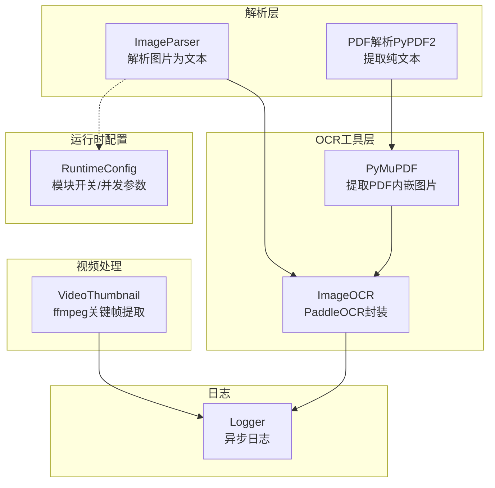
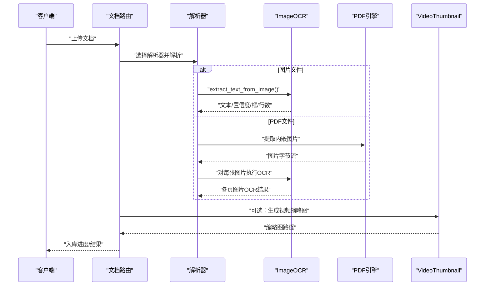
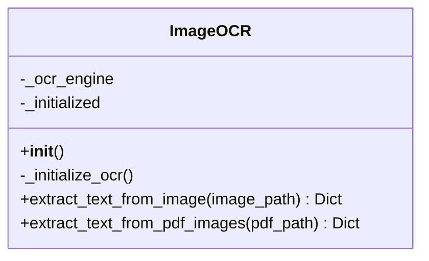
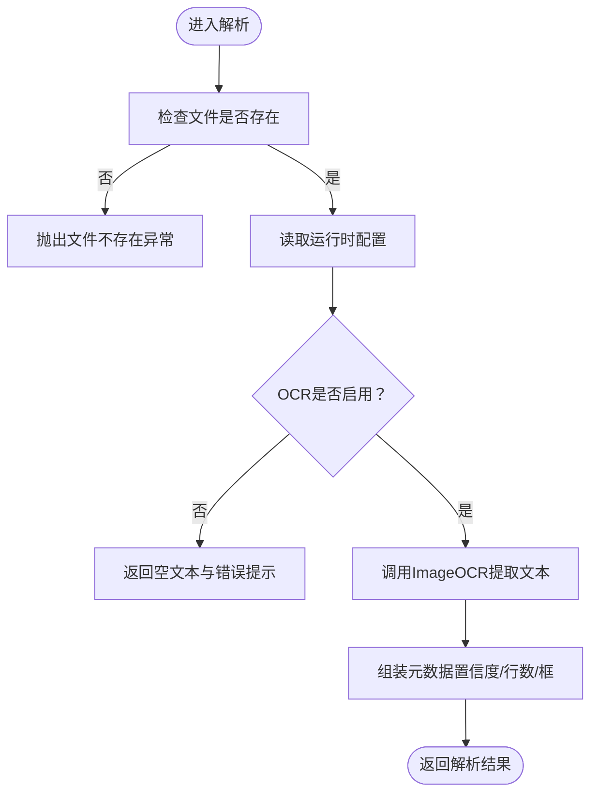
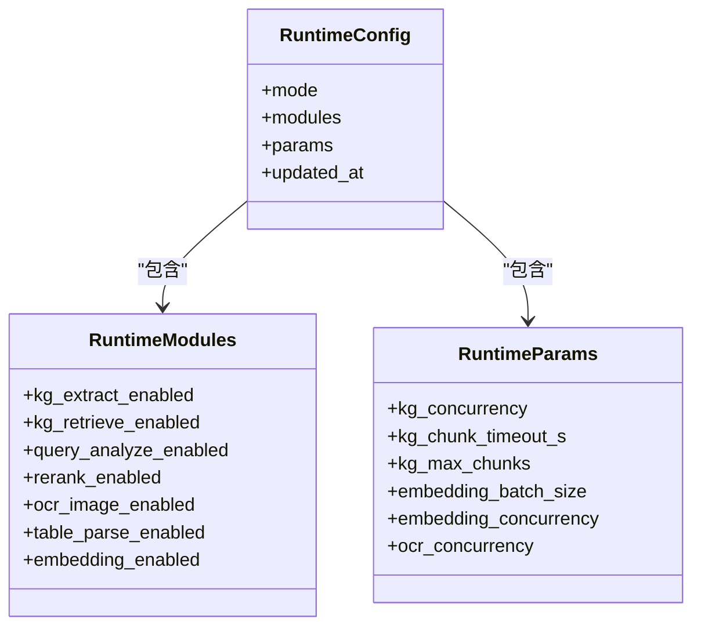
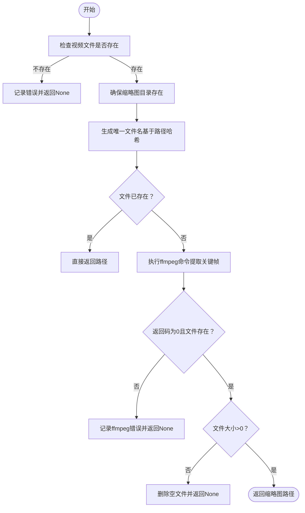
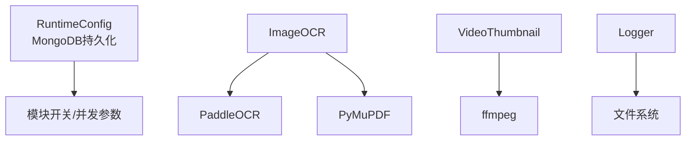

# OCR图像处理

<cite>
**本文引用的文件**
- [README.md](file://README.md)
- [requirements.txt](file://requirements.txt)
- [utils/image_ocr.py](file://utils/image_ocr.py)
- [utils/video_thumbnail.py](file://utils/video_thumbnail.py)
- [utils/logger.py](file://utils/logger.py)
- [parsers/base.py](file://parsers/base.py)
- [parsers/image_parser.py](file://parsers/image_parser.py)
- [services/runtime_config.py](file://services/runtime_config.py)
- [routers/documents.py](file://routers/documents.py)
</cite>

## 目录
1. [简介](#简介)
2. [项目结构](#项目结构)
3. [核心组件](#核心组件)
4. [架构总览](#架构总览)
5. [详细组件分析](#详细组件分析)
6. [依赖分析](#依赖分析)
7. [性能考虑](#性能考虑)
8. [故障排除指南](#故障排除指南)
9. [结论](#结论)
10. [附录](#附录)

## 简介
本技术文档围绕 Advanced RAG 系统中的 OCR 图像处理能力展开，重点覆盖以下方面：
- OCR 引擎集成方案：以 PaddleOCR 为核心，说明初始化、配置与调用流程。
- 图像预处理：结合现有实现，梳理可扩展的图像质量提升、噪声去除、倾斜校正、二值化等预处理思路。
- 视频缩略图生成：基于 ffmpeg 的关键帧提取、图像压缩与格式转换实现。
- 多语言与精度优化：结合运行时配置与并发参数，给出可落地的优化策略。
- 批量处理策略：在文档入库流程中如何组织解析、分块与向量化阶段。
- 性能调优与故障排除：日志、超时、并发与依赖缺失的应对方法。

## 项目结构
与 OCR 和视频缩略图相关的关键模块分布如下：
- OCR 实现：utils/image_ocr.py 提供 PaddleOCR 的封装与 PDF 图片提取。
- 图像解析器：parsers/image_parser.py 通过运行时配置控制 OCR 开关，并将结果写入元数据。
- 运行时配置：services/runtime_config.py 提供模块开关与并发参数，支持低配/高性能模式切换。
- 视频缩略图：utils/video_thumbnail.py 基于 ffmpeg 提取关键帧并生成缩略图。
- 日志：utils/logger.py 提供异步日志写入，便于性能与问题排查。
- 文档路由：routers/documents.py 展示了文档上传与解析的完整流程，包含进度与超时控制。

图表来源
- [parsers/image_parser.py:10-61](file://parsers/image_parser.py#L10-L61)
- [utils/image_ocr.py:7-224](file://utils/image_ocr.py#L7-L224)
- [services/runtime_config.py:15-218](file://services/runtime_config.py#L15-L218)
- [utils/video_thumbnail.py:12-123](file://utils/video_thumbnail.py#L12-L123)
- [utils/logger.py:15-88](file://utils/logger.py#L15-L88)

章节来源
- [README.md:36-44](file://README.md#L36-L44)
- [requirements.txt:23-29](file://requirements.txt#L23-L29)

## 核心组件
- ImageOCR：封装 PaddleOCR 初始化、图片 OCR、PDF 内图片提取与 OCR，并提供统一结果结构（文本、置信度、文字框、行数等）。
- ImageParser：图片解析器，根据运行时配置决定是否启用 OCR，并将 OCR 结果写入元数据。
- RuntimeConfig：提供模块开关（如 ocr_image_enabled）与并发参数（如 ocr_concurrency），支持低配/高性能模式。
- VideoThumbnail：基于 ffmpeg 的关键帧提取与缩略图生成，支持尺寸缩放与质量控制。
- Logger：异步日志写入，降低 I/O 对主流程的影响。

章节来源
- [utils/image_ocr.py:7-224](file://utils/image_ocr.py#L7-L224)
- [parsers/image_parser.py:10-61](file://parsers/image_parser.py#L10-L61)
- [services/runtime_config.py:15-218](file://services/runtime_config.py#L15-L218)
- [utils/video_thumbnail.py:12-123](file://utils/video_thumbnail.py#L12-L123)
- [utils/logger.py:15-88](file://utils/logger.py#L15-L88)

## 架构总览
OCR 与视频缩略图在文档入库流程中的位置如下：

图表来源
- [routers/documents.py:48-112](file://routers/documents.py#L48-L112)
- [parsers/image_parser.py:13-57](file://parsers/image_parser.py#L13-L57)
- [utils/image_ocr.py:124-218](file://utils/image_ocr.py#L124-L218)
- [utils/video_thumbnail.py:12-108](file://utils/video_thumbnail.py#L12-L108)

## 详细组件分析

### 组件一：ImageOCR（PaddleOCR 封装）
- 初始化策略：延迟初始化，按需加载 PaddleOCR，支持中英文识别，自动选择 GPU/CPU。
- 图片 OCR：返回文本、平均置信度、文字框坐标、行数；异常时返回错误信息。
- PDF 图片 OCR：使用 PyMuPDF 提取 PDF 内嵌图片，逐张进行 OCR，并汇总结果。
- 错误处理：导入失败、初始化失败、识别异常均有日志记录与兜底返回。

图表来源
- [utils/image_ocr.py:7-224](file://utils/image_ocr.py#L7-L224)

章节来源
- [utils/image_ocr.py:15-123](file://utils/image_ocr.py#L15-L123)
- [utils/image_ocr.py:124-218](file://utils/image_ocr.py#L124-L218)

### 组件二：ImageParser（图片解析器）
- 运行时开关：通过运行时配置读取模块开关，可在低配模式下关闭 OCR。
- 解析流程：调用 ImageOCR，将文本与置信度、行数、错误信息写入元数据。
- 扩展性：支持多种图片格式（jpg/jpeg/png/bmp/webp/tiff/tif）。

图表来源
- [parsers/image_parser.py:13-57](file://parsers/image_parser.py#L13-L57)
- [services/runtime_config.py:164-188](file://services/runtime_config.py#L164-L188)

章节来源
- [parsers/image_parser.py:10-61](file://parsers/image_parser.py#L10-L61)

### 组件三：运行时配置（模块开关与并发）
- 模块开关：kg_extract_enabled/kg_retrieve_enabled/query_analyze_enabled/rerank_enabled/ocr_image_enabled/table_parse_enabled/embedding_enabled。
- 并发参数：kg_concurrency/kg_chunk_timeout_s/kg_max_chunks/embedding_batch_size/embedding_concurrency/ocr_concurrency。
- 预设模式：low/high/custom，低配模式默认关闭 OCR，高性能模式默认开启。

图表来源
- [services/runtime_config.py:15-38](file://services/runtime_config.py#L15-L38)

章节来源
- [services/runtime_config.py:41-83](file://services/runtime_config.py#L41-L83)
- [services/runtime_config.py:164-188](file://services/runtime_config.py#L164-L188)

### 组件四：视频缩略图生成（ffmpeg）
- 关键帧提取：指定时间点（默认 1 秒），提取单帧。
- 尺寸与比例：按目标宽高缩放，保持原始宽高比。
- 质量控制：使用高质量 JPEG 参数。
- 容错与日志：超时、ffmpeg 未安装、空文件等均有明确处理与日志记录。

图表来源
- [utils/video_thumbnail.py:12-108](file://utils/video_thumbnail.py#L12-L108)

章节来源
- [utils/video_thumbnail.py:12-123](file://utils/video_thumbnail.py#L12-L123)

### 组件五：日志系统（异步）
- 异步写入：使用队列与后台监听器，避免 I/O 阻塞主线程。
- 级别与过滤：支持不同环境的日志级别，过滤第三方库噪音。
- 文件轮转：按大小轮转，保留多个备份。

章节来源
- [utils/logger.py:15-88](file://utils/logger.py#L15-L88)

## 依赖分析
- OCR 引擎：PaddleOCR（通过 vendor 安装），PyMuPDF（PDF 图片提取）。
- 视频处理：ffmpeg（系统依赖）。
- 日志：标准库与第三方轮转处理器。
- 运行时配置：MongoDB 存储与缓存，支持 TTL。

图表来源
- [requirements.txt:23-29](file://requirements.txt#L23-L29)
- [utils/image_ocr.py:20-28](file://utils/image_ocr.py#L20-L28)
- [utils/video_thumbnail.py:59-68](file://utils/video_thumbnail.py#L59-L68)
- [utils/logger.py:47-66](file://utils/logger.py#L47-L66)

章节来源
- [requirements.txt:2-42](file://requirements.txt#L2-L42)
- [README.md:88-124](file://README.md#L88-L124)

## 性能考虑
- OCR 初始化延迟：仅在首次使用时加载，避免启动开销。
- 运行时开关：低配模式可关闭 OCR，降低资源占用。
- 并发参数：通过 ocr_concurrency 等参数调节吞吐，结合队列与超时控制。
- 超时与进度：解析与分块过程设置超时与阶段性进度，保障长任务稳定性。
- 日志异步：异步日志写入减少 I/O 对主流程影响。

章节来源
- [utils/image_ocr.py:15-36](file://utils/image_ocr.py#L15-L36)
- [services/runtime_config.py:41-83](file://services/runtime_config.py#L41-L83)
- [routers/documents.py:114-187](file://routers/documents.py#L114-L187)
- [utils/logger.py:56-66](file://utils/logger.py#L56-L66)

## 故障排除指南
- PaddleOCR 未安装或初始化失败
  - 现象：返回“OCR引擎未初始化”或警告日志。
  - 处理：确认已按 README 的依赖下载步骤安装 PaddleOCR，并检查环境变量与路径。
  - 参考
    - [utils/image_ocr.py:31-36](file://utils/image_ocr.py#L31-L36)
    - [README.md:88-105](file://README.md#L88-L105)

- 图片文件不存在
  - 现象：解析器抛出文件不存在异常或返回空文本。
  - 处理：检查上传路径与文件权限。
  - 参考
    - [parsers/image_parser.py:15-16](file://parsers/image_parser.py#L15-L16)

- OCR 已关闭（运行时配置）
  - 现象：返回空文本并带有“OCR 已关闭”的错误提示。
  - 处理：在运行时配置中启用 ocr_image_enabled。
  - 参考
    - [parsers/image_parser.py:22-31](file://parsers/image_parser.py#L22-L31)
    - [services/runtime_config.py:41-83](file://services/runtime_config.py#L41-L83)

- PDF 图片提取失败
  - 现象：返回“PyMuPDF未安装”或警告日志。
  - 处理：安装 PyMuPDF 并确保版本满足要求。
  - 参考
    - [utils/image_ocr.py:136-142](file://utils/image_ocr.py#L136-L142)

- ffmpeg 未安装或超时
  - 现象：返回 None 或超时日志。
  - 处理：安装 ffmpeg 并确保在 PATH 中；必要时增大超时时间。
  - 参考
    - [utils/video_thumbnail.py:102-107](file://utils/video_thumbnail.py#L102-L107)
    - [README.md:107-123](file://README.md#L107-L123)

- 日志过多或性能下降
  - 现象：磁盘写入压力大。
  - 处理：调整日志级别与轮转策略，生产环境可提高文件日志级别。
  - 参考
    - [utils/logger.py:77-81](file://utils/logger.py#L77-L81)

## 结论
本系统以 PaddleOCR 为核心实现了图片与 PDF 内嵌图片的文字识别，并通过运行时配置灵活控制模块开关与并发参数。视频缩略图生成基于 ffmpeg，具备良好的可扩展性。整体架构在保证功能完整性的同时，兼顾了性能与稳定性，适合在知识库入库场景中进行大规模 OCR 与多媒体处理。

## 附录
- 多语言与识别精度优化建议
  - 语言模型：PaddleOCR 初始化时可选择语言包，结合文档内容选择合适语言组合。
  - 图像预处理：可在 ImageOCR 与 ImageParser 之间增加预处理模块（如去噪、倾斜校正、二值化），以提升识别准确率。
  - 置信度阈值：在解析器侧加入置信度过滤，仅保留高置信度文本。
  - 批量策略：结合 ocr_concurrency 与队列限流，控制并发与内存占用。
- 批量处理策略
  - 文档路由中解析阶段设置超时与进度反馈，解析完成后进入分块与向量化阶段，最后入库。
  - 参考
    - [routers/documents.py:114-187](file://routers/documents.py#L114-L187)