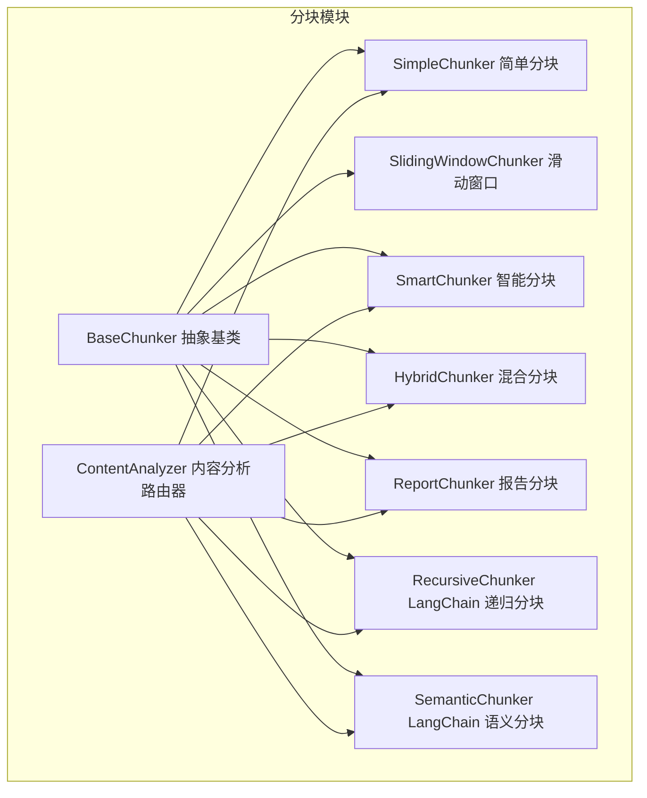
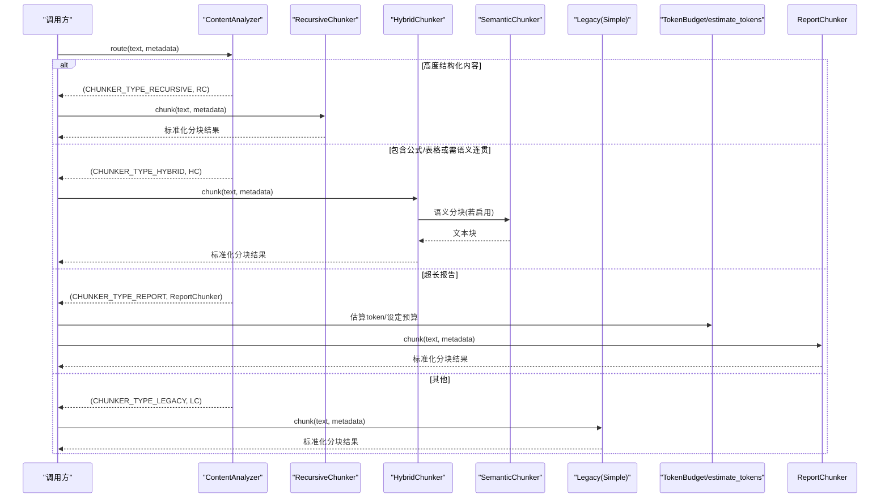
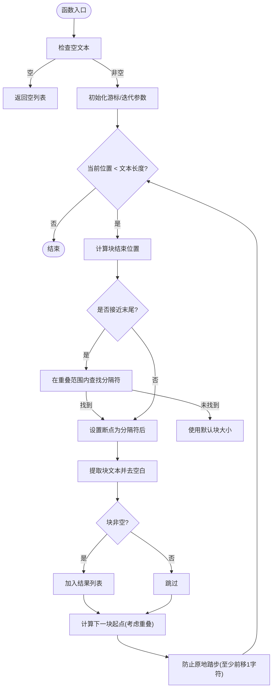
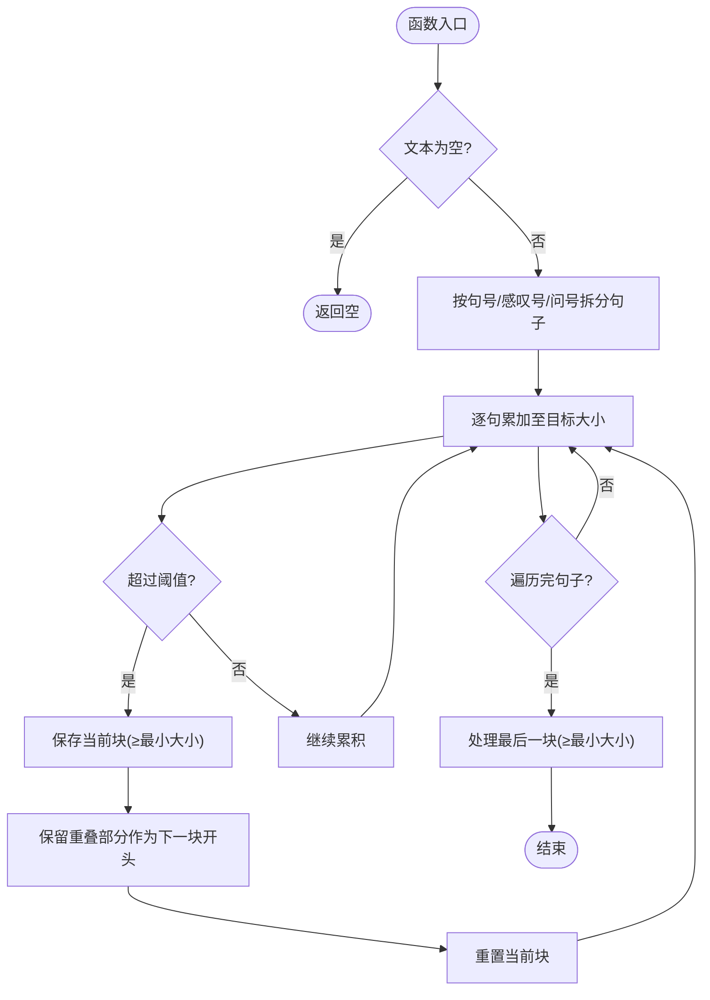
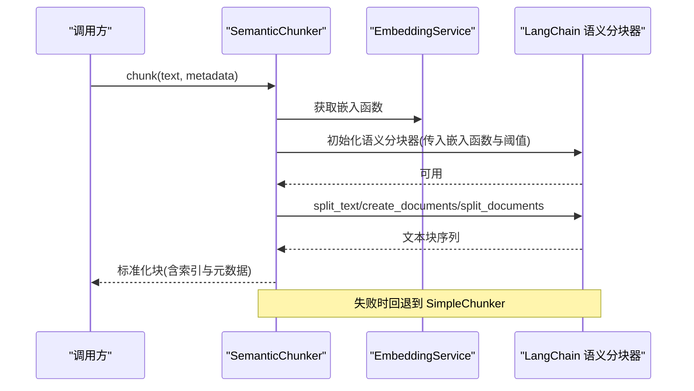
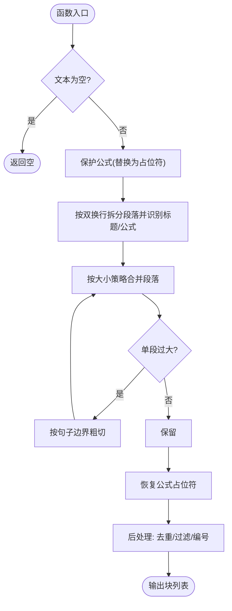
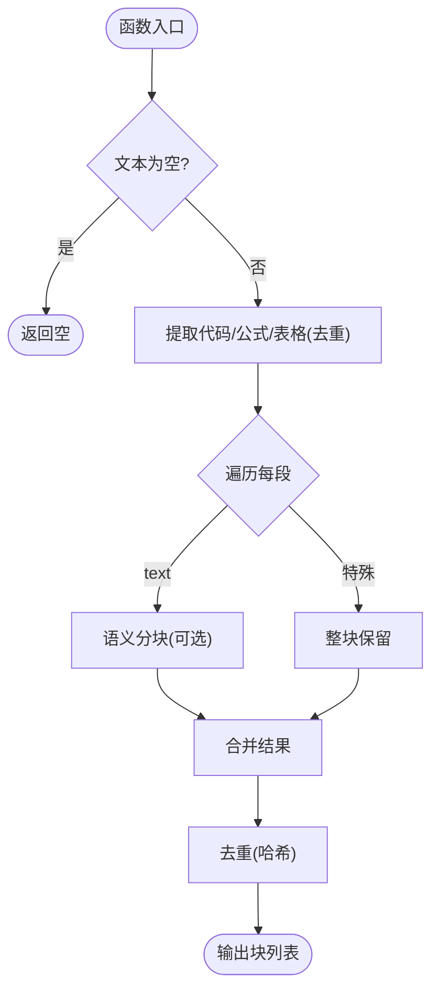
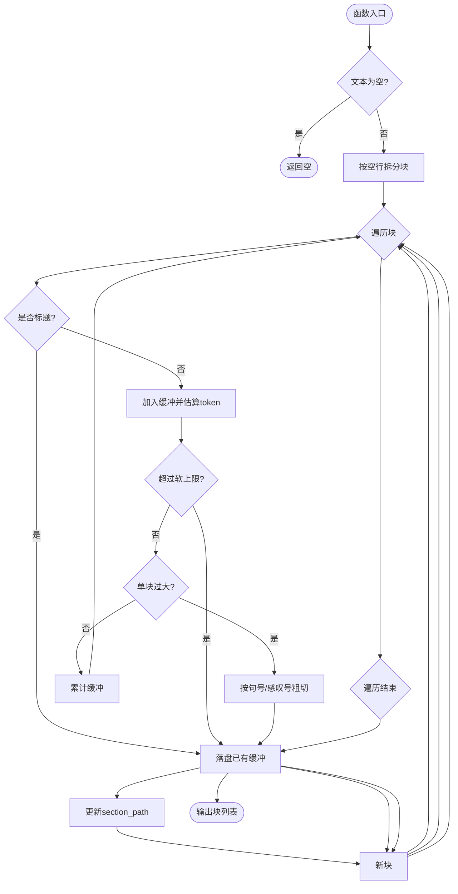
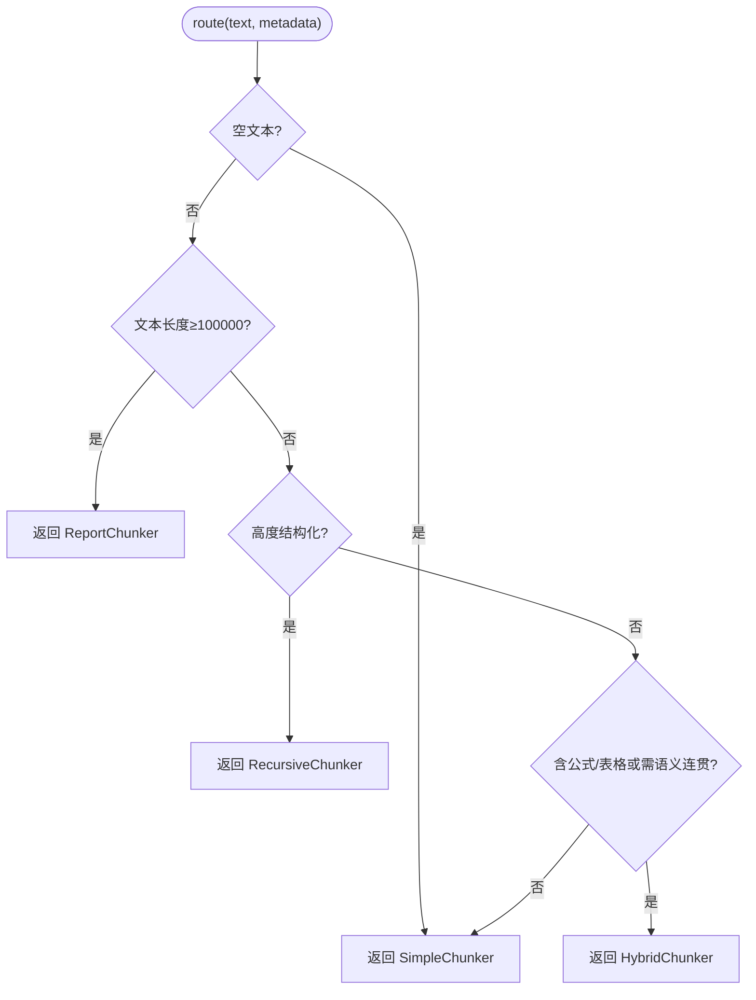
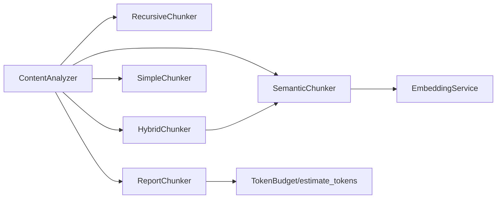

# 内容分块策略

<cite>
**本文引用的文件**
- [chunking/__init__.py](file://chunking/__init__.py)
- [chunking/base.py](file://chunking/base.py)
- [chunking/simple_chunker.py](file://chunking/simple_chunker.py)
- [chunking/sliding_window_chunker.py](file://chunking/sliding_window_chunker.py)
- [chunking/smart_chunker.py](file://chunking/smart_chunker.py)
- [chunking/hybrid_chunker.py](file://chunking/hybrid_chunker.py)
- [chunking/report_chunker.py](file://chunking/report_chunker.py)
- [chunking/langchain/recursive_chunker.py](file://chunking/langchain/recursive_chunker.py)
- [chunking/langchain/semantic_chunker.py](file://chunking/langchain/semantic_chunker.py)
- [chunking/router/content_analyzer.py](file://chunking/router/content_analyzer.py)
- [chunking/router/README.md](file://chunking/router/README.md)
- [chunking/README.md](file://chunking/README.md)
- [utils/token_utils.py](file://utils/token_utils.py)
- [eval/retrieval_eval.py](file://eval/retrieval_eval.py)
- [eval/evaluate.py](file://eval/evaluate.py)
</cite>

## 目录
1. [引言](#引言)
2. [项目结构](#项目结构)
3. [核心组件](#核心组件)
4. [架构总览](#架构总览)
5. [详细组件分析](#详细组件分析)
6. [依赖分析](#依赖分析)
7. [性能考量](#性能考量)
8. [故障排查指南](#故障排查指南)
9. [结论](#结论)
10. [附录](#附录)

## 引言
本文件系统化梳理 Advanced RAG 的内容分块策略，围绕以下目标展开：
- 解释各类分块算法的设计原理与适用场景：简单分块（固定长度）、滑动窗口分块（重叠处理）、语义分块（内容理解）、混合分块（规则+语义）、报告分块（专业文档处理）。
- 详述分块路由器工作机制：内容分析器如何识别文档类型、选择最优分块策略、参数调整与回退机制。
- 总结分块质量评估标准、重叠率优化、边界处理等关键技术。
- 提供策略选择指南与性能对比分析，辅助工程落地。

## 项目结构
分块模块采用“基础分块器 + 路由器 + LangChain 分块器”的分层设计，既保证无外部依赖的基础能力，又提供面向复杂场景的增强能力。

图表来源
- [chunking/__init__.py:1-34](file://chunking/__init__.py#L1-L34)
- [chunking/base.py:6-23](file://chunking/base.py#L6-L23)
- [chunking/simple_chunker.py:7-111](file://chunking/simple_chunker.py#L7-L111)
- [chunking/sliding_window_chunker.py:6-97](file://chunking/sliding_window_chunker.py#L6-L97)
- [chunking/smart_chunker.py:7-408](file://chunking/smart_chunker.py#L7-L408)
- [chunking/hybrid_chunker.py:9-179](file://chunking/hybrid_chunker.py#L9-L179)
- [chunking/report_chunker.py:42-143](file://chunking/report_chunker.py#L42-L143)
- [chunking/langchain/recursive_chunker.py:7-110](file://chunking/langchain/recursive_chunker.py#L7-L110)
- [chunking/langchain/semantic_chunker.py:8-139](file://chunking/langchain/semantic_chunker.py#L8-L139)
- [chunking/router/content_analyzer.py:12-300](file://chunking/router/content_analyzer.py#L12-L300)

章节来源
- [chunking/README.md:1-89](file://chunking/README.md#L1-L89)
- [chunking/__init__.py:1-34](file://chunking/__init__.py#L1-L34)

## 核心组件
- 抽象基类 BaseChunker：统一分块接口，约定 chunk(text, metadata) 返回标准结构。
- 基础分块器：
  - SimpleChunker：固定长度 + 分隔符优先，适合通用场景。
  - SlidingWindowChunker：按句子边界滑动合并，兼顾语义与重叠。
  - SmartChunker：保护公式/表格/标题完整性，适合含公式/表格的学术/技术文档。
  - HybridChunker：规则抽取特殊块 + 语义分块 + 去重，兼顾完整性与语义。
  - ReportChunker：面向长报告的结构优先 + Token 预算，保障段落/条款边界与 token 控制。
- LangChain 分块器：
  - RecursiveChunker：递归字符分割，适合高度结构化内容（代码、论文、带标记的文档）。
  - SemanticChunker：基于嵌入的语义断点分块，适合长文档的语义连贯性。
- 路由器 ContentAnalyzer：根据文档特征与元数据自动选择最优分块器，并提供参数初始化与回退。

章节来源
- [chunking/base.py:6-23](file://chunking/base.py#L6-L23)
- [chunking/simple_chunker.py:7-111](file://chunking/simple_chunker.py#L7-L111)
- [chunking/sliding_window_chunker.py:6-97](file://chunking/sliding_window_chunker.py#L6-L97)
- [chunking/smart_chunker.py:7-408](file://chunking/smart_chunker.py#L7-L408)
- [chunking/hybrid_chunker.py:9-179](file://chunking/hybrid_chunker.py#L9-L179)
- [chunking/report_chunker.py:42-143](file://chunking/report_chunker.py#L42-L143)
- [chunking/langchain/recursive_chunker.py:7-110](file://chunking/langchain/recursive_chunker.py#L7-L110)
- [chunking/langchain/semantic_chunker.py:8-139](file://chunking/langchain/semantic_chunker.py#L8-L139)
- [chunking/router/content_analyzer.py:12-300](file://chunking/router/content_analyzer.py#L12-L300)

## 架构总览
分块流程分为“内容分析 + 分块执行 + 结果标准化”。路由器负责策略选择与参数装配，各分块器负责具体切分逻辑。

图表来源
- [chunking/router/content_analyzer.py:253-298](file://chunking/router/content_analyzer.py#L253-L298)
- [chunking/langchain/recursive_chunker.py:69-110](file://chunking/langchain/recursive_chunker.py#L69-L110)
- [chunking/hybrid_chunker.py:52-121](file://chunking/hybrid_chunker.py#L52-L121)
- [chunking/langchain/semantic_chunker.py:81-139](file://chunking/langchain/semantic_chunker.py#L81-L139)
- [chunking/report_chunker.py:58-142](file://chunking/report_chunker.py#L58-L142)
- [chunking/simple_chunker.py:28-111](file://chunking/simple_chunker.py#L28-L111)
- [utils/token_utils.py:7-50](file://utils/token_utils.py#L7-L50)

## 详细组件分析

### 简单分块（固定长度）
- 设计要点
  - 固定 chunk_size，允许 chunk_overlap。
  - 优先在分隔符处断开，减少跨词截断。
  - 防卡死机制：迭代上限与强制前移，避免极端文本导致死循环。
- 适用场景
  - 短文档、简单文本、对语义要求不高。
- 关键参数
  - chunk_size、chunk_overlap、separators。
- 输出规范
  - 每个块包含 text、start_index、end_index、metadata。

图表来源
- [chunking/simple_chunker.py:28-111](file://chunking/simple_chunker.py#L28-L111)

章节来源
- [chunking/simple_chunker.py:7-111](file://chunking/simple_chunker.py#L7-L111)

### 滑动窗口分块（重叠处理）
- 设计要点
  - 先按句子切分，再按 chunk_size 累加合并。
  - 保留重叠部分作为下一块的开头，确保上下文连续。
  - 最小块大小过滤，避免过小噪声块。
- 适用场景
  - 需要语义连贯但又希望保留上下文重叠的文档。
- 关键参数
  - chunk_size、chunk_overlap、min_chunk_size。
- 输出规范
  - 每个块包含 text、metadata。

图表来源
- [chunking/sliding_window_chunker.py:27-97](file://chunking/sliding_window_chunker.py#L27-L97)

章节来源
- [chunking/sliding_window_chunker.py:6-97](file://chunking/sliding_window_chunker.py#L6-L97)

### 语义分块（内容理解）
- 设计要点
  - 基于嵌入相似度的语义断点检测，保持语义单元完整性。
  - 兼容多个 LangChain 版本的 API，失败时回退到简单分块。
- 适用场景
  - 长文档（报告、论文、文章），强调语义连贯性。
- 关键参数
  - chunk_size、chunk_overlap、breakpoint_threshold_amount。
- 输出规范
  - 每个块包含 text、chunk_index、metadata。

图表来源
- [chunking/langchain/semantic_chunker.py:81-139](file://chunking/langchain/semantic_chunker.py#L81-L139)

章节来源
- [chunking/langchain/semantic_chunker.py:8-139](file://chunking/langchain/semantic_chunker.py#L8-L139)

### 智能分块（公式/表格/标题保护）
- 设计要点
  - 识别并保护数学公式完整性，恢复时还原。
  - 按段落边界合并，尊重标题、公式、表格等结构。
  - 大段落按句子边界粗切，避免单块过大。
- 适用场景
  - 含公式/表格/标题的学术/技术文档。
- 关键参数
  - chunk_size、chunk_overlap、min_chunk_size、max_chunk_size。
- 输出规范
  - 每个块包含 text、chunk_index、metadata。

图表来源
- [chunking/smart_chunker.py:67-408](file://chunking/smart_chunker.py#L67-L408)

章节来源
- [chunking/smart_chunker.py:7-408](file://chunking/smart_chunker.py#L7-L408)

### 混合分块（规则+语义）
- 设计要点
  - 先用正则提取代码块、公式、表格，保持完整性。
  - 普通文本使用语义分块（可选），并进行去重。
  - 细粒度元数据（content_type）便于后续检索/路由。
- 适用场景
  - 技术文档（代码/公式/表格混排）+ 长文本语义连贯需求。
- 关键参数
  - chunk_size、chunk_overlap、semantic_threshold。
- 输出规范
  - 每个块包含 text、metadata（含 content_type）。

图表来源
- [chunking/hybrid_chunker.py:52-179](file://chunking/hybrid_chunker.py#L52-L179)

章节来源
- [chunking/hybrid_chunker.py:9-179](file://chunking/hybrid_chunker.py#L9-L179)

### 报告分块（专业文档处理）
- 设计要点
  - 以段落/条款边界优先，维护 section_path（标题层级路径）。
  - 基于 TokenBudget 估算 token 数，软/硬上限控制块大小。
  - 单块过大时按句子粗切，兼顾可读性与检索效率。
- 适用场景
  - 长行业报告、政策文件、合同等结构化长文本。
- 关键参数
  - TokenBudget(chunk_tokens, overlap_tokens, max_chunk_tokens)、min_chunk_tokens。
- 输出规范
  - 每个块包含 text、chunk_index、metadata（含 section_path、token_count、chunker_type、content_type）。

图表来源
- [chunking/report_chunker.py:58-143](file://chunking/report_chunker.py#L58-L143)
- [utils/token_utils.py:7-50](file://utils/token_utils.py#L7-L50)

章节来源
- [chunking/report_chunker.py:42-143](file://chunking/report_chunker.py#L42-L143)
- [utils/token_utils.py:1-50](file://utils/token_utils.py#L1-L50)

### 分块路由器（ContentAnalyzer）
- 路由策略（优先级）
  1) 超长报告（≥10万字符）→ ReportChunker（结构 + token 预算）
  2) 高度结构化内容（代码/LaTeX/结构化标记）→ RecursiveChunker
  3) 包含公式/表格或需语义连贯 → HybridChunker（替代语义分块）
  4) 其他 → SimpleChunker（通用）
- 内容检测方法
  - 文件类型（metadata.file_type）、代码块数量、LaTeX 公式数量、段落数/句子数/平均段落长度、章节标记等。
- 参数与回退
  - 按策略延迟初始化各分块器，设置默认 chunk_size/chunk_overlap/min/max 等。
  - 语义分块器初始化失败时回退到 SimpleChunker。
- 输出
  - (分块器类型标识, 分块器实例)，随后调用 chunk(text, metadata)。

图表来源
- [chunking/router/content_analyzer.py:253-298](file://chunking/router/content_analyzer.py#L253-L298)

章节来源
- [chunking/router/content_analyzer.py:12-300](file://chunking/router/content_analyzer.py#L12-L300)
- [chunking/router/README.md:1-137](file://chunking/router/README.md#L1-L137)

## 依赖分析
- 模块内聚与耦合
  - 基础分块器彼此独立，仅依赖抽象基类与通用工具。
  - 路由器依赖各分块器实现，形成“策略工厂”角色。
  - LangChain 分块器对外部库有依赖，初始化失败时提供回退。
- 外部依赖
  - LangChain 生态（text splitter、semantic chunker）。
  - 嵌入服务（用于语义分块）。
  - Token 估算工具（用于报告分块预算）。

图表来源
- [chunking/router/content_analyzer.py:32-79](file://chunking/router/content_analyzer.py#L32-L79)
- [chunking/langchain/semantic_chunker.py:31-78](file://chunking/langchain/semantic_chunker.py#L31-L78)
- [chunking/report_chunker.py:50-57](file://chunking/report_chunker.py#L50-L57)
- [utils/token_utils.py:7-50](file://utils/token_utils.py#L7-L50)

章节来源
- [chunking/router/content_analyzer.py:12-300](file://chunking/router/content_analyzer.py#L12-L300)
- [chunking/langchain/semantic_chunker.py:8-139](file://chunking/langchain/semantic_chunker.py#L8-L139)
- [chunking/report_chunker.py:42-143](file://chunking/report_chunker.py#L42-L143)
- [utils/token_utils.py:1-50](file://utils/token_utils.py#L1-L50)

## 性能考量
- 语义分块成本较高：需计算嵌入向量，适合长文档；短文档收益有限。
- 滑动窗口分块在句子边界上做合并，时间复杂度与句子数线性相关。
- 智能/混合分块涉及正则匹配与多次扫描，注意大文本的内存与时间消耗。
- 报告分块通过 TokenBudget 控制块大小，避免检索/嵌入侧超限。
- 建议
  - 优先使用路由器自动选择策略。
  - 在高并发场景下，对短文档直接走简单分块，长文档再考虑语义/混合。
  - 对超长报告，预估 token 并设置合理的 chunk_tokens/overlap_tokens。

## 故障排查指南
- 语义分块器初始化失败
  - 现象：抛出 ImportError 或初始化异常。
  - 处理：记录错误并回退到 SimpleChunker；确认 LangChain 安装与版本兼容。
- 递归分块器失败
  - 现象：分割异常或回退为单块。
  - 处理：检查分隔符列表与文本编码；必要时降低 chunk_size。
- 混合分块重复块
  - 现象：出现重复块。
  - 处理：检查去重哈希逻辑；确认输入文本一致性。
- 报告分块 token 估算偏差
  - 现象：块过大/过小。
  - 处理：调整 TokenBudget；对中英混排场景适当下调 chunk_tokens。

章节来源
- [chunking/langchain/semantic_chunker.py:76-139](file://chunking/langchain/semantic_chunker.py#L76-L139)
- [chunking/langchain/recursive_chunker.py:60-110](file://chunking/langchain/recursive_chunker.py#L60-L110)
- [chunking/hybrid_chunker.py:113-121](file://chunking/hybrid_chunker.py#L113-L121)
- [chunking/report_chunker.py:108-135](file://chunking/report_chunker.py#L108-L135)

## 结论
Advanced RAG 的分块体系以“路由器 + 多策略分块器”为核心，结合元数据与内容特征，实现从通用到专业的全场景覆盖。建议在工程实践中：
- 默认使用 ContentAnalyzer 自动路由；
- 针对长报告采用 ReportChunker；
- 技术文档优先 HybridChunker；
- 一般文本使用 SimpleChunker；
- 严格控制重叠率与块大小，结合 Token 预算与评估指标持续优化。

## 附录

### 分块策略选择指南
- 高度结构化内容（代码/论文/带标记文档）→ 递归分块器
- 含公式/表格/标题的学术/技术文档 → 智能/混合分块器
- 长文档（报告/论文/文章）→ 语义/混合/报告分块器
- 短文档/简单文本 → 简单分块器
- 超长报告 → 报告分块器（结构 + token 预算）

章节来源
- [chunking/router/README.md:7-75](file://chunking/router/README.md#L7-L75)
- [chunking/router/content_analyzer.py:253-298](file://chunking/router/content_analyzer.py#L253-L298)

### 分块质量评估与重叠率优化
- 评估指标
  - 检索召回/精度（基于 gold document/chunk indices）。
  - 人工评估：语义完整性、边界合理性、重复/遗漏比例。
- 重叠率优化
  - 语义/混合/报告分块：chunk_overlap ∈ [10%~30%] 的 chunk_size。
  - 简单/滑窗：重叠 ≥ 10–20%，避免跨句丢失上下文。
- 边界处理
  - 优先分隔符断开；公式/表格/标题整块保留；段落/条款边界优先。
- 性能对比（概念性说明）
  - 语义分块：准确性高但耗时；适合长文档。
  - 混合分块：兼顾完整性与语义，适合技术文档。
  - 报告分块：结构与预算控制强，适合超长报告。
  - 简单/滑窗：速度最快，适合短文档与实时场景。

章节来源
- [eval/retrieval_eval.py:15-74](file://eval/retrieval_eval.py#L15-L74)
- [eval/evaluate.py:19-91](file://eval/evaluate.py#L19-L91)
- [chunking/report_chunker.py:50-57](file://chunking/report_chunker.py#L50-L57)