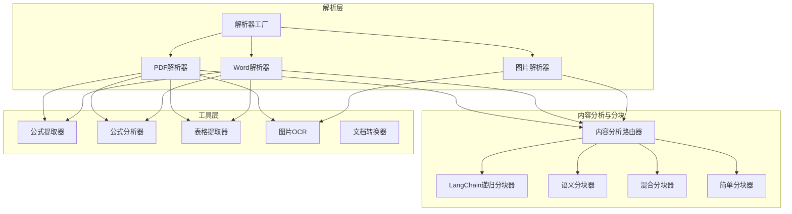
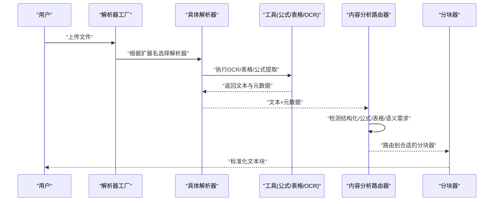
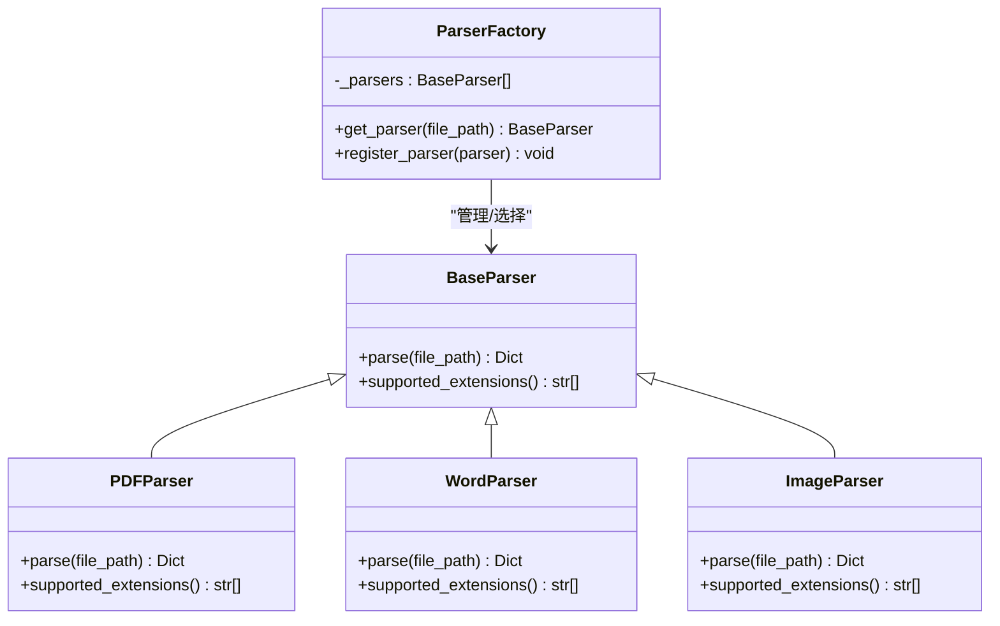
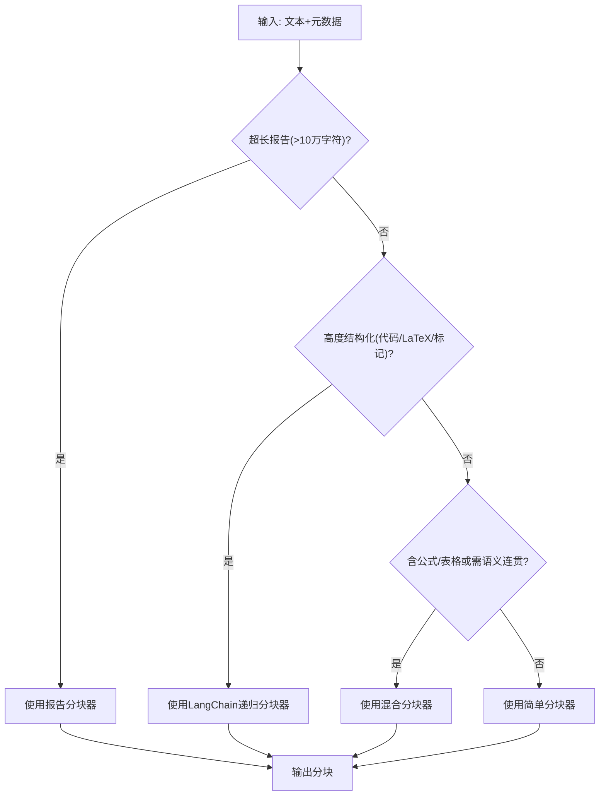
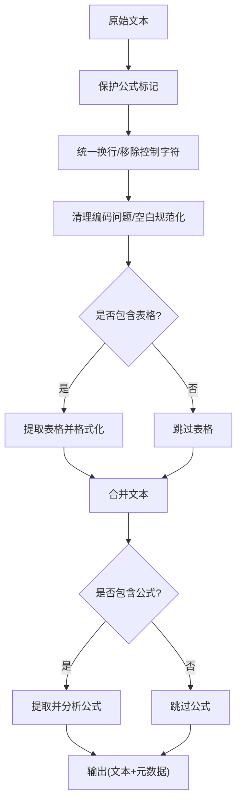
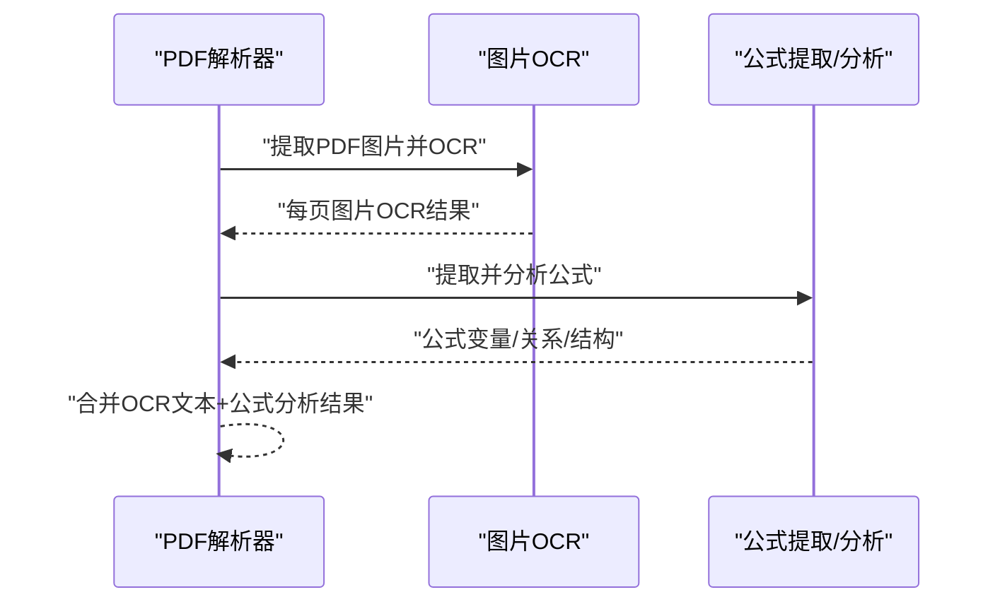
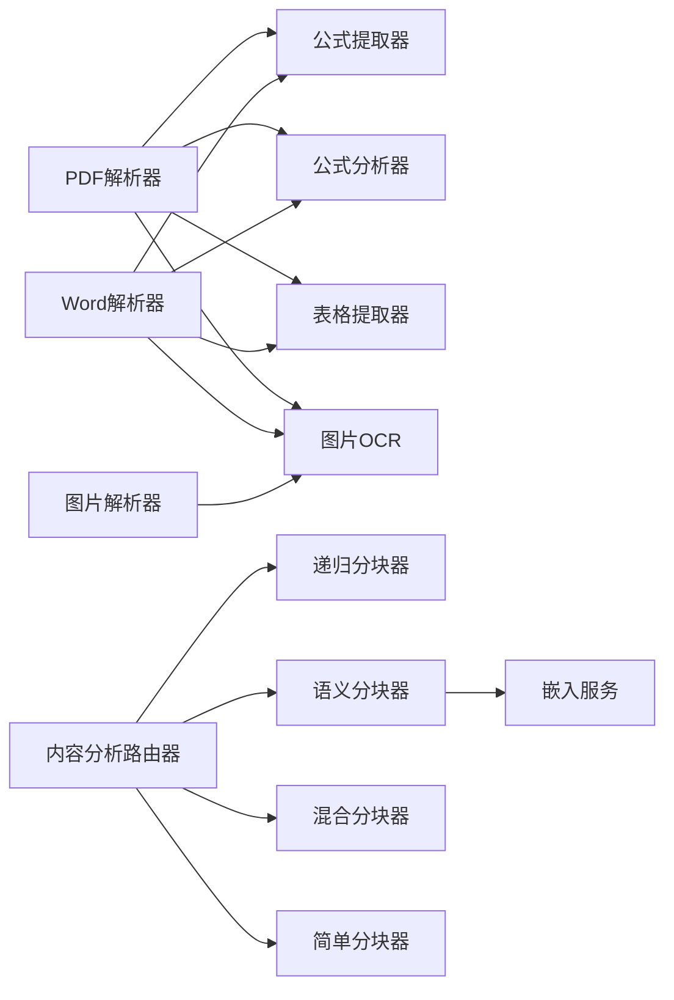

# 文档处理管道

<cite>
**本文引用的文件**
- [parser_factory.py](file://parsers/parser_factory.py)
- [pdf_parser.py](file://parsers/pdf_parser.py)
- [word_parser.py](file://parsers/word_parser.py)
- [image_parser.py](file://parsers/image_parser.py)
- [base.py](file://parsers/base.py)
- [content_analyzer.py](file://chunking/router/content_analyzer.py)
- [simple_chunker.py](file://chunking/simple_chunker.py)
- [hybrid_chunker.py](file://chunking/hybrid_chunker.py)
- [semantic_chunker.py](file://chunking/langchain/semantic_chunker.py)
- [recursive_chunker.py](file://chunking/langchain/recursive_chunker.py)
- [base.py](file://chunking/base.py)
- [formula_extractor.py](file://utils/formula_extractor.py)
- [formula_analyzer.py](file://utils/formula_analyzer.py)
- [table_extractor.py](file://utils/table_extractor.py)
- [image_ocr.py](file://utils/image_ocr.py)
- [document_converter.py](file://utils/document_converter.py)
</cite>

## 目录
1. [简介](#简介)
2. [项目结构](#项目结构)
3. [核心组件](#核心组件)
4. [架构总览](#架构总览)
5. [详细组件分析](#详细组件分析)
6. [依赖分析](#依赖分析)
7. [性能考量](#性能考量)
8. [故障排查指南](#故障排查指南)
9. [结论](#结论)
10. [附录](#附录)

## 简介
本技术文档面向 Advanced RAG 文档处理管道，系统性阐述从“文档上传”到“知识库构建”的完整流程。重点覆盖：
- 解析器系统设计：工厂模式、多格式支持（PDF、Word、图片等）、解析策略选择
- 分块策略实现：简单分块、滑动窗口分块、语义分块、混合分块、报告专用分块
- 内容分析器：文本预处理、格式识别、结构提取
- 公式分析与 OCR 处理：公式识别、图像处理、文本提取
- 文档转换工具使用与性能优化建议

## 项目结构
该仓库采用按职责分层的组织方式：
- parsers：文档解析器家族，统一抽象与工厂注册
- chunking：分块器家族，含路由分析器与多种分块策略
- utils：通用工具（公式、表格、OCR、转换）
- embedding：嵌入服务（语义分块依赖）
- routers、services、agents 等：上层业务编排（与本文主题相关）

图表来源
- [parser_factory.py:19-57](file://parsers/parser_factory.py#L19-L57)
- [pdf_parser.py:103-221](file://parsers/pdf_parser.py#L103-L221)
- [word_parser.py:131-401](file://parsers/word_parser.py#L131-L401)
- [image_parser.py:13-61](file://parsers/image_parser.py#L13-L61)
- [content_analyzer.py:253-299](file://chunking/router/content_analyzer.py#L253-L299)
- [semantic_chunker.py:81-139](file://chunking/langchain/semantic_chunker.py#L81-L139)
- [recursive_chunker.py:69-110](file://chunking/langchain/recursive_chunker.py#L69-L110)
- [hybrid_chunker.py:52-122](file://chunking/hybrid_chunker.py#L52-L122)
- [simple_chunker.py:28-111](file://chunking/simple_chunker.py#L28-L111)
- [formula_extractor.py:29-58](file://utils/formula_extractor.py#L29-L58)
- [formula_analyzer.py:33-78](file://utils/formula_analyzer.py#L33-L78)
- [table_extractor.py:11-32](file://utils/table_extractor.py#L11-L32)
- [image_ocr.py:38-123](file://utils/image_ocr.py#L38-L123)
- [document_converter.py:15-40](file://utils/document_converter.py#L15-L40)

章节来源
- [parser_factory.py:19-57](file://parsers/parser_factory.py#L19-L57)
- [content_analyzer.py:253-299](file://chunking/router/content_analyzer.py#L253-L299)

## 核心组件
- 解析器工厂与多格式解析：根据文件扩展名选择合适解析器，支持 PDF、Word、图片等；可动态注册新解析器
- 内容分析路由器：基于文档特征（结构化程度、公式/表格、语义连贯性、长度）智能路由到不同分块器
- 分块器家族：简单分块、LangChain 递归分块、语义分块、混合分块、报告专用分块
- 公式与表格工具：公式提取与分析、表格结构识别与格式化
- OCR 与文档转换：图片 OCR、PDF 图片 OCR、.doc → .docx 转换

章节来源
- [parser_factory.py:32-57](file://parsers/parser_factory.py#L32-L57)
- [pdf_parser.py:103-221](file://parsers/pdf_parser.py#L103-L221)
- [word_parser.py:131-401](file://parsers/word_parser.py#L131-L401)
- [image_parser.py:13-61](file://parsers/image_parser.py#L13-L61)
- [content_analyzer.py:12-31](file://chunking/router/content_analyzer.py#L12-L31)
- [simple_chunker.py:7-27](file://chunking/simple_chunker.py#L7-L27)
- [hybrid_chunker.py:9-42](file://chunking/hybrid_chunker.py#L9-L42)
- [semantic_chunker.py:8-29](file://chunking/langchain/semantic_chunker.py#L8-L29)
- [recursive_chunker.py:7-38](file://chunking/langchain/recursive_chunker.py#L7-L38)
- [formula_extractor.py:6-27](file://utils/formula_extractor.py#L6-L27)
- [formula_analyzer.py:8-31](file://utils/formula_analyzer.py#L8-L31)
- [table_extractor.py:7-10](file://utils/table_extractor.py#L7-L10)
- [image_ocr.py:7-37](file://utils/image_ocr.py#L7-L37)
- [document_converter.py:11-28](file://utils/document_converter.py#L11-L28)

## 架构总览
整体处理链路如下：
- 用户上传文档 → 解析器工厂选择解析器 → 解析器执行解析（含 OCR、表格、公式）→ 生成文本与元数据
- 内容分析路由器根据元数据与文本特征选择分块策略 → 分块器输出标准化块
- 块进入嵌入与索引阶段（由上层服务负责）

图表来源
- [parser_factory.py:38-51](file://parsers/parser_factory.py#L38-L51)
- [pdf_parser.py:103-221](file://parsers/pdf_parser.py#L103-L221)
- [word_parser.py:131-401](file://parsers/word_parser.py#L131-L401)
- [image_parser.py:13-61](file://parsers/image_parser.py#L13-L61)
- [content_analyzer.py:253-299](file://chunking/router/content_analyzer.py#L253-L299)
- [hybrid_chunker.py:52-122](file://chunking/hybrid_chunker.py#L52-L122)
- [semantic_chunker.py:81-139](file://chunking/langchain/semantic_chunker.py#L81-L139)
- [recursive_chunker.py:69-110](file://chunking/langchain/recursive_chunker.py#L69-L110)
- [simple_chunker.py:28-111](file://chunking/simple_chunker.py#L28-L111)

## 详细组件分析

### 解析器系统与工厂模式
- 抽象基类：定义统一接口与能力边界
- 工厂类：集中管理解析器集合，按文件扩展名匹配
- 具体解析器：
  - PDF：文本提取、OCR、表格、公式分析
  - Word：.docx/.doc 解析，表格、公式、内嵌图片 OCR
  - 图片：OCR 提取文字，支持运行时开关

图表来源
- [base.py:6-23](file://parsers/base.py#L6-L23)
- [parser_factory.py:32-57](file://parsers/parser_factory.py#L32-L57)
- [pdf_parser.py:12-221](file://parsers/pdf_parser.py#L12-L221)
- [word_parser.py:18-401](file://parsers/word_parser.py#L18-L401)
- [image_parser.py:10-61](file://parsers/image_parser.py#L10-L61)

章节来源
- [base.py:6-23](file://parsers/base.py#L6-L23)
- [parser_factory.py:19-57](file://parsers/parser_factory.py#L19-L57)
- [pdf_parser.py:103-221](file://parsers/pdf_parser.py#L103-L221)
- [word_parser.py:131-401](file://parsers/word_parser.py#L131-L401)
- [image_parser.py:13-61](file://parsers/image_parser.py#L13-L61)

### 内容分析路由器与分块策略
- 路由策略（优先级）：
  1) 超长报告（>10万字符）→ 报告专用分块器
  2) 高度结构化内容（代码、论文、大量 LaTeX/结构化标记）→ LangChain 递归分块器
  3) 包含公式/表格或需语义连贯性 → 混合分块器（规则+语义）
  4) 其他 → 简单分块器
- 分块器特性：
  - 简单分块：固定大小+分隔符优先，滑动窗口思想
  - 递归分块：LangChain 递归字符分割，适合结构化文本
  - 语义分块：基于嵌入相似度的断点检测，保持语义连贯
  - 混合分块：抽取代码块/公式/表格等特殊块，其余文本语义分块，去重并标注内容类型

图表来源
- [content_analyzer.py:253-299](file://chunking/router/content_analyzer.py#L253-L299)
- [semantic_chunker.py:81-139](file://chunking/langchain/semantic_chunker.py#L81-L139)
- [recursive_chunker.py:69-110](file://chunking/langchain/recursive_chunker.py#L69-L110)
- [hybrid_chunker.py:52-122](file://chunking/hybrid_chunker.py#L52-L122)
- [simple_chunker.py:28-111](file://chunking/simple_chunker.py#L28-L111)

章节来源
- [content_analyzer.py:81-299](file://chunking/router/content_analyzer.py#L81-L299)
- [simple_chunker.py:7-111](file://chunking/simple_chunker.py#L7-L111)
- [hybrid_chunker.py:9-179](file://chunking/hybrid_chunker.py#L9-L179)
- [semantic_chunker.py:8-139](file://chunking/langchain/semantic_chunker.py#L8-L139)
- [recursive_chunker.py:7-110](file://chunking/langchain/recursive_chunker.py#L7-L110)

### 文本预处理与格式识别
- PDF/Word 解析前均进行公式保护与清洗，保留数学符号与公式标记，规范化空白字符
- Word 解析额外处理嵌入对象标记、二进制残留、编码问题
- 表格识别：Markdown 表格与管道分隔表格两种模式，支持 HTML/Markdown 输出与语义结构分析
- 公式提取：支持块级与行内公式，规范化为标准 LaTeX；公式分析：变量、关系、函数、结构复杂度

图表来源
- [pdf_parser.py:19-101](file://parsers/pdf_parser.py#L19-L101)
- [word_parser.py:21-130](file://parsers/word_parser.py#L21-L130)
- [table_extractor.py:11-32](file://utils/table_extractor.py#L11-L32)
- [formula_extractor.py:29-58](file://utils/formula_extractor.py#L29-L58)
- [formula_analyzer.py:33-78](file://utils/formula_analyzer.py#L33-L78)

章节来源
- [pdf_parser.py:19-101](file://parsers/pdf_parser.py#L19-L101)
- [word_parser.py:21-130](file://parsers/word_parser.py#L21-L130)
- [table_extractor.py:34-133](file://utils/table_extractor.py#L34-L133)
- [formula_extractor.py:29-105](file://utils/formula_extractor.py#L29-L105)
- [formula_analyzer.py:80-160](file://utils/formula_analyzer.py#L80-L160)

### 公式分析与OCR处理
- 公式提取：识别块级与行内公式，避免重叠匹配，按位置排序
- 公式分析：变量提取、关系识别、函数识别、结构分析（方程、分数、根号、积分、求和/乘、矩阵等），复杂度分级
- OCR：
  - 图片 OCR：延迟初始化 PaddleOCR，支持中文/英文，返回文本、置信度、文字框
  - PDF 图片 OCR：提取 PDF 中图片，逐页 OCR，汇总文本与统计

图表来源
- [pdf_parser.py:137-204](file://parsers/pdf_parser.py#L137-L204)
- [image_ocr.py:124-219](file://utils/image_ocr.py#L124-L219)
- [formula_extractor.py:29-58](file://utils/formula_extractor.py#L29-L58)
- [formula_analyzer.py:33-78](file://utils/formula_analyzer.py#L33-L78)

章节来源
- [formula_extractor.py:6-149](file://utils/formula_extractor.py#L6-L149)
- [formula_analyzer.py:8-233](file://utils/formula_analyzer.py#L8-L233)
- [image_ocr.py:7-224](file://utils/image_ocr.py#L7-L224)
- [pdf_parser.py:137-204](file://parsers/pdf_parser.py#L137-L204)

### 文档转换工具
- .doc → .docx：优先使用 LibreOffice 命令行工具，自动探测路径，支持 Windows/Linux/macOS 常见安装路径，超时与异常处理完善
- 异常提示：若 LibreOffice 不可用，抛出明确异常，指导安装与环境变量配置

章节来源
- [document_converter.py:14-163](file://utils/document_converter.py#L14-L163)

## 依赖分析
- 解析器依赖：
  - PDF/Word/图片解析器依赖工具模块（公式、表格、OCR）
  - 解析器工厂集中注册与选择
- 分块器依赖：
  - 语义分块依赖嵌入服务与 LangChain 文本分割器
  - 混合分块依赖语义分块器与正则抽取特殊块
- 内容分析器：
  - 延迟初始化各分块器实例，按特征检测选择最优策略

图表来源
- [pdf_parser.py:103-221](file://parsers/pdf_parser.py#L103-L221)
- [word_parser.py:131-401](file://parsers/word_parser.py#L131-L401)
- [image_parser.py:13-61](file://parsers/image_parser.py#L13-L61)
- [content_analyzer.py:253-299](file://chunking/router/content_analyzer.py#L253-L299)
- [semantic_chunker.py:31-78](file://chunking/langchain/semantic_chunker.py#L31-L78)
- [recursive_chunker.py:40-67](file://chunking/langchain/recursive_chunker.py#L40-L67)
- [hybrid_chunker.py:37-42](file://chunking/hybrid_chunker.py#L37-L42)
- [simple_chunker.py:28-111](file://chunking/simple_chunker.py#L28-L111)
- [formula_extractor.py:29-58](file://utils/formula_extractor.py#L29-L58)
- [formula_analyzer.py:33-78](file://utils/formula_analyzer.py#L33-L78)
- [table_extractor.py:11-32](file://utils/table_extractor.py#L11-L32)
- [image_ocr.py:38-123](file://utils/image_ocr.py#L38-L123)

章节来源
- [parser_factory.py:19-57](file://parsers/parser_factory.py#L19-L57)
- [content_analyzer.py:23-80](file://chunking/router/content_analyzer.py#L23-L80)
- [semantic_chunker.py:31-78](file://chunking/langchain/semantic_chunker.py#L31-L78)

## 性能考量
- 解析阶段
  - PDF/Word 的 OCR、表格、公式分析均为可选增强功能，可通过运行时配置开关降低开销
  - 图片 OCR 延迟初始化，仅在首次使用时加载模型
- 分块阶段
  - 简单分块：线性扫描，时间复杂度近似 O(n)，适合大规模通用文本
  - 递归分块：LangChain 实现，分隔符优先，适合结构化文本
  - 语义分块：依赖嵌入向量计算，成本较高，建议对长文档启用
  - 混合分块：抽取特殊块 + 语义分块，兼顾完整性与连贯性
- 工具阶段
  - 公式/表格提取使用正则与结构化解析，复杂度与文本规模线性相关
  - OCR 性能受图片分辨率与语言模型影响，建议批量处理与缓存结果

[本节为通用性能讨论，无需列出章节来源]

## 故障排查指南
- LibreOffice 转换失败
  - 现象：.doc 文件无法转换为 .docx
  - 排查：确认 soffice 可执行文件存在与可执行权限，或设置 LIBREOFFICE_PATH 环境变量
  - 参考：[document_converter.py:34-39](file://utils/document_converter.py#L34-L39)
- OCR 未初始化或失败
  - 现象：图片/PDF 图片 OCR 返回空文本或错误
  - 排查：确认 PaddleOCR 已安装；检查图片路径与权限；查看日志中初始化失败原因
  - 参考：[image_ocr.py:31-37](file://utils/image_ocr.py#L31-L37), [image_ocr.py:115-122](file://utils/image_ocr.py#L115-L122)
- 语义分块器不可用
  - 现象：报错提示未安装 LangChain
  - 排查：安装 langchain 与 langchain-experimental；或降级使用递归分块
  - 参考：[semantic_chunker.py:72-77](file://chunking/langchain/semantic_chunker.py#L72-L77)
- Word .doc 解析失败
  - 现象：antiword/LibreOffice 均不可用导致解析失败
  - 排查：安装 antiword 或 LibreOffice；或直接上传 .docx
  - 参考：[word_parser.py:370-377](file://parsers/word_parser.py#L370-L377)
- PDF 无文本
  - 现象：提示扫描版 PDF 未提取到文本
  - 排查：确认 PDF 是否为扫描版；启用 OCR；检查 PDF 中是否有可提取文本
  - 参考：[pdf_parser.py:174-176](file://parsers/pdf_parser.py#L174-L176)

章节来源
- [document_converter.py:34-39](file://utils/document_converter.py#L34-L39)
- [image_ocr.py:31-37](file://utils/image_ocr.py#L31-L37)
- [image_ocr.py:115-122](file://utils/image_ocr.py#L115-L122)
- [semantic_chunker.py:72-77](file://chunking/langchain/semantic_chunker.py#L72-L77)
- [word_parser.py:370-377](file://parsers/word_parser.py#L370-L377)
- [pdf_parser.py:174-176](file://parsers/pdf_parser.py#L174-L176)

## 结论
本管道以“解析器工厂 + 内容分析路由器 + 多策略分块器”为核心，结合公式、表格、OCR 等增强能力，形成高鲁棒、可扩展的文档处理流水线。通过运行时配置与延迟初始化，兼顾性能与易用性；通过多策略分块，平衡完整性与语义连贯性，适用于多样化的知识库构建场景。

[本节为总结性内容，无需列出章节来源]

## 附录
- 使用建议
  - 大量扫描版 PDF：开启 OCR；对长文档优先使用语义/混合分块
  - 含大量公式/表格：启用混合分块；必要时增加分块重叠
  - Word .doc：优先转换为 .docx；若不可用再启用系统工具链
- 性能优化
  - 批量处理：合并小文件、减少 IO 次数
  - 缓存：对相同内容的 OCR/公式/表格结果进行缓存
  - 资源：GPU 加速嵌入与 OCR（如可用），合理设置 chunk_size 与 overlap

[本节为通用建议，无需列出章节来源]