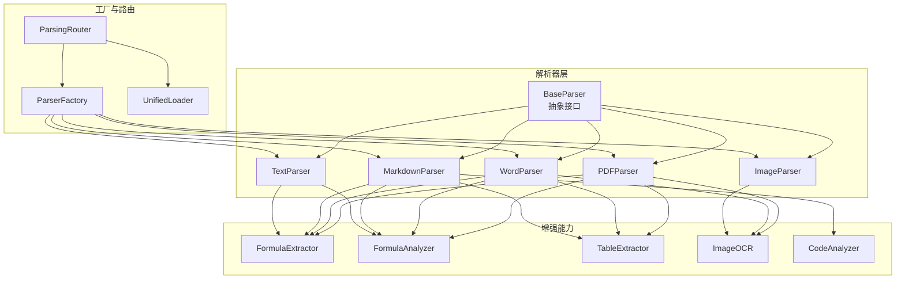
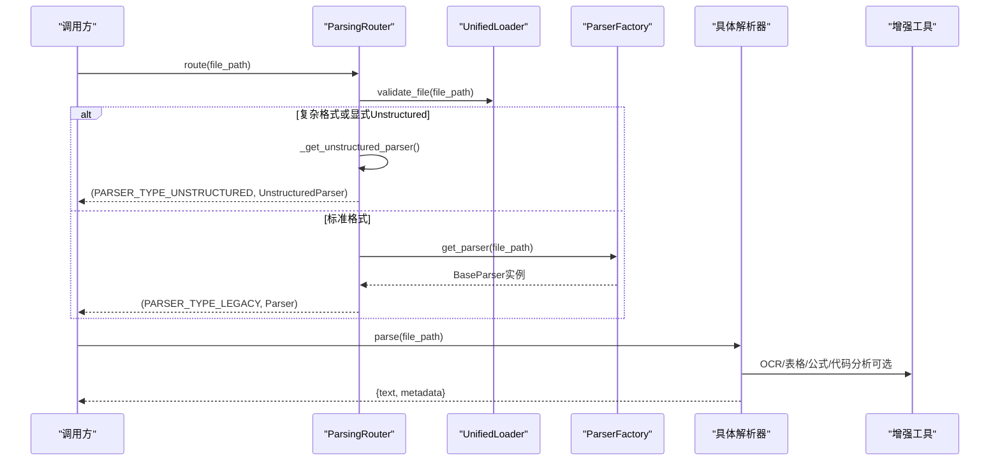
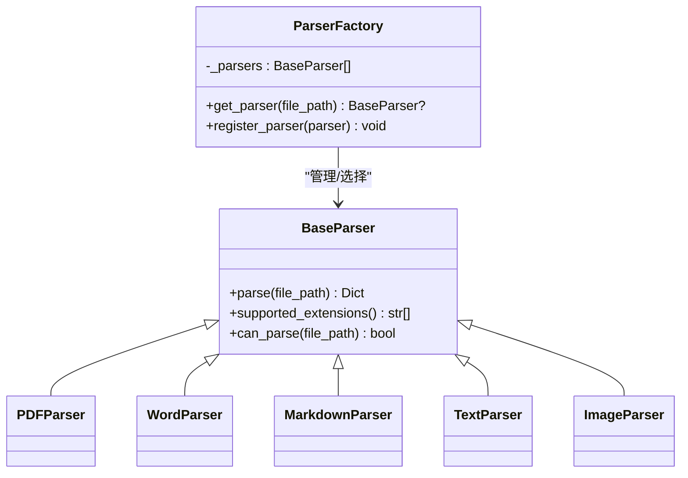
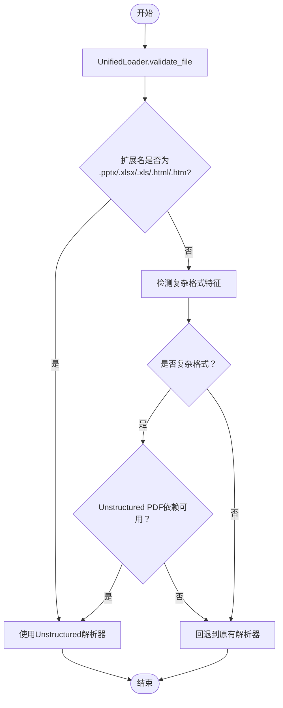
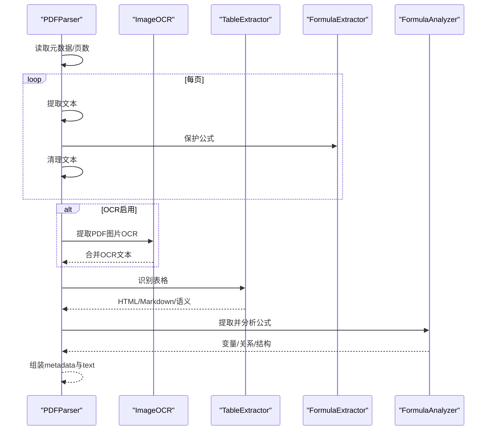
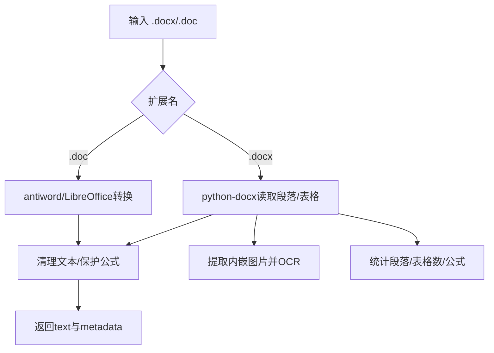
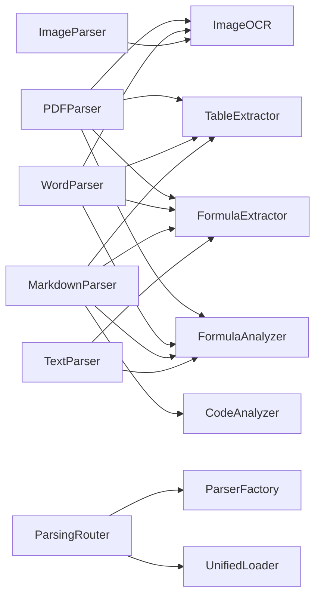

# 文档解析系统

<cite>
**本文引用的文件**
- [parsers/parser_factory.py](file://parsers/parser_factory.py)
- [parsers/base.py](file://parsers/base.py)
- [parsers/pdf_parser.py](file://parsers/pdf_parser.py)
- [parsers/word_parser.py](file://parsers/word_parser.py)
- [parsers/markdown_parser.py](file://parsers/markdown_parser.py)
- [parsers/text_parser.py](file://parsers/text_parser.py)
- [parsers/image_parser.py](file://parsers/image_parser.py)
- [parsers/router/parsing_router.py](file://parsers/router/parsing_router.py)
- [parsers/utils/unified_loader.py](file://parsers/utils/unified_loader.py)
- [utils/formula_extractor.py](file://utils/formula_extractor.py)
- [utils/table_extractor.py](file://utils/table_extractor.py)
- [utils/image_ocr.py](file://utils/image_ocr.py)
- [utils/code_analyzer.py](file://utils/code_analyzer.py)
- [utils/formula_analyzer.py](file://utils/formula_analyzer.py)
- [parsers/__init__.py](file://parsers/__init__.py)
- [parsers/README.md](file://parsers/README.md)
</cite>

## 目录
1. [简介](#简介)
2. [项目结构](#项目结构)
3. [核心组件](#核心组件)
4. [架构总览](#架构总览)
5. [详细组件分析](#详细组件分析)
6. [依赖分析](#依赖分析)
7. [性能考虑](#性能考虑)
8. [故障排查指南](#故障排查指南)
9. [结论](#结论)
10. [附录](#附录)

## 简介
本文件面向Advanced RAG文档解析系统，聚焦“解析器工厂模式”的设计与实现，系统性阐述解析器注册机制、文件类型识别、解析器选择策略，以及各类解析器（PDF、Word、Markdown、文本、图片）的实现特点与增强能力（OCR、表格提取、公式分析、代码分析）。同时提供接口设计、错误处理、性能优化策略、扩展开发指南与最佳实践，帮助开发者在不改变上层调用的前提下，安全地扩展新解析器。

## 项目结构
解析器子系统位于 parsers 目录，采用“工厂 + 路由 + 工具 + 增强能力”的分层组织：
- 基础解析器：PDF、Word、Markdown、文本、图片
- 工厂：解析器注册与按扩展名选择
- 路由：基于文档特征（扫描版PDF、大文件、复杂表格/图片）智能分发到合适解析器
- 工具：统一加载器、结果合成器（导出入口）
- 增强能力：公式提取/分析、表格提取、图片OCR、代码分析

图表来源
- [parsers/base.py:6-32](file://parsers/base.py#L6-L32)
- [parsers/parser_factory.py:19-58](file://parsers/parser_factory.py#L19-L58)
- [parsers/router/parsing_router.py:10-273](file://parsers/router/parsing_router.py#L10-L273)
- [parsers/utils/unified_loader.py:7-60](file://parsers/utils/unified_loader.py#L7-L60)
- [utils/formula_extractor.py:6-149](file://utils/formula_extractor.py#L6-L149)
- [utils/formula_analyzer.py:8-233](file://utils/formula_analyzer.py#L8-L233)
- [utils/table_extractor.py:7-290](file://utils/table_extractor.py#L7-L290)
- [utils/image_ocr.py:7-224](file://utils/image_ocr.py#L7-L224)
- [utils/code_analyzer.py:7-350](file://utils/code_analyzer.py#L7-L350)

章节来源
- [parsers/README.md:1-142](file://parsers/README.md#L1-L142)
- [parsers/__init__.py:1-38](file://parsers/__init__.py#L1-L38)

## 核心组件
- 抽象接口 BaseParser：定义 parse(file_path) 与 supported_extensions()，并提供默认的 can_parse(file_path) 实现（基于扩展名）。
- ParserFactory：集中管理解析器集合，提供 get_parser(file_path) 与 register_parser(parser)。内部按扩展名构建解析器列表，支持动态注册。
- ParsingRouter：根据文档特征（扫描版PDF、大文件、复杂表格/图片）智能选择解析器；对特定扩展名（如 .pptx/.xlsx/.xls/.html/.htm）显式路由至 Unstructured 解析器；否则回退到 ParserFactory。
- UnifiedLoader：校验文件存在性与大小，提供基础文件信息。
- 增强能力工具：FormulaExtractor/FormulaAnalyzer、TableExtractor、ImageOCR、CodeAnalyzer。

章节来源
- [parsers/base.py:6-32](file://parsers/base.py#L6-L32)
- [parsers/parser_factory.py:19-58](file://parsers/parser_factory.py#L19-L58)
- [parsers/router/parsing_router.py:10-273](file://parsers/router/parsing_router.py#L10-L273)
- [parsers/utils/unified_loader.py:7-60](file://parsers/utils/unified_loader.py#L7-L60)

## 架构总览
解析流程分为两条主线：
- 直接解析：通过 ParserFactory 按扩展名选择具体解析器，执行 parse 返回文本与元数据。
- 智能路由：通过 ParsingRouter 先做特征检测，再决定使用原有解析器还是 Unstructured 解析器，最后统一合成结果。

图表来源
- [parsers/router/parsing_router.py:221-273](file://parsers/router/parsing_router.py#L221-L273)
- [parsers/parser_factory.py:37-57](file://parsers/parser_factory.py#L37-L57)
- [parsers/utils/unified_loader.py:43-59](file://parsers/utils/unified_loader.py#L43-L59)

## 详细组件分析

### 工厂模式与注册机制
- 工厂初始化时构建解析器列表，包含 PDF、文本、Markdown、Word、图片解析器；若可用则加入 Unstructured 解析器；最后加入 ImageParser。
- get_parser(file_path) 遍历解析器，使用 can_parse（默认按扩展名判断）选择第一个匹配者。
- register_parser(parser) 动态追加自定义解析器，实现扩展。

图表来源
- [parsers/base.py:6-32](file://parsers/base.py#L6-L32)
- [parsers/parser_factory.py:19-58](file://parsers/parser_factory.py#L19-L58)

章节来源
- [parsers/parser_factory.py:19-58](file://parsers/parser_factory.py#L19-L58)

### 文件类型识别与选择策略
- 扩展名识别：BaseParser.can_parse 默认基于扩展名；各解析器通过 supported_extensions 返回支持的扩展名集合。
- 路由策略：ParsingRouter.route 综合以下特征：
  - 显式路由：.pptx/.xlsx/.xls/.html/.htm 直接走 Unstructured。
  - 复杂格式：扫描版PDF（文本稀少）、大文件（>2MB）、Word多表格/多图片、PDF无文本等 → 优先 Unstructured。
  - 否则使用 ParserFactory 选择标准解析器。

图表来源
- [parsers/router/parsing_router.py:221-273](file://parsers/router/parsing_router.py#L221-L273)
- [parsers/utils/unified_loader.py:43-59](file://parsers/utils/unified_loader.py#L43-L59)

章节来源
- [parsers/router/parsing_router.py:44-191](file://parsers/router/parsing_router.py#L44-L191)

### PDF解析器（文本版/扫描版）
- 文本版：使用 PyPDF2 逐页提取文本，清理控制字符、公式保护、统一换行，统计提取页数。
- 扫描版增强：通过 ImageOCR 从PDF图片提取文字，合并到全文；记录图片数量与OCR文本长度。
- 表格提取：基于 TableExtractor 从全文中识别Markdown/管道分隔表格，生成HTML/Markdown与语义结构。
- 公式分析：使用 FormulaExtractor 保护公式，FormulaAnalyzer 提取变量、关系、结构与复杂度。

图表来源
- [parsers/pdf_parser.py:103-217](file://parsers/pdf_parser.py#L103-L217)
- [utils/image_ocr.py:124-219](file://utils/image_ocr.py#L124-L219)
- [utils/table_extractor.py:10-32](file://utils/table_extractor.py#L10-L32)
- [utils/formula_extractor.py:107-131](file://utils/formula_extractor.py#L107-L131)
- [utils/formula_analyzer.py:212-232](file://utils/formula_analyzer.py#L212-L232)

章节来源
- [parsers/pdf_parser.py:103-217](file://parsers/pdf_parser.py#L103-L217)

### Word解析器（.docx/.doc）
- .docx：使用 python-docx 读取段落与表格，清理嵌入对象标记与控制序列，保留公式；可提取内嵌图片并OCR；统计段落数与表格数；提取公式。
- .doc：尝试 antiword/LibreOffice 转换为文本；超时/不可用时报错提示安装工具或转换为 .docx。

图表来源
- [parsers/word_parser.py:131-396](file://parsers/word_parser.py#L131-L396)

章节来源
- [parsers/word_parser.py:131-396](file://parsers/word_parser.py#L131-L396)

### Markdown解析器
- 使用 markdown 库渲染为HTML，再去除标签得到纯文本；统计章节数量。
- 增强：识别表格（Markdown/管道），提取代码块并分析语言、函数、类、导入、变量、关键字，估算复杂度；提取并分析公式。

章节来源
- [parsers/markdown_parser.py:14-104](file://parsers/markdown_parser.py#L14-L104)
- [utils/code_analyzer.py:258-291](file://utils/code_analyzer.py#L258-L291)
- [utils/formula_analyzer.py:212-232](file://utils/formula_analyzer.py#L212-L232)

### 文本解析器
- 使用 chardet 自动检测编码，忽略解码错误读取文本，统计行数与编码信息。

章节来源
- [parsers/text_parser.py:10-32](file://parsers/text_parser.py#L10-L32)

### 图片解析器（OCR）
- 基于 ImageOCR 提取图片文字，支持运行时开关；返回文本、置信度、行数、可选错误与文字框；支持对扫描版PDF中的图片进行OCR。

章节来源
- [parsers/image_parser.py:13-57](file://parsers/image_parser.py#L13-L57)
- [utils/image_ocr.py:38-123](file://utils/image_ocr.py#L38-L123)

### 增强能力工具
- 公式提取/分析：FormulaExtractor 保护公式，FormulaAnalyzer 提取变量、关系、结构与复杂度。
- 表格提取：TableExtractor 识别Markdown/管道表格，生成HTML/Markdown并提取语义结构。
- 图片OCR：ImageOCR 延迟初始化，支持图片与PDF图片OCR。
- 代码分析：CodeAnalyzer 检测语言、提取函数/类/导入/变量/关键字，估算复杂度。

章节来源
- [utils/formula_extractor.py:28-131](file://utils/formula_extractor.py#L28-L131)
- [utils/formula_analyzer.py:32-232](file://utils/formula_analyzer.py#L32-L232)
- [utils/table_extractor.py:10-289](file://utils/table_extractor.py#L10-L289)
- [utils/image_ocr.py:15-123](file://utils/image_ocr.py#L15-L123)
- [utils/code_analyzer.py:18-350](file://utils/code_analyzer.py#L18-L350)

## 依赖分析
- 组件耦合
  - 解析器均依赖 BaseParser 接口，保证统一行为。
  - ParserFactory 与各解析器松耦合，通过扩展名选择。
  - ParsingRouter 依赖 ParserFactory 与 UnifiedLoader，可选依赖 Unstructured 解析器。
  - 各解析器可选依赖增强工具（OCR、表格、公式、代码分析）。
- 外部依赖
  - PDF：PyPDF2（文本提取）、PyMuPDF（图片提取）、PaddleOCR（OCR）
  - Word：python-docx（.docx）、antiword/LibreOffice（.doc）
  - Markdown：markdown 库
  - 工具：chardet（编码检测）、re（正则）

图表来源
- [parsers/pdf_parser.py:103-217](file://parsers/pdf_parser.py#L103-L217)
- [parsers/word_parser.py:131-396](file://parsers/word_parser.py#L131-L396)
- [parsers/markdown_parser.py:14-104](file://parsers/markdown_parser.py#L14-L104)
- [parsers/text_parser.py:10-32](file://parsers/text_parser.py#L10-L32)
- [parsers/image_parser.py:13-57](file://parsers/image_parser.py#L13-L57)
- [parsers/router/parsing_router.py:221-273](file://parsers/router/parsing_router.py#L221-L273)

## 性能考虑
- 延迟初始化与可选功能
  - ImageOCR 延迟初始化，避免不必要的GPU/CPU占用。
  - 各解析器通过运行时配置开关控制 OCR、表格、公式等增强功能，降低小文件处理开销。
- I/O与内存
  - PDF/Word/Markdown/文本解析均为流式读取，避免一次性加载大文件。
  - 表格/公式/代码分析仅在启用时执行，减少CPU消耗。
- 路由优化
  - 大文件（>2MB）优先 Unstructured，避免原有解析器在复杂文档上的重复扫描。
  - 扫描版PDF提前检测文本密度，避免无效OCR调用。

[本节为通用性能建议，不直接分析具体文件]

## 故障排查指南
- 扩展名不匹配
  - 现象：get_parser 返回 None
  - 处理：确认文件扩展名在对应解析器的 supported_extensions 中，或通过 register_parser 注册自定义解析器。
- OCR不可用
  - 现象：ImageParser 返回 error 或空文本
  - 处理：检查 PaddleOCR 安装与初始化；确认运行时配置允许 OCR；检查图片路径存在性。
- PDF扫描版无文本
  - 现象：提示“未提取到任何文本”
  - 处理：确认 OCR 开启；检查 PDF 是否包含可识别图片；查看 metadata 中 image_ocr 信息。
- Word .doc 转换失败
  - 现象：抛出异常，提示安装 antiword 或 LibreOffice
  - 处理：安装相应系统工具或将 .doc 转换为 .docx。
- Unstructured 依赖缺失
  - 现象：路由到 Unstructured 但报缺少 PDF 依赖
  - 处理：安装 unstructured[pdf]；或回退到原有解析器。

章节来源
- [parsers/parser_factory.py:37-57](file://parsers/parser_factory.py#L37-L57)
- [parsers/image_parser.py:17-33](file://parsers/image_parser.py#L17-L33)
- [parsers/pdf_parser.py:174-176](file://parsers/pdf_parser.py#L174-L176)
- [parsers/word_parser.py:370-377](file://parsers/word_parser.py#L370-L377)
- [parsers/router/parsing_router.py:253-256](file://parsers/router/parsing_router.py#L253-L256)

## 结论
本解析系统通过“工厂 + 路由 + 工具”的分层设计，实现了对多格式文档的统一接入与智能分发。工厂模式保证了解析器的可插拔与可扩展；路由策略结合特征检测与依赖可用性，最大化提升解析质量与稳定性；增强能力模块化封装，既可按需启用，又不影响基础解析流程。整体架构清晰、扩展友好，适合在RAG流水线中稳定运行。

[本节为总结性内容，不直接分析具体文件]

## 附录

### 解析器接口设计要点
- 必须实现 parse(file_path) 与 supported_extensions()，返回统一结构：{"text": "...", "metadata": {...}}。
- 可覆盖 can_parse(file_path) 以支持更复杂的识别逻辑（如内容指纹）。
- metadata 建议包含：格式、页数/段落数、提取方法、增强能力结果（表格/公式/代码/图片OCR）。

章节来源
- [parsers/base.py:9-31](file://parsers/base.py#L9-L31)

### 错误处理机制
- 统一捕获解析过程中的异常并抛出明确错误信息。
- 对可选依赖（如 OCR、Unstructured）进行降级处理，保证主流程可用。
- 日志记录关键步骤与失败原因，便于定位问题。

章节来源
- [parsers/pdf_parser.py:215-217](file://parsers/pdf_parser.py#L215-L217)
- [parsers/word_parser.py:370-377](file://parsers/word_parser.py#L370-L377)
- [utils/image_ocr.py:31-37](file://utils/image_ocr.py#L31-L37)

### 性能优化策略清单
- 延迟初始化第三方引擎（OCR）。
- 运行时开关控制增强功能（OCR/表格/公式）。
- 路由阶段快速判定复杂文档，避免无效解析。
- 流式读取与最小化中间数据结构。

[本节为通用优化建议，不直接分析具体文件]

### 扩展开发指南与最佳实践
- 新增解析器步骤
  - 继承 BaseParser，实现 parse 与 supported_extensions。
  - 在工厂初始化处注册（或通过 register_parser 动态注册）。
  - 若涉及外部依赖，提供降级方案与运行时开关。
- 最佳实践
  - 保持 parse 输出结构一致，便于上层统一处理。
  - 在 metadata 中记录增强能力结果，避免污染正文。
  - 对大文件与复杂文档，优先考虑 Unstructured；对简单文档，优先原有解析器。
  - 严格处理异常与日志，提供可诊断信息。

章节来源
- [parsers/parser_factory.py:54-57](file://parsers/parser_factory.py#L54-L57)
- [parsers/router/parsing_router.py:250-271](file://parsers/router/parsing_router.py#L250-L271)
- [parsers/README.md:124-142](file://parsers/README.md#L124-L142)