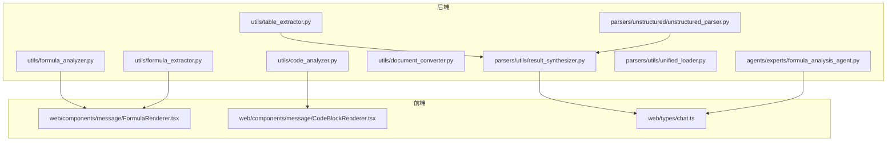
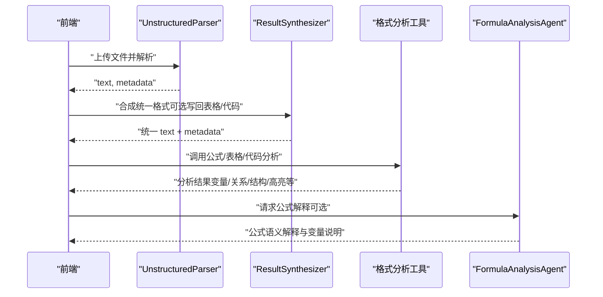
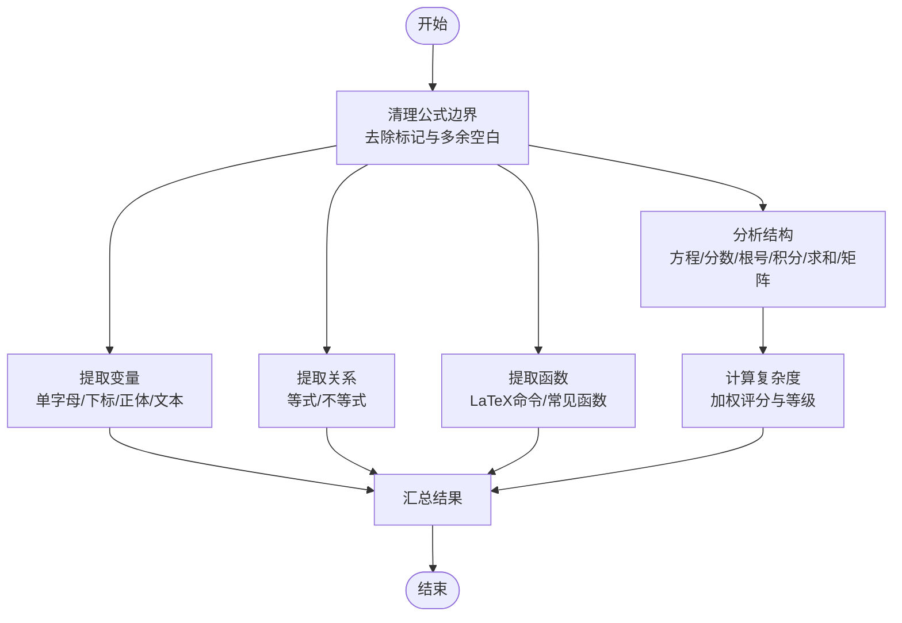
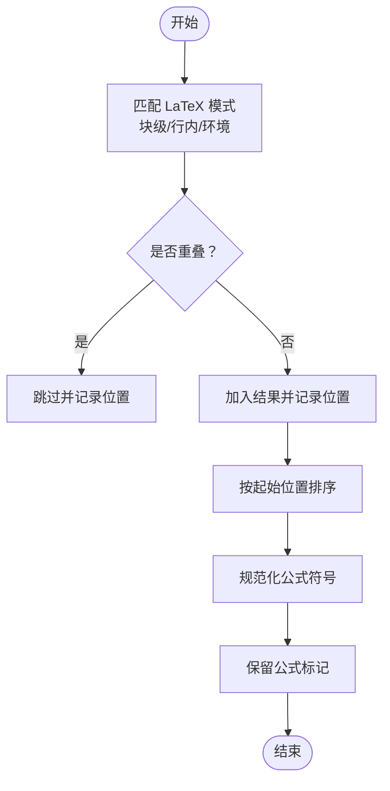
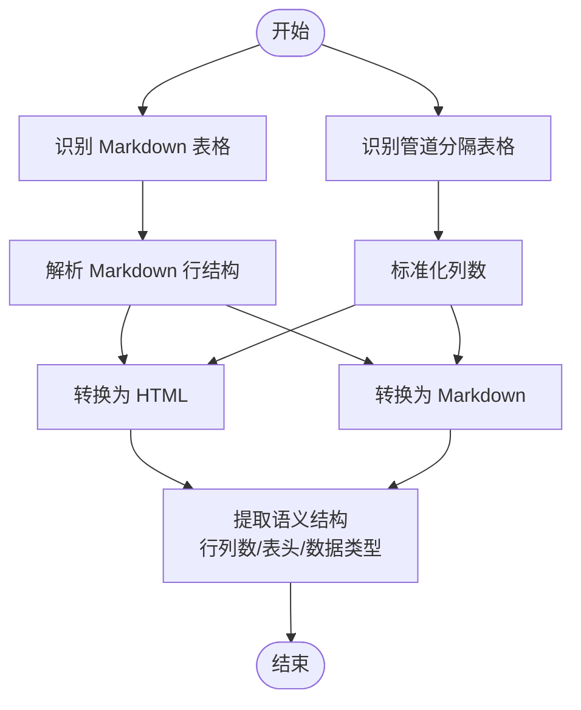
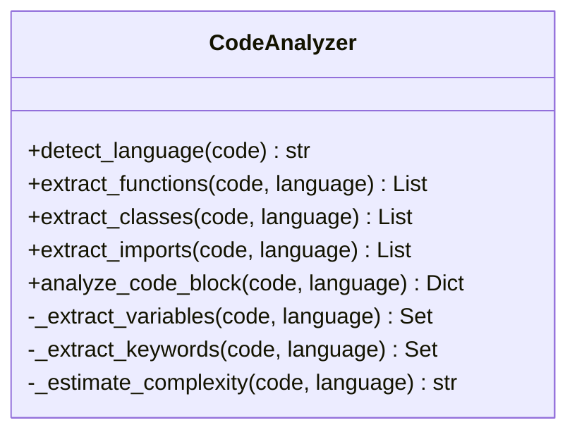
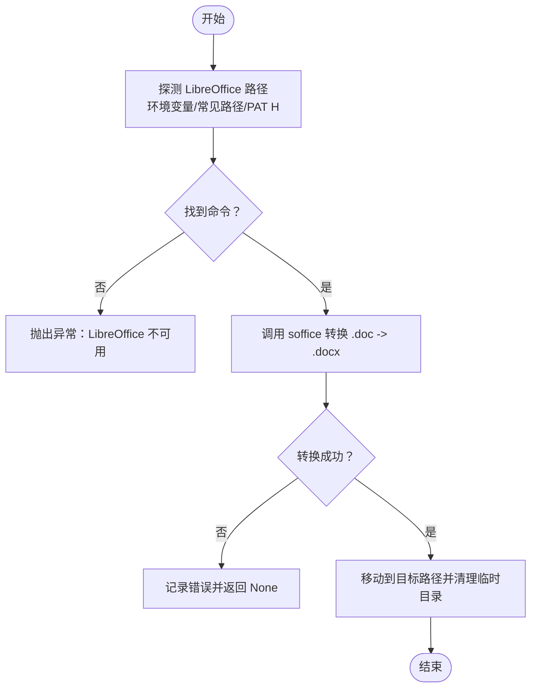
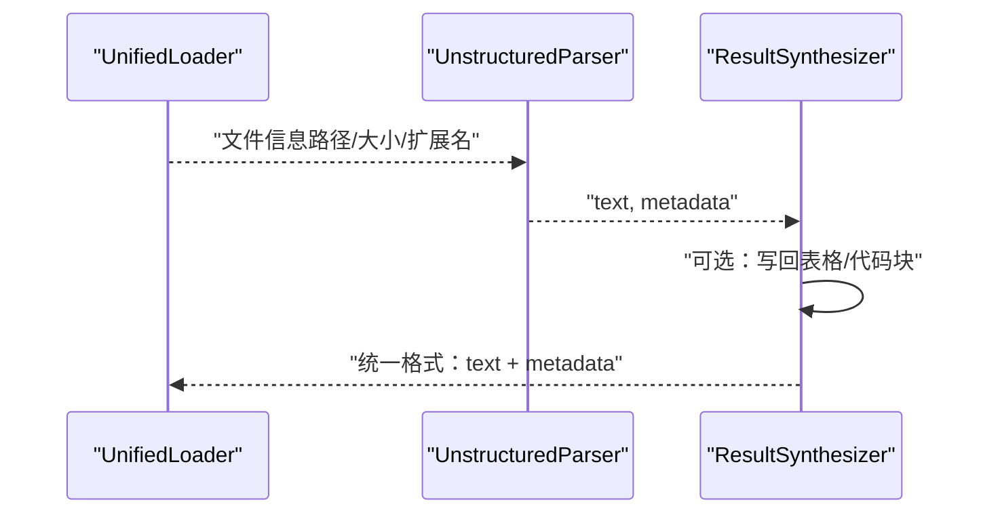
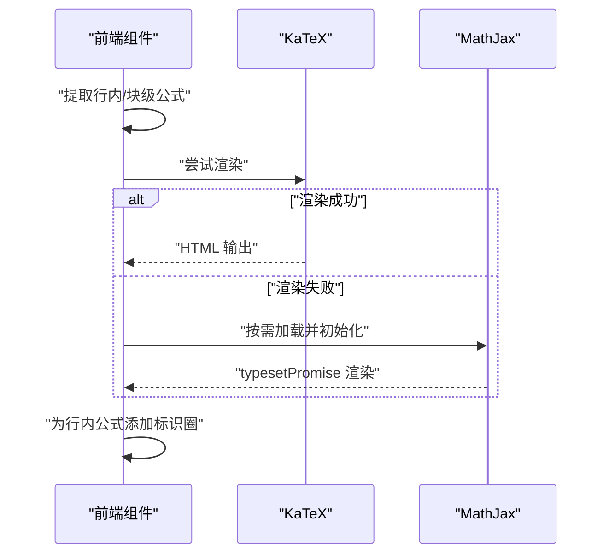
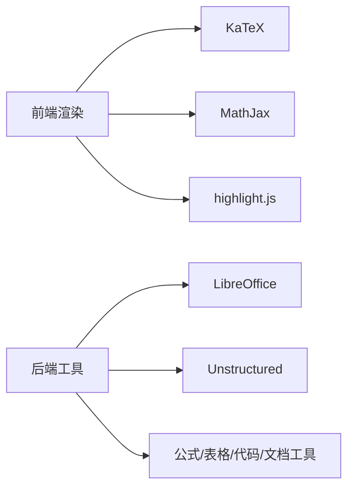

# 格式分析工具

<cite>
**本文引用的文件**
- [README.md](file://README.md)
- [formula_analyzer.py](file://utils/formula_analyzer.py)
- [formula_extractor.py](file://utils/formula_extractor.py)
- [table_extractor.py](file://utils/table_extractor.py)
- [code_analyzer.py](file://utils/code_analyzer.py)
- [document_converter.py](file://utils/document_converter.py)
- [FormulaAnalysisAgent.py](file://agents/experts/formula_analysis_agent.py)
- [unstructured_parser.py](file://parsers/unstructured/unstructured_parser.py)
- [result_synthesizer.py](file://parsers/utils/result_synthesizer.py)
- [unified_loader.py](file://parsers/utils/unified_loader.py)
- [FormulaRenderer.tsx](file://web/components/message/FormulaRenderer.tsx)
- [CodeBlockRenderer.tsx](file://web/components/message/CodeBlockRenderer.tsx)
- [chat.ts](file://web/types/chat.ts)
</cite>

## 目录
1. [简介](#简介)
2. [项目结构](#项目结构)
3. [核心组件](#核心组件)
4. [架构总览](#架构总览)
5. [详细组件分析](#详细组件分析)
6. [依赖分析](#依赖分析)
7. [性能考虑](#性能考虑)
8. [故障排查指南](#故障排查指南)
9. [结论](#结论)
10. [附录](#附录)

## 简介
本文件面向 Advanced RAG 格式分析工具，围绕四大核心能力展开：公式分析器（LaTeX 公式识别、数学符号提取、公式渲染处理）、表格提取工具（结构识别、单元格合并、格式转换）、代码分析器（多语言支持、代码块识别、语法高亮）、文档转换工具（格式兼容性、元数据提取、格式标准化）。文档提供从底层实现到前端渲染的全链路说明，并给出使用示例与扩展开发指南。

## 项目结构
本项目采用后端（FastAPI）+ 前端（Next.js）的分层架构，格式分析工具主要位于后端 utils 与 parsers 子模块，前端负责公式与代码块的渲染与交互。

**图表来源**
- [formula_analyzer.py:1-233](file://utils/formula_analyzer.py#L1-L233)
- [formula_extractor.py:1-149](file://utils/formula_extractor.py#L1-L149)
- [table_extractor.py:1-290](file://utils/table_extractor.py#L1-L290)
- [code_analyzer.py:1-350](file://utils/code_analyzer.py#L1-L350)
- [document_converter.py:1-163](file://utils/document_converter.py#L1-L163)
- [unstructured_parser.py:1-115](file://parsers/unstructured/unstructured_parser.py#L1-L115)
- [result_synthesizer.py:1-134](file://parsers/utils/result_synthesizer.py#L1-L134)
- [unified_loader.py:1-60](file://parsers/utils/unified_loader.py#L1-L60)
- [FormulaRenderer.tsx:1-612](file://web/components/message/FormulaRenderer.tsx#L1-L612)
- [CodeBlockRenderer.tsx:1-119](file://web/components/message/CodeBlockRenderer.tsx#L1-L119)
- [chat.ts:1-99](file://web/types/chat.ts#L1-L99)

**章节来源**
- [README.md:1-290](file://README.md#L1-L290)

## 核心组件
- 公式分析器：从文本中提取 LaTeX 公式，识别变量、关系、函数与结构，计算复杂度，支持从整段文本批量分析。
- 公式提取器：识别块级/行内 LaTeX 公式与物理量定义，规范化公式格式，保留公式在后续处理中不被误删。
- 表格提取器：识别 Markdown 表格与管道分隔表格，解析结构、转 HTML/Mardown，推断数据类型与数值列。
- 代码分析器：多语言（Python/JS/Java/C++）代码块识别，提取函数、类、导入、变量与关键字，估算复杂度。
- 文档转换器：将 .doc 转换为 .docx（依赖 LibreOffice），提供环境探测与错误提示。
- 解析器与合成器：使用 Unstructured 进行复杂格式文档布局解析，统一输出格式并可将表格/代码块写回正文。
- 前端渲染：公式优先使用 KaTeX 渲染，不支持时回退至 MathJax；代码块使用 highlight.js 进行语法高亮与复制。

**章节来源**
- [formula_analyzer.py:32-231](file://utils/formula_analyzer.py#L32-L231)
- [formula_extractor.py:28-147](file://utils/formula_extractor.py#L28-L147)
- [table_extractor.py:10-288](file://utils/table_extractor.py#L10-L288)
- [code_analyzer.py:18-349](file://utils/code_analyzer.py#L18-L349)
- [document_converter.py:14-162](file://utils/document_converter.py#L14-L162)
- [unstructured_parser.py:15-114](file://parsers/unstructured/unstructured_parser.py#L15-L114)
- [result_synthesizer.py:20-132](file://parsers/utils/result_synthesizer.py#L20-L132)
- [FormulaRenderer.tsx:38-498](file://web/components/message/FormulaRenderer.tsx#L38-L498)
- [CodeBlockRenderer.tsx:18-116](file://web/components/message/CodeBlockRenderer.tsx#L18-L116)

## 架构总览
格式分析工具在后端通过解析器与工具模块完成内容抽取与结构化，前端负责渲染与交互。Agent 可结合公式分析能力进行深度解释。

**图表来源**
- [unstructured_parser.py:98-114](file://parsers/unstructured/unstructured_parser.py#L98-L114)
- [result_synthesizer.py:41-101](file://parsers/utils/result_synthesizer.py#L41-L101)
- [FormulaAnalysisAgent.py:26-87](file://agents/experts/formula_analysis_agent.py#L26-L87)
- [FormulaRenderer.tsx:256-498](file://web/components/message/FormulaRenderer.tsx#L256-L498)
- [CodeBlockRenderer.tsx:18-116](file://web/components/message/CodeBlockRenderer.tsx#L18-L116)

## 详细组件分析

### 公式分析器（LaTeX 识别与语义分析）
- 功能要点
  - 清理公式边界标记（行内/块级），去除多余空白。
  - 变量提取：支持单字母、带下标（花括号/简单下标）、正体与文本变量。
  - 关系提取：识别等式与不等式关系，标注左右表达式与运算符。
  - 函数提取：识别 LaTeX 命令形式与常见数学函数名。
  - 结构分析：判断是否方程、是否包含分数/根号/积分/求和/矩阵等，计算复杂度等级。
  - 批量分析：从整段文本提取所有公式并逐条分析，附带位置信息。
- 实现模式
  - 正则表达式驱动的模式匹配与结构化输出。
  - 复杂度评分加权：运算符、函数、分数、根号分别计分，阈值分级。
- 性能与健壮性
  - 正则匹配线性于输入长度；复杂度评分常数时间。
  - 对常见数学符号进行规范化替换，提升识别稳定性。
- 使用示例
  - 单公式分析：传入 LaTeX 字符串，获得变量、关系、函数、结构与复杂度。
  - 整段文本分析：传入长文本，获得多公式分析结果列表，包含类型与位置。
- 扩展建议
  - 增加更多数学符号与函数类别。
  - 引入上下文感知的变量作用域分析。

**图表来源**
- [formula_analyzer.py:32-231](file://utils/formula_analyzer.py#L32-L231)

**章节来源**
- [formula_analyzer.py:32-231](file://utils/formula_analyzer.py#L32-L231)

### 公式提取器（LaTeX 与物理量识别）
- 功能要点
  - 识别块级与行内 LaTeX 公式（包括多种环境与括号变体）。
  - 识别物理量定义（含单位与文本变量）。
  - 规范化公式：将常见错误编码替换为标准 LaTeX 符号。
  - 保留公式：在文本中用标记包裹公式，防止后续清理误删。
- 实现模式
  - 多正则模式匹配，避免重叠覆盖，按起始位置排序。
  - 替换映射表覆盖常见数学符号与希腊字母。
- 使用示例
  - 提取文本中的所有公式及其类型与位置。
  - 规范化任意文本中的公式表达。
- 扩展建议
  - 增强物理量定义的正则覆盖范围。
  - 支持更多单位与文本格式。

**图表来源**
- [formula_extractor.py:28-130](file://utils/formula_extractor.py#L28-L130)

**章节来源**
- [formula_extractor.py:28-147](file://utils/formula_extractor.py#L28-L147)

### 表格提取工具（结构识别与格式转换）
- 功能要点
  - 识别 Markdown 表格与管道分隔表格，解析行列结构。
  - 标准化管道表格列数，补齐缺失列。
  - 转换为 HTML 与 Markdown，便于前端渲染与二次处理。
  - 语义结构分析：统计行列数、提取表头、推断每列数据类型（数值/混合/文本）。
- 实现模式
  - 两阶段识别：先定位表格边界，再解析数据行。
  - HTML/Mardown 输出模板化，保证一致性。
  - 数据类型推断基于正则匹配数值模式。
- 使用示例
  - 从纯文本提取表格并转换为 HTML/Mardown。
  - 获取表格语义信息，辅助后续数据分析。
- 扩展建议
  - 支持合并单元格的语义还原。
  - 增加对复杂表格（嵌套/多级表头）的解析。

**图表来源**
- [table_extractor.py:10-288](file://utils/table_extractor.py#L10-L288)

**章节来源**
- [table_extractor.py:10-288](file://utils/table_extractor.py#L10-L288)

### 代码分析器（多语言支持与语法高亮）
- 功能要点
  - 语言检测：根据特征关键字与语法模式自动识别 Python/JS/Java/C++。
  - 函数/类/导入提取：针对各语言的典型语法进行正则匹配。
  - 变量与关键字提取：基于语言关键字集合与赋值/声明模式。
  - 复杂度估算：综合行数、控制结构与函数数量进行评分与分级。
- 实现模式
  - 面向对象的多语言分支策略，每种语言独立解析器。
  - 关键字集合与正则模式解耦，便于扩展。
- 使用示例
  - 传入代码块与语言，获得函数、类、导入、变量、关键字与复杂度。
  - 传入代码块，自动检测语言并返回分析结果。
- 扩展建议
  - 引入 AST 解析以提升准确性。
  - 支持更多语言与框架特定语法。

**图表来源**
- [code_analyzer.py:7-349](file://utils/code_analyzer.py#L7-L349)

**章节来源**
- [code_analyzer.py:18-349](file://utils/code_analyzer.py#L18-L349)

### 文档转换工具（格式兼容性）
- 功能要点
  - 将 .doc 转换为 .docx，使用 LibreOffice 命令行工具。
  - 多平台路径探测：环境变量、常见安装路径、PATH。
  - 超时与异常处理：超时、找不到命令、转换失败均进行日志与回退。
- 实现模式
  - 延迟探测与尝试，优先使用环境变量指定路径。
  - 临时目录生成输出文件，最终移动到目标位置。
- 使用示例
  - 传入 .doc 文件路径，返回转换后的 .docx 路径。
  - 当 LibreOffice 不可用时，抛出明确异常提示。
- 扩展建议
  - 支持更多源格式（.rtf、.odt 等）。
  - 增加并发转换与进度反馈。

**图表来源**
- [document_converter.py:14-162](file://utils/document_converter.py#L14-L162)

**章节来源**
- [document_converter.py:14-162](file://utils/document_converter.py#L14-L162)

### 解析器与结果合成器（格式兼容与元数据）
- Unstructured 解析器
  - 延迟初始化，自动分区提取文本与元数据。
  - 合并元素元数据，补充文件信息（名称、大小、元素数）。
- 结果合成器
  - 统一输出格式（text + metadata），可选将表格/代码块写回正文。
  - 支持 raw_markdown 优先策略，保留标题等结构。
  - 合并多个解析结果，便于多源融合。
- 使用示例
  - 解析复杂格式文档，得到统一文本与元数据。
  - 将表格与代码块写回正文，降低语义损失。
- 扩展建议
  - 增加更多解析器适配（如 Pandoc、Tika）。
  - 支持增量合成与缓存。

**图表来源**
- [unified_loader.py:14-59](file://parsers/utils/unified_loader.py#L14-L59)
- [unstructured_parser.py:98-114](file://parsers/unstructured/unstructured_parser.py#L98-L114)
- [result_synthesizer.py:41-101](file://parsers/utils/result_synthesizer.py#L41-L101)

**章节来源**
- [unstructured_parser.py:15-114](file://parsers/unstructured/unstructured_parser.py#L15-L114)
- [result_synthesizer.py:20-132](file://parsers/utils/result_synthesizer.py#L20-L132)
- [unified_loader.py:14-59](file://parsers/utils/unified_loader.py#L14-L59)

### 前端渲染与交互
- 公式渲染（FormulaRenderer）
  - 优先使用 KaTeX 渲染，不支持时回退 MathJax。
  - 行内公式添加“公式”标识圈，深色模式优化。
  - 多 CDN 源与超时处理，提升可用性。
- 代码块渲染（CodeBlockRenderer）
  - 使用 highlight.js 进行语法高亮与复制功能。
  - 语言名称映射与无障碍标签。
- 类型定义（chat.ts）
  - 定义聊天消息、来源信息、推荐资源等类型，支撑前后端契约。

**图表来源**
- [FormulaRenderer.tsx:256-498](file://web/components/message/FormulaRenderer.tsx#L256-L498)
- [CodeBlockRenderer.tsx:18-116](file://web/components/message/CodeBlockRenderer.tsx#L18-L116)

**章节来源**
- [FormulaRenderer.tsx:38-498](file://web/components/message/FormulaRenderer.tsx#L38-L498)
- [CodeBlockRenderer.tsx:18-116](file://web/components/message/CodeBlockRenderer.tsx#L18-L116)
- [chat.ts:21-99](file://web/types/chat.ts#L21-L99)

## 依赖分析
- 组件内聚与耦合
  - 工具模块（公式/表格/代码/文档转换）相对独立，通过统一的解析与合成流程对接。
  - 前端渲染组件与后端工具解耦，通过协议（LaTeX/Markdown/HTML）交互。
- 外部依赖
  - LibreOffice（文档转换）。
  - KaTeX/MathJax（公式渲染）。
  - highlight.js（代码高亮）。
  - Unstructured（复杂格式解析）。
- 潜在循环依赖
  - 未发现直接循环依赖；解析器与工具模块通过中间层（合成器）解耦。

**图表来源**
- [document_converter.py:42-162](file://utils/document_converter.py#L42-L162)
- [unstructured_parser.py:15-30](file://parsers/unstructured/unstructured_parser.py#L15-L30)
- [FormulaRenderer.tsx:83-231](file://web/components/message/FormulaRenderer.tsx#L83-L231)
- [CodeBlockRenderer.tsx:1-119](file://web/components/message/CodeBlockRenderer.tsx#L1-L119)

**章节来源**
- [document_converter.py:42-162](file://utils/document_converter.py#L42-L162)
- [unstructured_parser.py:15-30](file://parsers/unstructured/unstructured_parser.py#L15-L30)

## 性能考虑
- 正则匹配线性复杂度，适合大文本扫描；建议在上游限制最大文本长度或分段处理。
- 公式/表格/代码分析均为本地正则与字符串处理，CPU 密集度低，I/O 主要是文件读取与外部命令调用。
- LibreOffice 转换可能阻塞，建议异步执行并设置合理超时。
- 前端渲染优先 KaTeX，MathJax 仅在必要时按需加载，减少初始开销。

## 故障排查指南
- LibreOffice 不可用
  - 现象：转换失败并抛出异常。
  - 处理：检查环境变量与安装路径，确认 soffice 可执行。
  - 参考：[document_converter.py:34-39](file://utils/document_converter.py#L34-L39)
- 公式渲染失败
  - 现象：部分公式 KaTeX 无法解析，回退 MathJax。
  - 处理：确认公式符合 LaTeX 语法，检查 CDN 可达性。
  - 参考：[FormulaRenderer.tsx:395-498](file://web/components/message/FormulaRenderer.tsx#L395-L498)
- 代码块高亮异常
  - 现象：语法高亮失效或复制失败。
  - 处理：确认语言标识正确，检查 highlight.js 样式加载。
  - 参考：[CodeBlockRenderer.tsx:25-33](file://web/components/message/CodeBlockRenderer.tsx#L25-L33)
- 表格解析不完整
  - 现象：管道分隔表格列数不一致导致解析异常。
  - 处理：确保表格格式规范，补齐缺失列。
  - 参考：[table_extractor.py:158-172](file://utils/table_extractor.py#L158-L172)

**章节来源**
- [document_converter.py:34-39](file://utils/document_converter.py#L34-L39)
- [FormulaRenderer.tsx:395-498](file://web/components/message/FormulaRenderer.tsx#L395-L498)
- [CodeBlockRenderer.tsx:25-33](file://web/components/message/CodeBlockRenderer.tsx#L25-L33)
- [table_extractor.py:158-172](file://utils/table_extractor.py#L158-L172)

## 结论
Advanced RAG 格式分析工具通过模块化设计实现了从复杂文档到结构化内容的高效抽取与渲染。公式分析器、表格提取器、代码分析器与文档转换器相互配合，前端渲染组件提供优秀的用户体验。建议在生产环境中结合超时控制、缓存与并发策略，持续优化性能与稳定性。

## 附录
- 使用示例（步骤说明）
  - 公式分析：准备包含 LaTeX 的文本，调用分析器批量提取变量、关系、函数与结构。
  - 表格提取：提供包含表格的文本，调用提取器解析并转换为 HTML/Mardown。
  - 代码分析：传入代码块，自动检测语言并提取函数/类/导入/变量与复杂度。
  - 文档转换：传入 .doc 路径，等待转换为 .docx 并返回结果。
  - 解析与合成：使用 Unstructured 解析复杂文档，再通过合成器统一输出格式。
- 扩展开发指南
  - 新增语言支持：在代码分析器中增加关键字集合与正则解析器。
  - 新增公式符号：在公式提取器与分析器中扩展正则与规范化映射。
  - 新增解析器：实现 BaseParser 接口，接入合成器统一输出。
  - 前端渲染：在 FormulaRenderer/CodeBlockRenderer 中扩展语言与主题支持。