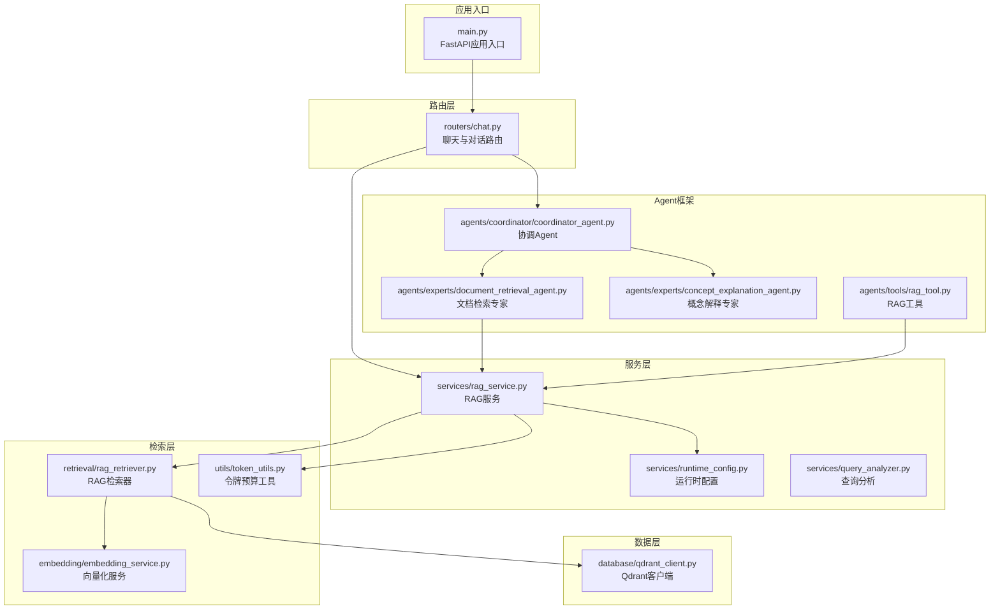
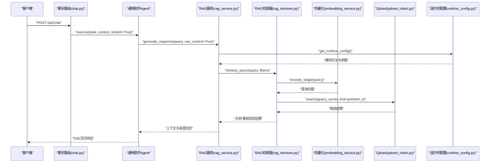
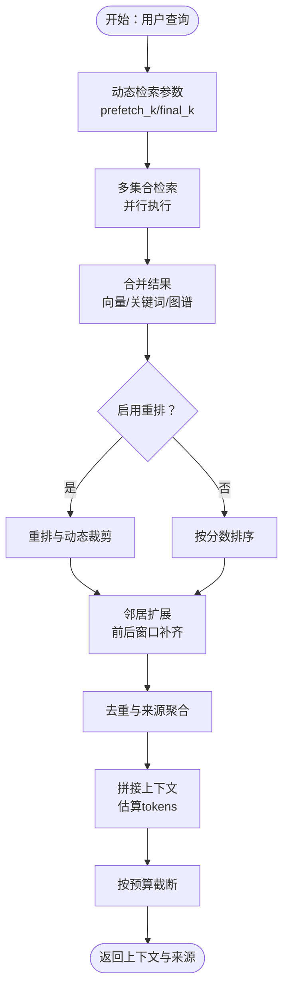
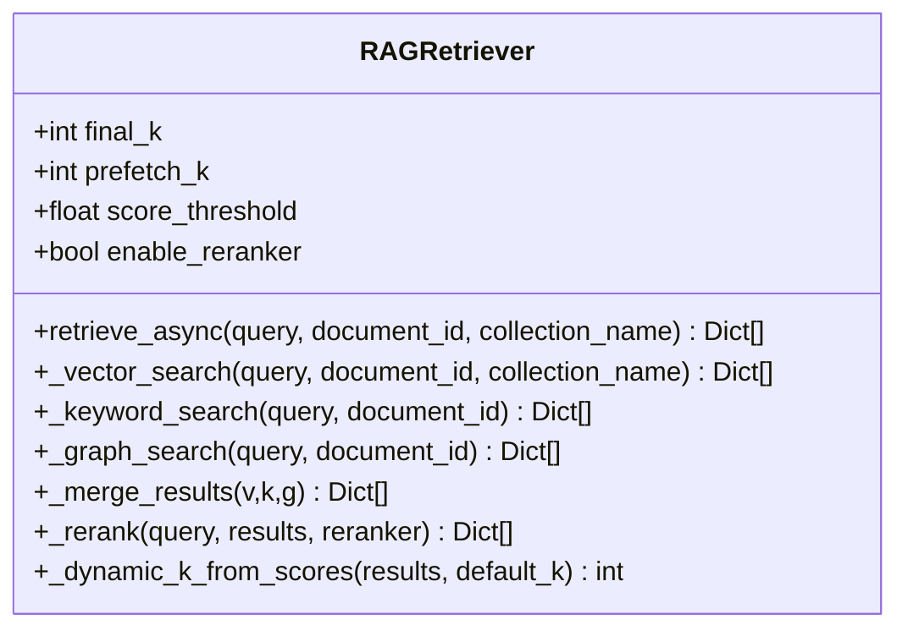
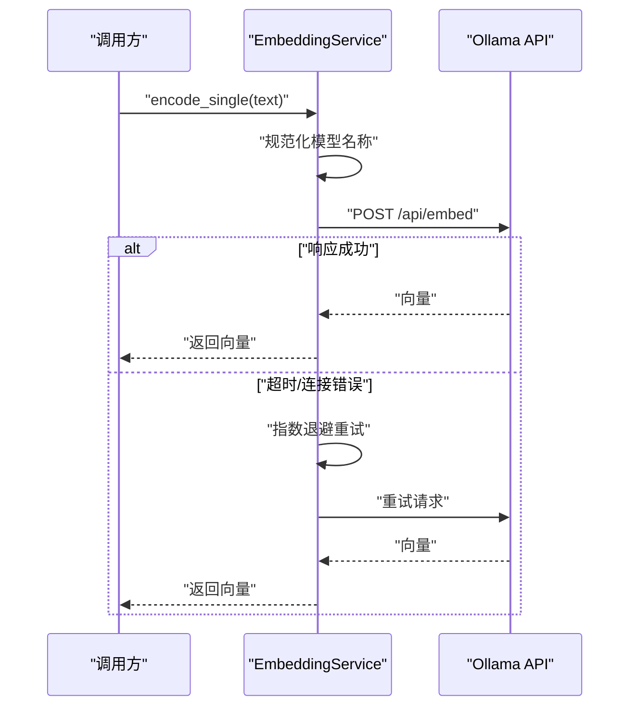
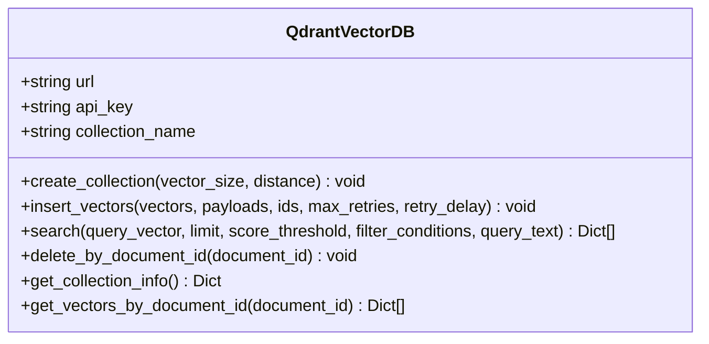
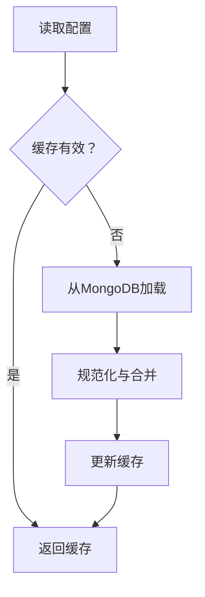
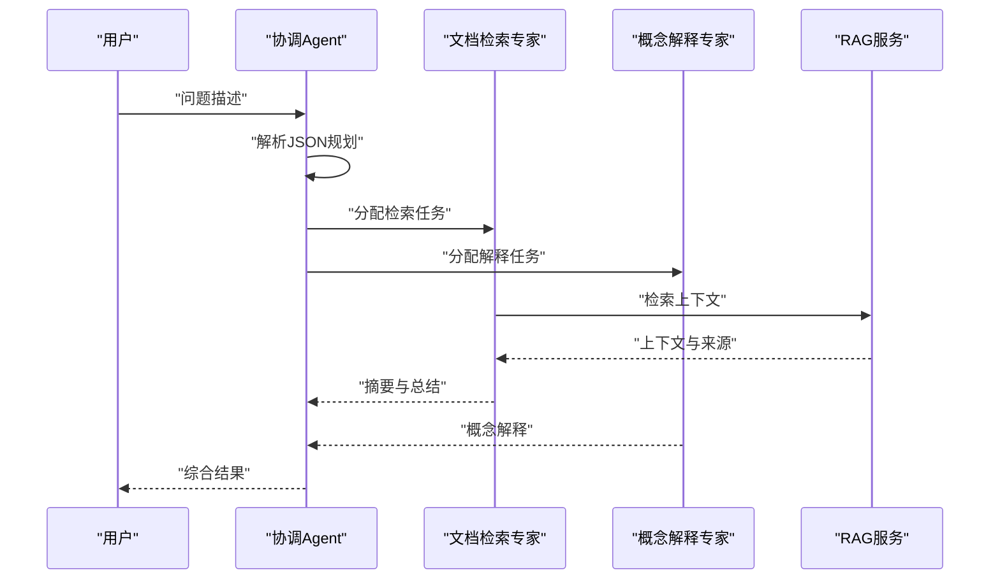
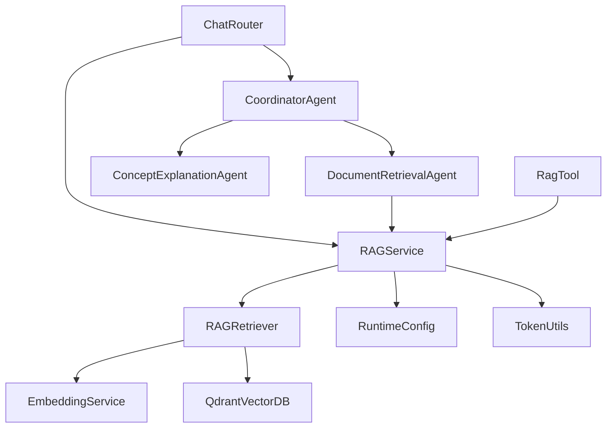

# RAG服务实现

<cite>
**本文档引用的文件**
- [main.py](file://main.py)
- [rag_service.py](file://services/rag_service.py)
- [rag_retriever.py](file://retrieval/rag_retriever.py)
- [embedding_service.py](file://embedding/embedding_service.py)
- [qdrant_client.py](file://database/qdrant_client.py)
- [runtime_config.py](file://services/runtime_config.py)
- [token_utils.py](file://utils/token_utils.py)
- [chat.py](file://routers/chat.py)
- [coordinator_agent.py](file://agents/coordinator/coordinator_agent.py)
- [document_retrieval_agent.py](file://agents/experts/document_retrieval_agent.py)
- [concept_explanation_agent.py](file://agents/experts/concept_explanation_agent.py)
- [rag_tool.py](file://agents/tools/rag_tool.py)
- [query_analyzer.py](file://services/query_analyzer.py)
- [README.md](file://README.md)
</cite>

## 目录
1. [简介](#简介)
2. [项目结构](#项目结构)
3. [核心组件](#核心组件)
4. [架构概览](#架构概览)
5. [详细组件分析](#详细组件分析)
6. [依赖关系分析](#依赖关系分析)
7. [性能考量](#性能考量)
8. [故障排除指南](#故障排除指南)
9. [结论](#结论)
10. [附录](#附录)

## 简介
本文件面向高级RAG（检索增强生成）系统的实现，围绕检索增强生成的核心算法与实现原理展开，涵盖上下文构建、检索策略、结果重排等关键步骤。文档详细说明RAG服务从用户查询到最终响应的完整工作流程，包括查询预处理、多源检索、上下文融合、生成响应等环节。同时阐述Agent协作机制在RAG中的应用，包括协调Agent的调度逻辑与专家Agent的专业处理能力。最后给出服务配置参数、性能优化策略、错误处理机制，并提供流式响应、并发处理、缓存策略等高级特性的实践指导。

## 项目结构
项目采用模块化分层设计，后端基于FastAPI，前端基于Next.js，核心模块包括：
- 路由层：统一暴露REST API，处理HTTP请求与参数校验
- 服务层：封装业务逻辑，如RAG服务、运行时配置、查询分析等
- 检索层：实现混合检索（向量、关键词、图谱）、结果重排与动态裁剪
- 数据层：MongoDB、Qdrant、Neo4j等数据库客户端
- Agent框架：多Agent协作，支持协调Agent与专家Agent
- 工具层：通用工具与监控，如日志、令牌预算、GPU检测等

**图表来源**
- [main.py:55-99](file://main.py#L55-L99)
- [chat.py:623-760](file://routers/chat.py#L623-L760)
- [rag_service.py:8-323](file://services/rag_service.py#L8-L323)
- [rag_retriever.py:17-393](file://retrieval/rag_retriever.py#L17-L393)
- [embedding_service.py:8-333](file://embedding/embedding_service.py#L8-L333)
- [qdrant_client.py:18-544](file://database/qdrant_client.py#L18-L544)
- [runtime_config.py:140-218](file://services/runtime_config.py#L140-L218)
- [token_utils.py:16-72](file://utils/token_utils.py#L16-L72)
- [coordinator_agent.py:7-252](file://agents/coordinator/coordinator_agent.py#L7-L252)
- [document_retrieval_agent.py:8-79](file://agents/experts/document_retrieval_agent.py#L8-L79)
- [concept_explanation_agent.py:7-70](file://agents/experts/concept_explanation_agent.py#L7-L70)
- [rag_tool.py:12-58](file://agents/tools/rag_tool.py#L12-L58)

**章节来源**
- [README.md:55-70](file://README.md#L55-L70)
- [main.py:55-99](file://main.py#L55-L99)

## 核心组件
本节聚焦RAG服务的关键组件与职责：
- RAGService：封装RAG检索与上下文构建，支持动态检索参数、邻居扩展、去重与上下文拼接
- RAGRetriever：混合检索实现，包含向量检索、关键词检索、图谱检索与结果重排
- EmbeddingService：基于Ollama的向量化服务，支持模型检测、重试与超长文本截断
- QdrantVectorDB：Qdrant客户端封装，提供集合管理、向量插入与相似度搜索
- RuntimeConfig：运行时配置管理，支持模块开关与参数调整
- TokenBudget：令牌预算估算与截断工具，保障上下文长度控制
- Agent框架：协调Agent与专家Agent协作，支持深度研究模式

**章节来源**
- [rag_service.py:8-323](file://services/rag_service.py#L8-L323)
- [rag_retriever.py:17-393](file://retrieval/rag_retriever.py#L17-L393)
- [embedding_service.py:8-333](file://embedding/embedding_service.py#L8-L333)
- [qdrant_client.py:18-544](file://database/qdrant_client.py#L18-L544)
- [runtime_config.py:140-218](file://services/runtime_config.py#L140-L218)
- [token_utils.py:16-72](file://utils/token_utils.py#L16-L72)
- [coordinator_agent.py:7-252](file://agents/coordinator/coordinator_agent.py#L7-L252)
- [document_retrieval_agent.py:8-79](file://agents/experts/document_retrieval_agent.py#L8-L79)
- [concept_explanation_agent.py:7-70](file://agents/experts/concept_explanation_agent.py#L7-L70)
- [rag_tool.py:12-58](file://agents/tools/rag_tool.py#L12-L58)

## 架构概览
RAG服务的整体架构围绕“检索-融合-生成”的闭环展开。用户通过聊天路由发起请求，路由层将请求转交给Agent或RAG服务。RAG服务调用检索器进行多源检索，结合运行时配置与动态参数，对结果进行重排与裁剪，构建上下文并返回。Agent框架支持多Agent协作，协调Agent负责任务规划，专家Agent负责具体领域的专业处理。

**图表来源**
- [chat.py:623-760](file://routers/chat.py#L623-L760)
- [rag_service.py:268-318](file://services/rag_service.py#L268-L318)
- [rag_retriever.py:89-138](file://retrieval/rag_retriever.py#L89-L138)
- [embedding_service.py:316-318](file://embedding/embedding_service.py#L316-L318)
- [qdrant_client.py:336-414](file://database/qdrant_client.py#L336-L414)
- [runtime_config.py:140-161](file://services/runtime_config.py#L140-L161)

## 详细组件分析

### RAG服务（上下文构建与检索）
RAGService负责从用户查询到最终响应的完整流程，核心包括：
- 动态检索参数：根据查询长度、关键词特征（对比/列举/条款）动态调整prefetch_k与final_k
- 多集合检索：支持知识空间集合与旧版助手集合，支持并行检索
- 邻居扩展：对命中chunk进行前后窗口补齐，增强上下文完整性
- 去重与来源聚合：按文档/附件维度去重，保留最高分chunk，构建来源清单
- 上下文拼接与截断：估算tokens并按预算截断，避免超长prompt

**图表来源**
- [rag_service.py:11-32](file://services/rag_service.py#L11-L32)
- [rag_service.py:97-122](file://services/rag_service.py#L97-L122)
- [rag_service.py:128-266](file://services/rag_service.py#L128-L266)

**章节来源**
- [rag_service.py:11-32](file://services/rag_service.py#L11-L32)
- [rag_service.py:97-122](file://services/rag_service.py#L97-L122)
- [rag_service.py:128-266](file://services/rag_service.py#L128-L266)

### RAG检索器（混合检索与重排）
RAGRetriever实现混合检索策略：
- 向量检索：基于Qdrant的相似度搜索，支持过滤条件与阈值
- 关键词检索：针对指定文档ID的关键词匹配，避免全局扫描
- 图谱检索：基于实体抽取与Cypher查询，生成结构化知识文本
- 结果合并：向量结果为基础，关键词结果进行boost，图谱结果独立加入
- 重排与动态裁剪：使用CrossEncoder进行重排，基于分数分布自适应调整k

**图表来源**
- [rag_retriever.py:17-51](file://retrieval/rag_retriever.py#L17-L51)
- [rag_retriever.py:89-138](file://retrieval/rag_retriever.py#L89-L138)
- [rag_retriever.py:328-364](file://retrieval/rag_retriever.py#L328-L364)
- [rag_retriever.py:365-392](file://retrieval/rag_retriever.py#L365-L392)

**章节来源**
- [rag_retriever.py:71-138](file://retrieval/rag_retriever.py#L71-L138)
- [rag_retriever.py:169-175](file://retrieval/rag_retriever.py#L169-L175)
- [rag_retriever.py:176-205](file://retrieval/rag_retriever.py#L176-L205)
- [rag_retriever.py:206-241](file://retrieval/rag_retriever.py#L206-L241)
- [rag_retriever.py:242-327](file://retrieval/rag_retriever.py#L242-L327)
- [rag_retriever.py:328-364](file://retrieval/rag_retriever.py#L328-L364)
- [rag_retriever.py:365-392](file://retrieval/rag_retriever.py#L365-L392)

### 向量化服务（Ollama集成）
EmbeddingService基于Ollama提供向量化能力：
- 模型检测与规范化：自动检测可用embedding模型，处理标签与名称匹配
- 重试机制：超时与连接错误指数退避重试
- 输入截断：防止超上下文长度导致的Ollama错误
- 维度获取：首次调用时获取向量维度，后续复用

**图表来源**
- [embedding_service.py:175-291](file://embedding/embedding_service.py#L175-L291)
- [embedding_service.py:316-318](file://embedding/embedding_service.py#L316-L318)

**章节来源**
- [embedding_service.py:11-44](file://embedding/embedding_service.py#L11-L44)
- [embedding_service.py:175-291](file://embedding/embedding_service.py#L175-L291)
- [embedding_service.py:316-318](file://embedding/embedding_service.py#L316-L318)

### Qdrant客户端（向量数据库）
QdrantVectorDB提供集合管理、向量插入与搜索：
- 连接优化：优先使用gRPC，避免httpx 502问题，支持连接复用
- 健康检查：测试连接并优雅降级
- 自动重建：维度不匹配时自动重建集合
- 滚动查询：支持按文档ID滚动获取向量

**图表来源**
- [qdrant_client.py:18-96](file://database/qdrant_client.py#L18-L96)
- [qdrant_client.py:140-209](file://database/qdrant_client.py#L140-L209)
- [qdrant_client.py:336-414](file://database/qdrant_client.py#L336-L414)
- [qdrant_client.py:474-526](file://database/qdrant_client.py#L474-L526)

**章节来源**
- [qdrant_client.py:18-96](file://database/qdrant_client.py#L18-L96)
- [qdrant_client.py:140-209](file://database/qdrant_client.py#L140-L209)
- [qdrant_client.py:336-414](file://database/qdrant_client.py#L336-L414)
- [qdrant_client.py:474-526](file://database/qdrant_client.py#L474-L526)

### 运行时配置（模块开关与参数）
RuntimeConfig提供运行时配置管理：
- 预设模式：low/high/custom，控制模块开关与并发参数
- 缓存机制：TTL缓存，降低MongoDB读取频率
- 合并与规范化：合并用户覆盖与默认配置，强制保留基础能力

**图表来源**
- [runtime_config.py:140-161](file://services/runtime_config.py#L140-L161)
- [runtime_config.py:164-189](file://services/runtime_config.py#L164-L189)
- [runtime_config.py:94-127](file://services/runtime_config.py#L94-L127)

**章节来源**
- [runtime_config.py:140-161](file://services/runtime_config.py#L140-L161)
- [runtime_config.py:164-189](file://services/runtime_config.py#L164-L189)
- [runtime_config.py:94-127](file://services/runtime_config.py#L94-L127)

### 令牌预算与截断
TokenBudget与truncate_to_tokens提供近似估算与二分截断：
- 估算规则：中英文字符按经验比例估算，避免强绑定特定tokenizer
- 截断策略：二分查找最优截断点，避免O(n^2)复杂度

**章节来源**
- [token_utils.py:16-72](file://utils/token_utils.py#L16-L72)

### Agent协作机制
协调Agent与专家Agent协作：
- 协调Agent：分析问题复杂度，智能选择专家Agent，返回JSON规划结果
- 专家Agent：文档检索专家与概念解释专家分别处理检索与解释任务
- 工具集成：LangChain工具适配，支持同步与异步执行

**图表来源**
- [coordinator_agent.py:55-169](file://agents/coordinator/coordinator_agent.py#L55-L169)
- [document_retrieval_agent.py:25-79](file://agents/experts/document_retrieval_agent.py#L25-L79)
- [concept_explanation_agent.py:25-70](file://agents/experts/concept_explanation_agent.py#L25-L70)
- [rag_tool.py:43-56](file://agents/tools/rag_tool.py#L43-L56)

**章节来源**
- [coordinator_agent.py:55-169](file://agents/coordinator/coordinator_agent.py#L55-L169)
- [document_retrieval_agent.py:25-79](file://agents/experts/document_retrieval_agent.py#L25-L79)
- [concept_explanation_agent.py:25-70](file://agents/experts/concept_explanation_agent.py#L25-L70)
- [rag_tool.py:43-56](file://agents/tools/rag_tool.py#L43-L56)

### 查询分析（是否需要检索）
QueryAnalyzer基于小模型快速判断是否需要检索：
- 提示词工程：明确“需要检索/不需要检索”的判定标准
- JSON解析与关键词回退：解析失败时使用关键词匹配
- 低温度与短输出：提升判断确定性与响应速度

**章节来源**
- [query_analyzer.py:38-106](file://services/query_analyzer.py#L38-L106)
- [query_analyzer.py:107-158](file://services/query_analyzer.py#L107-L158)

## 依赖关系分析
RAG服务各组件之间的依赖关系如下：

**图表来源**
- [rag_service.py:8-323](file://services/rag_service.py#L8-L323)
- [rag_retriever.py:17-393](file://retrieval/rag_retriever.py#L17-L393)
- [embedding_service.py:8-333](file://embedding/embedding_service.py#L8-L333)
- [qdrant_client.py:18-544](file://database/qdrant_client.py#L18-L544)
- [runtime_config.py:140-218](file://services/runtime_config.py#L140-L218)
- [token_utils.py:16-72](file://utils/token_utils.py#L16-L72)
- [chat.py:623-760](file://routers/chat.py#L623-L760)
- [coordinator_agent.py:7-252](file://agents/coordinator/coordinator_agent.py#L7-L252)
- [document_retrieval_agent.py:8-79](file://agents/experts/document_retrieval_agent.py#L8-L79)
- [concept_explanation_agent.py:7-70](file://agents/experts/concept_explanation_agent.py#L7-L70)
- [rag_tool.py:12-58](file://agents/tools/rag_tool.py#L12-L58)

**章节来源**
- [main.py:15-99](file://main.py#L15-L99)
- [chat.py:623-760](file://routers/chat.py#L623-L760)

## 性能考量
- 并发与连接优化
  - Uvicorn多worker：生产环境默认24个worker，开发环境单worker
  - Qdrant优先gRPC：避免httpx 502，支持连接复用
  - 运行时配置缓存：TTL缓存降低MongoDB读取压力
- 检索性能
  - prefetch_k放大：提高候选池，利于重排与动态裁剪
  - 动态k策略：根据分数分布自适应调整，平衡召回与精度
  - 关键词检索限制：仅在指定文档ID时启用，避免全局扫描
- 生成性能
  - SSE流式响应：客户端断开检测，及时停止生成
  - 令牌预算：估算与截断，避免超长prompt导致的延迟
- 向量化性能
  - 指数退避重试：缓解Ollama服务不稳定
  - 输入截断：防止超上下文错误

**章节来源**
- [main.py:142-171](file://main.py#L142-L171)
- [qdrant_client.py:66-96](file://database/qdrant_client.py#L66-L96)
- [runtime_config.py:134-161](file://services/runtime_config.py#L134-L161)
- [rag_retriever.py:42-51](file://retrieval/rag_retriever.py#L42-L51)
- [rag_retriever.py:139-167](file://retrieval/rag_retriever.py#L139-L167)
- [chat.py:673-752](file://routers/chat.py#L673-L752)
- [token_utils.py:16-72](file://utils/token_utils.py#L16-L72)
- [embedding_service.py:259-291](file://embedding/embedding_service.py#L259-L291)

## 故障排除指南
- 全局异常处理
  - 未捕获异常统一记录日志并返回JSON响应，包含路径与方法信息
- 检索失败回退
  - RAGService在检索失败时可选择回退到不使用上下文的模式，保证服务连续性
- Ollama连接与超时
  - EmbeddingService内置重试与超时处理，避免单次失败影响整体
- Qdrant维度不匹配
  - 自动重建集合，避免因维度错误导致的插入失败
- 客户端断开
  - 路由层检测断开连接，及时停止流式输出，释放资源

**章节来源**
- [main.py:110-127](file://main.py#L110-L127)
- [rag_service.py:294-312](file://services/rag_service.py#L294-L312)
- [embedding_service.py:259-291](file://embedding/embedding_service.py#L259-L291)
- [qdrant_client.py:299-335](file://database/qdrant_client.py#L299-L335)
- [chat.py:692-743](file://routers/chat.py#L692-L743)

## 结论
本RAG服务实现通过模块化设计与多源检索策略，实现了高效、可扩展的检索增强生成能力。动态检索参数、邻居扩展、结果重排与动态裁剪显著提升了上下文质量与检索精度。Agent协作机制进一步增强了系统在复杂问题上的处理能力。配合运行时配置缓存、并发优化与流式响应，系统在性能与用户体验上达到良好平衡。未来可在图谱检索与实体抽取方面进一步优化，以支持更复杂的知识推理场景。

## 附录
- 使用场景
  - 常规对话：启用RAG检索，返回带来源的流式响应
  - 深度研究：协调Agent与专家Agent协作，输出结构化研究报告
  - 工具集成：LangChain工具调用RAG服务，实现外部系统接入
- 配置参数
  - 环境变量：OLLAMA_BASE_URL、OLLAMA_EMBEDDING_MODEL、QDRANT_URL、NEO4J_URI等
  - 运行时配置：模块开关（kg_extract_enabled、kg_retrieve_enabled、rerank_enabled等）、并发参数
- 高级特性
  - 流式响应：SSE流式输出，支持客户端断开检测
  - 并发处理：Uvicorn多worker、Qdrant gRPC连接复用
  - 缓存策略：运行时配置TTL缓存、MongoDB连接池

**章节来源**
- [README.md:125-167](file://README.md#L125-L167)
- [runtime_config.py:140-218](file://services/runtime_config.py#L140-L218)
- [chat.py:623-760](file://routers/chat.py#L623-L760)