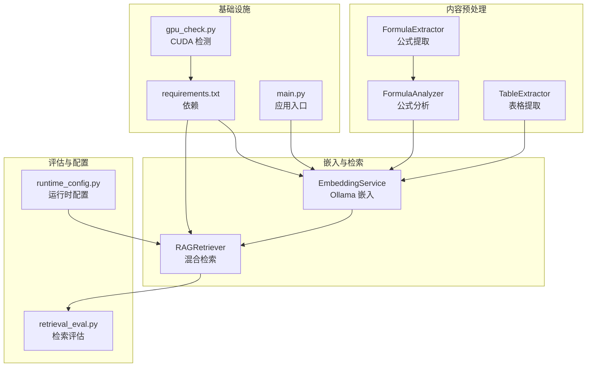
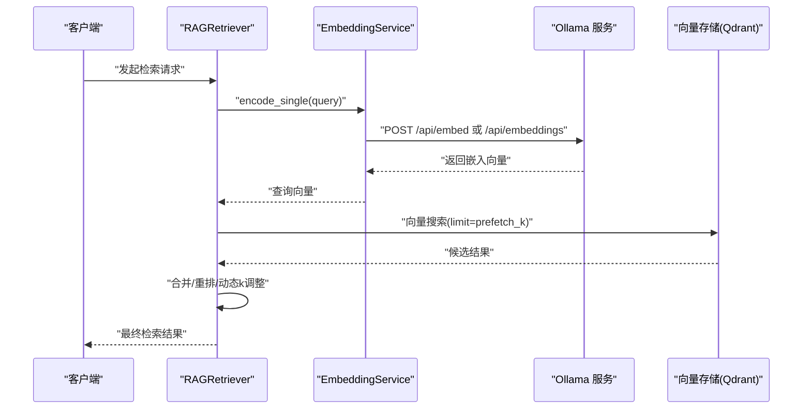
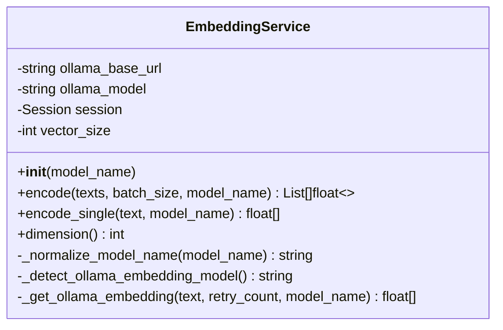
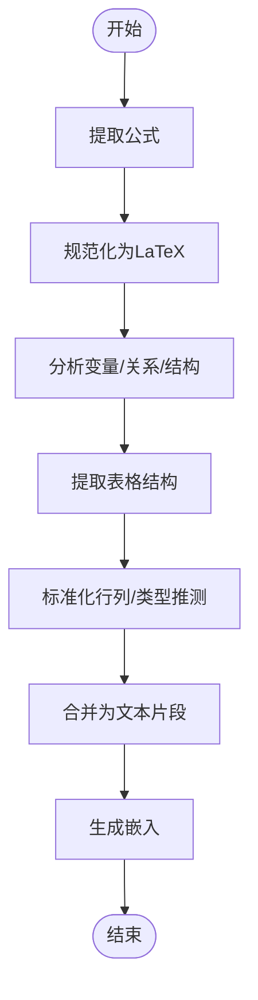
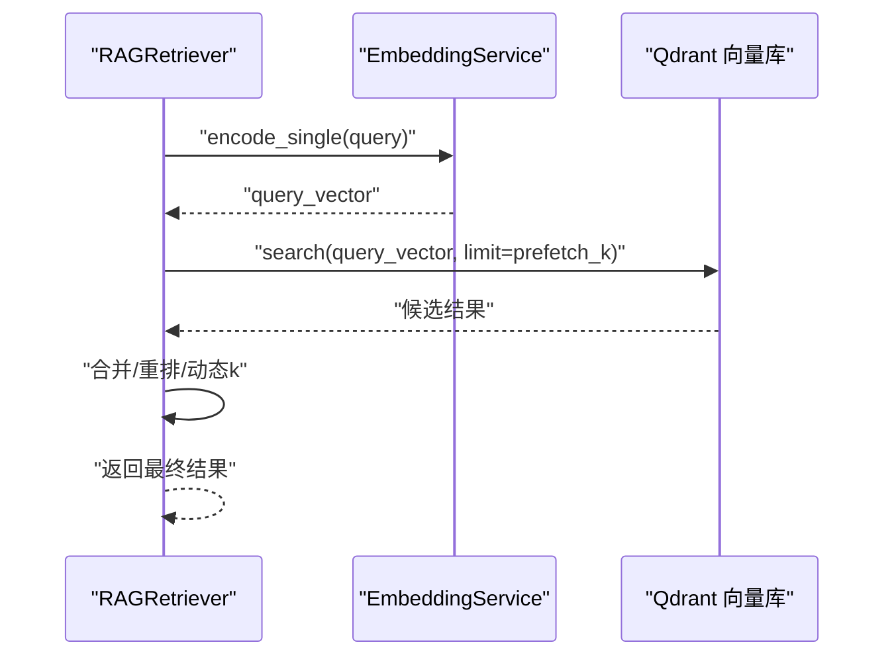
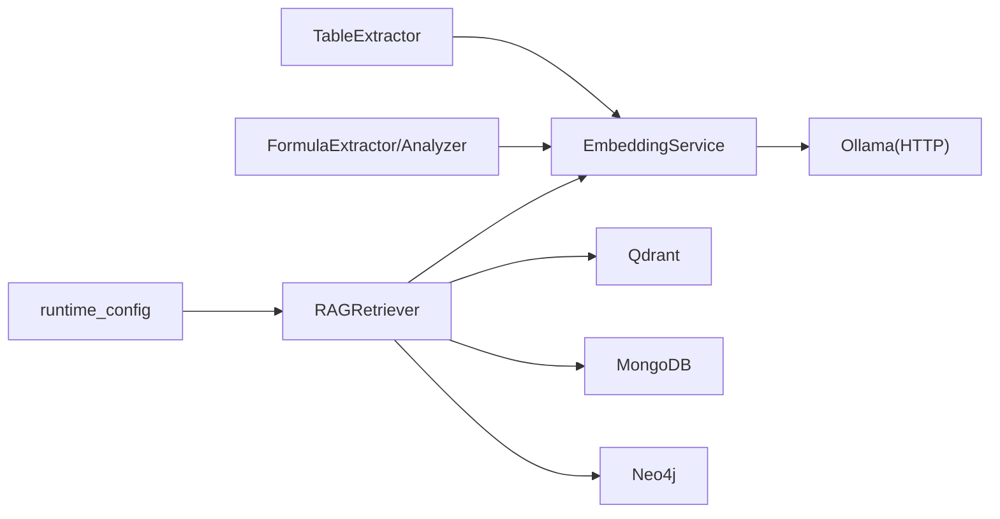

# 嵌入服务实现

<cite>
**本文引用的文件**
- [embedding_service.py](file://embedding/embedding_service.py)
- [formula_analyzer.py](file://utils/formula_analyzer.py)
- [formula_extractor.py](file://utils/formula_extractor.py)
- [table_extractor.py](file://utils/table_extractor.py)
- [gpu_check.py](file://utils/gpu_check.py)
- [rag_retriever.py](file://retrieval/rag_retriever.py)
- [retrieval_eval.py](file://eval/retrieval_eval.py)
- [runtime_config.py](file://services/runtime_config.py)
- [main.py](file://main.py)
- [requirements.txt](file://requirements.txt)
</cite>

## 目录
1. [简介](#简介)
2. [项目结构](#项目结构)
3. [核心组件](#核心组件)
4. [架构总览](#架构总览)
5. [详细组件分析](#详细组件分析)
6. [依赖分析](#依赖分析)
7. [性能考虑](#性能考虑)
8. [故障排查指南](#故障排查指南)
9. [结论](#结论)
10. [附录](#附录)

## 简介
本文件面向“嵌入服务”的实现与使用，围绕文本嵌入生成机制展开，重点涵盖以下方面：
- 文本嵌入生成流程：基于 Ollama 的本地嵌入服务，支持模型自动检测与规范化、向量维度获取、批量嵌入与单条嵌入。
- 特殊内容处理策略：公式与表格的提取与嵌入前预处理，提升检索与相似度计算质量。
- 性能优化：批处理策略、重排（rerank）、动态 k 调整、并发与资源管理。
- 配置与参数：环境变量、运行时配置、错误处理与回退策略。
- 使用示例与评估：如何在检索链路中调用嵌入服务，以及检索效果评估方法。

## 项目结构
与嵌入服务直接相关的模块与文件如下：
- 嵌入服务：embedding/embedding_service.py
- 公式处理：utils/formula_analyzer.py、utils/formula_extractor.py
- 表格处理：utils/table_extractor.py
- GPU/CUDA 检测：utils/gpu_check.py
- 检索链路：retrieval/rag_retriever.py
- 运行时配置：services/runtime_config.py
- 评估脚本：eval/retrieval_eval.py
- 应用入口与环境：main.py、requirements.txt

**图表来源**
- [embedding_service.py:1-333](file://embedding/embedding_service.py#L1-L333)
- [formula_extractor.py:1-149](file://utils/formula_extractor.py#L1-L149)
- [formula_analyzer.py:1-233](file://utils/formula_analyzer.py#L1-L233)
- [table_extractor.py:1-290](file://utils/table_extractor.py#L1-L290)
- [rag_retriever.py:1-393](file://retrieval/rag_retriever.py#L1-L393)
- [retrieval_eval.py:1-102](file://eval/retrieval_eval.py#L1-L102)
- [runtime_config.py:50-134](file://services/runtime_config.py#L50-L134)
- [requirements.txt:1-42](file://requirements.txt#L1-L42)
- [main.py:1-171](file://main.py#L1-L171)
- [gpu_check.py:1-66](file://utils/gpu_check.py#L1-L66)

**章节来源**
- [embedding_service.py:1-333](file://embedding/embedding_service.py#L1-L333)
- [formula_extractor.py:1-149](file://utils/formula_extractor.py#L1-L149)
- [formula_analyzer.py:1-233](file://utils/formula_analyzer.py#L1-L233)
- [table_extractor.py:1-290](file://utils/table_extractor.py#L1-L290)
- [rag_retriever.py:1-393](file://retrieval/rag_retriever.py#L1-L393)
- [retrieval_eval.py:1-102](file://eval/retrieval_eval.py#L1-L102)
- [runtime_config.py:50-134](file://services/runtime_config.py#L50-L134)
- [requirements.txt:1-42](file://requirements.txt#L1-L42)
- [main.py:1-171](file://main.py#L1-L171)
- [gpu_check.py:1-66](file://utils/gpu_check.py#L1-L66)

## 核心组件
- 嵌入服务（EmbeddingService）
  - 使用 Ollama 提供的嵌入接口，支持模型名称规范化、自动检测、向量维度探测、单条与批量嵌入。
  - 内置重试与错误处理，兼容新旧接口（/api/embed 与 /api/embeddings）。
- 公式处理（FormulaExtractor、FormulaAnalyzer）
  - 提取 LaTeX 公式、规范化格式、分析变量与结构，便于生成高质量嵌入。
- 表格处理（TableExtractor）
  - 识别 Markdown 与管道分隔表格，提取结构化信息并转换为 HTML/Markdown，辅助嵌入与检索。
- 检索器（RAGRetriever）
  - 混合检索：向量检索、关键词检索、图谱检索；可选重排与动态 k 调整。
- 运行时配置（runtime_config）
  - 控制嵌入 batch 与并发等参数，保证基础能力（embedding）始终开启。
- 评估（retrieval_eval）
  - 提供召回率与准确率指标，支持多 K 值评估。

**章节来源**
- [embedding_service.py:8-333](file://embedding/embedding_service.py#L8-L333)
- [formula_extractor.py:6-149](file://utils/formula_extractor.py#L6-L149)
- [formula_analyzer.py:8-233](file://utils/formula_analyzer.py#L8-L233)
- [table_extractor.py:7-290](file://utils/table_extractor.py#L7-L290)
- [rag_retriever.py:17-393](file://retrieval/rag_retriever.py#L17-L393)
- [runtime_config.py:50-134](file://services/runtime_config.py#L50-L134)
- [retrieval_eval.py:10-102](file://eval/retrieval_eval.py#L10-L102)

## 架构总览
嵌入服务在检索链路中的位置如下：

**图表来源**
- [rag_retriever.py:89-137](file://retrieval/rag_retriever.py#L89-L137)
- [embedding_service.py:175-291](file://embedding/embedding_service.py#L175-L291)

**章节来源**
- [rag_retriever.py:89-137](file://retrieval/rag_retriever.py#L89-L137)
- [embedding_service.py:175-291](file://embedding/embedding_service.py#L175-L291)

## 详细组件分析

### 嵌入服务（EmbeddingService）
- 初始化与模型选择
  - 从环境变量读取 Ollama 基础地址与嵌入模型名；若未指定，自动检测包含“embedding”“nomic”等关键词的模型。
  - 支持模型名称规范化（处理标签如 :latest），避免找不到模型。
- 文本嵌入
  - encode_single：单条文本嵌入。
  - encode：批量嵌入（当前实现逐条调用，便于与 Ollama 接口适配）。
  - 向量维度：首次调用时探测并缓存。
- 错误处理与重试
  - 超时与连接错误递增等待重试；兼容新旧 Ollama 接口；对空向量与模型不存在进行提示。
- 环境变量
  - OLLAMA_BASE_URL、OLLAMA_EMBEDDING_MODEL、OLLAMA_EMBEDDING_MAX_CHARS（截断长度）。

**图表来源**
- [embedding_service.py:8-333](file://embedding/embedding_service.py#L8-L333)

**章节来源**
- [embedding_service.py:11-333](file://embedding/embedding_service.py#L11-L333)

### 公式与表格的嵌入前处理
- 公式提取与分析
  - 提取块级与行内公式，规范化为标准 LaTeX；分析变量、关系、函数与结构复杂度。
- 表格提取与结构化
  - 识别 Markdown 与管道分隔表格，标准化行列并对 HTML/Markdown 转换，便于后续嵌入与检索。

**图表来源**
- [formula_extractor.py:29-149](file://utils/formula_extractor.py#L29-L149)
- [formula_analyzer.py:33-233](file://utils/formula_analyzer.py#L33-L233)
- [table_extractor.py:11-290](file://utils/table_extractor.py#L11-L290)

**章节来源**
- [formula_extractor.py:29-149](file://utils/formula_extractor.py#L29-L149)
- [formula_analyzer.py:33-233](file://utils/formula_analyzer.py#L33-L233)
- [table_extractor.py:11-290](file://utils/table_extractor.py#L11-L290)

### 检索器与嵌入服务的集成
- 检索策略
  - 并行执行向量检索、关键词检索与图谱检索；合并去重后可选重排与动态 k 调整。
- 嵌入调用
  - 在异步检索中调用 EmbeddingService.encode_single 生成查询向量；支持指定嵌入模型。
- 重排与动态 k
  - 可选 CrossEncoder 重排；根据分数分布动态调整返回数量，平衡召回与精度。

**图表来源**
- [rag_retriever.py:89-137](file://retrieval/rag_retriever.py#L89-L137)
- [embedding_service.py:316-327](file://embedding/embedding_service.py#L316-L327)

**章节来源**
- [rag_retriever.py:89-137](file://retrieval/rag_retriever.py#L89-L137)
- [embedding_service.py:316-327](file://embedding/embedding_service.py#L316-L327)

## 依赖分析
- 嵌入服务依赖
  - Ollama 服务（通过 HTTP 调用）；requests 会话；日志记录。
- 检索链路依赖
  - Qdrant 客户端（向量检索）、MongoDB（关键词检索）、Neo4j（图谱检索）。
- 公式/表格处理依赖
  - 正则表达式与字符串处理；无外部 ML 依赖。
- 运行时配置
  - 控制嵌入 batch 与并发等参数，保证 embedding 基础能力开启。

**图表来源**
- [embedding_service.py:1-333](file://embedding/embedding_service.py#L1-L333)
- [rag_retriever.py:1-393](file://retrieval/rag_retriever.py#L1-L393)
- [runtime_config.py:50-134](file://services/runtime_config.py#L50-L134)

**章节来源**
- [embedding_service.py:1-333](file://embedding/embedding_service.py#L1-L333)
- [rag_retriever.py:1-393](file://retrieval/rag_retriever.py#L1-L393)
- [runtime_config.py:50-134](file://services/runtime_config.py#L50-L134)

## 性能考虑
- 批处理策略
  - 当前嵌入服务逐条调用 Ollama，便于兼容与稳定性；运行时配置提供 embedding_batch_size 参数（用于高配置模式），可在上层逻辑中结合使用。
- 重排与动态 k
  - 启用 CrossEncoder 重排可显著提升排序质量；动态 k 根据分数差异自动调整，兼顾召回与精度。
- 并发与资源
  - 运行时配置提供 embedding_concurrency 等参数；GPU/CUDA 检测工具可用于部署前验证硬件状态。
- 文本截断与上下文
  - 嵌入服务内置最大字符限制，避免超上下文错误；公式/表格预处理减少噪声，提高检索效率。

**章节来源**
- [runtime_config.py:50-134](file://services/runtime_config.py#L50-L134)
- [rag_retriever.py:139-167](file://retrieval/rag_retriever.py#L139-L167)
- [embedding_service.py:185-192](file://embedding/embedding_service.py#L185-L192)
- [gpu_check.py:10-66](file://utils/gpu_check.py#L10-L66)

## 故障排查指南
- 常见问题与处理
  - 未找到嵌入模型：检查 OLLAMA_EMBEDDING_MODEL 环境变量或使用 list_available_ollama_models 查看可用模型。
  - 超时/连接错误：嵌入服务内置重试与递增等待；检查 OLLAMA_BASE_URL 与网络连通性。
  - 上下文超限：嵌入服务对过长文本进行字符截断；可通过环境变量调整阈值。
  - 空向量：确认所选模型支持嵌入接口；必要时切换模型或使用 /api/embeddings 兼容接口。
- 日志与诊断
  - 使用日志中间件与全局异常处理器定位问题；GPU/CUDA 可通过 gpu_check 工具快速验证。

**章节来源**
- [embedding_service.py:39-44](file://embedding/embedding_service.py#L39-L44)
- [embedding_service.py:259-290](file://embedding/embedding_service.py#L259-L290)
- [main.py:110-126](file://main.py#L110-L126)
- [gpu_check.py:10-66](file://utils/gpu_check.py#L10-L66)

## 结论
嵌入服务通过 Ollama 实现本地化、可扩展的文本嵌入能力，配合公式与表格的预处理策略，在检索链路中实现了高质量的语义检索。运行时配置与重排/动态 k 等机制进一步提升了召回与精度的平衡。建议在生产环境中结合 GPU/CUDA 能力与合理的批处理/并发参数，持续评估检索指标以优化整体效果。

## 附录

### 使用示例（路径指引）
- 在检索器中调用嵌入服务生成查询向量
  - 参考路径：[rag_retriever.py:176-180](file://retrieval/rag_retriever.py#L176-L180)
- 获取嵌入向量维度
  - 参考路径：[embedding_service.py:320-327](file://embedding/embedding_service.py#L320-L327)
- 列出可用的 Ollama 模型
  - 参考路径：[embedding_service.py:156-173](file://embedding/embedding_service.py#L156-L173)

### 配置参数说明
- 环境变量
  - OLLAMA_BASE_URL：Ollama 服务地址，默认 http://127.0.0.1:11434。
  - OLLAMA_EMBEDDING_MODEL：嵌入模型名，如未设置则自动检测。
  - OLLAMA_EMBEDDING_MAX_CHARS：嵌入前文本最大字符数，避免超上下文。
- 运行时配置（运行模式 low/high/custom）
  - embedding_batch_size：嵌入批大小（高配置模式默认较大）。
  - embedding_concurrency：嵌入并发（预留参数）。
  - 参考路径：[runtime_config.py:50-82](file://services/runtime_config.py#L50-L82)

### 评估与基准测试
- 检索评估脚本
  - 支持多 K 值（如 5/10/20）的召回率与准确率统计。
  - 参考路径：[retrieval_eval.py:35-74](file://eval/retrieval_eval.py#L35-L74)
- 依赖与版本
  - sentence-transformers（用于重排模型加载）等依赖项。
  - 参考路径：[requirements.txt:14-14](file://requirements.txt#L14-L14)