# 工具服务实现

<cite>
**本文档引用的文件**
- [ai_tools.py](file://services/ai_tools.py)
- [title_generator.py](file://services/title_generator.py)
- [token_utils.py](file://utils/token_utils.py)
- [monitoring.py](file://utils/monitoring.py)
- [runtime_config.py](file://services/runtime_config.py)
- [model_selector.py](file://services/model_selector.py)
- [prompt_chain.py](file://services/prompt_chain.py)
- [logger.py](file://utils/logger.py)
- [mongodb.py](file://database/mongodb.py)
- [embedding_service.py](file://embedding/embedding_service.py)
- [ollama_service.py](file://services/ollama_service.py)
- [health.py](file://routers/health.py)
- [settings.py](file://routers/settings.py)
</cite>

## 目录
1. [简介](#简介)
2. [项目结构](#项目结构)
3. [核心组件](#核心组件)
4. [架构总览](#架构总览)
5. [详细组件分析](#详细组件分析)
6. [依赖分析](#依赖分析)
7. [性能考量](#性能考量)
8. [故障排查指南](#故障排查指南)
9. [结论](#结论)
10. [附录](#附录)

## 简介
本文件面向高级RAG系统的工具服务实现，围绕AI工具集成、标题生成、令牌管理、监控统计等实用功能展开。文档从架构设计、组件关系、数据流、处理逻辑、集成点、错误处理与性能特征等方面进行全面剖析，并提供使用示例与集成指南，帮助开发者与运维人员高效理解与维护系统。

## 项目结构
工具服务相关的核心模块分布如下：
- 服务层：AI工具库、标题生成器、运行时配置、模型选择器、提示词链、Ollama服务
- 工具层：日志、监控、令牌工具
- 数据层：MongoDB连接与仓储
- 嵌入层：向量化服务
- 路由层：健康检查与运行时配置API

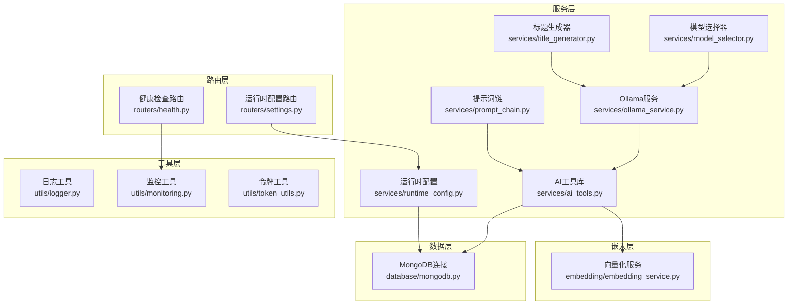

图表来源
- [ai_tools.py:11-498](file://services/ai_tools.py#L11-L498)
- [title_generator.py:9-123](file://services/title_generator.py#L9-L123)
- [runtime_config.py:140-217](file://services/runtime_config.py#L140-L217)
- [model_selector.py:10-206](file://services/model_selector.py#L10-L206)
- [prompt_chain.py:6-450](file://services/prompt_chain.py#L6-L450)
- [ollama_service.py:345-451](file://services/ollama_service.py#L345-L451)
- [logger.py:15-88](file://utils/logger.py#L15-L88)
- [monitoring.py:13-185](file://utils/monitoring.py#L13-L185)
- [token_utils.py:7-72](file://utils/token_utils.py#L7-L72)
- [mongodb.py:92-204](file://database/mongodb.py#L92-L204)
- [embedding_service.py:8-333](file://embedding/embedding_service.py#L8-L333)
- [health.py:23-135](file://routers/health.py#L23-L135)
- [settings.py:31-64](file://routers/settings.py#L31-L64)

章节来源
- [ai_tools.py:11-498](file://services/ai_tools.py#L11-L498)
- [title_generator.py:9-123](file://services/title_generator.py#L9-L123)
- [runtime_config.py:140-217](file://services/runtime_config.py#L140-L217)
- [model_selector.py:10-206](file://services/model_selector.py#L10-L206)
- [prompt_chain.py:6-450](file://services/prompt_chain.py#L6-L450)
- [logger.py:15-88](file://utils/logger.py#L15-L88)
- [monitoring.py:13-185](file://utils/monitoring.py#L13-L185)
- [token_utils.py:7-72](file://utils/token_utils.py#L7-L72)
- [mongodb.py:92-204](file://database/mongodb.py#L92-L204)
- [embedding_service.py:8-333](file://embedding/embedding_service.py#L8-L333)
- [health.py:23-135](file://routers/health.py#L23-L135)
- [settings.py:31-64](file://routers/settings.py#L31-L64)

## 核心组件
- AI工具库：提供工具注册、调用管理、结果处理，支持同步与异步调用，适配事件循环与MongoDB异步操作。
- 标题生成器：基于小模型生成对话标题，具备上下文提取、提示词构造、结果清理与回退策略。
- 令牌工具：提供近似token估算、截断与预算控制，避免强依赖特定tokenizer。
- 监控工具：性能监控器与装饰器，记录请求耗时、错误率、系统指标，支持慢请求告警。
- 运行时配置：全局配置（MongoDB持久化 + TTL缓存），支持低/高预设与自定义模式。
- 模型选择器：基于关键词匹配与小模型判断，选择公式/知识型模型。
- 提示词链：基础提示词与助手特定提示词叠加，动态注入工具函数描述。
- Ollama服务：处理工具函数调用解析与执行，支持流式生成与错误恢复。

章节来源
- [ai_tools.py:11-498](file://services/ai_tools.py#L11-L498)
- [title_generator.py:9-123](file://services/title_generator.py#L9-L123)
- [token_utils.py:7-72](file://utils/token_utils.py#L7-L72)
- [monitoring.py:13-185](file://utils/monitoring.py#L13-L185)
- [runtime_config.py:140-217](file://services/runtime_config.py#L140-L217)
- [model_selector.py:10-206](file://services/model_selector.py#L10-L206)
- [prompt_chain.py:6-450](file://services/prompt_chain.py#L6-L450)
- [ollama_service.py:345-451](file://services/ollama_service.py#L345-L451)

## 架构总览
系统采用“服务-工具-数据-嵌入-路由”的分层架构。AI工具库与提示词链为上层智能体提供“工具+提示词”的能力；监控与日志贯穿全链路；运行时配置通过API动态下发；Ollama服务作为外部推理与嵌入服务的桥接层；MongoDB提供持久化与缓存。

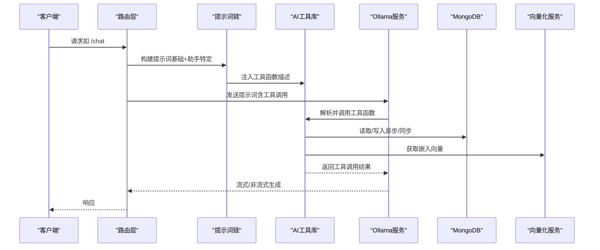

图表来源
- [prompt_chain.py:320-383](file://services/prompt_chain.py#L320-L383)
- [ai_tools.py:132-195](file://services/ai_tools.py#L132-L195)
- [ollama_service.py:345-451](file://services/ollama_service.py#L345-L451)
- [mongodb.py:92-204](file://database/mongodb.py#L92-L204)
- [embedding_service.py:292-318](file://embedding/embedding_service.py#L292-L318)

## 详细组件分析

### AI工具库（AITools）
- 工具注册：集中注册工具函数，定义名称、描述与参数Schema，便于提示词链注入与工具调用。
- 调用管理：支持同步与异步调用，过滤参数schema，避免模型误传参数；对MongoDB异步工具提供专用异步实现。
- 工具实现：包含获取Ollama模型列表、知识库文档列表、系统信息、知识库统计等，均支持assistant_id过滤与实时数据获取。
- 错误处理：统一捕获异常并记录日志，保证调用失败可追踪。

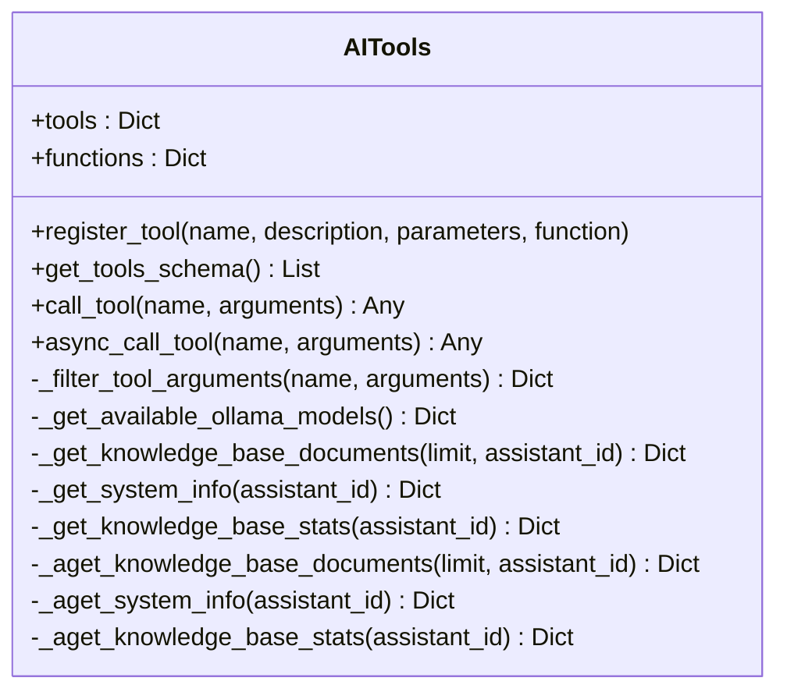

图表来源
- [ai_tools.py:11-498](file://services/ai_tools.py#L11-L498)

章节来源
- [ai_tools.py:11-498](file://services/ai_tools.py#L11-L498)

### 标题生成器（TitleGenerator）
- 输入：对话消息列表（role/content），提取前若干轮用户消息作为上下文。
- 处理：构造提示词，调用Ollama生成标题，清洗与截断，回退策略（取第一条用户消息）。
- 输出：简洁标题，长度限制，失败回退默认标题。

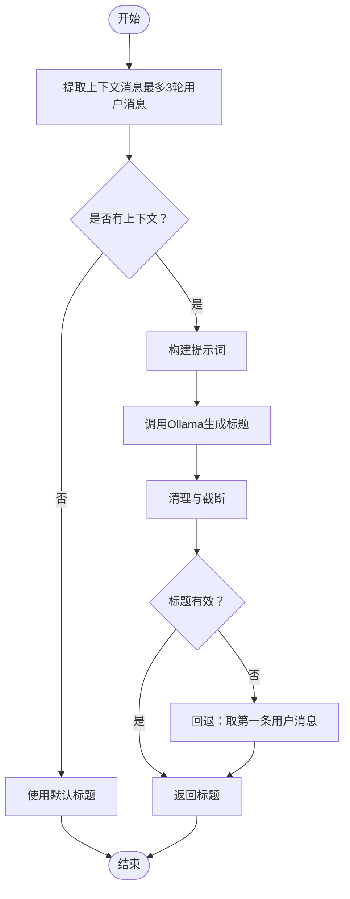

图表来源
- [title_generator.py:30-117](file://services/title_generator.py#L30-L117)

章节来源
- [title_generator.py:9-123](file://services/title_generator.py#L9-L123)

### 令牌工具（TokenBudget/estimate_tokens/truncate_to_tokens）
- 近似估算：按CJK/ASCII/其他字符比例估算token数，避免强依赖tiktoken/transformers。
- 截断策略：二分法从尾部截断，避免O(n^2)复杂度，保留前文。
- 应用：预算控制、文本截断、成本估算基础。

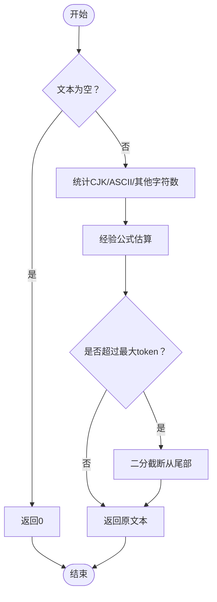

图表来源
- [token_utils.py:16-71](file://utils/token_utils.py#L16-L71)

章节来源
- [token_utils.py:7-72](file://utils/token_utils.py#L7-L72)

### 监控服务（PerformanceMonitor/monitor_performance/monitor_request）
- 性能记录：记录请求耗时、次数、错误次数，支持百分位统计（p50/p95/p99）。
- 系统指标：CPU/内存/磁盘使用，进程级指标。
- 装饰器与上下文：自动记录请求耗时、状态码，慢请求告警。

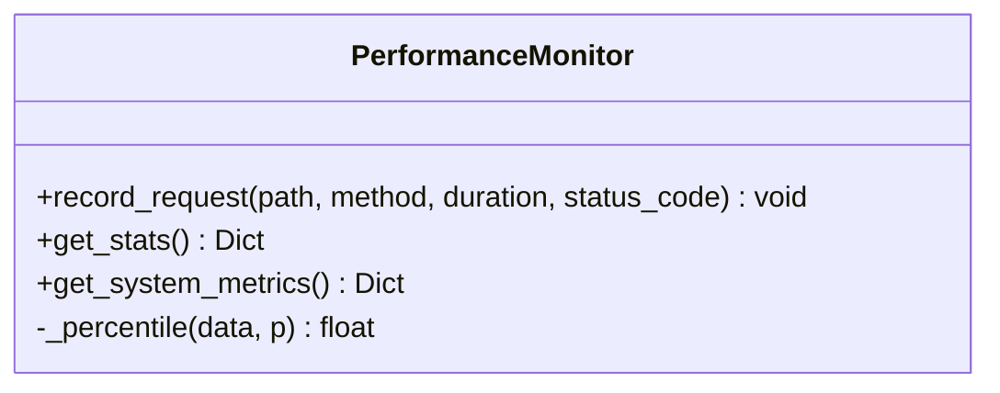

图表来源
- [monitoring.py:13-185](file://utils/monitoring.py#L13-L185)

章节来源
- [monitoring.py:13-185](file://utils/monitoring.py#L13-L185)

### 运行时配置（RuntimeConfig/TTL缓存/MongoDB持久化）
- 预设模式：low/high/custom，强制保留基础能力（embedding启用）。
- 合并与归一化：合并用户覆盖项，确保模式合法。
- 缓存策略：TTL缓存，降低数据库压力。
- API：GET/PUT运行时配置，支持异步/同步读取。

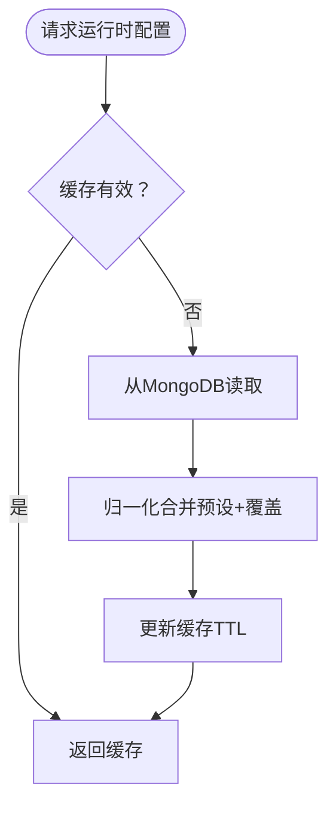

图表来源
- [runtime_config.py:140-217](file://services/runtime_config.py#L140-L217)

章节来源
- [runtime_config.py:140-217](file://services/runtime_config.py#L140-L217)

### 模型选择器（ModelSelector）
- 快速关键词匹配：高置信度直接返回。
- 小模型判断：构建提示词，解析JSON响应，回退关键词匹配。
- 模型选择：公式/知识型模型，温度与长度控制。

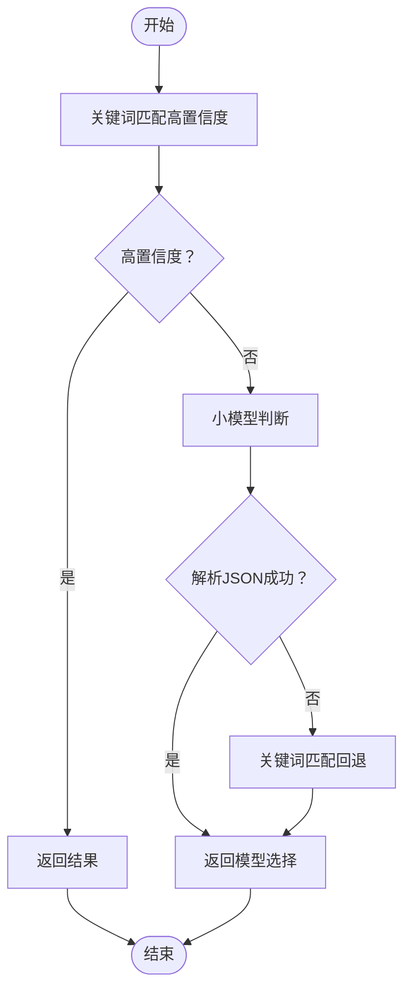

图表来源
- [model_selector.py:51-132](file://services/model_selector.py#L51-L132)

章节来源
- [model_selector.py:10-206](file://services/model_selector.py#L10-L206)

### 提示词链（PromptChain）
- 基础提示词：从数据库或默认值获取，注入工具函数描述。
- 助手特定提示词：作为扩展追加，支持完整系统提示词直接使用。
- 工具函数描述：动态格式化，确保提示词链包含最新工具能力。

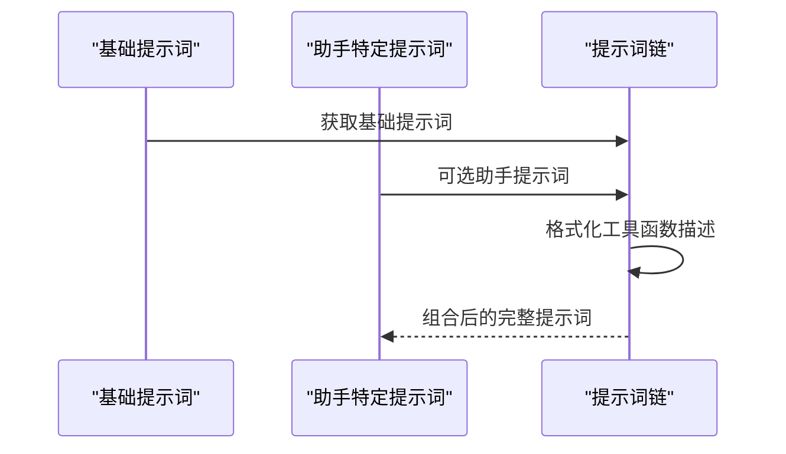

图表来源
- [prompt_chain.py:320-430](file://services/prompt_chain.py#L320-L430)

章节来源
- [prompt_chain.py:6-450](file://services/prompt_chain.py#L6-L450)

### Ollama服务（工具调用解析与执行）
- 工具调用解析：XML格式解析，参数类型转换，自动注入assistant_id。
- 工具执行：异步调用AI工具库，避免事件循环跨loop问题。
- 结果注入：将工具调用结果注入提示词，增强回答准确性。

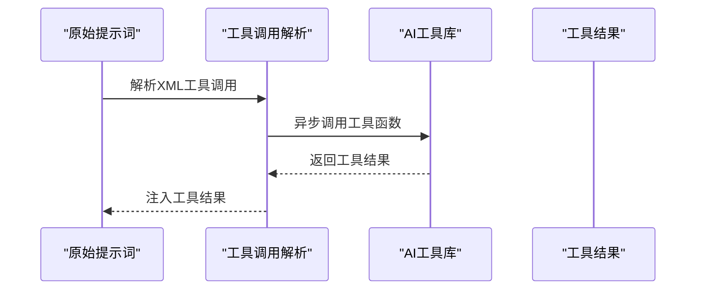

图表来源
- [ollama_service.py:345-451](file://services/ollama_service.py#L345-L451)

章节来源
- [ollama_service.py:345-451](file://services/ollama_service.py#L345-L451)

## 依赖分析
- 组件耦合：AI工具库依赖MongoDB与嵌入服务；提示词链依赖AI工具库；Ollama服务依赖AI工具库与提示词链；运行时配置依赖MongoDB。
- 外部依赖：Ollama（推理/嵌入）、MongoDB（持久化）、Qdrant（向量存储，健康检查依赖）。
- 循环依赖：未发现循环依赖，模块边界清晰。

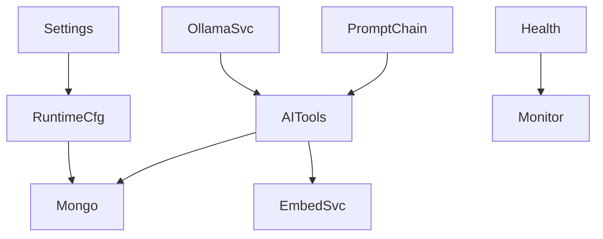

图表来源
- [ai_tools.py:8-8](file://services/ai_tools.py#L8-L8)
- [prompt_chain.py:36-37](file://services/prompt_chain.py#L36-L37)
- [ollama_service.py:357-357](file://services/ollama_service.py#L357-L357)
- [runtime_config.py:149-150](file://services/runtime_config.py#L149-L150)
- [health.py:5-6](file://routers/health.py#L5-L6)
- [settings.py:11-11](file://routers/settings.py#L11-L11)

章节来源
- [mongodb.py:92-204](file://database/mongodb.py#L92-L204)
- [embedding_service.py:8-333](file://embedding/embedding_service.py#L8-L333)

## 性能考量
- 异步与线程池：MongoDB异步工具通过专用异步实现与线程池执行，避免事件循环跨loop与阻塞。
- 缓存策略：运行时配置TTL缓存（默认10秒），降低数据库压力。
- 日志异步：日志写入使用队列与后台监听器，避免阻塞主线程。
- 监控采样：请求耗时仅保留最近1000次，控制内存占用。
- 超时与重试：Ollama嵌入请求带超时与重试，避免长时间阻塞。

[本节为通用性能讨论，无需特定文件来源]

## 故障排查指南
- MongoDB连接失败：检查连接字符串、认证信息、网络可达性；健康检查端点可快速定位问题。
- Ollama服务不可达：确认Ollama服务运行、模型存在、上下文长度限制；嵌入服务对超长文本进行截断。
- 工具调用失败：检查工具名称是否为实际工具函数名称，参数类型是否正确；查看日志中的错误信息。
- 性能告警：慢请求检测与系统指标端点可用于定位瓶颈；检查CPU/内存/磁盘使用情况。
- 运行时配置异常：通过设置路由读取/更新配置，确认MongoDB连接与TTL缓存生效。

章节来源
- [health.py:23-135](file://routers/health.py#L23-L135)
- [embedding_service.py:175-291](file://embedding/embedding_service.py#L175-L291)
- [ai_tools.py:132-195](file://services/ai_tools.py#L132-L195)
- [monitoring.py:163-184](file://utils/monitoring.py#L163-L184)
- [settings.py:31-64](file://routers/settings.py#L31-L64)

## 结论
本工具服务实现以模块化、异步化与可观测性为核心设计原则，通过AI工具库、提示词链、运行时配置与监控体系，构建了可扩展、可维护的工具服务框架。结合Ollama与MongoDB，系统实现了从工具注册、调用、结果处理到性能监控的完整闭环，满足RAG系统在实际部署中的多样化需求。

[本节为总结性内容，无需特定文件来源]

## 附录

### 使用示例与集成指南
- AI工具调用集成
  - 在提示词中注入工具函数描述，使用XML格式调用工具函数。
  - 通过异步调用工具函数，避免事件循环跨loop问题。
  - 参考路径：[提示词链工具描述注入:320-383](file://services/prompt_chain.py#L320-L383)、[工具调用解析与执行:345-451](file://services/ollama_service.py#L345-L451)、[AI工具库:132-195](file://services/ai_tools.py#L132-L195)

- 标题生成集成
  - 使用标题生成器生成对话标题，支持回退策略。
  - 参考路径：[标题生成器:30-117](file://services/title_generator.py#L30-L117)

- 令牌管理集成
  - 使用近似估算与截断函数进行预算控制与文本截断。
  - 参考路径：[令牌工具:16-71](file://utils/token_utils.py#L16-L71)

- 监控集成
  - 使用装饰器或上下文管理器记录请求耗时与状态码。
  - 通过健康检查端点与指标端点获取系统状态。
  - 参考路径：[监控装饰器与上下文:118-184](file://utils/monitoring.py#L118-L184)、[健康检查路由:23-135](file://routers/health.py#L23-L135)

- 运行时配置集成
  - 通过API读取/更新运行时配置，支持低/高/自定义模式。
  - 参考路径：[运行时配置:140-217](file://services/runtime_config.py#L140-L217)、[设置路由:31-64](file://routers/settings.py#L31-L64)

- 模型选择集成
  - 基于关键词与小模型判断选择公式/知识型模型。
  - 参考路径：[模型选择器:51-132](file://services/model_selector.py#L51-L132)

- 向量化集成
  - 使用Ollama嵌入模型进行文本向量化，支持维度探测与重试。
  - 参考路径：[向量化服务:292-318](file://embedding/embedding_service.py#L292-L318)