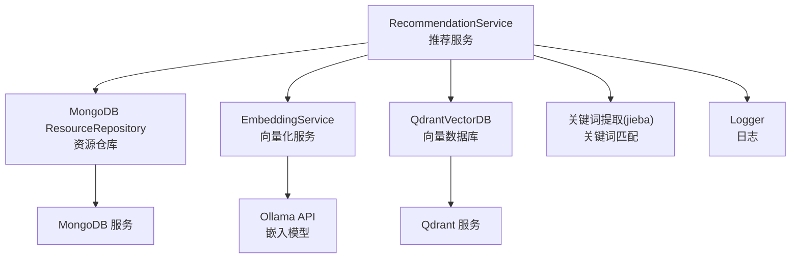
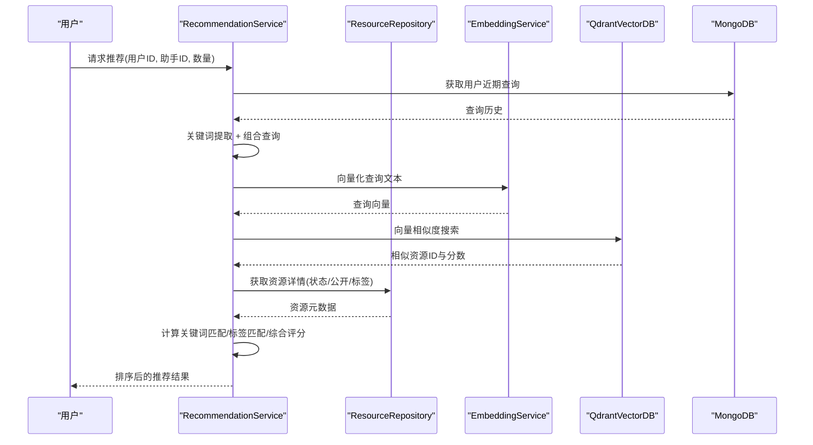
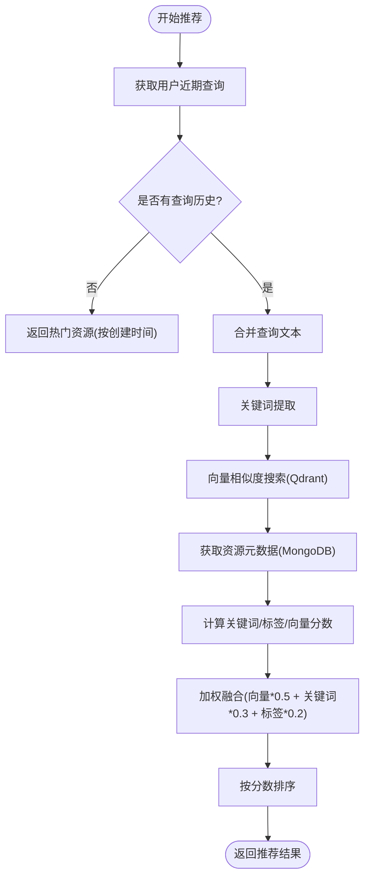
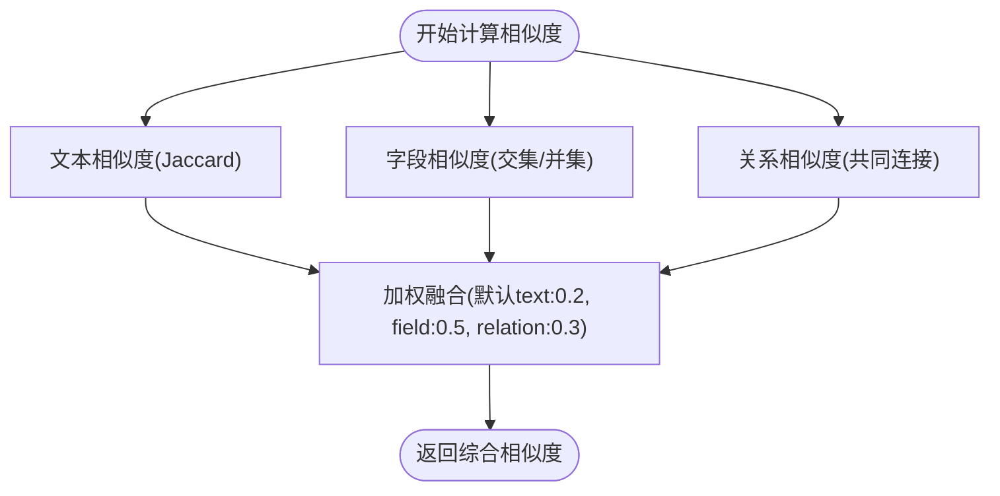
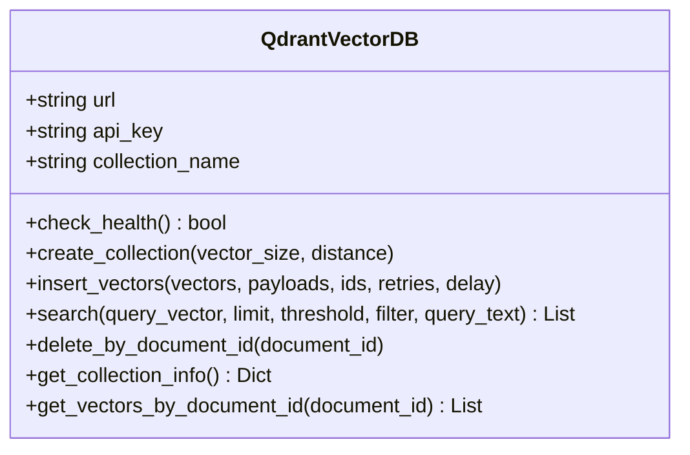
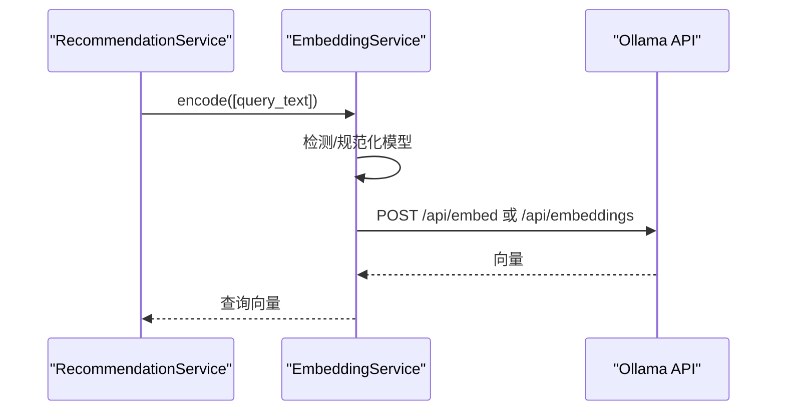
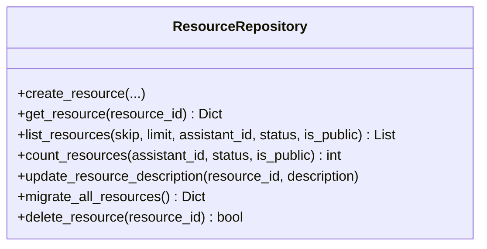
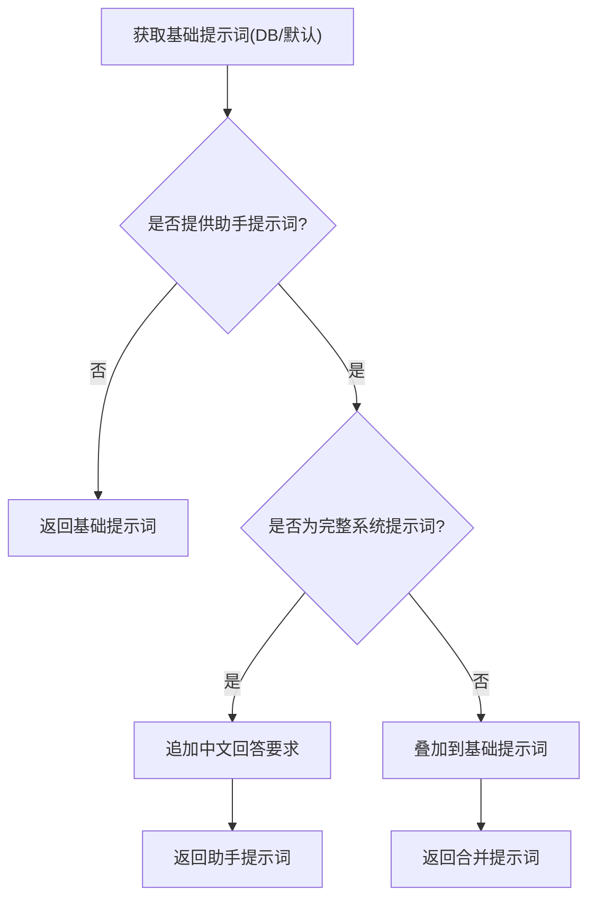
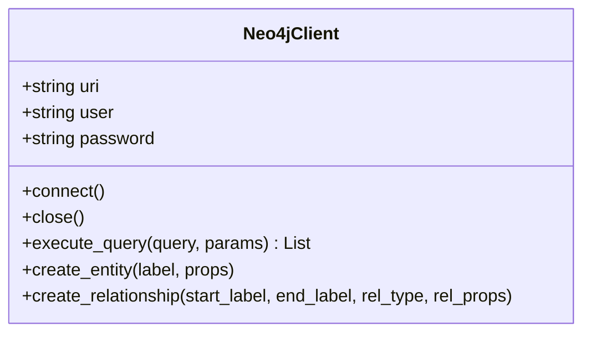
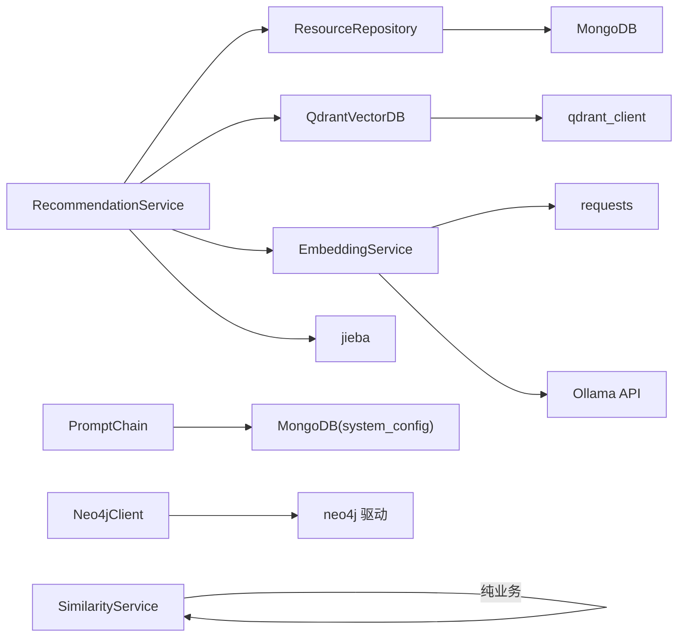

# 推荐服务实现

<cite>
**本文档引用的文件**
- [recommendation_service.py](file://services/recommendation_service.py)
- [neo4j_client.py](file://database/neo4j_client.py)
- [prompt_chain.py](file://services/prompt_chain.py)
- [similarity_service.py](file://services/similarity_service.py)
- [embedding_service.py](file://embedding/embedding_service.py)
- [qdrant_client.py](file://database/qdrant_client.py)
- [mongodb.py](file://database/mongodb.py)
- [resource.py](file://models/resource.py)
- [user.py](file://models/user.py)
- [retrieval.py](file://routers/retrieval.py)
</cite>

## 目录
1. [引言](#引言)
2. [项目结构](#项目结构)
3. [核心组件](#核心组件)
4. [架构概览](#架构概览)
5. [详细组件分析](#详细组件分析)
6. [依赖关系分析](#依赖关系分析)
7. [性能考量](#性能考量)
8. [故障排查指南](#故障排查指南)
9. [结论](#结论)
10. [附录](#附录)

## 引言
本文件面向推荐服务实现，系统性梳理个性化推荐算法与工程实现，涵盖关键词匹配、向量相似度、混合策略、用户画像与相似度计算、候选生成与排序优化等核心能力。同时，文档阐述与向量数据库（Qdrant）、关系数据库（MongoDB）以及提示链（Prompt Chain）的集成方式，并给出推荐效果评估、A/B测试与实时推荐的实践建议。

## 项目结构
推荐服务位于 `services/recommendation_service.py`，围绕资源推荐与相似资源推荐两大主流程展开，配合向量数据库（Qdrant）、向量化服务（EmbeddingService）、资源仓库（ResourceRepository）与用户查询历史获取等模块协作。

图表来源
- [recommendation_service.py:1-481](file://services/recommendation_service.py#L1-L481)
- [qdrant_client.py:1-544](file://database/qdrant_client.py#L1-L544)
- [embedding_service.py:1-333](file://embedding/embedding_service.py#L1-L333)
- [mongodb.py:860-1341](file://database/mongodb.py#L860-L1341)

章节来源
- [recommendation_service.py:1-481](file://services/recommendation_service.py#L1-L481)
- [qdrant_client.py:1-544](file://database/qdrant_client.py#L1-L544)
- [embedding_service.py:1-333](file://embedding/embedding_service.py#L1-L333)
- [mongodb.py:860-1341](file://database/mongodb.py#L860-L1341)

## 核心组件
- 推荐服务（RecommendationService）：实现用户画像（近期查询）构建、关键词提取、向量相似度搜索、混合评分与排序、相似资源推荐等。
- 向量数据库（QdrantVectorDB）：封装 Qdrant 客户端，提供集合管理、向量插入、相似度搜索、健康检查等能力。
- 向量化服务（EmbeddingService）：封装 Ollama 嵌入模型调用，支持模型检测、重试与超时控制、向量维度缓存。
- 资源仓库（ResourceRepository）：提供资源的创建、查询、计数、迁移与删除等操作，支撑推荐结果的元数据与状态过滤。
- 相似度服务（SimilarityService）：提供用户画像相似度计算（文本重叠、字段匹配、关系相似度）的通用能力，为用户协同过滤奠定基础。
- 提示链（PromptChain）：提供基础提示词与助手特定提示词的叠加机制，支持模板管理与动态生成，服务于问答与推荐的上下文增强。
- 图数据库（Neo4jClient）：提供 Cypher 查询、实体创建与关系建立能力，为图算法（如路径分析、社区发现）提供基础。

章节来源
- [recommendation_service.py:11-481](file://services/recommendation_service.py#L11-L481)
- [qdrant_client.py:18-544](file://database/qdrant_client.py#L18-L544)
- [embedding_service.py:8-333](file://embedding/embedding_service.py#L8-L333)
- [mongodb.py:860-1341](file://database/mongodb.py#L860-L1341)
- [similarity_service.py:8-276](file://services/similarity_service.py#L8-L276)
- [prompt_chain.py:6-450](file://services/prompt_chain.py#L6-L450)
- [neo4j_client.py:6-104](file://database/neo4j_client.py#L6-L104)

## 架构概览
推荐服务采用“混合策略”：以用户近期查询构建画像，结合关键词匹配与向量相似度，形成多路信号融合的综合评分，最终按分数排序输出推荐结果。向量检索通过 Qdrant 完成，向量生成由 EmbeddingService 调用 Ollama 模型实现。资源元数据与状态由 MongoDB 的 ResourceRepository 提供，关键词提取使用 jieba。

图表来源
- [recommendation_service.py:209-360](file://services/recommendation_service.py#L209-L360)
- [qdrant_client.py:336-414](file://database/qdrant_client.py#L336-L414)
- [embedding_service.py:292-318](file://embedding/embedding_service.py#L292-L318)
- [mongodb.py:1041-1079](file://database/mongodb.py#L1041-L1079)

## 详细组件分析

### 推荐服务（RecommendationService）
- 用户画像构建：从对话历史中提取用户最近的消息，过滤短消息，合并为查询文本。
- 关键词提取与匹配：使用 jieba 提取关键词，分别计算资源描述与标签的关键词匹配分数。
- 向量相似度搜索：将查询文本向量化后在 Qdrant 中搜索，聚合同一资源的最高分数。
- 混合评分与排序：向量分数权重0.5，关键词匹配0.3，标签匹配0.2；若无向量结果则退化为关键词+标签的组合评分。
- 相似资源推荐：基于资源标题、描述、标签构建查询，排除自身后按向量分数与关键词匹配综合排序。

图表来源
- [recommendation_service.py:209-360](file://services/recommendation_service.py#L209-L360)

章节来源
- [recommendation_service.py:24-360](file://services/recommendation_service.py#L24-L360)

### 相似度服务（SimilarityService）
- 文本相似度：基于用户 bio、personality、full_name 等文本字段，计算 Jaccard 相似度。
- 字段相似度：对 research_fields、skills、college、major、user_type、interests 等字段进行匹配度计算，支持可配置权重。
- 关系相似度：基于用户之间的共同连接计算 Jaccard 相似度。
- 综合相似度：对文本、字段、关系三类相似度进行加权融合。

图表来源
- [similarity_service.py:15-275](file://services/similarity_service.py#L15-L275)

章节来源
- [similarity_service.py:8-276](file://services/similarity_service.py#L8-L276)

### 向量数据库（QdrantVectorDB）
- 健康检查：通过获取集合列表验证服务可用性。
- 集合管理：自动检测维度不匹配并重建集合，支持 gRPC 连接与连接池优化。
- 向量插入：支持重试机制与维度错误自动重建，ID 规范化为 UUID。
- 相似度搜索：支持过滤条件、阈值与查询向量，自动处理集合不存在的场景。

图表来源
- [qdrant_client.py:18-544](file://database/qdrant_client.py#L18-L544)

章节来源
- [qdrant_client.py:18-544](file://database/qdrant_client.py#L18-L544)

### 向量化服务（EmbeddingService）
- 模型检测：自动扫描可用模型，支持规范化模型名称与标签处理。
- 嵌入调用：兼容新旧接口，支持重试与超时控制，首调缓存向量维度。
- 环境适配：容器内访问宿主机服务的 URI 替换逻辑，避免 localhost DNS 解析问题。

图表来源
- [embedding_service.py:175-318](file://embedding/embedding_service.py#L175-L318)

章节来源
- [embedding_service.py:8-333](file://embedding/embedding_service.py#L8-L333)

### 资源仓库（ResourceRepository）
- 资源 CRUD：创建、查询、计数、更新、删除，支持 schema 版本迁移。
- 列表与过滤：支持按 assistant_id、status、is_public 过滤与分页。
- 版本迁移：自动迁移旧版本资源字段，保证向量检索与前端展示一致性。

图表来源
- [mongodb.py:860-1341](file://database/mongodb.py#L860-L1341)

章节来源
- [mongodb.py:860-1341](file://database/mongodb.py#L860-L1341)
- [resource.py:8-90](file://models/resource.py#L8-L90)

### 提示链（PromptChain）
- 基础提示词：从数据库读取或使用默认模板，统一回答格式与工具函数说明。
- 助手提示词：支持将特定课程方向与教学重点作为扩展叠加，或直接使用完整系统提示词。
- 工具函数描述：动态注入可用工具函数清单，便于在提示词中调用。

图表来源
- [prompt_chain.py:9-430](file://services/prompt_chain.py#L9-L430)

章节来源
- [prompt_chain.py:6-450](file://services/prompt_chain.py#L6-L450)

### 图数据库（Neo4jClient）
- 连接管理：支持容器内 URI 替换，自动验证连接。
- 查询执行：封装 Cypher 查询与参数化执行，返回字典列表。
- 实体与关系：提供 MERGE 创建实体与关系的便捷方法，支持属性设置。

图表来源
- [neo4j_client.py:6-104](file://database/neo4j_client.py#L6-L104)

章节来源
- [neo4j_client.py:6-104](file://database/neo4j_client.py#L6-L104)

## 依赖关系分析
- RecommendationService 依赖：
  - MongoDB ResourceRepository：资源元数据与状态过滤
  - QdrantVectorDB：向量相似度搜索
  - EmbeddingService：查询文本向量化
  - jieba：关键词提取
- QdrantVectorDB 依赖：
  - qdrant_client：Qdrant SDK
  - 环境变量：QDRANT_URL、QDRANT_API_KEY、QDRANT_TIMEOUT、QDRANT_GRPC_PORT
- EmbeddingService 依赖：
  - requests：HTTP 客户端
  - Ollama API：/api/embed 与 /api/embeddings
  - 环境变量：OLLAMA_BASE_URL、OLLAMA_EMBEDDING_MODEL、OLLAMA_EMBEDDING_MAX_CHARS
- ResourceRepository 依赖：
  - MongoDBClient：同步客户端
  - 资源集合：resources
- SimilarityService：纯业务逻辑，无外部依赖
- PromptChain：依赖数据库读取与工具函数 Schema 注入
- Neo4jClient：依赖 neo4j 驱动与环境变量

图表来源
- [recommendation_service.py:1-10](file://services/recommendation_service.py#L1-L10)
- [qdrant_client.py:1-16](file://database/qdrant_client.py#L1-L16)
- [embedding_service.py:1-6](file://embedding/embedding_service.py#L1-L6)
- [mongodb.py:1-11](file://database/mongodb.py#L1-L11)
- [similarity_service.py:1-6](file://services/similarity_service.py#L1-L6)
- [prompt_chain.py:1-4](file://services/prompt_chain.py#L1-L4)
- [neo4j_client.py:1-6](file://database/neo4j_client.py#L1-L6)

章节来源
- [recommendation_service.py:1-10](file://services/recommendation_service.py#L1-L10)
- [qdrant_client.py:1-16](file://database/qdrant_client.py#L1-L16)
- [embedding_service.py:1-6](file://embedding/embedding_service.py#L1-L6)
- [mongodb.py:1-11](file://database/mongodb.py#L1-L11)
- [similarity_service.py:1-6](file://services/similarity_service.py#L1-L6)
- [prompt_chain.py:1-4](file://services/prompt_chain.py#L1-L4)
- [neo4j_client.py:1-6](file://database/neo4j_client.py#L1-L6)

## 性能考量
- 向量搜索优化
  - 使用 Qdrant 的 score_threshold 与 limit 控制召回规模，减少下游处理开销。
  - gRPC 连接与连接池配置（prefer_grpc、timeout）提升高并发稳定性。
  - 集合维度与向量维度一致性检查，避免插入失败与重试风暴。
- 向量化服务优化
  - 首次调用缓存向量维度，避免重复探测。
  - 超长文本截断与重试机制，降低 Ollama 超上下文错误概率。
  - 模型名称规范化，减少 API 调用失败。
- 推荐流程优化
  - 无向量结果时启用关键词+标签组合评分，保证覆盖率。
  - 资源状态与公开性过滤前置，减少无效计算。
  - 关键词提取 top_k 与向量搜索 limit 的平衡，兼顾精度与性能。
- 数据库连接优化
  - MongoDB 连接池参数（maxPoolSize、minPoolSize、serverSelectionTimeoutMS 等）按负载调优。
  - Neo4j 连接自动替换容器内 URI，避免 DNS 解析问题。

章节来源
- [qdrant_client.py:66-123](file://database/qdrant_client.py#L66-L123)
- [embedding_service.py:175-318](file://embedding/embedding_service.py#L175-L318)
- [recommendation_service.py:136-207](file://services/recommendation_service.py#L136-L207)
- [mongodb.py:122-136](file://database/mongodb.py#L122-L136)
- [neo4j_client.py:16-38](file://database/neo4j_client.py#L16-L38)

## 故障排查指南
- Qdrant 连接失败
  - 现象：健康检查失败、搜索异常。
  - 排查：确认 QDRANT_URL、QDRANT_API_KEY、网络可达性；检查 gRPC 端口与 prefer_grpc 配置。
  - 参考：[qdrant_client.py:124-138](file://database/qdrant_client.py#L124-L138)
- Ollama 模型不可用
  - 现象：嵌入请求失败、模型未找到。
  - 排查：确认 OLLAMA_BASE_URL、OLLAMA_EMBEDDING_MODEL；使用 _detect_ollama_embedding_model 自动检测。
  - 参考：[embedding_service.py:107-154](file://embedding/embedding_service.py#L107-L154)
- MongoDB 连接异常
  - 现象：连接失败、Ping 失败。
  - 排查：核对 MONGODB_URI/MONGODB_HOST/PORT/USERNAME/PASSWORD/AUTH_SOURCE；检查容器内 URI 替换逻辑。
  - 参考：[mongodb.py:99-184](file://database/mongodb.py#L99-L184)
- 推荐结果为空
  - 现象：无向量结果或无查询历史。
  - 排查：检查 Qdrant 集合是否存在与维度匹配；确认用户对话历史是否足够；关键词提取阈值与过滤条件。
  - 参考：[recommendation_service.py:226-252](file://services/recommendation_service.py#L226-L252)

章节来源
- [qdrant_client.py:124-138](file://database/qdrant_client.py#L124-L138)
- [embedding_service.py:107-154](file://embedding/embedding_service.py#L107-L154)
- [mongodb.py:99-184](file://database/mongodb.py#L99-L184)
- [recommendation_service.py:226-252](file://services/recommendation_service.py#L226-L252)

## 结论
推荐服务通过“关键词匹配 + 向量相似度”的混合策略，结合用户画像与资源元数据，实现了稳定高效的个性化推荐。向量检索与向量化服务的工程化封装提升了可用性与鲁棒性；资源仓库的版本迁移与状态过滤保障了推荐结果的一致性与安全性。未来可在以下方面持续优化：引入用户协同过滤与图算法（Neo4j）增强冷启动与多样性；完善 A/B 测试与评估体系；扩展提示链在推荐解释与上下文增强中的应用。

## 附录

### 推荐效果评估与 A/B 测试
- 评估指标
  - 召回率（Recall@K）：推荐列表中与用户行为相关的资源占比。
  - 精准率（Precision@K）：推荐列表中相关资源占比。
  - 覆盖率（Coverage）：被推荐的资源占总资源的比例。
  - 多样性（Diversity）：推荐列表的多样性与新颖性。
  - 响应时间（Latency）：从请求到返回的时间。
- A/B 测试
  - 将用户随机分为对照组与实验组，分别采用不同推荐策略或阈值。
  - 通过点击率、停留时长、转化率等行为指标评估策略差异显著性。
  - 建议使用统计检验（如卡方检验）验证结果稳健性。

### 实时推荐
- 实时触发：在用户输入或浏览行为发生时，触发推荐计算与缓存更新。
- 缓存策略：热点资源与热门标签预热，降低实时计算压力。
- 降级策略：当向量服务或数据库不可用时，启用关键词匹配与热门资源兜底。

### 配置示例（环境变量）
- Qdrant
  - QDRANT_URL：向量数据库地址（默认 http://localhost:6333）
  - QDRANT_API_KEY：API 密钥（可选）
  - QDRANT_TIMEOUT：连接超时（秒）
  - QDRANT_GRPC_PORT：gRPC 端口（默认 6334）
- Ollama
  - OLLAMA_BASE_URL：Ollama 服务地址（默认 http://127.0.0.1:11434）
  - OLLAMA_EMBEDDING_MODEL：嵌入模型名称（如 nomic-embed-text）
  - OLLAMA_EMBEDDING_MAX_CHARS：嵌入文本最大字符数（默认 2000）
- MongoDB
  - MONGODB_URI 或 MONGODB_HOST/PORT/USERNAME/PASSWORD/AUTH_SOURCE：数据库连接参数
  - MONGODB_MAX_POOL_SIZE、MONGODB_MIN_POOL_SIZE、MONGODB_SERVER_SELECTION_TIMEOUT_MS 等：连接池参数

章节来源
- [qdrant_client.py:35-96](file://database/qdrant_client.py#L35-L96)
- [embedding_service.py:21-44](file://embedding/embedding_service.py#L21-L44)
- [mongodb.py:101-136](file://database/mongodb.py#L101-L136)