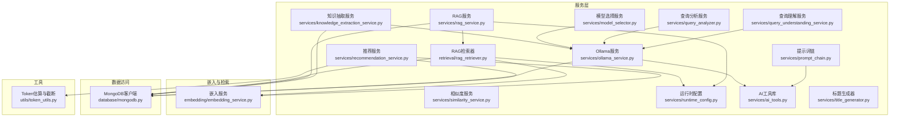
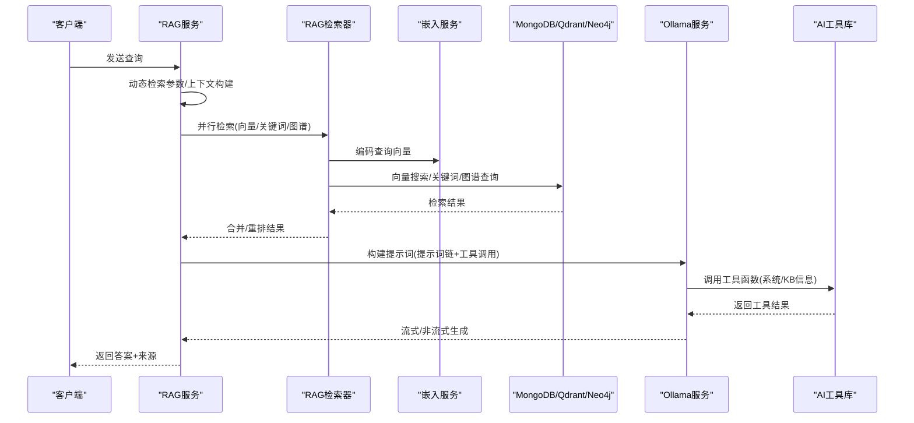
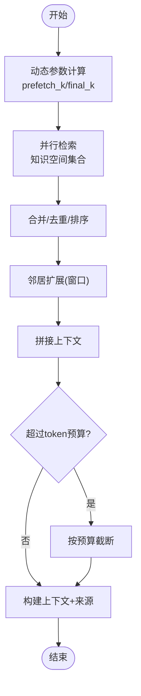
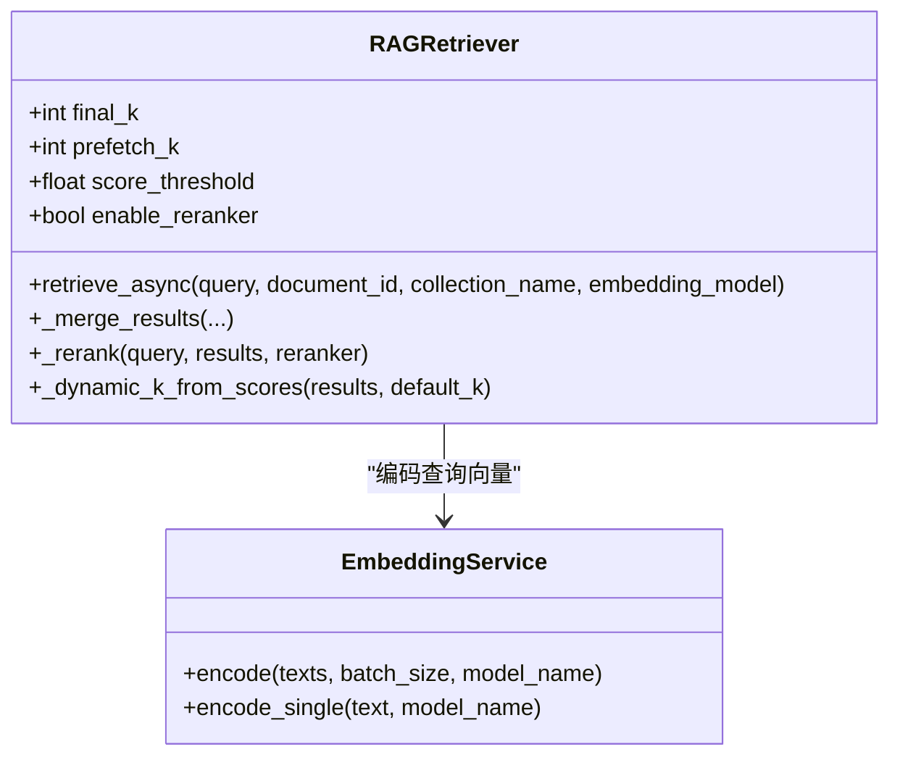
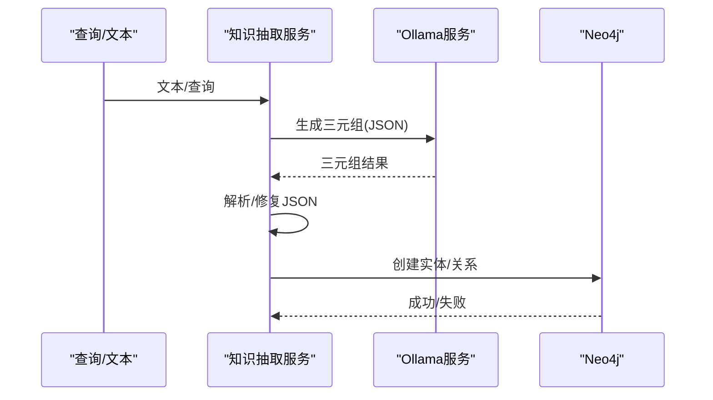
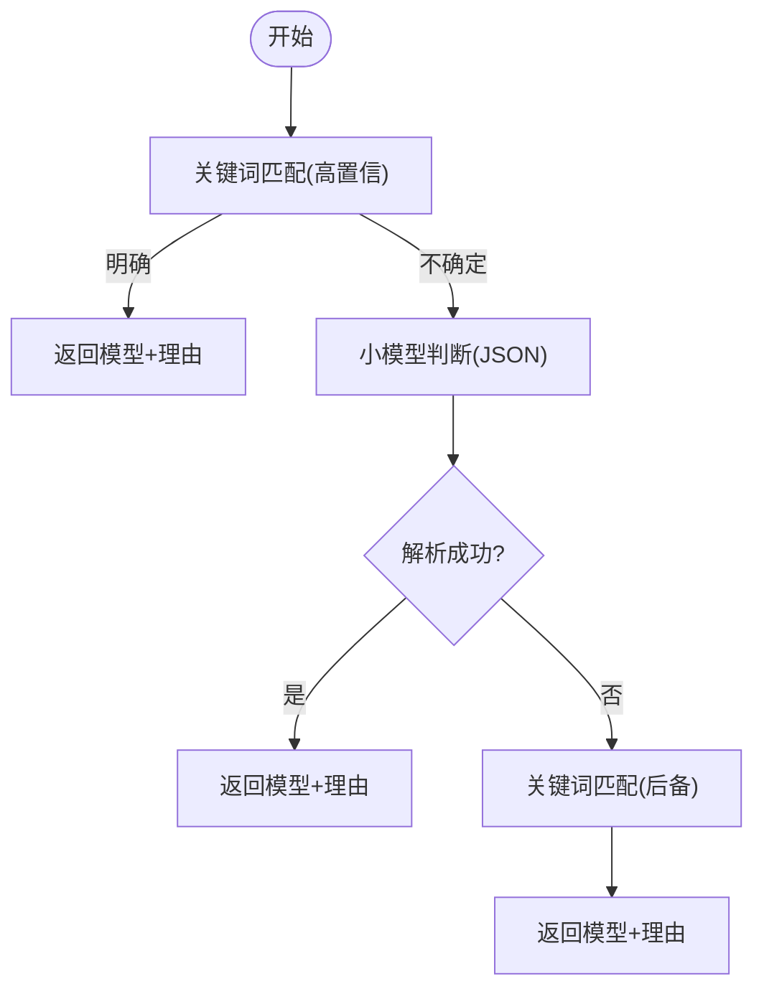
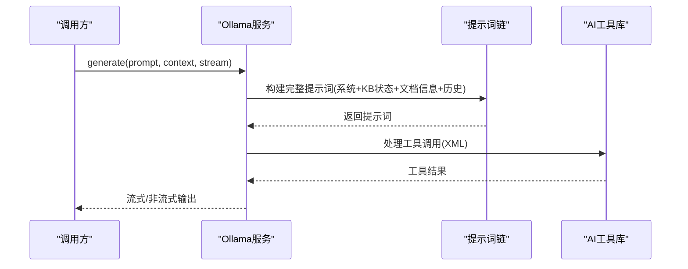
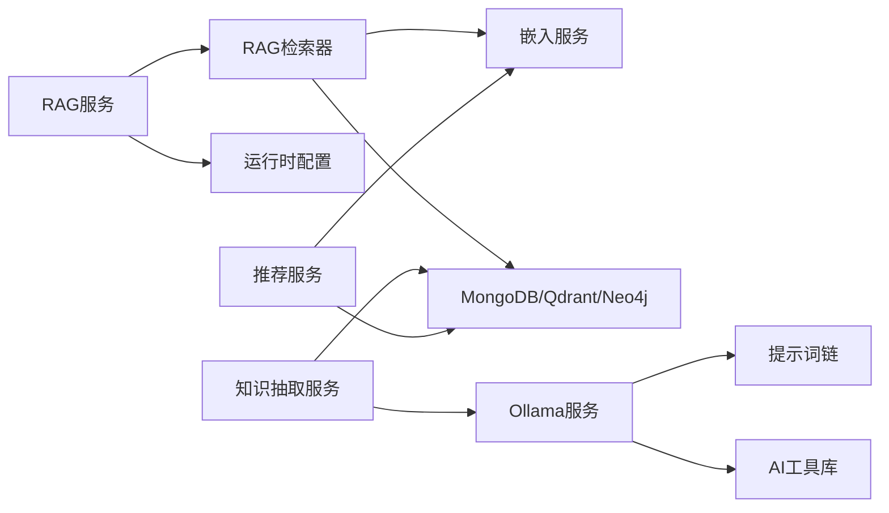

# 服务层实现

<cite>
**本文引用的文件**
- [services/rag_service.py](file://services/rag_service.py)
- [retrieval/rag_retriever.py](file://retrieval/rag_retriever.py)
- [services/knowledge_extraction_service.py](file://services/knowledge_extraction_service.py)
- [services/model_selector.py](file://services/model_selector.py)
- [services/query_analyzer.py](file://services/query_analyzer.py)
- [services/similarity_service.py](file://services/similarity_service.py)
- [services/ollama_service.py](file://services/ollama_service.py)
- [services/recommendation_service.py](file://services/recommendation_service.py)
- [services/runtime_config.py](file://services/runtime_config.py)
- [services/prompt_chain.py](file://services/prompt_chain.py)
- [services/ai_tools.py](file://services/ai_tools.py)
- [embedding/embedding_service.py](file://embedding/embedding_service.py)
- [database/mongodb.py](file://database/mongodb.py)
- [services/query_understanding_service.py](file://services/query_understanding_service.py)
- [services/title_generator.py](file://services/title_generator.py)
- [utils/token_utils.py](file://utils/token_utils.py)
</cite>

## 目录
1. [简介](#简介)
2. [项目结构](#项目结构)
3. [核心组件](#核心组件)
4. [架构总览](#架构总览)
5. [详细组件分析](#详细组件分析)
6. [依赖分析](#依赖分析)
7. [性能考量](#性能考量)
8. [故障排查指南](#故障排查指南)
9. [结论](#结论)
10. [附录](#附录)

## 简介
本文件面向 Advanced RAG 服务层，系统化梳理其架构设计、职责划分与关键实现，覆盖业务逻辑封装、数据转换、外部服务集成、检索优化、知识抽取、模型选择、嵌入服务、查询分析、相似度计算、推荐与提示词链等模块。文档旨在帮助开发者快速理解服务层如何协同工作，支撑高质量的 RAG 问答与知识服务。

## 项目结构
服务层位于 services/ 目录，围绕 RAG 主流程（检索-生成-后处理）组织，配合 retrieval/ 检索器、embedding/ 嵌入服务、database/ 数据访问层与 utils/ 工具模块，形成清晰的分层与职责边界。

图表来源
- [services/rag_service.py:1-323](file://services/rag_service.py#L1-L323)
- [retrieval/rag_retriever.py:1-393](file://retrieval/rag_retriever.py#L1-L393)
- [services/knowledge_extraction_service.py:1-229](file://services/knowledge_extraction_service.py#L1-L229)
- [services/model_selector.py:1-206](file://services/model_selector.py#L1-L206)
- [services/query_analyzer.py:1-163](file://services/query_analyzer.py#L1-L163)
- [services/similarity_service.py:1-276](file://services/similarity_service.py#L1-L276)
- [services/ollama_service.py:1-674](file://services/ollama_service.py#L1-L674)
- [services/recommendation_service.py:1-481](file://services/recommendation_service.py#L1-L481)
- [services/runtime_config.py:1-218](file://services/runtime_config.py#L1-L218)
- [services/prompt_chain.py:1-450](file://services/prompt_chain.py#L1-L450)
- [services/ai_tools.py:1-498](file://services/ai_tools.py#L1-L498)
- [embedding/embedding_service.py:1-333](file://embedding/embedding_service.py#L1-L333)
- [database/mongodb.py:1-200](file://database/mongodb.py#L1-L200)
- [services/query_understanding_service.py:1-248](file://services/query_understanding_service.py#L1-L248)
- [services/title_generator.py:1-123](file://services/title_generator.py#L1-L123)
- [utils/token_utils.py:1-72](file://utils/token_utils.py#L1-L72)

章节来源
- [services/rag_service.py:1-323](file://services/rag_service.py#L1-L323)
- [retrieval/rag_retriever.py:1-393](file://retrieval/rag_retriever.py#L1-L393)
- [services/runtime_config.py:1-218](file://services/runtime_config.py#L1-L218)

## 核心组件
- RAG服务：封装检索与上下文构建、动态检索参数、邻居扩展、上下文截断与回退策略。
- RAG检索器：混合检索（向量/关键词/图谱）+ 动态裁剪 + 可选重排。
- 知识抽取服务：基于 Ollama 的三元组抽取与 Neo4j 图谱构建。
- 模型选择服务：基于关键词与轻量模型的快速判断，回退到关键词匹配。
- 查询分析服务：判断是否需要检索，关键词回退。
- 相似度服务：文本、字段与关系的综合相似度计算。
- Ollama服务：提示词链构建、工具函数调用、流式/非流式生成、超时与重试。
- 推荐服务：关键词+向量+标签的混合推荐，向量搜索与本地资源库结合。
- 运行时配置：全局模块开关与参数缓存，支持 low/high/custom 模式。
- 提示词链：基础提示词与助手特定提示词叠加，工具描述注入。
- AI工具库：提供系统信息、知识库统计、模型列表等工具函数。
- 嵌入服务：Ollama 嵌入模型检测、规范化、批量编码与重试。
- 查询理解服务：将自然语言查询结构化为搜索条件。
- 标题生成器：基于小模型生成对话标题。
- Token工具：近似估算与按预算截断。

章节来源
- [services/rag_service.py:8-323](file://services/rag_service.py#L8-L323)
- [retrieval/rag_retriever.py:17-393](file://retrieval/rag_retriever.py#L17-L393)
- [services/knowledge_extraction_service.py:12-229](file://services/knowledge_extraction_service.py#L12-L229)
- [services/model_selector.py:10-206](file://services/model_selector.py#L10-L206)
- [services/query_analyzer.py:9-163](file://services/query_analyzer.py#L9-L163)
- [services/similarity_service.py:8-276](file://services/similarity_service.py#L8-L276)
- [services/ollama_service.py:9-674](file://services/ollama_service.py#L9-L674)
- [services/recommendation_service.py:11-481](file://services/recommendation_service.py#L11-L481)
- [services/runtime_config.py:12-218](file://services/runtime_config.py#L12-L218)
- [services/prompt_chain.py:6-450](file://services/prompt_chain.py#L6-L450)
- [services/ai_tools.py:11-498](file://services/ai_tools.py#L11-L498)
- [embedding/embedding_service.py:8-333](file://embedding/embedding_service.py#L8-L333)
- [services/query_understanding_service.py:9-248](file://services/query_understanding_service.py#L9-L248)
- [services/title_generator.py:9-123](file://services/title_generator.py#L9-L123)
- [utils/token_utils.py:7-72](file://utils/token_utils.py#L7-L72)

## 架构总览
服务层围绕“检索-生成-后处理”闭环协作，通过运行时配置控制模块开关，通过提示词链与工具函数增强生成可控性，通过嵌入与检索器实现高效知识召回，通过知识抽取与图谱提升语义关联。

图表来源
- [services/rag_service.py:34-126](file://services/rag_service.py#L34-L126)
- [retrieval/rag_retriever.py:89-137](file://retrieval/rag_retriever.py#L89-L137)
- [embedding/embedding_service.py:292-318](file://embedding/embedding_service.py#L292-L318)
- [services/ollama_service.py:94-273](file://services/ollama_service.py#L94-L273)
- [services/ai_tools.py:155-196](file://services/ai_tools.py#L155-L196)

## 详细组件分析

### RAG服务（检索与上下文构建）
- 动态检索参数：基于查询长度、对比/列举/条款类关键词，动态调整 prefetch_k 与 final_k，平衡召回与精度。
- 并行检索：同时检索知识空间集合，合并结果并去重，按最高分保留每文档的 chunk。
- 邻居扩展：对命中 chunk 周围窗口进行补齐，增强上下文完整性。
- 上下文截断：基于近似 token 估算与上限控制，避免 prompt 过大。
- 回退策略：检索失败时可选择回退到不使用上下文继续生成。

图表来源
- [services/rag_service.py:11-32](file://services/rag_service.py#L11-L32)
- [services/rag_service.py:98-126](file://services/rag_service.py#L98-L126)
- [services/rag_service.py:128-266](file://services/rag_service.py#L128-L266)
- [utils/token_utils.py:16-71](file://utils/token_utils.py#L16-L71)

章节来源
- [services/rag_service.py:8-323](file://services/rag_service.py#L8-L323)
- [utils/token_utils.py:16-71](file://utils/token_utils.py#L16-L71)

### RAG检索器（混合检索与重排）
- 检索策略：向量检索、关键词检索、图谱检索三路并行，结果合并与初步去重。
- 重排：可选 CrossEncoder 重排，动态 k 调整（基于 top1 与 topN 分数差距）。
- 运行时开关：受运行时配置控制，可禁用重排与图谱检索。
- 环境变量：ENABLE_RERANKER、RERANKER_MODEL、RERANKER_DEVICE、DYNK_* 等。

图表来源
- [retrieval/rag_retriever.py:17-137](file://retrieval/rag_retriever.py#L17-L137)
- [embedding/embedding_service.py:292-318](file://embedding/embedding_service.py#L292-L318)

章节来源
- [retrieval/rag_retriever.py:17-393](file://retrieval/rag_retriever.py#L17-L393)
- [services/runtime_config.py:140-161](file://services/runtime_config.py#L140-L161)

### 知识抽取服务（三元组抽取与图谱构建）
- 三元组抽取：基于模板提示词，强制 JSON 输出，解析鲁棒性处理（markdown 代码块、单对象等）。
- 实体抽取：从查询中提取关键实体，用于图谱检索。
- Neo4j 构建：三元组落库，实体/关系规范化，连接失败冷却避免刷屏。

图表来源
- [services/knowledge_extraction_service.py:36-229](file://services/knowledge_extraction_service.py#L36-L229)
- [services/ollama_service.py:50-93](file://services/ollama_service.py#L50-L93)

章节来源
- [services/knowledge_extraction_service.py:12-229](file://services/knowledge_extraction_service.py#L12-L229)

### 模型选择服务（决策机制）
- 快速关键词匹配：高置信度优先，覆盖公式/知识两类关键词集合。
- 轻量模型判断：使用小模型进行 JSON 输出解析，失败回退关键词匹配。
- 模型名称规范化：基于环境变量与 Ollama 模型列表匹配，保证可用性。

图表来源
- [services/model_selector.py:51-132](file://services/model_selector.py#L51-L132)
- [services/model_selector.py:133-200](file://services/model_selector.py#L133-L200)

章节来源
- [services/model_selector.py:10-206](file://services/model_selector.py#L10-L206)

### 查询分析服务（是否需要检索）
- 小模型快速判断：JSON 输出，解析失败回退关键词匹配。
- 关键词策略：区分一般性对话与需要知识库的查询，安全策略默认需要检索。

章节来源
- [services/query_analyzer.py:9-163](file://services/query_analyzer.py#L9-L163)

### 相似度服务（用户/资源相似度）
- 文本相似度：Jaccard 系数（词汇重叠）。
- 字段相似度：研究领域/技能/学院/专业/用户类型/兴趣等加权匹配。
- 关系相似度：共同连接的 Jaccard 相似度。
- 综合相似度：文本/字段/关系加权聚合。

章节来源
- [services/similarity_service.py:8-276](file://services/similarity_service.py#L8-L276)

### Ollama服务（提示词链、工具调用、流式生成）
- 提示词链：基础提示词 + 助手特定提示词叠加，工具描述注入。
- 工具函数：系统信息、知识库文档/统计、模型列表等，支持异步调用。
- 生成：流式/非流式，超时与重试，空闲超时保护，异常透传。
- 事件循环：线程池隔离同步 IO，避免跨 loop 问题。

图表来源
- [services/ollama_service.py:94-273](file://services/ollama_service.py#L94-L273)
- [services/prompt_chain.py:386-431](file://services/prompt_chain.py#L386-L431)
- [services/ai_tools.py:155-196](file://services/ai_tools.py#L155-L196)

章节来源
- [services/ollama_service.py:9-674](file://services/ollama_service.py#L9-L674)
- [services/prompt_chain.py:6-450](file://services/prompt_chain.py#L6-L450)
- [services/ai_tools.py:11-498](file://services/ai_tools.py#L11-L498)

### 推荐服务（资源推荐）
- 混合算法：用户近期查询关键词 + 向量相似度 + 标签匹配，综合打分。
- 向量搜索：基于 Qdrant，按集合名称检索资源向量，去重取最高分。
- 无向量时回退：关键词匹配所有资源，设定最低阈值。
- 个性化：支持按助手 ID 过滤，返回结构化推荐结果。

章节来源
- [services/recommendation_service.py:11-481](file://services/recommendation_service.py#L11-L481)

### 运行时配置（模块开关与参数）
- 模式：low/high/custom，内置默认模块与参数。
- 缓存：TTL 缓存，异步读取，支持强制刷新。
- 合并：覆盖合并策略，强制基础能力（如 embedding 始终开启）。

章节来源
- [services/runtime_config.py:12-218](file://services/runtime_config.py#L12-L218)

### 提示词链与AI工具库
- 提示词链：基础提示词 + 助手特定提示词，工具描述注入，统一中文输出要求。
- AI工具：系统信息、知识库文档/统计、模型列表，支持异步调用与参数过滤。

章节来源
- [services/prompt_chain.py:6-450](file://services/prompt_chain.py#L6-L450)
- [services/ai_tools.py:11-498](file://services/ai_tools.py#L11-L498)

### 嵌入服务（向量生成与批量处理）
- 模型检测：自动扫描 Ollama 模型列表，匹配 embedding 类型。
- 规范化：处理模型名称（含标签）、字符截断、超上下文保护。
- 批量编码：逐条调用，兼容不同返回结构，首调设置维度。

章节来源
- [embedding/embedding_service.py:8-333](file://embedding/embedding_service.py#L8-L333)

### 查询理解服务（意图与结构化条件）
- 结构化提取：研究领域、用户类型、技能、学院、专业、兴趣、意图。
- LLM 生成 + 关键词回退：JSON 解析失败时采用关键词规则提取。

章节来源
- [services/query_understanding_service.py:9-248](file://services/query_understanding_service.py#L9-L248)

### 标题生成器（对话标题）
- 小模型生成：基于前几轮用户消息，限制长度与温度，失败回退策略。

章节来源
- [services/title_generator.py:9-123](file://services/title_generator.py#L9-L123)

## 依赖分析
- 服务间耦合：RAG服务依赖检索器与运行时配置；检索器依赖嵌入服务与数据库；Ollama 服务依赖提示词链与工具库；知识抽取服务依赖 Ollama 与 Neo4j。
- 外部依赖：Ollama（推理/嵌入）、Qdrant（向量检索）、Neo4j（图谱）、MongoDB（文档/块/资源）。
- 环境变量：OLLAMA_BASE_URL、OLLAMA_MODEL、OLLAMA_EMBEDDING_MODEL、ENABLE_RERANKER、RERANKER_MODEL 等。

图表来源
- [services/rag_service.py:101-114](file://services/rag_service.py#L101-L114)
- [retrieval/rag_retriever.py:176-204](file://retrieval/rag_retriever.py#L176-L204)
- [services/ollama_service.py:119-123](file://services/ollama_service.py#L119-L123)
- [services/ai_tools.py:197-266](file://services/ai_tools.py#L197-L266)
- [services/knowledge_extraction_service.py:155-172](file://services/knowledge_extraction_service.py#L155-L172)
- [services/recommendation_service.py:167-191](file://services/recommendation_service.py#L167-L191)

章节来源
- [services/rag_service.py:1-323](file://services/rag_service.py#L1-L323)
- [retrieval/rag_retriever.py:1-393](file://retrieval/rag_retriever.py#L1-L393)
- [services/ollama_service.py:1-674](file://services/ollama_service.py#L1-L674)
- [services/ai_tools.py:1-498](file://services/ai_tools.py#L1-L498)
- [services/knowledge_extraction_service.py:1-229](file://services/knowledge_extraction_service.py#L1-L229)
- [services/recommendation_service.py:1-481](file://services/recommendation_service.py#L1-L481)

## 性能考量
- 检索参数动态化：根据查询特征调整候选规模与最终返回数，兼顾召回与延迟。
- 并行检索：向量/关键词/图谱并行，显著降低端到端延迟。
- 重排与动态 k：基于分数分布自适应裁剪，提升 precision/recall 平衡。
- 向量预算控制：重排前截断文本，避免长 chunk 导致的延迟/崩溃。
- 连接池优化：MongoDB 连接池参数调优，提升高并发稳定性。
- 模块开关：运行时配置按需启用高耗模块，避免不必要的开销。
- 流式生成：Ollama 流式输出，降低首 token 延迟，提升交互体验。

章节来源
- [retrieval/rag_retriever.py:139-167](file://retrieval/rag_retriever.py#L139-L167)
- [retrieval/rag_retriever.py:365-391](file://retrieval/rag_retriever.py#L365-L391)
- [utils/token_utils.py:48-71](file://utils/token_utils.py#L48-L71)
- [database/mongodb.py:122-151](file://database/mongodb.py#L122-L151)
- [services/runtime_config.py:140-161](file://services/runtime_config.py#L140-L161)
- [services/ollama_service.py:453-637](file://services/ollama_service.py#L453-L637)

## 故障排查指南
- 检索失败回退：RAG 服务在检索异常时可选择回退到不使用上下文继续生成，保障可用性。
- Neo4j 连接失败：知识抽取服务对连接失败做冷却，避免频繁错误日志。
- Ollama 超时/连接错误：嵌入服务与 Ollama 服务均实现重试与超时控制，必要时调整环境变量。
- 提示词链工具调用：校验工具名称与参数，避免占位符与无效参数导致调用失败。
- 运行时配置读取：缓存 TTL 与强制刷新，确保配置变更生效。

章节来源
- [services/rag_service.py:294-317](file://services/rag_service.py#L294-L317)
- [services/knowledge_extraction_service.py:160-171](file://services/knowledge_extraction_service.py#L160-L171)
- [services/ollama_service.py:259-290](file://services/ollama_service.py#L259-L290)
- [services/ai_tools.py:370-392](file://services/ai_tools.py#L370-L392)
- [services/runtime_config.py:140-161](file://services/runtime_config.py#L140-L161)

## 结论
服务层通过模块化设计与运行时配置实现了灵活可扩展的 RAG 能力：检索器提供高效的混合召回与重排，Ollama 服务承载提示词链与工具调用，知识抽取服务打通结构化知识，推荐与相似度服务增强个性化体验。整体架构在性能、可靠性与可维护性之间取得良好平衡，便于持续演进与扩展。

## 附录
- 开发扩展建议
  - 新增服务组件：遵循单一职责，明确输入/输出与异常处理；通过运行时配置控制开关；必要时接入提示词链与工具库。
  - 配置参数：通过环境变量与运行时配置统一管理，避免硬编码；提供默认值与校验。
  - 并发请求：使用异步与线程池隔离阻塞 IO；合理设置超时与重试；避免跨事件循环调用。
  - 监控指标：埋点检索耗时、重排耗时、生成耗时、工具调用成功率、错误率与重试次数，结合日志与告警。