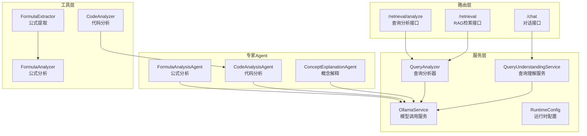
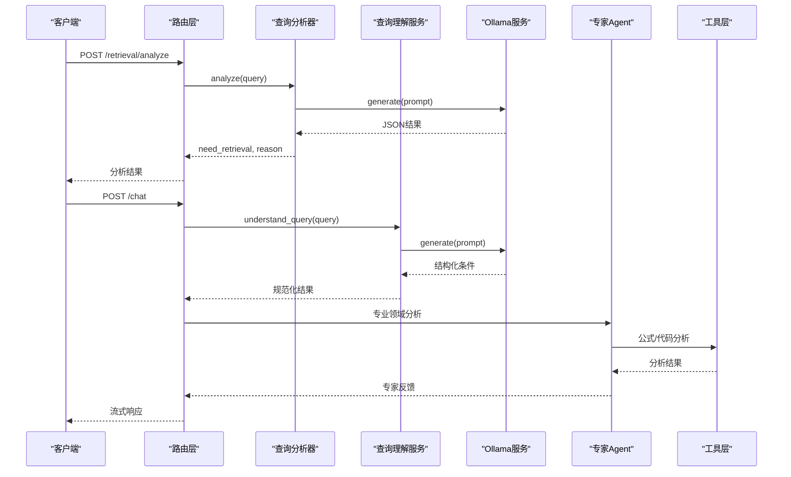
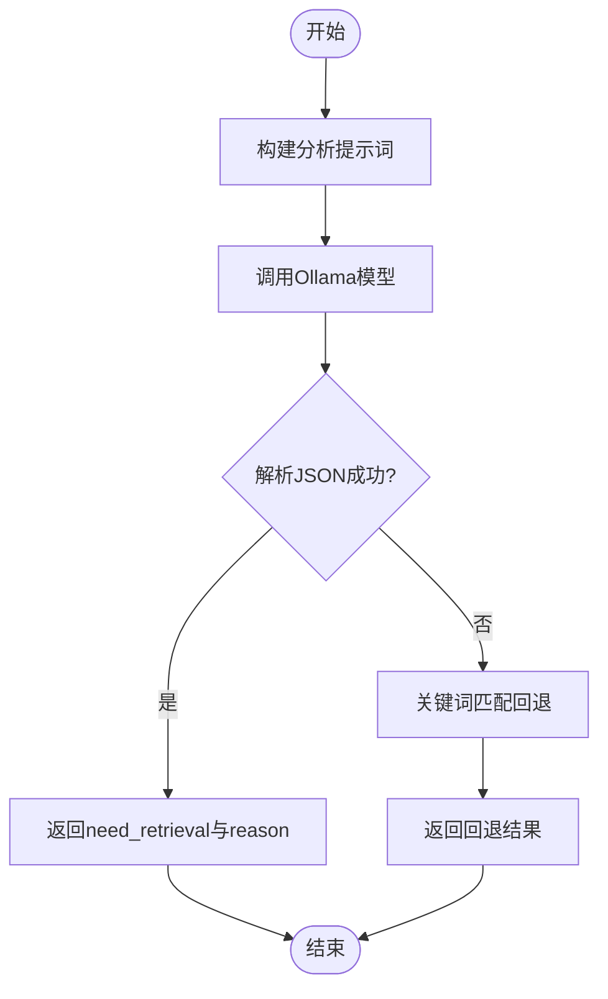
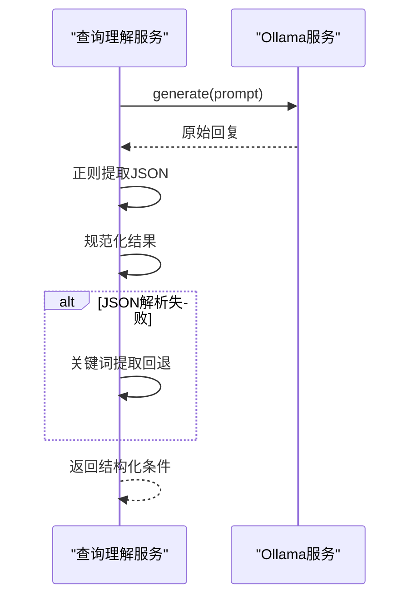
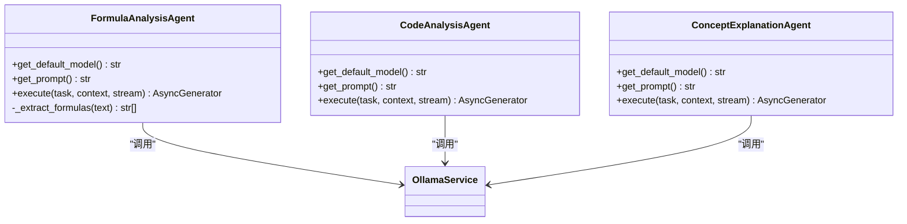
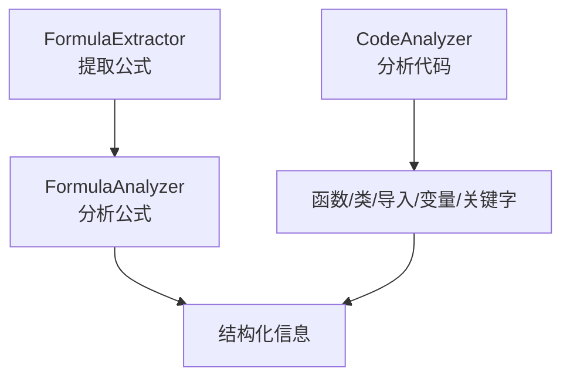
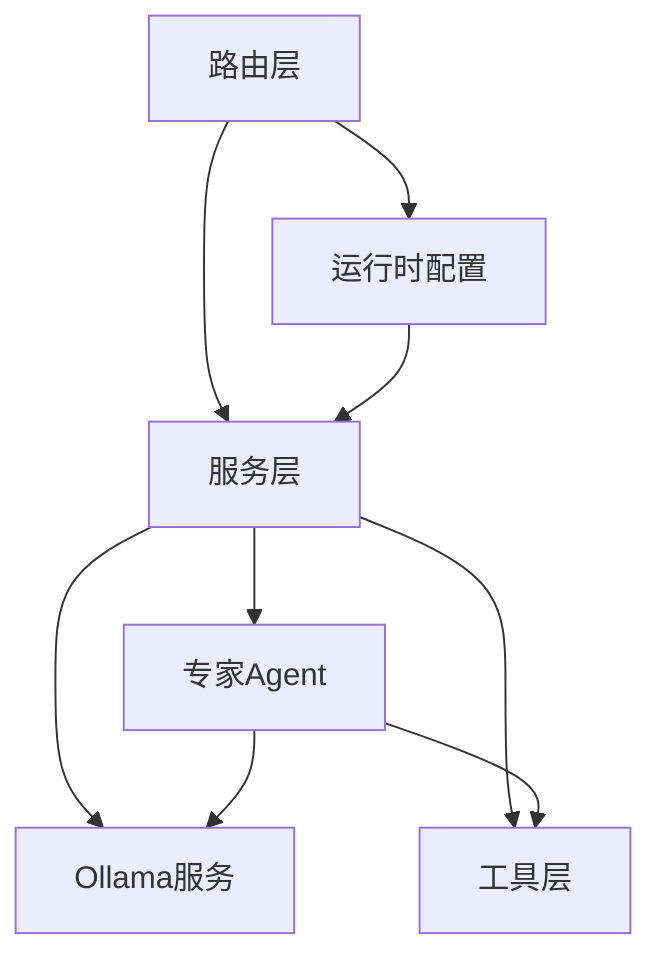

# 查询分析服务

<cite>
**本文档引用的文件**
- [query_analyzer.py](file://services/query_analyzer.py)
- [query_understanding_service.py](file://services/query_understanding_service.py)
- [ollama_service.py](file://services/ollama_service.py)
- [retrieval.py](file://routers/retrieval.py)
- [chat.py](file://routers/chat.py)
- [runtime_config.py](file://services/runtime_config.py)
- [formula_analysis_agent.py](file://agents/experts/formula_analysis_agent.py)
- [code_analysis_agent.py](file://agents/experts/code_analysis_agent.py)
- [concept_explanation_agent.py](file://agents/experts/concept_explanation_agent.py)
- [formula_analyzer.py](file://utils/formula_analyzer.py)
- [formula_extractor.py](file://utils/formula_extractor.py)
- [code_analyzer.py](file://utils/code_analyzer.py)
</cite>

## 目录
1. [简介](#简介)
2. [项目结构](#项目结构)
3. [核心组件](#核心组件)
4. [架构概览](#架构概览)
5. [详细组件分析](#详细组件分析)
6. [依赖关系分析](#依赖关系分析)
7. [性能考量](#性能考量)
8. [故障排查指南](#故障排查指南)
9. [结论](#结论)
10. [附录](#附录)

## 简介
本文件面向查询分析服务的技术文档，系统阐述查询理解与检索决策的完整流程，涵盖：
- 自然语言处理与意图识别、实体抽取、语义分类等核心算法
- 从原始查询到结构化理解的处理流程（预处理、特征提取、分类判断）
- 查询理解服务的实现机制（代码分析、公式理解、概念解释等专业领域处理）
- 查询优化策略（查询改写、关键词提取、上下文推理）
- 质量评估方法、性能监控指标、错误处理机制
- 使用示例与配置参数说明

## 项目结构
查询分析服务主要分布在以下模块：
- 服务层：查询分析器、查询理解服务、Ollama服务
- 路由层：检索与分析接口
- 专家Agent：公式分析、代码分析、概念解释
- 工具层：公式提取与分析、代码分析
- 运行时配置：模块开关与参数控制

图表来源
- [retrieval.py:44-94](file://routers/retrieval.py#L44-L94)
- [chat.py:623-760](file://routers/chat.py#L623-L760)
- [query_analyzer.py:9-162](file://services/query_analyzer.py#L9-L162)
- [query_understanding_service.py:9-248](file://services/query_understanding_service.py#L9-L248)
- [ollama_service.py:9-674](file://services/ollama_service.py#L9-L674)
- [formula_analysis_agent.py:8-107](file://agents/experts/formula_analysis_agent.py#L8-L107)
- [code_analysis_agent.py:7-79](file://agents/experts/code_analysis_agent.py#L7-L79)
- [concept_explanation_agent.py:7-70](file://agents/experts/concept_explanation_agent.py#L7-L70)
- [formula_extractor.py:6-149](file://utils/formula_extractor.py#L6-L149)
- [formula_analyzer.py:8-233](file://utils/formula_analyzer.py#L8-L233)
- [code_analyzer.py:7-350](file://utils/code_analyzer.py#L7-L350)

章节来源
- [retrieval.py:1-150](file://routers/retrieval.py#L1-L150)
- [chat.py:623-760](file://routers/chat.py#L623-L760)

## 核心组件
- 查询分析器（QueryAnalyzer）：判断是否需要检索上下文，支持模型分析与关键词回退
- 查询理解服务（QueryUnderstandingService）：将自然语言查询转换为结构化搜索条件
- Ollama服务（OllamaService）：统一的模型调用封装，支持流式与非流式生成
- 专家Agent：公式分析、代码分析、概念解释，面向专业领域增强
- 工具集：公式提取与分析、代码分析，支撑专业内容理解

章节来源
- [query_analyzer.py:9-162](file://services/query_analyzer.py#L9-L162)
- [query_understanding_service.py:9-248](file://services/query_understanding_service.py#L9-L248)
- [ollama_service.py:9-674](file://services/ollama_service.py#L9-L674)
- [formula_analysis_agent.py:8-107](file://agents/experts/formula_analysis_agent.py#L8-L107)
- [code_analysis_agent.py:7-79](file://agents/experts/code_analysis_agent.py#L7-L79)
- [concept_explanation_agent.py:7-70](file://agents/experts/concept_explanation_agent.py#L7-L70)
- [formula_extractor.py:6-149](file://utils/formula_extractor.py#L6-L149)
- [formula_analyzer.py:8-233](file://utils/formula_analyzer.py#L8-L233)
- [code_analyzer.py:7-350](file://utils/code_analyzer.py#L7-L350)

## 架构概览
查询分析服务采用“路由-服务-专家Agent-工具”的分层架构：
- 路由层负责请求接入与参数校验
- 服务层负责业务逻辑与模型调用
- 专家Agent提供专业领域能力
- 工具层提供底层算法支持

图表来源
- [retrieval.py:44-94](file://routers/retrieval.py#L44-L94)
- [chat.py:623-760](file://routers/chat.py#L623-L760)
- [query_analyzer.py:38-105](file://services/query_analyzer.py#L38-L105)
- [query_understanding_service.py:87-134](file://services/query_understanding_service.py#L87-L134)
- [ollama_service.py:50-92](file://services/ollama_service.py#L50-L92)
- [formula_analysis_agent.py:26-87](file://agents/experts/formula_analysis_agent.py#L26-L87)
- [code_analysis_agent.py:25-77](file://agents/experts/code_analysis_agent.py#L25-L77)
- [concept_explanation_agent.py:25-68](file://agents/experts/concept_explanation_agent.py#L25-L68)
- [formula_extractor.py:29-57](file://utils/formula_extractor.py#L29-L57)
- [formula_analyzer.py:33-77](file://utils/formula_analyzer.py#L33-L77)
- [code_analyzer.py:258-350](file://utils/code_analyzer.py#L258-L350)

## 详细组件分析

### 查询分析器（QueryAnalyzer）
- 目标：判断用户问题是否需要从知识库检索
- 方法：
  - 模型分析：构造提示词，调用Ollama小模型，解析JSON响应
  - 关键词回退：若模型失败，基于关键词匹配判定
- 关键词策略：
  - 不需要检索：问候、帮助、系统操作、计算、代码、时间、天气等
  - 需要检索：传感器、原理、应用、文档、课程、参数、规格等
- 安全策略：默认需要检索，避免漏检

图表来源
- [query_analyzer.py:22-105](file://services/query_analyzer.py#L22-L105)
- [query_analyzer.py:107-157](file://services/query_analyzer.py#L107-L157)

章节来源
- [query_analyzer.py:9-162](file://services/query_analyzer.py#L9-L162)
- [retrieval.py:44-94](file://routers/retrieval.py#L44-L94)
- [runtime_config.py:140-161](file://services/runtime_config.py#L140-L161)

### 查询理解服务（QueryUnderstandingService）
- 目标：将自然语言查询转换为结构化搜索条件
- 方法：
  - 构建提示词模板，调用Ollama生成JSON
  - 正则提取JSON，规范化字段（列表、null、字符串）
  - 关键词提取回退：检测用户类型、学院、专业等
- 输出字段：
  - research_fields、user_type、skills、college、major、interests、intent

图表来源
- [query_understanding_service.py:87-134](file://services/query_understanding_service.py#L87-L134)
- [query_understanding_service.py:136-204](file://services/query_understanding_service.py#L136-L204)
- [query_understanding_service.py:206-246](file://services/query_understanding_service.py#L206-L246)

章节来源
- [query_understanding_service.py:9-248](file://services/query_understanding_service.py#L9-L248)

### 专家Agent（公式/代码/概念）
- 公式分析（FormulaAnalysisAgent）：识别LaTeX公式，解释物理意义、变量含义、适用条件、推导过程
- 代码分析（CodeAnalysisAgent）：分析代码功能、关键部分、优缺点、改进建议、应用场景
- 概念解释（ConceptExplanationAgent）：深入解释专业概念，定义、物理意义、公式定律、应用示例、关系

图表来源
- [formula_analysis_agent.py:8-107](file://agents/experts/formula_analysis_agent.py#L8-L107)
- [code_analysis_agent.py:7-79](file://agents/experts/code_analysis_agent.py#L7-L79)
- [concept_explanation_agent.py:7-70](file://agents/experts/concept_explanation_agent.py#L7-L70)
- [ollama_service.py:9-674](file://services/ollama_service.py#L9-L674)

章节来源
- [formula_analysis_agent.py:8-107](file://agents/experts/formula_analysis_agent.py#L8-L107)
- [code_analysis_agent.py:7-79](file://agents/experts/code_analysis_agent.py#L7-L79)
- [concept_explanation_agent.py:7-70](file://agents/experts/concept_explanation_agent.py#L7-L70)

### 工具集（公式/代码分析）
- 公式提取（FormulaExtractor）：支持块级与行内LaTeX公式，规范化格式
- 公式分析（FormulaAnalyzer）：提取变量、关系、函数、结构，计算复杂度
- 代码分析（CodeAnalyzer）：检测语言、提取函数/类/导入、变量与关键字、复杂度估算

图表来源
- [formula_extractor.py:29-57](file://utils/formula_extractor.py#L29-L57)
- [formula_analyzer.py:33-77](file://utils/formula_analyzer.py#L33-L77)
- [formula_analyzer.py:161-210](file://utils/formula_analyzer.py#L161-L210)
- [code_analyzer.py:19-47](file://utils/code_analyzer.py#L19-L47)
- [code_analyzer.py:258-350](file://utils/code_analyzer.py#L258-L350)

章节来源
- [formula_extractor.py:6-149](file://utils/formula_extractor.py#L6-L149)
- [formula_analyzer.py:8-233](file://utils/formula_analyzer.py#L8-L233)
- [code_analyzer.py:7-350](file://utils/code_analyzer.py#L7-L350)

## 依赖关系分析
- 路由层依赖服务层与专家Agent
- 服务层依赖Ollama服务与工具层
- 专家Agent依赖Ollama服务与工具层
- 运行时配置影响模块开关与行为

图表来源
- [retrieval.py:44-94](file://routers/retrieval.py#L44-L94)
- [chat.py:623-760](file://routers/chat.py#L623-L760)
- [query_analyzer.py:9-162](file://services/query_analyzer.py#L9-L162)
- [query_understanding_service.py:9-248](file://services/query_understanding_service.py#L9-L248)
- [ollama_service.py:9-674](file://services/ollama_service.py#L9-L674)
- [runtime_config.py:140-161](file://services/runtime_config.py#L140-L161)

章节来源
- [retrieval.py:1-150](file://routers/retrieval.py#L1-L150)
- [runtime_config.py:1-218](file://services/runtime_config.py#L1-L218)

## 性能考量
- 模型调用优化
  - 查询分析使用小模型与低温度、短输出，提升响应速度
  - Ollama服务支持流式生成，降低首字延迟
- 超时与重试
  - 查询分析超时10秒；Ollama服务默认超时600秒，适配大模型
- 并发与缓存
  - 运行时配置支持并发参数与TTL缓存，平衡吞吐与一致性
- 回退策略
  - 模型失败时使用关键词匹配，保证可用性

章节来源
- [query_analyzer.py:12-20](file://services/query_analyzer.py#L12-L20)
- [query_analyzer.py:62-69](file://services/query_analyzer.py#L62-L69)
- [ollama_service.py:32-34](file://services/ollama_service.py#L32-L34)
- [ollama_service.py:453-637](file://services/ollama_service.py#L453-L637)
- [runtime_config.py:135-161](file://services/runtime_config.py#L135-L161)

## 故障排查指南
- 查询分析失败
  - 现象：模型解析JSON失败或HTTP请求异常
  - 处理：触发关键词回退；检查Ollama服务可达性与模型可用性
- 查询理解失败
  - 现象：LLM输出非JSON或字段缺失
  - 处理：触发关键词提取回退；检查提示词模板与模型能力
- 专家Agent失败
  - 现象：公式/代码/概念分析异常
  - 处理：检查输入格式（LaTeX/代码片段）、模型可用性；查看日志
- 运行时配置
  - 现象：模块开关导致行为异常
  - 处理：通过运行时配置接口更新模块开关与参数

章节来源
- [query_analyzer.py:95-105](file://services/query_analyzer.py#L95-L105)
- [query_understanding_service.py:124-134](file://services/query_understanding_service.py#L124-L134)
- [formula_analysis_agent.py:81-87](file://agents/experts/formula_analysis_agent.py#L81-L87)
- [code_analysis_agent.py:71-77](file://agents/experts/code_analysis_agent.py#L71-L77)
- [concept_explanation_agent.py:62-68](file://agents/experts/concept_explanation_agent.py#L62-L68)
- [runtime_config.py:191-217](file://services/runtime_config.py#L191-L217)

## 结论
查询分析服务通过“模型+关键词”的双轨策略，在准确性与稳定性之间取得平衡；结合专家Agent与工具层，覆盖公式、代码、概念等专业领域；运行时配置提供灵活的模块化控制。整体架构清晰、扩展性强，适合在教学与科研场景中部署与演进。

## 附录

### 使用示例
- 查询分析接口
  - 请求：POST /retrieval/analyze
  - 参数：query（字符串）
  - 返回：need_retrieval（布尔）、reason（字符串）、confidence（字符串）
- RAG检索接口
  - 请求：POST /retrieval
  - 参数：query、document_id、top_k、assistant_id、knowledge_space_ids、conversation_id
  - 返回：context（字符串）、sources（数组）、retrieval_count（整数）、recommended_resources（数组）
- 对话接口（深度研究模式）
  - 请求：POST /chat/deep-research
  - 参数：query、assistant_id、conversation_id、enabled_agents、generation_config
  - 返回：流式HTML响应

章节来源
- [retrieval.py:44-94](file://routers/retrieval.py#L44-L94)
- [retrieval.py:97-149](file://routers/retrieval.py#L97-L149)
- [chat.py:762-800](file://routers/chat.py#L762-L800)

### 配置参数说明
- 运行时配置（RuntimeConfig）
  - mode：low/high/custom
  - modules：模块开关（如query_analyze_enabled）
  - params：运行参数（如embedding_batch_size、embedding_concurrency等）
- Ollama服务
  - OLLAMA_BASE_URL：服务地址
  - OLLAMA_MODEL：默认生成模型
  - OLLAMA_TIMEOUT：超时时间（秒）
- 查询分析器
  - OLLAMA_ANALYSIS_MODEL：分析模型
  - OLLAMA_BASE_URL：服务地址（本地替换localhost为127.0.0.1）

章节来源
- [runtime_config.py:15-38](file://services/runtime_config.py#L15-L38)
- [runtime_config.py:140-161](file://services/runtime_config.py#L140-L161)
- [ollama_service.py:12-34](file://services/ollama_service.py#L12-L34)
- [query_analyzer.py:12-20](file://services/query_analyzer.py#L12-L20)