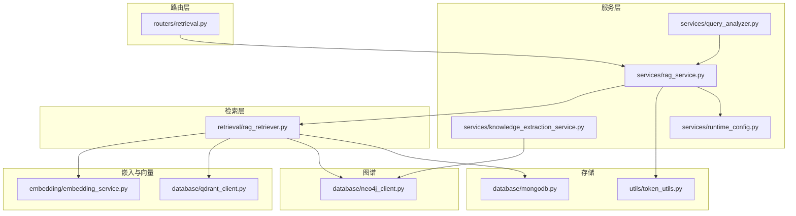
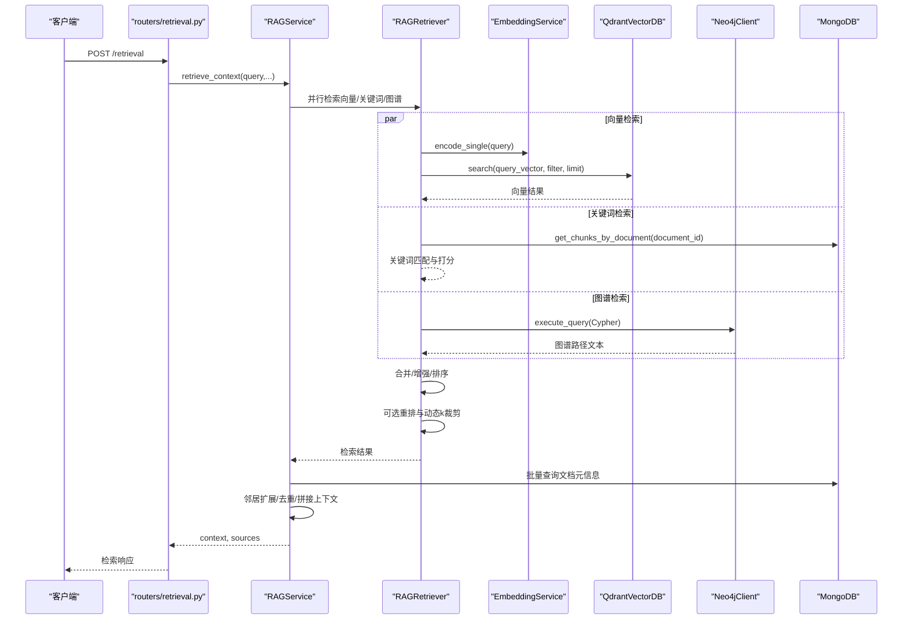
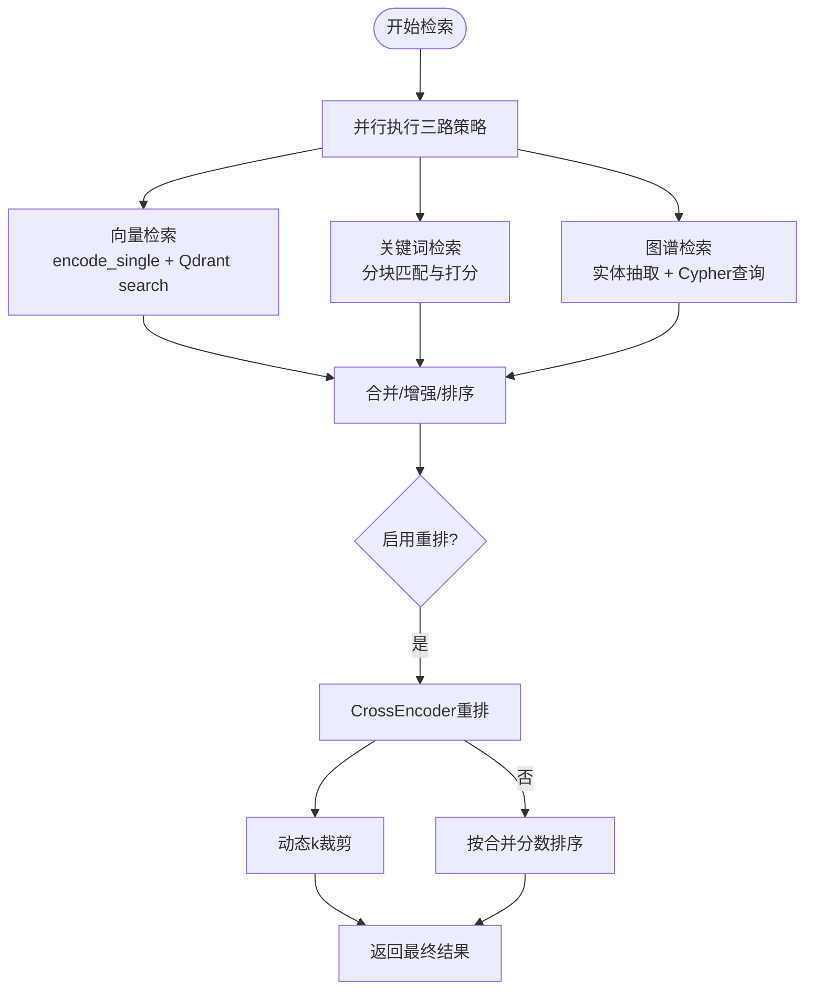
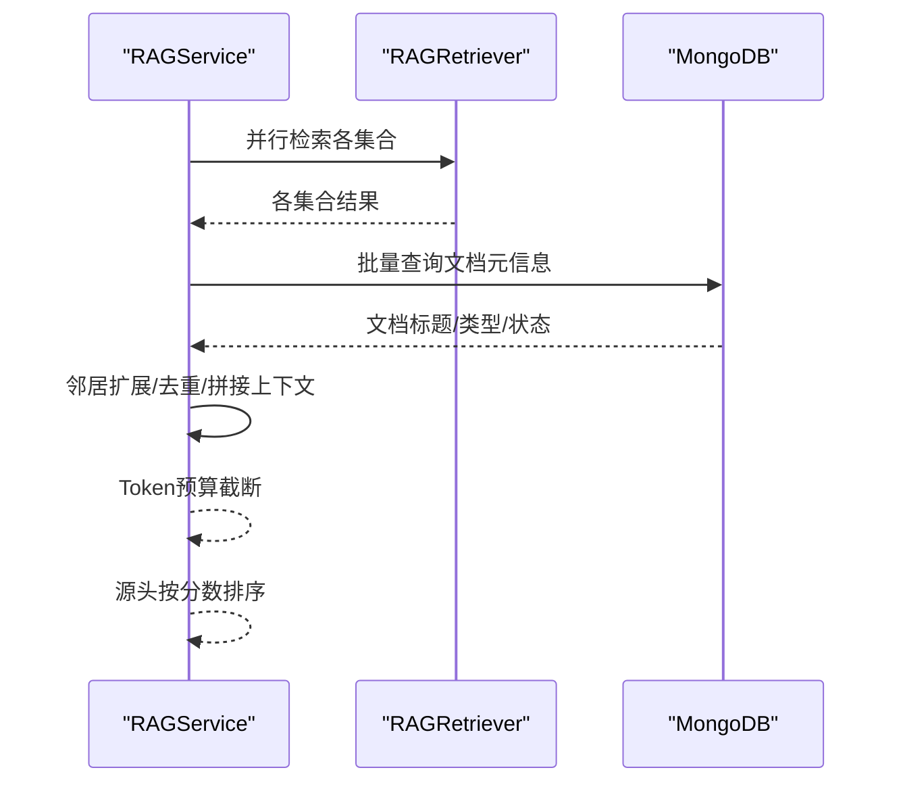
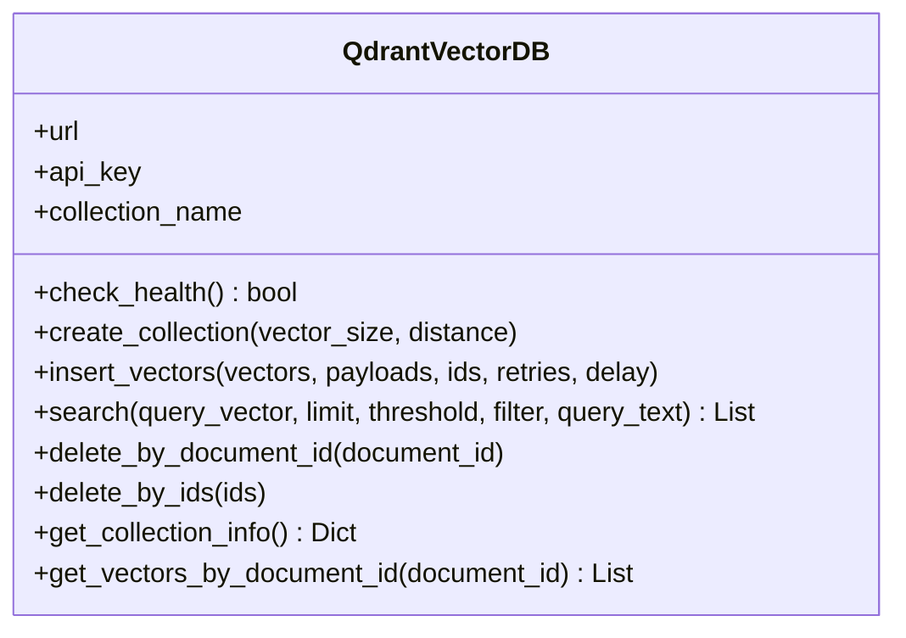
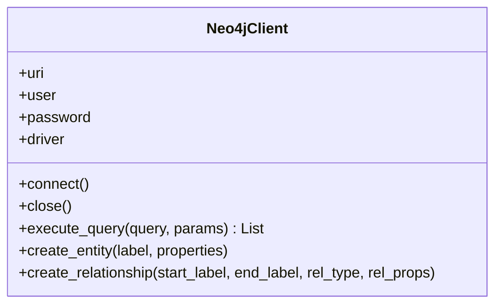
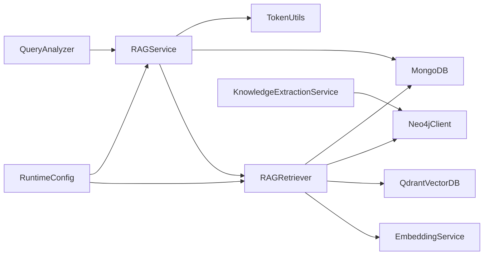

# 检索服务实现

<cite>
**本文引用的文件**
- [retrieval/rag_retriever.py](file://retrieval/rag_retriever.py)
- [services/rag_service.py](file://services/rag_service.py)
- [database/qdrant_client.py](file://database/qdrant_client.py)
- [database/neo4j_client.py](file://database/neo4j_client.py)
- [embedding/embedding_service.py](file://embedding/embedding_service.py)
- [services/knowledge_extraction_service.py](file://services/knowledge_extraction_service.py)
- [services/runtime_config.py](file://services/runtime_config.py)
- [database/mongodb.py](file://database/mongodb.py)
- [utils/token_utils.py](file://utils/token_utils.py)
- [routers/retrieval.py](file://routers/retrieval.py)
- [services/query_analyzer.py](file://services/query_analyzer.py)
- [requirements.txt](file://requirements.txt)
- [README.md](file://README.md)
</cite>

## 目录
1. [简介](#简介)
2. [项目结构](#项目结构)
3. [核心组件](#核心组件)
4. [架构总览](#架构总览)
5. [详细组件分析](#详细组件分析)
6. [依赖分析](#依赖分析)
7. [性能考量](#性能考量)
8. [故障排查指南](#故障排查指南)
9. [结论](#结论)
10. [附录](#附录)

## 简介
本文件面向高级RAG系统的检索服务实现，聚焦多模态检索策略的融合与落地，包括向量检索、关键词检索、图谱检索与重排优化。文档从架构设计、核心算法、与向量数据库的交互、性能优化到配置示例与最佳实践进行全面阐述，帮助读者快速理解并高效部署检索服务。

## 项目结构
检索服务位于后端服务层，围绕RAG检索器与RAG服务展开，配合向量数据库（Qdrant）、图数据库（Neo4j）、向量化服务（Ollama）与MongoDB文档存储，形成“多源检索 + 混合排序”的完整链路。

**图表来源**
- [routers/retrieval.py:1-150](file://routers/retrieval.py#L1-L150)
- [services/rag_service.py:1-323](file://services/rag_service.py#L1-L323)
- [retrieval/rag_retriever.py:1-393](file://retrieval/rag_retriever.py#L1-L393)
- [embedding/embedding_service.py:1-333](file://embedding/embedding_service.py#L1-L333)
- [database/qdrant_client.py:1-544](file://database/qdrant_client.py#L1-L544)
- [database/neo4j_client.py:1-104](file://database/neo4j_client.py#L1-L104)
- [services/knowledge_extraction_service.py:1-229](file://services/knowledge_extraction_service.py#L1-L229)
- [services/runtime_config.py:1-218](file://services/runtime_config.py#L1-L218)
- [database/mongodb.py:1-800](file://database/mongodb.py#L1-L800)
- [utils/token_utils.py:1-72](file://utils/token_utils.py#L1-L72)

**章节来源**
- [README.md:46-54](file://README.md#L46-L54)
- [requirements.txt:1-42](file://requirements.txt#L1-L42)

## 核心组件
- RAGRetriever：混合检索器，负责并行执行向量检索、关键词检索、图谱检索，合并结果并进行重排与动态裁剪。
- RAGService：高层检索服务，负责动态参数调整、多集合检索、邻居扩展、上下文拼接与来源去重。
- QdrantVectorDB：Qdrant客户端封装，提供集合管理、批量插入、向量搜索、过滤删除等能力。
- Neo4jClient：Neo4j客户端封装，提供连接、Cypher执行、实体与关系创建。
- EmbeddingService：向量化服务，对接Ollama，提供文本编码与维度探测。
- KnowledgeExtractionService：知识抽取服务，从查询/文本中抽取实体与三元组，构建Neo4j图谱。
- RuntimeConfig：运行时配置中心，支持模块开关与参数动态下发。
- MongoDB：MongoDB异步/同步客户端，提供集合访问与文档/分块仓库。
- TokenUtils：近似Token估算与截断工具，保障上下文长度预算。

**章节来源**
- [retrieval/rag_retriever.py:17-393](file://retrieval/rag_retriever.py#L17-L393)
- [services/rag_service.py:8-323](file://services/rag_service.py#L8-L323)
- [database/qdrant_client.py:18-544](file://database/qdrant_client.py#L18-L544)
- [database/neo4j_client.py:6-104](file://database/neo4j_client.py#L6-L104)
- [embedding/embedding_service.py:8-333](file://embedding/embedding_service.py#L8-L333)
- [services/knowledge_extraction_service.py:12-229](file://services/knowledge_extraction_service.py#L12-L229)
- [services/runtime_config.py:15-218](file://services/runtime_config.py#L15-L218)
- [database/mongodb.py:92-800](file://database/mongodb.py#L92-L800)
- [utils/token_utils.py:7-72](file://utils/token_utils.py#L7-L72)

## 架构总览
检索服务采用“并行多策略 + 动态融合 + 重排优化”的架构：
- 并行策略：向量检索、关键词检索、图谱检索三路并行，提升召回效率。
- 结果融合：以chunk_id为主键去重合并，关键词结果对向量结果进行分数增强，图谱结果独立加入。
- 重排优化：可选CrossEncoder重排，结合动态k裁剪，平衡精度与召回。
- 上下文构建：邻居扩展、去重聚合、Token预算截断，保证上下文可控。

**图表来源**
- [routers/retrieval.py:97-149](file://routers/retrieval.py#L97-L149)
- [services/rag_service.py:34-266](file://services/rag_service.py#L34-L266)
- [retrieval/rag_retriever.py:89-137](file://retrieval/rag_retriever.py#L89-L137)
- [embedding/embedding_service.py:316-318](file://embedding/embedding_service.py#L316-L318)
- [database/qdrant_client.py:336-414](file://database/qdrant_client.py#L336-L414)
- [database/neo4j_client.py:40-62](file://database/neo4j_client.py#L40-L62)
- [database/mongodb.py:793-800](file://database/mongodb.py#L793-L800)

## 详细组件分析

### RAGRetriever：混合检索与重排
- 初始化参数：final_k、prefetch_k、score_threshold、重排开关与模型参数。
- 并行策略：
  - 向量检索：调用EmbeddingService编码查询，使用QdrantVectorDB执行相似度搜索，支持按document_id过滤与阈值筛选。
  - 关键词检索：在指定document_id范围内对分块文本进行关键词交集匹配，计算匹配比例作为分数。
  - 图谱检索：通过KnowledgeExtractionService抽取查询实体，Neo4jClient执行Cypher查询，将一跳邻居路径组合为文本片段。
- 结果合并：以chunk_id为键去重，向量结果作为基础，关键词结果按比例增强，图谱结果独立加入。
- 重排与动态裁剪：可选CrossEncoder重排，基于分数分布动态调整k，兼顾召回与精度。

**图表来源**
- [retrieval/rag_retriever.py:115-137](file://retrieval/rag_retriever.py#L115-L137)
- [retrieval/rag_retriever.py:328-363](file://retrieval/rag_retriever.py#L328-L363)
- [retrieval/rag_retriever.py:365-391](file://retrieval/rag_retriever.py#L365-L391)
- [retrieval/rag_retriever.py:139-167](file://retrieval/rag_retriever.py#L139-L167)

**章节来源**
- [retrieval/rag_retriever.py:17-393](file://retrieval/rag_retriever.py#L17-L393)

### RAGService：高层检索与上下文构建
- 动态参数：根据查询特征（长度、对比/列举/条款类问题）在线调整prefetch_k与final_k。
- 多集合检索：支持知识空间集合列表并行检索，兼容旧版助手集合名称。
- 上下文拼接：对命中chunk进行邻居扩展，去重聚合，按Token预算截断，构造最终上下文。
- 来源去重与排序：按文档/附件维度保留最高分chunk，输出来源清单。

**图表来源**
- [services/rag_service.py:34-266](file://services/rag_service.py#L34-L266)

**章节来源**
- [services/rag_service.py:8-323](file://services/rag_service.py#L8-L323)

### QdrantVectorDB：向量数据库交互
- 连接与健康检查：支持gRPC优先、超时与重试、本地HTTP警告规避。
- 集合管理：自动检测维度并按需重建，避免维度不匹配导致的插入失败。
- 批量插入：带指数退避重试、维度不匹配自动重建、ID格式化（UUID）。
- 搜索：支持过滤条件、阈值筛选、自动集合创建与空结果降级。
- 删除与滚动：按document_id删除、滚动查询获取向量与payload。

**图表来源**
- [database/qdrant_client.py:18-544](file://database/qdrant_client.py#L18-L544)

**章节来源**
- [database/qdrant_client.py:18-544](file://database/qdrant_client.py#L18-L544)

### Neo4jClient：图谱检索与构建
- 连接与容器适配：支持localhost到host.docker.internal的自动替换，连接失败冷却。
- 查询执行：统一execute_query接口，返回记录列表；提供实体与关系创建便捷方法。
- 与知识抽取联动：在构建图谱时规范化关系类型，附加source_doc/source_chunk元信息。

**图表来源**
- [database/neo4j_client.py:6-104](file://database/neo4j_client.py#L6-L104)

**章节来源**
- [database/neo4j_client.py:6-104](file://database/neo4j_client.py#L6-L104)
- [services/knowledge_extraction_service.py:147-229](file://services/knowledge_extraction_service.py#L147-L229)

### EmbeddingService：向量化服务
- 模型发现与规范化：自动检测可用embedding模型，处理标签与latest补全。
- 嵌入获取：支持新旧接口回退（/api/embed vs /api/embeddings），超时与连接错误指数退避。
- 文本截断：针对Ollama上下文长度限制进行字符截断，避免超限错误。
- 维度探测：首次调用时记录向量维度，后续用于Qdrant集合维度校验。

**章节来源**
- [embedding/embedding_service.py:8-333](file://embedding/embedding_service.py#L8-L333)

### 运行时配置与查询分析
- 运行时配置：支持低/高预设模式与自定义合并，模块开关（kg_extract/rerank等）与参数（并发、批大小等）动态下发。
- 查询分析：小模型快速判断是否需要检索，失败时回退关键词匹配策略。

**章节来源**
- [services/runtime_config.py:15-218](file://services/runtime_config.py#L15-L218)
- [services/query_analyzer.py:9-163](file://services/query_analyzer.py#L9-L163)

## 依赖分析
检索服务依赖关系清晰，核心外部依赖包括：
- qdrant-client：向量数据库交互
- sentence-transformers：CrossEncoder重排
- neo4j：图谱检索与构建
- requests/httpx：HTTP请求与gRPC连接
- pymongo/motor：MongoDB访问

**图表来源**
- [requirements.txt:10-14](file://requirements.txt#L10-L14)
- [retrieval/rag_retriever.py:6-12](file://retrieval/rag_retriever.py#L6-L12)
- [services/rag_service.py:2-6](file://services/rag_service.py#L2-L6)

**章节来源**
- [requirements.txt:1-42](file://requirements.txt#L1-L42)

## 性能考量
- 并行策略：三路检索并行执行，显著降低端到端延迟。
- 动态参数：根据查询复杂度与类型在线调整prefetch_k与final_k，平衡吞吐与质量。
- 重排与动态k：重排提升排序质量，动态k在高区分度场景减少冗余，低区分度场景扩大召回。
- Token预算：上下文拼接前进行近似Token估算与二分截断，避免prompt过长。
- Qdrant优化：gRPC优先、连接池参数、自动集合维度校验与重建、指数退避重试。
- MongoDB优化：连接池参数（max/min pool size、idle/selection/connect/socket timeout）提升并发稳定性。
- 图谱冷却：Neo4j连接失败冷却，避免高频错误日志与抖动。

[本节为通用性能指导，不直接分析具体文件]

## 故障排查指南
- 向量检索失败：检查Qdrant连接与集合维度，确认EmbeddingService模型可用与文本截断设置。
- 图谱检索失败：检查Neo4j连接与Cypher语法，关注连接失败冷却与日志提示。
- 关键词检索缓慢：仅在指定document_id时启用，避免全局扫描。
- 重排模型加载失败：确认环境变量与设备配置，系统会自动降级禁用重排。
- 上下文过长：调整Token预算或减少final_k，确保拼接后不超过模型上下文限制。

**章节来源**
- [retrieval/rag_retriever.py:202-204](file://retrieval/rag_retriever.py#L202-L204)
- [retrieval/rag_retriever.py:324-326](file://retrieval/rag_retriever.py#L324-L326)
- [services/rag_service.py:255-260](file://services/rag_service.py#L255-L260)
- [database/qdrant_client.py:97-122](file://database/qdrant_client.py#L97-L122)
- [database/neo4j_client.py:16-33](file://database/neo4j_client.py#L16-L33)

## 结论
该检索服务通过“并行多策略 + 动态融合 + 重排优化”的架构，实现了向量、关键词与图谱的有机融合。配合Qdrant与Neo4j的多模态索引、Ollama的本地向量化能力以及运行时配置的动态开关，既保证了召回质量，又兼顾了性能与可运维性。通过合理的参数调优与工程化优化，可在不同规模与场景下稳定落地。

[本节为总结性内容，不直接分析具体文件]

## 附录

### 配置示例与最佳实践
- 环境变量（摘录关键项）
  - Qdrant：QDRANT_URL、QDRANT_API_KEY、QDRANT_TIMEOUT、QDRANT_GRPC_PORT
  - Neo4j：NEO4J_URI、NEO4J_USER、NEO4J_PASSWORD、NEO4J_ENABLED
  - Ollama：OLLAMA_BASE_URL、OLLAMA_EMBEDDING_MODEL、OLLAMA_EMBEDDING_MAX_CHARS
  - 运行时：ENABLE_RERANKER、RERANKER_MODEL、RERANKER_DEVICE、RERANKER_MAX_TOKENS
  - 动态k：DYNK_MIN、DYNK_MAX、DYNK_GAP_HIGH、DYNK_GAP_LOW
- 最佳实践
  - 优先使用gRPC连接Qdrant，提升并发与稳定性。
  - 启用运行时配置模块开关，按需开启kg_retrieve与rerank。
  - 对长查询适当提高prefetch_k与final_k，对短查询降低以节省资源。
  - 重排模型建议使用CPU推理，或在GPU可用时指定设备，注意内存占用。
  - 关键词检索仅在限定document_id时启用，避免全库扫描。

**章节来源**
- [README.md:125-166](file://README.md#L125-L166)
- [retrieval/rag_retriever.py:14-50](file://retrieval/rag_retriever.py#L14-L50)
- [services/runtime_config.py:41-83](file://services/runtime_config.py#L41-L83)