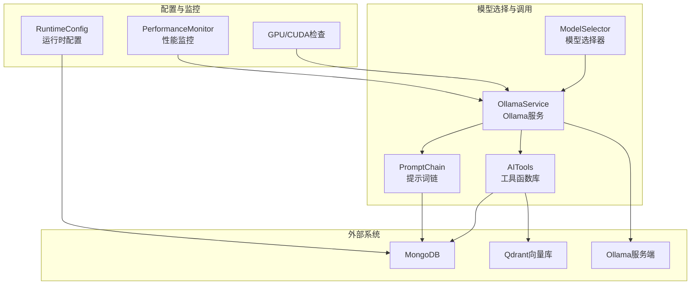
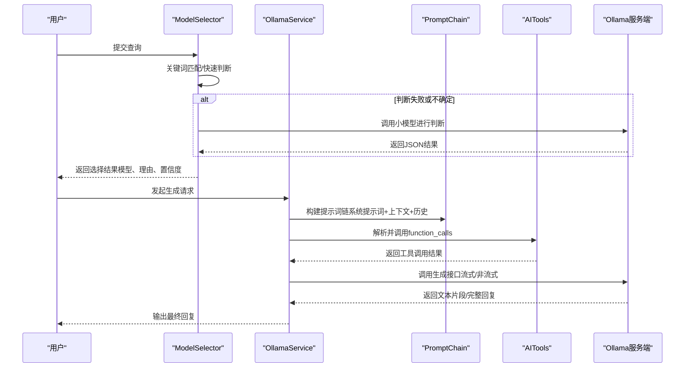
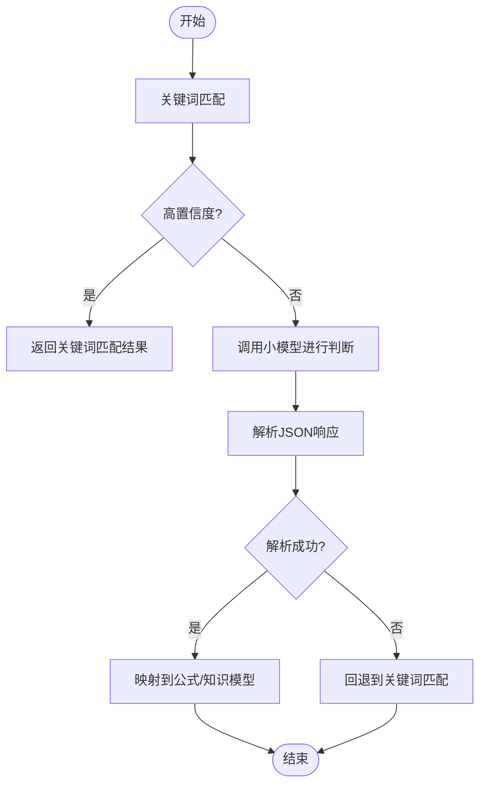
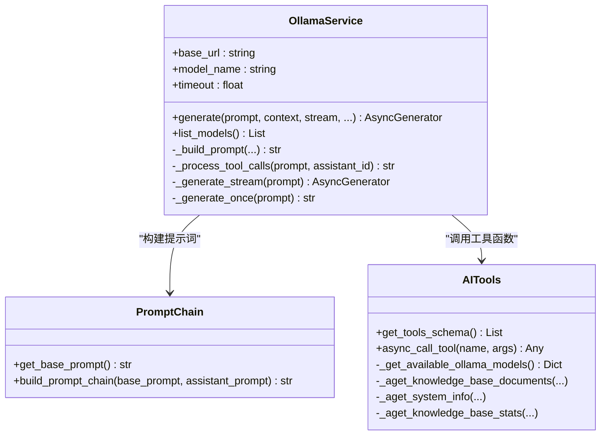
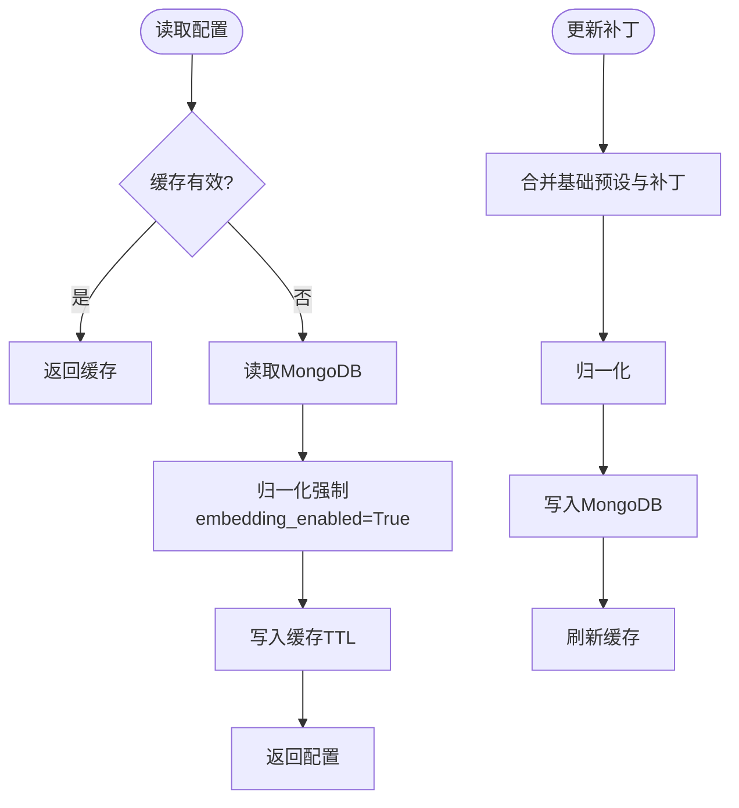
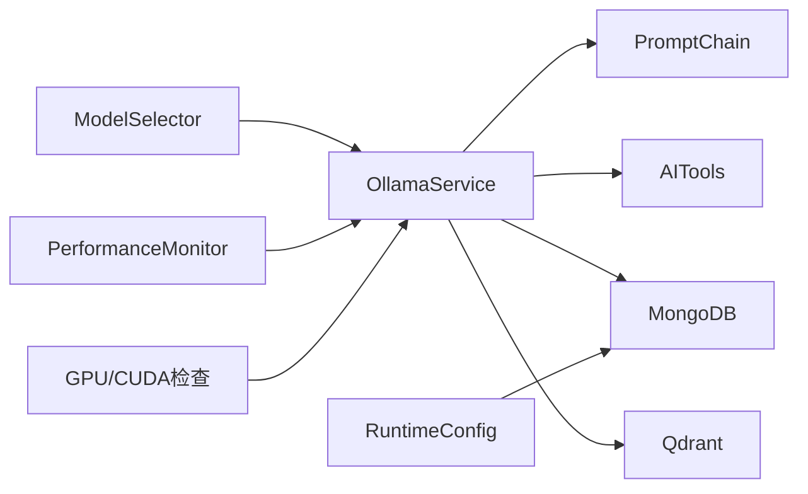

# 模型选择服务

<cite>
**本文引用的文件**
- [model_selector.py](file://services/model_selector.py)
- [ollama_service.py](file://services/ollama_service.py)
- [runtime_config.py](file://services/runtime_config.py)
- [monitoring.py](file://utils/monitoring.py)
- [gpu_check.py](file://utils/gpu_check.py)
- [prompt_chain.py](file://services/prompt_chain.py)
- [ai_tools.py](file://services/ai_tools.py)
- [settings.py](file://routers/settings.py)
- [main.py](file://main.py)
- [embedding_service.py](file://embedding/embedding_service.py)
- [requirements.txt](file://requirements.txt)
</cite>

## 目录
1. [简介](#简介)
2. [项目结构](#项目结构)
3. [核心组件](#核心组件)
4. [架构总览](#架构总览)
5. [详细组件分析](#详细组件分析)
6. [依赖分析](#依赖分析)
7. [性能考量](#性能考量)
8. [故障排查指南](#故障排查指南)
9. [结论](#结论)
10. [附录](#附录)

## 简介
本文件面向“模型选择服务”的技术文档，聚焦以下目标：
- 深入解释大语言模型的选择与管理机制，涵盖模型配置、版本管理、负载均衡等核心功能
- 详细说明模型选择的决策算法：基于任务类型、性能需求、资源限制等因素的综合考虑
- 阐述Ollama服务的集成方式：本地模型管理、远程模型调用、模型缓存等技术实现
- 解释运行时配置的管理机制：动态配置更新、环境变量处理、配置验证等
- 提供模型性能监控、资源使用统计、故障恢复等运维功能
- 给出具体的配置示例与最佳实践指南

## 项目结构
模型选择服务位于后端Python服务层，围绕以下模块协同工作：
- 模型选择器：根据查询内容判断是否需要公式生成，决定使用公式模型还是知识模型
- Ollama服务：封装Ollama API，支持流式/非流式生成、工具函数调用、提示词链构建
- 运行时配置：MongoDB持久化 + TTL缓存的全局配置中心
- 监控与诊断：系统指标采集、慢请求检测、异常记录
- 提示词链与工具函数：构建系统提示词、动态调用系统信息与知识库状态
- 向量化服务：与Ollama嵌入模型对接，支撑RAG检索

图表来源
- [model_selector.py:10-206](file://services/model_selector.py#L10-L206)
- [ollama_service.py:9-674](file://services/ollama_service.py#L9-L674)
- [runtime_config.py:129-218](file://services/runtime_config.py#L129-L218)
- [monitoring.py:13-185](file://utils/monitoring.py#L13-L185)
- [gpu_check.py:10-66](file://utils/gpu_check.py#L10-L66)
- [prompt_chain.py:6-450](file://services/prompt_chain.py#L6-L450)
- [ai_tools.py:11-498](file://services/ai_tools.py#L11-L498)
- [embedding_service.py:8-291](file://embedding/embedding_service.py#L8-L291)

章节来源
- [model_selector.py:10-206](file://services/model_selector.py#L10-L206)
- [ollama_service.py:9-674](file://services/ollama_service.py#L9-L674)
- [runtime_config.py:129-218](file://services/runtime_config.py#L129-L218)
- [monitoring.py:13-185](file://utils/monitoring.py#L13-L185)
- [gpu_check.py:10-66](file://utils/gpu_check.py#L10-L66)
- [prompt_chain.py:6-450](file://services/prompt_chain.py#L6-L450)
- [ai_tools.py:11-498](file://services/ai_tools.py#L11-L498)
- [embedding_service.py:8-291](file://embedding/embedding_service.py#L8-L291)

## 核心组件
- 模型选择器（ModelSelector）
  - 通过关键词匹配与小模型快速判断相结合的方式，决定使用公式模型（gemma3系列）或知识模型（gemma3:1b）
  - 支持回退策略：当模型判断失败时，自动切换到关键词匹配
  - 环境变量控制：OLLAMA_BASE_URL、OLLAMA_ANALYSIS_MODEL、FORMULA_MODEL、KNOWLEDGE_MODEL
- Ollama服务（OllamaService）
  - 封装Ollama API，支持流式/非流式生成
  - 提示词链构建：整合系统提示词、知识库状态、文档信息、对话历史、引用内容
  - 工具函数调用：通过XML格式的function_calls触发系统信息查询
  - 超时与线程池：流式生成采用线程池+队列，避免阻塞事件循环；非流式生成在执行器中同步调用
- 运行时配置（RuntimeConfig）
  - 三种模式：low、high、custom
  - 模块开关与参数：kg_extract_enabled、kg_retrieve_enabled、query_analyze_enabled、rerank_enabled、ocr_image_enabled、table_parse_enabled、embedding_enabled、embedding_batch_size、embedding_concurrency、kg_concurrency、kg_chunk_timeout_s、kg_max_chunks、ocr_concurrency
  - 缓存与TTL：内存缓存+TTL，异步/Motor读取，支持强制刷新
- 性能监控（PerformanceMonitor）
  - 请求耗时统计（均值、最小、最大、P50/P95/P99）、错误计数
  - 系统指标：CPU、内存、磁盘、进程资源
  - 装饰器与上下文管理器：自动记录慢请求
- 提示词链与工具函数（PromptChain、AITools）
  - 基础提示词（可从数据库读取或默认）+ 助手特定提示词叠加
  - 工具函数：获取可用模型、知识库文档、系统信息、知识库统计
- 向量化服务（EmbeddingService）
  - 基于Ollama的嵌入模型，支持模型名称规范化、自动检测、重试与错误处理

章节来源
- [model_selector.py:10-206](file://services/model_selector.py#L10-L206)
- [ollama_service.py:9-674](file://services/ollama_service.py#L9-L674)
- [runtime_config.py:129-218](file://services/runtime_config.py#L129-L218)
- [monitoring.py:13-185](file://utils/monitoring.py#L13-L185)
- [prompt_chain.py:6-450](file://services/prompt_chain.py#L6-L450)
- [ai_tools.py:11-498](file://services/ai_tools.py#L11-L498)
- [embedding_service.py:8-291](file://embedding/embedding_service.py#L8-L291)

## 架构总览
模型选择服务的整体流程如下：
- 输入查询进入模型选择器，先进行关键词匹配，必要时调用小模型进行快速判断
- 根据选择结果，调用OllamaService进行生成，构建提示词链并可选调用工具函数
- 运行时配置通过MongoDB读取并缓存，影响模块开关与参数
- 性能监控贯穿请求生命周期，记录慢请求与系统指标
- 向量化服务与Ollama嵌入模型配合，支撑RAG检索

图表来源
- [model_selector.py:51-132](file://services/model_selector.py#L51-L132)
- [ollama_service.py:50-93](file://services/ollama_service.py#L50-L93)
- [prompt_chain.py:386-431](file://services/prompt_chain.py#L386-L431)
- [ai_tools.py:345-451](file://services/ai_tools.py#L345-L451)

## 详细组件分析

### 模型选择器（ModelSelector）
- 决策算法
  - 快速路径：关键词匹配（高置信度）
  - 模型路径：使用小模型（analysis_model）进行JSON格式判断，提取need_formula与model字段，再映射到公式模型或知识模型
  - 回退策略：解析失败或HTTP异常时，退回关键词匹配
- 环境变量
  - OLLAMA_BASE_URL：Ollama服务地址（自动将localhost替换为127.0.0.1，保留容器名与host.docker.internal）
  - OLLAMA_ANALYSIS_MODEL：用于快速判断的小模型
  - FORMULA_MODEL：公式相关模型（默认gemma3:27b）
  - KNOWLEDGE_MODEL：知识型模型（默认gemma3:1b）
- 关键词规则
  - 公式关键词：公式、推导、计算、求解、物理公式、积分/微分/导数/极限/级数、方程/方程组/不等式/函数、电阻/电容/电感/电压/电流/功率等
  - 知识关键词：什么是、定义、概念、原理、工作原理、类型/分类/种类、应用/用途/作用/功能、特点/特性/优势/缺点、介绍/说明/解释/阐述、如何选择/安装/调试/使用、区别/对比/比较/差异等
- 判定逻辑
  - 同时包含两类关键词时，优先公式模型（中等置信度）
  - 仅包含公式关键词：高置信度使用公式模型
  - 仅包含知识关键词：高置信度使用知识模型
  - 其他：默认使用知识模型（低置信度）

图表来源
- [model_selector.py:51-132](file://services/model_selector.py#L51-L132)
- [model_selector.py:133-200](file://services/model_selector.py#L133-L200)

章节来源
- [model_selector.py:10-206](file://services/model_selector.py#L10-L206)

### Ollama服务（OllamaService）
- 初始化与环境变量
  - base_url：默认从环境变量读取，自动替换localhost为127.0.0.1（保留容器名与host.docker.internal）
  - model_name：默认从环境变量读取
  - timeout：默认从环境变量读取（默认600秒）
- 生成接口
  - generate：支持流式/非流式两种模式
  - _build_prompt：构建完整提示词，包含系统提示词、知识库状态、文档信息、上下文、对话历史、引用内容、工具函数描述
  - _process_tool_calls：解析XML格式的function_calls，校验工具名与参数，异步调用AITools
- 流式生成
  - 使用线程池执行同步HTTP流式请求，队列在事件循环间传递数据
  - 超时控制：总超时与空闲超时（默认120秒），避免长时间无响应
  - JSON解析与done标记：逐行解析Ollama返回的JSON行，识别完成标志
- 非流式生成
  - 在执行器中同步调用，避免阻塞事件循环
- 工具函数
  - get_available_ollama_models：过滤embedding模型，仅返回推理模型
  - get_knowledge_base_documents/stats/system_info：实时查询知识库与系统信息

图表来源
- [ollama_service.py:9-674](file://services/ollama_service.py#L9-L674)
- [prompt_chain.py:6-450](file://services/prompt_chain.py#L6-L450)
- [ai_tools.py:11-498](file://services/ai_tools.py#L11-L498)

章节来源
- [ollama_service.py:9-674](file://services/ollama_service.py#L9-L674)
- [prompt_chain.py:6-450](file://services/prompt_chain.py#L6-L450)
- [ai_tools.py:11-498](file://services/ai_tools.py#L11-L498)

### 运行时配置（RuntimeConfig）
- 模式与默认值
  - low：基础能力保留（embedding_enabled=True），其他模块关闭
  - high：所有模块开启，参数提升
  - custom：仅保证embedding_enabled=True，其余可自定义
- 合并与归一化
  - merge：合并基础预设与用户补丁，覆盖mode/modules/params
  - normalize：强制embedding_enabled=True，确保基础能力
- 缓存与TTL
  - 线程锁保护的内存缓存，TTL默认10秒
  - 异步/Motor读取与同步PyMongo读取两条路径
- 更新接口
  - upsert_runtime_config：合并补丁并写入MongoDB，更新缓存
  - settings路由：提供REST接口读取/更新运行时配置

图表来源
- [runtime_config.py:140-218](file://services/runtime_config.py#L140-L218)
- [settings.py:31-64](file://routers/settings.py#L31-L64)

章节来源
- [runtime_config.py:129-218](file://services/runtime_config.py#L129-L218)
- [settings.py:31-64](file://routers/settings.py#L31-L64)

### 性能监控（PerformanceMonitor）
- 请求统计
  - 记录每个路径(method+path)的请求次数、错误次数、耗时序列
  - 计算均值、最小、最大、P50/P95/P99
- 系统指标
  - CPU、内存、磁盘、进程资源
- 装饰器与上下文
  - monitor_performance：自动记录耗时与状态码
  - monitor_request：上下文管理器，记录慢请求（>1秒）

章节来源
- [monitoring.py:13-185](file://utils/monitoring.py#L13-L185)

### 提示词链与工具函数（PromptChain、AITools）
- 提示词链
  - get_base_prompt：优先从数据库读取，否则使用默认基础提示词
  - build_prompt_chain：将基础提示词与助手特定提示词叠加
  - _format_tools_description：格式化工具函数描述
- 工具函数
  - get_available_ollama_models：过滤embedding模型，返回推理模型列表
  - get_knowledge_base_documents/stats/system_info：实时查询知识库与系统信息
  - async_call_tool：在事件循环中安全调用，避免跨loop问题

章节来源
- [prompt_chain.py:6-450](file://services/prompt_chain.py#L6-L450)
- [ai_tools.py:11-498](file://services/ai_tools.py#L11-L498)

### 向量化服务（EmbeddingService）
- 模型选择
  - 优先使用环境变量OLLAMA_EMBEDDING_MODEL
  - 自动检测可用的Ollama embedding模型
  - 名称规范化：处理标签（如:latest）匹配实际模型
- 嵌入生成
  - 单文本嵌入：重试机制（最多3次），连接错误与模型不存在的错误处理
  - 截断策略：对过长文本进行字符级截断，避免上下文超限
- 与Ollama集成
  - 通过Ollama API生成向量，支持超时与异常处理

章节来源
- [embedding_service.py:8-291](file://embedding/embedding_service.py#L8-L291)

## 依赖分析
- 运行时依赖
  - FastAPI、Uvicorn、Motor、PyMongo、Qdrant-client、Neo4j、Sentence-transformers、Requests、Pydantic等
- 组件耦合
  - ModelSelector依赖OllamaService（小模型判断）与环境变量
  - OllamaService依赖PromptChain与AITools，间接依赖MongoDB与Qdrant
  - RuntimeConfig依赖MongoDB，提供全局配置
  - Monitoring与GPU检查为横切关注点，被其他组件使用

图表来源
- [requirements.txt:4-42](file://requirements.txt#L4-L42)
- [model_selector.py:10-206](file://services/model_selector.py#L10-L206)
- [ollama_service.py:9-674](file://services/ollama_service.py#L9-L674)
- [runtime_config.py:129-218](file://services/runtime_config.py#L129-L218)
- [monitoring.py:13-185](file://utils/monitoring.py#L13-L185)
- [gpu_check.py:10-66](file://utils/gpu_check.py#L10-L66)

章节来源
- [requirements.txt:4-42](file://requirements.txt#L4-L42)

## 性能考量
- 模型选择
  - 快速关键词匹配优先，降低延迟；小模型判断仅在必要时触发
  - 置信度分级：高/中/低，便于上层策略调整
- 生成性能
  - 流式生成：线程池+队列，避免事件循环阻塞；空闲超时与总超时双重保障
  - 非流式生成：在执行器中同步调用，避免阻塞
  - 超时参数：可通过环境变量OLLAMA_TIMEOUT调整（默认600秒）
- 监控与告警
  - 慢请求检测：超过1秒记录警告
  - 系统指标：CPU/内存/磁盘/进程资源，便于容量规划
- 配置缓存
  - TTL缓存（默认10秒），减少MongoDB压力；强制刷新接口支持热更新

[本节为通用性能讨论，无需特定文件来源]

## 故障排查指南
- 模型选择失败
  - 现象：模型判断失败或HTTP异常
  - 处理：自动回退到关键词匹配；检查小模型是否可用、网络连通性
  - 参考：[model_selector.py:126-131](file://services/model_selector.py#L126-L131)
- Ollama连接错误/超时
  - 现象：流式/非流式生成抛出连接错误或超时
  - 处理：检查OLLAMA_BASE_URL、OLLAMA_TIMEOUT；确认Ollama服务可达；查看空闲超时与总超时设置
  - 参考：[ollama_service.py:453-637](file://services/ollama_service.py#L453-L637)
- 工具函数调用失败
  - 现象：function_calls解析失败或工具函数不存在
  - 处理：检查XML格式、工具函数名称、参数类型；确认AITools注册
  - 参考：[ollama_service.py:345-451](file://services/ollama_service.py#L345-L451)，[ai_tools.py:19-88](file://services/ai_tools.py#L19-L88)
- 运行时配置读取失败
  - 现象：MongoDB异常导致配置读取失败
  - 处理：检查MongoDB连接；使用默认high模式；确认集合app_settings存在
  - 参考：[runtime_config.py:148-157](file://services/runtime_config.py#L148-L157)
- 向量化服务异常
  - 现象：模型未找到、连接错误、文本过长
  - 处理：检查OLLAMA_EMBEDDING_MODEL；确认Ollama模型已拉取；缩短文本或调整截断策略
  - 参考：[embedding_service.py:175-291](file://embedding/embedding_service.py#L175-L291)
- GPU/CUDA不可用
  - 现象：CUDA不可用或nvidia-smi不可用
  - 处理：检查驱动与工具链；使用CPU模式或降级模型
  - 参考：[gpu_check.py:10-66](file://utils/gpu_check.py#L10-L66)

章节来源
- [model_selector.py:126-131](file://services/model_selector.py#L126-L131)
- [ollama_service.py:453-637](file://services/ollama_service.py#L453-L637)
- [ai_tools.py:19-88](file://services/ai_tools.py#L19-L88)
- [runtime_config.py:148-157](file://services/runtime_config.py#L148-L157)
- [embedding_service.py:175-291](file://embedding/embedding_service.py#L175-L291)
- [gpu_check.py:10-66](file://utils/gpu_check.py#L10-L66)

## 结论
模型选择服务通过“关键词匹配+小模型判断+回退策略”的三段式决策，兼顾准确性与性能；Ollama服务提供强大的生成能力与工具函数生态，结合提示词链与运行时配置，形成灵活可控的智能体系统。性能监控与GPU检查为运维提供保障，整体架构具备良好的扩展性与稳定性。

[本节为总结性内容，无需特定文件来源]

## 附录

### 配置示例与最佳实践
- 环境变量
  - OLLAMA_BASE_URL：Ollama服务地址（默认http://localhost:11434，容器内可使用host.docker.internal或服务名）
  - OLLAMA_ANALYSIS_MODEL：用于快速判断的小模型（默认qwen2.5:3b）
  - FORMULA_MODEL：公式模型（默认gemma3:27b）
  - KNOWLEDGE_MODEL：知识模型（默认gemma3:1b）
  - OLLAMA_MODEL：默认生成模型（默认gemma3:1b）
  - OLLAMA_TIMEOUT：生成超时（默认600秒）
  - OLLAMA_EMBEDDING_MODEL：嵌入模型（如nomic-embed-text）
  - UVICORN_WORKERS：生产环境worker数量（默认24）
  - PORT/HOST：服务端口与绑定地址
- 运行时配置
  - 通过/settings/runtime接口读取/更新
  - low：适合轻量部署，仅保留embedding
  - high：适合生产环境，开启所有模块
  - custom：按需定制模块与参数
- 最佳实践
  - 优先使用关键词匹配快速分流，降低小模型调用频率
  - 对大模型生成设置合理超时，避免长时间占用
  - 使用提示词链与工具函数，确保系统信息与知识库状态实时准确
  - 启用性能监控，定期检查慢请求与系统指标
  - 在容器环境中使用host.docker.internal或服务名访问Ollama

章节来源
- [model_selector.py:13-25](file://services/model_selector.py#L13-L25)
- [ollama_service.py:24-34](file://services/ollama_service.py#L24-L34)
- [settings.py:31-64](file://routers/settings.py#L31-L64)
- [runtime_config.py:41-83](file://services/runtime_config.py#L41-L83)
- [main.py:129-171](file://main.py#L129-L171)