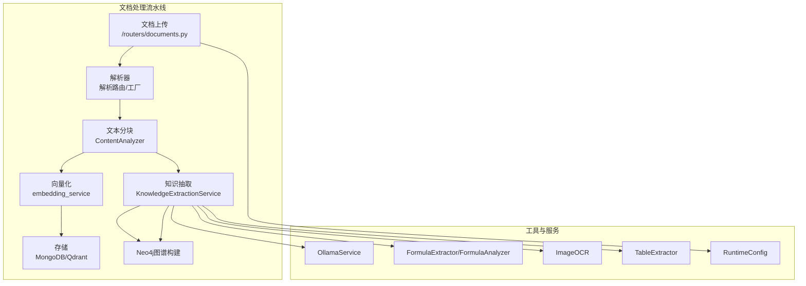
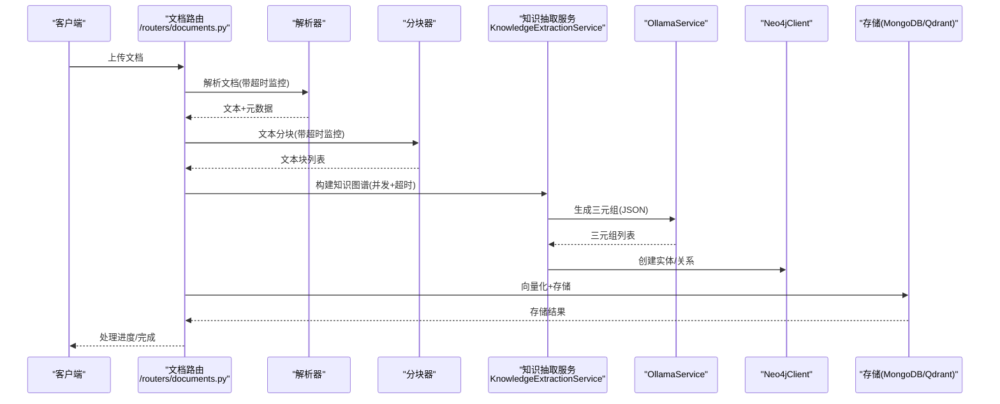
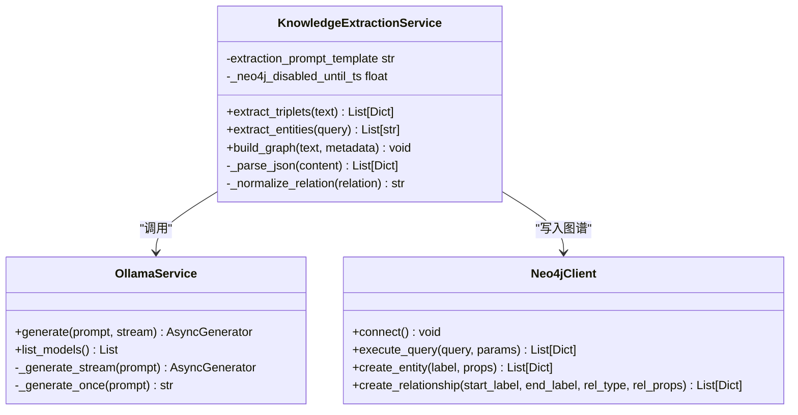
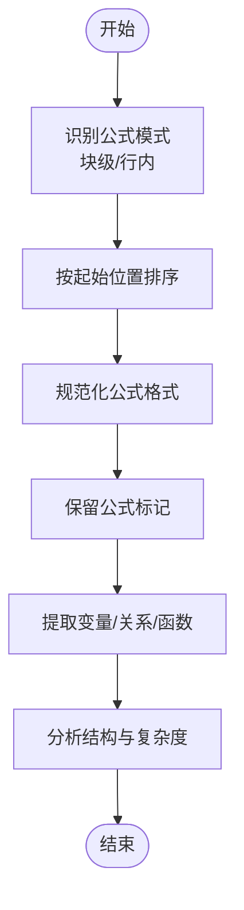
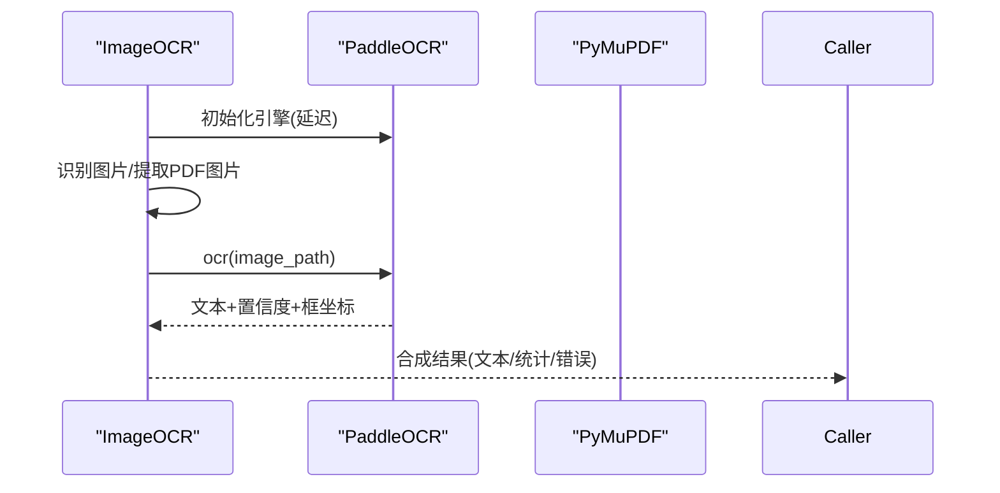
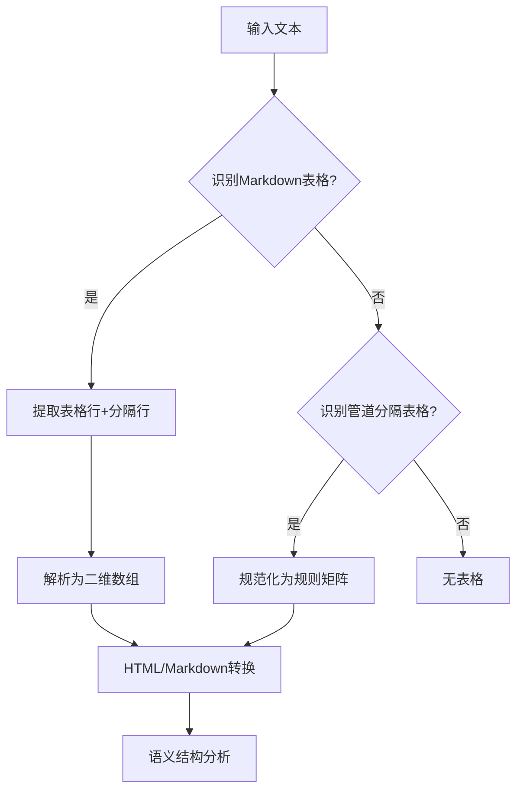
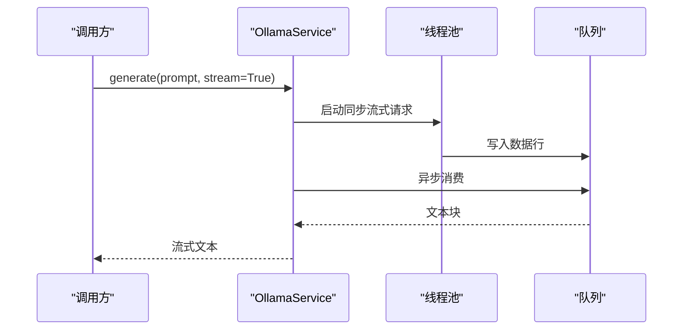
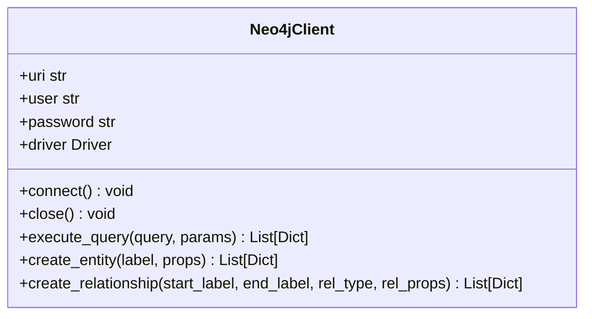
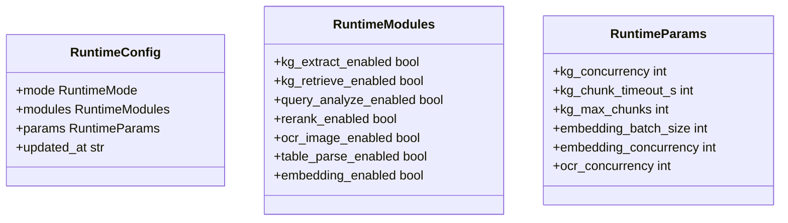
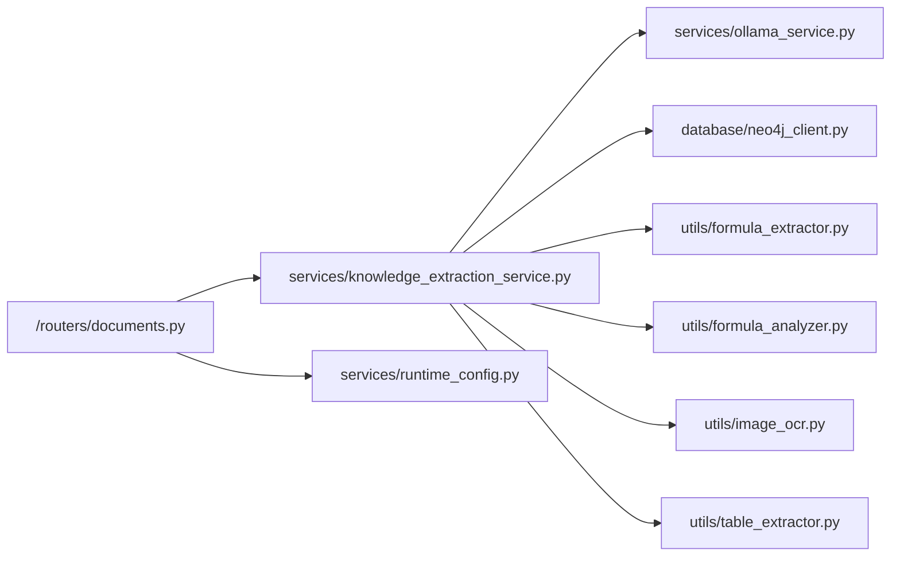

# 知识提取服务

<cite>
**本文档引用的文件**
- [knowledge_extraction_service.py](file://services/knowledge_extraction_service.py)
- [formula_extractor.py](file://utils/formula_extractor.py)
- [formula_analyzer.py](file://utils/formula_analyzer.py)
- [image_ocr.py](file://utils/image_ocr.py)
- [table_extractor.py](file://utils/table_extractor.py)
- [neo4j_client.py](file://database/neo4j_client.py)
- [ollama_service.py](file://services/ollama_service.py)
- [documents.py](file://routers/documents.py)
- [runtime_config.py](file://services/runtime_config.py)
- [logger.py](file://utils/logger.py)
- [requirements.txt](file://requirements.txt)
</cite>

## 目录
1. [简介](#简介)
2. [项目结构](#项目结构)
3. [核心组件](#核心组件)
4. [架构概览](#架构概览)
5. [详细组件分析](#详细组件分析)
6. [依赖关系分析](#依赖关系分析)
7. [性能考虑](#性能考虑)
8. [故障排查指南](#故障排查指南)
9. [结论](#结论)
10. [附录](#附录)

## 简介
本文件面向高级RAG系统的知识提取服务，系统性阐述从原始文档到结构化知识的转换流程，涵盖实体识别、关系抽取、属性提取、公式提取、图片OCR、表格解析等多媒体内容处理策略，并详细说明知识表示方法、存储格式、查询接口及质量评估与性能优化实践。文档同时提供运行时配置参数说明与使用示例，帮助开发者快速集成与调优。

## 项目结构
知识提取服务位于后端服务层，围绕文档处理流水线展开，主要涉及解析、分块、向量化、知识抽取与图谱构建、存储与检索等环节。核心文件分布如下：
- 服务层：知识抽取服务、Ollama服务、运行时配置
- 工具层：公式提取与分析、图片OCR、表格解析
- 数据层：Neo4j客户端、MongoDB/Qdrant存储
- 路由层：文档上传与处理流程

图表来源
- [documents.py:274-800](file://routers/documents.py#L274-L800)
- [knowledge_extraction_service.py:12-228](file://services/knowledge_extraction_service.py#L12-L228)
- [ollama_service.py:9-674](file://services/ollama_service.py#L9-L674)
- [neo4j_client.py:6-104](file://database/neo4j_client.py#L6-L104)
- [runtime_config.py:15-218](file://services/runtime_config.py#L15-L218)

章节来源
- [documents.py:274-800](file://routers/documents.py#L274-L800)
- [knowledge_extraction_service.py:12-228](file://services/knowledge_extraction_service.py#L12-L228)
- [runtime_config.py:15-218](file://services/runtime_config.py#L15-L218)

## 核心组件
- 知识抽取服务：负责从文本中抽取三元组、实体，构建Neo4j知识图谱；支持环境变量开关与连接冷却。
- 公式处理工具：提取LaTeX公式、规范化格式、分析变量与结构。
- 图片OCR工具：基于PaddleOCR提取图片文字，支持PDF内图片OCR。
- 表格解析工具：识别Markdown与管道分隔表格，转换为HTML/Markdown并分析语义结构。
- Ollama服务：封装模型调用，支持流式与非流式生成，具备超时与队列异步处理。
- Neo4j客户端：提供连接、查询、实体与关系创建能力。
- 运行时配置：支持低/高/自定义模式，动态参数调节（并发、超时、批大小等）。

章节来源
- [knowledge_extraction_service.py:12-228](file://services/knowledge_extraction_service.py#L12-L228)
- [formula_extractor.py:6-149](file://utils/formula_extractor.py#L6-L149)
- [formula_analyzer.py:8-233](file://utils/formula_analyzer.py#L8-L233)
- [image_ocr.py:7-224](file://utils/image_ocr.py#L7-L224)
- [table_extractor.py:7-290](file://utils/table_extractor.py#L7-L290)
- [ollama_service.py:9-674](file://services/ollama_service.py#L9-L674)
- [neo4j_client.py:6-104](file://database/neo4j_client.py#L6-L104)
- [runtime_config.py:15-218](file://services/runtime_config.py#L15-L218)

## 架构概览
知识提取服务贯穿文档处理的“解析-分块-向量化-知识抽取-存储”全流程，关键交互如下：
- 文档上传触发后台处理，解析器选择与超时监控保障稳定性。
- 分块路由根据内容类型选择合适分块器，支持超时与进度反馈。
- 知识抽取模块按运行时配置并发处理文本块，调用Ollama抽取三元组并写入Neo4j。
- 向量化与存储阶段支持MongoDB与Qdrant双通道，具备健康检查与批处理优化。

图表来源
- [documents.py:274-800](file://routers/documents.py#L274-L800)
- [knowledge_extraction_service.py:147-228](file://services/knowledge_extraction_service.py#L147-L228)
- [ollama_service.py:50-93](file://services/ollama_service.py#L50-L93)
- [neo4j_client.py:64-101](file://database/neo4j_client.py#L64-L101)

## 详细组件分析

### 知识抽取服务
- 主要职责
  - 从输入文本抽取“实体-关系-实体”三元组，支持JSON格式与Markdown代码块修复。
  - 从用户查询中提取关键实体，辅助检索。
  - 将三元组写入Neo4j，创建实体节点与关系边，支持元数据（文档ID、块ID）注入。
- 关键特性
  - Prompt模板固定三元组格式，强制JSON输出，提升解析稳定性。
  - JSON解析具备多策略修复（直接解析、Markdown代码块提取、单对象兼容）。
  - Neo4j写入采用线程池异步执行，避免阻塞事件循环；连接失败冷却5分钟。
  - 关系名称规范化（大写、下划线、去非法字符），保证图谱一致性。
- 并发与超时
  - 文档处理阶段对知识抽取并发度与单块超时进行参数化控制，避免长文档拖垮整体。
- 环境开关
  - 通过环境变量一键禁用Neo4j图谱构建，便于测试与降级。

图表来源
- [knowledge_extraction_service.py:12-228](file://services/knowledge_extraction_service.py#L12-L228)
- [ollama_service.py:9-674](file://services/ollama_service.py#L9-L674)
- [neo4j_client.py:6-104](file://database/neo4j_client.py#L6-L104)

章节来源
- [knowledge_extraction_service.py:12-228](file://services/knowledge_extraction_service.py#L12-L228)
- [documents.py:420-500](file://routers/documents.py#L420-L500)

### 公式提取与分析
- 公式提取
  - 支持块级与行内LaTeX公式识别，覆盖$$、\[, \]、\begin{...}...\end{...}、$...$、\(...\)等常见格式。
  - 通过位置集合避免重叠匹配，按起始位置排序输出。
- 公式规范化
  - 移除多余空白，将常见符号替换为标准LaTeX符号，确保渲染一致性。
  - 在文本中保留公式标记，避免后续清洗逻辑破坏。
- 物理量识别
  - 识别形如“(X = 值, 单位)”或“$X = 值, 单位$”的物理量定义，便于后续结构化处理。
- 公式分析
  - 提取变量（单字母、下标、正体、文本）、关系（等号、不等号）、函数（sin、cos、log等）与结构特征（分数、根号、积分、求和/求积、矩阵）。
  - 计算复杂度等级（simple/moderate/complex），为渲染与展示提供依据。

图表来源
- [formula_extractor.py:28-149](file://utils/formula_extractor.py#L28-L149)
- [formula_analyzer.py:32-233](file://utils/formula_analyzer.py#L32-L233)

章节来源
- [formula_extractor.py:6-149](file://utils/formula_extractor.py#L6-L149)
- [formula_analyzer.py:8-233](file://utils/formula_analyzer.py#L8-L233)

### 图片OCR
- 功能概述
  - 基于PaddleOCR提取图片文字，支持中文与英文，延迟初始化避免启动时依赖缺失。
  - 支持PDF内图片提取与OCR识别，聚合每页文本与统计信息。
- 输出结构
  - 文本、平均置信度、文字框坐标、行数、错误信息等。
- 错误处理
  - 未安装OCR库、引擎初始化失败、文件不存在、识别失败等情况均有明确错误返回与日志记录。

图表来源
- [image_ocr.py:15-224](file://utils/image_ocr.py#L15-L224)

章节来源
- [image_ocr.py:7-224](file://utils/image_ocr.py#L7-L224)

### 表格解析
- 表格识别
  - 支持Markdown表格与管道分隔表格两种格式，分别解析并标准化为二维数组。
- 格式转换
  - 提供HTML与Markdown两种输出格式，便于前端渲染与二次处理。
- 语义分析
  - 推测行列数、表头、每列数据类型（数值/混合/文本）、是否包含数值列等，辅助后续检索与可视化。

图表来源
- [table_extractor.py:10-290](file://utils/table_extractor.py#L10-L290)

章节来源
- [table_extractor.py:7-290](file://utils/table_extractor.py#L7-L290)

### Ollama服务
- 能力概述
  - 支持流式与非流式生成，具备超时控制与队列异步处理，避免阻塞事件循环。
  - 提供模型列表查询、工具函数调用处理（XML格式）、对话历史与知识库状态注入。
- 异步流式实现
  - 使用线程池执行同步HTTP请求，通过队列在异步环境中传递数据，具备空闲超时与总超时保护。
- 超时与重试
  - 请求超时可配置，默认10分钟；流式响应空闲超时120秒，总超时受请求超时限制。

图表来源
- [ollama_service.py:453-674](file://services/ollama_service.py#L453-L674)

章节来源
- [ollama_service.py:9-674](file://services/ollama_service.py#L9-L674)

### Neo4j客户端
- 能力概述
  - 提供连接、查询、实体创建、关系创建等操作，支持容器环境URI适配（localhost替换为host.docker.internal）。
  - 使用MERGE确保实体唯一性，关系属性可注入文档ID与块ID等元数据。
- 错误处理
  - 连接失败记录日志并置空driver；查询异常捕获并返回None，避免上游崩溃。

图表来源
- [neo4j_client.py:6-104](file://database/neo4j_client.py#L6-L104)

章节来源
- [neo4j_client.py:6-104](file://database/neo4j_client.py#L6-L104)

### 运行时配置
- 模式与模块
  - 低/高/自定义三种模式，模块开关包括kg_extract_enabled、kg_retrieve_enabled、query_analyze_enabled、rerank_enabled、ocr_image_enabled、table_parse_enabled、embedding_enabled。
  - 基础能力embedding永远开启（可调参）。
- 参数与并发
  - kg_concurrency、kg_chunk_timeout_s、kg_max_chunks、embedding_batch_size、embedding_concurrency、ocr_concurrency等。
- 缓存与持久化
  - MongoDB存储，TTL缓存，支持异步/同步读取与合并更新。

图表来源
- [runtime_config.py:15-218](file://services/runtime_config.py#L15-L218)

章节来源
- [runtime_config.py:15-218](file://services/runtime_config.py#L15-L218)

## 依赖关系分析
- 外部依赖
  - FastAPI、PyMuPDF、PaddleOCR、Qdrant、Neo4j、Sentence Transformers等。
- 内部耦合
  - 知识抽取服务依赖Ollama服务与Neo4j客户端；文档路由在后台线程中调用知识抽取服务，受运行时配置控制。
- 循环依赖
  - 未发现循环依赖；模块职责清晰，接口边界明确。

图表来源
- [documents.py:274-800](file://routers/documents.py#L274-L800)
- [knowledge_extraction_service.py:12-228](file://services/knowledge_extraction_service.py#L12-L228)
- [ollama_service.py:9-674](file://services/ollama_service.py#L9-L674)
- [neo4j_client.py:6-104](file://database/neo4j_client.py#L6-L104)
- [runtime_config.py:15-218](file://services/runtime_config.py#L15-L218)

章节来源
- [requirements.txt:1-42](file://requirements.txt#L1-L42)
- [documents.py:274-800](file://routers/documents.py#L274-L800)

## 性能考虑
- 并发与批处理
  - 知识抽取并发度与单块超时参数化，避免长文档拖垮整体；向量化默认批大小50，可按资源调整。
  - 文档处理阶段分批存储向量，降低内存峰值。
- 异步与线程池
  - Ollama流式生成使用线程池执行同步HTTP请求，队列异步消费；知识抽取Neo4j写入使用线程池避免阻塞事件循环。
- 超时与冷却
  - 知识抽取与Ollama生成均设置合理超时；Neo4j连接失败冷却5分钟，避免刷屏。
- 日志与监控
  - 异步文件处理器避免IO阻塞；生产环境降低文件日志级别，减少IO压力。

章节来源
- [documents.py:420-500](file://routers/documents.py#L420-L500)
- [knowledge_extraction_service.py:147-228](file://services/knowledge_extraction_service.py#L147-L228)
- [ollama_service.py:453-674](file://services/ollama_service.py#L453-L674)
- [logger.py:15-88](file://utils/logger.py#L15-L88)

## 故障排查指南
- Neo4j连接失败
  - 现象：日志提示未连接，跳过图谱构建。
  - 处理：检查NEO4J_URI/USER/PASSWORD；确认容器环境URI替换；等待冷却时间后重试。
- Ollama服务不可达
  - 现象：流式生成超时或连接错误。
  - 处理：检查OLLAMA_BASE_URL与模型名称；增大OLLAMA_TIMEOUT；确认模型已下载。
- OCR引擎未初始化
  - 现象：返回错误信息“OCR引擎未初始化”。
  - 处理：安装PaddleOCR并确保可用；检查依赖版本。
- PDF解析失败
  - 现象：未提取到文本或解析超时。
  - 处理：确认PDF可读；使用带进度解析器；检查超时阈值。
- 公式解析异常
  - 现象：公式未识别或渲染异常。
  - 处理：检查LaTeX格式；使用公式规范化工具；确认符号替换映射。

章节来源
- [knowledge_extraction_service.py:155-171](file://services/knowledge_extraction_service.py#L155-L171)
- [ollama_service.py:453-674](file://services/ollama_service.py#L453-L674)
- [image_ocr.py:31-37](file://utils/image_ocr.py#L31-L37)
- [documents.py:48-112](file://routers/documents.py#L48-L112)
- [formula_extractor.py:100-104](file://utils/formula_extractor.py#L100-L104)

## 结论
本知识提取服务通过模块化设计与参数化配置，实现了从多格式文档到结构化知识的高效转换。结合公式、图片、表格等多媒体内容的专项处理，以及Neo4j图谱与向量数据库的双重存储，为检索增强与智能问答提供了坚实基础。建议在生产环境中合理配置并发与超时参数，启用容器环境URI适配，并持续监控日志与性能指标以优化体验。

## 附录

### 知识表示与存储
- 知识表示
  - 三元组：head/head_type/relation/tail/tail_type，关系名称规范化为大写与下划线形式。
  - 公式：LaTeX格式，变量、关系、函数与结构信息，复杂度等级。
  - 表格：二维数组、HTML/Markdown格式、语义结构（行列数、表头、数据类型）。
- 存储格式
  - Neo4j：实体节点（标签+属性）与关系边（类型+属性）。
  - MongoDB：文本块与元数据；Qdrant：向量与轻量payload（chunk_id、document_id、metadata）。

章节来源
- [knowledge_extraction_service.py:147-228](file://services/knowledge_extraction_service.py#L147-L228)
- [neo4j_client.py:64-101](file://database/neo4j_client.py#L64-L101)
- [table_extractor.py:174-223](file://utils/table_extractor.py#L174-L223)

### 查询接口与检索
- 实体查询
  - 从用户查询中提取关键实体，用于图谱检索与上下文融合。
- 图谱检索
  - 基于实体查询一跳邻居，将路径转化为可读文本，与文本知识融合回答。

章节来源
- [knowledge_extraction_service.py:107-146](file://services/knowledge_extraction_service.py#L107-L146)
- [neo4j_client.py:64-101](file://database/neo4j_client.py#L64-L101)

### 使用示例与配置参数
- 示例场景
  - 上传PDF文档，后台自动解析、分块、知识抽取（可选）、向量化与存储。
  - 提交查询，系统提取实体并结合图谱与文本知识生成答案。
- 关键参数
  - kg_concurrency：知识抽取并发数（默认3）
  - kg_chunk_timeout_s：单块超时（默认150秒）
  - kg_max_chunks：最大处理块数（0不限制）
  - embedding_batch_size：向量化批大小（默认50）
  - ocr_concurrency：OCR并发（默认1）
  - NEO4J_ENABLED：是否启用Neo4j（默认true）

章节来源
- [documents.py:420-500](file://routers/documents.py#L420-L500)
- [runtime_config.py:53-83](file://services/runtime_config.py#L53-L83)