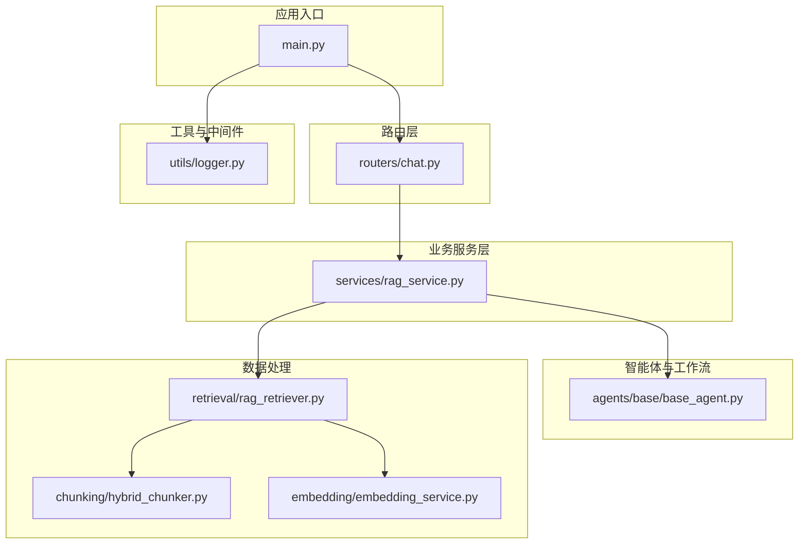
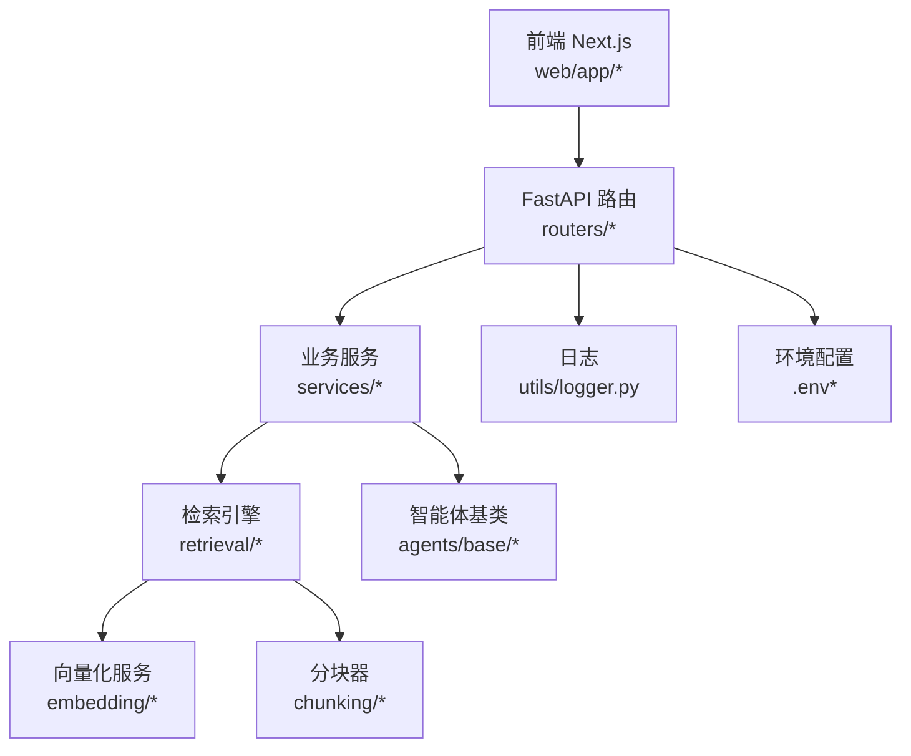
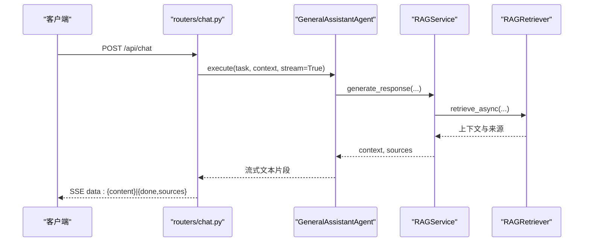
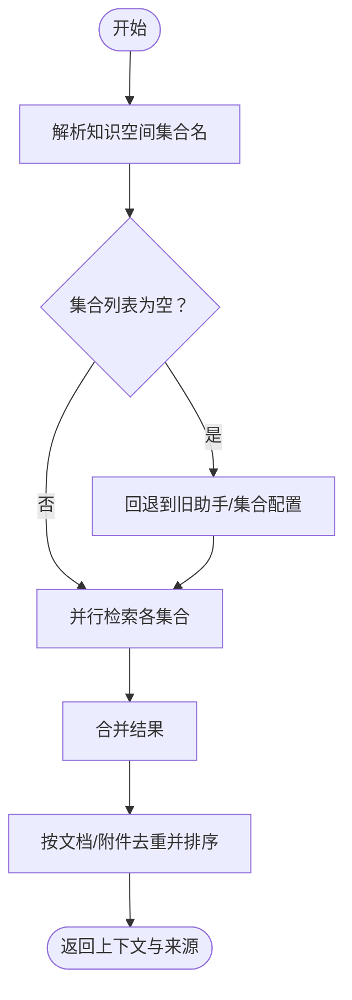
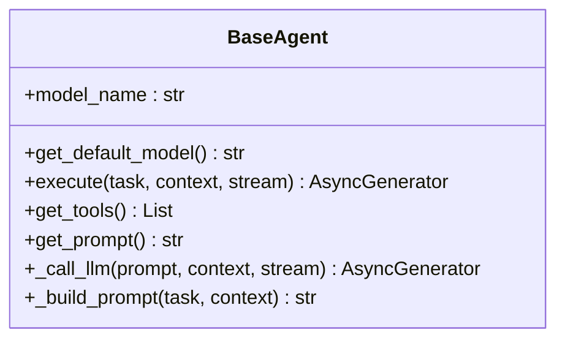
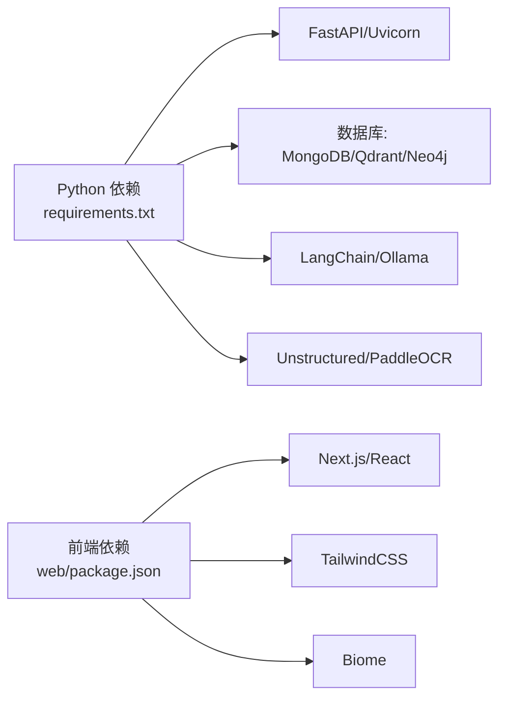

# 代码结构与规范

<cite>
**本文引用的文件**
- [main.py](file://main.py)
- [README.md](file://README.md)
- [requirements.txt](file://requirements.txt)
- [agents/base/base_agent.py](file://agents/base/base_agent.py)
- [services/rag_service.py](file://services/rag_service.py)
- [utils/logger.py](file://utils/logger.py)
- [routers/chat.py](file://routers/chat.py)
- [models/agent_config.py](file://models/agent_config.py)
- [web/package.json](file://web/package.json)
- [web/tsconfig.json](file://web/tsconfig.json)
- [web/biome.json](file://web/biome.json)
- [chunking/hybrid_chunker.py](file://chunking/hybrid_chunker.py)
- [embedding/embedding_service.py](file://embedding/embedding_service.py)
- [retrieval/rag_retriever.py](file://retrieval/rag_retriever.py)
</cite>

## 目录
1. [简介](#简介)
2. [项目结构](#项目结构)
3. [核心组件](#核心组件)
4. [架构总览](#架构总览)
5. [详细组件分析](#详细组件分析)
6. [依赖分析](#依赖分析)
7. [性能考虑](#性能考虑)
8. [故障排查指南](#故障排查指南)
9. [结论](#结论)
10. [附录](#附录)

## 简介
本文件面向 advanced-rag 项目的开发者与维护者，系统化梳理后端 Python 与前端 TypeScript/Next.js 的代码结构、模块划分、命名约定与开发规范；明确核心包职责（agents、services、utils、database、parsers、chunking、embedding、retrieval、routers、models 等）；总结抽象基类与继承体系、接口设计原则、模块依赖关系与循环依赖规避策略；并提供 Python 与前端的编码规范、导入顺序、注释与文档字符串标准，以及常见问题的排查建议。

## 项目结构
项目采用“分层 + 功能域”混合组织方式：
- 应用入口与路由：main.py 负责 FastAPI 应用初始化、中间件与静态资源挂载；routers/ 定义 API 路由。
- 业务层：services/ 实现领域服务；models/ 定义 Pydantic 数据模型。
- 智能体与工作流：agents/ 提供抽象基类与具体 Agent 实现，workflow/ 协调多 Agent。
- 数据处理：chunking/ 文本分块；embedding/ 向量化；retrieval/ 检索；database/ 数据库客户端。
- 工具与中间件：utils/ 通用工具与日志；middleware/ 中间件。
- 前端：web/ Next.js 应用，包含页面、组件、类型与构建配置。

图表来源
- [main.py:55-98](file://main.py#L55-L98)
- [routers/chat.py:615-751](file://routers/chat.py#L615-L751)
- [services/rag_service.py:7-248](file://services/rag_service.py#L7-L248)
- [agents/base/base_agent.py:8-122](file://agents/base/base_agent.py#L8-L122)
- [chunking/hybrid_chunker.py:9-179](file://chunking/hybrid_chunker.py#L9-L179)
- [embedding/embedding_service.py:8-278](file://embedding/embedding_service.py#L8-L278)
- [retrieval/rag_retriever.py:22-325](file://retrieval/rag_retriever.py#L22-L325)
- [utils/logger.py:15-88](file://utils/logger.py#L15-L88)

章节来源
- [main.py:1-157](file://main.py#L1-L157)
- [README.md:55-70](file://README.md#L55-L70)

## 核心组件
- 应用入口与中间件
  - main.py：初始化 FastAPI、CORS、日志中间件、静态资源挂载、路由注册与全局异常处理。
  - utils/logger.py：异步日志写入、文件轮转、环境级别控制。
- 路由与模型
  - routers/chat.py：对话、深度研究、模型列表等 API；Pydantic 模型定义。
  - models/agent_config.py：Agent 配置模型。
- 服务层
  - services/rag_service.py：RAG 检索与生成服务封装，支持多集合并行检索、来源去重与回退策略。
- 智能体与工作流
  - agents/base/base_agent.py：抽象基类，统一模型注入、提示词构建与 LLM 调用。
- 数据处理
  - chunking/hybrid_chunker.py：混合分块（规则+语义），去重与元数据。
  - embedding/embedding_service.py：Ollama 向量化服务，模型检测与重试。
  - retrieval/rag_retriever.py：向量/关键词/图谱混合检索，结果合并与重排占位。
- 前端
  - web/package.json、web/tsconfig.json、web/biome.json：依赖、编译与格式化配置。

章节来源
- [main.py:55-126](file://main.py#L55-L126)
- [utils/logger.py:15-88](file://utils/logger.py#L15-L88)
- [routers/chat.py:20-82](file://routers/chat.py#L20-L82)
- [models/agent_config.py:6-24](file://models/agent_config.py#L6-L24)
- [services/rag_service.py:7-248](file://services/rag_service.py#L7-L248)
- [agents/base/base_agent.py:8-122](file://agents/base/base_agent.py#L8-L122)
- [chunking/hybrid_chunker.py:9-179](file://chunking/hybrid_chunker.py#L9-L179)
- [embedding/embedding_service.py:8-278](file://embedding/embedding_service.py#L8-L278)
- [retrieval/rag_retriever.py:22-325](file://retrieval/rag_retriever.py#L22-L325)
- [web/package.json:1-40](file://web/package.json#L1-L40)
- [web/tsconfig.json:1-35](file://web/tsconfig.json#L1-L35)
- [web/biome.json:1-38](file://web/biome.json#L1-L38)

## 架构总览
后端采用“路由层-服务层-数据处理层-基础设施层”的分层架构，配合 agents 工作流实现多 Agent 协作与深度研究。前端 Next.js 通过 SSE 与后端交互，实现流式对话与深度研究结果渲染。

图表来源
- [main.py:55-98](file://main.py#L55-L98)
- [routers/chat.py:615-751](file://routers/chat.py#L615-L751)
- [services/rag_service.py:7-248](file://services/rag_service.py#L7-L248)
- [retrieval/rag_retriever.py:22-325](file://retrieval/rag_retriever.py#L22-L325)
- [embedding/embedding_service.py:8-278](file://embedding/embedding_service.py#L8-L278)
- [chunking/hybrid_chunker.py:9-179](file://chunking/hybrid_chunker.py#L9-L179)
- [agents/base/base_agent.py:8-122](file://agents/base/base_agent.py#L8-L122)
- [utils/logger.py:15-88](file://utils/logger.py#L15-L88)

## 详细组件分析

### 路由层（routers/chat.py）
- 职责：定义对话、深度研究、模型列表等 API；参数校验与响应封装。
- 关键点：
  - SSE 流式响应，支持客户端断开检测与优雅中断。
  - 对话历史读取与标题自动生成（后台任务）。
  - 深度研究模式通过 AgentWorkflow 与 ResponseBuilder 协作。
- 设计要点：Pydantic 模型集中定义请求/响应结构，便于前后端契约一致。

图表来源
- [routers/chat.py:615-751](file://routers/chat.py#L615-L751)
- [services/rag_service.py:193-242](file://services/rag_service.py#L193-L242)
- [retrieval/rag_retriever.py:69-101](file://retrieval/rag_retriever.py#L69-L101)

章节来源
- [routers/chat.py:20-82](file://routers/chat.py#L20-L82)
- [routers/chat.py:615-800](file://routers/chat.py#L615-L800)

### 服务层（services/rag_service.py）
- 职责：封装 RAG 检索与生成流程，支持多知识空间集合并行检索、来源去重与回退策略。
- 关键点：
  - 多集合检索：从知识空间或旧助手配置解析集合名，异步 gather 并合并结果。
  - 来源去重：按文档/附件维度保留最高分 chunk。
  - 回退策略：检索失败时可选择不使用上下文继续处理。
- 性能：事件循环与 gather 并行，减少串行等待。

图表来源
- [services/rag_service.py:10-191](file://services/rag_service.py#L10-L191)

章节来源
- [services/rag_service.py:7-248](file://services/rag_service.py#L7-L248)

### 智能体基类（agents/base/base_agent.py）
- 职责：统一 Agent 接口、模型注入、提示词构建与 LLM 调用。
- 关键点：
  - 抽象方法：get_default_model、execute。
  - 工具扩展：get_tools 可扩展 LangChain 工具。
  - 提示词：get_prompt 与 _build_prompt 组合系统提示与上下文。
  - LLM 调用：_call_llm 封装 OllamaService，支持流式输出。
- 设计要点：通过继承扩展不同角色 Agent（如专家、协调者、通用助手）。

图表来源
- [agents/base/base_agent.py:8-122](file://agents/base/base_agent.py#L8-L122)

章节来源
- [agents/base/base_agent.py:8-122](file://agents/base/base_agent.py#L8-L122)

### 数据处理（chunking/hybrid_chunker.py）
- 职责：混合分块（规则+语义），保持代码/公式/表格完整性，去重与元数据标注。
- 关键点：
  - 正则提取代码块、公式、表格，其余文本走语义分块。
  - 哈希去重，避免重复块。
  - 元数据 content_type 标注，便于后续检索与可视化。

章节来源
- [chunking/hybrid_chunker.py:9-179](file://chunking/hybrid_chunker.py#L9-L179)

### 向量化服务（embedding/embedding_service.py）
- 职责：基于 Ollama 的文本向量化，模型名称规范化与自动检测，失败重试。
- 关键点：
  - 模型名称规范化：处理带/不带标签的模型名匹配。
  - 自动检测：遍历 Ollama 模型列表，优先匹配 embedding 关键词。
  - 超时与连接错误重试，超长文本截断避免 Ollama 错误。
  - 维度延迟探测，首次调用确定向量维度。

章节来源
- [embedding/embedding_service.py:8-278](file://embedding/embedding_service.py#L8-L278)

### 检索引擎（retrieval/rag_retriever.py）
- 职责：混合检索（向量/关键词/图谱），结果合并与重排占位。
- 关键点：
  - 并行策略：向量、关键词、图谱检索并行执行。
  - 合并策略：向量基础分，关键词 Boost，图谱额外加分。
  - 重排占位：sentence-transformers 暂禁用，预留 rerank 接口。
  - 图谱检索：实体抽取后查询一跳邻居，构造知识文本。

章节来源
- [retrieval/rag_retriever.py:22-325](file://retrieval/rag_retriever.py#L22-L325)

### 日志系统（utils/logger.py）
- 职责：异步文件写入、队列监听、滚动日志、环境级别控制。
- 关键点：
  - QueueListener 后台线程写文件，避免阻塞主请求。
  - 生产环境降低文件日志级别，减少 IO 压力。
  - 第三方库日志抑制，降低噪音。

章节来源
- [utils/logger.py:15-88](file://utils/logger.py#L15-L88)

### 前端（web/Next.js）
- 职责：聊天界面、文档管理、知识空间展示等页面与组件。
- 关键点：
  - package.json：依赖与脚本（dev/build/start/lint/format）。
  - tsconfig.json：严格模式、路径别名、JSX 配置。
  - biome.json：格式化与 Lint 规则、Next/React 推荐规则。

章节来源
- [web/package.json:1-40](file://web/package.json#L1-L40)
- [web/tsconfig.json:1-35](file://web/tsconfig.json#L1-L35)
- [web/biome.json:1-38](file://web/biome.json#L1-L38)

## 依赖分析
- 后端依赖
  - FastAPI、Uvicorn、MongoDB/Motor、Qdrant、Neo4j、Ollama、LangChain、PaddleOCR、Unstructured、PyPDF2/Docx 等。
  - requirements.txt 明确版本范围与功能域。
- 前端依赖
  - Next.js、React、MathJax、react-markdown、tailwindcss 等。
  - biome 作为 Lint/Format 工具链。

图表来源
- [requirements.txt:4-38](file://requirements.txt#L4-L38)
- [web/package.json:12-38](file://web/package.json#L12-L38)

章节来源
- [requirements.txt:1-38](file://requirements.txt#L1-L38)
- [web/package.json:1-40](file://web/package.json#L1-L40)

## 性能考虑
- 并行检索：服务层对多集合检索使用 gather 并行，减少总耗时。
- 异步日志：后台线程写文件，避免阻塞请求。
- 流式输出：SSE 流式响应，边生成边发送，降低首字节延迟。
- 超时与重试：向量化服务对 Ollama 请求进行指数退避重试。
- 资源限制：生产环境 UVICORN_WORKERS 与 keep-alive 超时配置，提升吞吐与稳定性。

章节来源
- [services/rag_service.py:65-83](file://services/rag_service.py#L65-L83)
- [utils/logger.py:56-82](file://utils/logger.py#L56-L82)
- [main.py:128-157](file://main.py#L128-L157)
- [embedding/embedding_service.py:175-229](file://embedding/embedding_service.py#L175-L229)

## 故障排查指南
- 全局异常处理
  - main.py 注册全局异常处理器，记录路径与方法，返回统一 JSON。
- 日志定位
  - utils/logger.py 提供异步日志与环境级别控制，生产环境降低文件日志级别。
- 检索失败回退
  - services/rag_service.py 在检索失败时可选择回退到不使用上下文继续处理。
- Ollama 模型问题
  - embedding/embedding_service.py 支持模型名称规范化与自动检测，失败重试与超时处理。
- 前端格式化与 Lint
  - web/biome.json 启用推荐规则与导入整理，确保代码风格一致。

章节来源
- [main.py:109-126](file://main.py#L109-L126)
- [utils/logger.py:77-82](file://utils/logger.py#L77-L82)
- [services/rag_service.py:225-236](file://services/rag_service.py#L225-L236)
- [embedding/embedding_service.py:175-229](file://embedding/embedding_service.py#L175-L229)
- [web/biome.json:17-36](file://web/biome.json#L17-L36)

## 结论
advanced-rag 采用清晰的分层与功能域划分，结合 agents 工作流实现多 Agent 协作与深度研究；服务层通过并行检索与回退策略保障鲁棒性；前端以 Next.js 与 Biome 提供现代化开发体验。建议在新增模块时遵循现有命名与分层约定，优先使用抽象基类与 Pydantic 模型，确保可维护性与一致性。

## 附录

### Python 编码规范（后端）
- 导入顺序
  - 标准库 → 第三方库 → 项目内模块（按层级分组，同组内字母序）。
- 注释与文档字符串
  - 模块顶部使用三引号文档字符串说明用途。
  - 类与函数提供简洁文档字符串，参数与返回值清晰描述。
  - 复杂逻辑处使用行内注释说明动机与边界条件。
- 命名约定
  - 模块与包：小写下划线（如 chunking、embedding）。
  - 类：帕斯卡命名（如 BaseAgent、RAGService）。
  - 函数与变量：小写下划线（如 retrieve_async、embedding_service）。
  - 常量：全大写（如 MAX_UPLOAD_SIZE）。
- 异常处理
  - 明确捕获与重抛，记录上下文信息；必要时提供回退策略。
- 并发与异步
  - 优先使用 asyncio.gather 并行；注意事件循环与阻塞调用。
- 日志
  - 使用统一 logger，区分 INFO/WARNING/ERROR；生产环境降低文件日志级别。

章节来源
- [agents/base/base_agent.py:8-122](file://agents/base/base_agent.py#L8-L122)
- [services/rag_service.py:7-248](file://services/rag_service.py#L7-L248)
- [utils/logger.py:15-88](file://utils/logger.py#L15-L88)

### TypeScript/JavaScript 前端开发规范（Next.js）
- 语言与编译
  - tsconfig.json 启用严格模式、路径别名与 JSX。
- 格式化与 Lint
  - biome.json 启用推荐规则与导入整理；脚本通过 package.json 调用。
- 组件与类型
  - 类型定义集中在 web/types/；组件按功能拆分并在 components/ 下组织。
- 页面与路由
  - Next.js App Router 风格，页面组件位于 web/app/ 下，支持动态路由与布局。
- 依赖管理
  - package.json 明确运行时与开发依赖；optionalDependencies 适配平台差异。

章节来源
- [web/tsconfig.json:1-35](file://web/tsconfig.json#L1-L35)
- [web/biome.json:1-38](file://web/biome.json#L1-L38)
- [web/package.json:1-40](file://web/package.json#L1-L40)

### 模块依赖关系与循环依赖规避
- 依赖方向
  - 路由层 → 服务层 → 检索/分块/向量化 → 数据库客户端。
  - 服务层不反向依赖路由层，避免循环。
- 循环依赖规避策略
  - 使用局部导入（如 def 内部 import）延迟绑定。
  - 通过工厂/配置对象解耦高层模块与底层实现。
  - 明确分层边界，避免跨层直接调用。

章节来源
- [routers/chat.py:615-751](file://routers/chat.py#L615-L751)
- [services/rag_service.py:34-68](file://services/rag_service.py#L34-L68)
- [retrieval/rag_retriever.py:51-101](file://retrieval/rag_retriever.py#L51-L101)

### 接口设计原则与扩展点
- 抽象基类
  - agents/base/base_agent.py 定义统一接口，扩展新 Agent 仅需实现抽象方法。
- 配置模型
  - models/agent_config.py 使用 Pydantic，保证配置校验与序列化一致性。
- 服务接口
  - services/rag_service.py 通过参数化集合名与模型名，支持多助手与多模型场景。
- 扩展点识别
  - 检索器：可替换/新增检索策略（如 BM25、ColBERT）。
  - 分块器：可扩展规则与语义策略组合。
  - 向量化：可切换 Ollama 外的其他嵌入服务。

章节来源
- [agents/base/base_agent.py:27-55](file://agents/base/base_agent.py#L27-L55)
- [models/agent_config.py:6-24](file://models/agent_config.py#L6-L24)
- [services/rag_service.py:10-33](file://services/rag_service.py#L10-L33)
- [retrieval/rag_retriever.py:22-50](file://retrieval/rag_retriever.py#L22-L50)
- [chunking/hybrid_chunker.py:9-51](file://chunking/hybrid_chunker.py#L9-L51)
- [embedding/embedding_service.py:8-44](file://embedding/embedding_service.py#L8-L44)