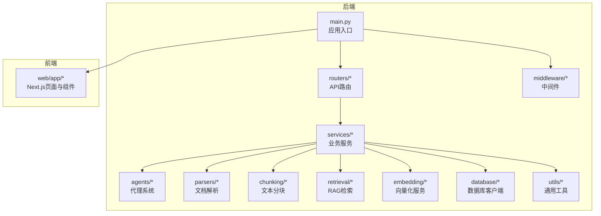
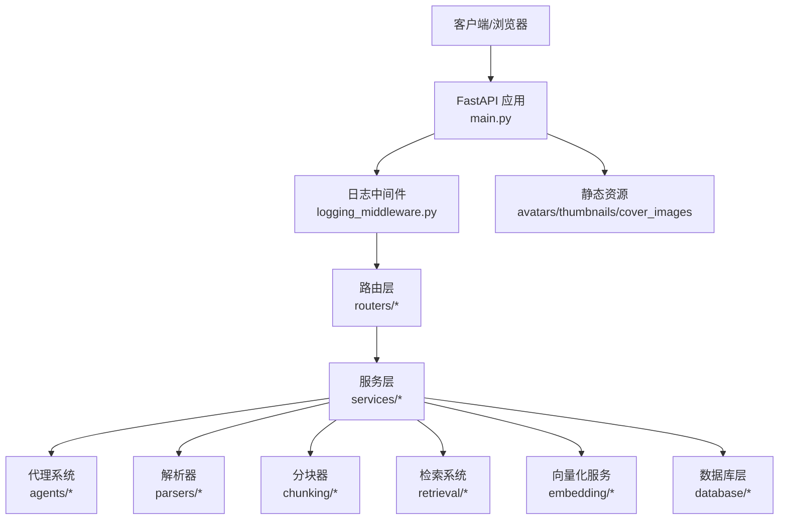
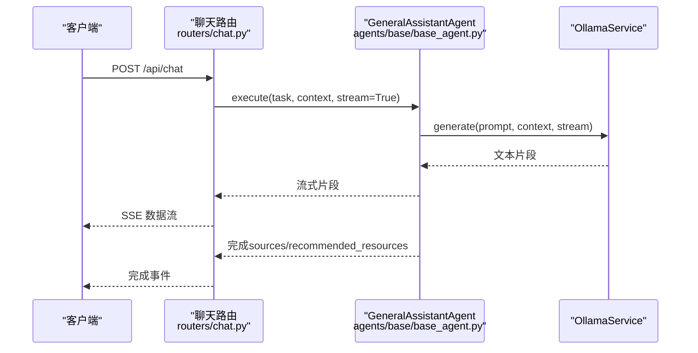
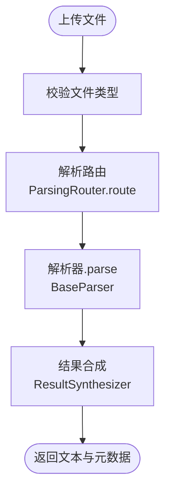
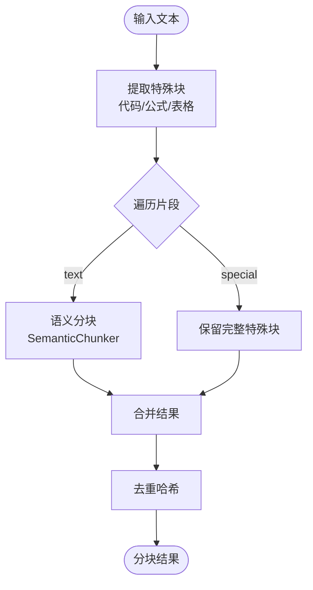
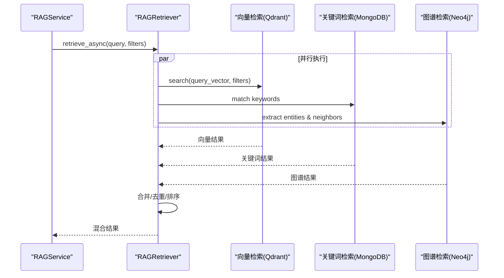
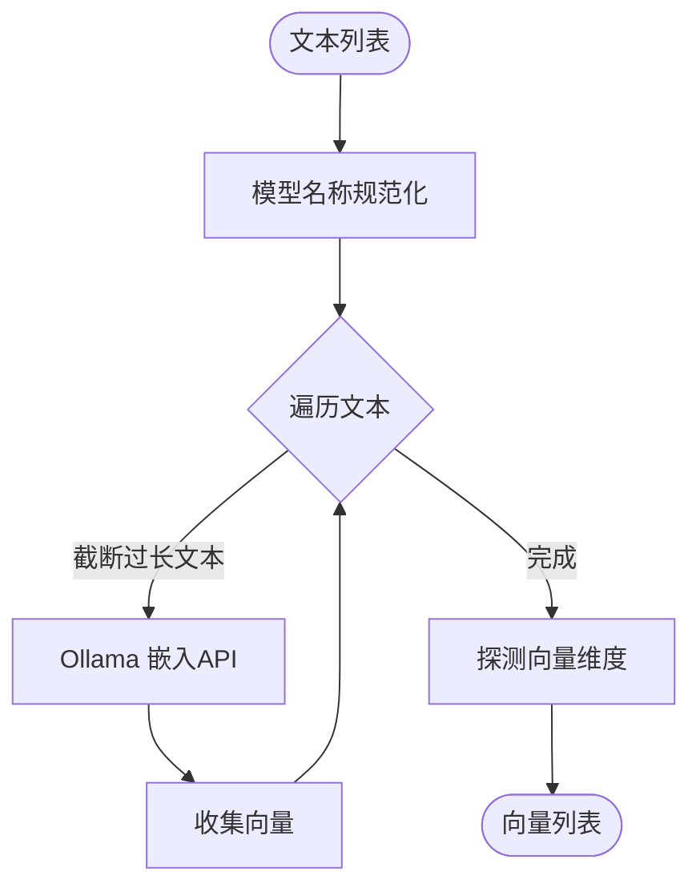
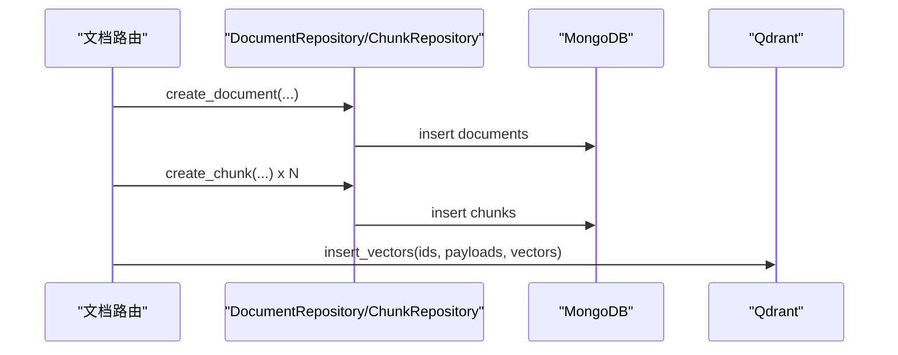
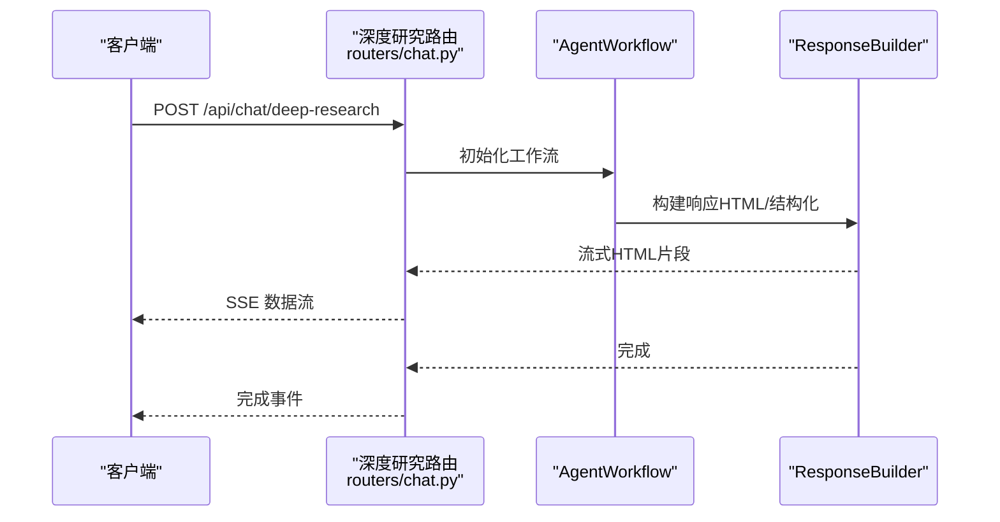
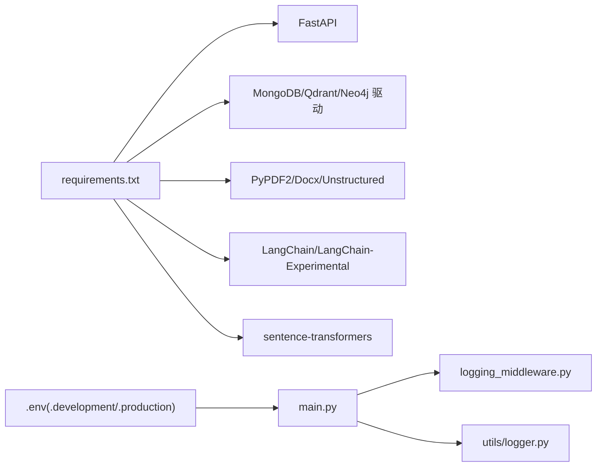

# 开发指南

<cite>
**本文引用的文件**
- [README.md](file://README.md)
- [main.py](file://main.py)
- [requirements.txt](file://requirements.txt)
- [agents/base/base_agent.py](file://agents/base/base_agent.py)
- [parsers/base.py](file://parsers/base.py)
- [parsers/parser_factory.py](file://parsers/parser_factory.py)
- [chunking/hybrid_chunker.py](file://chunking/hybrid_chunker.py)
- [retrieval/rag_retriever.py](file://retrieval/rag_retriever.py)
- [embedding/embedding_service.py](file://embedding/embedding_service.py)
- [database/mongodb.py](file://database/mongodb.py)
- [services/rag_service.py](file://services/rag_service.py)
- [routers/chat.py](file://routers/chat.py)
- [routers/documents.py](file://routers/documents.py)
- [utils/logger.py](file://utils/logger.py)
- [utils/lifespan.py](file://utils/lifespan.py)
- [middleware/logging_middleware.py](file://middleware/logging_middleware.py)
</cite>

## 目录
1. [简介](#简介)
2. [项目结构](#项目结构)
3. [核心组件](#核心组件)
4. [架构总览](#架构总览)
5. [详细组件分析](#详细组件分析)
6. [依赖分析](#依赖分析)
7. [性能考虑](#性能考虑)
8. [故障排查指南](#故障排查指南)
9. [结论](#结论)
10. [附录](#附录)

## 简介
advanced-rag 是一个“纯开源高级RAG系统”，基于 FastAPI + Next.js 构建，专注于 AI 助手对话（含深度研究/深度思考）与知识库检索/入库两大能力，所有 API 支持匿名访问。系统采用模块化设计，包含代理系统、解析器、分块器、检索系统、服务层、路由层、评测系统等核心模块。

- 快速开始与环境配置参见 [README.md](file://README.md)
- 后端入口与路由注册参见 [main.py](file://main.py)
- 依赖管理参见 [requirements.txt](file://requirements.txt)

**章节来源**
- [README.md:1-290](file://README.md#L1-L290)
- [main.py:1-157](file://main.py#L1-L157)
- [requirements.txt:1-38](file://requirements.txt#L1-L38)

## 项目结构
项目采用按功能域划分的目录组织方式，清晰分离路由层、服务层、模型层、数据库层、工具层与中间件层。前端位于 web/ 目录，后端核心位于根目录。

**图表来源**
- [main.py:90-98](file://main.py#L90-L98)
- [README.md:55-70](file://README.md#L55-L70)

**章节来源**
- [README.md:55-70](file://README.md#L55-L70)
- [main.py:90-98](file://main.py#L90-L98)

## 核心组件
- 代理系统（agents/）：多 Agent 协作框架，提供抽象基类与通用执行流程，便于扩展专家 Agent 与工作流 Agent。
- 解析器（parsers/）：多格式文档解析，支持 PDF、Word、Markdown、Text 等，提供工厂与路由机制。
- 分块器（chunking/）：混合分块器，结合规则分块（代码/公式/表格）与语义分块，支持去重与元数据。
- 检索系统（retrieval/）：混合检索（向量 + 关键词 + 图谱），支持重排与多集合检索。
- 服务层（services/）：RAG 服务封装、知识抽取服务、Ollama 服务等。
- 路由层（routers/）：API 路由定义，包括聊天、文档、检索、助手、知识空间、健康检查等。
- 数据库层（database/）：MongoDB、Qdrant、Neo4j 客户端与仓储类。
- 工具层（utils/）：日志、生命周期管理、监控、时区等通用工具。
- 中间件（middleware/）：请求日志与性能监控中间件。

**章节来源**
- [README.md:46-54](file://README.md#L46-L54)
- [agents/base/base_agent.py:8-122](file://agents/base/base_agent.py#L8-L122)
- [parsers/base.py:6-32](file://parsers/base.py#L6-L32)
- [parsers/parser_factory.py:10-41](file://parsers/parser_factory.py#L10-L41)
- [chunking/hybrid_chunker.py:9-179](file://chunking/hybrid_chunker.py#L9-L179)
- [retrieval/rag_retriever.py:22-325](file://retrieval/rag_retriever.py#L22-L325)
- [embedding/embedding_service.py:8-278](file://embedding/embedding_service.py#L8-L278)
- [database/mongodb.py:92-200](file://database/mongodb.py#L92-L200)
- [services/rag_service.py:7-248](file://services/rag_service.py#L7-L248)
- [routers/chat.py:17-800](file://routers/chat.py#L17-L800)
- [routers/documents.py:20-800](file://routers/documents.py#L20-L800)
- [utils/logger.py:15-88](file://utils/logger.py#L15-L88)
- [utils/lifespan.py:26-88](file://utils/lifespan.py#L26-L88)
- [middleware/logging_middleware.py:8-52](file://middleware/logging_middleware.py#L8-L52)

## 架构总览
后端采用 FastAPI 应用入口，注册路由并挂载静态资源，通过中间件统一记录请求日志与性能指标。服务层通过数据库与外部服务（Ollama、Qdrant、Neo4j）协同完成 RAG 流程。

**图表来源**
- [main.py:72-98](file://main.py#L72-L98)
- [middleware/logging_middleware.py:8-52](file://middleware/logging_middleware.py#L8-L52)
- [routers/chat.py:615-751](file://routers/chat.py#L615-L751)
- [routers/documents.py:723-800](file://routers/documents.py#L723-L800)

**章节来源**
- [main.py:55-126](file://main.py#L55-L126)
- [middleware/logging_middleware.py:8-52](file://middleware/logging_middleware.py#L8-L52)
- [routers/chat.py:615-751](file://routers/chat.py#L615-L751)
- [routers/documents.py:723-800](file://routers/documents.py#L723-L800)

## 详细组件分析

### 代理系统（Agents）
- 设计要点
  - 抽象基类定义统一接口，包含默认模型获取、任务执行（支持流式）、工具与提示词扩展点。
  - 通过 OllamaService 调用本地模型，支持流式输出与断连检测。
- 扩展机制
  - 新增专家 Agent：继承 BaseAgent，实现 get_default_model 与 execute，必要时重写 get_tools/get_prompt。
  - 工作流 Agent：通过 AgentWorkflow 协调多个专家 Agent，配合 ResponseBuilder 输出结构化结果。
- 关键流程（流式对话）

**图表来源**
- [routers/chat.py:615-751](file://routers/chat.py#L615-L751)
- [agents/base/base_agent.py:37-98](file://agents/base/base_agent.py#L37-L98)

**章节来源**
- [agents/base/base_agent.py:8-122](file://agents/base/base_agent.py#L8-L122)
- [routers/chat.py:615-751](file://routers/chat.py#L615-L751)

### 文档解析器（Parsers）
- 设计要点
  - BaseParser 定义解析接口与扩展名支持能力；ParserFactory 维护解析器列表与注册机制。
  - ParsingRouter 与 ResultSynthesizer 提供增强解析与结果统一。
- 扩展新格式
  - 新建解析器类，实现 parse 与 supported_extensions，通过 ParserFactory.register_parser 注册。
  - 或通过 ParsingRouter.route 机制接入增强解析链路。
- 关键流程（文档入库）

**图表来源**
- [parsers/base.py:6-32](file://parsers/base.py#L6-L32)
- [parsers/parser_factory.py:10-41](file://parsers/parser_factory.py#L10-L41)
- [routers/documents.py:316-361](file://routers/documents.py#L316-L361)

**章节来源**
- [parsers/base.py:6-32](file://parsers/base.py#L6-L32)
- [parsers/parser_factory.py:10-41](file://parsers/parser_factory.py#L10-L41)
- [routers/documents.py:316-361](file://routers/documents.py#L316-L361)

### 文本分块器（Chunking）
- 设计要点
  - HybridChunker 结合规则分块（代码块、公式、表格）与语义分块，支持去重与元数据标注。
  - 通过 ContentAnalyzer 路由选择合适分块器。
- 关键流程（分块与去重）

**图表来源**
- [chunking/hybrid_chunker.py:52-122](file://chunking/hybrid_chunker.py#L52-L122)

**章节来源**
- [chunking/hybrid_chunker.py:9-179](file://chunking/hybrid_chunker.py#L9-L179)

### 检索系统（RAGRetriever）
- 设计要点
  - 混合检索：向量检索（Qdrant）、关键词检索（MongoDB）、图谱检索（Neo4j）。
  - 结果合并与重排（Cross-Encoder，当前环境条件限制下可选）。
- 关键流程（异步检索）

**图表来源**
- [services/rag_service.py:64-83](file://services/rag_service.py#L64-L83)
- [retrieval/rag_retriever.py:69-101](file://retrieval/rag_retriever.py#L69-L101)

**章节来源**
- [services/rag_service.py:7-248](file://services/rag_service.py#L7-L248)
- [retrieval/rag_retriever.py:22-325](file://retrieval/rag_retriever.py#L22-L325)

### 向量化服务（EmbeddingService）
- 设计要点
  - 基于 Ollama 的嵌入服务，支持模型名称规范化、自动检测、重试与超时控制。
  - 提供 encode/encode_single 与维度探测。
- 关键流程（向量化）

**图表来源**
- [embedding/embedding_service.py:175-264](file://embedding/embedding_service.py#L175-L264)

**章节来源**
- [embedding/embedding_service.py:8-278](file://embedding/embedding_service.py#L8-L278)

### 数据库与仓储（MongoDB）
- 设计要点
  - 异步/同步客户端分离，支持连接池配置与延迟初始化。
  - DocumentRepository/ChunkRepository 提供文档与分块的 CRUD 与统计能力。
- 关键流程（文档入库）

**图表来源**
- [routers/documents.py:274-722](file://routers/documents.py#L274-L722)
- [database/mongodb.py:315-800](file://database/mongodb.py#L315-L800)

**章节来源**
- [database/mongodb.py:92-200](file://database/mongodb.py#L92-L200)
- [routers/documents.py:274-722](file://routers/documents.py#L274-L722)

### 路由层（Routers）
- 设计要点
  - 聊天路由：支持常规对话与深度研究模式，流式输出与断连检测。
  - 文档路由：上传、解析、分块、向量化、入库全流程，进度与状态管理。
- 关键流程（深度研究）

**图表来源**
- [routers/chat.py:753-800](file://routers/chat.py#L753-L800)

**章节来源**
- [routers/chat.py:17-800](file://routers/chat.py#L17-L800)
- [routers/documents.py:20-800](file://routers/documents.py#L20-L800)

## 依赖分析
- 运行时依赖集中在 requirements.txt，涵盖 FastAPI、数据库驱动、文档解析库、LangChain、sentence-transformers 等。
- 环境变量与配置通过 .env 文件加载，main.py 根据 ENVIRONMENT 选择 .env.development 或 .env.production。
- 中间件与日志模块提供统一的请求追踪与性能监控。

**图表来源**
- [requirements.txt:4-38](file://requirements.txt#L4-L38)
- [main.py:20-52](file://main.py#L20-L52)

**章节来源**
- [requirements.txt:1-38](file://requirements.txt#L1-L38)
- [main.py:20-52](file://main.py#L20-L52)
- [utils/logger.py:15-88](file://utils/logger.py#L15-L88)
- [middleware/logging_middleware.py:8-52](file://middleware/logging_middleware.py#L8-L52)

## 性能考虑
- 连接池与并发
  - MongoDB 连接池参数可配置，建议根据 worker 数量与负载调整 maxPoolSize/minPoolSize。
  - Uvicorn 生产环境默认多 worker，开发环境单 worker 并启用 reload。
- I/O 与超时
  - 文档解析与分块均采用线程监控与超时控制，避免长时间阻塞。
  - 向量化分批处理，降低内存峰值。
- 日志与监控
  - 异步文件处理器与队列监听器减少日志写入对主线程的影响。
  - 中间件记录慢请求与错误，便于定位性能瓶颈。

**章节来源**
- [database/mongodb.py:122-151](file://database/mongodb.py#L122-L151)
- [main.py:139-157](file://main.py#L139-L157)
- [routers/documents.py:114-188](file://routers/documents.py#L114-L188)
- [routers/documents.py:190-272](file://routers/documents.py#L190-L272)
- [utils/logger.py:15-88](file://utils/logger.py#L15-L88)
- [middleware/logging_middleware.py:8-52](file://middleware/logging_middleware.py#L8-L52)

## 故障排查指南
- 全局异常处理
  - main.py 注册全局异常处理器，统一记录错误并返回 JSON。
- 数据库连接
  - utils/lifespan 在启动时重试连接 MongoDB，并初始化默认助手与知识空间。
- 日志与中间件
  - middleware/logging_middleware 记录请求与响应状态码、处理时间，慢请求与错误会被特别标注。
  - utils/logger 提供异步日志写入，生产环境降低 INFO 级别日志量。
- 常见问题
  - Ollama 模型未找到：检查 OLLAMA_EMBEDDING_MODEL 与模型名称规范化。
  - Qdrant 不可用：入库阶段会降级为仅存储到 MongoDB。
  - 解析超时：文档较大时会触发超时保护，建议优化解析器或拆分文档。

**章节来源**
- [main.py:109-126](file://main.py#L109-L126)
- [utils/lifespan.py:26-88](file://utils/lifespan.py#L26-L88)
- [middleware/logging_middleware.py:8-52](file://middleware/logging_middleware.py#L8-L52)
- [utils/logger.py:15-88](file://utils/logger.py#L15-L88)
- [embedding/embedding_service.py:175-229](file://embedding/embedding_service.py#L175-L229)
- [routers/documents.py:546-559](file://routers/documents.py#L546-L559)

## 结论
advanced-rag 通过模块化设计与清晰的职责划分，实现了从文档解析、分块、向量化、入库到检索增强的完整 RAG 能力。代理系统与工作流机制支持深度研究场景；解析器与分块器扩展点便于支持新格式与优化分块策略；检索系统提供混合检索与可选重排；服务层与路由层统一对外提供 API。建议在新增功能时遵循“模型-服务-路由-注册”的开发流程，并配套完善的日志与监控。

## 附录

### 开发规范与最佳实践
- 目录组织
  - 按功能域划分：agents/、parsers/、chunking/、retrieval/、services/、routers/、database/、utils/、middleware/。
- 命名约定
  - 类名使用 PascalCase，模块与文件使用 snake_case；常量使用 UPPER_CASE。
  - 路由模块以复数形式命名（如 documents.py），服务类以 Service 结尾（如 RAGService）。
- 模块依赖
  - 低耦合高内聚：服务层不直接依赖具体实现细节，通过抽象接口与工厂/路由解耦。
  - 统一异常处理与日志记录，避免在业务层重复实现。

**章节来源**
- [README.md:231-243](file://README.md#L231-L243)

### 新功能开发流程（从需求到测试）
- 需求分析
  - 明确输入/输出、性能与可靠性要求；评估对解析器/分块器/检索器的影响。
- 代码实现
  - 在 models/ 定义数据模型；在 services/ 实现业务逻辑；在 routers/ 添加 API 路由；在 main.py 注册路由。
- 测试验证
  - 编写单元测试与集成测试，覆盖关键路径与异常分支；使用日志与中间件辅助定位问题。
- 文档与发布
  - 更新 README 与相关文档；遵循提交规范与代码审查流程。

**章节来源**
- [README.md:238-254](file://README.md#L238-L254)

### 代理系统的扩展机制与自定义代理开发
- 扩展步骤
  - 继承 BaseAgent，实现 get_default_model 与 execute；如需工具或提示词，重写 get_tools 与 get_prompt。
  - 在工作流中注册新 Agent，或通过路由调用。
- 注意事项
  - 流式输出需支持断连检测；错误处理应向上抛出或转换为可读错误信息。

**章节来源**
- [agents/base/base_agent.py:8-122](file://agents/base/base_agent.py#L8-L122)
- [routers/chat.py:768-800](file://routers/chat.py#L768-L800)

### 文档解析器的扩展点与新格式支持
- 扩展步骤
  - 实现 BaseParser 的 parse 与 supported_extensions；通过 ParserFactory.register_parser 注册。
  - 或通过 ParsingRouter.route 与 ResultSynthesizer 统一输出格式。
- 注意事项
  - 大文件解析需超时控制与进度上报；解析结果需包含文本与元数据。

**章节来源**
- [parsers/base.py:6-32](file://parsers/base.py#L6-L32)
- [parsers/parser_factory.py:37-41](file://parsers/parser_factory.py#L37-L41)
- [routers/documents.py:114-188](file://routers/documents.py#L114-L188)

### 单元测试编写指南、覆盖率与 CI 配置
- 测试编写
  - 使用 pytest 或 unittest；针对关键模块（服务层、检索、解析、分块）编写独立测试。
  - 使用 monkeypatch/mock 模拟外部依赖（如 Ollama、Qdrant、MongoDB）。
- 覆盖率
  - 建议达到关键路径 80%+，核心算法与异常分支 100%。
- 持续集成
  - 在 CI 中执行测试、静态检查与性能回归；结合日志与中间件输出定位问题。

**章节来源**
- [README.md:244-254](file://README.md#L244-L254)

### 调试技巧、性能分析与代码质量保证
- 调试技巧
  - 使用中间件记录慢请求与错误；开启异步日志；利用断点与单元测试定位问题。
- 性能分析
  - 关注数据库连接池、向量化批处理、解析与分块超时；结合中间件统计与日志分析瓶颈。
- 代码质量
  - 统一异常处理与日志记录；避免重复代码；保持模块职责单一。

**章节来源**
- [middleware/logging_middleware.py:8-52](file://middleware/logging_middleware.py#L8-L52)
- [utils/logger.py:15-88](file://utils/logger.py#L15-L88)
- [database/mongodb.py:122-151](file://database/mongodb.py#L122-L151)

### 开发环境配置、IDE 设置与工具推荐
- 环境要求
  - Python 3.9+、MongoDB、Qdrant（Docker）、Redis（可选）、Neo4j（可选）、Ollama。
- IDE 设置
  - 推荐 VS Code：Python 扩展、Pylance、Black/Biome 格式化；配置 .env 文件与工作区。
- 工具推荐
  - Biome（代码风格与静态检查）、pytest（测试）、Postman/Insomnia（API 调试）。

**章节来源**
- [README.md:73-124](file://README.md#L73-L124)
- [README.md:125-188](file://README.md#L125-L188)

### 贡献代码流程与代码审查标准
- 流程
  - Fork 仓库 → 创建功能分支 → 提交更改 → 推送分支 → 提交 PR。
- 代码审查
  - 关注模块职责、异常处理、日志与性能；确保测试覆盖与文档更新。

**章节来源**
- [README.md:267-274](file://README.md#L267-L274)