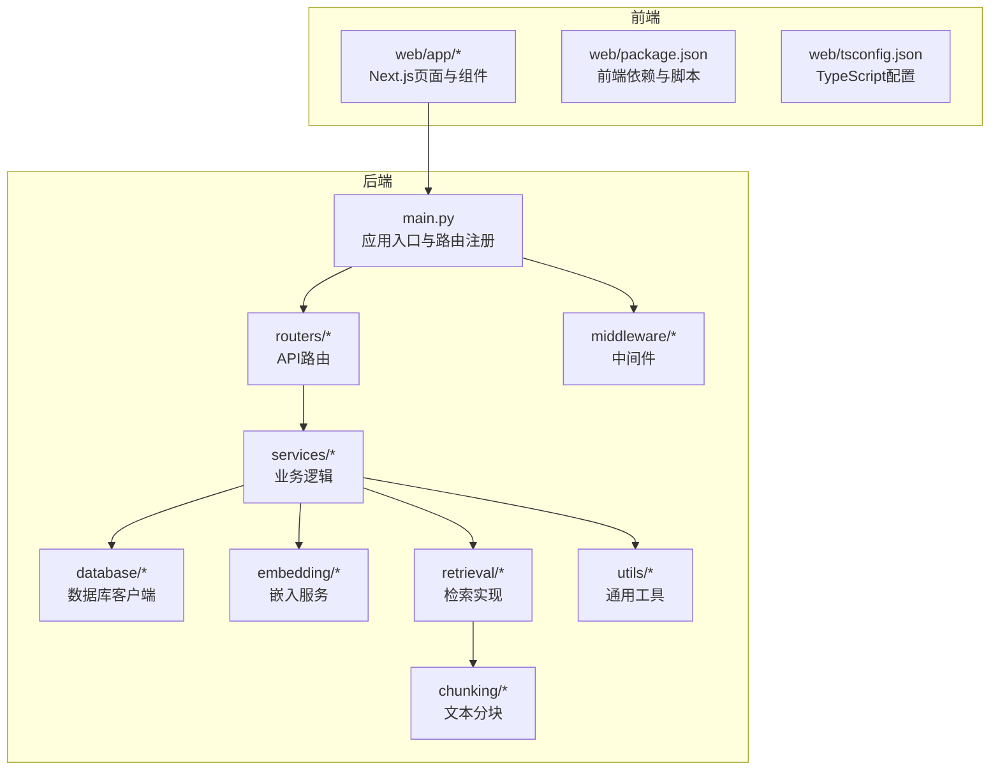
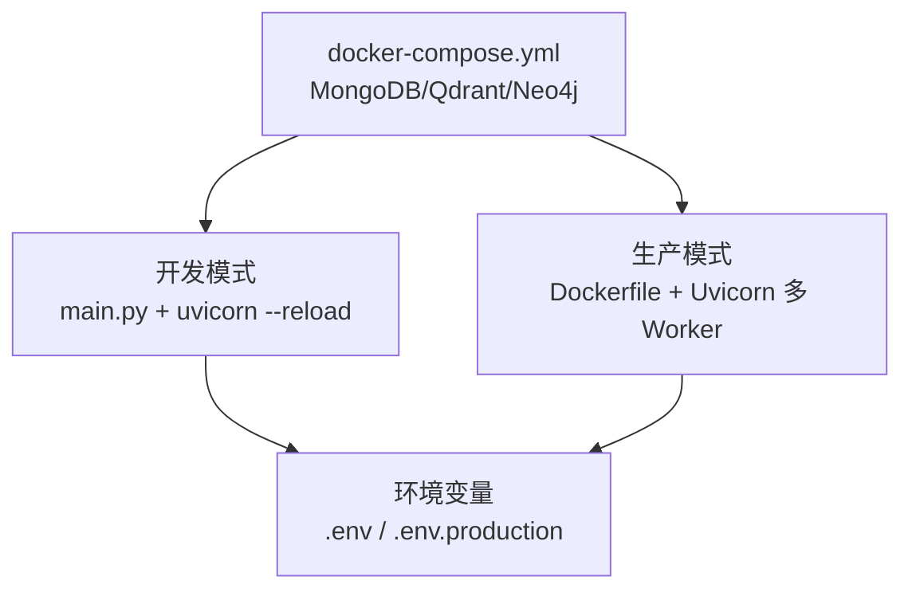
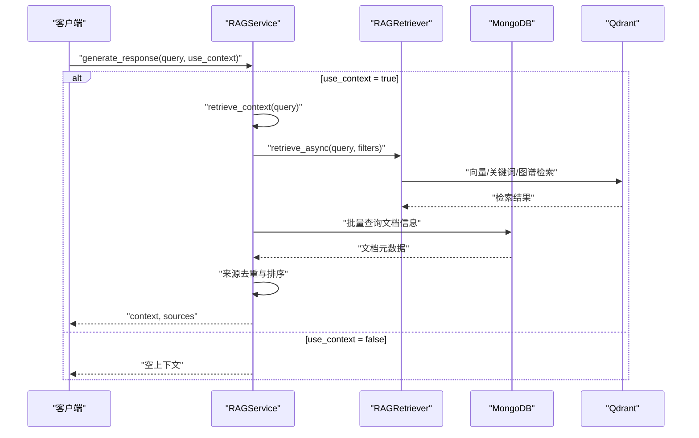
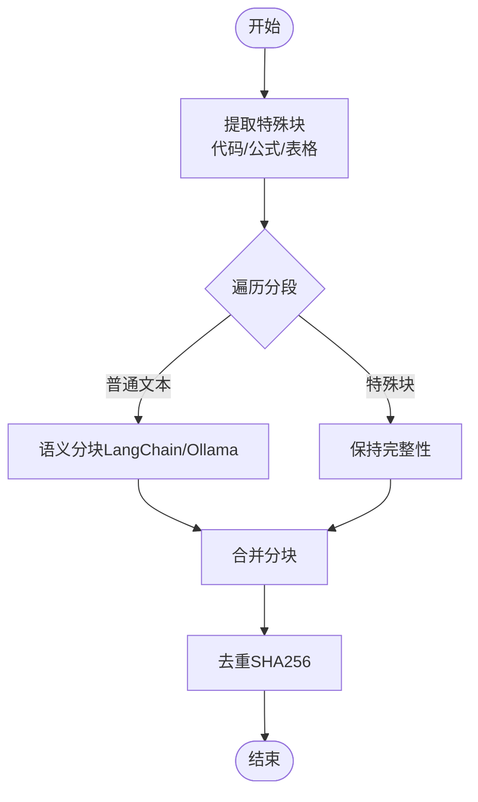
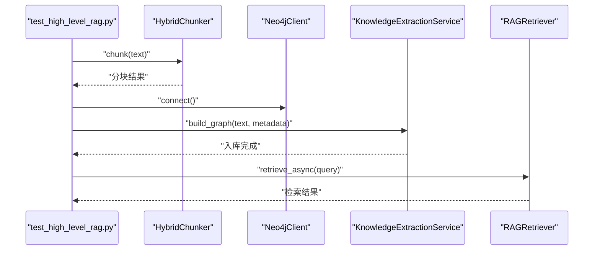
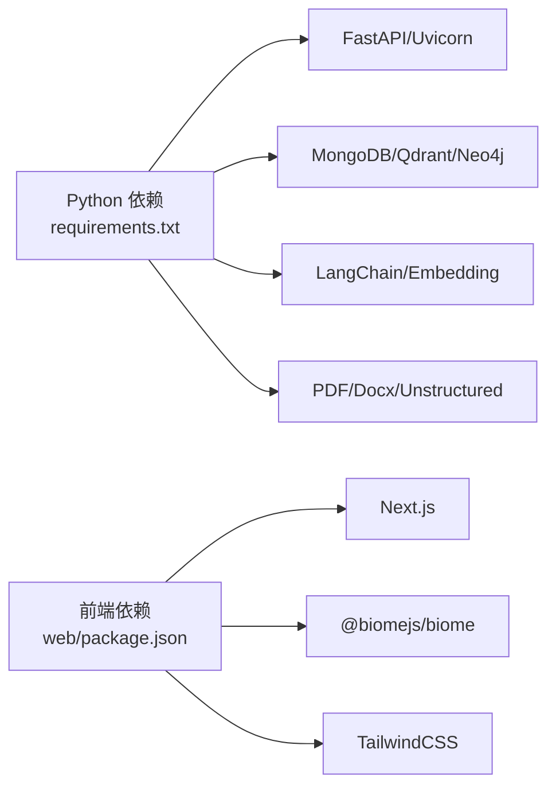

# 开发流程

<cite>
**本文引用的文件**   
- [README.md](file://README.md)
- [main.py](file://main.py)
- [requirements.txt](file://requirements.txt)
- [Dockerfile](file://Dockerfile)
- [docker-compose.yml](file://docker-compose.yml)
- [tests/test_high_level_rag.py](file://tests/test_high_level_rag.py)
- [web/package.json](file://web/package.json)
- [web/tsconfig.json](file://web/tsconfig.json)
- [commit-msg.txt](file://commit-msg.txt)
- [services/rag_service.py](file://services/rag_service.py)
- [chunking/hybrid_chunker.py](file://chunking/hybrid_chunker.py)
- [CHANGELOG.md](file://CHANGELOG.md)
</cite>

## 目录
1. [简介](#简介)
2. [项目结构](#项目结构)
3. [核心组件](#核心组件)
4. [架构总览](#架构总览)
5. [详细组件分析](#详细组件分析)
6. [依赖分析](#依赖分析)
7. [性能考虑](#性能考虑)
8. [故障排查指南](#故障排查指南)
9. [结论](#结论)
10. [附录](#附录)

## 简介
本文件面向 advanced-rag 项目的开发者，提供从需求分析到代码提交的完整开发流程说明：需求收集→技术方案设计→代码实现→单元测试→集成测试→代码审查→合并发布。文档还给出功能开发标准步骤、版本控制与分支管理规范、发布流程、开发环境与工具链配置、以及持续集成与自动化测试策略。

## 项目结构
项目采用前后端分离架构：后端基于 FastAPI，前端基于 Next.js。核心模块包括路由层、服务层、模型层、数据库层、工具层与中间件。Docker 与 docker-compose 提供一键部署与本地开发环境编排。

图表来源
- [main.py:1-157](file://main.py#L1-L157)
- [web/package.json:1-40](file://web/package.json#L1-L40)
- [web/tsconfig.json:1-35](file://web/tsconfig.json#L1-L35)

章节来源
- [README.md:55-70](file://README.md#L55-L70)
- [main.py:90-98](file://main.py#L90-L98)

## 核心组件
- 应用入口与路由注册：后端通过 main.py 注册各模块路由，挂载静态资源，配置中间件与异常处理。
- 服务层：RAG 服务封装检索与生成流程，支持并行检索、来源去重与回退策略。
- 检索与分块：RAG 检索器与混合分块器负责检索与文本切分，兼顾规则与语义分块。
- 数据与存储：MongoDB、Qdrant、Neo4j、Redis 等数据库与缓存配合，支撑知识库与对话历史。
- 前端：Next.js 页面与组件，Biome 校验与格式化，TypeScript 类型约束。

章节来源
- [main.py:55-98](file://main.py#L55-L98)
- [services/rag_service.py:7-248](file://services/rag_service.py#L7-L248)
- [chunking/hybrid_chunker.py:9-179](file://chunking/hybrid_chunker.py#L9-L179)
- [README.md:26-54](file://README.md#L26-L54)

## 架构总览
下图展示后端服务在不同环境下的启动与部署差异，以及容器化与本地开发的关系。

图表来源
- [main.py:128-157](file://main.py#L128-L157)
- [Dockerfile:14-95](file://Dockerfile#L14-L95)
- [docker-compose.yml:1-76](file://docker-compose.yml#L1-L76)

## 详细组件分析

### RAG 服务工作流（检索与生成）
RAG 服务负责检索上下文与生成回复，支持多集合并行检索、来源去重与回退策略。

图表来源
- [services/rag_service.py:10-242](file://services/rag_service.py#L10-L242)

章节来源
- [services/rag_service.py:10-242](file://services/rag_service.py#L10-L242)

### 混合分块算法（规则+语义）
混合分块器对代码块、公式、表格进行完整性保留，对普通文本使用语义分块，并进行去重与元数据标注。

图表来源
- [chunking/hybrid_chunker.py:52-122](file://chunking/hybrid_chunker.py#L52-L122)
- [chunking/hybrid_chunker.py:123-174](file://chunking/hybrid_chunker.py#L123-L174)

章节来源
- [chunking/hybrid_chunker.py:9-179](file://chunking/hybrid_chunker.py#L9-L179)

### 测试与集成验证
测试脚本演示了混合分块、知识抽取与检索的端到端流程，便于本地集成验证。

图表来源
- [tests/test_high_level_rag.py:27-119](file://tests/test_high_level_rag.py#L27-L119)

章节来源
- [tests/test_high_level_rag.py:1-124](file://tests/test_high_level_rag.py#L1-L124)

## 依赖分析
- 后端依赖：FastAPI、Uvicorn、MongoDB/Motor、Qdrant、Neo4j、LangChain、PaddleOCR、PyPDF2/Docx/Unstructured 等。
- 前端依赖：Next.js、React、Biome、TailwindCSS、MathJax、KaTeX 等。
- 容器化：Dockerfile 使用国内镜像源与缓存策略，docker-compose 提供数据库与图数据库服务编排。

图表来源
- [requirements.txt:1-38](file://requirements.txt#L1-L38)
- [web/package.json:12-39](file://web/package.json#L12-L39)

章节来源
- [requirements.txt:1-38](file://requirements.txt#L1-L38)
- [web/package.json:1-40](file://web/package.json#L1-L40)

## 性能考虑
- 生产环境使用多 Worker（默认 24）与 keep-alive 超时延长，适合高并发与大文件上传场景。
- 检索阶段采用并行任务聚合，减少总体延迟。
- 分块阶段通过去重与规则保留，降低冗余与重复检索成本。
- 前端使用 Biome 校验与增量编译，提升开发效率。

章节来源
- [main.py:141-157](file://main.py#L141-L157)
- [services/rag_service.py:72-83](file://services/rag_service.py#L72-L83)
- [web/package.json:9-10](file://web/package.json#L9-L10)

## 故障排查指南
- 环境变量与配置文件加载顺序：优先加载环境特定文件，其次默认 .env，最后项目根目录 .env。
- Docker 构建前需先下载第三方依赖（vendor/PaddleOCR），否则构建失败。
- docker-compose 提供 MongoDB、Qdrant、Neo4j 的健康检查与持久化卷，确保服务可用。
- 前端开发模式使用 Next.js dev，Biome 提供 lint 与 format 脚本，TypeScript 严格模式保障类型安全。
- 提交信息模板可用于统一提交说明风格。

章节来源
- [main.py:31-52](file://main.py#L31-L52)
- [Dockerfile:59-67](file://Dockerfile#L59-L67)
- [docker-compose.yml:18-24](file://docker-compose.yml#L18-L24)
- [web/package.json:5-11](file://web/package.json#L5-L11)
- [web/tsconfig.json:2-24](file://web/tsconfig.json#L2-L24)
- [commit-msg.txt:1-8](file://commit-msg.txt#L1-L8)

## 结论
本开发流程文档提供了从需求到发布的标准化步骤与最佳实践，结合现有代码库的模块划分、容器化与测试策略，帮助团队高效协作、保证质量并加速交付。

## 附录

### 开发流程与标准步骤
- 需求收集：明确功能目标、接口范围与验收条件。
- 技术方案设计：确定模块边界、数据模型与依赖关系。
- 代码实现：遵循“模型→服务→路由→入口注册”的顺序，保持低耦合高内聚。
- 单元测试：针对核心类与算法（如混合分块、RAG 服务）编写可运行的测试脚本。
- 集成测试：使用现有测试脚本验证端到端流程。
- 代码审查：关注可读性、健壮性与性能，遵循提交信息模板。
- 合并发布：基于变更日志与版本号策略进行发布。

章节来源
- [README.md:229-253](file://README.md#L229-L253)
- [CHANGELOG.md:10-18](file://CHANGELOG.md#L10-L18)

### 版本控制与分支管理
- 分支命名：功能开发使用 feat/ 前缀，修复使用 fix/，文档使用 docs/。
- 提交流程：Fork → 创建分支 → 提交 → 推送 → 发起 PR。
- 提交信息：参考 commit-msg.txt 的风格与要点。

章节来源
- [README.md:267-274](file://README.md#L267-L274)
- [commit-msg.txt:1-8](file://commit-msg.txt#L1-L8)

### 发布流程
- 版本号：遵循语义化版本，变更记录在 CHANGELOG.md。
- 构建与部署：Dockerfile 提供生产镜像构建，docker-compose 提供本地编排。
- 健康检查：容器内置健康检查，确保服务可用。

章节来源
- [CHANGELOG.md:20-39](file://CHANGELOG.md#L20-L39)
- [Dockerfile:91-92](file://Dockerfile#L91-L92)
- [docker-compose.yml:18-24](file://docker-compose.yml#L18-L24)

### 开发环境配置与工具链
- 后端：Python 3.9+，安装 requirements.txt；准备 PaddleOCR 依赖；配置 .env 或 .env.production。
- 前端：Next.js 开发服务器、Biome 校验与格式化、TypeScript 严格模式。
- 容器化：Docker 构建前下载 vendor 依赖；docker-compose 启动数据库服务。

章节来源
- [README.md:81-124](file://README.md#L81-L124)
- [web/package.json:5-11](file://web/package.json#L5-L11)
- [web/tsconfig.json:2-24](file://web/tsconfig.json#L2-L24)
- [Dockerfile:59-67](file://Dockerfile#L59-L67)

### 持续集成与自动化测试策略
- CI/CD：计划中引入 GitHub Actions 流水线（变更日志中列出）。
- 单测覆盖率：持续提升单元测试覆盖率。
- 前端校验：Biome lint/format 作为前置检查。

章节来源
- [CHANGELOG.md:14-15](file://CHANGELOG.md#L14-L15)
- [web/package.json:9-10](file://web/package.json#L9-L10)