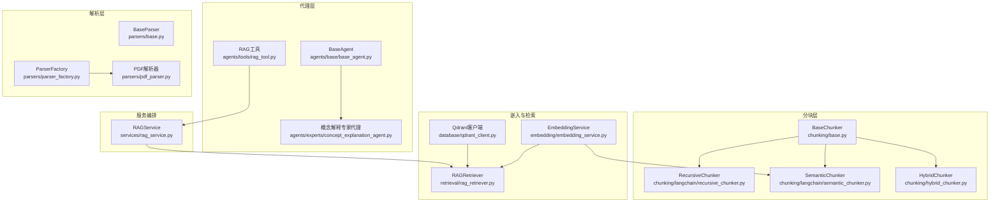
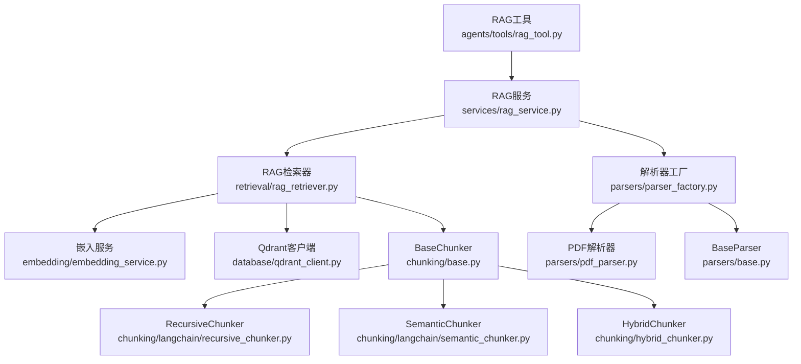
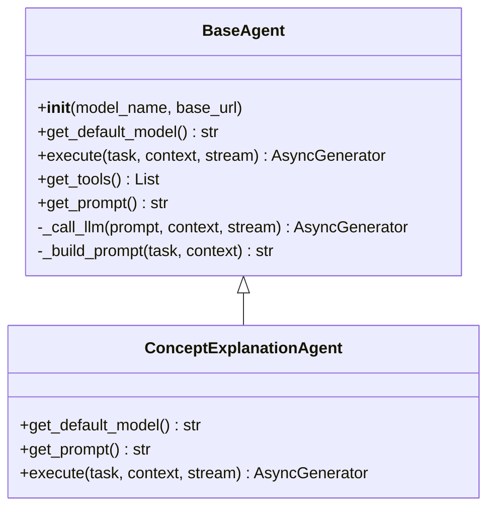
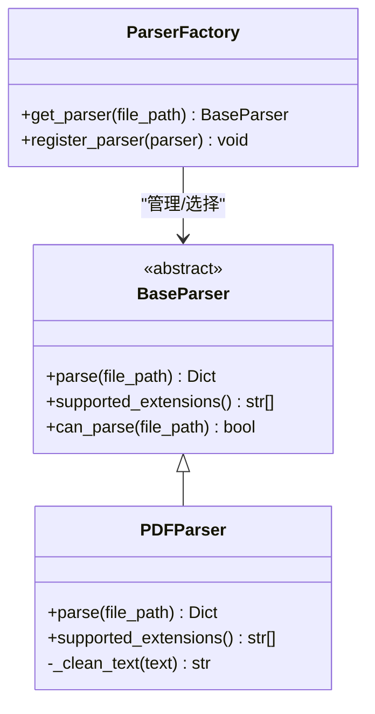
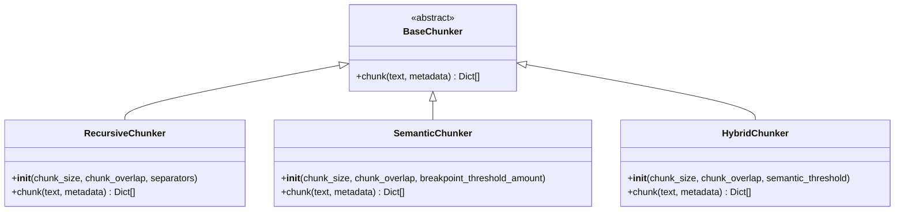
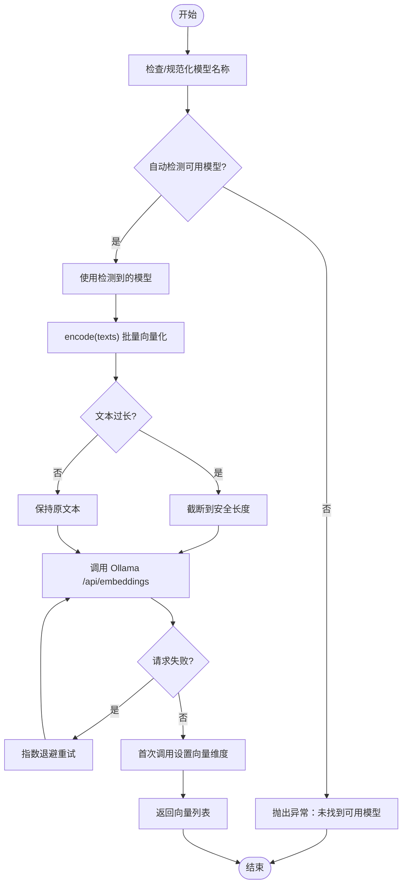
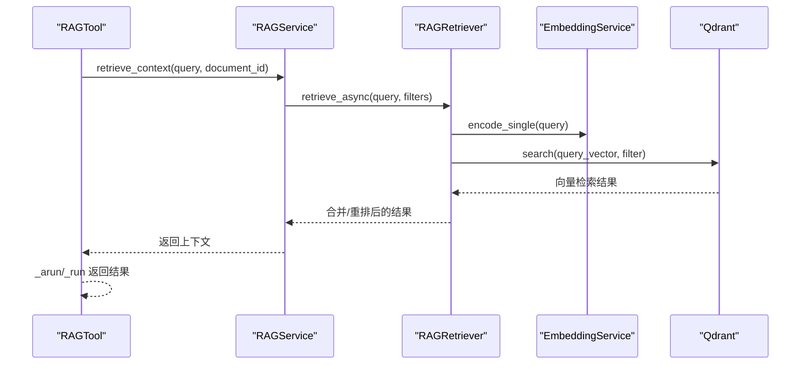
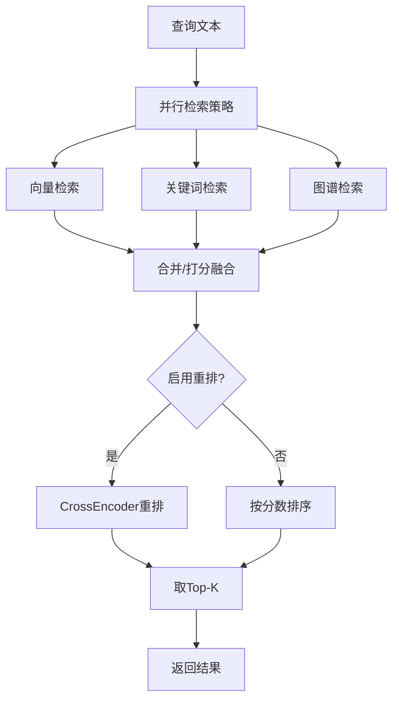
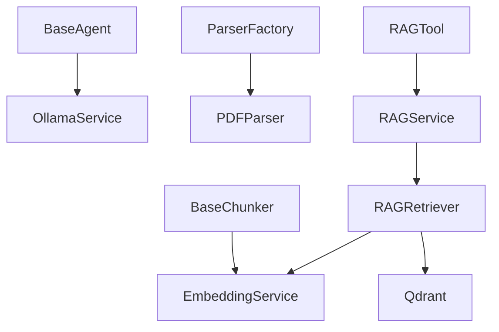

# 扩展开发

<cite>
**本文引用的文件**
- [agents/base/base_agent.py](file://agents/base/base_agent.py)
- [agents/experts/concept_explanation_agent.py](file://agents/experts/concept_explanation_agent.py)
- [agents/tools/rag_tool.py](file://agents/tools/rag_tool.py)
- [parsers/base.py](file://parsers/base.py)
- [parsers/parser_factory.py](file://parsers/parser_factory.py)
- [parsers/pdf_parser.py](file://parsers/pdf_parser.py)
- [chunking/base.py](file://chunking/base.py)
- [chunking/langchain/recursive_chunker.py](file://chunking/langchain/recursive_chunker.py)
- [chunking/langchain/semantic_chunker.py](file://chunking/langchain/semantic_chunker.py)
- [chunking/hybrid_chunker.py](file://chunking/hybrid_chunker.py)
- [embedding/embedding_service.py](file://embedding/embedding_service.py)
- [retrieval/rag_retriever.py](file://retrieval/rag_retriever.py)
- [services/rag_service.py](file://services/rag_service.py)
- [database/qdrant_client.py](file://database/qdrant_client.py)
- [README.md](file://README.md)
</cite>

## 目录
1. [简介](#简介)
2. [项目结构](#项目结构)
3. [核心组件](#核心组件)
4. [架构总览](#架构总览)
5. [详细组件分析](#详细组件分析)
6. [依赖分析](#依赖分析)
7. [性能考虑](#性能考虑)
8. [故障排查指南](#故障排查指南)
9. [结论](#结论)
10. [附录](#附录)

## 简介
本文件面向希望对 advanced-rag 进行扩展开发的工程师，围绕以下扩展主题提供系统化的指导：
- 代理系统的扩展：自定义代理类、继承 BaseAgent、实现抽象方法、配置模型参数
- 文档解析器的扩展：实现 Parser 接口、注册新解析器、处理特殊格式
- 分块算法的扩展：继承 BaseChunker、实现分块逻辑、配置参数
- 嵌入服务的扩展：自定义嵌入模型、实现向量化逻辑
- 工具开发指南：创建自定义工具、集成第三方服务、工具注册机制
- RAG 服务的扩展点：自定义检索策略、添加新的检索算法、优化检索性能

## 项目结构
advanced-rag 采用模块化设计，核心扩展点集中在 agents、parsers、chunking、embedding、retrieval、services、database 等目录。下图展示与扩展开发相关的关键模块与职责：

图表来源
- [agents/base/base_agent.py:8-122](file://agents/base/base_agent.py#L8-L122)
- [agents/experts/concept_explanation_agent.py:7-70](file://agents/experts/concept_explanation_agent.py#L7-L70)
- [agents/tools/rag_tool.py:12-58](file://agents/tools/rag_tool.py#L12-L58)
- [parsers/base.py:6-32](file://parsers/base.py#L6-L32)
- [parsers/parser_factory.py:10-41](file://parsers/parser_factory.py#L10-L41)
- [parsers/pdf_parser.py:12-208](file://parsers/pdf_parser.py#L12-L208)
- [chunking/base.py:6-23](file://chunking/base.py#L6-L23)
- [chunking/langchain/recursive_chunker.py:7-110](file://chunking/langchain/recursive_chunker.py#L7-L110)
- [chunking/langchain/semantic_chunker.py:8-139](file://chunking/langchain/semantic_chunker.py#L8-L139)
- [chunking/hybrid_chunker.py:9-179](file://chunking/hybrid_chunker.py#L9-L179)
- [embedding/embedding_service.py:8-278](file://embedding/embedding_service.py#L8-L278)
- [retrieval/rag_retriever.py:22-325](file://retrieval/rag_retriever.py#L22-L325)
- [database/qdrant_client.py:18-544](file://database/qdrant_client.py#L18-L544)
- [services/rag_service.py:7-248](file://services/rag_service.py#L7-L248)

章节来源
- [README.md:46-70](file://README.md#L46-L70)

## 核心组件
- 代理系统基类 BaseAgent：定义统一的代理接口、默认模型获取、提示词构建、LLM 调用封装与工具扩展点
- 解析器基类 BaseParser 与工厂 ParserFactory：定义解析器接口、扩展注册机制
- 分块器基类 BaseChunker 与多种实现：递归分块、语义分块、混合分块
- 嵌入服务 EmbeddingService：基于 Ollama 的向量化封装与模型发现
- RAG 检索器 RAGRetriever：多策略检索（向量、关键词、图谱）与结果融合
- RAG 服务 RAGService：对外提供检索上下文与响应生成的编排
- Qdrant 客户端：向量数据库的连接、集合管理、插入与查询

章节来源
- [agents/base/base_agent.py:8-122](file://agents/base/base_agent.py#L8-L122)
- [parsers/base.py:6-32](file://parsers/base.py#L6-L32)
- [parsers/parser_factory.py:10-41](file://parsers/parser_factory.py#L10-L41)
- [chunking/base.py:6-23](file://chunking/base.py#L6-L23)
- [chunking/langchain/recursive_chunker.py:7-110](file://chunking/langchain/recursive_chunker.py#L7-L110)
- [chunking/langchain/semantic_chunker.py:8-139](file://chunking/langchain/semantic_chunker.py#L8-L139)
- [chunking/hybrid_chunker.py:9-179](file://chunking/hybrid_chunker.py#L9-L179)
- [embedding/embedding_service.py:8-278](file://embedding/embedding_service.py#L8-L278)
- [retrieval/rag_retriever.py:22-325](file://retrieval/rag_retriever.py#L22-L325)
- [services/rag_service.py:7-248](file://services/rag_service.py#L7-L248)
- [database/qdrant_client.py:18-544](file://database/qdrant_client.py#L18-L544)

## 架构总览
下图展示从“工具/代理”到“解析/分块/嵌入/检索”的完整扩展链路：

图表来源
- [agents/tools/rag_tool.py:12-58](file://agents/tools/rag_tool.py#L12-L58)
- [services/rag_service.py:7-248](file://services/rag_service.py#L7-L248)
- [retrieval/rag_retriever.py:22-325](file://retrieval/rag_retriever.py#L22-L325)
- [embedding/embedding_service.py:8-278](file://embedding/embedding_service.py#L8-L278)
- [database/qdrant_client.py:18-544](file://database/qdrant_client.py#L18-L544)
- [parsers/parser_factory.py:10-41](file://parsers/parser_factory.py#L10-L41)
- [parsers/pdf_parser.py:12-208](file://parsers/pdf_parser.py#L12-L208)
- [parsers/base.py:6-32](file://parsers/base.py#L6-L32)
- [chunking/base.py:6-23](file://chunking/base.py#L6-L23)
- [chunking/langchain/recursive_chunker.py:7-110](file://chunking/langchain/recursive_chunker.py#L7-L110)
- [chunking/langchain/semantic_chunker.py:8-139](file://chunking/langchain/semantic_chunker.py#L8-L139)
- [chunking/hybrid_chunker.py:9-179](file://chunking/hybrid_chunker.py#L9-L179)

## 详细组件分析

### 代理系统扩展：自定义代理类
- 继承 BaseAgent，实现抽象方法
  - get_default_model：返回默认模型名称
  - get_prompt：返回系统提示词
  - execute：实现任务执行流程，可调用 _call_llm 进行流式生成
- 配置模型参数
  - 通过构造函数传入 model_name、base_url，或在子类中覆盖默认值
  - 可通过 OllamaService 的模型发现与规范化逻辑选择合适模型
- 工具扩展
  - 可在子类中重写 get_tools 返回 LangChain 工具列表，实现工具集成

图表来源
- [agents/base/base_agent.py:8-122](file://agents/base/base_agent.py#L8-L122)
- [agents/experts/concept_explanation_agent.py:7-70](file://agents/experts/concept_explanation_agent.py#L7-L70)

章节来源
- [agents/base/base_agent.py:8-122](file://agents/base/base_agent.py#L8-L122)
- [agents/experts/concept_explanation_agent.py:7-70](file://agents/experts/concept_explanation_agent.py#L7-L70)

### 文档解析器扩展：实现 Parser 接口与注册新解析器
- 实现 BaseParser 接口
  - parse(file_path)：返回包含文本与元数据的字典
  - supported_extensions()：返回支持的文件扩展名列表
  - 可复用 can_parse(file_path) 进行扩展名判断
- 注册新解析器
  - 通过 ParserFactory.register_parser(parser) 将新解析器加入解析器列表
  - ParserFactory.get_parser(file_path) 会按扩展名匹配返回解析器实例
- 处理特殊格式
  - 参考 PDFParser 的做法：清理文本、保护公式、OCR 文字拼接、表格与公式分析等

图表来源
- [parsers/base.py:6-32](file://parsers/base.py#L6-L32)
- [parsers/pdf_parser.py:12-208](file://parsers/pdf_parser.py#L12-L208)
- [parsers/parser_factory.py:10-41](file://parsers/parser_factory.py#L10-L41)

章节来源
- [parsers/base.py:6-32](file://parsers/base.py#L6-L32)
- [parsers/parser_factory.py:10-41](file://parsers/parser_factory.py#L10-L41)
- [parsers/pdf_parser.py:12-208](file://parsers/pdf_parser.py#L12-L208)

### 分块算法扩展：继承 BaseChunker、实现分块逻辑
- 继承 BaseChunker，实现 chunk(text, metadata)
- 常见实现模式
  - 递归分块：按分隔符序列进行递归切分（参考 RecursiveChunker）
  - 语义分块：基于嵌入函数的语义断点（参考 SemanticChunker）
  - 混合分块：保留代码/公式/表格完整性，其余文本语义分块（参考 HybridChunker）
- 参数配置
  - chunk_size、chunk_overlap、breakpoint_threshold_amount 等
  - 支持元数据透传与内容类型标注（content_type）

图表来源
- [chunking/base.py:6-23](file://chunking/base.py#L6-L23)
- [chunking/langchain/recursive_chunker.py:7-110](file://chunking/langchain/recursive_chunker.py#L7-L110)
- [chunking/langchain/semantic_chunker.py:8-139](file://chunking/langchain/semantic_chunker.py#L8-L139)
- [chunking/hybrid_chunker.py:9-179](file://chunking/hybrid_chunker.py#L9-L179)

章节来源
- [chunking/base.py:6-23](file://chunking/base.py#L6-L23)
- [chunking/langchain/recursive_chunker.py:7-110](file://chunking/langchain/recursive_chunker.py#L7-L110)
- [chunking/langchain/semantic_chunker.py:8-139](file://chunking/langchain/semantic_chunker.py#L8-L139)
- [chunking/hybrid_chunker.py:9-179](file://chunking/hybrid_chunker.py#L9-L179)

### 嵌入服务扩展：自定义嵌入模型与向量化逻辑
- 自定义嵌入模型
  - 通过环境变量 OLLAMA_EMBEDDING_MODEL 指定模型名称
  - EmbeddingService 构造时会尝试规范化模型名称与自动检测可用 embedding 模型
- 向量化逻辑
  - encode(texts, batch_size, model_name)：批量向量化，内部对长文本进行截断
  - encode_single(text, model_name)：单条向量化
  - dimension 属性：惰性获取向量维度
- 错误处理与重试
  - 超时与连接错误具备指数退避重试
  - 模型不存在时给出明确提示

图表来源
- [embedding/embedding_service.py:11-278](file://embedding/embedding_service.py#L11-L278)

章节来源
- [embedding/embedding_service.py:11-278](file://embedding/embedding_service.py#L11-L278)

### 工具开发指南：创建自定义工具、集成第三方服务、工具注册机制
- 自定义工具
  - 基于 LangChain BaseTool，定义输入 Schema（如 RAGQueryInput）
  - 实现 _run（同步）与 _arun（异步）方法
  - 在异步环境中优先使用 _arun，避免事件循环冲突
- 集成第三方服务
  - 可通过 RAGService 调用检索上下文，再由工具返回给代理或外部系统
- 工具注册机制
  - 将工具实例注册到代理的工具列表中（参见 BaseAgent.get_tools）

图表来源
- [agents/tools/rag_tool.py:12-58](file://agents/tools/rag_tool.py#L12-L58)
- [services/rag_service.py:10-242](file://services/rag_service.py#L10-L242)
- [retrieval/rag_retriever.py:69-101](file://retrieval/rag_retriever.py#L69-L101)
- [embedding/embedding_service.py:230-259](file://embedding/embedding_service.py#L230-L259)
- [database/qdrant_client.py:336-413](file://database/qdrant_client.py#L336-L413)

章节来源
- [agents/tools/rag_tool.py:12-58](file://agents/tools/rag_tool.py#L12-L58)
- [services/rag_service.py:10-242](file://services/rag_service.py#L10-L242)
- [retrieval/rag_retriever.py:69-101](file://retrieval/rag_retriever.py#L69-L101)
- [embedding/embedding_service.py:230-259](file://embedding/embedding_service.py#L230-L259)
- [database/qdrant_client.py:336-413](file://database/qdrant_client.py#L336-L413)

### RAG 服务扩展点：自定义检索策略、添加新的检索算法、优化检索性能
- 自定义检索策略
  - 在 RAGRetriever 中扩展新的检索方法（如关键词检索、图谱检索），并在 retrieve_async 中并行调度
  - 通过 _merge_results 合并不同策略结果，支持 Boost/融合/重排
- 添加新的检索算法
  - 可新增检索器（如 BM25、Sparse/Dense Hybrid），在 RAGRetriever 中组合调用
  - 通过 reranker（CrossEncoder）进行重排，提升排序质量
- 优化检索性能
  - 使用 Qdrant 的 gRPC 连接与连接复用，减少 HTTP 依赖
  - 合理设置 top_k、score_threshold，避免返回过多冗余结果
  - 对长文本进行截断，避免 Ollama 超时与错误

图表来源
- [retrieval/rag_retriever.py:69-101](file://retrieval/rag_retriever.py#L69-L101)
- [retrieval/rag_retriever.py:262-297](file://retrieval/rag_retriever.py#L262-L297)
- [retrieval/rag_retriever.py:299-323](file://retrieval/rag_retriever.py#L299-L323)
- [database/qdrant_client.py:336-413](file://database/qdrant_client.py#L336-L413)

章节来源
- [retrieval/rag_retriever.py:22-325](file://retrieval/rag_retriever.py#L22-L325)
- [database/qdrant_client.py:336-413](file://database/qdrant_client.py#L336-L413)

## 依赖分析
- 组件耦合与内聚
  - BaseAgent 与 OllamaService 松耦合，便于切换模型或替换为其他 LLM
  - ParserFactory 与具体解析器解耦，便于动态注册新解析器
  - Chunker 与 EmbeddingService 解耦，语义分块可替换嵌入函数
  - RAGRetriever 与数据库客户端解耦，便于替换向量库或图数据库
- 外部依赖与集成点
  - Ollama：模型推理与嵌入向量化
  - Qdrant：向量检索与存储
  - LangChain：文本分块与语义分块
  - Neo4j：可选图谱检索（当前代码中图谱检索为占位，需按需启用）

图表来源
- [agents/base/base_agent.py:5-25](file://agents/base/base_agent.py#L5-L25)
- [parsers/parser_factory.py:13-18](file://parsers/parser_factory.py#L13-L18)
- [parsers/pdf_parser.py:12-208](file://parsers/pdf_parser.py#L12-L208)
- [chunking/base.py:6-23](file://chunking/base.py#L6-L23)
- [embedding/embedding_service.py:8-44](file://embedding/embedding_service.py#L8-L44)
- [retrieval/rag_retriever.py:22-40](file://retrieval/rag_retriever.py#L22-L40)
- [database/qdrant_client.py:18-96](file://database/qdrant_client.py#L18-L96)
- [services/rag_service.py:68-75](file://services/rag_service.py#L68-L75)
- [agents/tools/rag_tool.py:12-58](file://agents/tools/rag_tool.py#L12-L58)

章节来源
- [agents/base/base_agent.py:5-25](file://agents/base/base_agent.py#L5-L25)
- [parsers/parser_factory.py:13-18](file://parsers/parser_factory.py#L13-L18)
- [parsers/pdf_parser.py:12-208](file://parsers/pdf_parser.py#L12-L208)
- [chunking/base.py:6-23](file://chunking/base.py#L6-L23)
- [embedding/embedding_service.py:8-44](file://embedding/embedding_service.py#L8-L44)
- [retrieval/rag_retriever.py:22-40](file://retrieval/rag_retriever.py#L22-L40)
- [database/qdrant_client.py:18-96](file://database/qdrant_client.py#L18-L96)
- [services/rag_service.py:68-75](file://services/rag_service.py#L68-L75)
- [agents/tools/rag_tool.py:12-58](file://agents/tools/rag_tool.py#L12-L58)

## 性能考虑
- 向量检索
  - 使用 Qdrant 的 gRPC 连接与连接复用，降低 HTTP 依赖带来的开销
  - 合理设置 top_k 与 score_threshold，避免返回过多低质量结果
- 嵌入向量化
  - 对超长文本进行截断，避免 Ollama 报错
  - 批量处理时注意内存占用，必要时分批调用
- 文本分块
  - 混合分块在保持结构完整性的同时减少重复，提高检索精度
  - 语义分块对长文档更友好，但需评估嵌入函数性能
- 检索融合
  - 并行检索多策略结果，再进行去重与融合，平衡召回与精度

## 故障排查指南
- 模型相关
  - 未找到可用 embedding 模型：检查 OLLAMA_EMBEDDING_MODEL 环境变量或手动下载模型
  - 模型名称不匹配：EmbeddingService 会尝试规范化模型名称，若失败请确认模型存在
- 向量检索
  - Qdrant 连接失败：检查 QDRANT_URL 与 gRPC 端口配置，确认服务可达
  - 集合维度不匹配：当向量维度变化时自动重建集合，注意数据丢失风险
- 文档解析
  - PDF 无文本：扫描版 PDF 需要 OCR，确认 image_ocr 组件可用
  - 公式/表格解析失败：对应组件异常会被记录为警告，不影响整体流程
- 工具执行
  - 事件循环冲突：在异步环境中使用 _arun，避免在同步工具中阻塞

章节来源
- [embedding/embedding_service.py:39-44](file://embedding/embedding_service.py#L39-L44)
- [embedding/embedding_service.py:107-154](file://embedding/embedding_service.py#L107-L154)
- [database/qdrant_client.py:97-123](file://database/qdrant_client.py#L97-L123)
- [database/qdrant_client.py:170-208](file://database/qdrant_client.py#L170-L208)
- [database/qdrant_client.py:396-413](file://database/qdrant_client.py#L396-L413)
- [parsers/pdf_parser.py:126-139](file://parsers/pdf_parser.py#L126-L139)
- [parsers/pdf_parser.py:165-191](file://parsers/pdf_parser.py#L165-L191)
- [agents/tools/rag_tool.py:28-41](file://agents/tools/rag_tool.py#L28-L41)

## 结论
advanced-rag 提供了清晰的扩展点与模块化架构，开发者可在以下方面进行定制与增强：
- 代理系统：通过继承 BaseAgent 快速实现专业化 Agent，并灵活配置模型与工具
- 解析器：实现 BaseParser 接口并注册到 ParserFactory，支持新格式文档
- 分块器：基于 BaseChunker 扩展递归/语义/混合分块策略，提升检索质量
- 嵌入服务：通过 Ollama 模型与 EmbeddingService 实现自定义向量化
- 工具：基于 LangChain 工具体系集成第三方能力
- RAG：在 RAGRetriever 中扩展检索策略与重排算法，优化性能与效果

## 附录
- 环境变量与配置要点
  - OLLAMA_BASE_URL、OLLAMA_MODEL、OLLAMA_EMBEDDING_MODEL
  - QDRANT_URL、QDRANT_API_KEY
  - MONGODB_URI、MONGODB_DB_NAME
- 常用扩展路径
  - 新增代理：agents/experts/xxx_agent.py
  - 新增解析器：parsers/xxx_parser.py + 注册到 parser_factory.py
  - 新增分块器：chunking/xxx_chunker.py
  - 新增工具：agents/tools/xxx_tool.py

章节来源
- [README.md:125-166](file://README.md#L125-L166)