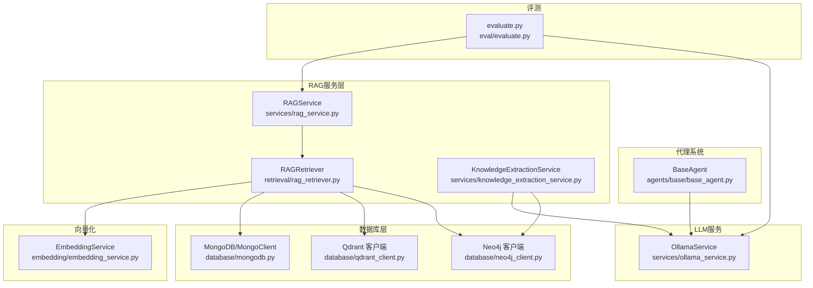
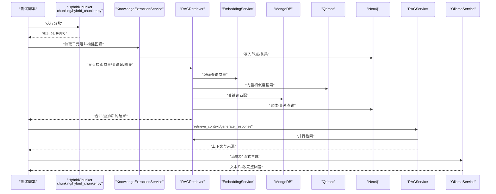
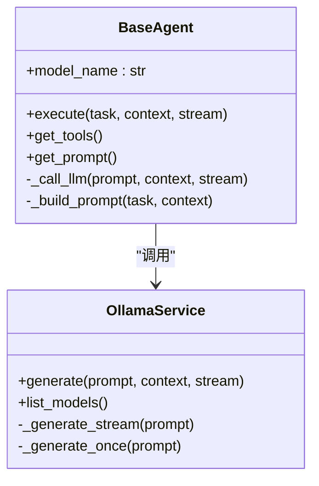
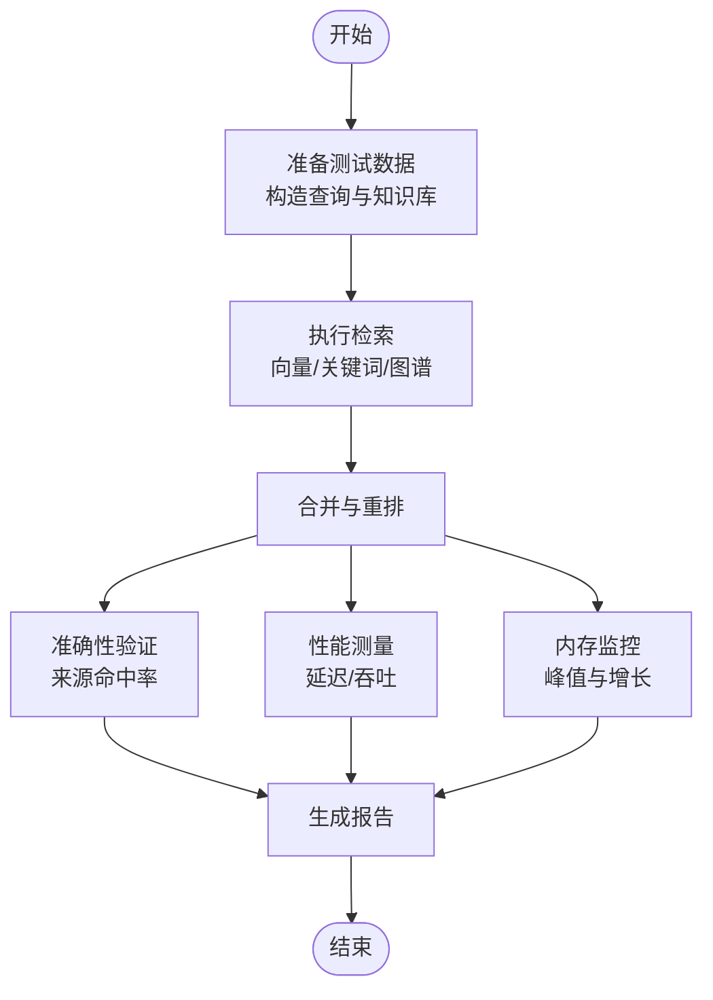
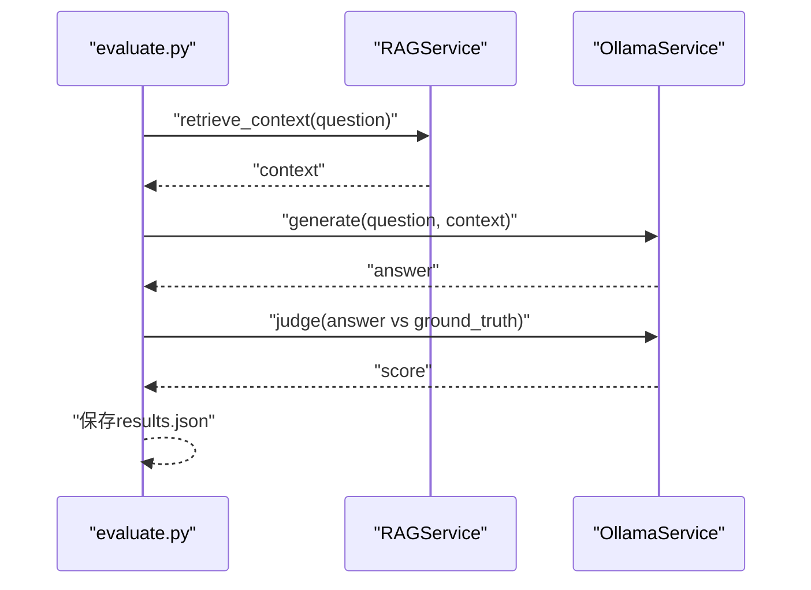
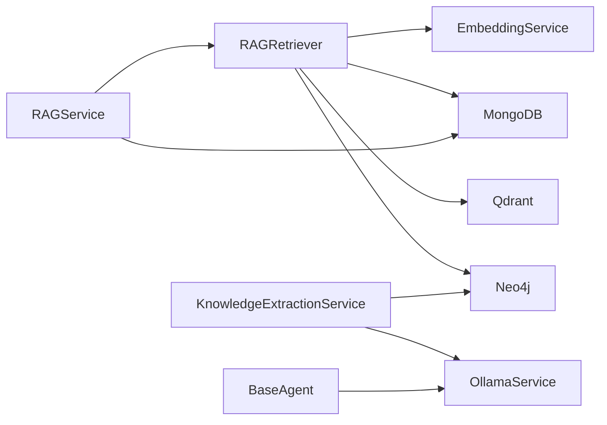

# 测试指南

<cite>
**本文引用的文件**   
- [README.md](file://README.md)
- [tests/test_high_level_rag.py](file://tests/test_high_level_rag.py)
- [eval/evaluate.py](file://eval/evaluate.py)
- [agents/base/base_agent.py](file://agents/base/base_agent.py)
- [services/rag_service.py](file://services/rag_service.py)
- [retrieval/rag_retriever.py](file://retrieval/rag_retriever.py)
- [services/knowledge_extraction_service.py](file://services/knowledge_extraction_service.py)
- [chunking/hybrid_chunker.py](file://chunking/hybrid_chunker.py)
- [services/ollama_service.py](file://services/ollama_service.py)
- [database/mongodb.py](file://database/mongodb.py)
- [database/qdrant_client.py](file://database/qdrant_client.py)
- [database/neo4j_client.py](file://database/neo4j_client.py)
- [embedding/embedding_service.py](file://embedding/embedding_service.py)
</cite>

## 目录
1. [简介](#简介)
2. [项目结构](#项目结构)
3. [核心组件](#核心组件)
4. [架构总览](#架构总览)
5. [详细组件分析](#详细组件分析)
6. [依赖分析](#依赖分析)
7. [性能考虑](#性能考虑)
8. [故障排查指南](#故障排查指南)
9. [结论](#结论)
10. [附录](#附录)

## 简介
本测试指南面向 advanced-rag 项目，聚焦以下目标：
- 单元测试编写方法：测试用例设计原则、Mock 对象使用、异步测试处理
- 集成测试策略：端到端测试、API 测试、数据库测试
- 测试覆盖率与质量标准
- 测试环境配置、测试数据准备与测试工具使用
- 代理系统测试：模拟 LLM 响应、测试执行流程、错误处理验证
- RAG 服务测试：检索准确性测试、性能基准测试、内存使用测试
- 测试最佳实践：测试隔离、测试数据管理、持续测试集成
- 调试测试失败的方法与常见问题排查

## 项目结构
项目采用分层与功能域划分相结合的组织方式：
- 代理系统（agents/）：多 Agent 协作框架，包含基类与具体专家 Agent
- 检索系统（retrieval/）：RAG 检索实现，支持向量、关键词、图谱混合检索
- 服务层（services/）：业务逻辑封装，如 RAG 服务、知识抽取服务、Ollama 服务
- 数据库层（database/）：MongoDB、Qdrant、Neo4j 客户端封装
- 向量化（embedding/）：基于 Ollama 的嵌入服务
- 评测（eval/）：自动化评测脚本
- 测试（tests/）：高层级集成测试示例

**图表来源**
- [agents/base/base_agent.py:1-122](file://agents/base/base_agent.py#L1-L122)
- [services/rag_service.py:1-248](file://services/rag_service.py#L1-L248)
- [retrieval/rag_retriever.py:1-325](file://retrieval/rag_retriever.py#L1-L325)
- [services/knowledge_extraction_service.py:1-211](file://services/knowledge_extraction_service.py#L1-L211)
- [embedding/embedding_service.py:1-278](file://embedding/embedding_service.py#L1-L278)
- [database/mongodb.py:1-800](file://database/mongodb.py#L1-L800)
- [database/qdrant_client.py:1-544](file://database/qdrant_client.py#L1-L544)
- [database/neo4j_client.py:1-104](file://database/neo4j_client.py#L1-L104)
- [eval/evaluate.py:1-127](file://eval/evaluate.py#L1-L127)

**章节来源**
- [README.md:55-70](file://README.md#L55-L70)

## 核心组件
- BaseAgent：抽象代理基类，统一 LLM 调用与提示词构建，便于 Mock 与测试
- RAGService：封装检索与生成流程，支持回退策略与上下文构建
- RAGRetriever：混合检索器，支持向量、关键词、图谱检索与结果合并
- KnowledgeExtractionService：基于 LLM 的三元组抽取与 Neo4j 图谱构建
- OllamaService：LLM 服务封装，支持流式与非流式生成，具备超时与重试控制
- EmbeddingService：基于 Ollama 的文本向量化服务
- 数据库客户端：MongoDB、Qdrant、Neo4j 的客户端封装，便于测试隔离与数据清理

**章节来源**
- [agents/base/base_agent.py:1-122](file://agents/base/base_agent.py#L1-L122)
- [services/rag_service.py:1-248](file://services/rag_service.py#L1-L248)
- [retrieval/rag_retriever.py:1-325](file://retrieval/rag_retriever.py#L1-L325)
- [services/knowledge_extraction_service.py:1-211](file://services/knowledge_extraction_service.py#L1-L211)
- [services/ollama_service.py:1-674](file://services/ollama_service.py#L1-L674)
- [embedding/embedding_service.py:1-278](file://embedding/embedding_service.py#L1-L278)
- [database/mongodb.py:1-800](file://database/mongodb.py#L1-L800)
- [database/qdrant_client.py:1-544](file://database/qdrant_client.py#L1-L544)
- [database/neo4j_client.py:1-104](file://database/neo4j_client.py#L1-L104)

## 架构总览
RAG 系统的测试关注点在于：
- 数据输入（文档/查询）经由分块与向量化入库
- 检索阶段并行执行向量、关键词、图谱检索，再合并与重排
- 生成阶段基于检索上下文与提示词链构建最终回答
- 代理系统通过 OllamaService 与 LLM 交互，支持流式输出与工具调用

**图表来源**
- [chunking/hybrid_chunker.py:1-179](file://chunking/hybrid_chunker.py#L1-L179)
- [services/knowledge_extraction_service.py:1-211](file://services/knowledge_extraction_service.py#L1-L211)
- [retrieval/rag_retriever.py:1-325](file://retrieval/rag_retriever.py#L1-L325)
- [embedding/embedding_service.py:1-278](file://embedding/embedding_service.py#L1-L278)
- [database/mongodb.py:1-800](file://database/mongodb.py#L1-L800)
- [database/qdrant_client.py:1-544](file://database/qdrant_client.py#L1-L544)
- [database/neo4j_client.py:1-104](file://database/neo4j_client.py#L1-L104)
- [services/rag_service.py:1-248](file://services/rag_service.py#L1-L248)
- [services/ollama_service.py:1-674](file://services/ollama_service.py#L1-L674)

## 详细组件分析

### 单元测试编写方法
- 测试用例设计原则
  - 针对单一职责函数进行最小化测试，覆盖正常路径、边界条件与异常路径
  - 使用参数化测试覆盖不同输入组合（如不同 chunk_size、overlap、阈值）
  - 对异步函数使用事件循环或 asyncio.run 进行测试
- Mock 对象使用
  - 对外部依赖（如 Ollama、Qdrant、MongoDB、Neo4j）使用 unittest.mock 进行替换
  - Mock 返回稳定的数据结构，避免真实服务波动影响测试稳定性
  - 对流式生成场景，Mock 生成器以控制输出节奏与终止条件
- 异步测试处理
  - 使用 asyncio.run 或 pytest-asyncio 标记异步测试
  - 对并行任务（gather）进行独立断言，确保顺序与结果一致性
  - 对超时与重试逻辑进行时间敏感断言（如超时阈值）

**章节来源**
- [services/ollama_service.py:453-674](file://services/ollama_service.py#L453-L674)
- [retrieval/rag_retriever.py:69-101](file://retrieval/rag_retriever.py#L69-L101)
- [services/knowledge_extraction_service.py:32-142](file://services/knowledge_extraction_service.py#L32-L142)

### 集成测试策略
- 端到端测试
  - 以测试脚本形式串联分块、知识抽取、检索与生成流程
  - 使用日志输出与断言验证各阶段结果数量与关键字段
  - 示例参考：tests/test_high_level_rag.py
- API 测试
  - 基于 FastAPI 的测试客户端（TestClient）发起请求，验证响应结构与状态码
  - 针对健康检查、聊天、文档上传等核心路由进行覆盖
- 数据库测试
  - 使用独立测试数据库或容器化数据库，测试数据的写入、查询与清理
  - 对集合存在性、索引与过滤条件进行验证

**章节来源**
- [tests/test_high_level_rag.py:1-124](file://tests/test_high_level_rag.py#L1-L124)
- [README.md:189-199](file://README.md#L189-L199)

### 代理系统测试
- 模拟 LLM 响应
  - 使用 Mock 替换 OllamaService 的 generate/_generate_stream，返回预定义文本片段
  - 验证 BaseAgent 的提示词构建与工具调用处理
- 测试执行流程
  - 验证 execute 流程的异步生成、流式输出与错误捕获
- 错误处理验证
  - 模拟网络超时、连接失败与模型不可用，验证回退与异常传播

**图表来源**
- [agents/base/base_agent.py:1-122](file://agents/base/base_agent.py#L1-L122)
- [services/ollama_service.py:1-674](file://services/ollama_service.py#L1-L674)

**章节来源**
- [agents/base/base_agent.py:1-122](file://agents/base/base_agent.py#L1-L122)
- [services/ollama_service.py:1-674](file://services/ollama_service.py#L1-L674)

### RAG 服务测试
- 检索准确性测试
  - 构造包含明确答案的查询与知识库，验证检索结果包含预期来源
  - 对关键词检索与图谱检索进行独立验证，确保过滤条件生效
- 性能基准测试
  - 使用不同规模的文档集合与查询批次，测量检索与生成的延迟与吞吐
  - 对并行检索（asyncio.gather）进行压力测试，观察资源占用
- 内存使用测试
  - 监控测试过程中的内存峰值，识别潜在泄漏点（如未关闭的数据库连接）

**图表来源**
- [services/rag_service.py:10-191](file://services/rag_service.py#L10-L191)
- [retrieval/rag_retriever.py:69-101](file://retrieval/rag_retriever.py#L69-L101)

**章节来源**
- [services/rag_service.py:1-248](file://services/rag_service.py#L1-L248)
- [retrieval/rag_retriever.py:1-325](file://retrieval/rag_retriever.py#L1-L325)

### 评测系统测试
- 评估流程
  - 检索 → 生成回答 → LLM-as-a-Judge 评分
- 数据集与结果
  - 使用 eval/dataset.json 作为输入，输出 eval/results.json
  - 支持分数归一化与异常处理

**图表来源**
- [eval/evaluate.py:1-127](file://eval/evaluate.py#L1-L127)
- [services/rag_service.py:1-248](file://services/rag_service.py#L1-L248)
- [services/ollama_service.py:1-674](file://services/ollama_service.py#L1-L674)

**章节来源**
- [eval/evaluate.py:1-127](file://eval/evaluate.py#L1-L127)

## 依赖分析
- 组件耦合
  - RAGRetriever 依赖 EmbeddingService、MongoDB、Qdrant、Neo4j
  - KnowledgeExtractionService 依赖 OllamaService 与 Neo4j
  - RAGService 依赖 RAGRetriever 与 MongoDB
- 外部依赖
  - Ollama（本地模型推理）
  - Qdrant（向量检索）
  - MongoDB（文档与分块存储）
  - Neo4j（知识图谱）

**图表来源**
- [retrieval/rag_retriever.py:1-325](file://retrieval/rag_retriever.py#L1-L325)
- [services/knowledge_extraction_service.py:1-211](file://services/knowledge_extraction_service.py#L1-L211)
- [services/rag_service.py:1-248](file://services/rag_service.py#L1-L248)
- [services/ollama_service.py:1-674](file://services/ollama_service.py#L1-L674)
- [database/mongodb.py:1-800](file://database/mongodb.py#L1-L800)
- [database/qdrant_client.py:1-544](file://database/qdrant_client.py#L1-L544)
- [database/neo4j_client.py:1-104](file://database/neo4j_client.py#L1-L104)

**章节来源**
- [retrieval/rag_retriever.py:1-325](file://retrieval/rag_retriever.py#L1-L325)
- [services/knowledge_extraction_service.py:1-211](file://services/knowledge_extraction_service.py#L1-L211)
- [services/rag_service.py:1-248](file://services/rag_service.py#L1-L248)
- [services/ollama_service.py:1-674](file://services/ollama_service.py#L1-L674)
- [database/mongodb.py:1-800](file://database/mongodb.py#L1-L800)
- [database/qdrant_client.py:1-544](file://database/qdrant_client.py#L1-L544)
- [database/neo4j_client.py:1-104](file://database/neo4j_client.py#L1-L104)

## 性能考虑
- 异步并行
  - 使用 asyncio.gather 并行执行多种检索策略，降低整体延迟
- 超时与重试
  - LLM 与外部服务调用设置合理超时与指数退避重试
- 资源池
  - 数据库连接池参数（最大/最小连接、空闲超时）影响高并发表现
- 向量维度与集合
  - Qdrant 集合维度需与向量一致，避免插入失败与重建开销

**章节来源**
- [services/rag_service.py:65-78](file://services/rag_service.py#L65-L78)
- [services/ollama_service.py:32-34](file://services/ollama_service.py#L32-L34)
- [database/mongodb.py:122-136](file://database/mongodb.py#L122-L136)
- [database/qdrant_client.py:140-208](file://database/qdrant_client.py#L140-L208)

## 故障排查指南
- LLM 服务不可用
  - 检查 OLLAMA_BASE_URL 与模型名称配置，确认 Ollama 服务可达
  - 观察流式生成超时与空闲超时日志，调整超时参数
- 向量检索失败
  - 检查 Qdrant 连接与集合存在性，确认向量维度一致
- 知识图谱构建失败
  - 检查 Neo4j 连接与驱动状态，确认实体与关系创建成功
- 数据库连接失败
  - 校验 MongoDB URI/主机端口与认证信息，确认连接池参数合理

**章节来源**
- [services/ollama_service.py:12-34](file://services/ollama_service.py#L12-L34)
- [database/qdrant_client.py:97-123](file://database/qdrant_client.py#L97-L123)
- [database/neo4j_client.py:16-38](file://database/neo4j_client.py#L16-L38)
- [database/mongodb.py:154-184](file://database/mongodb.py#L154-L184)

## 结论
本测试指南围绕 advanced-rag 的核心模块，给出了从单元到集成、从代理到 RAG 服务的系统化测试方法。通过合理的 Mock 设计、异步测试策略与性能基准手段，能够有效保障系统的稳定性与质量。

## 附录
- 测试覆盖率与质量标准
  - 建议单元测试行覆盖率不低于 80%，关键路径（异常与回退）100%
  - 集成测试覆盖主要 API 与数据流，端到端测试至少包含一次完整流程
- 测试环境配置
  - 使用独立 .env 测试配置，分离测试数据库与向量库
  - 使用容器化数据库与 LLM 服务，保证测试一致性
- 测试数据准备
  - 构造标准化测试文档与查询，确保检索与评测可重复
- 持续测试集成
  - 在 CI 中执行单元与集成测试，结合性能回归检查