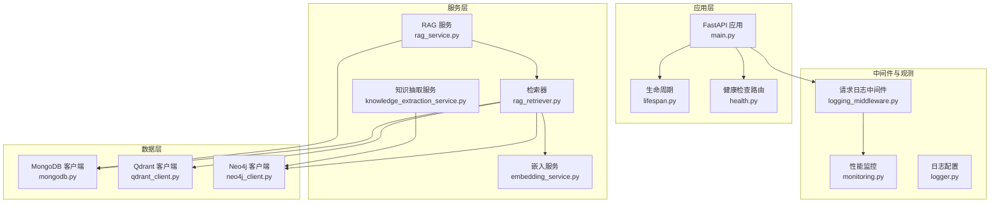
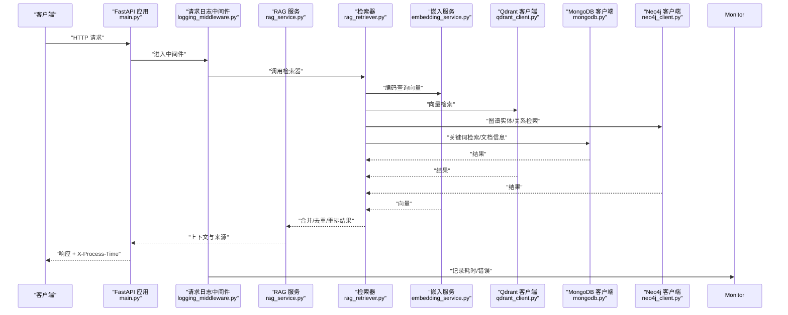
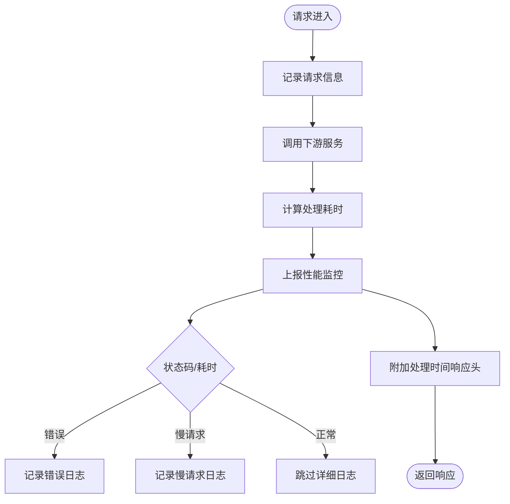
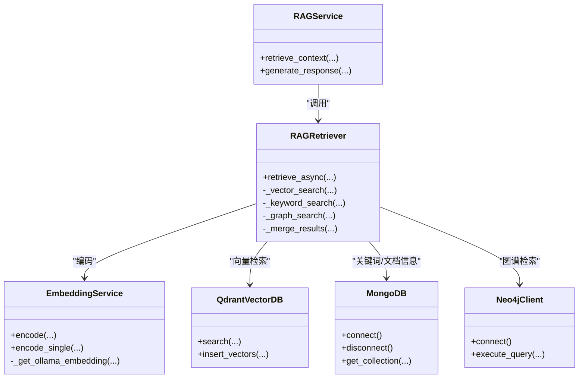
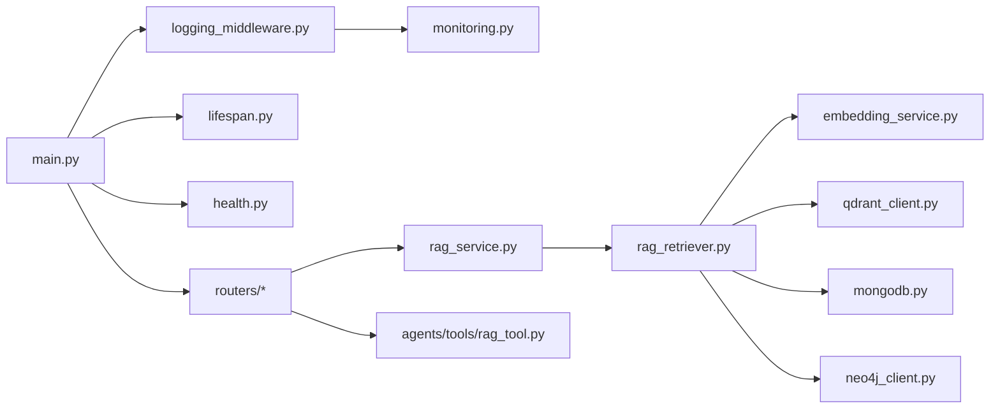

# 调试与性能优化

<cite>
**本文引用的文件**
- [main.py](file://main.py)
- [logger.py](file://utils/logger.py)
- [logging_middleware.py](file://middleware/logging_middleware.py)
- [monitoring.py](file://utils/monitoring.py)
- [health.py](file://routers/health.py)
- [lifespan.py](file://utils/lifespan.py)
- [rag_service.py](file://services/rag_service.py)
- [rag_retriever.py](file://retrieval/rag_retriever.py)
- [embedding_service.py](file://embedding/embedding_service.py)
- [mongodb.py](file://database/mongodb.py)
- [qdrant_client.py](file://database/qdrant_client.py)
- [neo4j_client.py](file://database/neo4j_client.py)
- [knowledge_extraction_service.py](file://services/knowledge_extraction_service.py)
- [retrieval_router.py](file://routers/retrieval.py)
- [rag_tool.py](file://agents/tools/rag_tool.py)
</cite>

## 目录
1. [简介](#简介)
2. [项目结构](#项目结构)
3. [核心组件](#核心组件)
4. [架构总览](#架构总览)
5. [详细组件分析](#详细组件分析)
6. [依赖关系分析](#依赖关系分析)
7. [性能考量](#性能考量)
8. [故障排查指南](#故障排查指南)
9. [结论](#结论)
10. [附录](#附录)

## 简介
本文件面向 advanced-rag 的调试与性能优化，围绕日志系统、断点调试、性能分析工具展开；解释内存泄漏检测、CPU 使用率分析、网络请求监控等常见问题诊断方法；提供缓存机制、异步处理、数据库查询优化等策略；描述监控与可观测性（指标收集、错误追踪、性能指标）；涵盖代理系统（模型调用延迟、流式响应优化、并发处理）与 RAG 服务（向量检索优化、嵌入计算加速、数据库连接池管理）的性能问题排查；并给出生产与开发环境的调试差异及故障排除流程。

## 项目结构
- 应用入口与生命周期：FastAPI 应用、CORS、静态文件挂载、路由注册、全局异常处理、生命周期钩子。
- 日志与中间件：请求日志中间件、异步日志写入、性能监控装饰器与上下文管理器。
- 服务层：RAG 服务、检索器、嵌入服务、知识抽取服务。
- 数据层：MongoDB（异步/同步）、Qdrant（向量检索）、Neo4j（图谱）。
- 路由与工具：检索路由、LangChain 工具适配。

图表来源
- [main.py:55-126](file://main.py#L55-L126)
- [lifespan.py:26-87](file://utils/lifespan.py#L26-L87)
- [logging_middleware.py:8-51](file://middleware/logging_middleware.py#L8-L51)
- [monitoring.py:13-184](file://utils/monitoring.py#L13-L184)
- [health.py:23-134](file://routers/health.py#L23-L134)
- [rag_service.py:7-247](file://services/rag_service.py#L7-L247)
- [rag_retriever.py:22-324](file://retrieval/rag_retriever.py#L22-L324)
- [embedding_service.py:8-277](file://embedding/embedding_service.py#L8-L277)
- [knowledge_extraction_service.py:10-210](file://services/knowledge_extraction_service.py#L10-L210)
- [mongodb.py:92-199](file://database/mongodb.py#L92-L199)
- [qdrant_client.py:18-543](file://database/qdrant_client.py#L18-L543)
- [neo4j_client.py:6-103](file://database/neo4j_client.py#L6-L103)

章节来源
- [main.py:15-97](file://main.py#L15-L97)
- [lifespan.py:26-87](file://utils/lifespan.py#L26-L87)
- [logging_middleware.py:8-51](file://middleware/logging_middleware.py#L8-L51)
- [monitoring.py:13-184](file://utils/monitoring.py#L13-L184)
- [health.py:23-134](file://routers/health.py#L23-L134)

## 核心组件
- 应用入口与生命周期
  - FastAPI 应用、CORS、静态文件挂载、路由注册、全局异常处理、生命周期钩子。
  - 生命周期中包含 MongoDB 连接与初始化（默认助手、默认知识空间）。
- 日志系统
  - 异步文件处理器、队列监听器、控制台处理器、日志级别与环境变量控制、生产环境日志降噪。
- 请求日志中间件
  - 记录请求/响应、慢请求标记、性能监控上报、错误追踪。
- 性能监控
  - 请求耗时统计（均值、P50/P95/P99）、错误计数、系统指标采集（CPU/内存/磁盘）、装饰器与上下文管理器。
- RAG 服务与检索器
  - 并行检索（向量/关键词/图谱）、结果合并与去重、可选重排、回退策略。
- 嵌入服务
  - Ollama 嵌入调用、模型名称规范化、超时与重试、文本截断保护。
- 数据库客户端
  - MongoDB 连接池参数、Qdrant gRPC 连接复用、Neo4j 连接与查询。
- 健康检查与指标
  - 服务连通性检查、系统资源信息、性能指标端点。

章节来源
- [main.py:55-157](file://main.py#L55-L157)
- [lifespan.py:8-87](file://utils/lifespan.py#L8-L87)
- [logger.py:15-87](file://utils/logger.py#L15-L87)
- [logging_middleware.py:8-51](file://middleware/logging_middleware.py#L8-L51)
- [monitoring.py:13-184](file://utils/monitoring.py#L13-L184)
- [rag_service.py:10-247](file://services/rag_service.py#L10-L247)
- [rag_retriever.py:69-324](file://retrieval/rag_retriever.py#L69-L324)
- [embedding_service.py:11-277](file://embedding/embedding_service.py#L11-L277)
- [mongodb.py:92-199](file://database/mongodb.py#L92-L199)
- [qdrant_client.py:18-139](file://database/qdrant_client.py#L18-L139)
- [neo4j_client.py:6-103](file://database/neo4j_client.py#L6-L103)
- [health.py:23-134](file://routers/health.py#L23-L134)

## 架构总览
下图展示请求从 FastAPI 到各下游服务的调用链路与监控点。

图表来源
- [main.py:91-97](file://main.py#L91-L97)
- [logging_middleware.py:8-51](file://middleware/logging_middleware.py#L8-L51)
- [rag_service.py:10-247](file://services/rag_service.py#L10-L247)
- [rag_retriever.py:69-324](file://retrieval/rag_retriever.py#L69-L324)
- [embedding_service.py:175-277](file://embedding/embedding_service.py#L175-L277)
- [qdrant_client.py:336-413](file://database/qdrant_client.py#L336-L413)
- [neo4j_client.py:40-62](file://database/neo4j_client.py#L40-L62)
- [mongodb.py:770-800](file://database/mongodb.py#L770-L800)

## 详细组件分析

### 日志系统与中间件
- 异步日志写入
  - 使用队列监听器与队列处理器，避免阻塞主线程；生产环境降低文件日志级别。
- 请求日志中间件
  - 记录请求路径/IP/参数；区分慢请求与错误；注入处理时间到响应头；上报性能监控。
- 性能监控
  - 记录每条路径的请求次数、错误次数与耗时分布；采集 CPU/内存/磁盘；提供装饰器与上下文管理器。

图表来源
- [logging_middleware.py:8-51](file://middleware/logging_middleware.py#L8-L51)
- [monitoring.py:22-48](file://utils/monitoring.py#L22-L48)

章节来源
- [logger.py:15-87](file://utils/logger.py#L15-L87)
- [logging_middleware.py:8-51](file://middleware/logging_middleware.py#L8-L51)
- [monitoring.py:13-184](file://utils/monitoring.py#L13-L184)

### RAG 服务与检索器
- RAG 服务
  - 并行检索多个知识空间集合；批量查询文档元数据；去重与排序；回退策略。
- 检索器
  - 并行执行向量/关键词/图谱检索；结果合并与分数融合；可选重排；异常降级。
- 嵌入服务
  - Ollama 模型检测与规范化；超时与重试；文本截断；维度缓存。

图表来源
- [rag_service.py:7-247](file://services/rag_service.py#L7-L247)
- [rag_retriever.py:22-324](file://retrieval/rag_retriever.py#L22-L324)
- [embedding_service.py:8-277](file://embedding/embedding_service.py#L8-L277)
- [qdrant_client.py:18-543](file://database/qdrant_client.py#L18-L543)
- [mongodb.py:92-199](file://database/mongodb.py#L92-L199)
- [neo4j_client.py:6-103](file://database/neo4j_client.py#L6-L103)

章节来源
- [rag_service.py:10-247](file://services/rag_service.py#L10-L247)
- [rag_retriever.py:69-324](file://retrieval/rag_retriever.py#L69-L324)
- [embedding_service.py:175-277](file://embedding/embedding_service.py#L175-L277)

### 数据库与外部服务
- MongoDB
  - 连接池参数（最大/最小连接、空闲超时、服务器选择/连接/套接字超时）；惰性连接与 ping 校验；文档/分块仓库。
- Qdrant
  - gRPC 优先连接、连接复用、自动集合维度校验与重建、UPSERT 重试与指数退避。
- Neo4j
  - 容器环境 URI 替换、连接验证、Cypher 查询执行。

章节来源
- [mongodb.py:122-184](file://database/mongodb.py#L122-L184)
- [qdrant_client.py:66-139](file://database/qdrant_client.py#L66-L139)
- [neo4j_client.py:16-62](file://database/neo4j_client.py#L16-L62)

### 健康检查与指标
- 健康检查端点
  - MongoDB/ Qdrant 连通性检查；系统资源信息；存活/就绪探针。
- 指标端点
  - 请求统计（计数/错误/耗时分布）；系统指标（CPU/内存/磁盘）。

章节来源
- [health.py:23-134](file://routers/health.py#L23-L134)
- [monitoring.py:49-111](file://utils/monitoring.py#L49-L111)

### LangChain 工具与代理系统
- RAG 工具
  - 同步/异步执行适配；在异步环境优先使用异步；错误提示。
- 代理工作流
  - 工具集成、多专家协作、检索与生成流程。

章节来源
- [rag_tool.py:17-57](file://agents/tools/rag_tool.py#L17-L57)

## 依赖关系分析
- 组件耦合
  - RAG 服务依赖检索器与数据库；检索器依赖嵌入、Qdrant、MongoDB、Neo4j；中间件依赖监控；健康检查依赖各客户端。
- 外部依赖
  - Ollama（嵌入/推理）、Qdrant（向量检索）、MongoDB（文档/分块）、Neo4j（图谱）。
- 循环依赖
  - 未发现直接循环依赖；模块间通过服务层解耦。

图表来源
- [main.py:15-97](file://main.py#L15-L97)
- [logging_middleware.py:8-51](file://middleware/logging_middleware.py#L8-L51)
- [monitoring.py:13-184](file://utils/monitoring.py#L13-L184)
- [health.py:23-134](file://routers/health.py#L23-L134)
- [rag_service.py:7-247](file://services/rag_service.py#L7-L247)
- [rag_retriever.py:22-324](file://retrieval/rag_retriever.py#L22-L324)
- [embedding_service.py:8-277](file://embedding/embedding_service.py#L8-L277)
- [qdrant_client.py:18-543](file://database/qdrant_client.py#L18-L543)
- [mongodb.py:92-199](file://database/mongodb.py#L92-L199)
- [neo4j_client.py:6-103](file://database/neo4j_client.py#L6-L103)
- [rag_tool.py:17-57](file://agents/tools/rag_tool.py#L17-L57)

## 性能考量
- 日志与中间件
  - 异步日志避免阻塞；生产环境降低 INFO 级别文件日志；慢请求与错误日志显著减少噪音。
- 并行与异步
  - 检索器并行执行向量/关键词/图谱检索；RAG 服务并行检索多个集合；工具与路由层尽量使用异步。
- 数据库连接池
  - MongoDB 连接池参数可调；Qdrant 优先 gRPC 与连接复用；避免频繁连接/断开。
- 嵌入与检索
  - 嵌入超时与重试；文本截断；向量维度一致性；检索阈值与 top_k 控制。
- 监控与指标
  - 路径级耗时统计、错误率、系统资源；健康检查端点与指标端点。

章节来源
- [logger.py:56-81](file://utils/logger.py#L56-L81)
- [logging_middleware.py:33-44](file://middleware/logging_middleware.py#L33-L44)
- [monitoring.py:22-68](file://utils/monitoring.py#L22-L68)
- [rag_retriever.py:82-101](file://retrieval/rag_retriever.py#L82-L101)
- [rag_service.py:64-83](file://services/rag_service.py#L64-L83)
- [mongodb.py:122-136](file://database/mongodb.py#L122-L136)
- [qdrant_client.py:66-96](file://database/qdrant_client.py#L66-L96)
- [embedding_service.py:175-229](file://embedding/embedding_service.py#L175-L229)

## 故障排查指南

### 日志系统配置与使用
- 环境变量
  - LOG_LEVEL 控制日志级别；ENVIRONMENT 控制生产/开发行为。
- 日志降噪
  - 生产环境文件日志仅 WARNING 及以上；第三方库日志降噪。
- 断点调试
  - 开发环境启用 reload；生产环境多 worker；结合响应头 X-Process-Time 定位慢请求。

章节来源
- [logger.py:18-81](file://utils/logger.py#L18-L81)
- [main.py:128-157](file://main.py#L128-L157)

### 性能分析工具与监控
- 指标端点
  - /api/health/metrics 返回请求统计与系统指标。
- 慢请求定位
  - 中间件记录慢请求与错误；监控器统计 P50/P95/P99。
- 系统资源
  - CPU/内存/磁盘使用情况；进程级 CPU/内存占用。

章节来源
- [health.py:117-134](file://routers/health.py#L117-L134)
- [monitoring.py:49-111](file://utils/monitoring.py#L49-L111)
- [logging_middleware.py:33-44](file://middleware/logging_middleware.py#L33-L44)

### 常见问题诊断
- 内存泄漏检测
  - 使用系统指标端点观察内存使用趋势；关注进程内存（process_mb）持续增长。
- CPU 使用率分析
  - 观察 CPU 百分比与进程 CPU；结合慢请求定位热点路径。
- 网络请求监控
  - 中间件记录处理时间与状态码；慢请求日志；健康检查端点验证依赖服务连通性。

章节来源
- [monitoring.py:78-111](file://utils/monitoring.py#L78-L111)
- [logging_middleware.py:33-44](file://middleware/logging_middleware.py#L33-L44)
- [health.py:32-66](file://routers/health.py#L32-L66)

### 代理系统性能问题排查
- 模型调用延迟
  - 嵌入服务超时与重试；模型名称规范化；容器内 URI 替换（host.docker.internal）。
- 流式响应优化
  - 中间件记录处理时间；路由层尽量使用异步；避免阻塞操作。
- 并发处理
  - 生产环境多 worker；uvicorn keep-alive 超时与并发连接限制；连接池参数优化。

章节来源
- [embedding_service.py:175-229](file://embedding/embedding_service.py#L175-L229)
- [neo4j_client.py:20-26](file://database/neo4j_client.py#L20-L26)
- [main.py:141-157](file://main.py#L141-L157)
- [mongodb.py:122-136](file://database/mongodb.py#L122-L136)

### RAG 服务性能瓶颈
- 向量检索优化
  - Qdrant gRPC 连接复用；自动集合维度校验与重建；score_threshold 与 top_k 控制。
- 嵌入计算加速
  - Ollama 超时与重试；文本截断；模型维度缓存。
- 数据库连接池管理
  - MongoDB 连接池参数；惰性连接与 ping 校验；文档/分块查询优化。

章节来源
- [qdrant_client.py:66-139](file://database/qdrant_client.py#L66-L139)
- [qdrant_client.py:336-413](file://database/qdrant_client.py#L336-L413)
- [embedding_service.py:230-277](file://embedding/embedding_service.py#L230-L277)
- [mongodb.py:122-184](file://database/mongodb.py#L122-L184)

### 生产环境调试与故障排除流程
- 启动与初始化
  - 生命周期中 MongoDB 连接与默认助手/知识空间初始化；失败重试。
- 健康检查
  - 依赖服务连通性检查；就绪探针；存活探针。
- 故障排除
  - 查看慢请求与错误日志；检查系统指标；核对连接池参数与超时设置。

章节来源
- [lifespan.py:8-87](file://utils/lifespan.py#L8-L87)
- [health.py:90-114](file://routers/health.py#L90-L114)
- [logging_middleware.py:33-50](file://middleware/logging_middleware.py#L33-L50)
- [monitoring.py:49-111](file://utils/monitoring.py#L49-L111)

### 开发环境与生产环境调试差异
- 环境变量加载顺序与文件
  - 优先加载 ENVIRONMENT/NODE_ENV 对应 .env.*；回退到 .env 或根目录 .env。
- 服务器配置
  - 生产：多 worker、禁用 reload、keep-alive 超时与并发限制；日志降噪。
  - 开发：单 worker、启用 reload、控制台同步日志。
- 调试策略
  - 开发：断点、详细日志；生产：指标驱动、慢请求定位、最小化日志噪声。

章节来源
- [main.py:20-52](file://main.py#L20-L52)
- [main.py:128-157](file://main.py#L128-L157)
- [logger.py:77-81](file://utils/logger.py#L77-L81)

## 结论
本项目通过异步日志、请求中间件与性能监控实现了可观测性；通过并行检索、连接池与 gRPC 复用提升了性能；通过健康检查与指标端点保障了生产稳定性。针对代理系统与 RAG 服务，建议重点关注嵌入超时与重试、向量检索阈值与 top_k、数据库连接池参数与 Qdrant 维度一致性。生产与开发环境在 worker 数量、reload、日志级别与降噪方面存在显著差异，需按环境调整调试策略与故障排除流程。

## 附录
- 关键路径参考
  - 应用入口与生命周期：[main.py:55-157](file://main.py#L55-L157)、[lifespan.py:26-87](file://utils/lifespan.py#L26-L87)
  - 日志与中间件：[logger.py:15-87](file://utils/logger.py#L15-L87)、[logging_middleware.py:8-51](file://middleware/logging_middleware.py#L8-L51)
  - 性能监控：[monitoring.py:13-184](file://utils/monitoring.py#L13-L184)
  - RAG 服务与检索器：[rag_service.py:7-247](file://services/rag_service.py#L7-L247)、[rag_retriever.py:22-324](file://retrieval/rag_retriever.py#L22-L324)
  - 嵌入服务：[embedding_service.py:8-277](file://embedding/embedding_service.py#L8-L277)
  - 数据库客户端：[mongodb.py:92-199](file://database/mongodb.py#L92-L199)、[qdrant_client.py:18-543](file://database/qdrant_client.py#L18-L543)、[neo4j_client.py:6-103](file://database/neo4j_client.py#L6-L103)
  - 健康检查与指标：[health.py:23-134](file://routers/health.py#L23-L134)
  - LangChain 工具：[rag_tool.py:17-57](file://agents/tools/rag_tool.py#L17-L57)