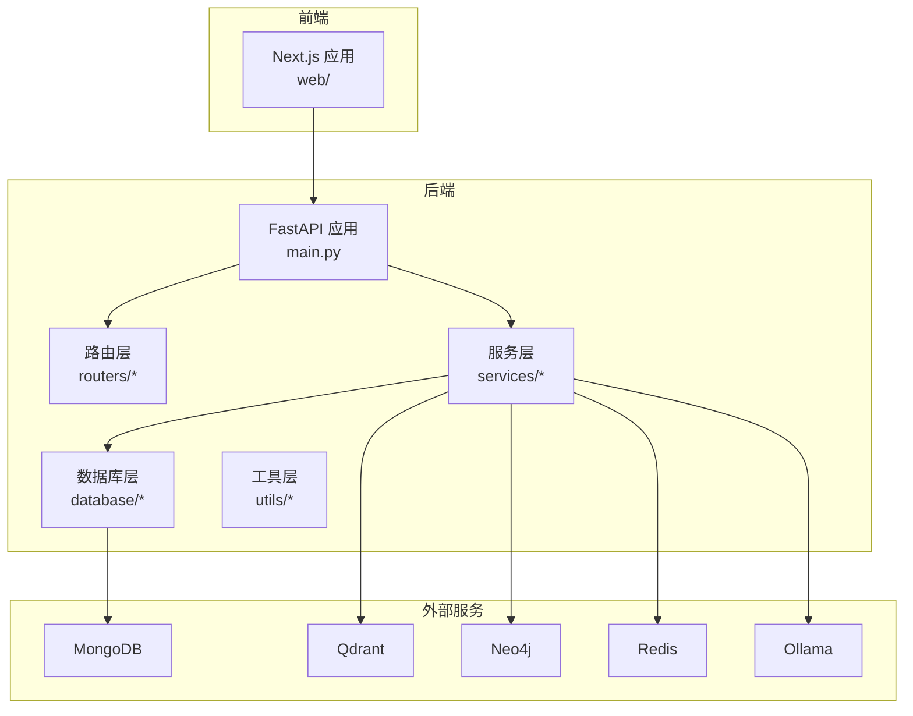
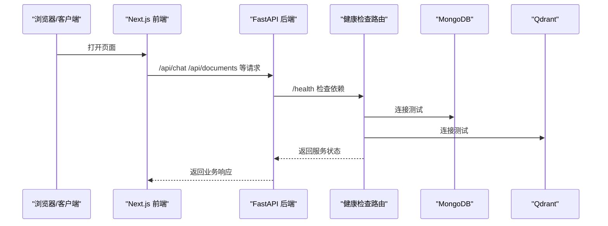
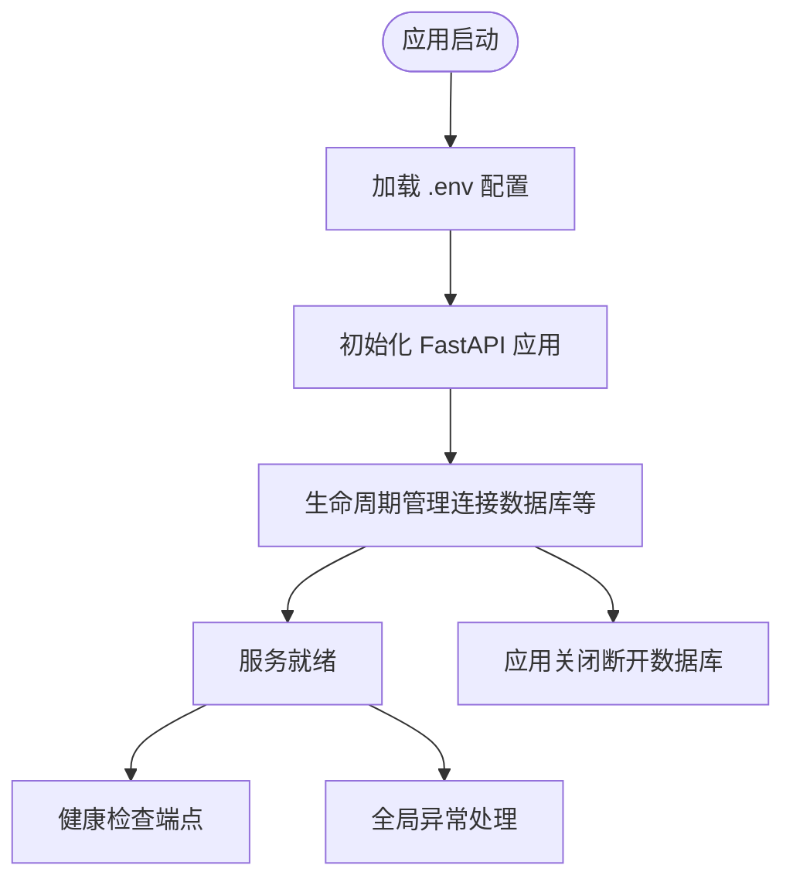
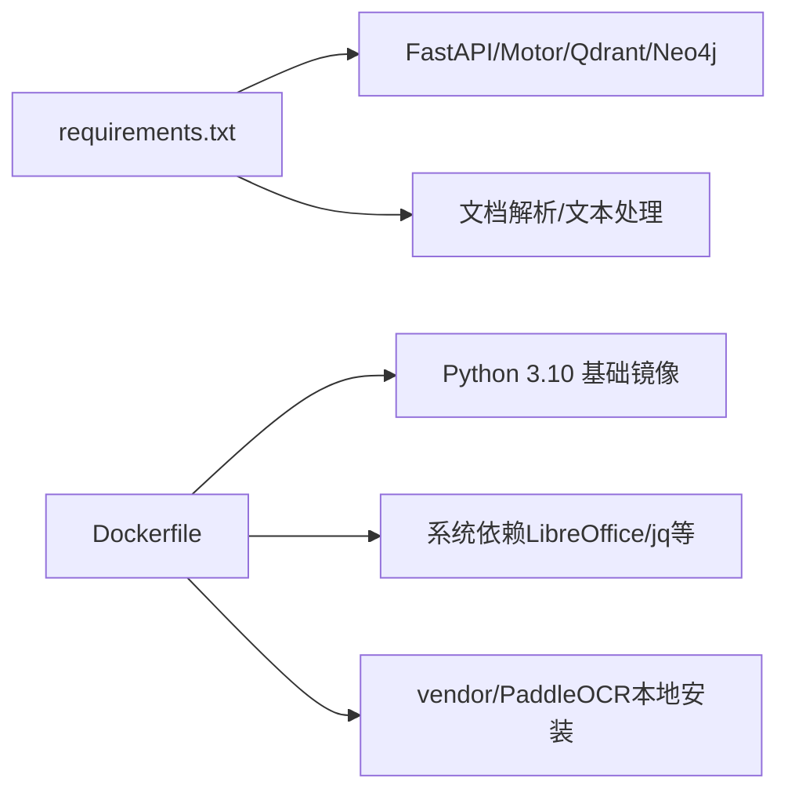

# 快速开始

<cite>
**本文引用的文件**
- [README.md](file://README.md)
- [requirements.txt](file://requirements.txt)
- [main.py](file://main.py)
- [docker-compose.yml](file://docker-compose.yml)
- [Dockerfile](file://Dockerfile)
- [download_dependencies.sh](file://download_dependencies.sh)
- [download_dependencies.ps1](file://download_dependencies.ps1)
- [scripts/start-backend-8000.ps1](file://scripts/start-backend-8000.ps1)
- [scripts/stop-backend-8000.ps1](file://scripts/stop-backend-8000.ps1)
- [utils/lifespan.py](file://utils/lifespan.py)
- [utils/logger.py](file://utils/logger.py)
- [routers/health.py](file://routers/health.py)
- [web/package.json](file://web/package.json)
- [web/Dockerfile](file://web/Dockerfile)
- [web/next.config.ts](file://web/next.config.ts)
- [database/mongodb.py](file://database/mongodb.py)
</cite>

## 目录
1. [简介](#简介)
2. [项目结构](#项目结构)
3. [核心组件](#核心组件)
4. [架构总览](#架构总览)
5. [详细组件分析](#详细组件分析)
6. [依赖分析](#依赖分析)
7. [性能考虑](#性能考虑)
8. [故障排查指南](#故障排查指南)
9. [结论](#结论)
10. [附录](#附录)

## 简介
本指南面向新手开发者，帮助你在最短时间内完成 Advanced RAG 项目的环境准备、依赖安装、配置与启动，并提供验证方法与常见问题排查。项目基于 FastAPI + Next.js，提供 AI 助手对话（含深度研究）与知识库检索/入库能力。

## 项目结构
项目采用前后端分离架构：
- 后端：FastAPI 应用，负责 API 路由、业务服务、数据库与外部服务集成
- 前端：Next.js 应用，负责聊天界面与知识空间展示
- 数据与服务：MongoDB、Qdrant、Neo4j、Redis、Ollama 等

图表来源
- [main.py:1-171](file://main.py#L1-L171)
- [routers/health.py:1-135](file://routers/health.py#L1-L135)
- [web/next.config.ts:1-48](file://web/next.config.ts#L1-L48)

章节来源
- [README.md:55-70](file://README.md#L55-L70)
- [main.py:90-99](file://main.py#L90-L99)

## 核心组件
- 应用入口与生命周期：FastAPI 应用、CORS 中间件、静态文件挂载、全局异常处理、生命周期管理
- 健康检查：统一健康检查端点，检测 MongoDB、Qdrant 状态
- 日志系统：异步文件日志与控制台日志，支持生产环境降噪
- Docker 与 Compose：一键启动后端与外部服务（MongoDB、Qdrant、Neo4j、Redis）

章节来源
- [main.py:55-127](file://main.py#L55-L127)
- [utils/lifespan.py:28-93](file://utils/lifespan.py#L28-L93)
- [routers/health.py:23-87](file://routers/health.py#L23-L87)
- [utils/logger.py:15-88](file://utils/logger.py#L15-L88)

## 架构总览
后端通过路由层暴露 API，服务层封装业务逻辑，数据库层对接 MongoDB、Qdrant、Neo4j、Redis，外部服务通过 Ollama 提供本地推理能力。前端 Next.js 通过 /api 代理访问后端。

图表来源
- [routers/health.py:23-87](file://routers/health.py#L23-L87)
- [main.py:90-99](file://main.py#L90-L99)

## 详细组件分析

### 环境要求与安装
- Python 3.9+（推荐 3.10）
- MongoDB 4.4+（启动时未连接不会阻止，但相关接口不可用）
- Qdrant（可通过 Docker 运行；未连接仅告警）
- Redis（可选，用于缓存）
- Neo4j（可选，用于知识图谱）
- Ollama（本地 AI 模型服务）
- PaddleOCR（第三方依赖，需提前下载到本地 vendor 目录）
- ffmpeg（可选，用于生成视频封面）

安装步骤
- 安装 Python 依赖：pip install -r requirements.txt
- 下载第三方依赖（构建前必需）：
  - Linux/macOS: chmod +x download_dependencies.sh && ./download_dependencies.sh
  - Windows CMD: download_dependencies.cmd
  - Windows PowerShell: .\download_dependencies.ps1
- 安装系统依赖（可选）：
  - Ubuntu/Debian: sudo apt-get install -y ffmpeg
  - macOS: brew install ffmpeg
  - Windows: 下载并安装 ffmpeg，确保在系统 PATH 中

章节来源
- [README.md:73-124](file://README.md#L73-L124)
- [requirements.txt:1-42](file://requirements.txt#L1-L42)
- [download_dependencies.sh:1-29](file://download_dependencies.sh#L1-L29)
- [download_dependencies.ps1:1-35](file://download_dependencies.ps1#L1-L35)

### 环境配置
创建 .env 文件（或 .env.development/.env.production），关键参数说明：
- 应用配置：ENVIRONMENT、SECRET_KEY、API_HOST、API_PORT
- MongoDB：MONGODB_URI、MONGODB_DB_NAME
- Qdrant：QDRANT_URL、QDRANT_API_KEY
- Neo4j（可选）：NEO4J_URI、NEO4J_USER、NEO4J_PASSWORD
- Redis（可选）：REDIS_HOST、REDIS_PORT、REDIS_DB
- Ollama：OLLAMA_BASE_URL、OLLAMA_MODEL、OLLAMA_EMBEDDING_MODEL
- 文件上传：MAX_UPLOAD_SIZE、UPLOAD_DIR
- 日志：LOG_LEVEL、LOG_FILE

章节来源
- [README.md:125-166](file://README.md#L125-L166)
- [main.py:20-52](file://main.py#L20-L52)

### 启动方式
- 直接运行：python main.py
- Uvicorn 启动：uvicorn main:app --reload --host 0.0.0.0 --port 8000
- Docker Compose：docker-compose up -d（自动启动 MongoDB、Qdrant、Redis、Neo4j）
- Docker：先构建镜像 docker build -t advanced-rag .，再运行 docker run -d -p 8000:8000 --env-file .env advanced-rag

章节来源
- [README.md:168-227](file://README.md#L168-L227)
- [docker-compose.yml:1-96](file://docker-compose.yml#L1-L96)
- [Dockerfile:1-95](file://Dockerfile#L1-L95)

### 服务验证
- API 文档：http://localhost:8000/docs
- 健康检查：http://localhost:8000/health
- 健康检查会返回 MongoDB、Qdrant 状态及系统资源信息

章节来源
- [README.md:185-187](file://README.md#L185-L187)
- [routers/health.py:23-87](file://routers/health.py#L23-L87)

### 生命周期与异常处理
- 应用生命周期：启动时尝试连接 MongoDB，失败仅记录告警，不影响服务启动
- 全局异常处理：捕获未处理异常并返回统一错误响应
- 日志系统：异步文件日志与控制台日志，生产环境降低 INFO 级别日志输出

图表来源
- [main.py:28-93](file://main.py#L28-L93)
- [utils/lifespan.py:28-93](file://utils/lifespan.py#L28-L93)
- [utils/logger.py:15-88](file://utils/logger.py#L15-L88)

章节来源
- [main.py:110-127](file://main.py#L110-L127)
- [utils/lifespan.py:8-25](file://utils/lifespan.py#L8-L25)

### 前端与代理
- Next.js 通过 rewrites 将 /api/* 代理到后端（默认开发环境代理到 http://localhost:8000）
- 生产环境未配置时使用相对路径，由反向代理处理
- 支持大文件上传（200MB）

章节来源
- [web/next.config.ts:12-34](file://web/next.config.ts#L12-L34)
- [web/package.json:1-40](file://web/package.json#L1-L40)

## 依赖分析
后端依赖与版本要求概览（来自 requirements.txt）：
- Web 框架：FastAPI、Uvicorn、python-multipart
- 数据库：PyMongo、Motor、Qdrant 客户端、Neo4j
- 文档解析：PyPDF2、PyMuPDF、python-docx、chardet、markdown、unstructured
- 文本与分块：jieba、LangChain、LangChain Experimental
- 其他：pydantic、httpx、requests、pytest、pytest-asyncio

Docker 镜像与系统依赖：
- 基于 python:3.10-slim，配置国内镜像源加速
- 安装 LibreOffice、libjpeg、zlib1g 等系统依赖
- 构建前需将 PaddleOCR 下载到 vendor 目录

图表来源
- [requirements.txt:4-42](file://requirements.txt#L4-L42)
- [Dockerfile:12-67](file://Dockerfile#L12-L67)

章节来源
- [requirements.txt:1-42](file://requirements.txt#L1-L42)
- [Dockerfile:24-48](file://Dockerfile#L24-L48)

## 性能考虑
- 生产环境默认多 worker（UVICORN_WORKERS=24），开发环境单 worker 并启用 reload
- 增加 keep-alive 超时（900 秒）以支持大文件上传
- 限制每个 worker 的并发连接数（limit_concurrency=2000）
- 生产环境日志降噪，仅记录 WARNING 及以上级别到文件

章节来源
- [main.py:144-171](file://main.py#L144-L171)
- [utils/logger.py:77-81](file://utils/logger.py#L77-L81)

## 故障排查指南
- MongoDB 未连接
  - 现象：服务先启动，但依赖 MongoDB 的接口不可用
  - 排查：确认 MongoDB 已启动、URI 正确；Docker 内访问宿主机使用 host.docker.internal 或 127.0.0.1
- Qdrant 未连接
  - 现象：健康检查返回 Qdrant 不健康
  - 排查：确认 Qdrant 已启动、URL 正确；Docker Compose 会自动启动
- 健康检查失败
  - 使用 /health 查看具体错误；MongoDB 连接失败会记录告警
- 端口占用
  - Windows：使用 scripts/start-backend-8000.ps1/stop-backend-8000.ps1 管理端口
- Docker 构建失败
  - 现象：提示 vendor/PaddleOCR 不存在或为空
  - 排查：先运行 download_dependencies.sh/.ps1 下载依赖后再构建

章节来源
- [utils/lifespan.py:8-25](file://utils/lifespan.py#L8-L25)
- [routers/health.py:32-66](file://routers/health.py#L32-L66)
- [scripts/start-backend-8000.ps1:1-89](file://scripts/start-backend-8000.ps1#L1-L89)
- [scripts/stop-backend-8000.ps1:1-82](file://scripts/stop-backend-8000.ps1#L1-L82)
- [Dockerfile:59-67](file://Dockerfile#L59-L67)

## 结论
按照本指南完成环境准备、依赖安装与配置后，你可以通过多种方式启动服务并进行验证。遇到问题时，优先检查健康检查返回的服务状态与日志输出，并结合本指南的故障排查建议逐项定位。

## 附录
- Docker Compose 服务清单：MongoDB、Qdrant、Neo4j、Redis
- 前端 Next.js 配置：代理 /api/* 到后端，支持大文件上传
- 环境变量加载顺序：优先加载 .env.production/.env.development，其次 .env，最后回退到默认

章节来源
- [docker-compose.yml:1-96](file://docker-compose.yml#L1-L96)
- [web/next.config.ts:12-34](file://web/next.config.ts#L12-L34)
- [main.py:20-52](file://main.py#L20-L52)