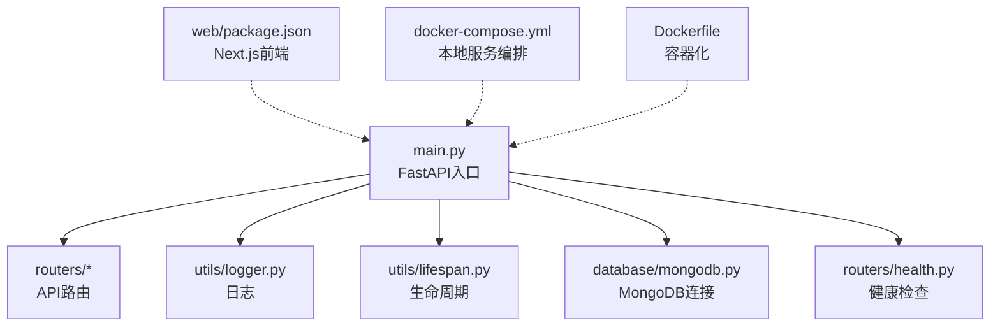
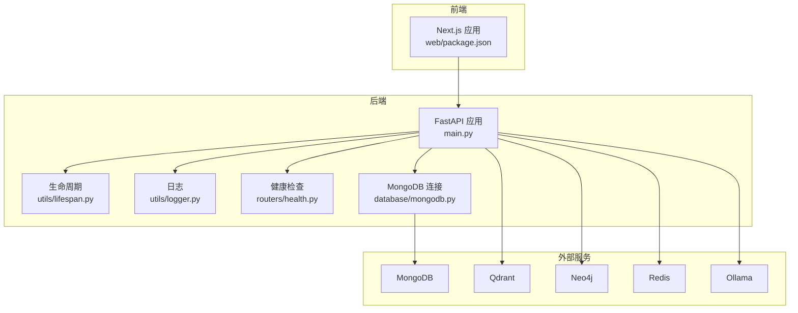
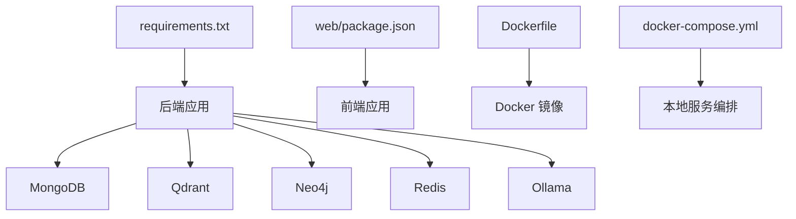

# 快速开始

<cite>
**本文引用的文件**
- [README.md](file://README.md)
- [requirements.txt](file://requirements.txt)
- [main.py](file://main.py)
- [docker-compose.yml](file://docker-compose.yml)
- [Dockerfile](file://Dockerfile)
- [download_dependencies.sh](file://download_dependencies.sh)
- [web/package.json](file://web/package.json)
- [utils/lifespan.py](file://utils/lifespan.py)
- [utils/logger.py](file://utils/logger.py)
- [routers/health.py](file://routers/health.py)
- [database/mongodb.py](file://database/mongodb.py)
</cite>

## 目录
1. [简介](#简介)
2. [项目结构](#项目结构)
3. [核心组件](#核心组件)
4. [架构总览](#架构总览)
5. [详细组件分析](#详细组件分析)
6. [依赖关系分析](#依赖关系分析)
7. [性能注意事项](#性能注意事项)
8. [故障排查指南](#故障排查指南)
9. [结论](#结论)
10. [附录](#附录)

## 简介
advanced-rag 是一个“纯开源高级RAG系统”，基于 FastAPI + Next.js 构建，专注于两大能力：AI助手匿名对话（含深度研究/深度思考）与知识库检索/入库。系统支持混合分块、双路索引（向量+知识图谱）、混合检索与精准重排，并提供文档上传、解析、入库与对话检索的完整链路。

## 项目结构
- 后端入口与路由：main.py 注册路由、CORS、静态文件与异常处理
- 数据库与中间件：MongoDB、Qdrant、Neo4j、Redis（可选）
- 服务层：RAG服务、知识抽取、ollama服务
- 前端：Next.js 应用（聊天界面、知识空间、文档管理等）
- 工具与监控：日志、生命周期管理、监控

图表来源
- [main.py:1-157](file://main.py#L1-L157)
- [routers/health.py:1-135](file://routers/health.py#L1-L135)
- [utils/lifespan.py:1-88](file://utils/lifespan.py#L1-L88)
- [utils/logger.py:1-88](file://utils/logger.py#L1-L88)
- [database/mongodb.py:1-200](file://database/mongodb.py#L1-L200)
- [docker-compose.yml:1-76](file://docker-compose.yml#L1-L76)
- [Dockerfile:1-95](file://Dockerfile#L1-L95)
- [web/package.json:1-40](file://web/package.json#L1-L40)

章节来源
- [README.md:55-70](file://README.md#L55-L70)
- [main.py:90-98](file://main.py#L90-L98)

## 核心组件
- FastAPI 应用入口与生命周期：负责加载环境变量、注册路由、CORS、静态文件、异常处理与 uvicorn 启动参数
- 健康检查：检查 MongoDB、Qdrant 等关键服务状态
- 日志系统：异步文件写入，支持生产/开发差异化级别
- 数据库连接：MongoDB 连接池配置与重试机制
- Docker 编排：本地一键启动 MongoDB、Qdrant、Neo4j 等服务

章节来源
- [main.py:20-52](file://main.py#L20-L52)
- [main.py:90-98](file://main.py#L90-L98)
- [main.py:128-157](file://main.py#L128-L157)
- [routers/health.py:23-87](file://routers/health.py#L23-L87)
- [utils/logger.py:15-82](file://utils/logger.py#L15-L82)
- [utils/lifespan.py:26-80](file://utils/lifespan.py#L26-L80)
- [database/mongodb.py:99-184](file://database/mongodb.py#L99-L184)
- [docker-compose.yml:1-76](file://docker-compose.yml#L1-L76)

## 架构总览
系统采用“后端API + 前端Next.js”的前后端分离架构，后端通过 FastAPI 提供 REST API，前端通过 Next.js 提供交互界面。数据库与向量/图数据库通过容器化服务提供，Ollama 作为本地推理服务。

图表来源
- [main.py:15-18](file://main.py#L15-L18)
- [main.py:90-98](file://main.py#L90-L98)
- [utils/lifespan.py:26-80](file://utils/lifespan.py#L26-L80)
- [utils/logger.py:15-82](file://utils/logger.py#L15-L82)
- [routers/health.py:23-87](file://routers/health.py#L23-L87)
- [database/mongodb.py:99-184](file://database/mongodb.py#L99-L184)
- [docker-compose.yml:1-76](file://docker-compose.yml#L1-L76)

## 详细组件分析

### 环境与依赖安装
- Python 3.9+：系统最低版本要求
- Python 包安装：使用 requirements.txt
- 第三方依赖（PaddleOCR）：需先下载到本地 vendor 目录后再构建镜像
- 系统依赖（可选）：若需生成视频封面，需安装 ffmpeg

章节来源
- [README.md:73-124](file://README.md#L73-L124)
- [requirements.txt:1-38](file://requirements.txt#L1-L38)
- [download_dependencies.sh:1-29](file://download_dependencies.sh#L1-L29)

### 环境配置（.env）
- 应用配置：环境模式、密钥、主机与端口
- 数据库配置：MongoDB、Qdrant、Neo4j、Redis
- AI 与模型：Ollama 基础URL、模型名称、嵌入模型
- 文件上传：最大上传大小、上传目录
- 日志配置：日志级别、日志文件路径

章节来源
- [README.md:125-166](file://README.md#L125-L166)
- [main.py:20-52](file://main.py#L20-L52)

### 启动方式
- 本地开发模式：直接运行后端入口
- Uvicorn 启动：支持热重载与指定主机/端口
- Docker Compose：一键启动 MongoDB、Qdrant、Neo4j 等服务
- Docker 镜像：构建镜像并运行容器，支持环境变量文件

章节来源
- [README.md:168-227](file://README.md#L168-L227)
- [main.py:128-157](file://main.py#L128-L157)
- [docker-compose.yml:1-76](file://docker-compose.yml#L1-L76)
- [Dockerfile:91-95](file://Dockerfile#L91-L95)

### 服务启动后的验证
- 健康检查：访问 /health 获取整体服务状态
- API 文档：访问 /docs 查看接口定义
- 健康检查端点：/health、/health/liveness、/health/readiness、/health/metrics

章节来源
- [README.md:185-187](file://README.md#L185-L187)
- [routers/health.py:23-135](file://routers/health.py#L23-L135)

### 第一个对话示例
- 常规对话：POST /api/chat（流式SSE）
- 深度研究：POST /api/chat/deep-research
- 对话附件上传并入库：POST /api/chat/conversation-attachment
- 附件处理状态查询：GET /api/chat/conversation-attachment/{conversation_id}/{file_id}/status

章节来源
- [README.md:189-198](file://README.md#L189-L198)

### 文档上传示例
- 文档上传入库：POST /api/documents/upload
- 文档列表：GET /api/documents
- 知识空间列表：GET /api/knowledge-spaces

章节来源
- [README.md:189-198](file://README.md#L189-L198)

## 依赖关系分析
- 后端依赖：FastAPI、Uvicorn、MongoDB/Motor、Qdrant、Neo4j、PaddleOCR、Unstructured、LangChain、jieba、sentence-transformers 等
- 前端依赖：Next.js、React、数学渲染、Markdown 渲染等
- Docker 依赖：Python 3.10-slim、APT 镜像源、pip 国内镜像源、LibreOffice、ffmpeg（可选）

图表来源
- [requirements.txt:1-38](file://requirements.txt#L1-L38)
- [web/package.json:1-40](file://web/package.json#L1-L40)
- [Dockerfile:1-95](file://Dockerfile#L1-L95)
- [docker-compose.yml:1-76](file://docker-compose.yml#L1-L76)

章节来源
- [requirements.txt:1-38](file://requirements.txt#L1-L38)
- [web/package.json:12-38](file://web/package.json#L12-L38)
- [Dockerfile:24-48](file://Dockerfile#L24-L48)
- [docker-compose.yml:1-76](file://docker-compose.yml#L1-L76)

## 性能注意事项
- 连接池与超时：MongoDB 连接池参数（最大/最小连接数、空闲超时、服务器选择/连接/Socket 超时）可提升高并发稳定性
- 生产环境 worker 数量：默认 24，可通过环境变量覆盖
- keep-alive 超时与并发限制：支持大文件上传与高并发场景
- 日志级别：生产环境降低 INFO 级别日志写入频率，减少 I/O 压力

章节来源
- [database/mongodb.py:122-136](file://database/mongodb.py#L122-L136)
- [main.py:140-156](file://main.py#L140-L156)
- [utils/logger.py:77-81](file://utils/logger.py#L77-L81)

## 故障排查指南
- MongoDB 连接失败：检查 MONGODB_URI 或 MONGODB_HOST/PORT 配置，确认服务已启动，Docker 场景使用 host.docker.internal 或 127.0.0.1
- 健康检查异常：访问 /health 查看具体服务状态与错误提示
- PaddleOCR 依赖缺失：构建前需执行 download_dependencies.sh（Linux/macOS）或对应 Windows 脚本
- ffmpeg 未安装：如需生成视频封面，需安装 ffmpeg 并确保在系统 PATH 中
- 日志定位：查看 logs/advanced-rag.log，结合控制台输出定位问题

章节来源
- [database/mongodb.py:177-184](file://database/mongodb.py#L177-L184)
- [routers/health.py:23-87](file://routers/health.py#L23-L87)
- [download_dependencies.sh:15-24](file://download_dependencies.sh#L15-L24)
- [README.md:107-124](file://README.md#L107-L124)
- [utils/logger.py:31-54](file://utils/logger.py#L31-L54)

## 结论
通过本快速开始指南，您可以在本地或容器环境中完成 advanced-rag 的安装与启动，并使用健康检查与 API 文档验证服务可用性。随后可进行第一个对话与文档上传示例，体验系统的 RAG 能力。如遇问题，可参考故障排查章节中的常见问题与定位方法。

## 附录
- 核心 API 接口清单（当前版本）
  - POST /api/chat：常规对话（流式SSE）
  - POST /api/chat/deep-research：深度研究模式
  - POST /api/chat/conversation-attachment：对话附件上传并入库
  - GET /api/chat/conversation-attachment/{conversation_id}/{file_id}/status：附件处理状态
  - POST /api/documents/upload：文档上传入库
  - GET /api/documents：文档列表
  - GET /api/knowledge-spaces：知识空间列表
  - GET /health：健康检查

章节来源
- [README.md:189-198](file://README.md#L189-L198)