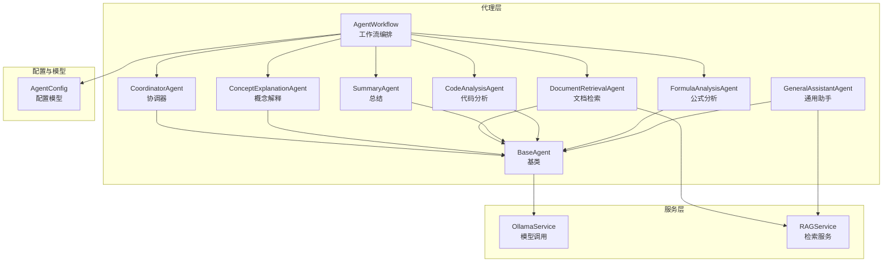
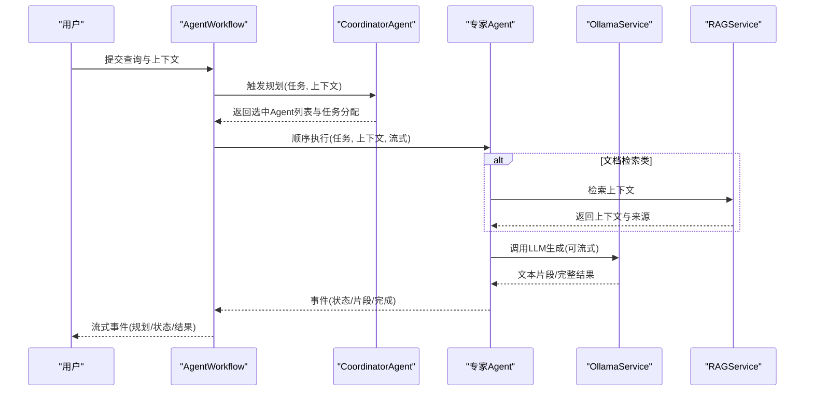
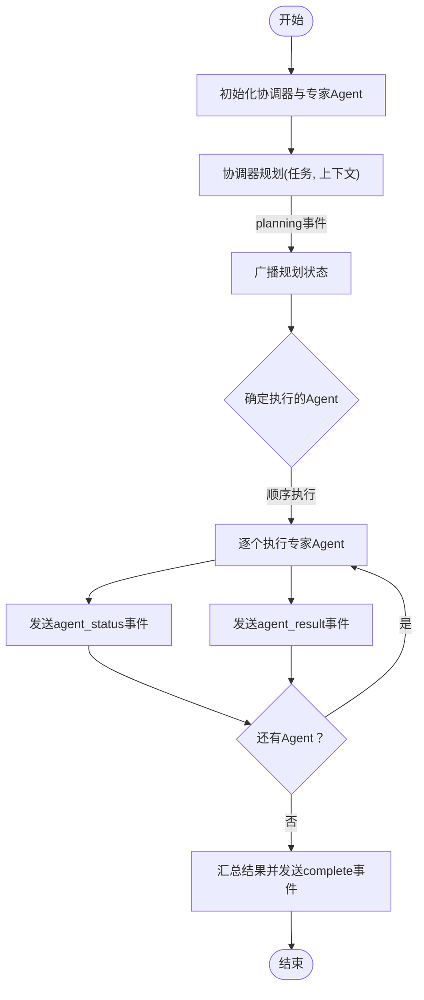
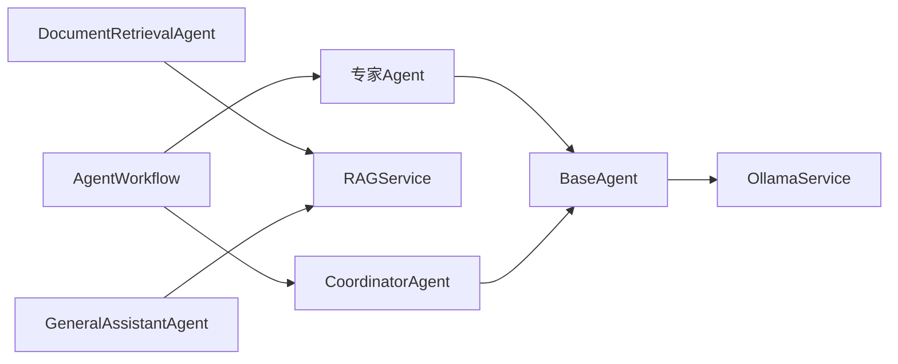

# AI代理扩展

<cite>
**本文引用的文件**
- [agents/base/base_agent.py](file://agents/base/base_agent.py)
- [agents/workflow/agent_workflow.py](file://agents/workflow/agent_workflow.py)
- [agents/coordinator/coordinator_agent.py](file://agents/coordinator/coordinator_agent.py)
- [agents/experts/concept_explanation_agent.py](file://agents/experts/concept_explanation_agent.py)
- [agents/experts/document_retrieval_agent.py](file://agents/experts/document_retrieval_agent.py)
- [agents/experts/summary_agent.py](file://agents/experts/summary_agent.py)
- [agents/experts/code_analysis_agent.py](file://agents/experts/code_analysis_agent.py)
- [agents/experts/formula_analysis_agent.py](file://agents/experts/formula_analysis_agent.py)
- [agents/general_assistant/general_assistant_agent.py](file://agents/general_assistant/general_assistant_agent.py)
- [services/ollama_service.py](file://services/ollama_service.py)
- [services/rag_service.py](file://services/rag_service.py)
- [models/agent_config.py](file://models/agent_config.py)
- [README.md](file://README.md)
</cite>

## 目录
1. [简介](#简介)
2. [项目结构](#项目结构)
3. [核心组件](#核心组件)
4. [架构总览](#架构总览)
5. [详细组件分析](#详细组件分析)
6. [依赖分析](#依赖分析)
7. [性能考虑](#性能考虑)
8. [故障排查指南](#故障排查指南)
9. [结论](#结论)
10. [附录](#附录)

## 简介
本指南面向希望扩展与定制AI代理的开发者，围绕BaseAgent基类设计、代理工作流编排机制、专家代理开发流程、流式响应与上下文管理、以及多代理协作等主题，提供从接口规范到实现细节的系统化说明。读者将学会如何在AgentWorkflow中集成自定义代理，如何实现概念解释、文档检索、摘要生成等类型的专家代理，并掌握复杂推理与结果格式化的最佳实践。

## 项目结构
该项目采用“模块化+分层”的组织方式：
- agents：代理体系（基类、协调器、专家代理、通用助手、工作流）
- services：底层服务（Ollama模型服务、RAG检索服务）
- models：配置与数据模型
- routers/web：API与前端交互
- 其他子系统：解析、分块、嵌入、数据库、评估等

图表来源
- [agents/base/base_agent.py:8-122](file://agents/base/base_agent.py#L8-L122)
- [agents/coordinator/coordinator_agent.py:7-252](file://agents/coordinator/coordinator_agent.py#L7-L252)
- [agents/experts/concept_explanation_agent.py:7-70](file://agents/experts/concept_explanation_agent.py#L7-L70)
- [agents/experts/document_retrieval_agent.py:8-79](file://agents/experts/document_retrieval_agent.py#L8-L79)
- [agents/experts/summary_agent.py:7-87](file://agents/experts/summary_agent.py#L7-L87)
- [agents/experts/code_analysis_agent.py:7-79](file://agents/experts/code_analysis_agent.py#L7-L79)
- [agents/experts/formula_analysis_agent.py:8-107](file://agents/experts/formula_analysis_agent.py#L8-L107)
- [agents/general_assistant/general_assistant_agent.py:9-167](file://agents/general_assistant/general_assistant_agent.py#L9-L167)
- [agents/workflow/agent_workflow.py:47-388](file://agents/workflow/agent_workflow.py#L47-L388)
- [services/ollama_service.py:9-674](file://services/ollama_service.py#L9-L674)
- [services/rag_service.py:7-248](file://services/rag_service.py#L7-L248)
- [models/agent_config.py:6-24](file://models/agent_config.py#L6-L24)

章节来源
- [README.md:46-70](file://README.md#L46-L70)

## 核心组件
- BaseAgent：定义所有Agent的通用接口与基础设施，包括抽象方法、系统提示词、工具扩展点、以及统一的LLM调用封装。
- CoordinatorAgent：负责任务规划与专家Agent选择，输出选中Agent列表、任务分配与选择理由。
- 专家Agent：面向具体任务域的实现，如概念解释、文档检索、代码分析、公式分析、总结等。
- AgentWorkflow：编排多Agent协作，负责配置加载、状态广播、顺序执行与结果聚合。
- OllamaService：统一的模型调用服务，支持流式/非流式生成、提示词链构建、工具函数调用注入等。
- RAGService：封装检索流程，支持多集合并行检索、来源去重与排序、上下文拼装与回退策略。

章节来源
- [agents/base/base_agent.py:8-122](file://agents/base/base_agent.py#L8-L122)
- [agents/coordinator/coordinator_agent.py:7-252](file://agents/coordinator/coordinator_agent.py#L7-L252)
- [agents/workflow/agent_workflow.py:47-388](file://agents/workflow/agent_workflow.py#L47-L388)
- [services/ollama_service.py:9-674](file://services/ollama_service.py#L9-L674)
- [services/rag_service.py:7-248](file://services/rag_service.py#L7-L248)

## 架构总览
整体架构遵循“基类抽象 + 协调器规划 + 专家执行 + 服务支撑”的模式。工作流以CoordinatorAgent为核心，根据用户问题动态选择专家Agent，逐个顺序执行，同时通过流式事件向前端反馈进度与状态。

图表来源
- [agents/workflow/agent_workflow.py:106-337](file://agents/workflow/agent_workflow.py#L106-L337)
- [agents/coordinator/coordinator_agent.py:55-160](file://agents/coordinator/coordinator_agent.py#L55-L160)
- [agents/experts/document_retrieval_agent.py:25-79](file://agents/experts/document_retrieval_agent.py#L25-L79)
- [services/rag_service.py:10-242](file://services/rag_service.py#L10-L242)
- [services/ollama_service.py:50-93](file://services/ollama_service.py#L50-L93)

## 详细组件分析

### BaseAgent基类设计与接口规范
- 抽象方法
  - get_default_model()：返回默认推理模型名称
  - execute(task, context=None, stream=False)：异步生成器，产出事件型结果（如chunk、complete、status、error）
- 基础设施
  - OllamaService集成：统一的模型调用封装，支持流式/非流式
  - 系统提示词：get_prompt()可覆盖，便于领域定制
  - 上下文构建：_build_prompt(task, context)将系统提示词与上下文拼装
  - 工具扩展：get_tools()预留扩展点（默认空列表）
- 事件约定
  - type字段标识事件类型（planning、agent_status、agent_result、complete、chunk、status、error）
  - complete事件包含content、sources、confidence等关键字段
  - chunk事件用于流式增量输出

章节来源
- [agents/base/base_agent.py:8-122](file://agents/base/base_agent.py#L8-L122)

### 协调器Agent（CoordinatorAgent）
- 职责
  - 解析用户问题，选择必要专家Agent
  - 生成任务分配与选择理由
  - 输出JSON格式规划结果，包含selected_agents、agent_tasks、reasoning
- 容错与回退
  - JSON解析失败时，按关键词进行后备选择
  - 保证至少返回一个Agent（默认概念解释）
- 事件输出
  - type为planning，携带规划文本与选中Agent列表

章节来源
- [agents/coordinator/coordinator_agent.py:7-252](file://agents/coordinator/coordinator_agent.py#L7-L252)

### 专家代理开发流程（以概念解释为例）
- 步骤
  1) 继承BaseAgent，实现get_default_model与get_prompt
  2) 在execute中构造任务提示词，调用self._call_llm(prompt, stream=...)
  3) 流式场景下，每产生一段文本，yield {type:"chunk", ...}
  4) 完成时，yield {type:"complete", content, confidence, ...}
- 关键点
  - 流式输出与进度估算：在流式事件中更新progress
  - 错误处理：捕获异常并返回type:"error"事件
  - 置信度：complete事件包含confidence，便于上层决策

章节来源
- [agents/experts/concept_explanation_agent.py:7-70](file://agents/experts/concept_explanation_agent.py#L7-L70)

### 文档检索专家（DocumentRetrievalAgent）
- 流程
  - 从上下文提取assistant_id/document_id等参数
  - 调用RAGService.retrieve_context获取上下文与来源
  - 使用LLM对检索结果进行总结，形成最终回复
- 输出
  - complete事件包含content、sources、recommended_resources、confidence、raw_context

章节来源
- [agents/experts/document_retrieval_agent.py:8-79](file://agents/experts/document_retrieval_agent.py#L8-L79)
- [services/rag_service.py:10-242](file://services/rag_service.py#L10-L242)

### 总结专家（SummaryAgent）
- 输入
  - 从context.other_results读取其他Agent结果
- 处理
  - 格式化其他结果，构造总结提示词
  - 流式生成总结内容
- 输出
  - complete事件，confidence较高

章节来源
- [agents/experts/summary_agent.py:7-87](file://agents/experts/summary_agent.py#L7-L87)

### 代码分析专家（CodeAnalysisAgent）
- 特性
  - 检测输入是否包含代码，若无则直接返回低置信度结果
  - 支持流式输出与错误处理

章节来源
- [agents/experts/code_analysis_agent.py:7-79](file://agents/experts/code_analysis_agent.py#L7-L79)

### 公式分析专家（FormulaAnalysisAgent）
- 特性
  - 从文本中提取LaTeX公式，若无公式则返回低置信度结果
  - complete事件包含formulas字段

章节来源
- [agents/experts/formula_analysis_agent.py:8-107](file://agents/experts/formula_analysis_agent.py#L8-L107)

### 通用助手（GeneralAssistantAgent）
- 特性
  - 高阶RAG：混合检索、重排、知识图谱融合
  - 智能模型选择：根据问题动态选择模型
  - 流式输出：支持SSE风格的增量文本
- 事件
  - 流式chunk事件与complete事件，complete包含sources与recommended_resources

章节来源
- [agents/general_assistant/general_assistant_agent.py:9-167](file://agents/general_assistant/general_assistant_agent.py#L9-L167)

### Agent工作流编排（AgentWorkflow）
- 能力
  - 加载Agent配置（从数据库），支持延迟初始化与缓存
  - 规划阶段：触发CoordinatorAgent，产出planning事件
  - 执行阶段：顺序执行选中的专家Agent，实时广播agent_status与agent_result
  - 完成阶段：汇总agent_results，产出complete事件
- 事件类型
  - planning：规划结果与选中Agent列表
  - agent_status：pending/running/completed/error/skipped
  - agent_result：单个Agent的content、sources、confidence
  - complete：聚合结果与统计信息
  - error：工作流级错误

图表来源
- [agents/workflow/agent_workflow.py:106-337](file://agents/workflow/agent_workflow.py#L106-L337)

章节来源
- [agents/workflow/agent_workflow.py:47-388](file://agents/workflow/agent_workflow.py#L47-L388)

### 流式响应处理与上下文管理
- 流式响应
  - BaseAgent._call_llm与OllamaService.generate均支持stream参数
  - Agent在execute中按块产出chunk事件，前端可实时渲染
- 上下文管理
  - BaseAgent._build_prompt将系统提示词与上下文拼装
  - OllamaService._build_prompt支持知识库状态、文档信息、对话历史、引用内容等多维上下文
  - RAGService并行检索多集合，去重与排序，返回结构化sources

章节来源
- [agents/base/base_agent.py:75-121](file://agents/base/base_agent.py#L75-L121)
- [services/ollama_service.py:94-274](file://services/ollama_service.py#L94-L274)
- [services/rag_service.py:10-242](file://services/rag_service.py#L10-L242)

### 多代理协作的技术要点
- 选择策略：CoordinatorAgent基于问题复杂度与关键词智能选择Agent
- 顺序执行：AgentWorkflow顺序执行选中Agent，便于前端进度可视化
- 结果整合：SummaryAgent可汇总其他Agent结果，形成最终报告
- 容错与回退：RAGService在检索失败时可回退到无上下文模式；CoordinatorAgent在JSON解析失败时使用关键词回退

章节来源
- [agents/coordinator/coordinator_agent.py:170-214](file://agents/coordinator/coordinator_agent.py#L170-L214)
- [services/rag_service.py:193-242](file://services/rag_service.py#L193-L242)
- [agents/workflow/agent_workflow.py:181-222](file://agents/workflow/agent_workflow.py#L181-L222)

### 复杂推理与结果格式化
- 复杂推理
  - 协调器规划：在planning事件中输出reasoning，便于追踪决策依据
  - 多Agent协同：通过agent_tasks为每个Agent分配具体任务，降低耦合
- 结果格式化
  - complete事件统一包含content、sources、confidence
  - 流式事件包含agent_type与progress，便于前端渲染

章节来源
- [agents/coordinator/coordinator_agent.py:108-157](file://agents/coordinator/coordinator_agent.py#L108-L157)
- [agents/workflow/agent_workflow.py:268-296](file://agents/workflow/agent_workflow.py#L268-L296)

## 依赖分析
- 组件耦合
  - 所有专家Agent依赖BaseAgent与OllamaService
  - DocumentRetrievalAgent与GeneralAssistantAgent依赖RAGService
  - AgentWorkflow依赖CoordinatorAgent与各专家Agent类映射
- 外部依赖
  - Ollama服务（模型推理）、MongoDB（配置存储）、Qdrant/Neo4j（检索与图谱）
- 循环依赖
  - 未发现直接循环依赖；工作流通过类映射间接调度专家Agent

图表来源
- [agents/base/base_agent.py:8-122](file://agents/base/base_agent.py#L8-L122)
- [agents/workflow/agent_workflow.py:47-105](file://agents/workflow/agent_workflow.py#L47-L105)
- [agents/coordinator/coordinator_agent.py:7-252](file://agents/coordinator/coordinator_agent.py#L7-L252)
- [agents/experts/document_retrieval_agent.py:8-79](file://agents/experts/document_retrieval_agent.py#L8-L79)
- [agents/general_assistant/general_assistant_agent.py:9-167](file://agents/general_assistant/general_assistant_agent.py#L9-L167)
- [services/rag_service.py:7-248](file://services/rag_service.py#L7-L248)
- [services/ollama_service.py:9-674](file://services/ollama_service.py#L9-L674)

章节来源
- [agents/workflow/agent_workflow.py:47-105](file://agents/workflow/agent_workflow.py#L47-L105)

## 性能考虑
- 流式生成
  - 使用OllamaService的流式接口，降低首字节延迟，提升用户体验
- 并行检索
  - RAGService对多集合检索使用asyncio.gather并行执行，缩短总延迟
- 缓存与回退
  - AgentWorkflow对Agent配置与实例进行缓存；RAGService在检索失败时回退到无上下文模式
- 超时与稳定性
  - OllamaService设置较长超时时间，适配大模型生成；流式响应设置空闲超时保护

章节来源
- [services/ollama_service.py:32-34](file://services/ollama_service.py#L32-L34)
- [services/rag_service.py:65-83](file://services/rag_service.py#L65-L83)
- [agents/workflow/agent_workflow.py:62-104](file://agents/workflow/agent_workflow.py#L62-L104)

## 故障排查指南
- 协调器规划失败
  - 现象：返回error事件或未选中Agent
  - 处理：检查提示词格式与JSON解析；确认回退逻辑是否生效
- 专家Agent执行异常
  - 现象：agent_status为error，complete事件包含错误详情
  - 处理：查看Agent内部日志，确认上下文参数与工具调用
- 流式输出中断
  - 现象：流式响应超时或空闲超时
  - 处理：检查Ollama服务可达性与超时配置；适当增大OLLAMA_TIMEOUT
- 检索失败
  - 现象：RAGService抛出异常或sources为空
  - 处理：启用fallback_on_error；检查集合名称与权限

章节来源
- [agents/coordinator/coordinator_agent.py:130-135](file://agents/coordinator/coordinator_agent.py#L130-L135)
- [agents/workflow/agent_workflow.py:306-322](file://agents/workflow/agent_workflow.py#L306-L322)
- [services/ollama_service.py:453-637](file://services/ollama_service.py#L453-L637)
- [services/rag_service.py:225-236](file://services/rag_service.py#L225-L236)

## 结论
本指南系统阐述了BaseAgent基类的接口规范、AgentWorkflow的工作流编排机制、专家代理的开发流程与最佳实践。通过协调器智能选择、顺序执行与流式事件广播，系统实现了从任务分解到结果整合的完整闭环。开发者可据此快速扩展新的专家代理，集成复杂推理与结果格式化，满足多样化的AI应用需求。

## 附录

### 在AgentWorkflow中集成自定义代理的步骤
- 定义Agent
  - 继承BaseAgent，实现get_default_model与get_prompt
  - 在execute中按事件约定产出chunk/complete/status/error
- 注册映射
  - 在AgentWorkflow.AGENT_MAP中添加自定义Agent类
- 配置加载
  - 在数据库中为自定义Agent类型配置inference_model/embedding_model
- 验证与调试
  - 通过AgentWorkflow.execute_workflow触发，观察planning与agent_status事件

章节来源
- [agents/workflow/agent_workflow.py:47-105](file://agents/workflow/agent_workflow.py#L47-L105)
- [models/agent_config.py:6-24](file://models/agent_config.py#L6-L24)

### 专家代理实现示例路径
- 概念解释专家
  - [agents/experts/concept_explanation_agent.py:7-70](file://agents/experts/concept_explanation_agent.py#L7-L70)
- 文档检索专家
  - [agents/experts/document_retrieval_agent.py:8-79](file://agents/experts/document_retrieval_agent.py#L8-L79)
- 总结专家
  - [agents/experts/summary_agent.py:7-87](file://agents/experts/summary_agent.py#L7-L87)
- 代码分析专家
  - [agents/experts/code_analysis_agent.py:7-79](file://agents/experts/code_analysis_agent.py#L7-L79)
- 公式分析专家
  - [agents/experts/formula_analysis_agent.py:8-107](file://agents/experts/formula_analysis_agent.py#L8-L107)