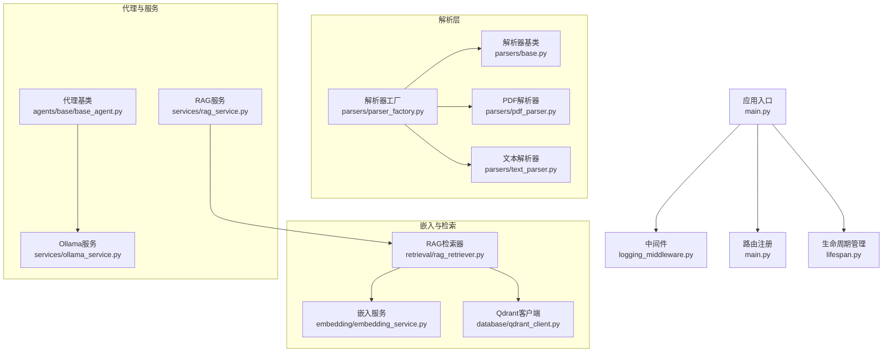
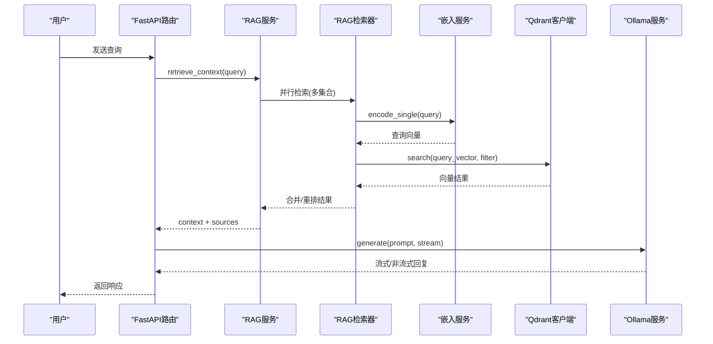
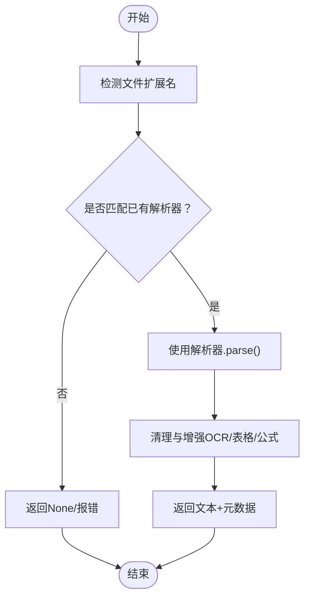
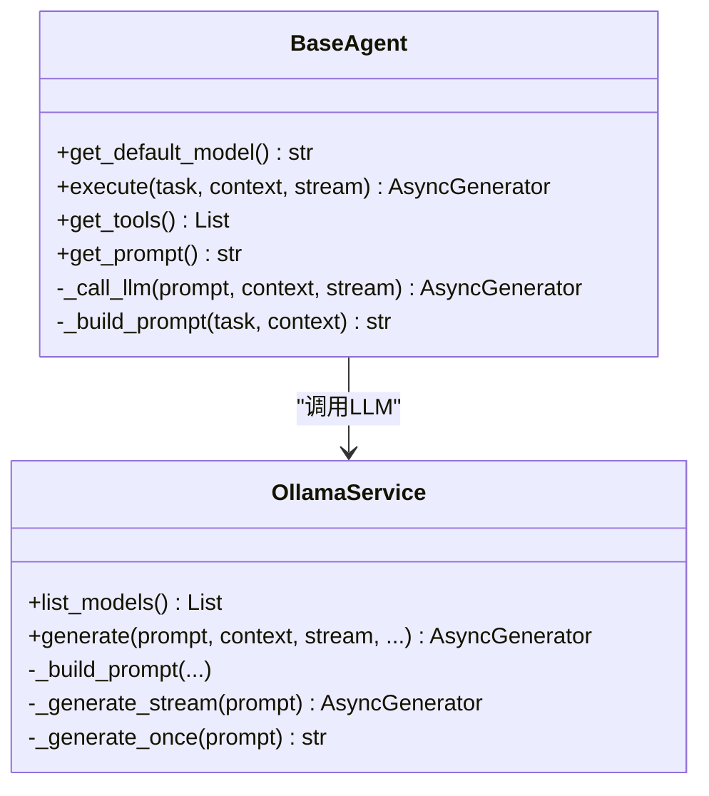
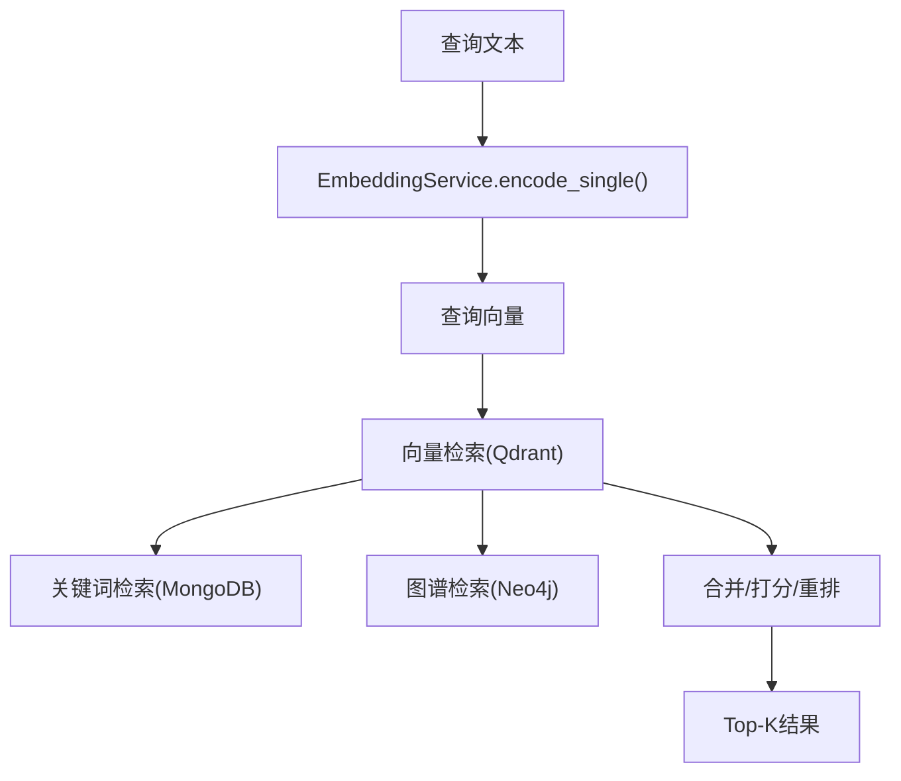
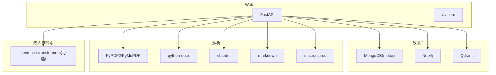

# 扩展开发

<cite>
**本文引用的文件**
- [main.py](file://main.py)
- [base_agent.py](file://agents/base/base_agent.py)
- [pdf_parser.py](file://parsers/pdf_parser.py)
- [text_parser.py](file://parsers/text_parser.py)
- [base.py](file://parsers/base.py)
- [parser_factory.py](file://parsers/parser_factory.py)
- [embedding_service.py](file://embedding/embedding_service.py)
- [rag_retriever.py](file://retrieval/rag_retriever.py)
- [ollama_service.py](file://services/ollama_service.py)
- [rag_service.py](file://services/rag_service.py)
- [qdrant_client.py](file://database/qdrant_client.py)
- [lifespan.py](file://utils/lifespan.py)
- [logging_middleware.py](file://middleware/logging_middleware.py)
- [requirements.txt](file://requirements.txt)
</cite>

## 目录
1. [简介](#简介)
2. [项目结构](#项目结构)
3. [核心组件](#核心组件)
4. [架构总览](#架构总览)
5. [详细组件分析](#详细组件分析)
6. [依赖分析](#依赖分析)
7. [性能考虑](#性能考虑)
8. [故障排查指南](#故障排查指南)
9. [结论](#结论)
10. [附录](#附录)

## 简介
本指南面向希望在 advanced-rag 基础上进行扩展开发的工程师，系统阐述插件化架构与扩展点设计，涵盖：
- 自定义文档解析器的开发流程与接口规范
- 自定义 AI 代理的实现、工作流集成与流式响应处理
- 检索算法扩展点、嵌入模型替换与向量化服务集成
- 第三方服务集成（外部 API 接入、认证与错误处理）
- 配置管理、动态加载与热更新机制
- 扩展模块的测试、部署与版本兼容策略
- 最佳实践与常见陷阱规避

## 项目结构
系统采用“分层 + 功能域”的组织方式：
- 应用入口与生命周期：FastAPI 应用、中间件、环境配置与启动初始化
- 业务能力域：解析器、嵌入、检索、代理、服务、数据库客户端
- 工具与基础设施：日志、监控、性能指标、GPU/GNN 等辅助模块

**图表来源**
- [main.py:15-97](file://main.py#L15-L97)
- [logging_middleware.py:8-51](file://middleware/logging_middleware.py#L8-L51)
- [lifespan.py:26-87](file://utils/lifespan.py#L26-L87)
- [base.py:6-31](file://parsers/base.py#L6-L31)
- [parser_factory.py:10-40](file://parsers/parser_factory.py#L10-L40)
- [pdf_parser.py:12-207](file://parsers/pdf_parser.py#L12-L207)
- [text_parser.py:7-35](file://parsers/text_parser.py#L7-L35)
- [embedding_service.py:8-277](file://embedding/embedding_service.py#L8-L277)
- [rag_retriever.py:22-324](file://retrieval/rag_retriever.py#L22-L324)
- [qdrant_client.py:18-543](file://database/qdrant_client.py#L18-L543)
- [base_agent.py:8-121](file://agents/base/base_agent.py#L8-L121)
- [ollama_service.py:9-673](file://services/ollama_service.py#L9-L673)
- [rag_service.py:7-247](file://services/rag_service.py#L7-L247)

**章节来源**
- [main.py:15-97](file://main.py#L15-L97)
- [lifespan.py:26-87](file://utils/lifespan.py#L26-L87)
- [logging_middleware.py:8-51](file://middleware/logging_middleware.py#L8-L51)

## 核心组件
- 应用入口与生命周期
  - FastAPI 应用初始化、CORS、静态文件挂载、全局异常处理
  - 生命周期钩子：启动时连接数据库、初始化默认助手与知识空间；关闭时断开连接
- 中间件
  - 请求日志与性能监控中间件，记录慢请求与错误
- 解析器体系
  - 抽象基类定义统一接口，工厂按扩展名选择解析器，支持注册新解析器
- 嵌入与检索
  - 基于 Ollama 的嵌入服务，自动检测模型与规范化名称
  - RAG 检索器：向量检索、关键词检索、图谱检索（可扩展），结果合并与重排
  - Qdrant 客户端：gRPC 连接、自动集合创建/重建、插入与查询、过滤与删除
- 代理与服务
  - 代理基类：统一 LLM 调用、提示词构建、工具与流式输出
  - Ollama 服务：构建完整提示词、工具函数调用、流式/非流式生成
  - RAG 服务：检索上下文、聚合来源、回退策略

**章节来源**
- [main.py:55-126](file://main.py#L55-L126)
- [lifespan.py:26-87](file://utils/lifespan.py#L26-L87)
- [logging_middleware.py:8-51](file://middleware/logging_middleware.py#L8-L51)
- [base.py:6-31](file://parsers/base.py#L6-L31)
- [parser_factory.py:10-40](file://parsers/parser_factory.py#L10-L40)
- [embedding_service.py:8-277](file://embedding/embedding_service.py#L8-L277)
- [rag_retriever.py:22-324](file://retrieval/rag_retriever.py#L22-L324)
- [qdrant_client.py:18-543](file://database/qdrant_client.py#L18-L543)
- [base_agent.py:8-121](file://agents/base/base_agent.py#L8-L121)
- [ollama_service.py:9-673](file://services/ollama_service.py#L9-L673)
- [rag_service.py:7-247](file://services/rag_service.py#L7-L247)

## 架构总览
系统采用“解析 → 向量化 → 检索 → 生成”的端到端链路，支持多策略融合与流式输出。

**图表来源**
- [rag_service.py:10-191](file://services/rag_service.py#L10-L191)
- [rag_retriever.py:69-101](file://retrieval/rag_retriever.py#L69-L101)
- [embedding_service.py:230-259](file://embedding/embedding_service.py#L230-L259)
- [qdrant_client.py:336-413](file://database/qdrant_client.py#L336-L413)
- [ollama_service.py:50-93](file://services/ollama_service.py#L50-L93)

## 详细组件分析

### 解析器扩展点与自定义开发指南
- 扩展点设计
  - 解析器抽象基类定义统一接口：parse、supported_extensions、can_parse
  - 解析器工厂按扩展名选择解析器，支持注册新解析器
- 自定义步骤
  - 实现 BaseParser 子类，定义 supported_extensions 与 parse
  - 在工厂中注册新解析器，或通过工厂的 register_parser 动态注册
  - 在路由或入库流程中使用工厂选择解析器
- 格式支持与性能优化
  - PDF：文本版与扫描版双通道（OCR、表格、公式）增强，注意大文件分页与内存控制
  - 文本：自动编码检测，避免乱码
  - 扩展点：可引入更多格式解析器（如 PPT、Excel、Markdown 等）
- 流程图（解析器选择与调用）

**图表来源**
- [base.py:6-31](file://parsers/base.py#L6-L31)
- [parser_factory.py:20-40](file://parsers/parser_factory.py#L20-L40)
- [pdf_parser.py:103-201](file://parsers/pdf_parser.py#L103-L201)
- [text_parser.py:10-31](file://parsers/text_parser.py#L10-L31)

**章节来源**
- [base.py:6-31](file://parsers/base.py#L6-L31)
- [parser_factory.py:10-40](file://parsers/parser_factory.py#L10-L40)
- [pdf_parser.py:12-207](file://parsers/pdf_parser.py#L12-L207)
- [text_parser.py:7-35](file://parsers/text_parser.py#L7-L35)

### AI 代理扩展点与自定义开发指南
- 扩展点设计
  - BaseAgent 定义统一接口：get_default_model、execute（支持流式）、提示词与工具
  - OllamaService 提供统一的 LLM 调用、提示词链构建、工具函数调用与流式输出
- 自定义步骤
  - 继承 BaseAgent，实现 get_default_model 与 execute
  - 在 execute 中调用 _call_llm 或直接使用 OllamaService.generate
  - 通过 get_prompt 提供系统提示词，get_tools 注册工具
- 工作流集成
  - 代理可由工作流编排器调度，或在 RAG 服务中作为专家节点参与
  - 与 RAG 服务协作：传入 assistant_id、document_id、knowledge_base 状态等上下文
- 流式响应处理
  - OllamaService 支持流式生成，内部使用线程池与队列在异步环境中解耦
  - 注意超时与空闲超时控制，避免长时间无数据
- 类图（代理与服务）

**图表来源**
- [base_agent.py:8-121](file://agents/base/base_agent.py#L8-L121)
- [ollama_service.py:9-673](file://services/ollama_service.py#L9-L673)

**章节来源**
- [base_agent.py:8-121](file://agents/base/base_agent.py#L8-L121)
- [ollama_service.py:50-93](file://services/ollama_service.py#L50-L93)
- [rag_service.py:193-242](file://services/rag_service.py#L193-L242)

### 检索算法扩展点与嵌入模型替换
- 检索扩展点
  - RAGRetriever 支持向量检索、关键词检索、图谱检索并行执行与结果合并
  - 可扩展重排（CrossEncoder）与更多检索策略（BM25、Sparse/Dense Hybrid）
- 嵌入模型替换
  - EmbeddingService 支持 Ollama 模型自动检测与规范化，可配置不同 embedding 模型
  - encode/encode_single 支持批量与单条编码，内置超长文本截断
- 向量化服务集成
  - Qdrant 客户端：gRPC 连接、自动集合创建/重建、插入与查询、过滤与删除
  - 插入时具备重试与维度不匹配自动重建能力
- 流程图（检索与嵌入）

**图表来源**
- [embedding_service.py:230-259](file://embedding/embedding_service.py#L230-L259)
- [rag_retriever.py:69-101](file://retrieval/rag_retriever.py#L69-L101)
- [qdrant_client.py:336-413](file://database/qdrant_client.py#L336-L413)

**章节来源**
- [rag_retriever.py:22-324](file://retrieval/rag_retriever.py#L22-L324)
- [embedding_service.py:8-277](file://embedding/embedding_service.py#L8-L277)
- [qdrant_client.py:18-543](file://database/qdrant_client.py#L18-L543)

### 第三方服务集成指南
- 外部 API 接入
  - 使用 requests/httpx 发起 HTTP 请求，注意超时与重试
  - 对于流式响应，采用线程池与队列解耦，避免阻塞事件循环
- 认证机制
  - 环境变量注入（如 API Key），区分本地与远程连接的安全策略
  - 对于 Qdrant：本地 HTTP 可不使用 API Key，远程建议 HTTPS
- 错误处理
  - 分类错误：超时、连接错误、临时性错误（指数退避）
  - 非临时性错误：直接抛出或降级处理
- 示例参考
  - OllamaService 的流式生成与超时控制
  - Qdrant 客户端的重试与维度不匹配自动重建

**章节来源**
- [ollama_service.py:453-637](file://services/ollama_service.py#L453-L637)
- [qdrant_client.py:278-334](file://database/qdrant_client.py#L278-L334)

### 配置管理、动态加载与热更新
- 配置管理
  - 通过环境变量加载 .env.production/.env.development/.env，支持多层级回退
  - 关键配置：OLLAMA_BASE_URL/OLLAMA_MODEL/OLLAMA_EMBEDDING_MODEL、QDRANT_*、超时与端口
- 动态加载
  - 解析器工厂支持注册新解析器
  - 代理与工具可通过模块导入与注册机制动态扩展
- 热更新
  - 应用重启触发生命周期钩子，重新连接数据库与初始化默认资源
  - 建议通过容器编排与健康检查实现平滑重启

**章节来源**
- [main.py:20-52](file://main.py#L20-L52)
- [parser_factory.py:37-40](file://parsers/parser_factory.py#L37-L40)
- [lifespan.py:26-87](file://utils/lifespan.py#L26-L87)

## 依赖分析
- 外部依赖
  - Web：FastAPI、Uvicorn
  - 数据库：MongoDB（motor）、Neo4j、Qdrant
  - 文档解析：PyPDF2、PyMuPDF、python-docx、chardet、markdown、unstructured
  - 嵌入与检索：sentence-transformers（可选，当前禁用以避免崩溃）
  - 其他：httpx、requests、pydantic、langchain 系列
- 模块耦合
  - 解析器与工厂低耦合，便于新增格式
  - 检索器依赖嵌入服务与数据库客户端，具备清晰边界
  - 代理与服务通过统一接口交互，便于替换与扩展

**图表来源**
- [requirements.txt:4-38](file://requirements.txt#L4-L38)

**章节来源**
- [requirements.txt:1-38](file://requirements.txt#L1-L38)

## 性能考虑
- I/O 密集与异步
  - 检索与数据库查询采用异步 gather 并行执行
  - 流式生成使用线程池与队列，避免阻塞事件循环
- 超时与重试
  - Ollama 与 Qdrant 均配置超时与重试，支持指数退避
- 向量维度与存储
  - 自动检测与重建集合，避免维度不匹配导致的失败
  - gRPC 连接提升性能与稳定性
- 日志与监控
  - 中间件记录慢请求与错误，便于定位性能瓶颈

**章节来源**
- [rag_retriever.py:89-101](file://retrieval/rag_retriever.py#L89-L101)
- [ollama_service.py:453-637](file://services/ollama_service.py#L453-L637)
- [qdrant_client.py:278-334](file://database/qdrant_client.py#L278-L334)

## 故障排查指南
- 全局异常处理
  - 应用层统一捕获未处理异常，记录路径与方法，返回标准化错误
- 启动与连接
  - MongoDB 连接带重试；生命周期钩子负责初始化默认助手与知识空间
- 日志与慢请求
  - 中间件记录慢请求与错误，便于快速定位
- 常见问题
  - Ollama 模型未找到：检查模型名称与拉取状态
  - Qdrant 连接失败：确认 gRPC 端口、URL 替换（localhost→127.0.0.1）、API Key 安全策略
  - 重排模块加载失败：sentence-transformers 当前禁用，避免进程崩溃

**章节来源**
- [main.py:109-125](file://main.py#L109-L125)
- [lifespan.py:8-31](file://utils/lifespan.py#L8-L31)
- [logging_middleware.py:8-51](file://middleware/logging_middleware.py#L8-L51)
- [rag_retriever.py:12-20](file://retrieval/rag_retriever.py#L12-L20)

## 结论
advanced-rag 通过清晰的抽象层与扩展点，为文档解析、嵌入检索、代理生成与第三方服务集成提供了良好的可扩展性。开发者可在不破坏核心流程的前提下，按需扩展解析器、检索策略、代理与服务，同时借助统一的配置与中间件体系保障稳定性与可观测性。

## 附录
- 开发清单
  - 新增解析器：实现 BaseParser → 注册到工厂 → 路由中使用
  - 新增代理：继承 BaseAgent → 实现 execute/get_prompt → 注册到工作流
  - 替换嵌入模型：配置 OLLAMA_EMBEDDING_MODEL 或在调用时指定模型名
  - 集成第三方服务：统一使用 requests/httpx，遵循超时与重试策略
- 部署建议
  - 使用容器编排与健康检查，结合生命周期钩子实现平滑重启
  - 生产环境启用多 worker 与 gRPC 连接，合理设置超时与并发限制
- 版本兼容
  - 严格遵循依赖版本范围，避免跨版本破坏性变更
  - 对可选模块（如 sentence-transformers）做好降级与开关控制