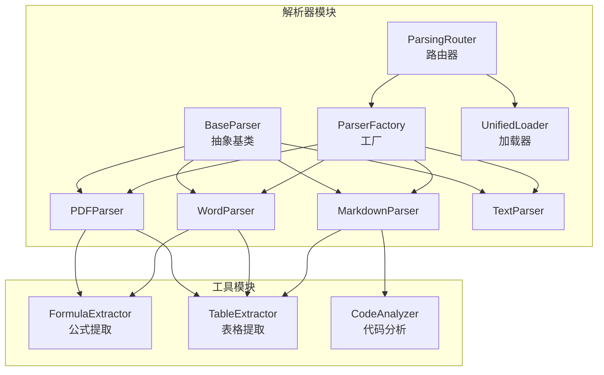
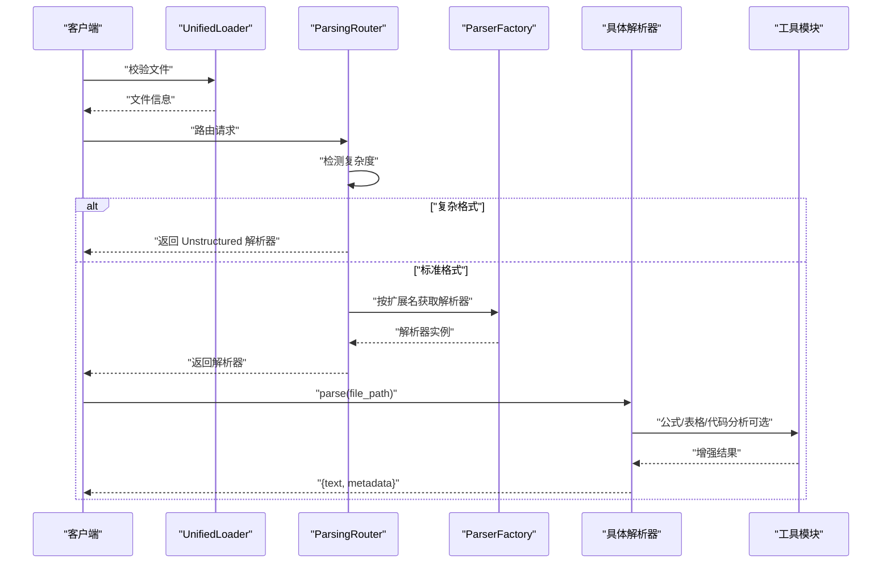
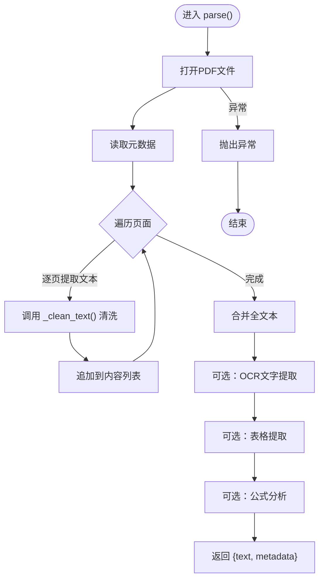
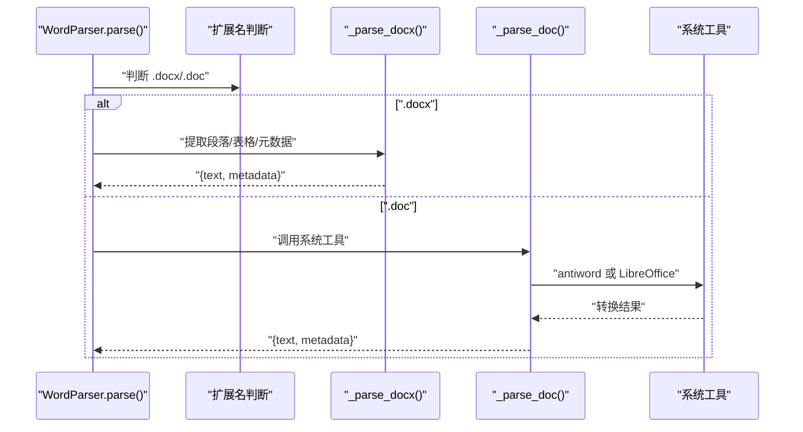
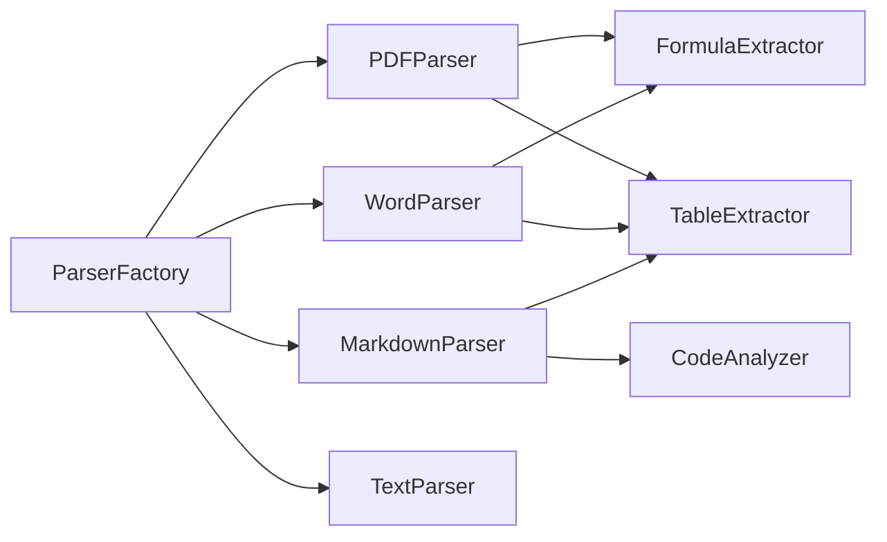

# 文档解析器扩展

<cite>
**本文引用的文件**
- [base.py](file://parsers/base.py)
- [parser_factory.py](file://parsers/parser_factory.py)
- [pdf_parser.py](file://parsers/pdf_parser.py)
- [word_parser.py](file://parsers/word_parser.py)
- [markdown_parser.py](file://parsers/markdown_parser.py)
- [text_parser.py](file://parsers/text_parser.py)
- [parsing_router.py](file://parsers/router/parsing_router.py)
- [unified_loader.py](file://parsers/utils/unified_loader.py)
- [formula_extractor.py](file://utils/formula_extractor.py)
- [table_extractor.py](file://utils/table_extractor.py)
- [code_analyzer.py](file://utils/code_analyzer.py)
- [__init__.py](file://parsers/__init__.py)
- [README.md](file://README.md)
</cite>

## 目录
1. [简介](#简介)
2. [项目结构](#项目结构)
3. [核心组件](#核心组件)
4. [架构总览](#架构总览)
5. [详细组件分析](#详细组件分析)
6. [依赖分析](#依赖分析)
7. [性能考虑](#性能考虑)
8. [故障排查指南](#故障排查指南)
9. [结论](#结论)
10. [附录](#附录)

## 简介
本指南面向希望扩展“文档解析器”的开发者，围绕以下目标展开：
- 深入理解 BaseParser 抽象基类的设计与接口规范，明确 can_parse()、parse()、supported_extensions() 的职责与实现要求。
- 解释 ParserFactory 工厂模式的扩展机制，掌握通过 register_parser() 注册自定义解析器的方法。
- 提供新增文档格式支持的完整开发流程，从文件类型检测到内容提取的实现细节。
- 总结解析器性能优化技巧、内存管理与错误处理策略。
- 以 PDF、Word、Markdown 等现有解析器为例，说明如何处理复杂文档结构与元数据提取。

## 项目结构
解析器子系统位于 parsers/ 目录，包含基础抽象、具体解析器、工厂、路由器与工具模块。核心文件如下：
- 抽象基类与工厂：parsers/base.py、parsers/parser_factory.py
- 具体解析器：parsers/pdf_parser.py、parsers/word_parser.py、parsers/markdown_parser.py、parsers/text_parser.py
- 路由与加载：parsers/router/parsing_router.py、parsers/utils/unified_loader.py
- 工具模块：utils/formula_extractor.py、utils/table_extractor.py、utils/code_analyzer.py
- 模块导出：parsers/__init__.py

图表来源
- [base.py:6-32](file://parsers/base.py#L6-L32)
- [parser_factory.py:10-41](file://parsers/parser_factory.py#L10-L41)
- [pdf_parser.py:12-208](file://parsers/pdf_parser.py#L12-L208)
- [word_parser.py:18-353](file://parsers/word_parser.py#L18-L353)
- [markdown_parser.py:11-97](file://parsers/markdown_parser.py#L11-L97)
- [text_parser.py:7-36](file://parsers/text_parser.py#L7-L36)
- [parsing_router.py:10-246](file://parsers/router/parsing_router.py#L10-L246)
- [unified_loader.py:7-60](file://parsers/utils/unified_loader.py#L7-L60)
- [formula_extractor.py:6-149](file://utils/formula_extractor.py#L6-L149)
- [table_extractor.py:7-290](file://utils/table_extractor.py#L7-L290)
- [code_analyzer.py:7-350](file://utils/code_analyzer.py#L7-L350)

章节来源
- [README.md:46-54](file://README.md#L46-L54)
- [__init__.py:1-38](file://parsers/__init__.py#L1-L38)

## 核心组件
- BaseParser 抽象基类：定义统一接口，约束派生类必须实现 parse() 与 supported_extensions()；提供默认的 can_parse() 实现（基于扩展名匹配）。
- ParserFactory 工厂：集中管理解析器实例，提供 get_parser() 按文件路径选择合适解析器，以及 register_parser() 注册新解析器。
- 具体解析器：PDFParser、WordParser、MarkdownParser、TextParser 分别针对不同格式实现 parse() 与 supported_extensions()，并可调用工具模块进行增强处理（公式、表格、代码等）。
- ParsingRouter 路由器：根据文档特征（扫描版PDF、大文件、复杂表格/图片/公式等）智能选择使用原有解析器还是 Unstructured 解析器。
- 工具模块：FormulaExtractor、TableExtractor、CodeAnalyzer 提供公式提取与规范化、表格识别与格式化、代码块分析等能力。

章节来源
- [base.py:6-32](file://parsers/base.py#L6-L32)
- [parser_factory.py:10-41](file://parsers/parser_factory.py#L10-L41)
- [pdf_parser.py:12-208](file://parsers/pdf_parser.py#L12-L208)
- [word_parser.py:18-353](file://parsers/word_parser.py#L18-L353)
- [markdown_parser.py:11-97](file://parsers/markdown_parser.py#L11-L97)
- [text_parser.py:7-36](file://parsers/text_parser.py#L7-L36)
- [parsing_router.py:10-246](file://parsers/router/parsing_router.py#L10-L246)
- [formula_extractor.py:6-149](file://utils/formula_extractor.py#L6-L149)
- [table_extractor.py:7-290](file://utils/table_extractor.py#L7-L290)
- [code_analyzer.py:7-350](file://utils/code_analyzer.py#L7-L350)

## 架构总览
解析流程概览：客户端上传文件 → UnifiedLoader 校验 → ParsingRouter 判定复杂度 → 选择解析器（ParserFactory）→ 具体解析器执行 parse() 并返回文本与元数据 → 可选工具模块增强（公式、表格、代码）→ 上游服务进行分块与入库。

图表来源
- [unified_loader.py:14-60](file://parsers/utils/unified_loader.py#L14-L60)
- [parsing_router.py:209-246](file://parsers/router/parsing_router.py#L209-L246)
- [parser_factory.py:20-41](file://parsers/parser_factory.py#L20-L41)
- [pdf_parser.py:103-208](file://parsers/pdf_parser.py#L103-L208)
- [word_parser.py:131-353](file://parsers/word_parser.py#L131-L353)
- [markdown_parser.py:14-97](file://parsers/markdown_parser.py#L14-L97)

## 详细组件分析

### BaseParser 抽象基类设计与接口规范
- 设计要点
  - 抽象方法：parse(file_path) 返回包含文本与元数据的字典；supported_extensions() 返回该解析器支持的扩展名列表。
  - 默认实现：can_parse(file_path) 基于扩展名判断，便于工厂与路由器快速筛选。
- 实现要求
  - parse() 必须保证健壮性：对异常进行捕获并抛出清晰的错误信息；对文本进行清洗与编码处理，避免乱码与控制字符污染。
  - supported_extensions() 返回的扩展名应与实际解析能力一致，避免误判。
  - 可选覆盖 can_parse() 以支持更复杂的判定逻辑（例如内容签名、魔数检测）。

章节来源
- [base.py:6-32](file://parsers/base.py#L6-L32)

### ParserFactory 工厂模式扩展机制
- 核心能力
  - get_parser(file_path)：遍历已注册解析器，调用其 can_parse() 选择第一个匹配者。
  - register_parser(parser)：动态追加自定义解析器实例，实现“开闭原则”。
- 扩展步骤
  - 新建类继承 BaseParser，实现 parse() 与 supported_extensions()。
  - 调用 ParserFactory.register_parser(YourParser()) 注册。
  - 确保 supported_extensions() 返回新格式的扩展名，以便 get_parser() 正确识别。
- 注意事项
  - 解析器实例需无状态或内部自行管理状态，避免并发问题。
  - 若存在优先级需求，可在工厂内部调整 _parsers 列表顺序或增加策略逻辑。

章节来源
- [parser_factory.py:10-41](file://parsers/parser_factory.py#L10-L41)

### PDF 解析器（PDFParser）
- 能力概述
  - 文本版PDF：使用 PyPDF2 提取文本与元数据，支持逐页清洗与合并。
  - 增强能力：图片OCR文字提取、表格识别、公式分析。
  - 文本清洗：统一换行、移除控制字符、保护公式标记、规范化空白。
- 关键实现点
  - parse()：打开文件、读取元数据、遍历页面提取文本、调用 _clean_text() 清洗、合并全文；对异常进行捕获并抛出统一错误。
  - _clean_text()：多编码解码尝试、公式保护、空白规范化、控制字符过滤。
  - 元数据：标题、作者、主题、页数、提取方法、页面明细、OCR统计、表格与公式统计。
- 复杂度与性能
  - 页面循环与文本拼接为 O(n)；OCR与表格/公式分析为额外开销，建议按需启用或异步处理。
- 错误处理
  - 对 PyPDF2 读取失败、页面提取异常、工具模块调用异常分别记录警告并继续流程，最终统一抛出异常。

图表来源
- [pdf_parser.py:103-208](file://parsers/pdf_parser.py#L103-L208)
- [pdf_parser.py:19-102](file://parsers/pdf_parser.py#L19-L102)

章节来源
- [pdf_parser.py:12-208](file://parsers/pdf_parser.py#L12-L208)

### Word 解析器（WordParser）
- 能力概述
  - 支持 .docx 与 .doc 两种格式。
  - .docx：使用 python-docx 提取段落、表格、元数据；可选提取嵌入图片关系；支持公式分析。
  - .doc：尝试 antiword 或 LibreOffice 转换；失败则抛出引导性异常。
  - 文本清洗：移除嵌入对象标记、控制字符、二进制残留；保留公式标记。
- 关键实现点
  - parse()：根据扩展名分派至 _parse_docx 或 _parse_doc。
  - _parse_docx()：段落清洗与合并、元数据提取、表格转 HTML/Markdown/语义结构、图片关系收集、公式分析。
  - _parse_doc()：系统工具调用与超时控制、临时文件处理、编码修复。
- 复杂度与性能
  - .docx：段落与表格遍历为 O(n)；表格格式化与语义分析为额外开销。
  - .doc：外部工具调用为阻塞操作，建议设置合理超时。
- 错误处理
  - python-docx 缺失时抛出 ImportError；系统工具不可用时抛出引导性异常；其余异常统一包装。

图表来源
- [word_parser.py:131-353](file://parsers/word_parser.py#L131-L353)

章节来源
- [word_parser.py:18-353](file://parsers/word_parser.py#L18-L353)

### Markdown 解析器（MarkdownParser）
- 能力概述
  - 使用 markdown 库渲染为 HTML，再去除标签得到纯文本。
  - 增强能力：表格提取、代码块分析、公式分析。
- 关键实现点
  - parse()：读取原始 Markdown、渲染 HTML、正则去标签、统计章节数量；调用工具模块提取表格、分析代码块、提取公式。
  - 元数据：格式标识、章节数量、表格/代码块/公式信息。
- 复杂度与性能
  - 渲染与正则处理为线性开销；表格/代码/公式分析为额外开销，建议批量处理或缓存结果。

章节来源
- [markdown_parser.py:11-97](file://parsers/markdown_parser.py#L11-L97)

### Text 解析器（TextParser）
- 能力概述
  - 使用 chardet 检测编码，读取文本并返回编码与行数等元数据。
- 关键实现点
  - parse()：二进制读取 + 编码检测 + 文本读取 + 元数据封装。
- 复杂度与性能
  - 线性时间与常数空间；编码检测一次即可。

章节来源
- [text_parser.py:7-36](file://parsers/text_parser.py#L7-L36)

### ParsingRouter 路由器
- 能力概述
  - 根据文档特征（扫描版PDF、大文件、复杂表格/图片/公式等）决定使用原有解析器还是 Unstructured 解析器。
- 关键实现点
  - _detect_scanned_pdf()：基于前几页文本长度阈值判断。
  - _detect_complex_format()：综合文件大小、表格数量、图片数量、段落数量、无文本PDF等特征。
  - _should_use_legacy_parser()：简单格式直接走原有解析器。
  - route()：统一入口，返回解析器类型与实例。
- 复杂度与性能
  - 路由决策为常数级；对 PDF/Word 的特征检测为 O(k)（k 为检查页数/段落数）。

章节来源
- [parsing_router.py:10-246](file://parsers/router/parsing_router.py#L10-L246)

### 工具模块
- FormulaExtractor：提取 LaTeX 公式、规范化格式、保护公式在清洗过程中的完整性。
- TableExtractor：识别 Markdown/管道分隔表格、转 HTML/Markdown、提取语义结构（行列数、表头、数据类型）。
- CodeAnalyzer：检测语言、提取函数/类/导入、变量与关键字、估算复杂度。

章节来源
- [formula_extractor.py:6-149](file://utils/formula_extractor.py#L6-L149)
- [table_extractor.py:7-290](file://utils/table_extractor.py#L7-L290)
- [code_analyzer.py:7-350](file://utils/code_analyzer.py#L7-L350)

## 依赖分析
- 组件耦合
  - 具体解析器依赖 BaseParser 接口，遵循统一规范。
  - ParserFactory 依赖具体解析器实例，通过扩展名匹配实现解耦。
  - ParsingRouter 依赖 ParserFactory 与 UnifiedLoader，负责上层调度。
  - 工具模块被解析器调用，形成“解析器-工具”弱耦合。
- 外部依赖
  - PDF：PyPDF2（文本提取）、PaddleOCR（图片OCR，解析器中条件导入）。
  - Word：python-docx（.docx）、antiword/LibreOffice（.doc）。
  - Markdown：markdown 库。
  - 编码检测：chardet。
- 循环依赖
  - 当前模块间无循环导入；工具模块独立于解析器，避免循环。

图表来源
- [parser_factory.py:10-41](file://parsers/parser_factory.py#L10-L41)
- [pdf_parser.py:12-208](file://parsers/pdf_parser.py#L12-L208)
- [word_parser.py:18-353](file://parsers/word_parser.py#L18-L353)
- [markdown_parser.py:11-97](file://parsers/markdown_parser.py#L11-L97)
- [formula_extractor.py:6-149](file://utils/formula_extractor.py#L6-L149)
- [table_extractor.py:7-290](file://utils/table_extractor.py#L7-L290)
- [code_analyzer.py:7-350](file://utils/code_analyzer.py#L7-L350)

章节来源
- [README.md:36-44](file://README.md#L36-L44)

## 性能考虑
- I/O 与内存
  - 大文件（>2MB）建议使用 Unstructured 或分块读取，避免一次性加载到内存。
  - PDF/Word 解析时尽量按页/段落迭代，避免长字符串拼接导致内存峰值过高。
- 编码与清洗
  - 先进行编码检测，再按编码读取，减少二次解码成本。
  - 文本清洗采用分段处理与正则预分割，避免重复扫描。
- 外部工具
  - .doc 转换使用超时控制与临时目录，避免阻塞与磁盘占用。
  - OCR/表格/公式分析建议异步执行或延迟触发，降低主流程耗时。
- 并发与缓存
  - 解析器实例应无共享状态，便于并发复用。
  - 对相同内容的公式/表格/代码分析结果可做缓存，减少重复计算。

## 故障排查指南
- 常见问题
  - “无法解析.doc文件”：确认已安装 antiword 或 LibreOffice，并在 PATH 中可用。
  - “PDF未提取到文本”：可能是扫描版PDF，建议启用OCR或使用 Unstructured。
  - “中文乱码”：检查 chardet 检测结果与编码解码策略，必要时手动指定编码。
  - “表格/公式分析失败”：查看工具模块日志，确认输入文本格式与正则匹配。
- 定位方法
  - 在解析器中增加日志记录，标注关键步骤（打开文件、提取文本、调用工具）。
  - 使用 ParsingRouter 的日志输出，确认路由决策依据。
  - 对异常进行 try-except 包装，统一抛出带上下文的异常信息。

章节来源
- [word_parser.py:248-353](file://parsers/word_parser.py#L248-L353)
- [pdf_parser.py:103-208](file://parsers/pdf_parser.py#L103-L208)
- [parsing_router.py:32-178](file://parsers/router/parsing_router.py#L32-L178)

## 结论
通过抽象基类与工厂模式，系统实现了对多格式文档的统一接入与灵活扩展。结合 ParsingRouter 的智能路由与工具模块的增强能力，解析器能够兼顾性能与准确性。开发者只需遵循 BaseParser 接口规范，即可快速实现新格式解析器，并通过 ParserFactory 注册与路由策略无缝融入整体流程。

## 附录
- 新增解析器开发流程（以 PDF 为例）
  1) 新建类继承 BaseParser，实现 parse() 与 supported_extensions()。
  2) 在 parse() 中完成文件读取、内容提取与元数据封装。
  3) 可选调用 FormulaExtractor、TableExtractor、CodeAnalyzer 等工具模块增强。
  4) 在 ParserFactory 中注册实例，或通过 register_parser() 动态注册。
  5) 在 ParsingRouter 中完善复杂格式检测逻辑，确保路由到正确解析器。
  6) 编写单元测试，覆盖异常场景与边界条件。
- 示例参考
  - PDF：[pdf_parser.py:12-208](file://parsers/pdf_parser.py#L12-L208)
  - Word：[word_parser.py:18-353](file://parsers/word_parser.py#L18-L353)
  - Markdown：[markdown_parser.py:11-97](file://parsers/markdown_parser.py#L11-L97)
  - Text：[text_parser.py:7-36](file://parsers/text_parser.py#L7-L36)
  - 工具模块：[formula_extractor.py:6-149](file://utils/formula_extractor.py#L6-L149)、[table_extractor.py:7-290](file://utils/table_extractor.py#L7-L290)、[code_analyzer.py:7-350](file://utils/code_analyzer.py#L7-L350)