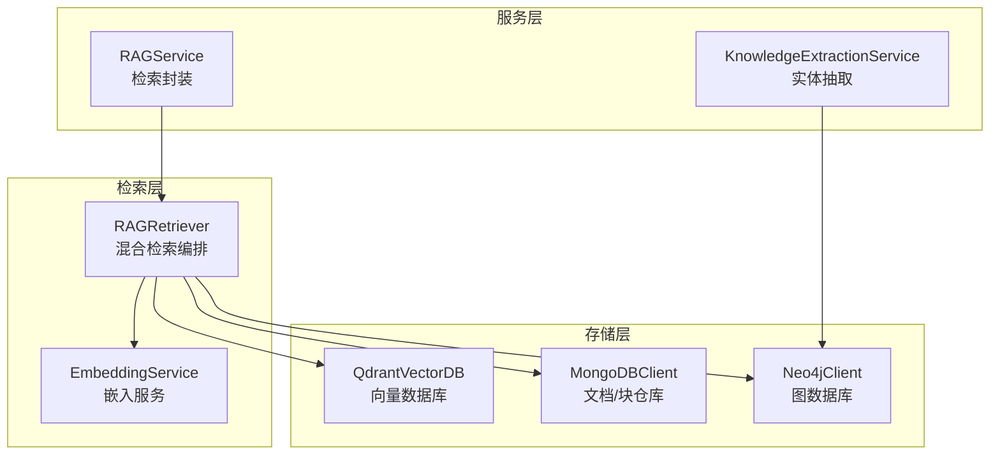
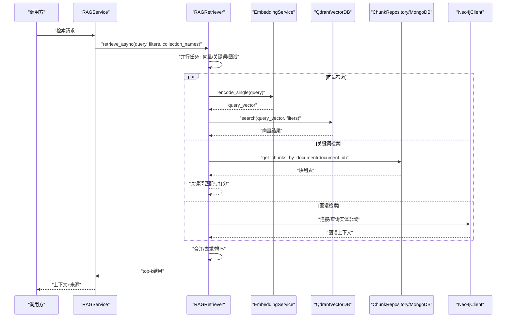
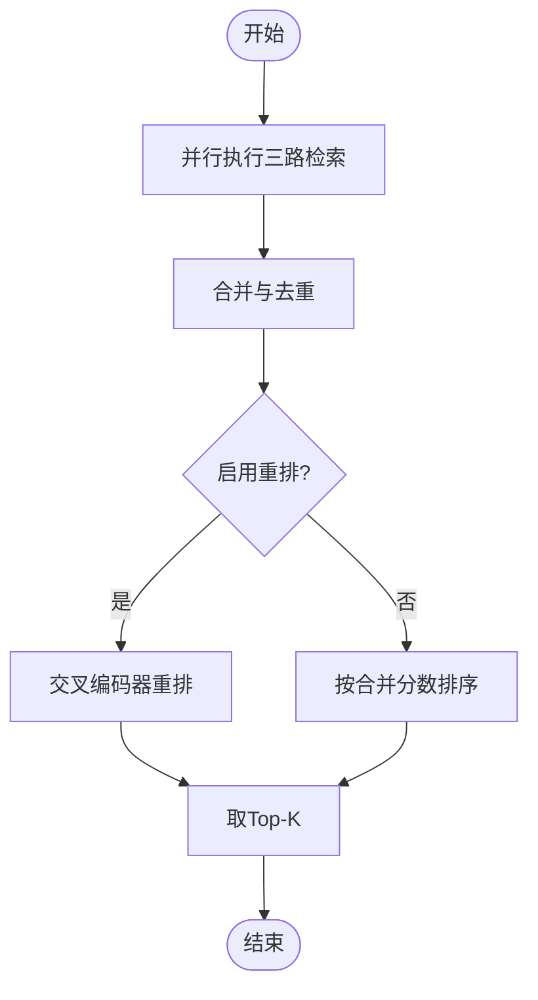
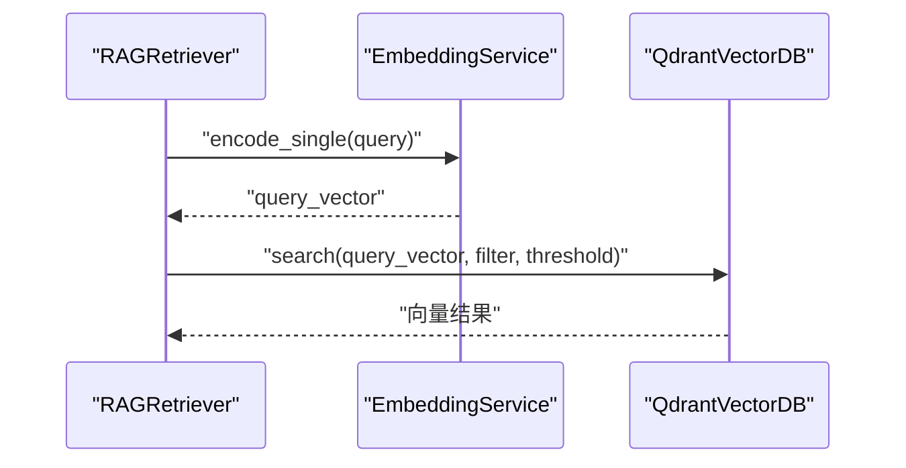
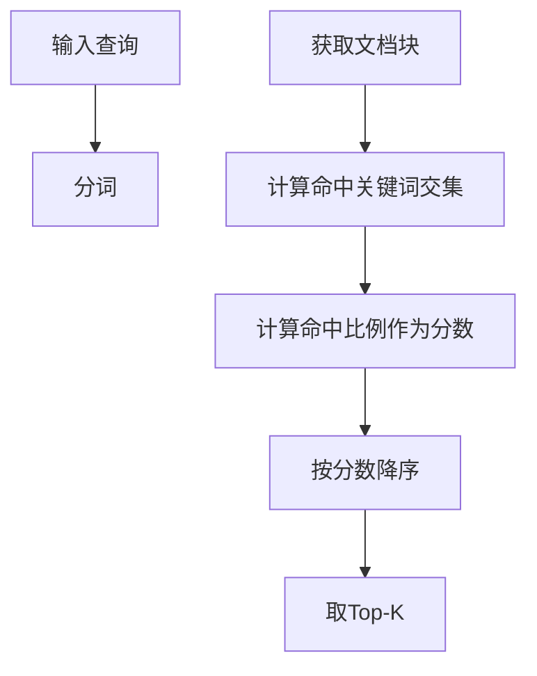
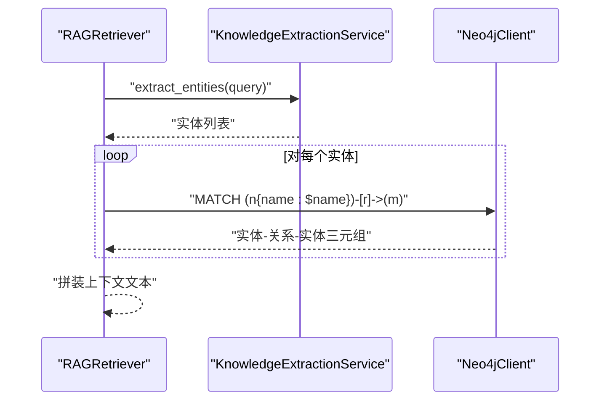
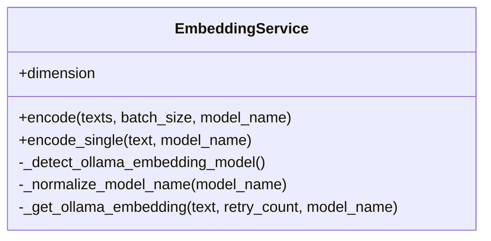
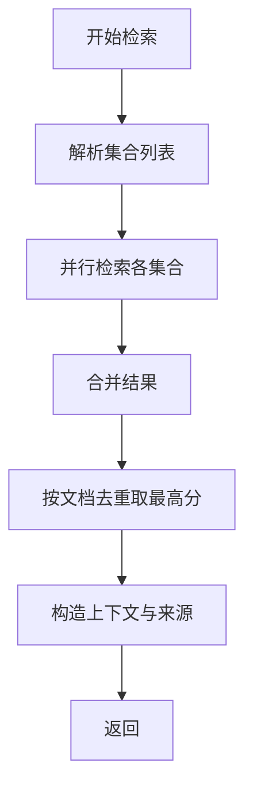
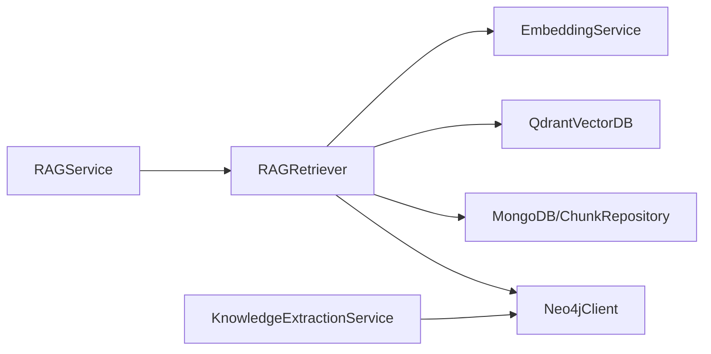

# 检索算法扩展

<cite>
**本文引用的文件**
- [rag_retriever.py](file://retrieval/rag_retriever.py)
- [embedding_service.py](file://embedding/embedding_service.py)
- [rag_service.py](file://services/rag_service.py)
- [qdrant_client.py](file://database/qdrant_client.py)
- [mongodb.py](file://database/mongodb.py)
- [neo4j_client.py](file://database/neo4j_client.py)
- [knowledge_extraction_service.py](file://services/knowledge_extraction_service.py)
- [logger.py](file://utils/logger.py)
- [documents.py](file://routers/documents.py)
</cite>

## 目录
1. [简介](#简介)
2. [项目结构](#项目结构)
3. [核心组件](#核心组件)
4. [架构总览](#架构总览)
5. [详细组件分析](#详细组件分析)
6. [依赖分析](#依赖分析)
7. [性能考虑](#性能考虑)
8. [故障排查指南](#故障排查指南)
9. [结论](#结论)
10. [附录](#附录)

## 简介
本指南面向希望扩展高级检索能力的研发人员，围绕混合检索（向量检索、关键词检索、图谱检索）与嵌入服务扩展展开，系统讲解：
- RAG检索器的架构设计与扩展接口
- 向量检索、关键词检索、图谱检索的实现方法
- EmbeddingService的扩展机制（如何集成新嵌入模型与向量化算法）
- 自定义检索算法的开发流程（从相似度计算到结果排序）
- 性能优化策略、缓存机制与并发处理要点
- 面向大规模向量数据与实时检索需求的工程实践

## 项目结构
本项目采用按职责分层的组织方式：
- retrieval：检索主流程与混合检索编排
- embedding：嵌入服务抽象与Ollama集成
- database：向量数据库（Qdrant）、文档数据库（MongoDB）、图数据库（Neo4j）客户端
- services：RAG服务封装、知识抽取服务
- routers：文档处理流水线（分块、向量化、入库）
- utils：日志等基础设施

**图表来源**
- [rag_retriever.py:22-101](file://retrieval/rag_retriever.py#L22-L101)
- [embedding_service.py:8-44](file://embedding/embedding_service.py#L8-L44)
- [qdrant_client.py:18-96](file://database/qdrant_client.py#L18-L96)
- [mongodb.py:209-313](file://database/mongodb.py#L209-L313)
- [neo4j_client.py:6-39](file://database/neo4j_client.py#L6-L39)
- [rag_service.py:7-33](file://services/rag_service.py#L7-L33)
- [knowledge_extraction_service.py:10-31](file://services/knowledge_extraction_service.py#L10-L31)

**章节来源**
- [rag_retriever.py:22-101](file://retrieval/rag_retriever.py#L22-L101)
- [embedding_service.py:8-44](file://embedding/embedding_service.py#L8-L44)
- [qdrant_client.py:18-96](file://database/qdrant_client.py#L18-L96)
- [mongodb.py:209-313](file://database/mongodb.py#L209-L313)
- [neo4j_client.py:6-39](file://database/neo4j_client.py#L6-L39)
- [rag_service.py:7-33](file://services/rag_service.py#L7-L33)
- [knowledge_extraction_service.py:10-31](file://services/knowledge_extraction_service.py#L10-L31)

## 核心组件
- RAGRetriever：混合检索编排器，负责并行执行向量检索、关键词检索、图谱检索，并进行结果合并与重排。
- EmbeddingService：统一的嵌入服务抽象，当前基于Ollama实现，支持模型名称规范化、自动检测、重试与超时控制。
- QdrantVectorDB：向量数据库客户端，封装集合管理、批量插入、相似度搜索与健康检查。
- MongoDBClient/ChunkRepository：文档与块的持久化，支撑关键词检索与元数据管理。
- Neo4jClient/KnowledgeExtractionService：图谱连接与实体抽取，支撑图谱检索。
- RAGService：对外检索封装，协调多集合检索与结果聚合。

**章节来源**
- [rag_retriever.py:22-101](file://retrieval/rag_retriever.py#L22-L101)
- [embedding_service.py:8-44](file://embedding/embedding_service.py#L8-L44)
- [qdrant_client.py:18-96](file://database/qdrant_client.py#L18-L96)
- [mongodb.py:770-802](file://database/mongodb.py#L770-L802)
- [neo4j_client.py:6-39](file://database/neo4j_client.py#L6-L39)
- [knowledge_extraction_service.py:10-31](file://services/knowledge_extraction_service.py#L10-L31)
- [rag_service.py:7-33](file://services/rag_service.py#L7-L33)

## 架构总览
混合检索的整体流程如下：
- 并行策略：向量检索、关键词检索、图谱检索三路并行执行，提升响应速度。
- 结果合并：以chunk_id为键去重合并，向量结果作为基础分，关键词结果进行分数增强，图谱结果作为补充上下文。
- 可选重排：可选启用交叉编码器重排，进一步提升排序质量。
- 多集合检索：支持按知识空间/助手划分的多集合检索，统一聚合。

**图表来源**
- [rag_service.py:68-83](file://services/rag_service.py#L68-L83)
- [rag_retriever.py:69-101](file://retrieval/rag_retriever.py#L69-L101)
- [embedding_service.py:261-263](file://embedding/embedding_service.py#L261-L263)
- [qdrant_client.py:336-413](file://database/qdrant_client.py#L336-L413)
- [mongodb.py:799-802](file://database/mongodb.py#L799-L802)
- [neo4j_client.py:40-62](file://database/neo4j_client.py#L40-L62)

**章节来源**
- [rag_service.py:68-83](file://services/rag_service.py#L68-L83)
- [rag_retriever.py:69-101](file://retrieval/rag_retriever.py#L69-L101)

## 详细组件分析

### RAGRetriever：混合检索编排
- 并行检索：通过异步gather并行执行向量、关键词、图谱三路检索，显著降低端到端延迟。
- 结果合并策略：
  - 向量结果作为基础分，关键词命中则对同一chunk进行分数增强，形成“向量+关键词”的混合分。
  - 图谱结果作为独立上下文加入，不参与chunk级去重，但保留其检索类型标记。
- 重排：可选启用交叉编码器重排，对query与候选文本对进行打分并重排。
- 降级兼容：在已有事件循环中调用同步retrieve时，自动降级为基础检索（向量+关键词）。

**图表来源**
- [rag_retriever.py:69-101](file://retrieval/rag_retriever.py#L69-L101)
- [rag_retriever.py:262-297](file://retrieval/rag_retriever.py#L262-L297)
- [rag_retriever.py:299-323](file://retrieval/rag_retriever.py#L299-L323)

**章节来源**
- [rag_retriever.py:69-101](file://retrieval/rag_retriever.py#L69-L101)
- [rag_retriever.py:262-297](file://retrieval/rag_retriever.py#L262-L297)
- [rag_retriever.py:299-323](file://retrieval/rag_retriever.py#L299-L323)

### 向量检索：Qdrant集成
- 查询向量生成：通过EmbeddingService.encode_single获取query向量。
- 过滤与阈值：支持按document_id过滤与分数阈值筛选，减少无关结果。
- 集合管理：自动检测集合维度并按需重建，保证向量维度一致。
- 健康检查：当集合不存在时自动创建，避免检索失败。

**图表来源**
- [rag_retriever.py:110-138](file://retrieval/rag_retriever.py#L110-L138)
- [embedding_service.py:261-263](file://embedding/embedding_service.py#L261-L263)
- [qdrant_client.py:336-413](file://database/qdrant_client.py#L336-L413)

**章节来源**
- [rag_retriever.py:110-138](file://retrieval/rag_retriever.py#L110-L138)
- [qdrant_client.py:336-413](file://database/qdrant_client.py#L336-L413)

### 关键词检索：基于MongoDB块
- 适用场景：限定在特定文档内的关键词匹配，避免全局扫描带来的性能问题。
- 匹配策略：对查询词与块文本进行分词交集计算，得到关键词命中比例作为分数。
- 排序与截断：按分数降序，取Top-K。

**图表来源**
- [rag_retriever.py:140-174](file://retrieval/rag_retriever.py#L140-L174)
- [mongodb.py:799-802](file://database/mongodb.py#L799-L802)

**章节来源**
- [rag_retriever.py:140-174](file://retrieval/rag_retriever.py#L140-L174)
- [mongodb.py:799-802](file://database/mongodb.py#L799-L802)

### 图谱检索：Neo4j实体邻域
- 实体抽取：使用LLM抽取查询中的关键实体，作为图谱检索入口。
- 邻域查询：针对每个实体查询一跳邻居，拼装成结构化上下文文本。
- 过滤与去重：支持按document_id过滤，避免跨文档噪声；对同一实体的多次结果进行合并。

**图表来源**
- [rag_retriever.py:176-260](file://retrieval/rag_retriever.py#L176-L260)
- [knowledge_extraction_service.py:104-142](file://services/knowledge_extraction_service.py#L104-L142)
- [neo4j_client.py:40-62](file://database/neo4j_client.py#L40-L62)

**章节来源**
- [rag_retriever.py:176-260](file://retrieval/rag_retriever.py#L176-L260)
- [knowledge_extraction_service.py:104-142](file://services/knowledge_extraction_service.py#L104-L142)
- [neo4j_client.py:40-62](file://database/neo4j_client.py#L40-L62)

### EmbeddingService：嵌入服务扩展
- 模型发现与规范化：支持自动检测可用的嵌入模型，处理带/不带标签的模型名称。
- Ollama集成：通过HTTP API获取嵌入向量，内置超时与重试机制，避免单次请求失败影响整体流程。
- 维度探测：首次调用时探测向量维度，用于后续Qdrant集合创建与校验。
- 扩展点：可通过替换底层实现（如本地HuggingFace、远程API）来接入新的嵌入模型或算法。

**图表来源**
- [embedding_service.py:8-44](file://embedding/embedding_service.py#L8-L44)
- [embedding_service.py:107-154](file://embedding/embedding_service.py#L107-L154)
- [embedding_service.py:175-228](file://embedding/embedding_service.py#L175-L228)
- [embedding_service.py:230-263](file://embedding/embedding_service.py#L230-L263)

**章节来源**
- [embedding_service.py:8-44](file://embedding/embedding_service.py#L8-L44)
- [embedding_service.py:107-154](file://embedding/embedding_service.py#L107-L154)
- [embedding_service.py:175-228](file://embedding/embedding_service.py#L175-L228)
- [embedding_service.py:230-263](file://embedding/embedding_service.py#L230-L263)

### RAGService：检索封装与聚合
- 多集合检索：支持按知识空间/助手选择集合，对多个集合并行检索并合并。
- 结果聚合：按文档维度去重，保留最高分块；构造来源清单与上下文文本。
- 回退策略：检索失败时可选择回退到不使用上下文继续处理。

**图表来源**
- [rag_service.py:34-83](file://services/rag_service.py#L34-L83)
- [rag_service.py:85-191](file://services/rag_service.py#L85-L191)

**章节来源**
- [rag_service.py:34-83](file://services/rag_service.py#L34-L83)
- [rag_service.py:85-191](file://services/rag_service.py#L85-L191)

## 依赖分析
- 组件耦合：
  - RAGRetriever依赖EmbeddingService（向量）、QdrantVectorDB（向量检索）、ChunkRepository/MongoDB（关键词）、Neo4jClient（图谱）。
  - RAGService依赖RAGRetriever与MongoDB（文档信息）。
- 外部依赖：
  - Qdrant（向量检索）、MongoDB（块与文档）、Neo4j（图谱）、Ollama（嵌入与知识抽取）。
- 潜在环依赖：当前模块间为单向依赖，未见明显环。

**图表来源**
- [rag_retriever.py:5-8](file://retrieval/rag_retriever.py#L5-L8)
- [rag_service.py:68-75](file://services/rag_service.py#L68-L75)
- [knowledge_extraction_service.py:6-7](file://services/knowledge_extraction_service.py#L6-L7)

**章节来源**
- [rag_retriever.py:5-8](file://retrieval/rag_retriever.py#L5-L8)
- [rag_service.py:68-75](file://services/rag_service.py#L68-L75)
- [knowledge_extraction_service.py:6-7](file://services/knowledge_extraction_service.py#L6-L7)

## 性能考虑
- 并发与并行
  - 检索阶段：三路检索并行执行，显著降低P95/P99延迟。
  - 文档处理：向量化与批量入库均采用分批策略，避免一次性内存压力过大。
- 缓存与预热
  - 嵌入服务：通过dimension探测与模型规范化减少重复请求与错误重试。
  - Qdrant：集合维度一致性保障，避免因维度不匹配导致的反复重建。
- I/O与网络
  - 日志采用异步写入队列，避免阻塞主线程。
  - Qdrant使用gRPC优先连接，提高稳定性与吞吐。
- 降级与弹性
  - 检索失败时可回退到不使用上下文继续处理。
  - Qdrant不可用时跳过向量存储，仅落盘MongoDB，保证流程可用。

**章节来源**
- [rag_retriever.py:69-101](file://retrieval/rag_retriever.py#L69-L101)
- [documents.py:466-493](file://routers/documents.py#L466-L493)
- [documents.py:589-659](file://routers/documents.py#L589-L659)
- [logger.py:15-82](file://utils/logger.py#L15-L82)
- [qdrant_client.py:66-91](file://database/qdrant_client.py#L66-L91)
- [rag_service.py:219-236](file://services/rag_service.py#L219-L236)

## 故障排查指南
- 向量检索失败
  - 检查Qdrant健康状态与集合维度；确认查询向量维度与集合一致。
  - 关注重试与指数退避策略，避免瞬时错误放大。
- 关键词检索缓慢
  - 仅在限定document_id时执行，避免全局扫描。
  - 确认MongoDB索引与查询条件合理。
- 图谱检索失败
  - 检查Neo4j连接参数与驱动状态；确认Cypher查询语法与返回结构。
  - 实体抽取失败时，检查Ollama服务可用性与模型格式。
- 嵌入服务异常
  - 检查Ollama地址与模型名称规范化；关注超时与重试配置。
- 日志与可观测性
  - 使用异步日志避免阻塞；生产环境可调整日志级别以减少IO开销。

**章节来源**
- [qdrant_client.py:124-138](file://database/qdrant_client.py#L124-L138)
- [qdrant_client.py:396-413](file://database/qdrant_client.py#L396-L413)
- [neo4j_client.py:16-32](file://database/neo4j_client.py#L16-L32)
- [knowledge_extraction_service.py:121-142](file://services/knowledge_extraction_service.py#L121-L142)
- [embedding_service.py:175-228](file://embedding/embedding_service.py#L175-L228)
- [logger.py:77-82](file://utils/logger.py#L77-L82)

## 结论
本项目提供了可扩展的混合检索框架：以RAGRetriever为核心，结合向量、关键词与图谱三路检索，辅以嵌入服务与数据库客户端的工程化实现。通过并行检索、结果合并与可选重排，既满足准确性也兼顾实时性。扩展新检索算法时，建议遵循统一的数据结构与评分规范，确保与现有合并与排序流程无缝衔接。

## 附录

### 自定义检索算法开发流程（从相似度计算到结果排序）
- 定义接口与数据结构
  - 输入：查询文本、可选过滤条件（如document_id）
  - 输出：包含id、score、payload（含文本、元数据、检索类型）的结果列表
- 相似度计算
  - 向量相似度：余弦/内积，结合Qdrant搜索参数（阈值、过滤）
  - 关键词相似度：命中比例/TF-IDF权重，结合块文本
  - 图谱相似度：基于实体关系路径的上下文得分
- 结果合并与排序
  - 以chunk_id为键合并，向量基础分+关键词增强分，图谱作为补充上下文
  - 可选交叉编码器重排，最终取Top-K
- 集成与测试
  - 在RAGRetriever中注册新检索方法，确保与现有并行与合并逻辑兼容
  - 编写单元测试与端到端测试，覆盖边界条件与性能指标

**章节来源**
- [rag_retriever.py:69-101](file://retrieval/rag_retriever.py#L69-L101)
- [rag_retriever.py:262-297](file://retrieval/rag_retriever.py#L262-L297)
- [rag_retriever.py:299-323](file://retrieval/rag_retriever.py#L299-L323)

### 大规模向量数据与实时检索要点
- 分批向量化与入库：文档处理流水线采用分批策略，平衡内存与吞吐。
- 集群与连接优化：Qdrant优先gRPC连接，启用连接复用与健康检查。
- 降级策略：当向量服务不可用时，仅落盘MongoDB，保证检索可用性。
- 并发控制：异步检索与异步日志写入，避免阻塞主流程。

**章节来源**
- [documents.py:466-493](file://routers/documents.py#L466-L493)
- [documents.py:589-659](file://routers/documents.py#L589-L659)
- [qdrant_client.py:66-91](file://database/qdrant_client.py#L66-L91)
- [logger.py:56-66](file://utils/logger.py#L56-L66)