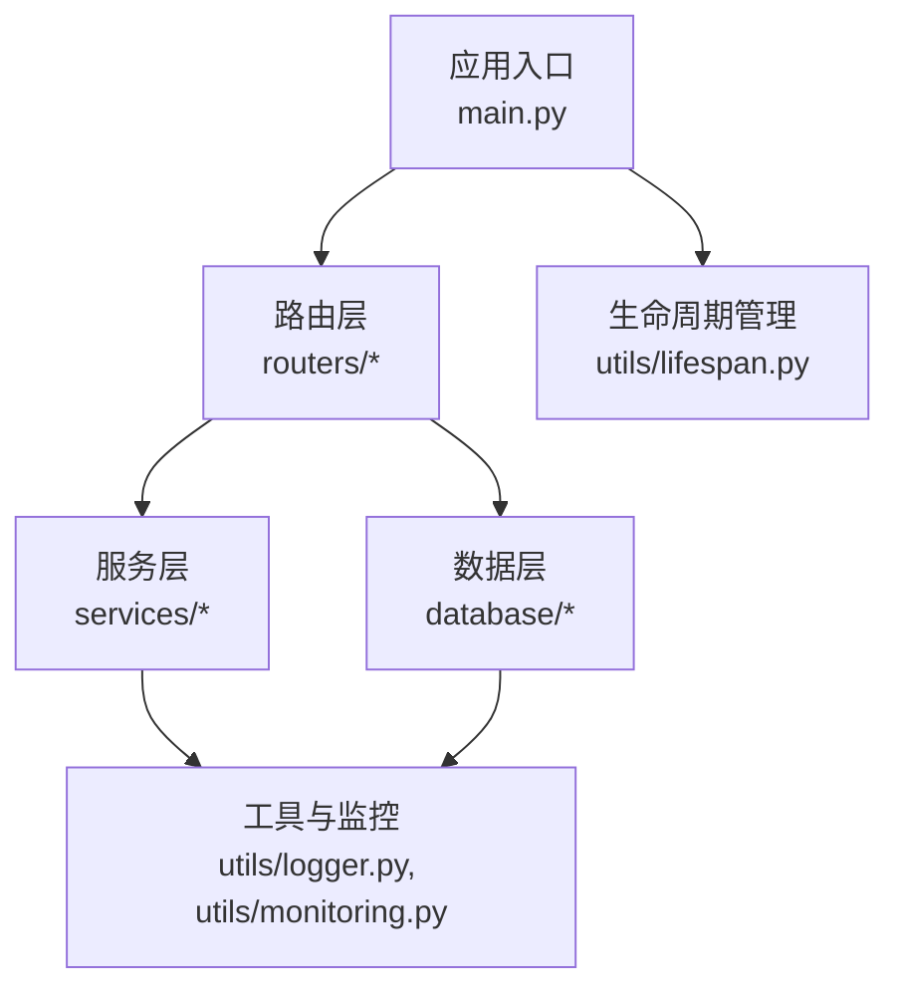
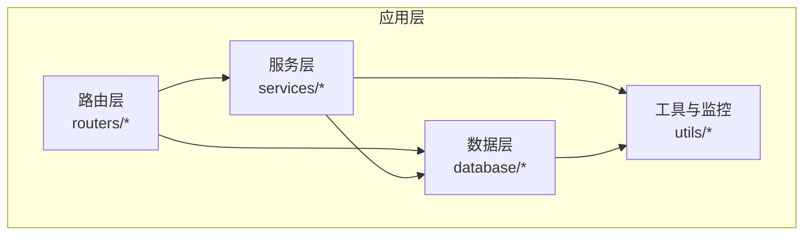
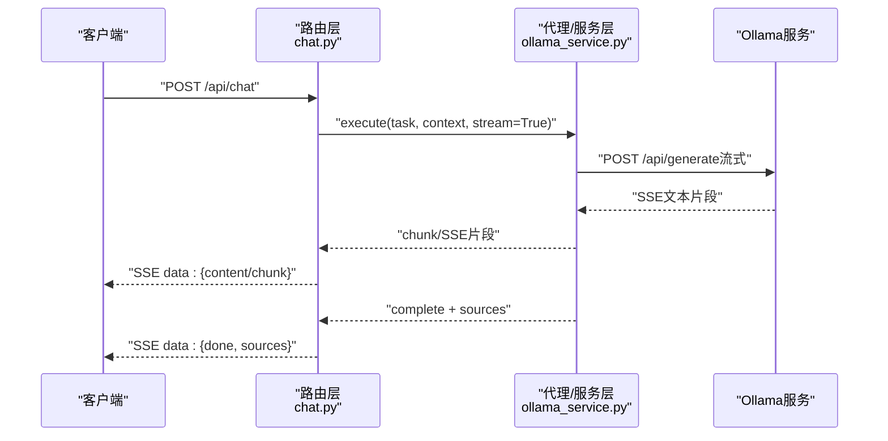
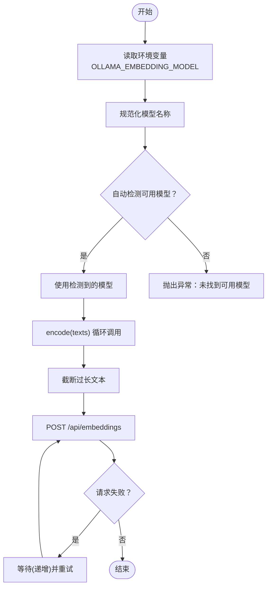
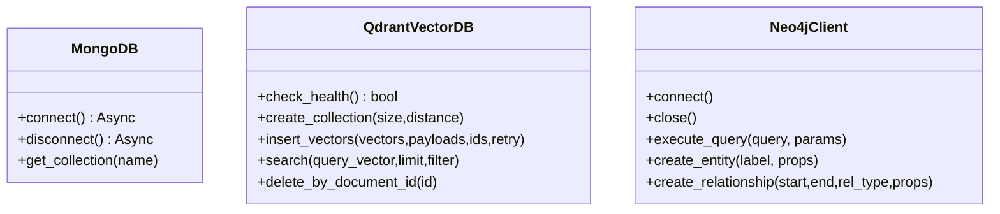
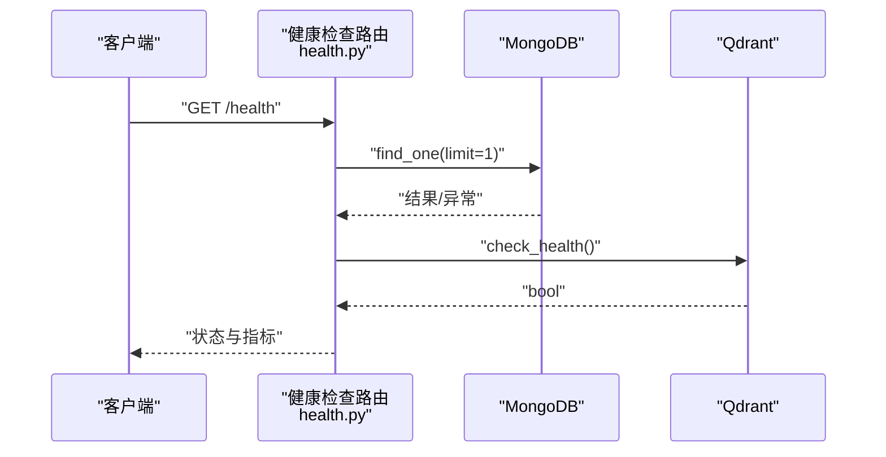
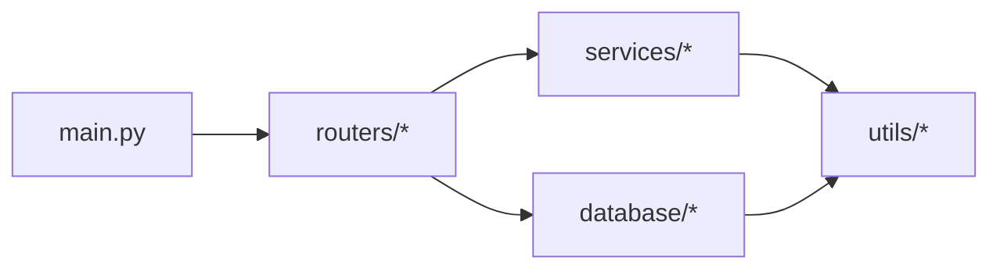

# 第三方服务集成

<cite>
**本文引用的文件**
- [main.py](file://main.py)
- [ollama_service.py](file://services/ollama_service.py)
- [embedding_service.py](file://embedding/embedding_service.py)
- [mongodb.py](file://database/mongodb.py)
- [qdrant_client.py](file://database/qdrant_client.py)
- [neo4j_client.py](file://database/neo4j_client.py)
- [chat.py](file://routers/chat.py)
- [health.py](file://routers/health.py)
- [logger.py](file://utils/logger.py)
- [lifespan.py](file://utils/lifespan.py)
- [monitoring.py](file://utils/monitoring.py)
- [README.md](file://README.md)
</cite>

## 目录
1. [简介](#简介)
2. [项目结构](#项目结构)
3. [核心组件](#核心组件)
4. [架构总览](#架构总览)
5. [详细组件分析](#详细组件分析)
6. [依赖分析](#依赖分析)
7. [性能考量](#性能考量)
8. [故障排查指南](#故障排查指南)
9. [结论](#结论)
10. [附录](#附录)

## 简介
本指南面向需要在本项目中集成第三方服务（AI服务与数据库）的开发者，系统阐述外部API接入的标准流程、认证机制、请求封装与响应处理；解释模型选择器的扩展机制，如何接入新的AI服务提供商与模型接口；提供数据库客户端扩展的开发方法，包括新数据库类型的适配与连接管理；并给出错误处理策略、重试机制与降级方案的实现细节。同时，结合项目现状，给出集成 OpenAI、Anthropic、本地 Ollama 等不同类型的 AI 服务，以及适配 MySQL、PostgreSQL 等关系型数据库的实践建议。

## 项目结构
项目采用 FastAPI + 多模块分层的组织方式，核心模块包括：
- 应用入口与生命周期：main.py、utils/lifespan.py
- 路由层：routers/*（如 chat.py、health.py）
- 服务层：services/*（如 ollama_service.py）
- 数据层：database/*（MongoDB、Qdrant、Neo4j）
- 工具与监控：utils/logger.py、utils/monitoring.py
- 配置与文档：README.md

图表来源
- [main.py:55-98](file://main.py#L55-L98)
- [lifespan.py:26-87](file://utils/lifespan.py#L26-L87)
- [chat.py:17-20](file://routers/chat.py#L17-L20)

章节来源
- [main.py:1-157](file://main.py#L1-L157)
- [README.md:55-70](file://README.md#L55-L70)

## 核心组件
- 应用入口与环境加载：负责根据环境变量加载 .env 文件、注册路由、CORS、静态文件与全局异常处理。
- 生命周期管理：启动时连接数据库并做初始化，关闭时释放连接。
- 路由与控制器：统一处理请求参数、流式响应与断开检测。
- 服务层：封装第三方AI服务（如 Ollama）与向量化服务。
- 数据层：封装 MongoDB、Qdrant、Neo4j 客户端，提供连接池、健康检查与重试。
- 工具与监控：异步日志、性能监控与系统指标采集。

章节来源
- [main.py:20-53](file://main.py#L20-L53)
- [lifespan.py:8-31](file://utils/lifespan.py#L8-L31)
- [chat.py:615-750](file://routers/chat.py#L615-L750)
- [ollama_service.py:9-674](file://services/ollama_service.py#L9-L674)
- [embedding_service.py:8-278](file://embedding/embedding_service.py#L8-L278)
- [mongodb.py:92-199](file://database/mongodb.py#L92-L199)
- [qdrant_client.py:18-544](file://database/qdrant_client.py#L18-L544)
- [neo4j_client.py:6-104](file://database/neo4j_client.py#L6-L104)
- [logger.py:15-88](file://utils/logger.py#L15-L88)
- [monitoring.py:13-185](file://utils/monitoring.py#L13-L185)

## 架构总览
系统采用“路由层-服务层-数据层”的分层架构，服务层与数据层均通过环境变量与配置文件进行解耦，便于扩展新的第三方服务与数据库类型。

图表来源
- [chat.py:17-20](file://routers/chat.py#L17-L20)
- [ollama_service.py:9-35](file://services/ollama_service.py#L9-L35)
- [mongodb.py:92-136](file://database/mongodb.py#L92-L136)
- [qdrant_client.py:18-96](file://database/qdrant_client.py#L18-L96)
- [neo4j_client.py:6-38](file://database/neo4j_client.py#L6-L38)
- [logger.py:15-88](file://utils/logger.py#L15-L88)
- [monitoring.py:13-115](file://utils/monitoring.py#L13-L115)

## 详细组件分析

### 组件A：AI服务集成（以Ollama为例）
- 认证机制：Ollama 本地服务默认无需认证；通过环境变量配置 base_url 与模型名。
- 请求封装：统一构造提示词（含系统提示、知识库状态、文档信息、对话历史、工具调用等），支持流式与非流式两种生成方式。
- 响应处理：流式输出通过 SSE 格式传输，断开检测在路由层实现；非流式直接返回完整文本。
- 错误处理：捕获超时、连接错误、JSON解析失败等异常，并记录日志与抛出 HTTP 异常。
- 重试与降级：向量化服务对 Ollama 嵌入请求进行指数退避重试；数据库客户端对健康检查与连接进行重试与降级处理。

图表来源
- [chat.py:664-743](file://routers/chat.py#L664-L743)
- [ollama_service.py:453-638](file://services/ollama_service.py#L453-L638)

章节来源
- [ollama_service.py:9-674](file://services/ollama_service.py#L9-L674)
- [chat.py:615-750](file://routers/chat.py#L615-L750)

### 组件B：向量化服务（EmbeddingService）
- 模型选择：优先使用环境变量指定的 Ollama 模型，支持自动检测与规范化模型名称。
- 请求封装：对单个文本调用 /api/embeddings，限制输入长度以避免 Ollama 错误。
- 重试机制：对超时与连接错误进行递增等待重试，最多3次。
- 维度与缓存：首次调用时记录向量维度，后续复用。

图表来源
- [embedding_service.py:107-229](file://embedding/embedding_service.py#L107-L229)

章节来源
- [embedding_service.py:8-278](file://embedding/embedding_service.py#L8-L278)

### 组件C：数据库客户端扩展（MongoDB/Qdrant/Neo4j）
- MongoDB：支持从 MONGODB_URI 或独立主机/端口/认证变量构建连接；配置连接池参数；提供异步与同步客户端；提供文档仓库与分块仓库。
- Qdrant：优先使用 gRPC 连接（端口6334）以避免 HTTP/httpx 502；自动健康检查与重试；支持集合维度不匹配时自动重建；插入与查询带重试与降级。
- Neo4j：兼容容器环境（localhost 替换为 host.docker.internal）；连接验证；提供查询与实体/关系创建方法。

图表来源
- [mongodb.py:92-199](file://database/mongodb.py#L92-L199)
- [qdrant_client.py:18-544](file://database/qdrant_client.py#L18-L544)
- [neo4j_client.py:6-104](file://database/neo4j_client.py#L6-L104)

章节来源
- [mongodb.py:92-800](file://database/mongodb.py#L92-L800)
- [qdrant_client.py:18-544](file://database/qdrant_client.py#L18-L544)
- [neo4j_client.py:6-104](file://database/neo4j_client.py#L6-L104)

### 组件D：健康检查与监控
- 健康检查：检查 MongoDB 与 Qdrant 连接状态，返回整体健康状态与系统资源信息。
- 监控：记录请求耗时、错误数与系统指标（CPU、内存、磁盘），支持慢请求告警。

图表来源
- [health.py:23-87](file://routers/health.py#L23-L87)
- [mongodb.py:32-184](file://database/mongodb.py#L32-L184)
- [qdrant_client.py:124-139](file://database/qdrant_client.py#L124-L139)

章节来源
- [health.py:1-135](file://routers/health.py#L1-L135)
- [monitoring.py:13-185](file://utils/monitoring.py#L13-L185)

## 依赖分析
- 应用入口依赖路由与中间件，路由依赖服务与数据层，服务与数据层依赖工具与监控。
- 数据库客户端之间无直接依赖，通过统一的环境变量与配置文件解耦。
- 服务层对第三方服务的依赖通过环境变量与配置文件解耦，便于替换与扩展。

图表来源
- [main.py:15-97](file://main.py#L15-L97)
- [chat.py:17-20](file://routers/chat.py#L17-L20)
- [logger.py:15-88](file://utils/logger.py#L15-L88)
- [monitoring.py:13-115](file://utils/monitoring.py#L13-L115)

章节来源
- [main.py:1-157](file://main.py#L1-L157)
- [chat.py:1-80](file://routers/chat.py#L1-L80)

## 性能考量
- 连接池与超时：MongoDB 连接池参数可调；Qdrant 优先 gRPC 并设置超时；Ollama 嵌入与生成设置较长超时。
- 异步与流式：路由层使用 SSE 流式输出，客户端断开检测避免资源浪费。
- 监控与告警：慢请求检测与系统指标采集，便于定位性能瓶颈。
- 重试与降级：数据库健康检查与连接重试、向量化服务重试、Qdrant 插入重试与维度不匹配自动重建。

章节来源
- [mongodb.py:122-151](file://database/mongodb.py#L122-L151)
- [qdrant_client.py:66-96](file://database/qdrant_client.py#L66-L96)
- [ollama_service.py:32-34](file://services/ollama_service.py#L32-L34)
- [chat.py:735-743](file://routers/chat.py#L735-L743)
- [monitoring.py:163-185](file://utils/monitoring.py#L163-L185)

## 故障排查指南
- 全局异常处理：统一捕获未处理异常，记录请求路径与方法，返回 JSON 响应。
- 日志配置：异步文件处理器，支持 INFO/WARNING 等级，生产环境降低文件日志级别。
- 生命周期重试：启动时 MongoDB 连接重试，失败抛出异常阻止启动。
- 健康检查：检查 MongoDB 与 Qdrant 连接，返回具体错误信息。
- 数据库重试与降级：Qdrant 插入失败时指数退避重试；集合不存在时自动创建；维度不匹配时自动重建。

章节来源
- [main.py:109-126](file://main.py#L109-L126)
- [logger.py:15-88](file://utils/logger.py#L15-L88)
- [lifespan.py:8-31](file://utils/lifespan.py#L8-L31)
- [health.py:32-87](file://routers/health.py#L32-L87)
- [qdrant_client.py:278-335](file://database/qdrant_client.py#L278-L335)

## 结论
本项目通过清晰的分层架构与环境变量配置，实现了对第三方服务与数据库的灵活集成。对于新增 AI 服务与数据库类型，建议遵循以下原则：
- 通过环境变量与配置文件解耦服务地址与认证信息；
- 封装统一的客户端类，提供连接、健康检查、重试与降级；
- 在路由层实现流式响应与断开检测；
- 使用异步日志与性能监控，保障可观测性；
- 在生命周期中进行必要的初始化与重试，确保服务稳定启动。

## 附录

### A. 外部API接入标准流程（认证、请求封装、响应处理）
- 认证机制
  - 本地服务（如 Ollama）：无需认证，通过环境变量配置 base_url。
  - 云服务（如 Qdrant 云版）：通过 API Key 与 HTTPS 连接，注意安全警告处理。
- 请求封装
  - 统一构造请求体，包含模型名、提示词、上下文、参数等。
  - 对长文本进行截断，避免服务端错误。
- 响应处理
  - 流式输出使用 SSE，断开检测在路由层实现。
  - 非流式直接返回完整文本或结构化结果。

章节来源
- [ollama_service.py:24-34](file://services/ollama_service.py#L24-L34)
- [qdrant_client.py:39-60](file://database/qdrant_client.py#L39-L60)
- [chat.py:664-743](file://routers/chat.py#L664-L743)

### B. 模型选择器扩展机制
- 环境变量驱动：通过环境变量指定模型名称与向量化模型。
- 自动检测：向量化服务可自动检测可用模型并规范化名称。
- 重试与降级：对模型不可用或维度不匹配进行重试与重建。

章节来源
- [embedding_service.py:30-44](file://embedding/embedding_service.py#L30-L44)
- [embedding_service.py:107-155](file://embedding/embedding_service.py#L107-L155)
- [qdrant_client.py:247-267](file://database/qdrant_client.py#L247-L267)

### C. 数据库客户端扩展开发方法
- 新数据库类型适配
  - 参考现有客户端类，提供 connect/close/execute/query 等方法。
  - 支持容器环境（localhost 替换为 host.docker.internal）。
  - 健康检查与重试，必要时提供降级策略。
- 连接管理
  - 使用环境变量配置连接参数。
  - 提供连接池参数与超时设置，确保高并发稳定性。

章节来源
- [mongodb.py:92-199](file://database/mongodb.py#L92-L199)
- [qdrant_client.py:18-139](file://database/qdrant_client.py#L18-L139)
- [neo4j_client.py:6-38](file://database/neo4j_client.py#L6-L38)

### D. 错误处理策略、重试机制与降级方案
- 全局异常处理：统一捕获异常并记录日志，返回标准化错误响应。
- 重试机制
  - 向量化服务：超时与连接错误递增等待重试。
  - Qdrant 插入：指数退避重试，支持维度不匹配自动重建。
  - MongoDB：启动时连接重试。
- 降级方案
  - Qdrant 健康检查失败时记录警告并继续运行。
  - 集合不存在时自动创建，返回空结果而非抛出异常。

章节来源
- [main.py:109-126](file://main.py#L109-L126)
- [embedding_service.py:175-229](file://embedding/embedding_service.py#L175-L229)
- [qdrant_client.py:278-335](file://database/qdrant_client.py#L278-L335)
- [lifespan.py:8-31](file://utils/lifespan.py#L8-L31)

### E. 集成示例（概念性说明）
- 集成 OpenAI/Anthropic
  - 通过环境变量配置 base_url 与 API Key。
  - 封装统一的客户端类，提供 generate/list_models 等方法。
  - 在路由层使用流式响应与断开检测。
- 适配 MySQL/PostgreSQL
  - 参考 MongoDB 客户端，提供 connect/close/execute/query 等方法。
  - 支持连接池与超时配置，提供健康检查与重试。
  - 在路由层进行参数校验与错误处理。

[本节为概念性说明，不直接分析具体文件]

### F. 配置管理、环境变量处理与安全考虑
- 配置管理
  - 通过 .env 文件与环境变量区分开发/生产环境。
  - 路由层与数据库层均支持从 .env 加载配置。
- 环境变量处理
  - 优先使用 ENVIRONMENT/NODE_ENV 控制加载文件。
  - 数据库连接参数（如连接池大小、超时）通过环境变量配置。
- 安全考虑
  - Qdrant 本地 HTTP 连接忽略 API Key 警告，生产环境建议 HTTPS。
  - Ollama 本地服务无需认证，注意网络暴露风险。

章节来源
- [main.py:20-53](file://main.py#L20-L53)
- [mongodb.py:122-151](file://database/mongodb.py#L122-L151)
- [qdrant_client.py:39-60](file://database/qdrant_client.py#L39-L60)