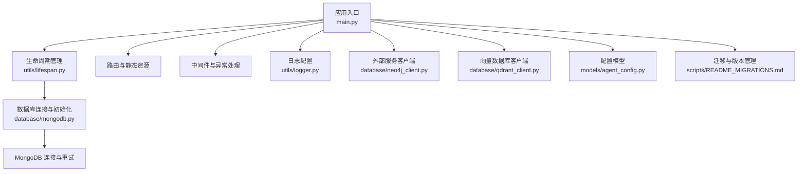
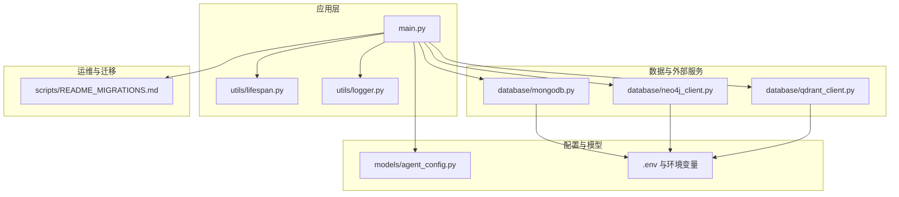
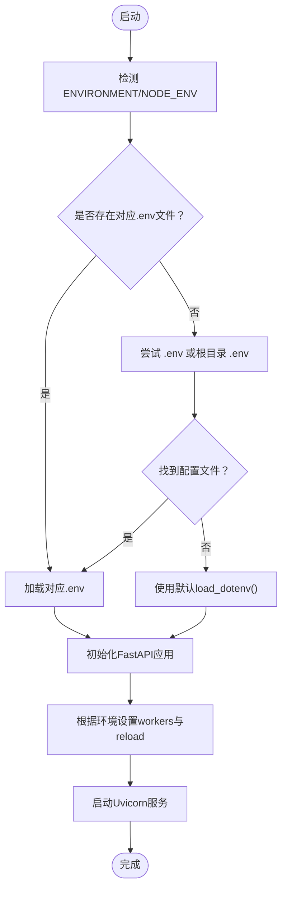
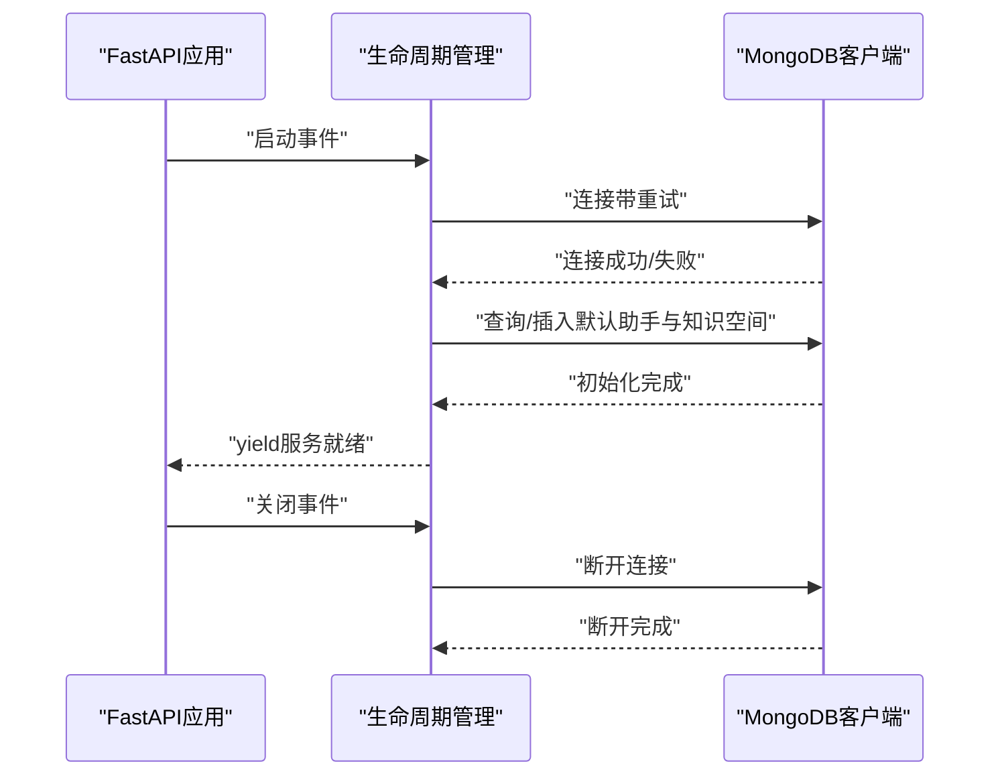
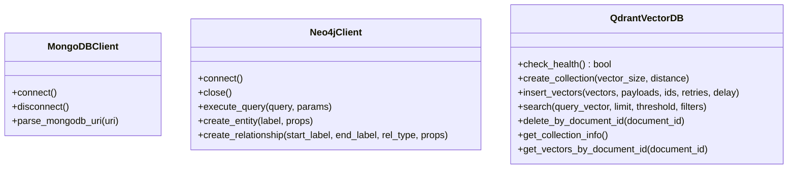
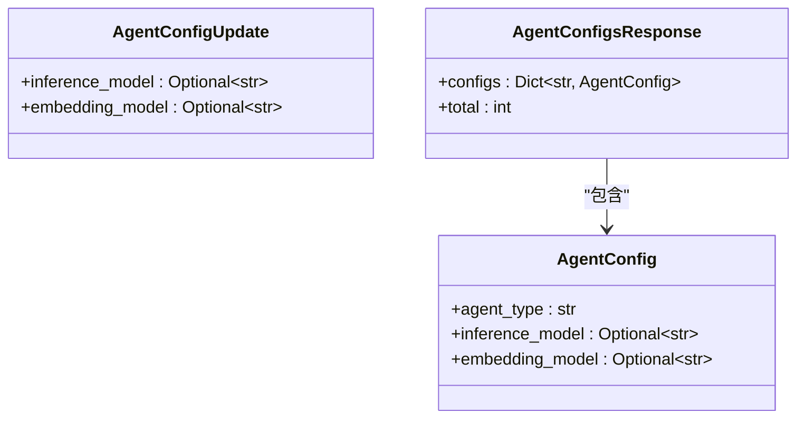
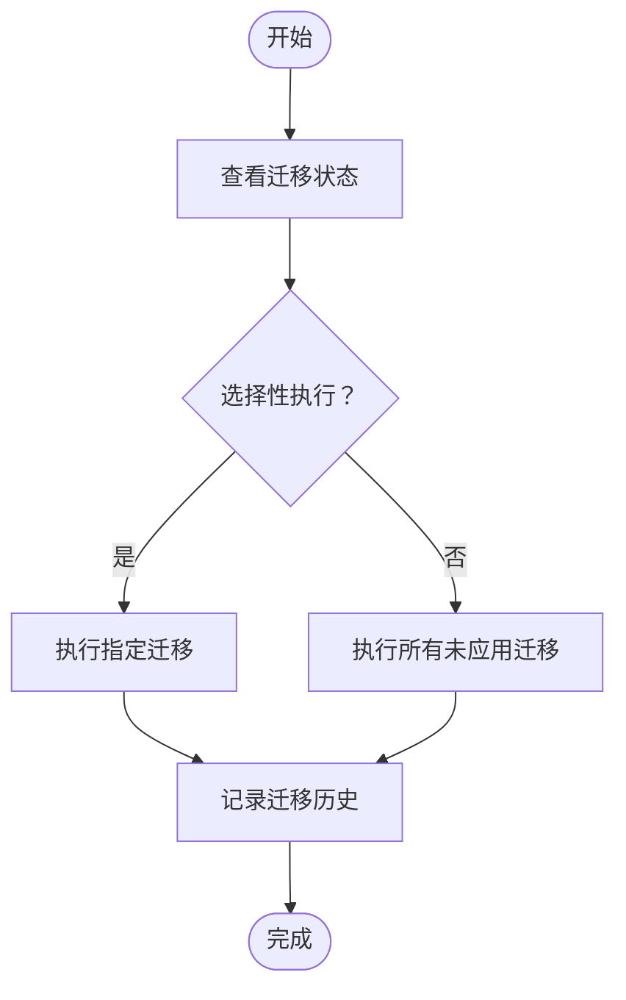
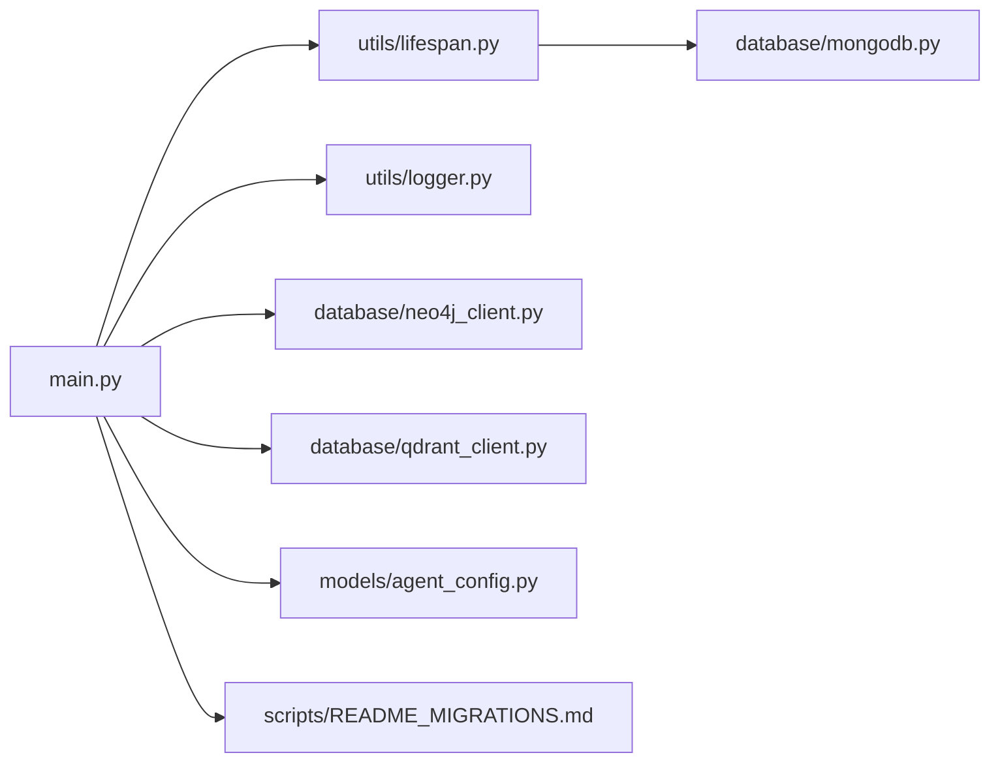

# 配置管理与动态加载

<cite>
**本文引用的文件**
- [main.py](file://main.py)
- [agent_config.py](file://models/agent_config.py)
- [lifespan.py](file://utils/lifespan.py)
- [logger.py](file://utils/logger.py)
- [mongodb.py](file://database/mongodb.py)
- [neo4j_client.py](file://database/neo4j_client.py)
- [qdrant_client.py](file://database/qdrant_client.py)
- [README_MIGRATIONS.md](file://scripts/README_MIGRATIONS.md)
</cite>

## 目录
1. [简介](#简介)
2. [项目结构](#项目结构)
3. [核心组件](#核心组件)
4. [架构总览](#架构总览)
5. [详细组件分析](#详细组件分析)
6. [依赖分析](#依赖分析)
7. [性能考虑](#性能考虑)
8. [故障排查指南](#故障排查指南)
9. [结论](#结论)
10. [附录](#附录)

## 简介
本指南围绕配置管理与动态加载展开，目标是帮助开发者理解并实践以下能力：
- 系统配置架构与环境变量管理：配置文件结构、默认值设置与运行时修改策略
- 动态加载与热更新机制：如何实现插件式组件的动态注册与卸载
- 配置验证与类型检查：确保配置正确性与一致性
- 配置迁移、版本兼容与回滚策略
- 实战示例：配置热重载、插件动态加载与组件生命周期管理
- 冲突处理与依赖关系管理

## 项目结构
本项目采用分层+功能域结合的组织方式：
- 应用入口与生命周期：main.py、utils/lifespan.py
- 配置模型：models/agent_config.py
- 数据库与外部服务客户端：database/*（MongoDB、Neo4j、Qdrant）
- 日志与环境变量：utils/logger.py、database/mongodb.py
- 迁移与版本管理：scripts/README_MIGRATIONS.md

图表来源
- [main.py:1-157](file://main.py#L1-L157)
- [lifespan.py:1-88](file://utils/lifespan.py#L1-L88)
- [mongodb.py:1-243](file://database/mongodb.py#L1-L243)
- [logger.py:1-88](file://utils/logger.py#L1-L88)
- [neo4j_client.py:1-104](file://database/neo4j_client.py#L1-L104)
- [qdrant_client.py:1-544](file://database/qdrant_client.py#L1-L544)
- [agent_config.py:1-24](file://models/agent_config.py#L1-L24)
- [README_MIGRATIONS.md:1-135](file://scripts/README_MIGRATIONS.md#L1-L135)

章节来源
- [main.py:1-157](file://main.py#L1-L157)
- [lifespan.py:1-88](file://utils/lifespan.py#L1-L88)
- [mongodb.py:1-243](file://database/mongodb.py#L1-L243)
- [logger.py:1-88](file://utils/logger.py#L1-L88)
- [neo4j_client.py:1-104](file://database/neo4j_client.py#L1-L104)
- [qdrant_client.py:1-544](file://database/qdrant_client.py#L1-L544)
- [agent_config.py:1-24](file://models/agent_config.py#L1-L24)
- [README_MIGRATIONS.md:1-135](file://scripts/README_MIGRATIONS.md#L1-L135)

## 核心组件
- 应用入口与环境变量加载：根据环境变量选择.env文件并加载，支持生产/开发差异化配置与Uvicorn工作进程与reload策略
- 生命周期管理：应用启动时连接数据库、初始化默认助手与知识空间；关闭时断开连接
- 配置模型：基于Pydantic的Agent配置模型，提供类型安全的配置读取与更新
- 外部服务客户端：统一从环境变量读取连接参数，具备连接重试、健康检查与降级策略
- 日志系统：支持异步文件写入与生产环境日志级别调整
- 迁移与版本管理：提供迁移脚本、状态查看、选择性执行与回滚接口

章节来源
- [main.py:20-52](file://main.py#L20-L52)
- [main.py:128-157](file://main.py#L128-L157)
- [lifespan.py:26-87](file://utils/lifespan.py#L26-L87)
- [agent_config.py:6-23](file://models/agent_config.py#L6-L23)
- [mongodb.py:12-36](file://database/mongodb.py#L12-L36)
- [neo4j_client.py:6-39](file://database/neo4j_client.py#L6-L39)
- [qdrant_client.py:18-123](file://database/qdrant_client.py#L18-L123)
- [logger.py:15-82](file://utils/logger.py#L15-L82)
- [README_MIGRATIONS.md:11-46](file://scripts/README_MIGRATIONS.md#L11-L46)

## 架构总览
系统通过应用入口集中加载环境变量与配置，生命周期管理负责数据库连接与初始化，外部服务客户端从环境变量读取参数并进行连接与健康检查。配置模型提供类型安全的配置结构，迁移脚本保障数据库结构演进。

图表来源
- [main.py:1-157](file://main.py#L1-L157)
- [lifespan.py:1-88](file://utils/lifespan.py#L1-L88)
- [logger.py:1-88](file://utils/logger.py#L1-L88)
- [agent_config.py:1-24](file://models/agent_config.py#L1-L24)
- [mongodb.py:1-243](file://database/mongodb.py#L1-L243)
- [neo4j_client.py:1-104](file://database/neo4j_client.py#L1-L104)
- [qdrant_client.py:1-544](file://database/qdrant_client.py#L1-L544)
- [README_MIGRATIONS.md:1-135](file://scripts/README_MIGRATIONS.md#L1-L135)

## 详细组件分析

### 配置文件结构与环境变量管理
- 环境变量加载策略
  - 依据ENVIRONMENT或NODE_ENV确定环境，优先加载对应.env文件，其次回退到通用.env与根目录.env
  - 应用启动时打印当前环境与加载的配置文件，便于排障
- 端口与工作进程
  - 通过PORT控制监听端口；生产环境默认多worker并通过UVICORN_WORKERS覆盖；开发环境单worker并启用reload
- 日志级别
  - 通过LOG_LEVEL控制日志级别；生产环境降低文件日志级别以减少IO

图表来源
- [main.py:20-52](file://main.py#L20-L52)
- [main.py:128-157](file://main.py#L128-L157)
- [logger.py:18-21](file://utils/logger.py#L18-L21)

章节来源
- [main.py:20-52](file://main.py#L20-L52)
- [main.py:128-157](file://main.py#L128-L157)
- [logger.py:18-21](file://utils/logger.py#L18-L21)

### 生命周期管理与数据库初始化
- 启动阶段
  - 带重试的MongoDB连接，最多重试若干次并记录告警
  - 初始化默认“通用助手”与默认“知识空间”，保证系统最小可用
- 关闭阶段
  - 优雅断开数据库连接，捕获并记录异常

图表来源
- [lifespan.py:26-87](file://utils/lifespan.py#L26-L87)
- [mongodb.py:8-24](file://database/mongodb.py#L8-L24)

章节来源
- [lifespan.py:26-87](file://utils/lifespan.py#L26-L87)
- [mongodb.py:8-24](file://database/mongodb.py#L8-L24)

### 外部服务客户端（数据库与向量库）
- MongoDB客户端
  - 从环境变量加载URI或分段参数，解析数据库名，配置连接池参数，启动时连接并重试
- Neo4j客户端
  - 从环境变量读取URI、用户名、密码，容器内自动替换localhost为host.docker.internal，连接后验证连通性
- Qdrant客户端
  - 优先使用gRPC连接以规避HTTP相关问题，支持本地HTTP连接时自动忽略API key以避免警告，具备健康检查与自动重建集合能力

图表来源
- [mongodb.py:39-243](file://database/mongodb.py#L39-L243)
- [neo4j_client.py:6-104](file://database/neo4j_client.py#L6-L104)
- [qdrant_client.py:18-544](file://database/qdrant_client.py#L18-L544)

章节来源
- [mongodb.py:39-243](file://database/mongodb.py#L39-L243)
- [neo4j_client.py:6-104](file://database/neo4j_client.py#L6-L104)
- [qdrant_client.py:18-544](file://database/qdrant_client.py#L18-L544)

### 配置模型与类型检查
- Agent配置模型
  - 使用Pydantic BaseModel定义Agent配置字段，支持可选字段与默认值
  - 提供更新模型与响应模型，便于API交互
- 类型安全与默认值
  - 通过字段类型注解与Optional默认值确保配置结构稳定
  - 结合运行时环境变量读取，形成“结构化配置 + 环境变量”的双层保障

图表来源
- [agent_config.py:6-23](file://models/agent_config.py#L6-L23)

章节来源
- [agent_config.py:6-23](file://models/agent_config.py#L6-L23)

### 迁移、版本兼容与回滚策略
- 迁移脚本
  - 支持运行未应用迁移、查看状态、选择性执行、强制重跑、Docker环境执行
- 版本与历史
  - 迁移历史记录在MongoDB集合中，包含迁移ID、状态、应用时间与错误信息
- 回滚与幂等
  - 迁移脚本设计为幂等，可安全多次运行；迁移管理器支持注册回滚函数

图表来源
- [README_MIGRATIONS.md:11-46](file://scripts/README_MIGRATIONS.md#L11-L46)
- [README_MIGRATIONS.md:74-81](file://scripts/README_MIGRATIONS.md#L74-L81)

章节来源
- [README_MIGRATIONS.md:11-46](file://scripts/README_MIGRATIONS.md#L11-L46)
- [README_MIGRATIONS.md:74-81](file://scripts/README_MIGRATIONS.md#L74-L81)

### 动态加载与热更新机制（概念性说明）
- 插件式组件
  - 建议将可插拔组件抽象为统一接口，通过工厂或注册表动态加载
  - 配置变更时，通过生命周期钩子触发组件重建或热切换
- 热更新流程
  - 监控配置文件或配置中心变化，触发组件重建
  - 采用渐进式切换策略，先加载新组件，验证健康后再切流量
- 依赖关系与冲突处理
  - 组件间依赖通过注册表声明，冲突时优先级排序或报错提示
  - 配置冲突通过“最后写入者优先”或显式合并策略解决

（本节为概念性内容，不直接分析具体文件）

## 依赖分析
- 组件耦合
  - 应用入口依赖生命周期管理与外部服务客户端
  - 生命周期管理依赖数据库客户端
  - 外部服务客户端依赖环境变量与日志模块
- 外部依赖
  - FastAPI、Uvicorn、MongoDB、Neo4j、Qdrant、dotenv、pydantic等

图表来源
- [main.py:1-157](file://main.py#L1-L157)
- [lifespan.py:1-88](file://utils/lifespan.py#L1-L88)
- [logger.py:1-88](file://utils/logger.py#L1-L88)
- [mongodb.py:1-243](file://database/mongodb.py#L1-L243)
- [neo4j_client.py:1-104](file://database/neo4j_client.py#L1-L104)
- [qdrant_client.py:1-544](file://database/qdrant_client.py#L1-L544)
- [agent_config.py:1-24](file://models/agent_config.py#L1-L24)
- [README_MIGRATIONS.md:1-135](file://scripts/README_MIGRATIONS.md#L1-L135)

章节来源
- [main.py:1-157](file://main.py#L1-L157)
- [lifespan.py:1-88](file://utils/lifespan.py#L1-L88)
- [logger.py:1-88](file://utils/logger.py#L1-L88)
- [mongodb.py:1-243](file://database/mongodb.py#L1-L243)
- [neo4j_client.py:1-104](file://database/neo4j_client.py#L1-L104)
- [qdrant_client.py:1-544](file://database/qdrant_client.py#L1-L544)
- [agent_config.py:1-24](file://models/agent_config.py#L1-L24)
- [README_MIGRATIONS.md:1-135](file://scripts/README_MIGRATIONS.md#L1-L135)

## 性能考虑
- 连接池与超时
  - MongoDB连接池参数可调，建议根据CPU核数与并发需求设置最大连接数
  - Qdrant优先使用gRPC并配置超时，避免HTTP相关问题
- 日志性能
  - 异步文件处理器避免阻塞主线程；生产环境降低文件日志级别
- 启动与初始化
  - 启动时连接重试与默认数据初始化，避免服务不可用

（本节提供一般性指导，不直接分析具体文件）

## 故障排查指南
- 环境变量与配置文件
  - 确认ENVIRONMENT/NODE_ENV与对应.env文件存在；检查端口与workers配置
- 数据库连接
  - MongoDB连接失败时查看重试日志；确认URI与认证参数；检查网络可达性
  - Neo4j连接失败时检查URI、用户名、密码与容器内localhost映射
  - Qdrant连接失败时优先使用gRPC；关注API key与不安全连接警告
- 迁移与版本
  - 查看迁移历史集合状态；按需选择性执行；注意幂等性与回滚函数

章节来源
- [main.py:20-52](file://main.py#L20-L52)
- [mongodb.py:8-24](file://database/mongodb.py#L8-L24)
- [neo4j_client.py:16-38](file://database/neo4j_client.py#L16-L38)
- [qdrant_client.py:97-123](file://database/qdrant_client.py#L97-L123)
- [README_MIGRATIONS.md:115-135](file://scripts/README_MIGRATIONS.md#L115-L135)

## 结论
本指南梳理了系统的配置架构与环境变量管理机制，明确了生命周期管理、外部服务客户端与迁移脚本的关键实现。通过Pydantic模型与环境变量的组合，系统实现了类型安全与灵活的配置管理。建议在实际工程中进一步完善插件式组件的动态加载与热更新机制，并强化配置冲突与依赖关系的治理策略。

## 附录
- 实战建议
  - 配置热重载：监听配置文件或配置中心变化，触发组件重建与健康检查
  - 插件动态加载：通过注册表与工厂模式实现组件的动态注册与卸载
  - 配置验证：结合Pydantic模型与运行时环境变量校验，确保一致性
  - 版本兼容与回滚：迁移脚本幂等化，记录历史并提供回滚函数

（本节为总结性内容，不直接分析具体文件）