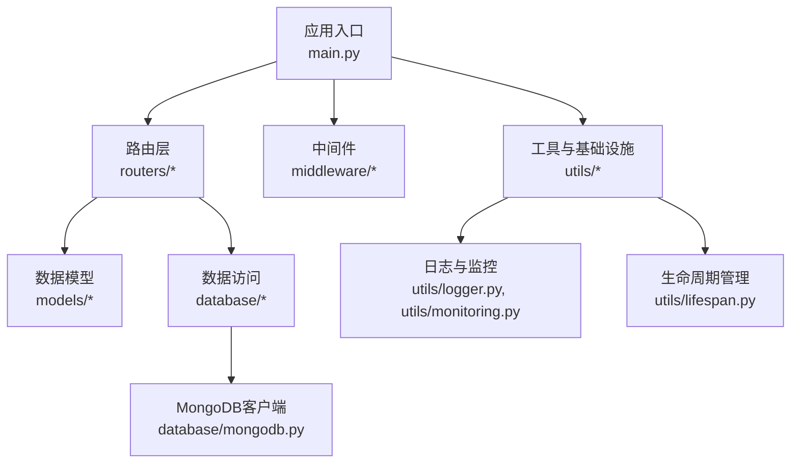
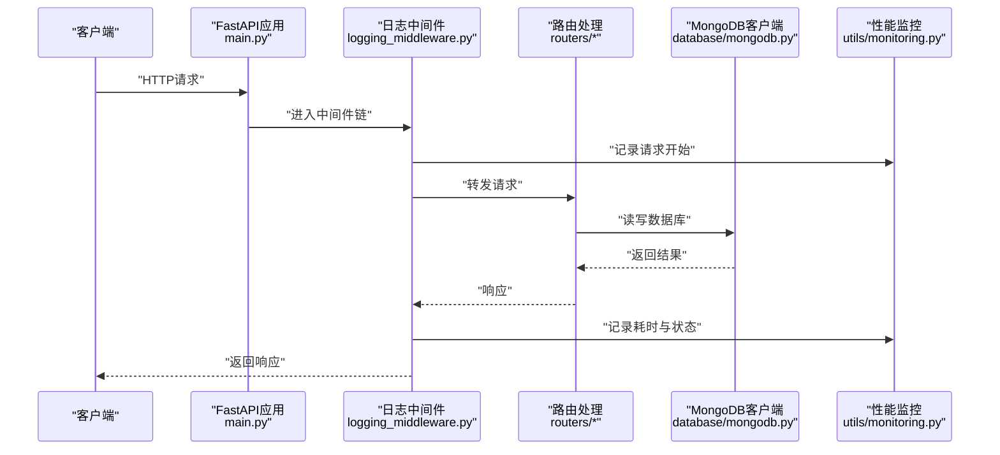
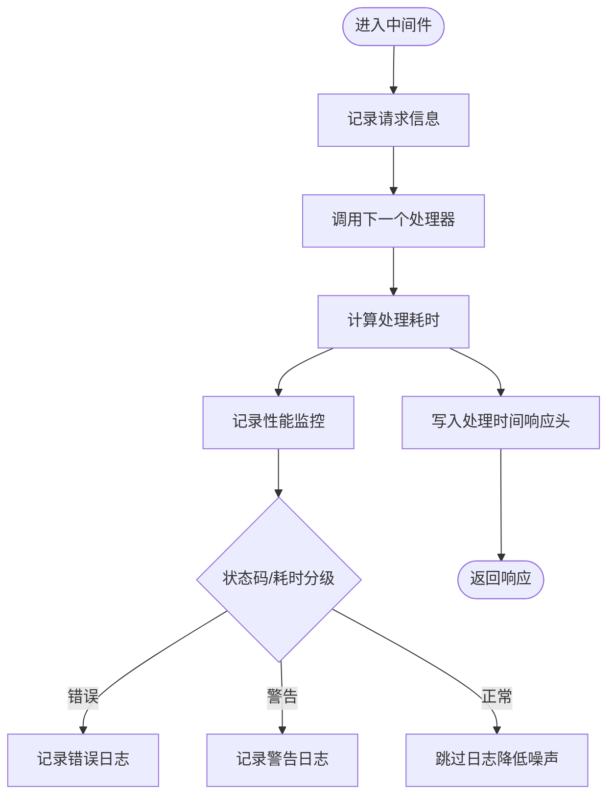
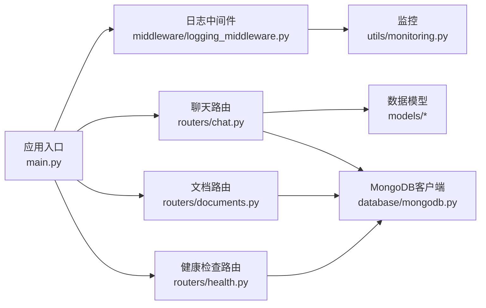

# API扩展开发

<cite>
**本文引用的文件**
- [main.py](file://main.py)
- [logging_middleware.py](file://middleware/logging_middleware.py)
- [logger.py](file://utils/logger.py)
- [monitoring.py](file://utils/monitoring.py)
- [lifespan.py](file://utils/lifespan.py)
- [mongodb.py](file://database/mongodb.py)
- [chat.py](file://routers/chat.py)
- [documents.py](file://routers/documents.py)
- [health.py](file://routers/health.py)
- [user.py](file://models/user.py)
- [resource.py](file://models/resource.py)
</cite>

## 目录
1. [引言](#引言)
2. [项目结构](#项目结构)
3. [核心组件](#核心组件)
4. [架构总览](#架构总览)
5. [详细组件分析](#详细组件分析)
6. [依赖分析](#依赖分析)
7. [性能考虑](#性能考虑)
8. [故障排查指南](#故障排查指南)
9. [结论](#结论)
10. [附录](#附录)

## 引言
本指南面向Advanced RAG API的扩展开发者，围绕新路由开发、数据模型扩展、中间件开发、权限控制、API版本管理、文档生成与测试策略、性能优化与缓存、限流机制、监控与日志等方面，提供系统化、可落地的实践方法。文档以仓库现有实现为依据，结合FastAPI生态最佳实践，帮助你在不破坏既有架构的前提下，快速、安全地扩展API能力。

## 项目结构
项目采用分层与功能域划分相结合的组织方式：
- 应用入口与中间件：main.py注册CORS、静态文件、全局异常处理与自定义日志中间件；中间件目录提供请求日志与性能监控。
- 路由层：routers目录按业务域拆分，如聊天、文档、检索、健康检查等。
- 数据模型：models目录提供Pydantic模型，用于请求/响应校验与序列化。
- 数据访问：database目录封装MongoDB等持久化组件。
- 工具与基础设施：utils目录提供日志、监控、生命周期管理等通用能力。
- Web前端：web目录为Next.js前端工程，与后端API交互。

图表来源
- [main.py:55-98](file://main.py#L55-L98)
- [logging_middleware.py:8-51](file://middleware/logging_middleware.py#L8-L51)
- [mongodb.py:92-200](file://database/mongodb.py#L92-L200)

章节来源
- [main.py:55-127](file://main.py#L55-L127)
- [mongodb.py:92-200](file://database/mongodb.py#L92-L200)

## 核心组件
- FastAPI应用与中间件
  - CORS中间件、静态文件挂载、全局异常处理、自定义请求日志中间件。
- 路由与控制器
  - 聊天路由（对话、消息、流式响应）、文档路由（上传、解析、分块、向量化、存储）、健康检查路由。
- 数据模型与验证
  - 用户模型、资源模型等，基于Pydantic的字段验证与序列化配置。
- 日志与监控
  - 异步日志写入、性能监控、系统指标采集。
- 生命周期管理
  - 应用启动/关闭阶段的MongoDB连接与初始化。

章节来源
- [main.py:55-127](file://main.py#L55-L127)
- [chat.py:20-82](file://routers/chat.py#L20-L82)
- [documents.py:1-20](file://routers/documents.py#L1-L20)
- [health.py:23-87](file://routers/health.py#L23-L87)
- [user.py:8-70](file://models/user.py#L8-L70)
- [resource.py:8-27](file://models/resource.py#L8-L27)
- [logger.py:15-82](file://utils/logger.py#L15-L82)
- [monitoring.py:13-115](file://utils/monitoring.py#L13-L115)
- [lifespan.py:28-92](file://utils/lifespan.py#L28-L92)

## 架构总览
下图展示了请求从客户端到服务端的典型路径，以及中间件、日志、监控与数据库的交互关系。

图表来源
- [main.py:72-73](file://main.py#L72-L73)
- [logging_middleware.py:8-51](file://middleware/logging_middleware.py#L8-L51)
- [mongodb.py:99-184](file://database/mongodb.py#L99-L184)
- [monitoring.py:22-48](file://utils/monitoring.py#L22-L48)

## 详细组件分析

### 路由开发与装饰器使用
- 路由器定义与HTTP方法
  - 使用APIRouter定义子路由，通过装饰器映射HTTP方法与路径，如GET、POST、PUT、DELETE、PATCH。
  - 示例：聊天路由中包含对话列表、详情、消息增删改、流式对话等端点。
- 路径参数与查询参数
  - 使用路径参数（如{conversation_id}）与查询参数（如skip、limit）组合，满足分页与筛选需求。
- 依赖注入与前置校验
  - 使用Depends(require_mongodb)在路由层前置校验数据库连接状态，保证下游逻辑稳定。
- 流式响应与断连检测
  - 聊天路由使用StreamingResponse与SSE协议，结合is_disconnected检测客户端断连，及时停止生成。

章节来源
- [chat.py:97-150](file://routers/chat.py#L97-L150)
- [chat.py:197-246](file://routers/chat.py#L197-L246)
- [chat.py:248-352](file://routers/chat.py#L248-L352)
- [chat.py:623-760](file://routers/chat.py#L623-L760)

### 数据模型扩展（Pydantic）
- 模型设计原则
  - 字段类型明确、可选字段合理使用Optional，必要时提供默认值。
  - 使用field_validator进行字段级校验，如邮箱、URL格式验证。
  - 序列化配置：模型自动支持JSON序列化，便于API响应与请求体校验。
- 典型模型
  - 用户模型：包含身份、角色、权限字段与扩展资料字段。
  - 资源模型：文件/外链资源、标签、状态等字段。
  - 聊天与文档相关模型：对话、消息、请求体等。
- 设计建议
  - 新增模型时，遵循现有命名与字段风格；为敏感字段预留只读/过滤策略。
  - 对复杂嵌套结构，建议拆分子模型，提升可维护性。

章节来源
- [user.py:8-70](file://models/user.py#L8-L70)
- [user.py:87-90](file://models/user.py#L87-L90)
- [resource.py:8-27](file://models/resource.py#L8-L27)
- [resource.py:29-41](file://models/resource.py#L29-L41)
- [chat.py:20-82](file://routers/chat.py#L20-L82)

### 中间件开发（自定义中间件）
- 请求预处理
  - 记录请求方法、路径、查询参数与客户端IP；对健康检查端点进行过滤，降低日志噪声。
- 响应后处理
  - 计算处理耗时，记录到性能监控；按状态码与耗时分级记录日志；将处理时间写入响应头。
- 与监控集成
  - 中间件调用性能监控器记录请求统计，支持慢请求识别与告警。

图表来源
- [logging_middleware.py:8-51](file://middleware/logging_middleware.py#L8-L51)
- [monitoring.py:22-48](file://utils/monitoring.py#L22-L48)

章节来源
- [logging_middleware.py:8-51](file://middleware/logging_middleware.py#L8-L51)
- [monitoring.py:13-115](file://utils/monitoring.py#L13-L115)

### 权限控制系统（认证与授权）
- 当前现状
  - 路由层未内置统一认证/授权中间件；部分端点通过依赖注入前置校验数据库连接。
- 建议方案
  - 认证：引入统一的认证依赖（如基于Token的依赖），在路由层通过Depends注入。
  - 授权：基于用户角色与资源范围（如知识空间、文档）进行细粒度授权。
  - 安全中间件：在日志中间件之前或之后插入统一的安全中间件，集中处理鉴权与审计。
- 集成要点
  - 与现有日志与监控中间件顺序配合，确保审计与性能统计完整。
  - 对敏感端点（如管理、删除）强制启用认证与授权。

章节来源
- [chat.py:98-100](file://routers/chat.py#L98-L100)
- [documents.py:1-20](file://routers/documents.py#L1-L20)

### API版本管理、文档生成与测试策略
- 版本管理
  - 应用层面在FastAPI构造函数中声明版本；路由前缀可用于区分版本（如/api/v1/...）。
- 文档生成
  - FastAPI自动生成OpenAPI/Swagger文档；可通过title、description、version完善元信息。
- 测试策略
  - 单元测试：针对路由与模型验证逻辑编写测试用例。
  - 集成测试：模拟数据库、向量化服务与Qdrant，覆盖端到端流程。
  - 性能测试：使用压力测试工具验证并发与吞吐，结合监控指标评估瓶颈。

章节来源
- [main.py:55-60](file://main.py#L55-L60)
- [health.py:23-87](file://routers/health.py#L23-L87)

### API性能优化、缓存策略与限流机制
- 性能优化
  - 异步日志与监控：避免I/O阻塞，降低请求路径开销。
  - 连接池优化：MongoDB连接池参数可调，平衡并发与资源占用。
  - 流式响应：SSE流式输出，结合断连检测，提升用户体验。
- 缓存策略
  - 对热点查询（如模型列表、知识空间列表）可引入短期缓存，降低数据库压力。
  - 结果缓存需考虑一致性，建议结合ETag或版本字段。
- 限流机制
  - 建议在网关或反向代理层实施速率限制；在应用层可结合Redis实现细粒度限流。

章节来源
- [logger.py:15-82](file://utils/logger.py#L15-L82)
- [mongodb.py:122-136](file://database/mongodb.py#L122-L136)
- [chat.py:623-760](file://routers/chat.py#L623-L760)

### API监控、日志记录与调试技巧
- 监控
  - 性能监控器记录请求耗时、错误率与系统指标，支持慢请求识别与容量规划。
- 日志
  - 异步文件处理器与队列监听器，避免日志写入阻塞主线程；生产环境可调整日志级别。
- 调试技巧
  - 利用中间件记录请求与响应头、处理时间；结合健康检查端点与指标端点定位问题。
  - 生命周期管理在启动阶段进行数据库连接重试与初始化，便于本地调试。

章节来源
- [monitoring.py:13-115](file://utils/monitoring.py#L13-L115)
- [logger.py:15-82](file://utils/logger.py#L15-L82)
- [health.py:117-134](file://routers/health.py#L117-L134)
- [lifespan.py:28-92](file://utils/lifespan.py#L28-L92)

## 依赖分析
- 组件耦合
  - 路由层依赖数据模型与数据库客户端；中间件依赖日志与监控模块；应用入口统一装配。
- 外部依赖
  - MongoDB（异步驱动）、Qdrant（向量检索）、Ollama（模型列表）、第三方解析与分块服务。
- 循环依赖
  - 项目结构清晰，未发现明显循环依赖；路由与模型解耦良好。

图表来源
- [chat.py:97-150](file://routers/chat.py#L97-L150)
- [documents.py:1-20](file://routers/documents.py#L1-L20)
- [health.py:23-87](file://routers/health.py#L23-L87)
- [logging_middleware.py:8-51](file://middleware/logging_middleware.py#L8-L51)
- [monitoring.py:13-115](file://utils/monitoring.py#L13-L115)
- [mongodb.py:92-200](file://database/mongodb.py#L92-L200)
- [main.py:72-98](file://main.py#L72-L98)

## 性能考虑
- 并发与连接池
  - MongoDB连接池参数可调，建议根据CPU核数与内存配置maxPoolSize与minPoolSize。
- I/O与序列化
  - 使用异步日志与监控，避免阻塞；模型序列化尽量简洁，避免深层嵌套。
- 流式传输
  - SSE流式响应结合断连检测，减少无效计算与带宽浪费。

章节来源
- [mongodb.py:122-136](file://database/mongodb.py#L122-L136)
- [logger.py:15-82](file://utils/logger.py#L15-L82)
- [chat.py:623-760](file://routers/chat.py#L623-L760)

## 故障排查指南
- 健康检查
  - 使用健康检查端点检查MongoDB与Qdrant连接状态；就绪探针用于容器编排。
- 日志定位
  - 中间件记录请求与错误日志；异步日志避免阻塞；生产环境可提高日志级别。
- 监控指标
  - 指标端点返回请求统计与系统资源使用情况，辅助定位慢请求与资源瓶颈。
- 生命周期问题
  - 启动阶段MongoDB连接失败不会阻止服务启动，便于本地调试；可在首次请求时重试。

章节来源
- [health.py:23-87](file://routers/health.py#L23-L87)
- [health.py:117-134](file://routers/health.py#L117-L134)
- [logging_middleware.py:8-51](file://middleware/logging_middleware.py#L8-L51)
- [logger.py:15-82](file://utils/logger.py#L15-L82)
- [lifespan.py:28-92](file://utils/lifespan.py#L28-L92)

## 结论
通过遵循现有中间件、日志与监控体系，结合Pydantic模型与异步数据库访问，开发者可以在不破坏系统稳定性的前提下，快速扩展新的API端点。建议在新增端点时，统一接入认证授权、限流与审计中间件，并配套完善的测试与监控策略，确保扩展能力的可靠性与可观测性。

## 附录
- 新端点开发清单
  - 定义Pydantic模型与字段验证。
  - 实现路由装饰器与HTTP方法映射。
  - 使用Depends进行前置校验（如数据库连接）。
  - 在中间件链中确保日志与监控生效。
  - 编写单元与集成测试，覆盖正常与异常路径。
  - 通过健康检查与指标端点验证运行状态。