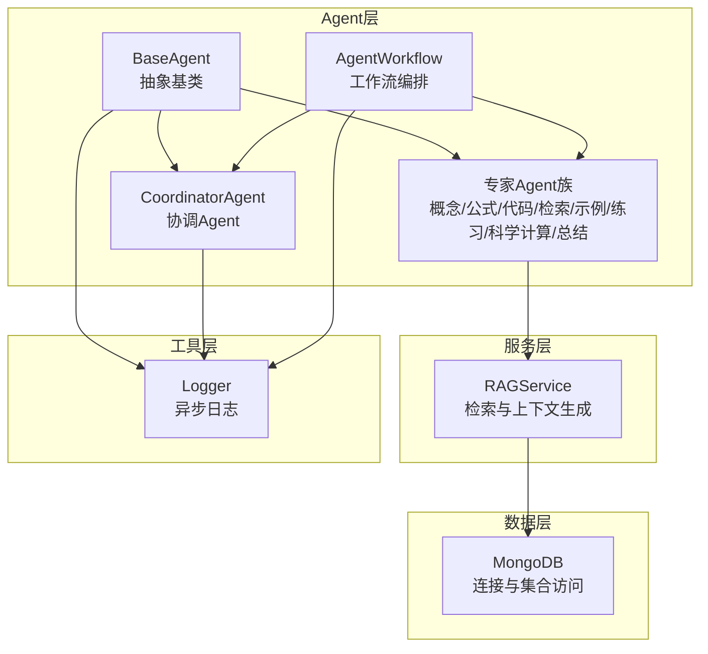
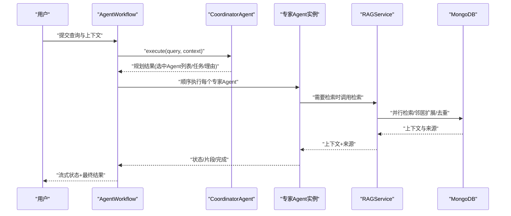
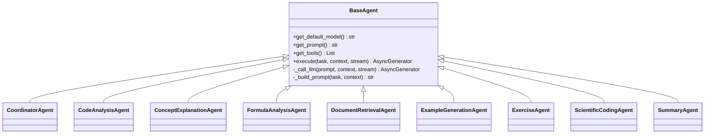
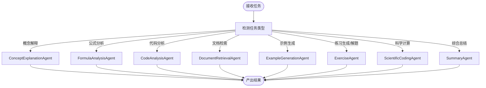
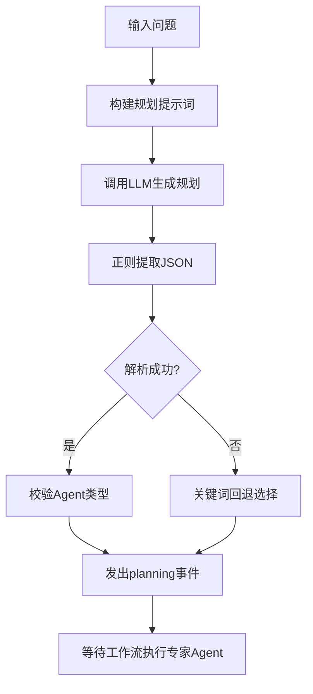
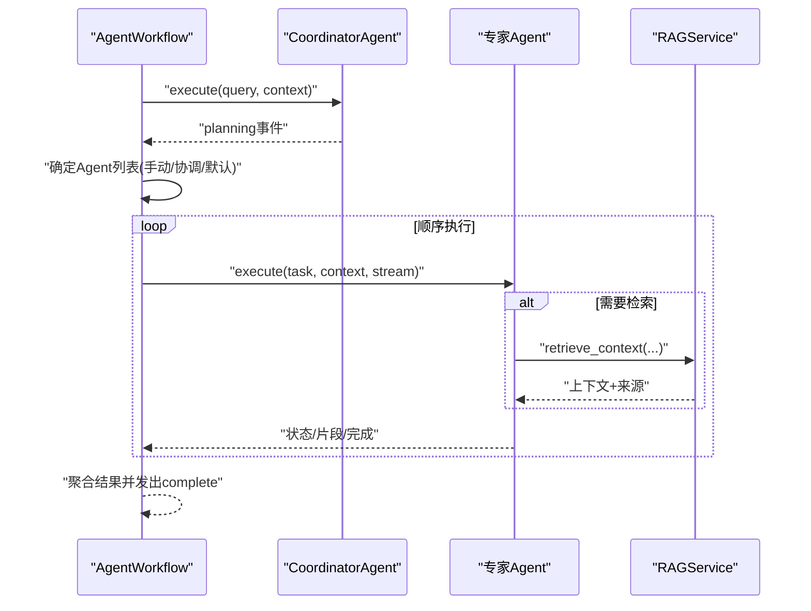
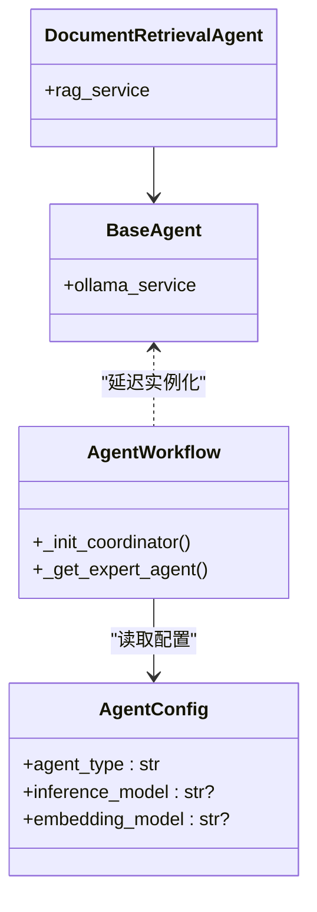
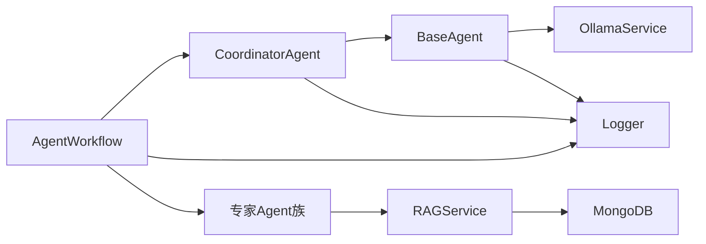

# Agent扩展开发

<cite>
**本文引用的文件**
- [agents/base/base_agent.py](file://agents/base/base_agent.py)
- [agents/coordinator/coordinator_agent.py](file://agents/coordinator/coordinator_agent.py)
- [agents/workflow/agent_workflow.py](file://agents/workflow/agent_workflow.py)
- [models/agent_config.py](file://models/agent_config.py)
- [agents/experts/code_analysis_agent.py](file://agents/experts/code_analysis_agent.py)
- [agents/experts/concept_explanation_agent.py](file://agents/experts/concept_explanation_agent.py)
- [agents/experts/formula_analysis_agent.py](file://agents/experts/formula_analysis_agent.py)
- [agents/experts/document_retrieval_agent.py](file://agents/experts/document_retrieval_agent.py)
- [agents/experts/example_generation_agent.py](file://agents/experts/example_generation_agent.py)
- [agents/experts/summary_agent.py](file://agents/experts/summary_agent.py)
- [agents/experts/exercise_agent.py](file://agents/experts/exercise_agent.py)
- [agents/experts/scientific_coding_agent.py](file://agents/experts/scientific_coding_agent.py)
- [services/rag_service.py](file://services/rag_service.py)
- [database/mongodb.py](file://database/mongodb.py)
- [utils/logger.py](file://utils/logger.py)
</cite>

## 目录
1. [引言](#引言)
2. [项目结构](#项目结构)
3. [核心组件](#核心组件)
4. [架构总览](#架构总览)
5. [详细组件分析](#详细组件分析)
6. [依赖分析](#依赖分析)
7. [性能考虑](#性能考虑)
8. [故障排查指南](#故障排查指南)
9. [结论](#结论)
10. [附录](#附录)

## 引言
本指南面向Advanced RAG Agent扩展开发者，围绕“Agent基类设计模式”“专家Agent开发”“协调Agent工作机制”“Agent工作流编排”“配置管理与动态加载”“性能优化与并发处理”等方面，提供从架构到实现、从流程到最佳实践的系统化文档。读者将学会如何基于BaseAgent抽象类快速扩展新的Agent，如何通过CoordinatorAgent进行任务规划与分发，如何利用AgentWorkflow实现多Agent协作与状态管理，并掌握配置驱动、异步加载与错误处理策略。

## 项目结构
本项目采用按职责分层的组织方式：
- agents：Agent家族，包含基础抽象、专家Agent、协调Agent与工作流编排
- services：服务层，如RAG服务、模型选择、查询理解等
- database：数据库访问与连接池配置
- utils：通用工具，如日志、GPU检测、监控等
- models：配置与数据模型（Pydantic）
- 其他路由、中间件、解析器、嵌入等模块支撑整体能力

图表来源
- [agents/base/base_agent.py:8-122](file://agents/base/base_agent.py#L8-L122)
- [agents/coordinator/coordinator_agent.py:7-252](file://agents/coordinator/coordinator_agent.py#L7-L252)
- [agents/workflow/agent_workflow.py:47-388](file://agents/workflow/agent_workflow.py#L47-L388)
- [services/rag_service.py:8-323](file://services/rag_service.py#L8-L323)
- [database/mongodb.py:92-204](file://database/mongodb.py#L92-L204)
- [utils/logger.py:15-88](file://utils/logger.py#L15-L88)

章节来源
- [agents/base/base_agent.py:1-122](file://agents/base/base_agent.py#L1-L122)
- [agents/workflow/agent_workflow.py:1-388](file://agents/workflow/agent_workflow.py#L1-L388)

## 核心组件
- BaseAgent：定义统一接口与生命周期，提供默认模型选择、系统提示词、LLM调用与提示词构建等通用能力
- 专家Agent族：针对不同任务域的Agent实现，如概念解释、公式分析、代码分析、文档检索、示例生成、练习生成、科学计算、总结等
- CoordinatorAgent：负责任务规划与专家Agent选择，支持JSON规划与关键词回退策略
- AgentWorkflow：多Agent工作流编排器，负责异步加载配置、实例化Agent、顺序执行与状态上报
- RAGService：封装检索与上下文生成，支持动态参数、邻居扩展、去重与Token预算控制
- MongoDB：异步连接池与集合访问，支持运行时配置与连接失败兜底
- Logger：异步文件写入，降低日志对主流程的影响

章节来源
- [agents/base/base_agent.py:8-122](file://agents/base/base_agent.py#L8-L122)
- [agents/coordinator/coordinator_agent.py:7-252](file://agents/coordinator/coordinator_agent.py#L7-L252)
- [agents/workflow/agent_workflow.py:47-388](file://agents/workflow/agent_workflow.py#L47-L388)
- [services/rag_service.py:8-323](file://services/rag_service.py#L8-L323)
- [database/mongodb.py:92-204](file://database/mongodb.py#L92-L204)
- [utils/logger.py:15-88](file://utils/logger.py#L15-L88)

## 架构总览
下图展示从用户查询到多Agent协作、状态上报与结果整合的端到端流程：

图表来源
- [agents/workflow/agent_workflow.py:106-336](file://agents/workflow/agent_workflow.py#L106-L336)
- [agents/coordinator/coordinator_agent.py:55-168](file://agents/coordinator/coordinator_agent.py#L55-L168)
- [agents/experts/document_retrieval_agent.py:25-78](file://agents/experts/document_retrieval_agent.py#L25-L78)
- [services/rag_service.py:34-266](file://services/rag_service.py#L34-L266)
- [database/mongodb.py:92-204](file://database/mongodb.py#L92-L204)

## 详细组件分析

### BaseAgent抽象类与生命周期
- 设计要点
  - 抽象方法：get_default_model、execute
  - 通用能力：get_prompt、get_tools、_call_llm、_build_prompt
  - 生命周期：初始化绑定OllamaService，日志记录模型选择
- 扩展建议
  - 子类只需实现模型选择与提示词，以及异步执行逻辑
  - 使用_yield返回“状态/片段/完成/错误”等事件，便于上层编排

图表来源
- [agents/base/base_agent.py:8-122](file://agents/base/base_agent.py#L8-L122)
- [agents/coordinator/coordinator_agent.py:7-252](file://agents/coordinator/coordinator_agent.py#L7-L252)
- [agents/experts/code_analysis_agent.py:7-79](file://agents/experts/code_analysis_agent.py#L7-L79)
- [agents/experts/concept_explanation_agent.py:7-70](file://agents/experts/concept_explanation_agent.py#L7-L70)
- [agents/experts/formula_analysis_agent.py:8-107](file://agents/experts/formula_analysis_agent.py#L8-L107)
- [agents/experts/document_retrieval_agent.py:8-79](file://agents/experts/document_retrieval_agent.py#L8-L79)
- [agents/experts/example_generation_agent.py:7-68](file://agents/experts/example_generation_agent.py#L7-L68)
- [agents/experts/exercise_agent.py:7-102](file://agents/experts/exercise_agent.py#L7-L102)
- [agents/experts/scientific_coding_agent.py:7-82](file://agents/experts/scientific_coding_agent.py#L7-L82)
- [agents/experts/summary_agent.py:7-87](file://agents/experts/summary_agent.py#L7-L87)

章节来源
- [agents/base/base_agent.py:8-122](file://agents/base/base_agent.py#L8-L122)

### 专家Agent开发模式
- 概念解释Agent：面向物理概念的深入解释，强调定义、意义、公式、示例与关联
- 公式分析Agent：识别LaTeX/行内公式，解释变量与适用条件，必要时给出推导
- 代码分析Agent：检测代码片段，分析功能、关键段、优缺点与改进建议
- 文档检索Agent：调用RAGService检索上下文并总结，标注来源与推荐资源
- 示例生成Agent：提供从简单到复杂的应用示例与完整解题过程
- 练习Agent：自动区分“出题”与“解题”，分别生成题目或提供详细解题步骤
- 科学计算Agent：生成符合学术规范的MATLAB/Python代码，包含注释与可视化
- 总结Agent：汇总多Agent结果，提炼核心要点与学习建议

图表来源
- [agents/experts/concept_explanation_agent.py:25-60](file://agents/experts/concept_explanation_agent.py#L25-L60)
- [agents/experts/formula_analysis_agent.py:26-78](file://agents/experts/formula_analysis_agent.py#L26-L78)
- [agents/experts/code_analysis_agent.py:25-69](file://agents/experts/code_analysis_agent.py#L25-L69)
- [agents/experts/document_retrieval_agent.py:25-69](file://agents/experts/document_retrieval_agent.py#L25-L69)
- [agents/experts/example_generation_agent.py:24-58](file://agents/experts/example_generation_agent.py#L24-L58)
- [agents/experts/exercise_agent.py:28-86](file://agents/experts/exercise_agent.py#L28-L86)
- [agents/experts/scientific_coding_agent.py:31-72](file://agents/experts/scientific_coding_agent.py#L31-L72)
- [agents/experts/summary_agent.py:24-64](file://agents/experts/summary_agent.py#L24-L64)

章节来源
- [agents/experts/concept_explanation_agent.py:7-70](file://agents/experts/concept_explanation_agent.py#L7-L70)
- [agents/experts/formula_analysis_agent.py:8-107](file://agents/experts/formula_analysis_agent.py#L8-L107)
- [agents/experts/code_analysis_agent.py:7-79](file://agents/experts/code_analysis_agent.py#L7-L79)
- [agents/experts/document_retrieval_agent.py:8-79](file://agents/experts/document_retrieval_agent.py#L8-L79)
- [agents/experts/example_generation_agent.py:7-68](file://agents/experts/example_generation_agent.py#L7-L68)
- [agents/experts/exercise_agent.py:7-102](file://agents/experts/exercise_agent.py#L7-L102)
- [agents/experts/scientific_coding_agent.py:7-82](file://agents/experts/scientific_coding_agent.py#L7-L82)
- [agents/experts/summary_agent.py:7-87](file://agents/experts/summary_agent.py#L7-L87)

### 协调Agent工作机制
- 职责：分析用户问题，智能选择所需专家Agent，分配具体任务并说明理由
- 规划流程：构造规划提示词 → LLM生成JSON → 正则提取JSON → 回退关键词匹配
- 输出事件：planning（包含选中Agent列表、任务映射、理由）
- 错误处理：JSON解析失败时使用关键词回退策略，保证最低可用性

图表来源
- [agents/coordinator/coordinator_agent.py:55-168](file://agents/coordinator/coordinator_agent.py#L55-L168)
- [agents/coordinator/coordinator_agent.py:170-213](file://agents/coordinator/coordinator_agent.py#L170-L213)

章节来源
- [agents/coordinator/coordinator_agent.py:7-252](file://agents/coordinator/coordinator_agent.py#L7-L252)

### Agent工作流编排
- 编排器职责：异步加载配置、延迟初始化专家Agent、顺序执行并上报状态
- 配置加载：优先使用上下文generation_config，其次从数据库读取agent_configs
- 执行策略：顺序执行（便于前端实时进度）、流式状态上报（pending/running/completed/error）
- 结果整合：收集各Agent结果，输出complete事件与统计信息

图表来源
- [agents/workflow/agent_workflow.py:106-336](file://agents/workflow/agent_workflow.py#L106-L336)

章节来源
- [agents/workflow/agent_workflow.py:47-388](file://agents/workflow/agent_workflow.py#L47-L388)

### 配置管理、依赖注入与动态加载
- 配置模型：AgentConfig/AgentConfigUpdate/AgentConfigsResponse
- 动态加载：AgentWorkflow按需异步初始化Coordinator与专家Agent，从数据库读取模型配置
- 依赖注入：BaseAgent依赖OllamaService；专家Agent可依赖RAGService；日志统一通过logger

图表来源
- [models/agent_config.py:6-23](file://models/agent_config.py#L6-L23)
- [agents/workflow/agent_workflow.py:18-44](file://agents/workflow/agent_workflow.py#L18-L44)
- [agents/workflow/agent_workflow.py:69-104](file://agents/workflow/agent_workflow.py#L69-L104)
- [agents/base/base_agent.py:23-25](file://agents/base/base_agent.py#L23-L25)
- [agents/experts/document_retrieval_agent.py:39-43](file://agents/experts/document_retrieval_agent.py#L39-L43)

章节来源
- [models/agent_config.py:1-24](file://models/agent_config.py#L1-L24)
- [agents/workflow/agent_workflow.py:18-104](file://agents/workflow/agent_workflow.py#L18-L104)
- [agents/base/base_agent.py:1-122](file://agents/base/base_agent.py#L1-L122)

### 性能优化与并发处理
- 数据库连接池：MongoDB异步客户端配置maxPoolSize/minPoolSize/maxIdleTimeMS等参数，提升高并发稳定性
- 日志异步：QueueListener后台线程写文件，避免阻塞主流程
- 检索优化：RAGService动态参数、并行检索、邻居扩展、去重与Token预算控制
- 工作流顺序执行：在保证前端进度可视化的前提下，避免过度并发导致资源争用

章节来源
- [database/mongodb.py:122-151](file://database/mongodb.py#L122-L151)
- [utils/logger.py:56-82](file://utils/logger.py#L56-L82)
- [services/rag_service.py:11-32](file://services/rag_service.py#L11-L32)
- [services/rag_service.py:100-122](file://services/rag_service.py#L100-L122)

## 依赖分析
- 组件耦合
  - BaseAgent与OllamaService弱耦合，便于替换推理后端
  - 专家Agent对RAGService存在直接依赖（如DocumentRetrievalAgent）
  - CoordinatorAgent与AgentWorkflow通过事件协议松耦合
- 外部依赖
  - MongoDB：配置驱动的连接池与集合访问
  - 日志：异步写入，降低I/O开销
- 循环依赖
  - 未发现循环导入；AgentWorkflow在运行时动态导入专家Agent类

图表来源
- [agents/base/base_agent.py:23-25](file://agents/base/base_agent.py#L23-L25)
- [agents/coordinator/coordinator_agent.py:12-17](file://agents/coordinator/coordinator_agent.py#L12-L17)
- [agents/workflow/agent_workflow.py:7-15](file://agents/workflow/agent_workflow.py#L7-L15)
- [agents/experts/document_retrieval_agent.py:4-5](file://agents/experts/document_retrieval_agent.py#L4-L5)
- [services/rag_service.py:8-9](file://services/rag_service.py#L8-L9)
- [database/mongodb.py:92-93](file://database/mongodb.py#L92-L93)
- [utils/logger.py:15-88](file://utils/logger.py#L15-L88)

章节来源
- [agents/base/base_agent.py:1-122](file://agents/base/base_agent.py#L1-L122)
- [agents/coordinator/coordinator_agent.py:1-252](file://agents/coordinator/coordinator_agent.py#L1-L252)
- [agents/workflow/agent_workflow.py:1-388](file://agents/workflow/agent_workflow.py#L1-L388)
- [services/rag_service.py:1-323](file://services/rag_service.py#L1-L323)
- [database/mongodb.py:1-800](file://database/mongodb.py#L1-L800)
- [utils/logger.py:1-88](file://utils/logger.py#L1-L88)

## 性能考虑
- 连接池与超时：合理设置maxPoolSize/minPoolSize与各类超时，避免高并发下的连接风暴
- 日志降噪：生产环境仅记录警告及以上级别到文件，减少磁盘IO
- 检索参数自适应：根据问题长度与关键词动态调整prefetch_k/final_k，平衡召回与延迟
- Token预算：对拼接后的上下文进行近似token估算与截断，避免prompt过大
- 并发与顺序：工作流顺序执行以保证前端进度，避免过度并发导致资源争用

章节来源
- [database/mongodb.py:122-151](file://database/mongodb.py#L122-L151)
- [utils/logger.py:77-82](file://utils/logger.py#L77-L82)
- [services/rag_service.py:11-32](file://services/rag_service.py#L11-L32)
- [services/rag_service.py:251-260](file://services/rag_service.py#L251-L260)

## 故障排查指南
- 协调Agent规划失败
  - 现象：返回error事件或未选中Agent
  - 排查：检查JSON解析正则、关键词回退逻辑、提示词格式
- 专家Agent执行异常
  - 现象：抛出异常并返回error事件
  - 排查：查看Agent内部try-except日志，确认任务输入与上下文
- 文档检索失败
  - 现象：RAGService检索异常或回退
  - 排查：检查MongoDB连接、集合名称、运行时配置开关
- 数据库连接失败
  - 现象：连接池初始化失败或首次请求重试失败
  - 排查：核对MONGODB_URI/MONGODB_HOST/PORT/用户名密码/认证源

章节来源
- [agents/coordinator/coordinator_agent.py:162-168](file://agents/coordinator/coordinator_agent.py#L162-L168)
- [agents/experts/code_analysis_agent.py:71-77](file://agents/experts/code_analysis_agent.py#L71-L77)
- [services/rag_service.py:294-317](file://services/rag_service.py#L294-L317)
- [database/mongodb.py:154-184](file://database/mongodb.py#L154-L184)

## 结论
通过BaseAgent抽象与专家Agent族的清晰分工，配合CoordinatorAgent的任务规划与AgentWorkflow的工作流编排，系统实现了可扩展、可观测、可配置的多Agent协作框架。借助RAGService与MongoDB的高性能检索与存储，以及异步日志与连接池优化，整体具备良好的工程化落地能力。开发者可在此基础上快速扩展新Agent，完善任务域覆盖，并持续优化性能与稳定性。

## 附录

### 新Agent开发步骤
- 继承BaseAgent，实现get_default_model与get_prompt
- 实现execute方法，按需调用_base_call_llm或_rag_service
- 如需检索，调用RAGService.retrieve_context并总结结果
- 通过yield返回状态事件（如chunk/status/complete/error）

章节来源
- [agents/base/base_agent.py:27-55](file://agents/base/base_agent.py#L27-L55)
- [agents/experts/document_retrieval_agent.py:25-69](file://agents/experts/document_retrieval_agent.py#L25-L69)

### Agent配置参数设置
- 通过AgentConfig模型定义agent_type、inference_model、embedding_model
- AgentWorkflow从数据库读取agent_configs，或使用上下文generation_config
- CoordinatorAgent默认模型可在其get_default_model中指定

章节来源
- [models/agent_config.py:6-23](file://models/agent_config.py#L6-L23)
- [agents/workflow/agent_workflow.py:18-44](file://agents/workflow/agent_workflow.py#L18-L44)
- [agents/coordinator/coordinator_agent.py:15-17](file://agents/coordinator/coordinator_agent.py#L15-L17)

### 集成测试方法
- 单Agent测试：构造最小上下文，验证execute返回的事件序列（planning/状态/完成）
- 协调Agent测试：输入典型问题，验证选中Agent列表与理由
- 工作流测试：模拟完整流程，验证状态上报与最终结果聚合
- 数据库测试：确保Agent配置读取与集合访问正常

章节来源
- [agents/coordinator/coordinator_agent.py:55-168](file://agents/coordinator/coordinator_agent.py#L55-L168)
- [agents/workflow/agent_workflow.py:106-336](file://agents/workflow/agent_workflow.py#L106-L336)
- [database/mongodb.py:196-200](file://database/mongodb.py#L196-L200)