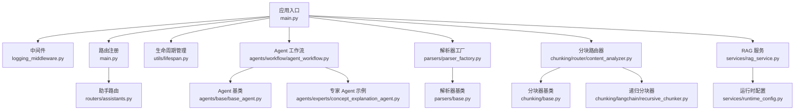
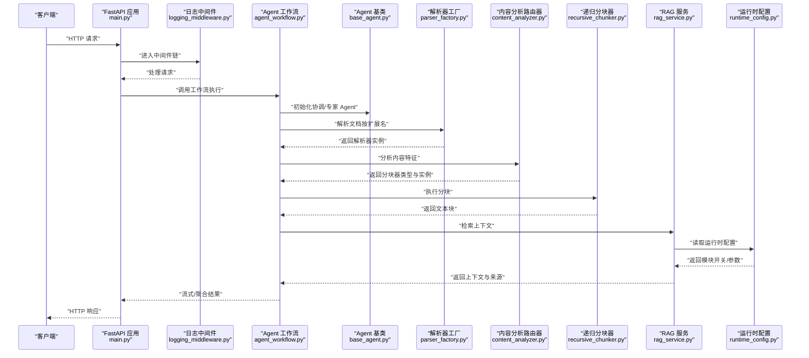
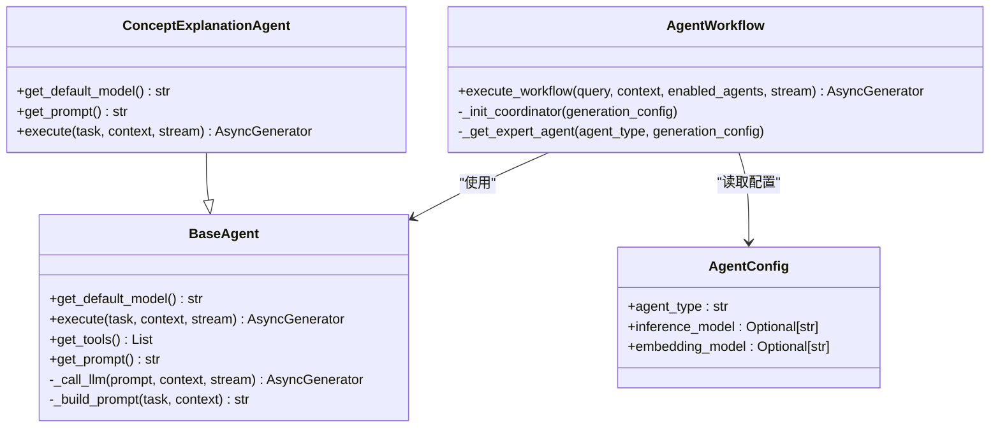
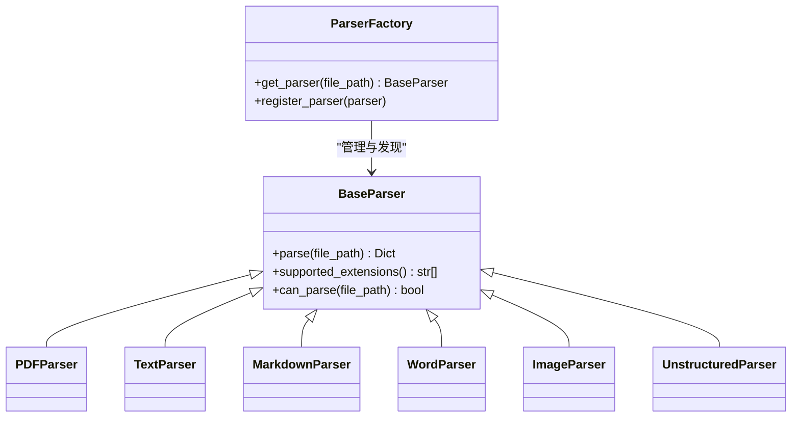
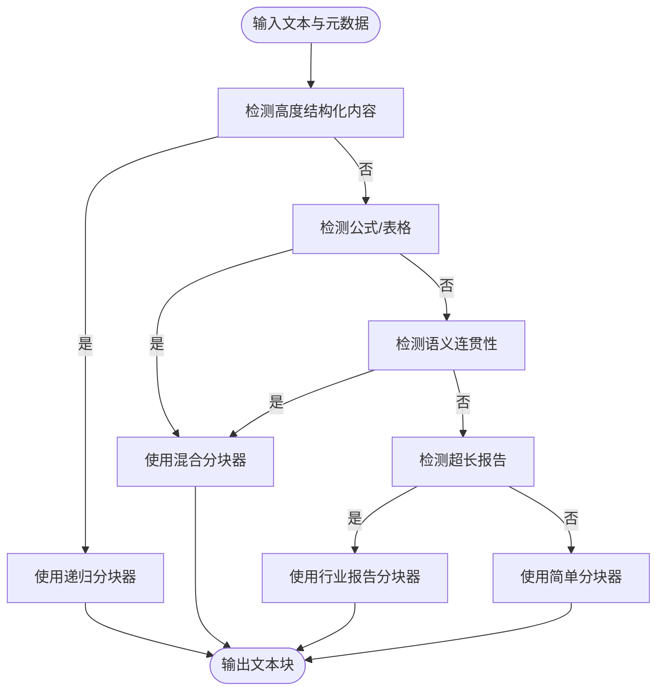
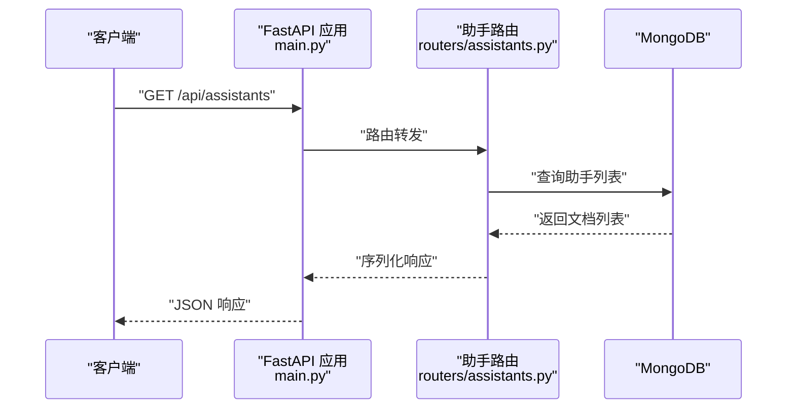
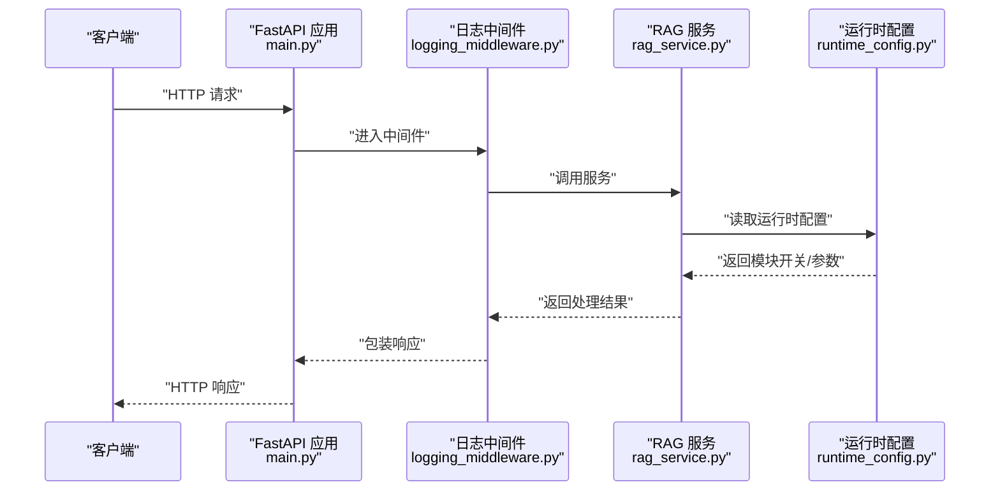
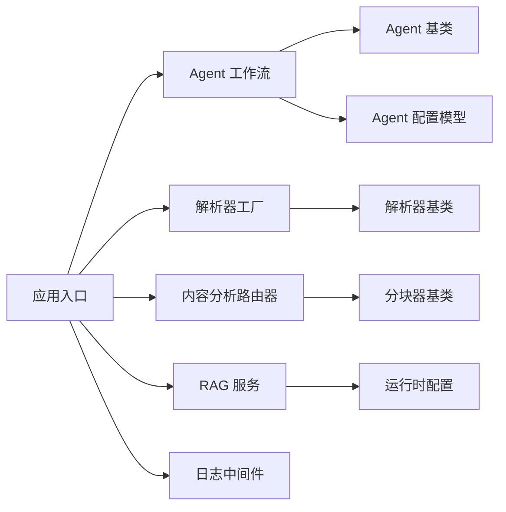

# 扩展开发指南

<cite>
**本文引用的文件**
- [main.py](file://main.py)
- [lifespan.py](file://utils/lifespan.py)
- [logging_middleware.py](file://middleware/logging_middleware.py)
- [base_agent.py](file://agents/base/base_agent.py)
- [agent_workflow.py](file://agents/workflow/agent_workflow.py)
- [agent_config.py](file://models/agent_config.py)
- [concept_explanation_agent.py](file://agents/experts/concept_explanation_agent.py)
- [parser_factory.py](file://parsers/parser_factory.py)
- [base.py](file://parsers/base.py)
- [content_analyzer.py](file://chunking/router/content_analyzer.py)
- [base.py](file://chunking/base.py)
- [recursive_chunker.py](file://chunking/langchain/recursive_chunker.py)
- [rag_service.py](file://services/rag_service.py)
- [runtime_config.py](file://services/runtime_config.py)
- [assistants.py](file://routers/assistants.py)
</cite>

## 目录
1. [引言](#引言)
2. [项目结构](#项目结构)
3. [核心组件](#核心组件)
4. [架构总览](#架构总览)
5. [详细组件分析](#详细组件分析)
6. [依赖分析](#依赖分析)
7. [性能考虑](#性能考虑)
8. [故障排查指南](#故障排查指南)
9. [结论](#结论)
10. [附录](#附录)

## 引言
本指南面向希望为 Advanced RAG 扩展开发的工程师，系统讲解如何在现有架构上进行扩展：Agent 扩展机制（新 Agent 开发模式、工作流集成、配置管理）、插件扩展（解析器扩展、分块策略自定义、工具集成）、API 扩展（新路由开发、数据模型扩展、权限控制）、以及测试、性能、兼容性与发布版本管理的最佳实践。文档以代码为依据，辅以可视化图示，帮助读者快速掌握扩展点的设计原理与实现模式。

## 项目结构
Advanced RAG 采用模块化分层组织，核心模块包括：
- 应用入口与中间件：FastAPI 应用、CORS、日志中间件、静态资源挂载
- Agent 体系：抽象基类、专家 Agent、工作流编排、配置模型
- 解析器与分块：解析器工厂、解析器基类、内容分析路由器、分块器基类与多种实现
- 服务层：RAG 服务、运行时配置、检索服务等
- 路由与模型：API 路由、响应模型
- 数据库与生命周期：MongoDB 连接、应用生命周期管理

图表来源
- [main.py:1-171](file://main.py#L1-L171)
- [logging_middleware.py:1-52](file://middleware/logging_middleware.py#L1-L52)
- [assistants.py:1-127](file://routers/assistants.py#L1-L127)
- [lifespan.py:1-93](file://utils/lifespan.py#L1-L93)
- [agent_workflow.py:1-388](file://agents/workflow/agent_workflow.py#L1-L388)
- [base_agent.py:1-122](file://agents/base/base_agent.py#L1-L122)
- [concept_explanation_agent.py:1-70](file://agents/experts/concept_explanation_agent.py#L1-L70)
- [parser_factory.py:1-58](file://parsers/parser_factory.py#L1-L58)
- [base.py:1-32](file://parsers/base.py#L1-L32)
- [content_analyzer.py:1-300](file://chunking/router/content_analyzer.py#L1-L300)
- [base.py:1-23](file://chunking/base.py#L1-L23)
- [recursive_chunker.py:1-110](file://chunking/langchain/recursive_chunker.py#L1-L110)
- [rag_service.py:1-323](file://services/rag_service.py#L1-L323)
- [runtime_config.py:1-218](file://services/runtime_config.py#L1-L218)

章节来源
- [main.py:1-171](file://main.py#L1-L171)
- [lifespan.py:1-93](file://utils/lifespan.py#L1-L93)

## 核心组件
- 应用入口与生命周期：负责环境变量加载、中间件注册、静态资源挂载、路由注册、异常处理与 Uvicorn 启动参数控制。
- 日志中间件：统一记录请求与性能指标，区分慢请求与错误请求，便于可观测性。
- Agent 体系：抽象基类定义统一接口；工作流编排器负责多 Agent 协作、状态广播与结果聚合；配置模型支撑 Agent 模型选择。
- 解析器与分块：解析器工厂按扩展名选择解析器；内容分析路由器根据内容特征自动路由到合适分块器；分块器基类与具体实现遵循统一接口。
- 服务层：RAG 服务封装检索与上下文拼装；运行时配置提供模块开关与参数调节。
- 路由与模型：API 路由提供只读助手信息；Pydantic 模型定义请求/响应结构。

章节来源
- [main.py:1-171](file://main.py#L1-L171)
- [logging_middleware.py:1-52](file://middleware/logging_middleware.py#L1-L52)
- [base_agent.py:1-122](file://agents/base/base_agent.py#L1-L122)
- [agent_workflow.py:1-388](file://agents/workflow/agent_workflow.py#L1-L388)
- [agent_config.py:1-24](file://models/agent_config.py#L1-L24)
- [parser_factory.py:1-58](file://parsers/parser_factory.py#L1-L58)
- [base.py:1-32](file://parsers/base.py#L1-L32)
- [content_analyzer.py:1-300](file://chunking/router/content_analyzer.py#L1-L300)
- [base.py:1-23](file://chunking/base.py#L1-L23)
- [recursive_chunker.py:1-110](file://chunking/langchain/recursive_chunker.py#L1-L110)
- [rag_service.py:1-323](file://services/rag_service.py#L1-L323)
- [runtime_config.py:1-218](file://services/runtime_config.py#L1-L218)
- [assistants.py:1-127](file://routers/assistants.py#L1-L127)

## 架构总览
下图展示从请求进入应用到 Agent 工作流执行的关键交互路径，以及与解析、分块、检索、配置等模块的耦合关系。

图表来源
- [main.py:1-171](file://main.py#L1-L171)
- [logging_middleware.py:1-52](file://middleware/logging_middleware.py#L1-L52)
- [agent_workflow.py:1-388](file://agents/workflow/agent_workflow.py#L1-L388)
- [base_agent.py:1-122](file://agents/base/base_agent.py#L1-L122)
- [parser_factory.py:1-58](file://parsers/parser_factory.py#L1-L58)
- [content_analyzer.py:1-300](file://chunking/router/content_analyzer.py#L1-L300)
- [recursive_chunker.py:1-110](file://chunking/langchain/recursive_chunker.py#L1-L110)
- [rag_service.py:1-323](file://services/rag_service.py#L1-L323)
- [runtime_config.py:1-218](file://services/runtime_config.py#L1-L218)

## 详细组件分析

### Agent 扩展机制
- 设计原则
  - 继承基类：所有 Agent 必须继承抽象基类，实现默认模型获取与任务执行接口。
  - 统一提示词与 LLM 调用：基类提供系统提示词构建与 LLM 流式生成封装。
  - 工作流编排：工作流编排器负责 Agent 初始化、状态广播、结果聚合与错误处理。
  - 配置管理：Agent 配置模型支持按类型存储推理与嵌入模型，工作流按类型从数据库加载。
- 新 Agent 开发步骤
  - 继承基类并实现必要方法，设置默认模型与系统提示词。
  - 在工作流映射中注册 Agent 类型与构造方式。
  - 在数据库中为该类型配置模型参数，或在运行时传入 generation_config。
- 最佳实践
  - 保持 execute 方法的异步与流式输出，便于前端实时反馈。
  - 在 Agent 内部合理拆分子任务并通过状态事件上报进度。
  - 对异常进行捕获并返回标准化错误事件，避免中断工作流。

图表来源
- [base_agent.py:1-122](file://agents/base/base_agent.py#L1-L122)
- [concept_explanation_agent.py:1-70](file://agents/experts/concept_explanation_agent.py#L1-L70)
- [agent_workflow.py:1-388](file://agents/workflow/agent_workflow.py#L1-L388)
- [agent_config.py:1-24](file://models/agent_config.py#L1-L24)

章节来源
- [base_agent.py:1-122](file://agents/base/base_agent.py#L1-L122)
- [concept_explanation_agent.py:1-70](file://agents/experts/concept_explanation_agent.py#L1-L70)
- [agent_workflow.py:1-388](file://agents/workflow/agent_workflow.py#L1-L388)
- [agent_config.py:1-24](file://models/agent_config.py#L1-L24)

### 插件开发：解析器扩展
- 扩展点
  - 解析器基类：定义 parse 与 supported_extensions 接口。
  - 解析器工厂：集中注册与发现解析器，支持动态扩展。
- 自定义解析器步骤
  - 实现解析器基类接口，返回支持的扩展名列表。
  - 通过工厂注册新解析器，或在工厂初始化阶段追加。
- 兼容性与健壮性
  - 工厂在导入失败时优雅降级，避免阻塞启动。
  - can_parse 基于扩展名判断，避免误判。

图表来源
- [base.py:1-32](file://parsers/base.py#L1-L32)
- [parser_factory.py:1-58](file://parsers/parser_factory.py#L1-L58)

章节来源
- [base.py:1-32](file://parsers/base.py#L1-L32)
- [parser_factory.py:1-58](file://parsers/parser_factory.py#L1-L58)

### 插件开发：分块策略自定义
- 扩展点
  - 分块器基类：统一 chunk 接口。
  - 内容分析路由器：根据内容特征自动选择分块器（代码/论文、公式/表格、语义连贯性、超长报告等）。
  - 具体分块器：递归分块器等，支持延迟初始化与兼容多版本 LangChain。
- 自定义分块器步骤
  - 实现分块器基类接口，提供合理的分块参数与元数据处理。
  - 在内容分析路由器中增加特征检测逻辑与路由策略。
- 性能与稳定性
  - 路由器对初始化失败进行降级处理，保证可用性。
  - 递归分块器对 LangChain 版本做兼容适配。

图表来源
- [content_analyzer.py:1-300](file://chunking/router/content_analyzer.py#L1-L300)
- [base.py:1-23](file://chunking/base.py#L1-L23)
- [recursive_chunker.py:1-110](file://chunking/langchain/recursive_chunker.py#L1-L110)

章节来源
- [content_analyzer.py:1-300](file://chunking/router/content_analyzer.py#L1-L300)
- [base.py:1-23](file://chunking/base.py#L1-L23)
- [recursive_chunker.py:1-110](file://chunking/langchain/recursive_chunker.py#L1-L110)

### 插件开发：工具集成
- 工具集成位置
  - Agent 基类提供 get_tools 接口，默认返回空列表，可在具体 Agent 中重写以暴露 LangChain 工具。
- 集成建议
  - 将工具封装为 LangChain 工具接口，配合 Agent 的系统提示词与上下文传递。
  - 在 Agent 执行过程中通过状态事件上报工具使用情况与中间结果。

章节来源
- [base_agent.py:57-64](file://agents/base/base_agent.py#L57-L64)

### API 扩展开发
- 新路由开发
  - 参考现有路由风格：定义 Pydantic 模型、使用 FastAPI 路由装饰器、依赖 MongoDB 连接校验。
  - 在应用入口注册新路由前缀与标签。
- 数据模型扩展
  - 使用 Pydantic BaseModel 定义请求/响应模型，确保字段类型与默认值清晰。
- 权限控制系统
  - 可复用 require_mongodb 依赖进行后端数据访问鉴权；对外只读接口可保持匿名访问。
- 示例参考
  - 助手信息路由展示了只读列表与详情接口的完整实现。

图表来源
- [main.py:90-98](file://main.py#L90-L98)
- [assistants.py:1-127](file://routers/assistants.py#L1-L127)

章节来源
- [assistants.py:1-127](file://routers/assistants.py#L1-L127)
- [main.py:90-98](file://main.py#L90-L98)

### 服务层扩展与中间件开发
- 服务层扩展
  - RAG 服务封装检索与上下文拼装，支持动态检索参数与运行时配置开关。
  - 运行时配置提供模块开关与参数调节，支持缓存与 TTL 控制。
- 中间件开发
  - 参考日志中间件：统一记录请求、计算处理时间、上报性能监控、添加响应头、异常记录。
  - 可在此基础上扩展鉴权、限流、审计等中间件。

图表来源
- [logging_middleware.py:1-52](file://middleware/logging_middleware.py#L1-L52)
- [rag_service.py:1-323](file://services/rag_service.py#L1-L323)
- [runtime_config.py:1-218](file://services/runtime_config.py#L1-L218)

章节来源
- [rag_service.py:1-323](file://services/rag_service.py#L1-L323)
- [runtime_config.py:1-218](file://services/runtime_config.py#L1-L218)
- [logging_middleware.py:1-52](file://middleware/logging_middleware.py#L1-L52)

## 依赖分析
- 组件内聚与耦合
  - Agent 工作流与 Agent 基类松耦合，通过类型映射与配置加载实现延迟初始化。
  - 解析器与分块器均通过工厂/路由器进行发现与选择，降低模块间直接依赖。
  - 服务层通过运行时配置统一控制模块开关，避免硬编码。
- 外部依赖与集成点
  - LangChain 文本分割器（兼容多版本）。
  - MongoDB（驱动 Motor/PyMongo）。
  - FastAPI（路由、中间件、生命周期）。
- 循环依赖
  - 未见循环导入；模块职责清晰，通过字符串类型注解与延迟导入规避循环。

图表来源
- [agent_workflow.py:1-388](file://agents/workflow/agent_workflow.py#L1-L388)
- [base_agent.py:1-122](file://agents/base/base_agent.py#L1-L122)
- [agent_config.py:1-24](file://models/agent_config.py#L1-L24)
- [parser_factory.py:1-58](file://parsers/parser_factory.py#L1-L58)
- [base.py:1-32](file://parsers/base.py#L1-L32)
- [content_analyzer.py:1-300](file://chunking/router/content_analyzer.py#L1-L300)
- [base.py:1-23](file://chunking/base.py#L1-L23)
- [rag_service.py:1-323](file://services/rag_service.py#L1-L323)
- [runtime_config.py:1-218](file://services/runtime_config.py#L1-L218)
- [main.py:1-171](file://main.py#L1-L171)
- [logging_middleware.py:1-52](file://middleware/logging_middleware.py#L1-L52)

章节来源
- [agent_workflow.py:1-388](file://agents/workflow/agent_workflow.py#L1-L388)
- [parser_factory.py:1-58](file://parsers/parser_factory.py#L1-L58)
- [content_analyzer.py:1-300](file://chunking/router/content_analyzer.py#L1-L300)
- [rag_service.py:1-323](file://services/rag_service.py#L1-L323)
- [runtime_config.py:1-218](file://services/runtime_config.py#L1-L218)
- [main.py:1-171](file://main.py#L1-L171)
- [logging_middleware.py:1-52](file://middleware/logging_middleware.py#L1-L52)

## 性能考虑
- 中间件性能监控：日志中间件记录处理时间并上报性能监控，慢请求与错误请求单独标注。
- 运行时配置：通过模块开关与参数调节控制高耗能模块（如重排、OCR、表解析等）。
- 检索参数动态调整：RAG 服务根据查询特征动态调整检索参数，平衡召回与质量。
- 并行与缓存：工作流与检索采用异步与并行策略，运行时配置支持缓存与 TTL 控制。
- 建议
  - 对长文档与复杂内容优先使用适合的分块策略，避免过度切分导致语义破碎。
  - 在生产环境合理设置 worker 数量与 keep-alive 超时，满足并发与大文件上传需求。

章节来源
- [logging_middleware.py:1-52](file://middleware/logging_middleware.py#L1-L52)
- [runtime_config.py:1-218](file://services/runtime_config.py#L1-L218)
- [rag_service.py:1-323](file://services/rag_service.py#L1-L323)

## 故障排查指南
- 启动与连接
  - 应用生命周期管理对 MongoDB 连接失败进行重试与告警，允许服务启动以便本地调试。
- 日志与异常
  - 全局异常处理器统一捕获未处理异常并返回标准 JSON 响应。
  - 中间件记录慢请求与错误请求，便于定位问题。
- Agent 工作流
  - 工作流对单个 Agent 执行异常进行捕获并返回错误状态，不影响整体流程。
- 解析与分块
  - 解析器工厂在导入失败时优雅降级；分块器初始化失败时记录错误并回退到安全策略。

章节来源
- [lifespan.py:1-93](file://utils/lifespan.py#L1-L93)
- [main.py:110-127](file://main.py#L110-L127)
- [logging_middleware.py:1-52](file://middleware/logging_middleware.py#L1-L52)
- [agent_workflow.py:331-336](file://agents/workflow/agent_workflow.py#L331-L336)
- [parser_factory.py:9-14](file://parsers/parser_factory.py#L9-L14)
- [recursive_chunker.py:60-65](file://chunking/langchain/recursive_chunker.py#L60-L65)

## 结论
Advanced RAG 的扩展开发围绕“抽象基类 + 工作流编排 + 工厂/路由器 + 运行时配置”的设计展开。通过继承 Agent 基类、注册解析器与分块器、在路由中暴露新接口、利用运行时配置控制模块行为，开发者可以在不破坏主干的前提下实现功能增强与定制化。建议在扩展中遵循统一的数据模型、状态事件与错误处理规范，结合性能监控与日志中间件，确保扩展的稳定性与可观测性。

## 附录
- 配置管理与环境变量
  - 应用入口根据环境变量加载不同配置文件，支持生产/开发环境差异化。
- 模块化设计
  - 路由、中间件、服务、Agent、解析器、分块器均按职责独立，通过工厂/路由器进行组合。
- 扩展测试策略
  - 建议针对解析器与分块器编写单元测试，覆盖不同文件类型与内容特征。
  - 针对 Agent 的 execute 方法编写异步流式输出测试，验证状态事件与完成事件。
  - 针对工作流编写集成测试，模拟多 Agent 场景与异常分支。
- 兼容性保证
  - 解析器与分块器对第三方库版本进行兼容适配与降级处理。
  - 运行时配置强制保留基础能力（如嵌入），避免因配置错误导致功能缺失。
- 发布与版本管理
  - 建议在每次扩展变更后更新版本号并在变更日志中记录新增/修改的扩展点与配置项。
  - 对外部依赖（如 LangChain）进行版本锁定或兼容性矩阵维护。

章节来源
- [main.py:20-52](file://main.py#L20-L52)
- [parser_factory.py:9-14](file://parsers/parser_factory.py#L9-L14)
- [recursive_chunker.py:44-62](file://chunking/langchain/recursive_chunker.py#L44-L62)
- [runtime_config.py:121-124](file://services/runtime_config.py#L121-L124)