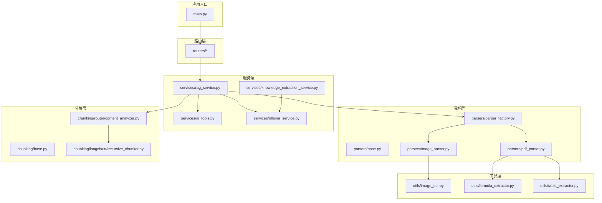
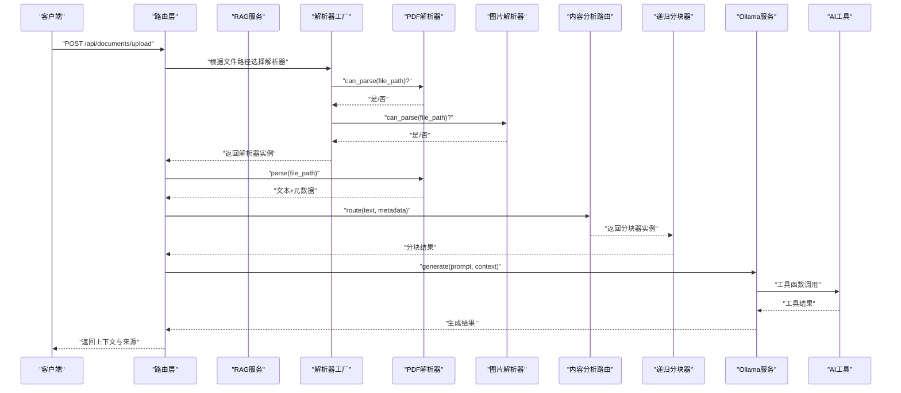
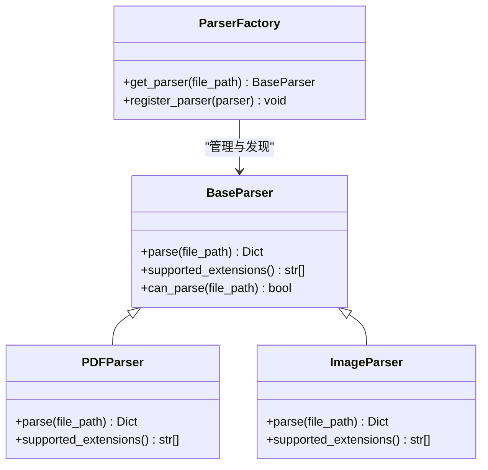
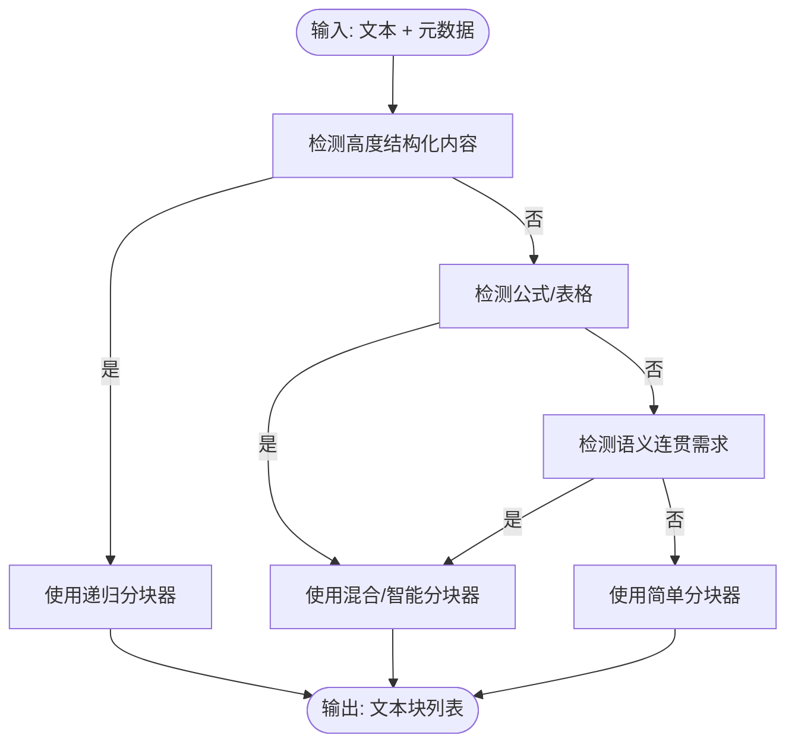
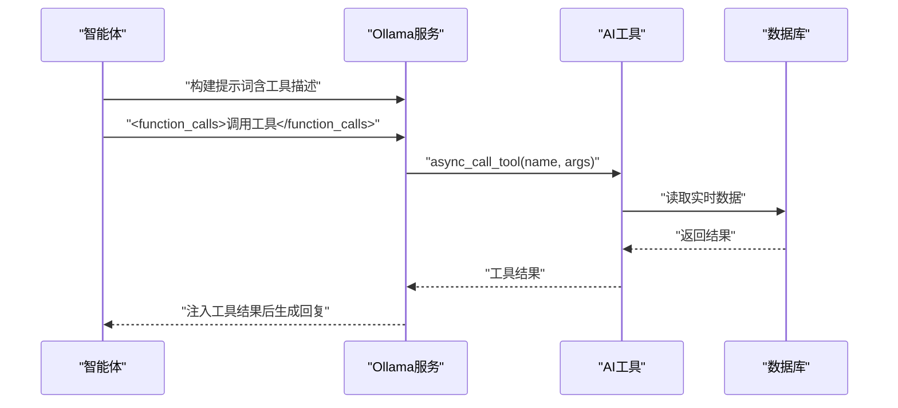
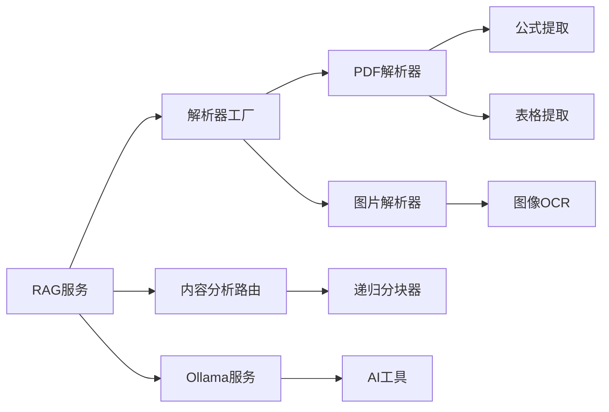

# 插件开发

<cite>
**本文引用的文件**
- [README.md](file://README.md)
- [main.py](file://main.py)
- [parsers/parser_factory.py](file://parsers/parser_factory.py)
- [parsers/base.py](file://parsers/base.py)
- [parsers/pdf_parser.py](file://parsers/pdf_parser.py)
- [parsers/image_parser.py](file://parsers/image_parser.py)
- [chunking/base.py](file://chunking/base.py)
- [chunking/langchain/recursive_chunker.py](file://chunking/langchain/recursive_chunker.py)
- [chunking/router/content_analyzer.py](file://chunking/router/content_analyzer.py)
- [services/ai_tools.py](file://services/ai_tools.py)
- [services/ollama_service.py](file://services/ollama_service.py)
- [services/knowledge_extraction_service.py](file://services/knowledge_extraction_service.py)
- [utils/image_ocr.py](file://utils/image_ocr.py)
- [utils/formula_extractor.py](file://utils/formula_extractor.py)
- [utils/table_extractor.py](file://utils/table_extractor.py)
- [services/rag_service.py](file://services/rag_service.py)
</cite>

## 目录
1. [简介](#简介)
2. [项目结构](#项目结构)
3. [核心组件](#核心组件)
4. [架构总览](#架构总览)
5. [详细组件分析](#详细组件分析)
6. [依赖分析](#依赖分析)
7. [性能考虑](#性能考虑)
8. [故障排查指南](#故障排查指南)
9. [结论](#结论)
10. [附录](#附录)

## 简介
本指南面向 Advanced RAG 插件开发者，围绕三大扩展方向提供系统化实践：解析器扩展（新增文档格式支持与解析器注册）、分块策略扩展（自定义分块算法与内容分析路由）、工具集成扩展（AI工具封装与外部API集成）。文档结合现有代码结构，给出插件类设计、接口实现、配置管理、生命周期与版本兼容性、测试策略、性能优化与错误处理机制，并提供发布与社区贡献流程建议。

## 项目结构
Advanced RAG 采用分层清晰的模块化组织方式：
- 路由层：负责HTTP请求与参数校验
- 服务层：封装业务逻辑（RAG、知识抽取、模型调用、工具函数）
- 解析层：多格式文档解析（PDF、Word、图片OCR等）
- 分块层：智能分块与内容分析路由
- 工具层：OCR、公式提取、表格提取等通用工具
- 数据层：MongoDB、Qdrant、Neo4j、Redis 等
- Web 层：Next.js 前端

图表来源
- [main.py](file://main.py)
- [services/rag_service.py](file://services/rag_service.py)
- [parsers/parser_factory.py](file://parsers/parser_factory.py)
- [parsers/pdf_parser.py](file://parsers/pdf_parser.py)
- [parsers/image_parser.py](file://parsers/image_parser.py)
- [chunking/router/content_analyzer.py](file://chunking/router/content_analyzer.py)
- [chunking/langchain/recursive_chunker.py](file://chunking/langchain/recursive_chunker.py)
- [services/ai_tools.py](file://services/ai_tools.py)
- [services/ollama_service.py](file://services/ollama_service.py)
- [utils/image_ocr.py](file://utils/image_ocr.py)
- [utils/formula_extractor.py](file://utils/formula_extractor.py)
- [utils/table_extractor.py](file://utils/table_extractor.py)

章节来源
- [README.md](file://README.md)
- [main.py](file://main.py)

## 核心组件
- 解析器工厂与基类：统一解析器接口、工厂注册与发现机制
- 分块器基类与内容分析路由：根据内容特征自动选择分块策略
- AI工具与Ollama服务：封装外部API调用与工具函数调用
- 知识抽取服务：基于LLM抽取三元组并写入图数据库
- OCR与公式/表格提取工具：增强PDF与图片解析能力

章节来源
- [parsers/base.py](file://parsers/base.py)
- [parsers/parser_factory.py](file://parsers/parser_factory.py)
- [chunking/base.py](file://chunking/base.py)
- [chunking/router/content_analyzer.py](file://chunking/router/content_analyzer.py)
- [services/ai_tools.py](file://services/ai_tools.py)
- [services/ollama_service.py](file://services/ollama_service.py)
- [services/knowledge_extraction_service.py](file://services/knowledge_extraction_service.py)
- [utils/image_ocr.py](file://utils/image_ocr.py)
- [utils/formula_extractor.py](file://utils/formula_extractor.py)
- [utils/table_extractor.py](file://utils/table_extractor.py)

## 架构总览
下图展示从文档上传到生成回复的关键流程，涵盖解析、分块、检索与生成：

图表来源
- [services/rag_service.py](file://services/rag_service.py)
- [parsers/parser_factory.py](file://parsers/parser_factory.py)
- [parsers/pdf_parser.py](file://parsers/pdf_parser.py)
- [parsers/image_parser.py](file://parsers/image_parser.py)
- [chunking/router/content_analyzer.py](file://chunking/router/content_analyzer.py)
- [chunking/langchain/recursive_chunker.py](file://chunking/langchain/recursive_chunker.py)
- [services/ollama_service.py](file://services/ollama_service.py)
- [services/ai_tools.py](file://services/ai_tools.py)

## 详细组件分析

### 解析器扩展：ParserFactory 模式与新文档格式支持
- 设计要点
  - 基类定义统一接口：parse、supported_extensions、can_parse
  - 工厂类集中管理解析器实例，提供 get_parser 与 register_parser
  - 支持条件导入与可选依赖（如 UnstructuredParser）
- 新增解析器步骤
  - 实现 BaseParser 子类，覆盖 parse 与 supported_extensions
  - 在工厂构建阶段加入解析器实例（或通过 register_parser 动态注册）
  - 在解析器内部集成 OCR、公式/表格提取等增强能力
- 示例参考
  - PDF 解析器：支持文本版/扫描版、OCR、表格与公式分析
  - 图片解析器：基于 PaddleOCR 的 OCR 能力

图表来源
- [parsers/base.py](file://parsers/base.py)
- [parsers/parser_factory.py](file://parsers/parser_factory.py)
- [parsers/pdf_parser.py](file://parsers/pdf_parser.py)
- [parsers/image_parser.py](file://parsers/image_parser.py)

章节来源
- [parsers/base.py](file://parsers/base.py)
- [parsers/parser_factory.py](file://parsers/parser_factory.py)
- [parsers/pdf_parser.py](file://parsers/pdf_parser.py)
- [parsers/image_parser.py](file://parsers/image_parser.py)
- [utils/image_ocr.py](file://utils/image_ocr.py)
- [utils/formula_extractor.py](file://utils/formula_extractor.py)
- [utils/table_extractor.py](file://utils/table_extractor.py)

### 分块策略扩展：内容分析路由与自定义分块算法
- 设计要点
  - BaseChunker 定义 chunk 接口
  - ContentAnalyzer 根据内容特征（结构化、公式/表格、长文档）选择分块器
  - 递归分块器基于 LangChain 文本分割器，具备延迟初始化与降级处理
- 自定义分块算法实现建议
  - 继承 BaseChunker，实现 chunk 方法
  - 在 ContentAnalyzer 中注册并添加特征检测逻辑
  - 通过 metadata 传递解析器提取的结构信息（公式、表格、代码块）
- 分块质量评估
  - 评估指标：块内一致性、跨块语义连贯性、token 预算控制
  - 可视化与统计：记录分块数量、平均长度、重叠比例

图表来源
- [chunking/router/content_analyzer.py](file://chunking/router/content_analyzer.py)
- [chunking/base.py](file://chunking/base.py)
- [chunking/langchain/recursive_chunker.py](file://chunking/langchain/recursive_chunker.py)

章节来源
- [chunking/base.py](file://chunking/base.py)
- [chunking/router/content_analyzer.py](file://chunking/router/content_analyzer.py)
- [chunking/langchain/recursive_chunker.py](file://chunking/langchain/recursive_chunker.py)

### 工具集成开发：AI工具封装、外部API集成与工具链扩展
- AITools 模式
  - 统一注册工具函数（名称、描述、参数Schema、实现）
  - 同步/异步调用封装，参数过滤与错误处理
  - 与 Ollama 提示词链集成，支持工具函数调用结果注入
- 外部API集成
  - OllamaService：流式/非流式生成、提示词构建、工具调用处理
  - 知识抽取服务：调用 Ollama 抽取三元组并写入 Neo4j
- 工具链扩展
  - 在 AITools 中注册新工具，遵循 OpenAI Function Calling Schema
  - 在 OllamaService 中自动注入 assistant_id 等上下文参数

图表来源
- [services/ai_tools.py](file://services/ai_tools.py)
- [services/ollama_service.py](file://services/ollama_service.py)

章节来源
- [services/ai_tools.py](file://services/ai_tools.py)
- [services/ollama_service.py](file://services/ollama_service.py)
- [services/knowledge_extraction_service.py](file://services/knowledge_extraction_service.py)

### 插件开发示例：插件类设计、接口实现与配置管理
- 插件类设计
  - 继承 BaseParser 或 BaseChunker，实现 parse/chunk 接口
  - 提供 supported_extensions 与可选的 can_parse 逻辑
- 接口实现
  - 解析器：返回包含 text 与 metadata 的字典
  - 分块器：返回包含 text、chunk_index、metadata 的块列表
- 配置管理
  - 运行时开关：通过运行时配置控制功能启用/禁用（如 OCR、表格解析）
  - 环境变量：模型地址、超时、日志级别等

章节来源
- [parsers/base.py](file://parsers/base.py)
- [chunking/base.py](file://chunking/base.py)
- [parsers/pdf_parser.py](file://parsers/pdf_parser.py)
- [parsers/image_parser.py](file://parsers/image_parser.py)
- [chunking/router/content_analyzer.py](file://chunking/router/content_analyzer.py)

### 插件生命周期管理、依赖关系处理与版本兼容性
- 生命周期
  - 注册阶段：在工厂或服务初始化时注册插件
  - 发现阶段：通过文件扩展名或内容特征自动选择
  - 运行阶段：参数过滤、错误处理、日志记录
- 依赖关系
  - 可选依赖：Unstructured、LangChain、PaddleOCR 等
  - 兼容性：LangChain 文本分割器的多版本适配
- 版本兼容性
  - 通过 try/except 与降级策略保证功能可用性
  - 运行时配置与环境变量驱动功能开关

章节来源
- [parsers/parser_factory.py](file://parsers/parser_factory.py)
- [chunking/langchain/recursive_chunker.py](file://chunking/langchain/recursive_chunker.py)
- [utils/image_ocr.py](file://utils/image_ocr.py)

### 插件测试策略、性能优化与错误处理机制
- 测试策略
  - 单元测试：解析器与分块器的输入输出验证
  - 集成测试：从上传到检索的端到端流程
  - 性能测试：大文档分块、流式生成吞吐量
- 性能优化
  - 异步与线程池：避免阻塞事件循环（如 Ollama 流式请求）
  - 令牌预算：控制上下文长度，避免超限
  - 延迟初始化：仅在需要时加载第三方库
- 错误处理
  - 工具调用：参数过滤、异常捕获与日志记录
  - OCR/解析：降级返回空文本与元数据，不影响整体流程

章节来源
- [services/ollama_service.py](file://services/ollama_service.py)
- [services/ai_tools.py](file://services/ai_tools.py)
- [utils/image_ocr.py](file://utils/image_ocr.py)
- [services/rag_service.py](file://services/rag_service.py)

## 依赖分析
- 组件耦合
  - 解析器与工具层松耦合：通过元数据传递结构信息
  - 分块器与内容分析路由解耦：策略可替换
  - 服务层对工具层与外部服务的依赖通过封装隔离
- 外部依赖
  - LangChain 文本分割器（可选）
  - PaddleOCR（可选）
  - Ollama、MongoDB、Qdrant、Neo4j（可选）

图表来源
- [parsers/parser_factory.py](file://parsers/parser_factory.py)
- [parsers/pdf_parser.py](file://parsers/pdf_parser.py)
- [parsers/image_parser.py](file://parsers/image_parser.py)
- [chunking/router/content_analyzer.py](file://chunking/router/content_analyzer.py)
- [chunking/langchain/recursive_chunker.py](file://chunking/langchain/recursive_chunker.py)
- [services/rag_service.py](file://services/rag_service.py)
- [services/ollama_service.py](file://services/ollama_service.py)
- [services/ai_tools.py](file://services/ai_tools.py)
- [utils/image_ocr.py](file://utils/image_ocr.py)
- [utils/formula_extractor.py](file://utils/formula_extractor.py)
- [utils/table_extractor.py](file://utils/table_extractor.py)

章节来源
- [parsers/parser_factory.py](file://parsers/parser_factory.py)
- [chunking/router/content_analyzer.py](file://chunking/router/content_analyzer.py)
- [services/rag_service.py](file://services/rag_service.py)
- [services/ollama_service.py](file://services/ollama_service.py)
- [services/ai_tools.py](file://services/ai_tools.py)

## 性能考虑
- I/O 与并发
  - 使用线程池执行同步 I/O（如 requests、OCR），避免阻塞事件循环
  - 异步生成与流式输出，降低首字节延迟
- 资源控制
  - 控制分块大小与重叠，平衡召回与性能
  - 令牌预算与上下文截断，避免超限
- 可观测性
  - 详细的日志记录与错误上报，便于定位瓶颈

## 故障排查指南
- 解析器相关
  - 检查 supported_extensions 与 can_parse 返回值
  - 确认可选依赖是否安装（如 PaddleOCR、LangChain）
- 分块器相关
  - 观察内容特征检测逻辑是否符合预期
  - 检查分块器初始化与降级返回
- 工具与外部服务
  - 校验工具函数名称与参数 Schema
  - 检查 Ollama 服务可达性与超时设置
- 知识抽取
  - Neo4j 连接失败时的冷却策略与日志

章节来源
- [services/ai_tools.py](file://services/ai_tools.py)
- [services/ollama_service.py](file://services/ollama_service.py)
- [services/knowledge_extraction_service.py](file://services/knowledge_extraction_service.py)
- [utils/image_ocr.py](file://utils/image_ocr.py)

## 结论
Advanced RAG 提供了完善的插件扩展框架：解析器工厂模式、内容分析路由、AI工具与外部服务封装，以及丰富的 OCR、公式与表格提取工具。开发者可据此快速扩展新文档格式、自定义分块策略与工具函数，同时通过运行时配置与降级策略保障稳定性与性能。

## 附录
- 发布流程建议
  - 单元测试与集成测试通过
  - 更新文档与 CHANGELOG
  - 提交 PR 并遵循贡献指南
- 社区贡献
  - Fork 仓库、创建功能分支、提交更改并发起 PR
  - 遵循行为准则与代码规范

章节来源
- [README.md](file://README.md)