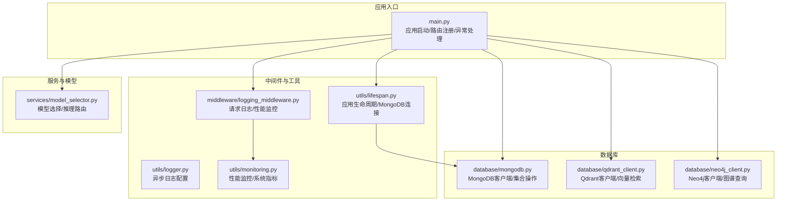
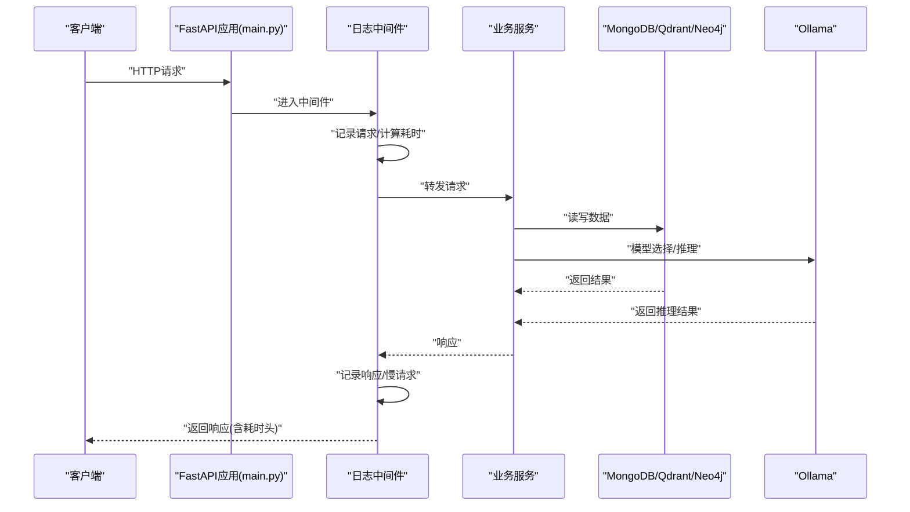
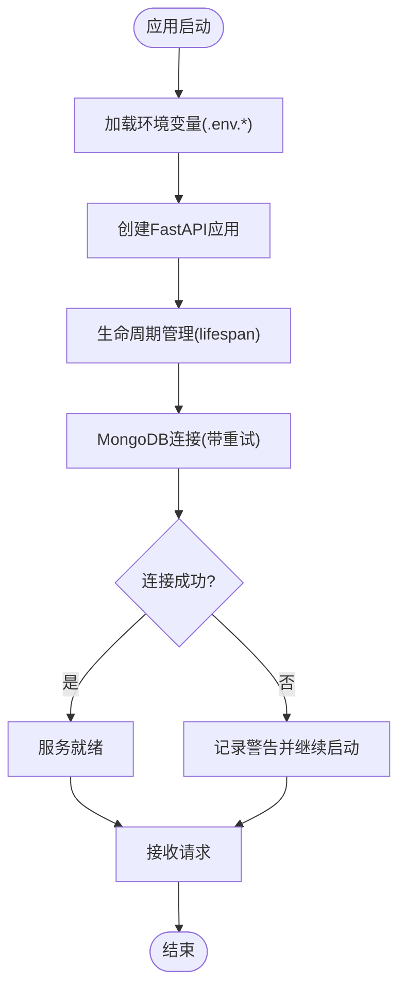
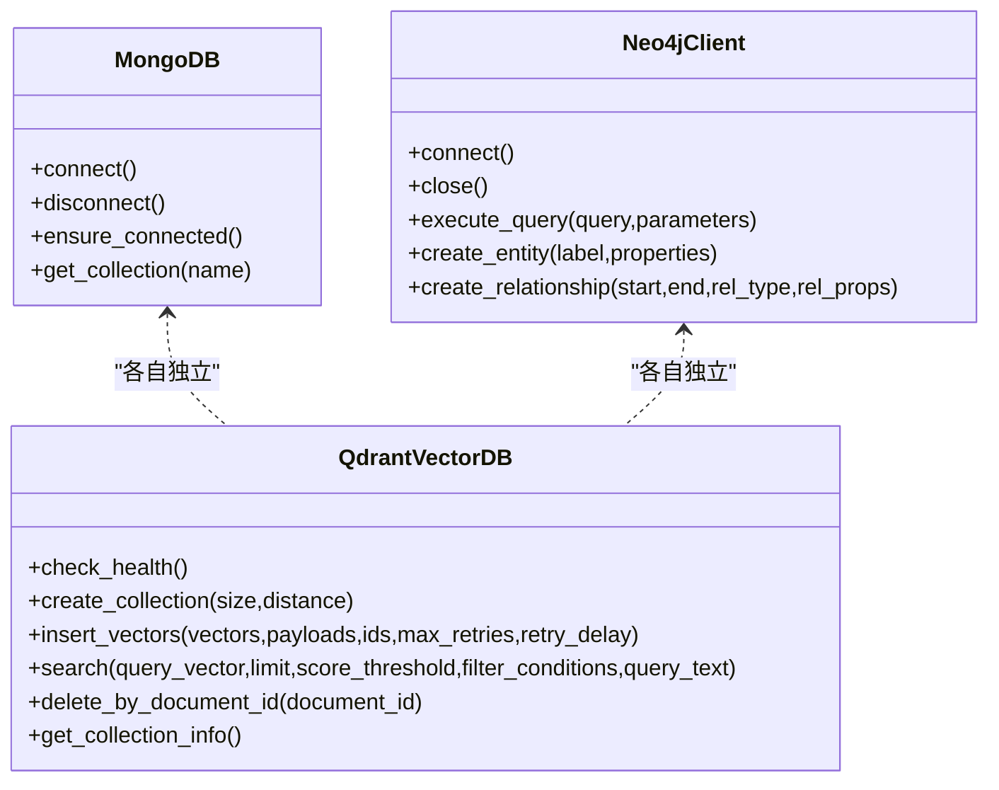
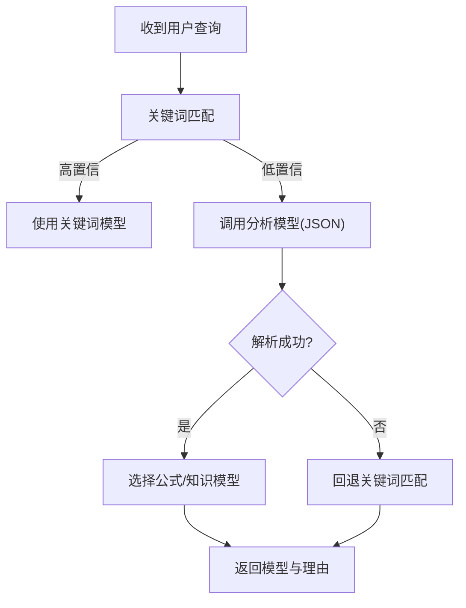
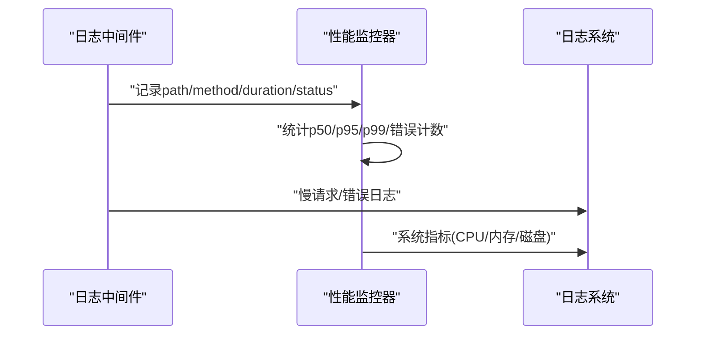
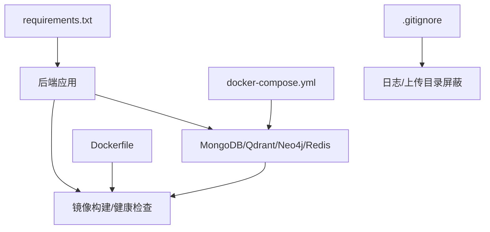

# 故障排除

<cite>
**本文引用的文件**   
- [main.py](file://main.py)
- [requirements.txt](file://requirements.txt)
- [docker-compose.yml](file://docker-compose.yml)
- [Dockerfile](file://Dockerfile)
- [README.md](file://README.md)
- [utils/logger.py](file://utils/logger.py)
- [utils/monitoring.py](file://utils/monitoring.py)
- [utils/lifespan.py](file://utils/lifespan.py)
- [middleware/logging_middleware.py](file://middleware/logging_middleware.py)
- [database/mongodb.py](file://database/mongodb.py)
- [database/qdrant_client.py](file://database/qdrant_client.py)
- [database/neo4j_client.py](file://database/neo4j_client.py)
- [services/model_selector.py](file://services/model_selector.py)
- [.gitignore](file://.gitignore)
</cite>

## 目录
1. [简介](#简介)
2. [项目结构](#项目结构)
3. [核心组件](#核心组件)
4. [架构总览](#架构总览)
5. [详细组件分析](#详细组件分析)
6. [依赖分析](#依赖分析)
7. [性能考量](#性能考量)
8. [故障排除指南](#故障排除指南)
9. [结论](#结论)
10. [附录](#附录)

## 简介
本指南面向运维与开发人员，聚焦 Advanced RAG 项目的常见问题定位与解决，涵盖启动问题、数据库连接问题、模型加载问题、性能问题的系统化排查方法。文档提供日志分析、调试策略、监控与告警配置、环境差异与跨平台兼容性处理，以及问题上报与社区支持流程。

## 项目结构
后端基于 FastAPI，采用模块化分层设计：路由层、服务层、数据库层、工具层与中间件层。数据库包含 MongoDB、Qdrant、Neo4j；模型推理依赖 Ollama；日志与性能监控由工具模块统一支撑。

**图表来源**
- [main.py:55-127](file://main.py#L55-L127)
- [middleware/logging_middleware.py:8-52](file://middleware/logging_middleware.py#L8-L52)
- [utils/logger.py:15-88](file://utils/logger.py#L15-L88)
- [utils/monitoring.py:13-185](file://utils/monitoring.py#L13-L185)
- [utils/lifespan.py:28-93](file://utils/lifespan.py#L28-L93)
- [database/mongodb.py:92-204](file://database/mongodb.py#L92-L204)
- [database/qdrant_client.py:18-139](file://database/qdrant_client.py#L18-L139)
- [database/neo4j_client.py:6-104](file://database/neo4j_client.py#L6-L104)
- [services/model_selector.py:10-206](file://services/model_selector.py#L10-L206)

**章节来源**
- [main.py:15-127](file://main.py#L15-L127)
- [README.md:55-70](file://README.md#L55-L70)

## 核心组件
- 应用入口与路由：负责环境变量加载、CORS、静态资源挂载、路由注册与全局异常处理。
- 生命周期管理：启动时对 MongoDB 进行带重试连接，失败不阻断服务，首次请求可再次尝试。
- 请求日志与性能监控：中间件记录请求/响应、慢请求与错误，并将耗时写入响应头。
- 数据库客户端：MongoDB（异步/同步）、Qdrant（gRPC 优先，带重试与自动重建）、Neo4j（容器内 URI 兼容）。
- 模型选择：基于关键词与轻量模型快速分流到公式/知识模型，降低推理成本。
- 日志与监控：异步文件写入、生产环境日志降噪、系统 CPU/内存/磁盘指标采集。

**章节来源**
- [main.py:20-127](file://main.py#L20-L127)
- [utils/lifespan.py:8-26](file://utils/lifespan.py#L8-L26)
- [middleware/logging_middleware.py:8-52](file://middleware/logging_middleware.py#L8-L52)
- [utils/monitoring.py:13-185](file://utils/monitoring.py#L13-L185)
- [database/mongodb.py:92-204](file://database/mongodb.py#L92-L204)
- [database/qdrant_client.py:18-139](file://database/qdrant_client.py#L18-L139)
- [database/neo4j_client.py:6-104](file://database/neo4j_client.py#L6-L104)
- [services/model_selector.py:10-206](file://services/model_selector.py#L10-L206)
- [utils/logger.py:15-88](file://utils/logger.py#L15-L88)

## 架构总览
下图展示应用启动、请求处理、数据库与外部服务交互的关键路径。

**图表来源**
- [main.py:90-99](file://main.py#L90-L99)
- [middleware/logging_middleware.py:8-52](file://middleware/logging_middleware.py#L8-L52)
- [database/mongodb.py:207-223](file://database/mongodb.py#L207-L223)
- [database/qdrant_client.py:336-414](file://database/qdrant_client.py#L336-L414)
- [database/neo4j_client.py:40-62](file://database/neo4j_client.py#L40-L62)
- [services/model_selector.py:51-132](file://services/model_selector.py#L51-L132)

## 详细组件分析

### 启动与生命周期
- 环境变量加载顺序：优先加载环境特定 .env 文件，其次默认 .env，再尝试项目根目录 .env。
- 应用生命周期：启动时对 MongoDB 进行最多三次连接重试，失败不阻断服务；首次请求可再次尝试连接。
- 异常处理：全局捕获未处理异常，记录上下文并返回统一错误响应。

**图表来源**
- [main.py:20-53](file://main.py#L20-L53)
- [utils/lifespan.py:8-26](file://utils/lifespan.py#L8-L26)
- [main.py:110-127](file://main.py#L110-L127)

**章节来源**
- [main.py:20-53](file://main.py#L20-L53)
- [utils/lifespan.py:8-26](file://utils/lifespan.py#L8-L26)
- [main.py:110-127](file://main.py#L110-L127)

### 数据库连接与一致性
- MongoDB：支持 MONGODB_URI 或分离的 HOST/PORT/用户名密码；连接池参数可调；启动 ping 校验；首次请求可兜底重连。
- Qdrant：优先 gRPC（端口 6334），避免 httpx 导致的 502；自动健康检查与重试；维度不匹配时自动重建集合。
- Neo4j：容器内 URI 自动替换为 host.docker.internal；连接失败记录错误并保持静默。

**图表来源**
- [database/mongodb.py:92-204](file://database/mongodb.py#L92-L204)
- [database/qdrant_client.py:18-139](file://database/qdrant_client.py#L18-L139)
- [database/neo4j_client.py:6-104](file://database/neo4j_client.py#L6-L104)

**章节来源**
- [database/mongodb.py:92-204](file://database/mongodb.py#L92-L204)
- [database/qdrant_client.py:18-139](file://database/qdrant_client.py#L18-L139)
- [database/neo4j_client.py:6-104](file://database/neo4j_client.py#L6-L104)

### 模型加载与推理
- 模型选择：先快速关键词匹配，再调用轻量模型进行 JSON 输出解析；失败回退关键词匹配。
- Ollama 基础 URL 替换：容器内将 localhost 替换为 127.0.0.1，避免 DNS 解析问题。
- 超时与稳定性：选择模型请求设置短超时，保证快速分流。

**图表来源**
- [services/model_selector.py:51-132](file://services/model_selector.py#L51-L132)
- [services/model_selector.py:133-201](file://services/model_selector.py#L133-L201)

**章节来源**
- [services/model_selector.py:10-206](file://services/model_selector.py#L10-L206)

### 性能监控与慢请求检测
- 中间件记录请求/响应、慢请求与错误；将处理时间写入响应头。
- 全局性能监控器统计各端点平均/分位耗时、错误计数与系统指标（CPU/内存/磁盘）。
- 生产环境日志降噪，减少 INFO 级别输出，提升可观测性。

**图表来源**
- [middleware/logging_middleware.py:8-52](file://middleware/logging_middleware.py#L8-L52)
- [utils/monitoring.py:13-185](file://utils/monitoring.py#L13-L185)
- [utils/logger.py:77-82](file://utils/logger.py#L77-L82)

**章节来源**
- [middleware/logging_middleware.py:8-52](file://middleware/logging_middleware.py#L8-L52)
- [utils/monitoring.py:13-185](file://utils/monitoring.py#L13-L185)
- [utils/logger.py:77-82](file://utils/logger.py#L77-L82)

## 依赖分析
- Python 依赖集中在 requirements.txt，包含 FastAPI、Uvicorn、MongoDB/Motor、Qdrant、Neo4j、LangChain、PaddleOCR（本地 vendor 安装）等。
- Dockerfile 与 docker-compose.yml 提供本地开发数据库集群与健康检查；Dockerfile 中内置镜像源与健康检查命令。
- .gitignore 屏蔽日志与上传目录，避免误提交。

**图表来源**
- [requirements.txt:1-42](file://requirements.txt#L1-L42)
- [docker-compose.yml:1-96](file://docker-compose.yml#L1-L96)
- [Dockerfile:1-95](file://Dockerfile#L1-L95)
- [.gitignore:92-98](file://.gitignore#L92-L98)

**章节来源**
- [requirements.txt:1-42](file://requirements.txt#L1-L42)
- [docker-compose.yml:1-96](file://docker-compose.yml#L1-L96)
- [Dockerfile:1-95](file://Dockerfile#L1-L95)
- [.gitignore:92-98](file://.gitignore#L92-L98)

## 性能考量
- 连接池与超时：MongoDB 连接池参数可调；Qdrant 优先 gRPC 并带重试；模型选择请求短超时。
- 日志与监控：异步文件写入、生产降噪、慢请求标记与系统指标采集。
- 启停策略：生产环境多 worker、禁用 reload；开发环境单 worker、启用 reload。

**章节来源**
- [database/mongodb.py:122-151](file://database/mongodb.py#L122-L151)
- [database/qdrant_client.py:66-96](file://database/qdrant_client.py#L66-L96)
- [services/model_selector.py:18-24](file://services/model_selector.py#L18-L24)
- [utils/logger.py:77-82](file://utils/logger.py#L77-L82)
- [main.py:142-171](file://main.py#L142-L171)

## 故障排除指南

### 启动问题
- 症状
  - 服务无法启动或立即退出。
  - 环境变量未生效，端口占用。
- 诊断步骤
  - 检查环境变量文件加载顺序与路径：优先 .env.production 或 .env.development，其次 .env，最后项目根目录 .env。
  - 查看启动日志输出，确认监听地址/端口、worker 数量、reload 状态。
  - 确认端口未被占用，必要时调整 PORT/HOST。
- 解决方案
  - 按顺序准备 .env 文件，确保关键变量（如 MONGODB_URI、QDRANT_URL、OLLAMA_BASE_URL）正确。
  - 生产环境使用 Docker Compose 或镜像，开发环境使用 uvicorn --reload。
  - 如需自定义日志级别，设置 LOG_LEVEL；如需自定义日志文件路径，设置 LOG_FILE。

**章节来源**
- [main.py:20-53](file://main.py#L20-L53)
- [main.py:129-171](file://main.py#L129-L171)
- [README.md:125-167](file://README.md#L125-L167)
- [utils/logger.py:15-21](file://utils/logger.py#L15-L21)

### 数据库连接问题
- MongoDB
  - 症状：启动时连接失败，服务仍启动但部分接口不可用；首次请求报 503。
  - 诊断：查看 MongoDB 连接字符串、认证信息、数据库名、连接池参数；确认容器/主机网络可达。
  - 解决：修正 .env 中 MONGODB_URI 或分离的 HOST/PORT/用户名密码；如在容器内访问宿主，使用 host.docker.internal 或 127.0.0.1；调整连接池参数。
- Qdrant
  - 症状：HTTP 访问返回 502；gRPC 连接不稳定。
  - 诊断：确认 Qdrant 地址与端口；优先使用 gRPC（6334）；检查 API key 与本地 HTTP 连接的安全警告。
  - 解决：将 QDRANT_URL 改为 gRPC 端口或 HTTPS；如需 HTTP，确保使用 gRPC 以规避 httpx 问题；集合维度不匹配时自动重建。
- Neo4j
  - 症状：连接失败或超时。
  - 诊断：确认 URI、用户名、密码；容器内自动替换 localhost 为 host.docker.internal。
  - 解决：修正 .env 中 NEO4J_URI/USER/PASSWORD；确保 bolt 端口开放。

**章节来源**
- [utils/lifespan.py:8-26](file://utils/lifespan.py#L8-L26)
- [database/mongodb.py:99-184](file://database/mongodb.py#L99-L184)
- [database/qdrant_client.py:66-139](file://database/qdrant_client.py#L66-L139)
- [database/neo4j_client.py:16-38](file://database/neo4j_client.py#L16-L38)

### 模型加载问题
- 症状：模型选择失败、推理超时或返回异常。
- 诊断：检查 Ollama 基础 URL、容器内 localhost 替换、超时设置；确认分析模型与目标模型名称。
- 解决：将 OLLAMA_BASE_URL 中的 localhost 替换为 127.0.0.1；缩短模型选择请求超时；确保模型已拉取并可用。

**章节来源**
- [services/model_selector.py:14-24](file://services/model_selector.py#L14-L24)
- [services/model_selector.py:84-132](file://services/model_selector.py#L84-L132)

### 性能问题
- 症状：请求响应慢、CPU/内存占用高、慢请求频繁。
- 诊断：查看中间件日志中的慢请求标记与处理时间头；检查性能监控统计（p50/p95/p99）与系统指标。
- 解决：优化数据库查询与索引；调整连接池参数；减少日志量（生产降噪）；必要时扩容 worker 数量。

**章节来源**
- [middleware/logging_middleware.py:34-50](file://middleware/logging_middleware.py#L34-L50)
- [utils/monitoring.py:49-112](file://utils/monitoring.py#L49-L112)
- [utils/logger.py:77-82](file://utils/logger.py#L77-L82)

### API 调用异常
- 症状：HTTP 4xx/5xx，响应体包含错误信息。
- 诊断：查看全局异常处理器记录的错误日志与请求上下文；检查慢请求与错误计数。
- 解决：根据错误日志定位具体端点与参数；修复上游依赖（数据库/模型服务）；必要时增加重试与熔断。

**章节来源**
- [main.py:110-127](file://main.py#L110-L127)
- [middleware/logging_middleware.py:46-50](file://middleware/logging_middleware.py#L46-L50)

### 内存不足
- 症状：进程 OOM、频繁 GC、响应缓慢。
- 诊断：查看系统指标中的内存使用与进程内存；检查日志中的慢请求与错误。
- 解决：降低并发连接数与连接池大小；优化查询与批处理；增加系统内存或容器资源限制。

**章节来源**
- [utils/monitoring.py:78-112](file://utils/monitoring.py#L78-L112)

### 系统监控与告警配置
- 日志配置：设置 LOG_LEVEL 与 LOG_FILE；生产环境自动降噪。
- 性能监控：开启中间件与性能监控器；定期采集系统指标。
- 健康检查：Dockerfile 中 HEALTHCHECK 访问 /health；Compose 中数据库服务自带健康检查。
- 告警建议：基于慢请求阈值、错误率阈值、CPU/内存/磁盘使用率阈值触发告警。

**章节来源**
- [utils/logger.py:15-88](file://utils/logger.py#L15-L88)
- [utils/monitoring.py:13-185](file://utils/monitoring.py#L13-L185)
- [Dockerfile:91-95](file://Dockerfile#L91-L95)
- [docker-compose.yml:18-24](file://docker-compose.yml#L18-L24)

### 环境差异与跨平台兼容性
- Docker 容器内 localhost 与 host.docker.internal 的映射；容器内自动替换 Neo4j URI。
- Windows/Linux/macOS 的文件路径与依赖差异（如 ffmpeg、LibreOffice）。
- 环境变量优先级与 .env 文件位置差异。

**章节来源**
- [database/neo4j_client.py:20-26](file://database/neo4j_client.py#L20-L26)
- [README.md:107-124](file://README.md#L107-L124)
- [main.py:20-53](file://main.py#L20-L53)

### 调试策略
- 开发调试：使用 uvicorn --reload；开启 DEBUG 级别日志；利用中间件慢请求标记。
- 生产调试：降低日志级别（生产降噪）；通过性能监控统计定位热点端点；使用响应头 X-Process-Time 分析耗时。
- 性能分析：结合 p50/p95/p99 与系统指标，定位瓶颈；必要时启用 gRPC 与连接池优化。

**章节来源**
- [main.py:162-171](file://main.py#L162-L171)
- [middleware/logging_middleware.py:34-44](file://middleware/logging_middleware.py#L34-L44)
- [utils/monitoring.py:49-112](file://utils/monitoring.py#L49-L112)

### 问题上报与社区支持
- 提交 Issue 或 Pull Request 前，准备以下信息：
  - 环境信息（操作系统、Python 版本、依赖版本）
  - .env 关键配置片段（脱敏敏感信息）
  - 相关日志片段（含时间戳与端点）
  - 复现步骤与期望/实际结果
- 参考项目文档与贡献指南获取更多信息。

**章节来源**
- [README.md:255-290](file://README.md#L255-L290)

## 结论
通过系统化的日志与监控、健壮的数据库连接策略、合理的模型选择与超时控制，Advanced RAG 能够在复杂环境下保持稳定与高性能。遇到问题时，建议按“启动—数据库—模型—性能”的顺序逐项排查，并结合日志与监控数据快速定位根因。

## 附录
- 常用环境变量参考
  - 应用：ENVIRONMENT、API_HOST、API_PORT、LOG_LEVEL、LOG_FILE
  - 数据库：MONGODB_URI、QDRANT_URL、NEO4J_URI、NEO4J_USER、NEO4J_PASSWORD
  - 推理：OLLAMA_BASE_URL、OLLAMA_MODEL、OLLAMA_EMBEDDING_MODEL
- 健康检查
  - 应用：/health（Dockerfile HEALTHCHECK）
  - 数据库：MongoDB/Redis 健康检查（Compose）

**章节来源**
- [README.md:125-167](file://README.md#L125-L167)
- [Dockerfile:91-95](file://Dockerfile#L91-L95)
- [docker-compose.yml:18-24](file://docker-compose.yml#L18-L24)