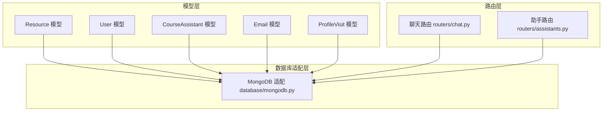
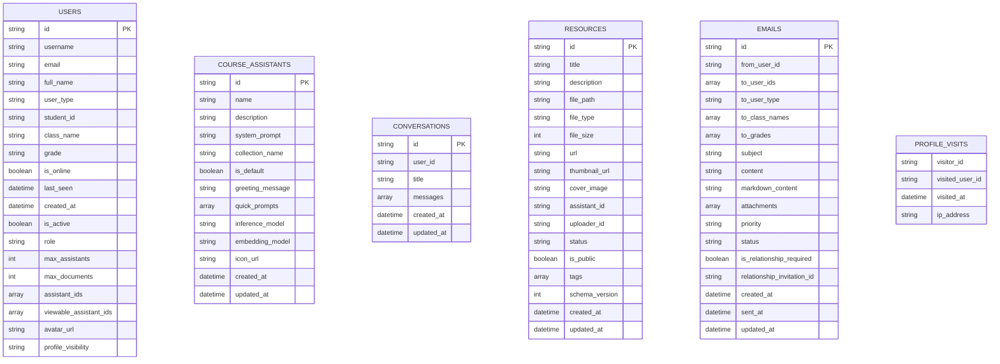
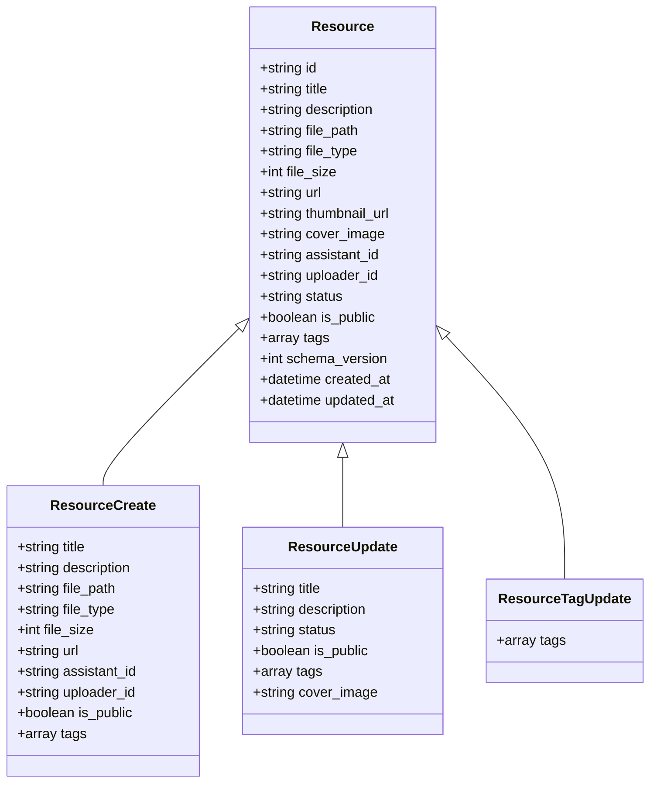
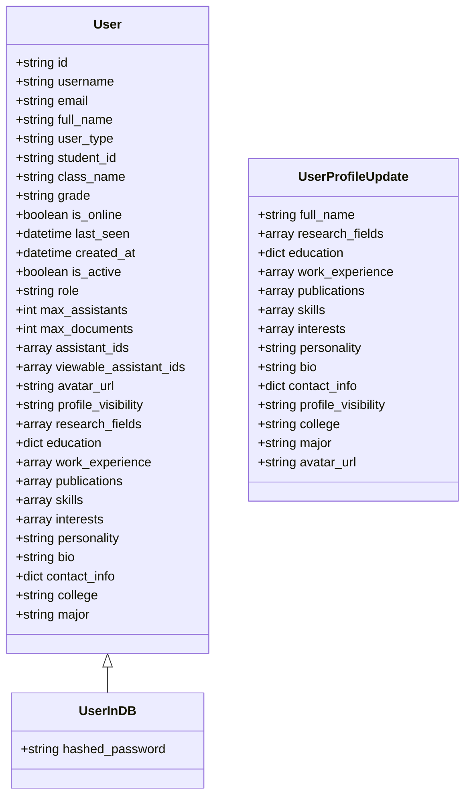
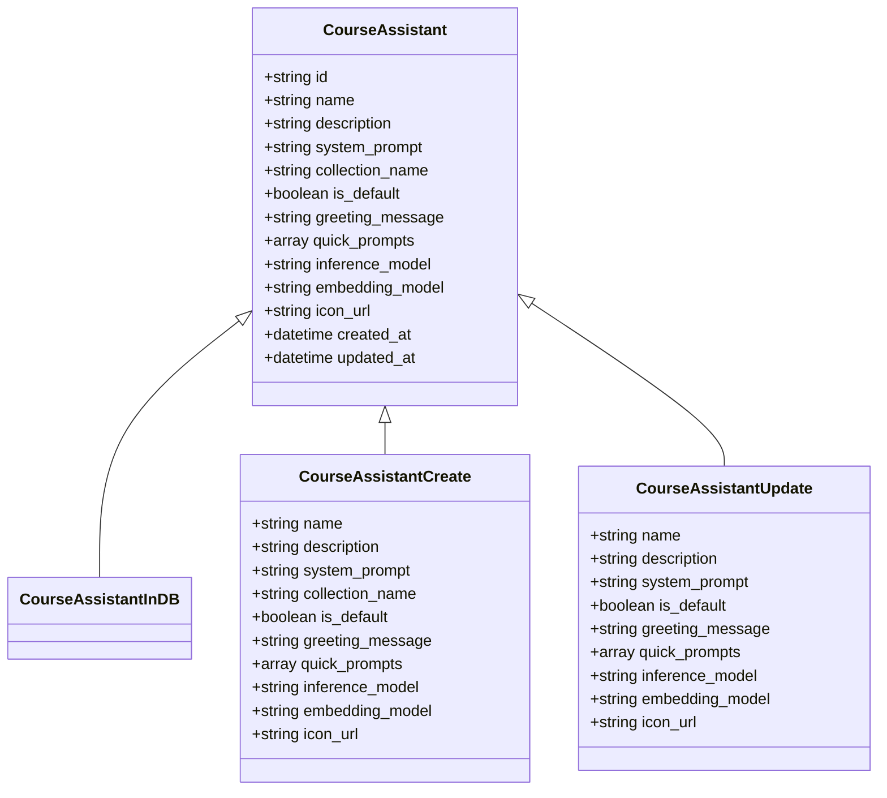
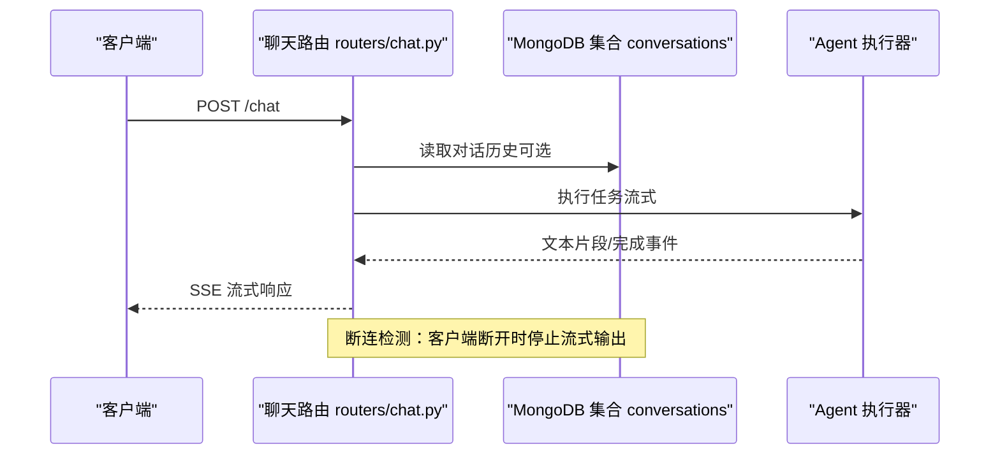
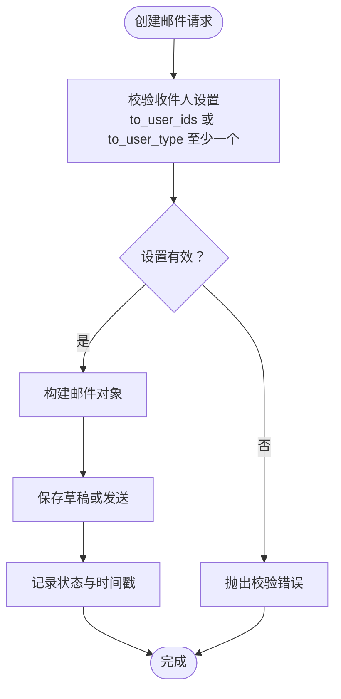
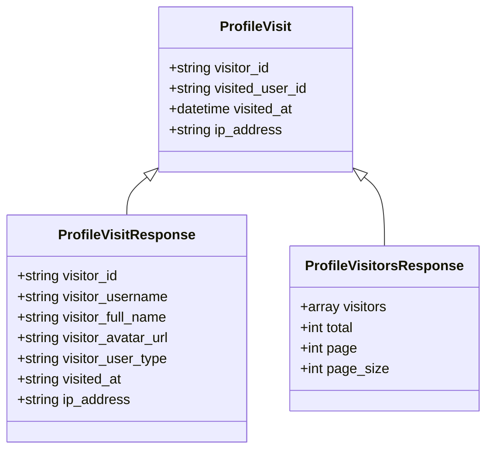
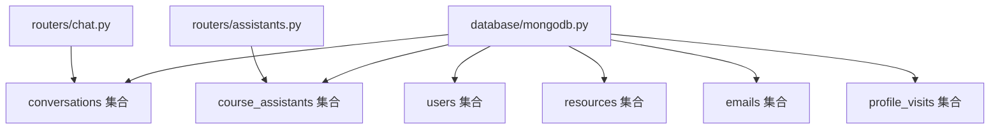

# MongoDB数据模型

<cite>
**本文引用的文件**
- [models/resource.py](file://models/resource.py)
- [models/user.py](file://models/user.py)
- [models/course_assistant.py](file://models/course_assistant.py)
- [models/email.py](file://models/email.py)
- [models/profile_visit.py](file://models/profile_visit.py)
- [routers/chat.py](file://routers/chat.py)
- [routers/assistants.py](file://routers/assistants.py)
- [database/mongodb.py](file://database/mongodb.py)
- [scripts/README_MIGRATIONS.md](file://scripts/README_MIGRATIONS.md)
</cite>

## 目录
1. [简介](#简介)
2. [项目结构](#项目结构)
3. [核心组件](#核心组件)
4. [架构总览](#架构总览)
5. [详细组件分析](#详细组件分析)
6. [依赖分析](#依赖分析)
7. [性能考量](#性能考量)
8. [故障排查指南](#故障排查指南)
9. [结论](#结论)
10. [附录](#附录)

## 简介
本文件面向MongoDB数据模型的设计与实现，聚焦以下模型与功能域：
- Resource模型：文档资源的元数据、状态与版本控制
- User模型：用户身份、角色、权限与资料扩展
- CourseAssistant模型：课程助手的配置、参数与状态
- Chat模型：对话历史、消息存储、上下文维护与会话状态
- Email模型：邮件系统集成、模板化发送与状态跟踪
- ProfileVisit模型：用户公开资料访问记录与行为分析

同时，文档涵盖索引设计、查询优化、性能考虑、数据迁移策略与版本兼容性处理，并提供可视化图表与示例数据说明。

## 项目结构
本项目的MongoDB数据模型由“Pydantic模型”和“FastAPI路由层”共同驱动，实际持久化通过数据库适配层完成。核心关系如下：
- Pydantic模型定义数据结构与校验规则
- FastAPI路由层负责业务流程编排与集合访问
- 数据库适配层提供集合获取与连接管理

**图表来源**
- [models/resource.py:1-90](file://models/resource.py#L1-L90)
- [models/user.py:1-157](file://models/user.py#L1-L157)
- [models/course_assistant.py:1-77](file://models/course_assistant.py#L1-L77)
- [models/email.py:1-104](file://models/email.py#L1-L104)
- [models/profile_visit.py:1-32](file://models/profile_visit.py#L1-L32)
- [routers/chat.py:1-800](file://routers/chat.py#L1-L800)
- [routers/assistants.py:1-127](file://routers/assistants.py#L1-L127)
- [database/mongodb.py:1-800](file://database/mongodb.py#L1-L800)

**章节来源**
- [models/resource.py:1-90](file://models/resource.py#L1-L90)
- [models/user.py:1-157](file://models/user.py#L1-L157)
- [models/course_assistant.py:1-77](file://models/course_assistant.py#L1-L77)
- [models/email.py:1-104](file://models/email.py#L1-L104)
- [models/profile_visit.py:1-32](file://models/profile_visit.py#L1-L32)
- [routers/chat.py:1-800](file://routers/chat.py#L1-L800)
- [routers/assistants.py:1-127](file://routers/assistants.py#L1-L127)
- [database/mongodb.py:1-800](file://database/mongodb.py#L1-L800)

## 核心组件
本节概述各模型的核心字段、数据类型与约束，便于快速理解数据结构。

- Resource（资源）
  - 关键字段：id、title、description、file_path、file_type、file_size、url、thumbnail_url、cover_image、assistant_id、uploader_id、status、is_public、tags、schema_version、created_at、updated_at
  - 数据类型：字符串、布尔、整数、枚举、列表、日期时间
  - 约束：URL格式校验、状态枚举、标签列表、版本号
  - 示例用途：文档上传、外部链接资源、封面图、公开/私有控制

- User（用户）
  - 关键字段：id、username、email、full_name、user_type、student_id、class_name、grade、is_online、last_seen、created_at、is_active、role、max_assistants、max_documents、assistant_ids、viewable_assistant_ids、avatar_url、细粒度权限字段、资料扩展字段、资料可见性
  - 数据类型：字符串、枚举、列表、字典、日期时间
  - 约束：邮箱格式校验（含本地域名）、角色枚举、权限开关与范围
  - 示例用途：身份认证、权限控制、资料展示与隐私设置

- CourseAssistant（课程助手）
  - 关键字段：id、name、description、system_prompt、collection_name、is_default、greeting_message、quick_prompts、inference_model、embedding_model、icon_url、created_at、updated_at
  - 数据类型：字符串、布尔、列表、日期时间
  - 约束：名称长度与非空校验、集合名规范（字母、数字、下划线、连字符，长度限制）
  - 示例用途：助手配置、推理与向量化模型绑定、默认助手标识

- Chat（对话与消息）
  - 关键实体：Conversation（对话）、ChatMessage（消息）、请求模型（创建、更新、添加消息、深度研究）
  - 数据类型：字符串、列表、字典、日期时间
  - 示例用途：消息存储、上下文截断、标题自动生成、流式响应

- Email（邮件）
  - 关键实体：EmailAttachment、EmailCreate、EmailDraftCreate、EmailResponse、EmailListItem、EmailListResponse、BatchEmailCreate
  - 数据类型：字符串、枚举、列表、字典、日期时间
  - 约束：收件人设置互斥校验（用户ID或用户类型）
  - 示例用途：点对点/批量发送、优先级、草稿与状态管理

- ProfileVisit（访问记录）
  - 关键字段：visitor_id、visited_user_id、visited_at、ip_address
  - 数据类型：字符串、日期时间
  - 示例用途：访问统计、行为分析、访客列表

**章节来源**
- [models/resource.py:8-90](file://models/resource.py#L8-L90)
- [models/user.py:8-157](file://models/user.py#L8-L157)
- [models/course_assistant.py:8-77](file://models/course_assistant.py#L8-L77)
- [routers/chat.py:20-800](file://routers/chat.py#L20-L800)
- [models/email.py:7-104](file://models/email.py#L7-L104)
- [models/profile_visit.py:7-32](file://models/profile_visit.py#L7-L32)

## 架构总览
MongoDB集合与模型映射关系如下：

**图表来源**
- [models/user.py:8-157](file://models/user.py#L8-L157)
- [models/course_assistant.py:8-77](file://models/course_assistant.py#L8-L77)
- [routers/chat.py:29-800](file://routers/chat.py#L29-L800)
- [models/resource.py:8-90](file://models/resource.py#L8-L90)
- [models/email.py:15-104](file://models/email.py#L15-L104)
- [models/profile_visit.py:7-32](file://models/profile_visit.py#L7-L32)

## 详细组件分析

### Resource 模型
- 字段与类型
  - 标识与元数据：id、title、description、file_path、file_type、file_size、url、thumbnail_url、cover_image、assistant_id、uploader_id、created_at、updated_at
  - 状态与可见性：status（枚举：active/down/deleted）、is_public（布尔）、tags（数组）
  - 版本控制：schema_version（整数）
- 校验规则
  - URL格式校验（独立函数与请求模型字段校验器）
  - 标签列表为空默认值
- 使用场景
  - 文档上传与去重（基于file_hash）
  - 资源分享与公开控制
  - 版本迁移与兼容性处理

**图表来源**
- [models/resource.py:8-90](file://models/resource.py#L8-L90)

**章节来源**
- [models/resource.py:8-90](file://models/resource.py#L8-L90)
- [database/mongodb.py:338-791](file://database/mongodb.py#L338-L791)

### User 模型
- 字段与类型
  - 基本信息：id、username、email、full_name、user_type、student_id、class_name、grade、avatar_url
  - 在线与时间：is_online、last_seen、created_at
  - 身份与权限：is_active、role（枚举）、max_assistants、max_documents、assistant_ids、viewable_assistant_ids
  - 细粒度权限：助手/文档/资源/标签管理权限、基础提示词编辑、邮件发送权限
  - 资料扩展：research_fields、education、work_experience、publications、skills、interests、personality、bio、contact_info、profile_visibility（枚举）、college、major
- 校验规则
  - 邮箱格式校验（支持本地域名）
- 使用场景
  - 身份认证与授权
  - 管理员权限控制
  - 用户资料展示与隐私设置

**图表来源**
- [models/user.py:8-157](file://models/user.py#L8-L157)

**章节来源**
- [models/user.py:8-157](file://models/user.py#L8-L157)

### CourseAssistant 模型
- 字段与类型
  - 基本配置：id、name、description、system_prompt、collection_name、is_default、greeting_message、quick_prompts、icon_url、created_at、updated_at
  - 模型参数：inference_model、embedding_model
- 校验规则
  - 名称非空与长度限制
  - 集合名规范（字母、数字、下划线、连字符，长度限制）
- 使用场景
  - 助手注册与配置
  - 默认助手标识
  - Qdrant集合绑定

**图表来源**
- [models/course_assistant.py:8-77](file://models/course_assistant.py#L8-L77)

**章节来源**
- [models/course_assistant.py:8-77](file://models/course_assistant.py#L8-L77)
- [routers/assistants.py:17-127](file://routers/assistants.py#L17-L127)

### Chat 模型（对话历史）
- 关键实体
  - Conversation：id、user_id、title、messages（数组，元素为ChatMessage）、created_at、updated_at
  - ChatMessage：role（枚举："user"|"assistant"）、content、timestamp、sources、recommended_resources
  - 请求模型：ConversationCreate、ConversationUpdate、MessageAdd、MessageUpdate、DeepResearchRequest、ChatRequest
- 上下文与状态
  - 对话列表与详情查询
  - 消息追加与更新（仅用户消息可编辑）
  - 重新生成回答（删除后续消息并触发再生成）
  - 标题自动生成（基于最近消息）
- 使用场景
  - 匿名与认证模式下的对话管理
  - 流式响应与断连检测
  - RAG增强检索与来源返回

**图表来源**
- [routers/chat.py:623-760](file://routers/chat.py#L623-L760)

**章节来源**
- [routers/chat.py:20-800](file://routers/chat.py#L20-L800)

### Email 模型（邮件系统）
- 关键实体
  - EmailAttachment：filename、file_path、file_size、content_type
  - EmailCreate：收件人设置互斥校验（to_user_ids 或 to_user_type）
  - EmailDraftCreate：草稿创建
  - EmailResponse：完整邮件响应（含状态、附件、优先级）
  - EmailListItem：列表项（含folder、is_read）
  - EmailListResponse：列表分页与统计
  - BatchEmailCreate：管理员批量发送
- 使用场景
  - 点对点与批量发送
  - 草稿与状态管理
  - 优先级与关系邀请关联

**图表来源**
- [models/email.py:15-104](file://models/email.py#L15-L104)

**章节来源**
- [models/email.py:7-104](file://models/email.py#L7-L104)

### ProfileVisit 模型（访问记录）
- 字段与类型
  - visitor_id、visited_user_id、visited_at、ip_address
- 使用场景
  - 访客列表与统计
  - 行为分析与隐私控制

**图表来源**
- [models/profile_visit.py:7-32](file://models/profile_visit.py#L7-L32)

**章节来源**
- [models/profile_visit.py:7-32](file://models/profile_visit.py#L7-L32)

## 依赖分析
- 模型到集合的映射
  - users → 用户集合
  - course_assistants → 助手集合
  - conversations → 对话集合
  - resources → 资源集合
  - emails → 邮件集合
  - profile_visits → 访问记录集合
- 路由层依赖
  - 聊天路由依赖MongoDB集合进行对话与消息管理
  - 助手路由依赖MongoDB集合进行助手列表与详情查询
- 数据库适配层
  - 提供集合获取、连接池配置与连接生命周期管理

**图表来源**
- [routers/chat.py:152-456](file://routers/chat.py#L152-L456)
- [routers/assistants.py:40-127](file://routers/assistants.py#L40-L127)
- [database/mongodb.py:196-201](file://database/mongodb.py#L196-L201)

**章节来源**
- [routers/chat.py:152-456](file://routers/chat.py#L152-L456)
- [routers/assistants.py:40-127](file://routers/assistants.py#L40-L127)
- [database/mongodb.py:196-201](file://database/mongodb.py#L196-L201)

## 性能考量
- 连接池与超时
  - 连接池参数：maxPoolSize、minPoolSize、maxIdleTimeMS、serverSelectionTimeoutMS、connectTimeoutMS、socketTimeoutMS
  - 作用：提升高并发下的连接复用与稳定性
- 查询优化
  - 集合索引：迁移脚本中包含MongoDB索引创建步骤（迁移ID 001）
  - 分页与排序：路由层普遍采用skip/limit与按时间倒序排序
- 流式响应
  - 聊天接口支持SSE流式输出，并内置断连检测以减少资源浪费
- 写入策略
  - 对话消息采用追加写入（$push）与更新时间戳（$set），避免全量替换
- 并发与一致性
  - 异步客户端（motor）与同步客户端（pymongo）分离使用，分别满足高并发与批处理需求

**章节来源**
- [database/mongodb.py:122-151](file://database/mongodb.py#L122-L151)
- [routers/chat.py:744-752](file://routers/chat.py#L744-L752)
- [routers/chat.py:278-284](file://routers/chat.py#L278-L284)

## 故障排查指南
- 连接问题
  - 确认MONGODB_URI/MONGODB_HOST等环境变量配置正确
  - 查看连接池参数与超时设置是否合理
- 索引创建失败
  - 检查索引名称冲突、字段存在性与权限
- 迁移失败
  - 查看migration_history集合中的错误记录
  - 在测试环境先行验证迁移脚本
- 聊天流式中断
  - 检查客户端断连检测逻辑与SSE配置
  - 关注异常捕获与日志输出

**章节来源**
- [database/mongodb.py:154-184](file://database/mongodb.py#L154-L184)
- [scripts/README_MIGRATIONS.md:115-134](file://scripts/README_MIGRATIONS.md#L115-L134)
- [routers/chat.py:720-752](file://routers/chat.py#L720-L752)

## 结论
本MongoDB数据模型围绕“资源、用户、助手、对话、邮件、访问记录”六大主题构建，结合Pydantic模型的强类型与校验能力，配合FastAPI路由层的业务编排与数据库适配层的高性能连接池，形成一套可扩展、可迁移、可维护的数据体系。通过索引与查询优化、流式响应与断连检测、以及完善的迁移与故障排查机制，能够支撑从教学到研究的多样化应用场景。

## 附录
- 示例数据（字段示意）
  - Resource：title、file_type、file_size、status、is_public、tags、schema_version
  - User：username、email、role、assistant_ids、profile_visibility
  - CourseAssistant：name、system_prompt、collection_name、is_default
  - Conversation：title、messages（role/content/timestamp/sources/recommended_resources）
  - Email：subject、content、attachments、priority、status
  - ProfileVisit：visited_user_id、visited_at、ip_address
- 迁移与版本兼容
  - 迁移脚本说明与历史记录：migration_history集合
  - 资源模型版本迁移：schema_version字段补齐与默认值填充
  - 用户模型字段迁移：新增字段默认值补全

**章节来源**
- [scripts/README_MIGRATIONS.md:1-135](file://scripts/README_MIGRATIONS.md#L1-L135)
- [database/mongodb.py:968-1000](file://database/mongodb.py#L968-L1000)