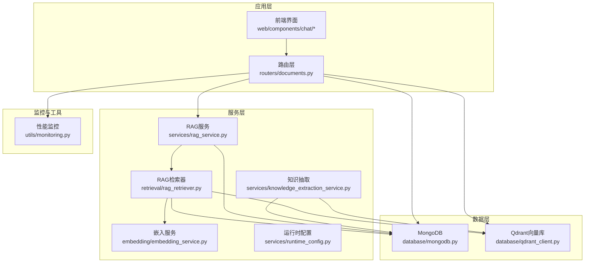
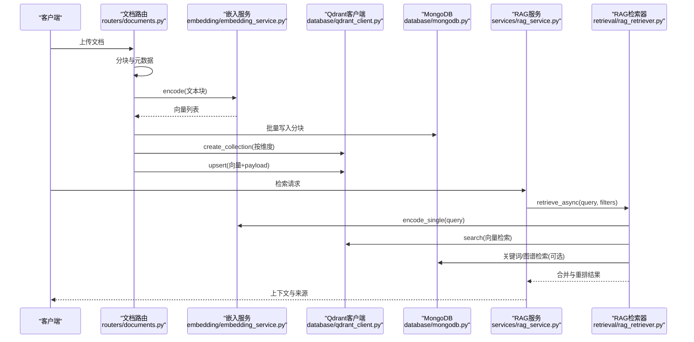
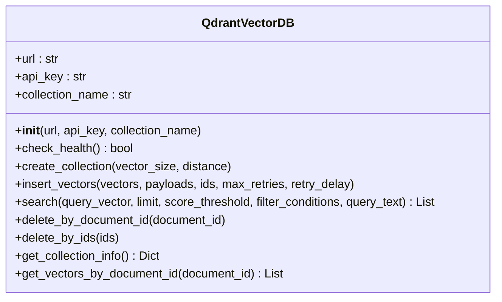
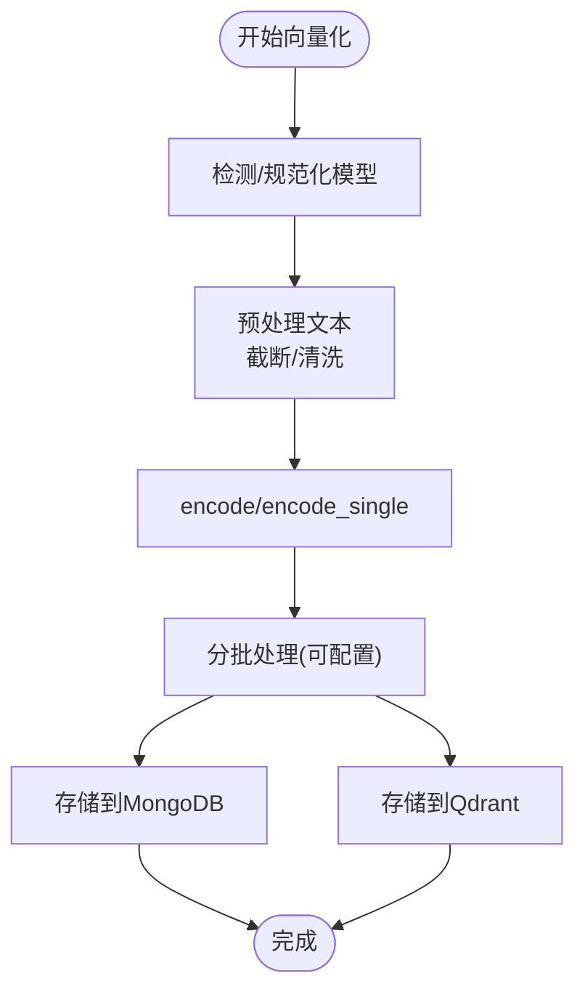
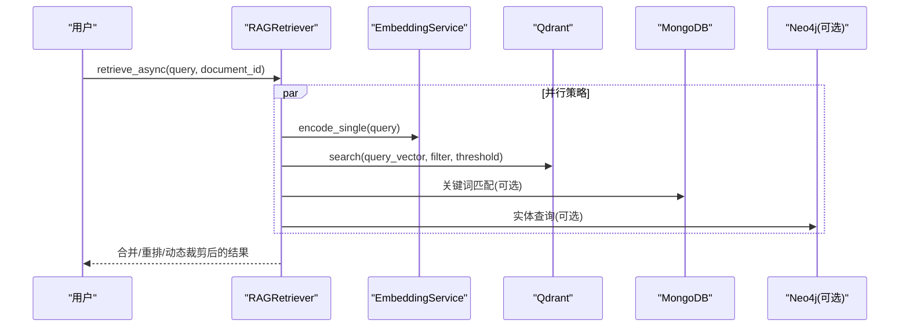
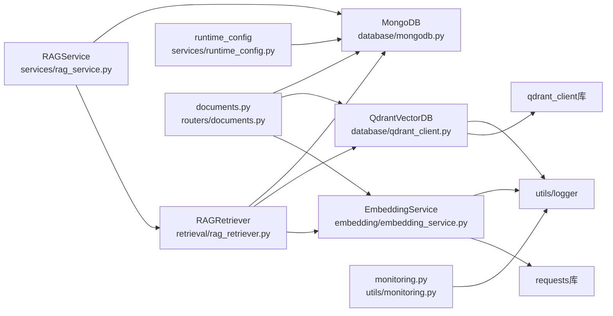

# 向量数据库设计

<cite>
**本文引用的文件**
- [database/qdrant_client.py](file://database/qdrant_client.py)
- [embedding/embedding_service.py](file://embedding/embedding_service.py)
- [retrieval/rag_retriever.py](file://retrieval/rag_retriever.py)
- [services/rag_service.py](file://services/rag_service.py)
- [routers/documents.py](file://routers/documents.py)
- [utils/monitoring.py](file://utils/monitoring.py)
- [services/runtime_config.py](file://services/runtime_config.py)
- [database/mongodb.py](file://database/mongodb.py)
- [services/knowledge_extraction_service.py](file://services/knowledge_extraction_service.py)
</cite>

## 目录
1. [简介](#简介)
2. [项目结构](#项目结构)
3. [核心组件](#核心组件)
4. [架构总览](#架构总览)
5. [详细组件分析](#详细组件分析)
6. [依赖关系分析](#依赖关系分析)
7. [性能考量](#性能考量)
8. [故障排除指南](#故障排除指南)
9. [结论](#结论)
10. [附录](#附录)

## 简介
本文件面向向量数据库的设计与实现，聚焦于Qdrant向量数据库的配置与初始化、集合管理与索引设置、嵌入向量生成与管理、向量检索机制、索引优化策略、数据生命周期管理、查询示例与性能基准、监控指标与故障排除，以及与传统数据库的集成与数据同步策略。文档以代码为依据，结合可视化图表帮助读者快速理解整体架构与关键流程。

## 项目结构
本项目采用模块化分层设计：
- 数据层：MongoDB（文档与分块）、Qdrant（向量存储）
- 服务层：嵌入服务、RAG检索与服务、运行时配置、知识抽取
- 路由层：文档处理与入库流程
- 工具层：性能监控、日志、令牌估算与截断

**图表来源**
- [routers/documents.py:500-699](file://routers/documents.py#L500-L699)
- [retrieval/rag_retriever.py:71-137](file://retrieval/rag_retriever.py#L71-L137)
- [services/rag_service.py:34-126](file://services/rag_service.py#L34-L126)
- [database/qdrant_client.py:18-123](file://database/qdrant_client.py#L18-L123)
- [database/mongodb.py:92-204](file://database/mongodb.py#L92-L204)
- [utils/monitoring.py:13-115](file://utils/monitoring.py#L13-L115)

**章节来源**
- [routers/documents.py:500-699](file://routers/documents.py#L500-L699)
- [database/qdrant_client.py:18-123](file://database/qdrant_client.py#L18-L123)
- [database/mongodb.py:92-204](file://database/mongodb.py#L92-L204)

## 核心组件
- QdrantVectorDB：封装Qdrant客户端，负责连接、健康检查、集合创建/重建、向量插入、检索、删除与集合信息查询。
- EmbeddingService：封装Ollama嵌入服务，负责文本向量化、模型检测与规范化、批量编码与维度探测。
- RAGRetriever：混合检索器，整合向量检索、关键词检索、图谱检索与重排，支持动态裁剪与并发。
- RAGService：高层RAG服务，协调检索与上下文拼接、邻居扩展、去重与资源推荐。
- 运行时配置：MongoDB持久化的运行时配置，支持模块开关与参数调整。
- 性能监控：统一的请求耗时与系统资源监控。

**章节来源**
- [database/qdrant_client.py:18-544](file://database/qdrant_client.py#L18-L544)
- [embedding/embedding_service.py:8-333](file://embedding/embedding_service.py#L8-L333)
- [retrieval/rag_retriever.py:17-393](file://retrieval/rag_retriever.py#L17-L393)
- [services/rag_service.py:8-323](file://services/rag_service.py#L8-L323)
- [services/runtime_config.py:129-218](file://services/runtime_config.py#L129-L218)
- [utils/monitoring.py:13-185](file://utils/monitoring.py#L13-L185)

## 架构总览
整体流程从文档入库开始：分块、向量化、存储到MongoDB与Qdrant；查询时通过RAG服务与检索器进行混合检索，最终拼接上下文返回。

**图表来源**
- [routers/documents.py:500-699](file://routers/documents.py#L500-L699)
- [embedding/embedding_service.py:292-318](file://embedding/embedding_service.py#L292-L318)
- [database/qdrant_client.py:140-217](file://database/qdrant_client.py#L140-L217)
- [services/rag_service.py:34-126](file://services/rag_service.py#L34-L126)
- [retrieval/rag_retriever.py:89-137](file://retrieval/rag_retriever.py#L89-L137)

## 详细组件分析

### Qdrant向量数据库客户端
- 连接与初始化
  - 优先使用gRPC连接（端口6334），避免Windows上httpx的502问题；支持HTTP/HTTPS自动切换。
  - 自动过滤API key与不安全连接的警告；本地HTTP连接自动忽略API key。
  - 连接超时、重试与健康检查，失败时自动回退与提示。
- 集合管理
  - create_collection：若集合存在且维度不匹配则重建；否则跳过或创建。
  - get_collection_info：返回集合点数与名称。
- 向量插入
  - insert_vectors：批量upsert，自动UUID ID生成与转换；维度不匹配时自动重建集合；支持指数退避重试。
- 检索
  - search：支持过滤条件、阈值与动态集合创建；返回包含id、score、payload。
- 删除与查询
  - delete_by_document_id/delete_by_ids：按文档ID或ID列表删除。
  - get_vectors_by_document_id：滚动查询指定文档的所有向量与payload。

**图表来源**
- [database/qdrant_client.py:18-544](file://database/qdrant_client.py#L18-L544)

**章节来源**
- [database/qdrant_client.py:18-544](file://database/qdrant_client.py#L18-L544)

### 嵌入向量生成与管理
- 模型选择与检测
  - 优先使用环境变量指定的模型；若未指定则自动扫描Ollama模型列表，匹配包含“embedding”等关键词的模型。
  - 支持模型名称规范化（处理标签如:latest）。
- 文本预处理
  - 截断过长文本（默认约2000字符，可通过环境变量覆盖），移除空字符，避免上下文超限。
- 向量计算
  - encode/encode_single：批量与单条向量化；支持重试与超时控制；首次调用探测向量维度。
- 批量插入策略
  - 文档入库流程中分批向量化（默认批大小可由运行时配置覆盖），分批写入MongoDB与Qdrant，保证内存与网络压力可控。

**图表来源**
- [embedding/embedding_service.py:107-154](file://embedding/embedding_service.py#L107-L154)
- [embedding/embedding_service.py:175-290](file://embedding/embedding_service.py#L175-L290)
- [routers/documents.py:519-551](file://routers/documents.py#L519-L551)

**章节来源**
- [embedding/embedding_service.py:8-333](file://embedding/embedding_service.py#L8-L333)
- [routers/documents.py:500-699](file://routers/documents.py#L500-L699)

### 向量检索实现机制
- 检索策略
  - 并行执行向量检索、关键词检索、图谱检索（可选）。
  - 向量检索：使用查询向量在Qdrant中检索，支持按document_id过滤与阈值筛选。
  - 关键词检索：在MongoDB中按文档ID过滤匹配，简单关键词交集评分。
  - 图谱检索：抽取查询实体，查询Neo4j图谱并构造知识文本。
- 结果融合与重排
  - 向量结果为基础，关键词结果提升分数，图谱结果作为补充；可选CrossEncoder重排，动态裁剪k。
- 动态参数
  - 根据查询特征（对比/列举/条款）在线调整prefetch_k与final_k。

**图表来源**
- [retrieval/rag_retriever.py:89-137](file://retrieval/rag_retriever.py#L89-L137)
- [retrieval/rag_retriever.py:176-204](file://retrieval/rag_retriever.py#L176-L204)
- [retrieval/rag_retriever.py:206-240](file://retrieval/rag_retriever.py#L206-L240)
- [retrieval/rag_retriever.py:242-326](file://retrieval/rag_retriever.py#L242-L326)

**章节来源**
- [retrieval/rag_retriever.py:17-393](file://retrieval/rag_retriever.py#L17-L393)

### 索引优化策略
- 连接与协议
  - 优先gRPC（端口6334）替代HTTP，避免Windows httpx 502问题，提升连接复用与性能。
- 超时与重试
  - 可配置超时与指数退避重试，增强稳定性。
- 集合维度一致性
  - 自动检测与重建集合，确保向量维度一致，避免维度错误导致的插入失败。
- 运行时参数
  - 通过运行时配置调整嵌入批大小、并发度等，平衡吞吐与延迟。

**章节来源**
- [database/qdrant_client.py:66-123](file://database/qdrant_client.py#L66-L123)
- [services/runtime_config.py:25-32](file://services/runtime_config.py#L25-L32)

### 向量数据生命周期管理
- 创建与更新
  - 文档入库时创建Qdrant集合（按向量维度），批量upsert向量与payload。
- 删除
  - 支持按document_id或ID列表删除；集合不存在时优雅忽略。
- 压缩与维护
  - 代码未显式实现压缩策略；可结合外部运维手段或Qdrant内置策略进行维护。

**章节来源**
- [routers/documents.py:606-699](file://routers/documents.py#L606-L699)
- [database/qdrant_client.py:415-443](file://database/qdrant_client.py#L415-L443)

### 查询示例与性能基准
- 查询示例
  - 向量检索：提供查询向量、过滤条件、阈值与返回数量。
  - 混合检索：检索器支持向量+关键词+图谱+重排的组合。
- 性能基准
  - 项目未提供固定基准测试；前端侧提供RAG评测面板，展示检索耗时、响应时间、首token耗时等指标，可用于评估与告警。

**章节来源**
- [database/qdrant_client.py:336-413](file://database/qdrant_client.py#L336-L413)
- [retrieval/rag_retriever.py:89-137](file://retrieval/rag_retriever.py#L89-L137)
- [web/components/chat/RAGEvaluationPanel.tsx:31-120](file://web/components/chat/RAGEvaluationPanel.tsx#L31-L120)

### 监控指标与故障排除
- 监控指标
  - 请求耗时统计（均值、P50/P95/P99）、错误计数、CPU/内存/磁盘使用率。
- 故障排除
  - Qdrant连接失败自动重试与回退；本地HTTP连接自动忽略API key；集合不存在时自动创建。
  - MongoDB连接失败时首次请求重试并返回503；嵌入服务超时/连接错误支持递增等待重试。

**章节来源**
- [utils/monitoring.py:13-185](file://utils/monitoring.py#L13-L185)
- [database/qdrant_client.py:97-123](file://database/qdrant_client.py#L97-L123)
- [database/mongodb.py:191-223](file://database/mongodb.py#L191-L223)
- [embedding/embedding_service.py:259-287](file://embedding/embedding_service.py#L259-L287)

### 与传统数据库的集成与数据同步
- MongoDB
  - 存储文档元数据、分块与处理进度；与Qdrant互补，提供结构化与非结构化数据的统一管理。
- 知识抽取与图谱
  - 通过知识抽取服务将文本三元组写入Neo4j，检索时可作为补充上下文。
- 同步策略
  - 文档入库：先写MongoDB分块，再批量写Qdrant向量；失败时记录临时ID并继续流程，保证幂等与可恢复。

**章节来源**
- [services/knowledge_extraction_service.py:147-228](file://services/knowledge_extraction_service.py#L147-L228)
- [routers/documents.py:630-699](file://routers/documents.py#L630-L699)

## 依赖关系分析

**图表来源**
- [database/qdrant_client.py:1-16](file://database/qdrant_client.py#L1-L16)
- [embedding/embedding_service.py:1-6](file://embedding/embedding_service.py#L1-L6)
- [retrieval/rag_retriever.py:1-12](file://retrieval/rag_retriever.py#L1-L12)
- [services/rag_service.py:1-6](file://services/rag_service.py#L1-L6)
- [services/runtime_config.py:1-9](file://services/runtime_config.py#L1-L9)
- [routers/documents.py:1-12](file://routers/documents.py#L1-L12)
- [utils/monitoring.py:1-11](file://utils/monitoring.py#L1-L11)

**章节来源**
- [database/qdrant_client.py:1-16](file://database/qdrant_client.py#L1-L16)
- [embedding/embedding_service.py:1-6](file://embedding/embedding_service.py#L1-L6)
- [retrieval/rag_retriever.py:1-12](file://retrieval/rag_retriever.py#L1-L12)
- [services/rag_service.py:1-6](file://services/rag_service.py#L1-L6)
- [services/runtime_config.py:1-9](file://services/runtime_config.py#L1-L9)
- [routers/documents.py:1-12](file://routers/documents.py#L1-L12)
- [utils/monitoring.py:1-11](file://utils/monitoring.py#L1-L11)

## 性能考量
- 连接与协议
  - 优先gRPC降低HTTP/httpx问题，提升连接复用与吞吐。
- 批处理与并发
  - 嵌入批大小与并发度可调；文档入库分批写入，避免内存峰值。
- 检索参数
  - 动态调整prefetch_k与final_k，结合重排与动态裁剪平衡召回与精度。
- 监控与告警
  - 请求耗时与系统资源监控，慢请求告警便于定位瓶颈。

[本节为通用指导，无需特定文件引用]

## 故障排除指南
- Qdrant连接失败
  - 自动重试与回退；本地HTTP自动忽略API key；集合不存在时自动创建。
- MongoDB连接失败
  - 首次请求重试；失败返回503；检查URI与认证配置。
- 嵌入服务超时/连接错误
  - 递增等待重试；超长文本截断；模型不存在时给出下载指引。
- 检索结果少或慢
  - 调整阈值、动态裁剪参数；检查图谱服务可用性；关注前端评测面板指标。

**章节来源**
- [database/qdrant_client.py:97-123](file://database/qdrant_client.py#L97-L123)
- [database/mongodb.py:191-223](file://database/mongodb.py#L191-L223)
- [embedding/embedding_service.py:259-287](file://embedding/embedding_service.py#L259-L287)
- [web/components/chat/RAGEvaluationPanel.tsx:31-120](file://web/components/chat/RAGEvaluationPanel.tsx#L31-L120)

## 结论
本设计以Qdrant为核心向量存储，结合MongoDB提供结构化元数据与分块管理，通过嵌入服务与运行时配置实现灵活的向量生成与检索策略。通过gRPC连接、批处理、动态参数与监控告警，系统在性能与稳定性方面具备良好表现。未来可在索引参数（如HNSW）与压缩策略上进一步细化，以满足更大规模场景的需求。

[本节为总结，无需特定文件引用]

## 附录
- 环境变量与配置要点
  - Qdrant：QDRANT_URL、QDRANT_API_KEY、QDRANT_TIMEOUT、QDRANT_GRPC_PORT
  - 嵌入：OLLAMA_BASE_URL、OLLAMA_EMBEDDING_MODEL、OLLAMA_EMBEDDING_MAX_CHARS
  - MongoDB：MONGODB_URI/MONGODB_HOST/MONGODB_PORT/MONGODB_USERNAME/MONGODB_PASSWORD/MONGODB_AUTH_SOURCE/MONGODB_DB_NAME
  - 运行时：ENABLE_RERANKER、RERANKER_MODEL、RERANKER_DEVICE、RERANKER_MAX_TOKENS、DYNK_MIN/DYNK_MAX/DYNK_GAP_HIGH/DYNK_GAP_LOW
  - 监控：性能监控端点与系统指标端点

[本节为概览，无需特定文件引用]