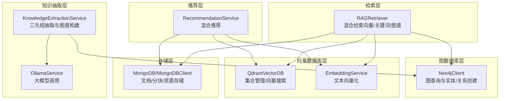
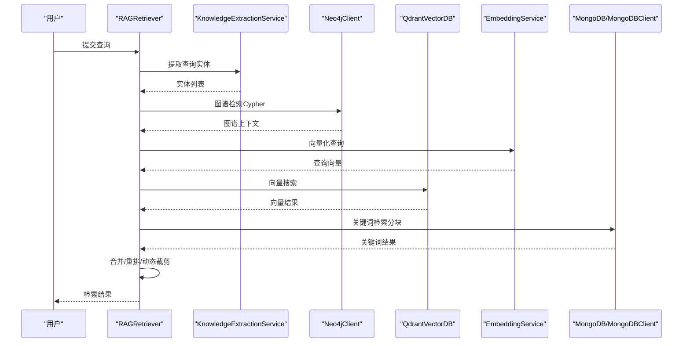
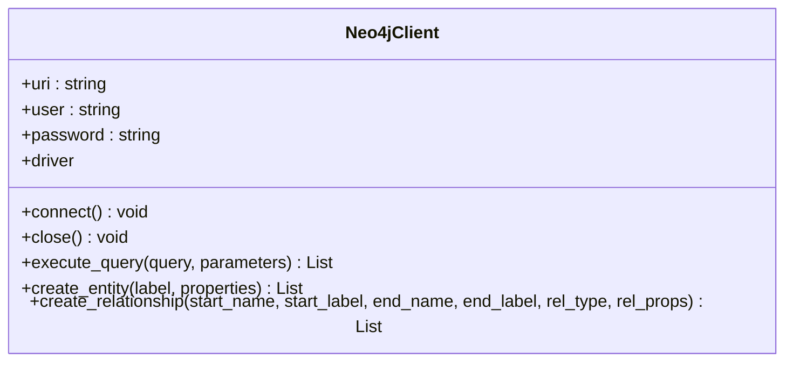
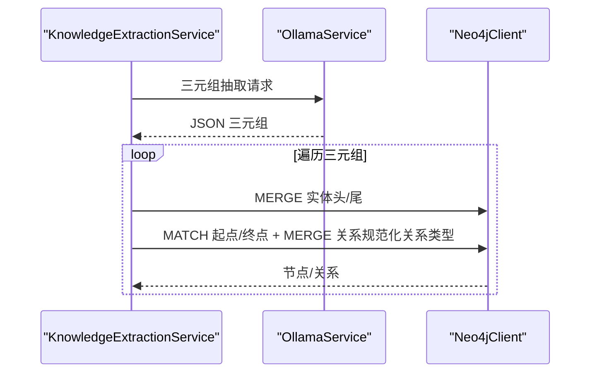
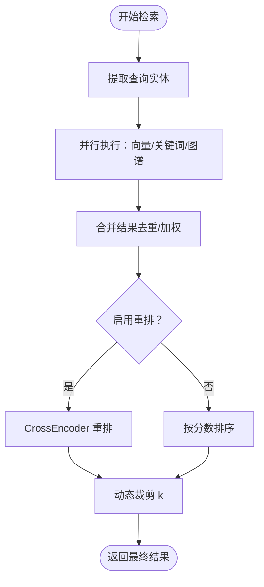
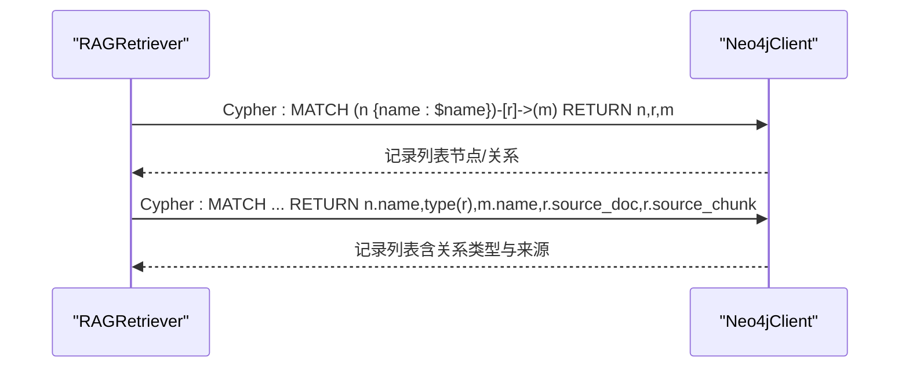
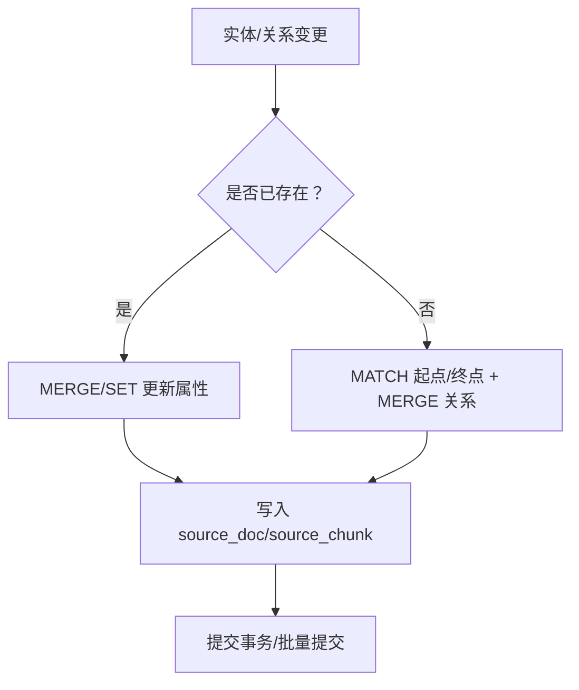
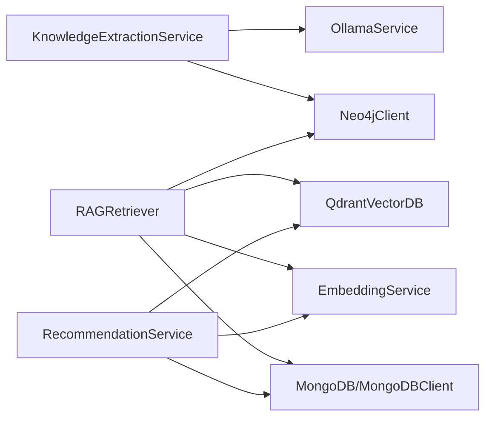

# 图数据库设计

<cite>
**本文档引用的文件**
- [database/neo4j_client.py](file://database/neo4j_client.py)
- [services/knowledge_extraction_service.py](file://services/knowledge_extraction_service.py)
- [retrieval/rag_retriever.py](file://retrieval/rag_retriever.py)
- [services/ollama_service.py](file://services/ollama_service.py)
- [database/qdrant_client.py](file://database/qdrant_client.py)
- [embedding/embedding_service.py](file://embedding/embedding_service.py)
- [database/mongodb.py](file://database/mongodb.py)
- [services/recommendation_service.py](file://services/recommendation_service.py)
</cite>

## 目录
1. [引言](#引言)
2. [项目结构](#项目结构)
3. [核心组件](#核心组件)
4. [架构概览](#架构概览)
5. [详细组件分析](#详细组件分析)
6. [依赖分析](#依赖分析)
7. [性能考量](#性能考量)
8. [故障排查指南](#故障排查指南)
9. [结论](#结论)
10. [附录](#附录)

## 引言
本文件面向图数据库设计与实现，围绕知识图谱构建、Cypher 查询、图数据维护与检索应用展开。项目采用 Neo4j 作为图数据库，结合 Ollama 的大模型能力进行实体与关系抽取，配合向量数据库 Qdrant 与 MongoDB 实现混合检索与资源管理。文档将从数据模型、查询模式、维护策略、性能优化与集成方案等方面进行全面阐述，并提供可视化图表与查询示例路径，帮助读者快速理解并落地图数据库设计。

## 项目结构
项目采用模块化设计，图数据库相关能力主要集中在以下模块：
- 图数据库客户端：Neo4j 客户端封装，提供连接、查询、实体与关系创建能力
- 知识抽取服务：基于大模型抽取三元组，构建知识图谱
- 检索器：混合检索（向量 + 关键词 + 图谱），支持重排与动态裁剪
- 向量数据库客户端：Qdrant 客户端封装，提供集合管理、向量插入与搜索
- 向量化服务：基于 Ollama 的嵌入模型，提供文本向量化
- MongoDB 客户端：提供文档与分块的持久化存储
- 推荐服务：基于关键词、标签与向量相似度的混合推荐

**图表来源**
- [database/neo4j_client.py:6-103](file://database/neo4j_client.py#L6-L103)
- [services/knowledge_extraction_service.py:12-228](file://services/knowledge_extraction_service.py#L12-L228)
- [retrieval/rag_retriever.py:17-393](file://retrieval/rag_retriever.py#L17-L393)
- [database/qdrant_client.py:18-544](file://database/qdrant_client.py#L18-L544)
- [embedding/embedding_service.py:8-333](file://embedding/embedding_service.py#L8-L333)
- [database/mongodb.py:92-204](file://database/mongodb.py#L92-L204)
- [services/recommendation_service.py:11-481](file://services/recommendation_service.py#L11-L481)

**章节来源**
- [database/neo4j_client.py:1-104](file://database/neo4j_client.py#L1-L104)
- [services/knowledge_extraction_service.py:1-229](file://services/knowledge_extraction_service.py#L1-L229)
- [retrieval/rag_retriever.py:1-393](file://retrieval/rag_retriever.py#L1-L393)
- [database/qdrant_client.py:1-544](file://database/qdrant_client.py#L1-L544)
- [embedding/embedding_service.py:1-333](file://embedding/embedding_service.py#L1-L333)
- [database/mongodb.py:1-800](file://database/mongodb.py#L1-L800)
- [services/recommendation_service.py:1-481](file://services/recommendation_service.py#L1-L481)

## 核心组件
- Neo4jClient：提供连接、Cypher 查询执行、实体创建（MERGE）、关系创建（MATCH + MERGE）能力
- KnowledgeExtractionService：基于大模型抽取三元组，规范化关系类型，将实体与关系写入 Neo4j
- RAGRetriever：混合检索器，支持向量检索、关键词检索与图谱检索，具备重排与动态裁剪
- QdrantVectorDB：向量数据库客户端，提供集合管理、向量插入、搜索与删除
- EmbeddingService：基于 Ollama 的嵌入模型，提供文本向量化
- MongoDB/MongoDBClient：提供文档、分块与资源的持久化存储
- RecommendationService：基于关键词、标签与向量相似度的混合推荐

**章节来源**
- [database/neo4j_client.py:6-103](file://database/neo4j_client.py#L6-L103)
- [services/knowledge_extraction_service.py:12-228](file://services/knowledge_extraction_service.py#L12-L228)
- [retrieval/rag_retriever.py:17-393](file://retrieval/rag_retriever.py#L17-L393)
- [database/qdrant_client.py:18-544](file://database/qdrant_client.py#L18-L544)
- [embedding/embedding_service.py:8-333](file://embedding/embedding_service.py#L8-L333)
- [database/mongodb.py:92-204](file://database/mongodb.py#L92-L204)
- [services/recommendation_service.py:11-481](file://services/recommendation_service.py#L11-L481)

## 架构概览
整体架构以知识抽取为核心，将抽取的实体与关系写入 Neo4j；同时通过向量数据库与 MongoDB 提供检索与存储支撑；RAG 检索器在检索阶段融合向量、关键词与图谱结果；推荐服务在资源层面提供混合推荐。

**图表来源**
- [retrieval/rag_retriever.py:89-137](file://retrieval/rag_retriever.py#L89-L137)
- [services/knowledge_extraction_service.py:107-145](file://services/knowledge_extraction_service.py#L107-L145)
- [database/neo4j_client.py:40-62](file://database/neo4j_client.py#L40-L62)
- [database/qdrant_client.py:336-413](file://database/qdrant_client.py#L336-L413)
- [embedding/embedding_service.py:292-318](file://embedding/embedding_service.py#L292-L318)
- [database/mongodb.py:793-800](file://database/mongodb.py#L793-L800)

## 详细组件分析

### Neo4jClient 组件分析
- 连接与容器适配：支持容器内 localhost 替换为 host.docker.internal，验证连接
- 查询执行：统一执行 Cypher，返回记录数据列表
- 实体创建：使用 MERGE 保证唯一性，设置属性并返回节点
- 关系创建：使用 MATCH + MERGE 确保起点与终点存在，创建关系并设置属性

**图表来源**
- [database/neo4j_client.py:6-103](file://database/neo4j_client.py#L6-L103)

**章节来源**
- [database/neo4j_client.py:16-101](file://database/neo4j_client.py#L16-L101)

### 知识抽取与图谱构建流程
- 三元组抽取：基于提示词模板，要求返回 JSON 格式三元组（头实体、关系、尾实体、类型）
- 实体提取：从查询中提取关键实体，用于图谱检索
- 图谱构建：规范化关系类型，MERGE 实体，MATCH + MERGE 关系，写入 source_doc/source_chunk 属性

**图表来源**
- [services/knowledge_extraction_service.py:36-212](file://services/knowledge_extraction_service.py#L36-L212)
- [services/ollama_service.py:50-92](file://services/ollama_service.py#L50-L92)
- [database/neo4j_client.py:64-101](file://database/neo4j_client.py#L64-L101)

**章节来源**
- [services/knowledge_extraction_service.py:147-212](file://services/knowledge_extraction_service.py#L147-L212)
- [services/ollama_service.py:1-674](file://services/ollama_service.py#L1-L674)

### RAG 检索器与图谱检索
- 并行策略：向量检索、关键词检索、图谱检索并行执行
- 图谱检索：提取查询实体，遍历实体一跳邻居，构造“实体-关系-实体”文本上下文，附加 source_doc/source_chunk 信息
- 合并与重排：向量/关键词结果按 chunk_id 去重合并，图谱结果独立加入，支持 CrossEncoder 重排与动态裁剪

**图表来源**
- [retrieval/rag_retriever.py:115-137](file://retrieval/rag_retriever.py#L115-L137)
- [retrieval/rag_retriever.py:242-326](file://retrieval/rag_retriever.py#L242-L326)
- [retrieval/rag_retriever.py:328-391](file://retrieval/rag_retriever.py#L328-L391)

**章节来源**
- [retrieval/rag_retriever.py:89-137](file://retrieval/rag_retriever.py#L89-L137)
- [retrieval/rag_retriever.py:242-326](file://retrieval/rag_retriever.py#L242-L326)

### Cypher 查询模式与路径查找
- 基础查询：查询实体及其一跳邻居，返回节点与关系属性
- 优化查询：显式返回关系类型与 source_doc/source_chunk，便于后续上下文拼接与过滤
- 示例路径：
  - [基础 Cypher 查询:257-260](file://retrieval/rag_retriever.py#L257-L260)
  - [优化 Cypher 查询:283-287](file://retrieval/rag_retriever.py#L283-L287)

**图表来源**
- [retrieval/rag_retriever.py:257-287](file://retrieval/rag_retriever.py#L257-L287)
- [database/neo4j_client.py:40-62](file://database/neo4j_client.py#L40-L62)

**章节来源**
- [retrieval/rag_retriever.py:242-326](file://retrieval/rag_retriever.py#L242-L326)

### 图数据维护策略
- 节点更新：使用 MERGE 保证唯一性，SET 属性增量更新
- 关系添加：MATCH 起点/终点 + MERGE 关系，SET 关系属性
- 结构优化：规范化关系类型（大写、下划线替换），避免非法字符；为关系添加 source_doc/source_chunk 便于溯源

**图表来源**
- [database/neo4j_client.py:64-101](file://database/neo4j_client.py#L64-L101)
- [services/knowledge_extraction_service.py:191-212](file://services/knowledge_extraction_service.py#L191-L212)

**章节来源**
- [database/neo4j_client.py:64-101](file://database/neo4j_client.py#L64-L101)
- [services/knowledge_extraction_service.py:191-212](file://services/knowledge_extraction_service.py#L191-L212)

### 图数据库在知识检索中的应用
- 语义搜索：向量检索与关键词检索为主
- 图谱检索：基于实体抽取与一跳邻居，生成“实体-关系-实体”上下文
- 推理查询：可扩展为路径查找（如最短路径、聚类系数等），当前实现聚焦一跳邻居
- 推荐系统：结合关键词匹配、标签匹配与向量相似度，提供混合推荐

**章节来源**
- [retrieval/rag_retriever.py:242-326](file://retrieval/rag_retriever.py#L242-L326)
- [services/recommendation_service.py:209-360](file://services/recommendation_service.py#L209-L360)

## 依赖分析
- Neo4jClient 依赖环境变量配置（URI、用户名、密码），支持容器内地址替换
- KnowledgeExtractionService 依赖 OllamaService 进行三元组抽取与实体提取
- RAGRetriever 依赖 Neo4jClient、QdrantVectorDB、EmbeddingService、MongoDB/MongoDBClient
- RecommendationService 依赖 MongoDB、QdrantVectorDB、EmbeddingService

**图表来源**
- [services/knowledge_extraction_service.py:8-10](file://services/knowledge_extraction_service.py#L8-L10)
- [retrieval/rag_retriever.py:8-11](file://retrieval/rag_retriever.py#L8-L11)
- [services/recommendation_service.py:3-6](file://services/recommendation_service.py#L3-L6)

**章节来源**
- [services/knowledge_extraction_service.py:1-229](file://services/knowledge_extraction_service.py#L1-L229)
- [retrieval/rag_retriever.py:1-393](file://retrieval/rag_retriever.py#L1-L393)
- [services/recommendation_service.py:1-481](file://services/recommendation_service.py#L1-L481)

## 性能考量
- 连接与容器适配：Neo4jClient 在容器内自动替换 localhost 为 host.docker.internal，避免 DNS 解析问题
- 异步与线程池：知识抽取与图谱构建使用 asyncio.to_thread，避免阻塞事件循环
- 重排与动态裁剪：RAGRetriever 支持 CrossEncoder 重排与动态 k 调整，平衡召回与精度
- 向量数据库优化：QdrantVectorDB 优先使用 gRPC 连接，支持连接复用与自动重试
- 向量化服务：EmbeddingService 对超长文本进行字符截断，避免上下文超限

**章节来源**
- [database/neo4j_client.py:16-38](file://database/neo4j_client.py#L16-L38)
- [services/knowledge_extraction_service.py:191-212](file://services/knowledge_extraction_service.py#L191-L212)
- [retrieval/rag_retriever.py:139-167](file://retrieval/rag_retriever.py#L139-L167)
- [database/qdrant_client.py:66-96](file://database/qdrant_client.py#L66-L96)
- [embedding/embedding_service.py:186-193](file://embedding/embedding_service.py#L186-L193)

## 故障排查指南
- Neo4j 连接失败：检查 URI、用户名、密码与容器内地址替换逻辑；查看日志中的连接错误
- 图谱构建失败：检查三元组 JSON 解析与关系规范化；关注连接冷却机制（失败后 5 分钟冷却）
- 检索失败：确认向量模型可用、Qdrant 集合存在与维度匹配；检查过滤条件与阈值设置
- 推荐失败：检查 MongoDB 连接、Qdrant 健康检查与向量搜索阈值

**章节来源**
- [database/neo4j_client.py:30-32](file://database/neo4j_client.py#L30-L32)
- [services/knowledge_extraction_service.py:160-171](file://services/knowledge_extraction_service.py#L160-L171)
- [database/qdrant_client.py:124-138](file://database/qdrant_client.py#L124-L138)
- [services/recommendation_service.py:173-176](file://services/recommendation_service.py#L173-L176)

## 结论
本项目以 Neo4j 为核心，结合大模型抽取、向量检索与混合推荐，构建了完整的知识图谱与检索体系。通过容器适配、异步线程池、重排与动态裁剪等手段，实现了高性能与可扩展的图数据库应用。未来可在图谱推理、关系权重与动态更新方面进一步增强，以满足更复杂的知识检索与推荐需求。

## 附录
- 环境变量与配置要点
  - Neo4j：NEO4J_URI、NEO4J_USER、NEO4J_PASSWORD、NEO4J_ENABLED
  - Ollama：OLLAMA_BASE_URL、OLLAMA_MODEL、OLLAMA_EMBEDDING_MODEL、OLLAMA_TIMEOUT
  - Qdrant：QDRANT_URL、QDRANT_API_KEY、QDRANT_TIMEOUT、QDRANT_GRPC_PORT
  - MongoDB：MONGODB_URI、MONGODB_HOST、MONGODB_PORT、MONGODB_DB_NAME
  - RAG：ENABLE_RERANKER、RERANKER_MODEL、RERANKER_DEVICE、DYNK_MIN、DYNK_MAX、DYNK_GAP_HIGH、DYNK_GAP_LOW

- 查询示例路径
  - [基础 Cypher 查询:257-260](file://retrieval/rag_retriever.py#L257-L260)
  - [优化 Cypher 查询:283-287](file://retrieval/rag_retriever.py#L283-L287)
  - [实体创建 MERGE:72-74](file://database/neo4j_client.py#L72-L74)
  - [关系创建 MATCH + MERGE:90-101](file://database/neo4j_client.py#L90-L101)